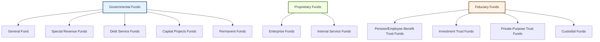

## 5.2 Governmental, Proprietary, Fiduciary Funds (Types and Major vs. Nonmajor Funds)

Effective financial reporting for state and local governments hinges on proper fund classification and clear understanding of the unique roles that each fund type serves. Under the Governmental Accounting Standards Board (GASB) framework, state and local governments organize their activities into separate accounting funds to enhance transparency, accountability, and comparability. This section discusses the three primary fund categories—Governmental, Proprietary, and Fiduciary Funds—emphasizing the nature of each category, examples of specific funds, and criteria for distinguishing between major and nonmajor funds.

-------------------------------------------------------------------------------
### Purpose and Overview of Fund Accounting
Fund accounting is designed to ensure that certain resources (often legally restricted) are used solely for their intended purposes. A fund is a self-balancing set of accounts reflecting the financial position and operating results of specific activities or objectives. By segregating resources, governments can track compliance with finance-related legal or contractual obligations and maintain accountability to the public and other stakeholders.

-------------------------------------------------------------------------------
### Governmental Funds
Governmental funds typically focus on activities financed primarily by tax revenues, grants, and other non-exchange transactions. They use the modified accrual basis of accounting and the current financial resources measurement focus. These funds are most frequently used to account for services provided to the community at large, such as public safety, education, and general government administration. Within governmental funds, five specific fund types are traditionally recognized:

1. General Fund  
   • The chief operating fund, accounting for a government’s primary day-to-day activities.  
   • Records revenues from property taxes, sales taxes, and other general resources.  
   • Encompasses expenditures for the general administration, police and fire protection, garbage collection, and other core public services.

2. Special Revenue Funds  
   • Used to account for revenues legally or administratively restricted for specific purposes.  
   • Examples include a fund dedicated to road maintenance financed by a special gas tax or a fund for library programs supported by specific grants.  
   • Ensures that resources remain devoted to the purpose designated by law or external restrictions.

3. Debt Service Funds  
   • Established to accumulate resources (often from property taxes or dedicated revenue streams) to pay principal and interest on general long-term debt.  
   • Helps local governments budget systematically for debt obligations over time.  
   • Enhances transparency by clearly disclosing the portion of local resources required for interest and debt repayment.

4. Capital Projects Funds  
   • Used to account for the acquisition or construction of major capital facilities (e.g., roads, bridges, buildings) when financed by bond proceeds, grants, or other dedicated sources.  
   • Ensures that financing and spending for large-scale, multi-year capital improvements remain distinct from regular operating activities.

5. Permanent Funds  
   • Report resources that are legally restricted to the extent that only earnings (not the principal) may be used for the benefit of the government or residents.  
   • Examples include an endowment for perpetual care of public parks, where only the interest or dividends may be used for park maintenance.  
   • The principal remains intact, with long-term investment strategies often employed to preserve the fund’s value.

-------------------------------------------------------------------------------
### Proprietary Funds
Proprietary funds account for activities that operate more like private-sector enterprises, using accrual-based accounting and the economic resources measurement focus. These funds recover the costs of goods or services primarily via user charges or fees. They include:

1. Enterprise Funds  
   • For activities in which the government provides goods or services to the general public.  
   • Examples include municipal utilities (water, sewer, electricity), public transit systems, and airports.  
   • Fees charged to customers are intended to cover the costs of operating, maintaining, and financing these services.

2. Internal Service Funds  
   • Account for services provided by one department or agency to other departments or agencies on a cost-reimbursement basis.  
   • Common examples include a central motor pool (vehicle maintenance) or a central information technology (IT) department that bills user departments for support services.  
   • Although an internal service fund is typically accounted for as a Proprietary Fund, it is usually reported in the Governmental Activities column at the government-wide level because its primary customers are internal to the government.

-------------------------------------------------------------------------------
### Fiduciary Funds
Fiduciary funds account for assets that are held by the government in a trustee or custodial capacity for individuals, private organizations, or other governmental entities. These resources cannot be used to support the government’s own programs but must be used only for the trust beneficiaries. Fiduciary funds employ the accrual basis of accounting and the economic resources measurement focus. The four primary types of Fiduciary Funds are:

1. Pension (and Other Employee Benefit) Trust Funds  
   • Hold resources for employee retirement plans, such as defined benefit and defined contribution pension plans, as well as other post-employment benefits (OPEB).  
   • Governments manage these funds on behalf of current and former employees.  
   • Key disclosures focus on funding levels, actuarial assumptions, and potential unfunded liabilities.

2. Investment Trust Funds  
   • Reflect the external portion of investment pools managed by a sponsoring government.  
   • An example is a state government’s external investment pool that invests resources on behalf of local governments.  
   • Earnings are credited to participating local governments on a prorated basis.

3. Private-Purpose Trust Funds  
   • Account for trust arrangements under which the principal and/or earnings benefit individuals, private organizations, or other governments.  
   • Examples include scholarship funds, escheat property funds, or trust arrangements for local charities.  
   • The government acts strictly as a custodian, ensuring compliance with trust provisions.

4. Custodial Funds  
   • Formerly known as Agency Funds (prior to GASB Statement No. 84, “Fiduciary Activities”), these funds hold assets temporarily on behalf of others.  
   • Common scenarios include taxes collected by one government on behalf of another or pass-through grants.  
   • Since resources do not belong to the government, these funds do not report a fund balance; instead, they reflect only net position if the fund meets the fiduciary criteria under GASB 84.

-------------------------------------------------------------------------------
### Visual Overview of Fund Types

Below is a Mermaid diagram illustrating the three primary fund categories and their sub-types:

This visual representation highlights the distinct classification of each fund category, facilitating better comprehension of the overall fund structure in governmental accounting.

-------------------------------------------------------------------------------
### Major vs. Nonmajor Funds
When preparing fund-level financial statements, governments must distinguish between major and nonmajor funds. Major funds receive their own column in the fund financial statements, whereas nonmajor funds can be aggregated into a single column. This presentation aims to promote transparency and ensure that large or financially significant funds are separately and clearly reported.

#### Criteria for Major Funds
Under GASB Statement No. 34, the principal criteria for determining major funds are:

• General Fund  
  • By default, the General Fund is always considered a major fund.  
• Special Revenue, Capital Projects, Debt Service, Enterprise Funds, or Permanent Funds  
  • Must meet both a 10% test and a 5% test of the corresponding total for all governmental or enterprise funds. Specifically:
    1. 10% Test:  
       – For governmental funds to be considered major, a fund’s total assets, liabilities, revenues, or expenditures/expenses must be at least 10% of the combined total for all governmental funds.  
       – For enterprise funds to be major, these line items should be 10% or more of the combined total for all enterprise funds.
    2. 5% Test:  
       – The same element (assets, liabilities, revenues, or expenditures/expenses) that satisfied the 10% test in Step 1 must also comprise at least 5% of the total for governmental and enterprise funds combined.  

Governments may also designate certain funds as major if they believe such classification would be more meaningful for financial statement users. Conversely, even if a fund meets the quantitative thresholds, governments may present it as nonmajor in rare cases if the fund’s significance has diminished or if separate reporting might be misleading.

-------------------------------------------------------------------------------
### Significance of Proper Fund Classification
Properly classifying funds as major or nonmajor has several key implications:

• Transparency  
  – Presenting major funds in separate columns highlights the material or essential activities of the government, improving user understanding.  
• Comparability  
  – Standardized thresholds ensure external stakeholders can compare financial statements across different governments.  
• Accountability  
  – Provides clarity on how each pool of resources is financed and utilized, ensuring compliance with laws or regulations linked to special revenue or other restricted funds.  
• Risk Management  
  – Identifying major funds related to high-value capital outlays or significant debt obligations guides better risk assessment and decision-making for stakeholders.

-------------------------------------------------------------------------------
### Examples and Use Cases
Below are illustrative scenarios that highlight how proper fund classification works in practice.

1. City of Lakeview – General Fund  
   • The General Fund accounts for the majority of the city’s activities (police, fire, administration).  
   • By default, it is classified as a major fund regardless of proportion to other funds.

2. City of Lakeview – Special Revenue Fund (Street Improvement Fund)  
   • Receives restricted fuel tax revenue dedicated to street maintenance and improvements.  
   • If fuel tax revenues are so large that they exceed 10% of the total revenues for all governmental funds and at least 5% of the total governmental plus enterprise funds’ revenues, it becomes a major fund and is separately reported.

3. Metropolitan Transit Enterprise Fund  
   • Operates the city’s bus service, collecting fares to cover operating costs.  
   • If the bus fares constitute a substantial portion of total enterprise fund revenues, surpassing the 10% and 5% thresholds, the Metropolitan Transit Fund must be reported as a major fund.

4. County Pension Trust Fund  
   • Manages retirement benefits for the county’s employees, with assets from both employer and employee contributions.  
   • As a Fiduciary Fund, it’s only reported in the Fiduciary Funds statements, separate from the government’s own operational resources.  
   • Although the concept of major vs. nonmajor funds does not typically apply to fiduciary activities in the same manner, robust disclosures remain critical.

-------------------------------------------------------------------------------
### Practical Insights and Common Pitfalls

• Overlooking Modified Accrual vs. Accrual  
  – Governmental funds (modified accrual basis) focus on current financial resources, while Proprietary and Fiduciary Funds (accrual basis) include long-term assets/liabilities. A common mistake is to mix up these bases and thus overstate or understate fund balances.  
• Misapplication of Major Fund Criteria  
  – Governments must apply both the 10% and 5% tests carefully. Neglecting the combined total for both governmental and enterprise funds is a frequent error that leads to misclassification.  
• Omission of Nonmajor Fund Disclosures  
  – While nonmajor funds are aggregated on the face of the financial statements, additional combining statements or schedules in the Comprehensive Annual Financial Report (CAFR) frequently provide detail. Failure to include these schedules can obscure critical data for stakeholders.  
• Inadequate Oversight of Internal Service Funds  
  – Although internal service funds are reported within Proprietary Funds, their results typically roll up into Governmental Activities in the government-wide statements. Insufficient attention to these details can lead to reconciliation errors.

-------------------------------------------------------------------------------
### Best Practices and Strategies

• Establish Clear Policies  
  – Develop written guidelines on how to apply major fund criteria to ensure consistency year over year.  
• Perform Annual Reviews  
  – Since financial positions change, re-classify or confirm fund status each year based on the updated financial information.  
• Cross-Functional Collaboration  
  – Work closely with each department to gather accurate data on fund revenues, expenditures, and other metrics needed for major fund determination.  
• Employ Fund-Specific Budgetary Tools  
  – Use specialized budgeting and accounting systems that facilitate real-time tracking of fund activities, ensuring smooth year-end classification.  
• Document Rationale  
  – If a fund is designated as major or nonmajor contrary to purely quantitative thresholds, document the reasoning thoroughly in the notes or supplemental schedules.

-------------------------------------------------------------------------------
### Additional Case Study

#### City of Greenfield
Background:  
• The City manages 12 governmental funds, of which four (including the General Fund) appear to be quite large.  
• It also operates 3 enterprise funds: water, sewer, and solid waste.  
• In the prior year, water fund revenues alone were 11% of the total enterprise fund revenues and 6% of combined government-wide (governmental + enterprise) revenues.

Major Fund Determination:  
• General Fund – Always major.  
• Street Improvement Fund (Special Revenue) – Total revenues are 15% of all governmental funds, 9% of total governmental + enterprise, so it meets the major fund criteria.  
• Water Fund (Enterprise Fund) – Exceeds the 10% and 5% thresholds described, so it is also major.  
• Sewer Fund (Enterprise Fund) – 8% of enterprise fund revenues, 4% of combined, so it does not meet the threshold. Therefore, it is reported as nonmajor (though management may elect to report it as major if they consider it significant for stakeholder analysis).  

Impact:  
• Financial statements clearly show separate columns for the General Fund, Street Improvement Fund, and Water Fund. Other governmental funds and the remaining enterprise funds are aggregated into separate nonmajor columns.  
• Additional schedules in the CAFR break down the detailed activities of each nonmajor fund for those seeking further detail.

-------------------------------------------------------------------------------
### Conclusion
Understanding the distinction among Governmental, Proprietary, and Fiduciary funds and consistently applying the major vs. nonmajor fund criteria is crucial for accurate state and local government financial statements. This classification underpins the clarity, transparency, and comparability that fund accounting seeks to achieve. Clear identification and reporting of major funds highlight the most significant financial activities, while adherence to fiduciary responsibilities ensures that resources are appropriately managed for external parties. By following best practices and staying informed about updates to governmental accounting standards, preparers can produce comprehensive and credible financial reports.

-------------------------------------------------------------------------------
### References for Further Exploration
• Governmental Accounting Standards Board (GASB) – www.gasb.org  
• GASB Statement No. 34 – Basic Financial Statements—and Management's Discussion and Analysis—for State and Local Governments  
• GASB Statement No. 84 – Fiduciary Activities  
• Government Finance Officers Association (GFOA) – www.gfoa.org  
• American Institute of CPAs (AICPA) – www.aicpa.org  
• “Governmental Accounting, Auditing, and Financial Reporting (GAAFR),” GFOA  

-------------------------------------------------------------------------------

## Test Your Knowledge: Governmental, Proprietary, and Fiduciary Funds Quiz



### In which type of fund are resources typically accounted for under the modified accrual basis of accounting?

- [ ] Proprietary Funds
- [x] Governmental Funds
- [ ] Fiduciary Funds
- [ ] None of the above

> **Explanation:** Governmental funds make use of the modified accrual basis of accounting, focusing on current financial resources and near-term inflows and outflows.

### Which of the following is always classified as a major fund?

- [x] The General Fund
- [ ] Any Special Revenue Fund
- [ ] Any Enterprise Fund
- [ ] Debt Service Funds

> **Explanation:** The General Fund is always presented as a major fund, regardless of its percentage of total revenues, expenditures, or assets.

### Which 10% test must be met to designate a governmental fund as major?

- [x] The fund’s revenues, expenditures, assets, or liabilities must be ≥ 10% of the totals for all governmental funds.
- [ ] The fund’s total net position must be ≥ 10% of fixed assets.
- [ ] The fund’s total expenditures must be ≥ 10% higher than the previous year’s.
- [ ] The fund’s total revenues must be ≥ 10% of the government’s tax base.

> **Explanation:** Under GASB guidelines, to qualify as a major fund, the fund must meet the 10% threshold in total revenues, expenditures, assets, or liabilities of the relevant government fund category.

### Which of the following funds would record costs for a government printing office that services other departments on a cost-reimbursement basis?

- [ ] Debt Service Fund
- [x] Internal Service Fund
- [ ] General Fund
- [ ] Custodial Fund

> **Explanation:** Internal Service Funds are used when governmental departments provide services to each other and charge each other for those services.

### Which statement best describes a Fiduciary Fund?

- [ ] Accounts for business-like activities that charge user fees.
- [x] Manages resources held for the benefit of external parties or employees.
- [ ] Focuses on general-purpose government services like police or fire.
- [ ] Reflects financial resources for operational use in general administration.

> **Explanation:** Fiduciary Funds hold resources on behalf of external parties, such as retirees or other agencies, which cannot be used by the government for its own programs.

### Which of the following is an example of a Private-Purpose Trust Fund?

- [x] A scholarship fund established by a private donor for local students.
- [ ] A government’s external investment pool for internal departments.
- [ ] The General Fund for administering city-wide services.
- [ ] A Debt Service Fund for long-term bond obligations.

> **Explanation:** Private-Purpose Trust Funds benefit individuals or organizations outside of the government’s standard service base, such as scholarship recipients.

### If an enterprise fund’s revenues are 11% of the total enterprise fund revenues and 6% of the total of government-wide revenues, how is it classified?

- [ ] Nonmajor fund
- [x] Major fund
- [ ] Fiduciary fund
- [x] Major fund (because it meets 10% and 5% tests)

> **Explanation:** Meeting both a 10% threshold within its own fund category (enterprise) and 5% at the government-wide level ensures major fund classification.

### Which best describes the measurement focus for Proprietary Funds?

- [ ] Current financial resources
- [ ] Budgetary resources
- [x] Economic resources
- [ ] Encumbrance-based tracking

> **Explanation:** Proprietary Funds employ the economic resources measurement focus, recording all assets and liabilities similar to private-sector businesses.

### Which type of fund would typically account for the property taxes collected by a county government on behalf of local school districts?

- [ ] Internal Service Fund
- [ ] Pension Trust Fund
- [ ] Special Revenue Fund
- [x] Custodial Fund

> **Explanation:** Custodial Funds hold resources temporarily on behalf of external entities, such as school districts, until payment is made to the ultimate recipient.

### True or False? The categorization of a fund as major vs. nonmajor has no impact on its presentation in the basic financial statements.

- [x] True
- [ ] False

> **Explanation:** This statement is actually false in typical understanding; major funds are separately displayed in financial statements for clarity. However, if we interpret “impact” in the sense that “nonmajor funds can still be disclosed in aggregate,” one might argue there's some nuance. In general, major fund status significantly impacts the presentation on the face of the fund-level financial statements.



---

## For Additional Practice and Deeper Preparation

[**FAR CPA Hardest Mock Exams: In-Depth & Clear Explanations**](https://www.udemy.com/course/far-cpa-mock-exams/?referralCode=F88050F8D5C76764F6BD)

Financial Accounting and Reporting (FAR) CPA Mocks: 6 Full (1,500 Qs), Harder Than Real! In-Depth & Clear. Crush With Confidence!

• Tackle full-length mock exams designed to mirror real FAR questions.  
• Refine your exam-day strategies with detailed, step-by-step solutions for every scenario.  
• Explore in-depth rationales that reinforce higher-level concepts, giving you an edge on test day.  
• Boost confidence and minimize anxiety by mastering every corner of the FAR blueprint.  
• Perfect for those seeking exceptionally hard mocks and real-world readiness.  

_Disclaimer: This course is not endorsed by or affiliated with the AICPA, NASBA, or any official CPA Examination authority. All content is for educational and preparatory purposes only._
