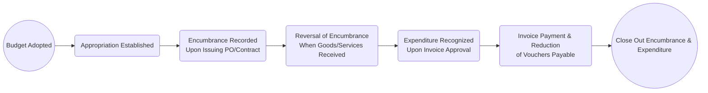

## 5.4 Budgetary Accounting, Encumbrances, and Appropriations

Budgetary accounting lies at the heart of governmental financial management, providing the framework within which public resources are allocated and monitored. Encumbrances and appropriations further enhance this framework, ensuring that financial obligations are anticipated, expenditures are controlled, and public funds are used in a transparent and accountable manner. This section explores how budgets are recorded, explains the concept and purpose of encumbrance accounting, and clarifies the difference between appropriations and actual expenditures in a state or local government environment. Whether you have a background in private sector finance or are entirely new to governmental accounting, this chapter will guide you through the crucial tools and processes public entities use to maintain fiscal discipline.

---

### Understanding Budgetary Accounting in Governmental Entities

Unlike for-profit entities that focus primarily on measuring profitability, governmental entities emphasize the stewardship of public funds and compliance with legal and legislative mandates. Budgetary accounting underscores these mandates by integrating the budget process directly into the accounting system. At the government-wide level, budgets reflect policy decisions on how public resources should be raised and spent, often spanning multiple funds, from the General Fund (for primary day-to-day operations) to Special Revenue, Capital Projects, and other fund types.

Because budgets are legally binding, states and local governments typically maintain strict budgetary controls to avoid overspending appropriations or spending on unauthorized items. As discussed in Section 5.1 of this book, governments often use the modified accrual basis of accounting for their General Fund, which aligns closely with budgetary procedures. Budgetary accounts assist with comparing anticipated revenues and authorized expenditures (appropriations) to actual outcomes, achieving accountability and transparency.

Common objectives of budgetary accounting include:
• Tracking compliance with authorized spending levels.  
• Providing real-time information on fund availability.  
• Signaling potential budgetary shortfalls early.  
• Serving as a governance tool for monitoring public programs.

---

### Recording the Budget

One of the distinctive features of governmental accounting is the process of recording the approved budget in the accounting system at the beginning of each fiscal period. When a formal budget is adopted, governments typically post budgetary entries to reflect both planned revenues and planned expenditures (appropriations). This is often done in budgetary accounts, such as:

• Estimated Revenues – Debited to record the government’s projection of how much revenue it anticipates collecting in the coming period (e.g., from taxes, fees, grants).  
• Appropriations – Credited to record the legally authorized spending limits established by the legislative body.  
• Budgetary Fund Balance – Offset for these budgetary entries, reflecting the difference between projected inflows (Estimated Revenues) and outflows (Appropriations).

Below is a simplified example of the journal entry that might be recorded when the budget is adopted:

Dr Estimated Revenues  …XXXX  
Cr Appropriations      …XXXX  
Cr Budgetary Fund Balance  …XXX  

Or, if appropriations exceed estimated revenues:

Dr Estimated Revenues            …XXXX  
Dr Budgetary Fund Balance        …XXX  
Cr Appropriations                …XXXX  

The Budgetary Fund Balance in these entries is distinct from the actual Fund Balance. It is purely a budgetary account used to measure anticipated surpluses or deficits. This mechanism helps governments observe real-time compliance with budget guidelines throughout the year.

---

### The Purpose of Encumbrance Accounting

Encumbrance accounting is a vital control mechanism ensuring that funds are earmarked for future expenditures before actual costs are incurred. By recording an encumbrance when a purchase order or contract is issued, the government “reserves” part of its appropriation. This helps prevent overspending because once an encumbrance is recorded, the amount of the appropriation available for other purchases is reduced.

#### Defining Encumbrances

An encumbrance can be understood as a reservation of budgetary authority. For instance, if a city’s legislative body allocates $500,000 for road repairs and the public works department initiates a contract for $100,000 worth of asphalt supplies, an encumbrance is recorded at that time—when the purchase order is issued or the contract is signed—even though the actual invoice has not yet been paid.

#### Encumbrances vs. Expenditures

While an expenditure is recognized when goods or services are received (and the liability is incurred under the modified accrual basis), an encumbrance is recognized much earlier—when the order is placed or the contract is committed. This timing difference helps government officials monitor how much of the appropriation remains uncommitted and thus available for new obligations.

#### Recording Encumbrances

When a purchase order, contract, or other commitment is approved, an encumbrance entry is typically recorded:

Dr Encumbrances        …XXXX  
Cr Encumbrances Outstanding   …XXXX  

This entry reduces the available appropriation. Later, when the goods are delivered or the service is performed, the encumbrance is reversed, and an actual expenditure is recorded:

(1) Reverse the encumbrance:  
Dr Encumbrances Outstanding   …XXXX  
Cr Encumbrances              …XXXX  

(2) Record the expenditure:  
Dr Expenditures        …XXXX  
Cr Vouchers Payable    …XXXX  

The difference between total appropriations and the sum of actual expenditures plus outstanding encumbrances provides insight into how much money is left to spend under that specific appropriation authority.

---

### Appropriations vs. Actual Expenditures

Appropriations represent the maximum legal spending limit approved by the legislative body for specific programs, departments, or functions. Actual expenditures, on the other hand, reflect the precise amounts spent within those appropriations when resources are consumed or liabilities are incurred.

It is entirely possible—and often expected—that actual expenditures will be less than the appropriations, reflecting cost savings or unneeded spending. When actual expenditures exceed appropriations, however, it can signal noncompliance with budgetary laws or indicate overspending in a particular area, potentially leading to legal repercussions or the need for corrective policy actions.

Key points distinguishing appropriations from actual expenditures:
• Appropriations are legislative authorizations.  
• Actual expenditures represent resources consumed or liabilities incurred.  
• Governments are prohibited from exceeding appropriations without additional legislative approval.  
• Unused appropriation balances typically lapse at the end of the fiscal period, unless carried over or re-appropriated by formal action.

---

### Practical Example of Budgetary Accounting

Below is a simplified illustration of the budgetary accounting process for a hypothetical county government:

1) The county commissioners adopt the annual budget for the General Fund, which includes total Estimated Revenues of $2,000,000 from property taxes and other sources, and total Appropriations of $1,900,000 for various programs and services.  
   • Budgetary entry:  

   Dr Estimated Revenues …2,000,000  
   Cr Appropriations     …1,900,000  
   Cr Budgetary Fund Balance …100,000  

2) Early in the fiscal year, the Roads Department initiates a contract for road resurfacing, pledging $200,000 of the $1,900,000 appropriation.  
   • Encumbrance entry:  
     
     Dr Encumbrances – Roads          200,000  
     Cr Encumbrances Outstanding – Roads  200,000  

3) Upon project completion, the contractor submits an invoice for $195,000. The invoice is approved and paid.  
   • Reverse the encumbrance:  

     Dr Encumbrances Outstanding – Roads  200,000  
     Cr Encumbrances – Roads             200,000  

   • Record the actual expenditure:  

     Dr Expenditures – Roads          195,000  
     Cr Vouchers Payable              195,000  

   • The $5,000 difference between the original encumbrance amount ($200,000) and the actual invoice ($195,000) becomes available again for other uses in the Roads Department under the same appropriation, assuming no legal restrictions on repurposing the leftover appropriation.

4) At the end of the fiscal year, if the Roads Department has spent only $1,850,000 out of their $1,900,000 appropriation, $50,000 remains unspent. Depending on the county’s policies, this unused budget may lapse or be carried over to the next year.

This example illustrates how appropriations, encumbrances, and expenditures interact to track spending and protect against unauthorized or unplanned use of funds.

---

### Diagram: Encumbrance Lifecycle

Below is a simple mermaid diagram illustrating the lifecycle of an encumbrance from the point of the budget adoption to the final expenditure payment.

Explanation of flow:
• Budget Adopted → Appropriation Established: Legislative approval sets the maximum spending limit.  
• Appropriation Established → Encumbrance Recorded: When a purchase order or contract is signed, the government commits part of the appropriation.  
• Encumbrance Recorded → Reversal of Encumbrance: Once the goods or services are actually received, the encumbrance is reversed.  
• Reversal of Encumbrance → Expenditure Recognized: The actual expenditure is booked when the liability is incurred.  
• Expenditure Recognized → Invoice Payment: Payment of the invoice reduces vouchers payable.  
• Invoice Payment → Close Out: The process completes the budgetary and actual transaction cycle for that item.

---

### Common Pitfalls and Best Practices

Budgetary accounting, encumbrances, and appropriations come with their own set of challenges. Below are a few common pitfalls and strategies to mitigate them:

**Pitfalls**  
• Failing to encumber at the time of contract issuance, leading to a distorted view of available appropriations.  
• Using nonstandard or inconsistent encumbrance policies across different departments, making consolidated reporting difficult.  
• Neglecting to reverse encumbrances when actual invoices come in, artificially reducing appropriations and creating confusion about spending authority.  
• Overspending due to poor budget monitoring and inability to identify potential shortfalls in real time.

**Best Practices**  
• Implement consistent policies for recording encumbrances immediately upon issuance of purchase orders or contracts.  
• Conduct periodic budget-to-actual reviews to spot any variance promptly.  
• Automate encumbrance and expenditure tracking using integrated accounting software that flags overspending.  
• Provide comprehensive training for department heads and staff who initiate spending commitments, ensuring full compliance with encumbrance policies.

---

### Table: Comparison of Appropriations, Encumbrances, and Expenditures

| Aspect                    | Appropriations                              | Encumbrances                                                                 | Expenditures                                                |
|--------------------------|---------------------------------------------|-------------------------------------------------------------------------------|-------------------------------------------------------------|
| Definition               | Legislative authorization to spend public funds up to a certain limit | Reservation of budgetary authority for a specific transaction or commitment           | Actual resource outflow or liability incurred               |
| Timing                   | Established at the beginning of the budget period | Recorded when purchase orders or contracts are issued                         | Recognized when goods/services are received or usage occurs |
| Purpose                  | Sets legal spend limit                       | Prevents overspending by holding portion of appropriation                     | Reflects actual cost of resources consumed                  |
| Accounting Treatment     | Credit side of budgetary accounting entries | Debit to “Encumbrances” and credit to “Encumbrances Outstanding”              | Debit to “Expenditures” and credit to “Vouchers Payable”    |
| Effect on Available Funds| Reduces total available budget               | Further reduces available budget from the original appropriation             | Final reduction in budgetary capacity once outflow occurs   |

---

### Key Takeaways

• Budgetary accounting is central to government financial management, aligning internal controls with legislative mandates.  
• Appropriations set the maximum spending limit, and budgetary entries record the government’s revenue and spending plans.  
• Encumbrances reserve budgetary authority for anticipated spending and protect against accidental overspending.  
• Actual expenditures represent the final cost when a liability arises, often resulting in the reduction of vouchers payable upon payment.  
• Properly used budgetary accounting and encumbrances enable effective monitoring, public accountability, and compliance with legal requirements.

---

### References and Further Exploration

• Governmental Accounting Standards Board (GASB) Codification.  
• GASB Statement No. 54: Fund Balance Reporting and Governmental Fund Type Definitions.  
• Gauthier, S. (2012). Governmental Accounting, Auditing, and Financial Reporting (GAAFR). Chicago: GFOA.  
• The AICPA Governmental Audit Quality Center: https://www.aicpa.org/interestareas/governmentalauditquality.html

For an in-depth look at the broader context of state and local government accounting, refer to the earlier sections of Chapter 5 in this guide, including Section 5.1 on measurement focus and basis of accounting. Additionally, advanced considerations, including reconciling governmental fund statements to government-wide statements, appear in Section 5.3 of this chapter.

---

## Test Your Knowledge: Budgetary Accounting, Encumbrances, and Appropriations



### Which statement best describes the purpose of budgetary accounting in governmental entities?

- [x] To ensure public funds are spent within the authorized limits set by legislation.  
- [ ] To maximize profitability and shareholder equity.  
- [ ] To record only actual revenue and expense transactions.  
- [ ] To comply solely with GAAP for all financial transactions.  

> **Explanation:** Budgetary accounting enables governments to manage public funds by comparing authorized spending levels (appropriations) to actual spending, ensuring they do not exceed legal limits.

### What does an encumbrance represent in state and local government accounting?

- [x] A reservation of part of an appropriation to cover a future expenditure.  
- [ ] An immediate expenditure upon placing an order for goods.  
- [ ] A fund balance classification at fiscal year end.  
- [ ] A type of restricted revenue requiring separate disclosure.  

> **Explanation:** An encumbrance “reserves” the budget for a future expenditure, ensuring the available appropriation is reduced before actual payment.

### Which of the following is recorded when a government adopts its annual budget?

- [x] Estimated Revenues and Appropriations in budgetary accounts.  
- [ ] Actual revenues generated by the government.  
- [ ] Expenses and liabilities for the current fiscal period.  
- [ ] Depreciation and amortization expense for all funds.  

> **Explanation:** Upon adopting a budget, the government records Estimated Revenues (a debit) and Appropriations (a credit), balancing them with Budgetary Fund Balance as needed.

### When are encumbrances typically reversed?

- [x] When the goods or services are actually received or the invoice is approved.  
- [ ] At the end of the fiscal year, regardless of receipt.  
- [ ] Once the appropriation is fully spent.  
- [ ] Immediately after the budget is adopted.  

> **Explanation:** Encumbrances are reversed when the actual expenditure is recognized; that is, once the invoice is received or services are performed, confirming the final cost.

### Which of the following best describes appropriations?

- [x] Legislative authorizations for a government to incur expenditures up to a specified amount.  
- [ ] Actual transactions recorded when goods or services are paid for.  
- [x] Limits that cannot be exceeded without specific legislative approval.  
- [ ] Equivalent to the total revenue a government expects to collect.  

> **Explanation:** Appropriations represent both (1) legislative authorizations for spending and (2) legal limits that cannot be exceeded, which promote accountability in managing public funds.

### What is the primary role of encumbrance accounting?

- [x] To ensure that the government does not overcommit its appropriations.  
- [ ] To record actual expenditures in the general ledger.  
- [ ] To reconcile budgetary fund balance at the year-end.  
- [ ] To measure revenue from taxes accurately.  

> **Explanation:** Encumbrance accounting restricts further spending once a purchase order or contract is issued, thus helping prevent overspending against the authorized budget.

### In governmental accounting, how is an expenditure recognized?

- [x] When goods or services are received and the liability is incurred.  
- [ ] When the order is placed or contract is signed.  
- [x] Upon acceptance of the invoice and establishment of a payable.  
- [ ] Only when actual payment is made.  

> **Explanation:** Under the modified accrual basis used by most general governmental funds, an expenditure is recognized at the point the liability is incurred (i.e., when the goods or services are received), and the invoice is accepted.

### A department has a $300,000 appropriation. It records a $50,000 encumbrance when a purchase order is placed. What amount remains available under the appropriation after this encumbrance is recorded?

- [x] $250,000  
- [ ] $350,000  
- [ ] $50,000  
- [ ] Zero  

> **Explanation:** The encumbrance reduces the available portion of the appropriation by $50,000, leaving $250,000 of unencumbered authority.

### What happens if actual expenditures exceed appropriations?

- [x] The government is in violation of budgetary compliance rules.  
- [ ] The government automatically increases the budget.  
- [ ] No action is necessary as long as liabilities are paid.  
- [ ] The appropriation is considered lapsed.  

> **Explanation:** Overspending appropriations violates legal requirements governing the government’s maximum spending. Additional legislative action is usually required to correct it.

### For year-end reporting, which statement is most accurate regarding outstanding encumbrances in governmental funds?

- [x] They may be disclosed as a reservation or commitment of fund balance.  
- [ ] They are treated as an actual expenditure for the previous fiscal year.  
- [ ] They automatically become expenditures in the next fiscal year.  
- [ ] They have no legal effect on next year’s budget.  

> **Explanation:** Encumbrances outstanding at year-end often remain as a disclosed commitment of the fund balance, indicating the government’s obligation to honor purchase orders in the following year.



---

## For Additional Practice and Deeper Preparation

**[FAR CPA Hardest Mock Exams: In-Depth & Clear Explanations](https://www.udemy.com/course/far-cpa-mock-exams/?referralCode=F88050F8D5C76764F6BD)**  

**Financial Accounting and Reporting (FAR) CPA Mocks:** 6 Full (1,500 Qs), Harder Than Real! In-Depth & Clear. Crush With Confidence! 

- Tackle full-length mock exams designed to mirror real FAR questions.  
- Refine your exam-day strategies with detailed, step-by-step solutions for every scenario.  
- Explore in-depth rationales that reinforce higher-level concepts, giving you an edge on test day.  
- Boost confidence and minimize anxiety by mastering every corner of the FAR blueprint.  
- Perfect for those seeking exceptionally hard mocks and real-world readiness.  

_Disclaimer: This course is not endorsed by or affiliated with the AICPA, NASBA, or any official CPA Examination authority. All content is for educational and preparatory purposes only._
