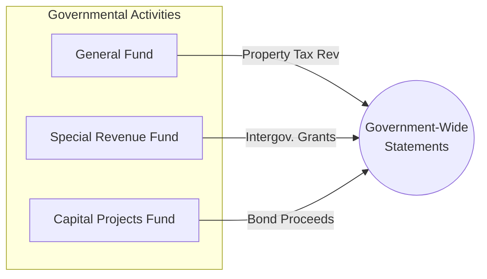

## 5.6 Illustrative Examples (Basic Transactions and Sample Disclosures)

Effective government financial reporting requires not only a solid grasp of measurement focuses and bases of accounting, but also an understanding of how mundane day-to-day transactions roll up into financial statement totals and disclosures. This section provides a set of illustrative examples of typical transactions undertaken by state and local governments—such as tax levies, intergovernmental grants, and bond issuances—and discusses how they are recognized, measured, and disclosed in governmental financial statements. These foundational concepts are instrumental to understanding how the detailed requirements of Governmental Accounting Standards Board (GASB) pronouncements manifest in practice.

--------------------------------------------------------------------------------
## Big Picture: Governmental Funds and Example Transactions

State and local governments often engage in a variety of activities reflected in different fund types, each with its own measurement focus and basis of accounting. The most common situational examples include:

• Property tax levy and collection (recorded in the General Fund).  
• Issuance of general obligation bonds (often accounted for in a Capital Projects Fund).  
• Receipt of intergovernmental grants (possibly recorded in a Special Revenue Fund).  

Because each of these transactions can significantly affect the organization’s financial position and results of operations, government accountants must carefully track them using budgetary and fund accounting concepts. Budgetary accounting ensures compliance with legal requirements and appropriation limits, while fund accounting helps isolate activities to demonstrate accountability.

Below are illustrative government accounting transactions and corresponding guidance on recognition, presentation, and disclosures in the basic financial statements.

--------------------------------------------------------------------------------
## Budgetary Accounting Example

Before we delve into the specific revenue and financing transactions, consider a simplified example of how a state or local government might record its legally adopted budget in the General Fund. Under modified accrual accounting, governmental fund financial statements often begin the fiscal year with budgetary entries that do not appear in proprietary or fiduciary funds.

• Assume that for the upcoming fiscal year, total estimated revenues for the General Fund are $5,000,000; total appropriations are $4,300,000; and the difference is the estimated unused budgetary amount (often referred to as Budgetary Fund Balance).

Below is a sample journal entry:

┌─────────────────────────┬───────────────────────────────┐
│  Account                │  Debit         Credit         │
├─────────────────────────┼───────────────────────────────┤
│  Estimated Revenues     │  $5,000,000                   │
│         Appropriations  │                 $4,300,000    │
│         Budgetary Fund  │                 $700,000      │
│         Balance         │                               │
└─────────────────────────┴───────────────────────────────┘

Though this transaction does not conform directly to GAAP-based financial reporting (because it is purely budgetary), it helps track budgetary compliance. Classical fund accounting requires separate control accounts for such budget-related items.

--------------------------------------------------------------------------------
## Property Tax Levy and Collection

### Overview
Local governments rely heavily on property taxes as a revenue stream. The general process involves:  
1. Establishing and approving the annual budget, which includes the level of property tax to be levied.  
2. Levying the tax on property owners, typically with the assistance of an assessment roll detailing valuations.  
3. Recognizing revenue under modified accrual accounting.  

GASB standards require governments to recognize property tax revenue in the period for which the levy is intended, provided the revenue is both measurable and available. Availability generally means collectible within either the current period or a specified number of days (often 60 days) after year-end.

### Illustrative Journal Entries

Assume that on July 1, the start of the fiscal year, the county government levies $3,000,000 in property taxes. Historically, 3% is deemed uncollectible, so the net collectible amount is estimated at $2,910,000.

(1) Record the Levy  
┌───────────────────────────┬───────────────────────────────┐
│  Account                  │  Debit         Credit         │
├───────────────────────────┼───────────────────────────────┤
│  Taxes Receivable—Current │  $3,000,000                   │
│         Allowance for     │                 $90,000       │
│         Uncollectible     │                               │
│         Accounts          │                               │
│         Revenues—Property │                 $2,910,000    │
│         Taxes             │                               │
└───────────────────────────┴───────────────────────────────┘

Explanation:  
• Taxes Receivable—Current is debited for the full amount of the levy.  
• The Allowance for Uncollectible Accounts is credited for the expected 3% ($90,000).  
• The difference ($2,910,000) is recorded to Revenues—Property Taxes.

(2) Collections of Current Taxes  
Assume $2,700,000 of the $3,000,000 in levied property taxes is collected during the fiscal year.

┌───────────────────────────┬───────────────────────────────┐
│  Account                  │  Debit         Credit         │
├───────────────────────────┼───────────────────────────────┤
│  Cash                     │  $2,700,000                   │
│         Taxes             │                 $2,700,000    │
│         Receivable—Current│                               │
└───────────────────────────┴───────────────────────────────┘

Explanation:  
• Cash is debited for the amount actually received.  
• Taxes Receivable—Current is credited, reducing the receivable.

### Financial Statement Presentation
Under governmental fund statements (Balance Sheet—Governmental Funds and the Statement of Revenues, Expenditures, and Changes in Fund Balances), you would see the property tax revenue recognized in the period it meets the available criteria. Any unpaid taxes would remain in Taxes Receivable, reduced by the Allowance for Uncollectible Accounts. If a portion is not available soon enough to be recognized as revenue, it is deferred and presented under deferred inflows of resources.

### Disclosures
Governments typically disclose:  
• The nature and amount of property taxes levied.  
• Rates applied to different classes of property.  
• Collection rates and delinquency policies.  
• Significant assumptions, if any, related to estimated uncollectibles.

--------------------------------------------------------------------------------
## Intergovernmental Grant Example

### Overview
State and local governments frequently receive grants from higher-level governments (federal or state) for specific projects or for general support. Grants can be one-time or recurring. The timing of recognition and classification in the financial statements depends on eligibility requirements and time requirements specified in the grant.

### Illustration
Assume a city receives notification of a $500,000 state operating grant, specifically restricted for road maintenance (a program reported in its Special Revenue Fund). The grant stipulates that the funds must be spent on eligible road maintenance costs within the fiscal year.

#### (1) Notification of Grant Award
No entry is made upon mere notification, as no asset or revenue is recognized until eligibility requirements are met.

#### (2) Expenditures Incurred
During the year, the city incurs $300,000 of eligible road maintenance costs.

┌───────────────────────────┬───────────────────────────────┐
│  Account                  │  Debit         Credit         │
├───────────────────────────┼───────────────────────────────┤
│  Expenditures—Road        │  $300,000                     │
│  Maintenance              │                               │
│         Accounts Payable  │                 $300,000      │
└───────────────────────────┴───────────────────────────────┘

#### (3) Receipt of Cash from Grant
After submitting documentation, the city receives $300,000 for the reimbursed portion.

┌───────────────────────────┬───────────────────────────────┐
│  Account                  │  Debit         Credit         │
├───────────────────────────┼───────────────────────────────┤
│  Cash                     │  $300,000                     │
│         Intergovernmental │                 $300,000      │
│         Revenues          │                               │
└───────────────────────────┴───────────────────────────────┘

Explanation:  
• Expenditures—Road Maintenance is recognized when maintenance work is performed.  
• Revenue is recognized only when eligibility requirements are met (i.e., allowable expenditures incurred).  
• Because the grant is restricted for a specific purpose, this is typically recorded in a Special Revenue Fund.  

### Financial Statement Presentation
On the Statement of Revenues, Expenditures, and Changes in Fund Balances for the Special Revenue Fund, the $300,000 of grant revenue will be reported under intergovernmental revenues. Likewise, the city will disclose the remaining balance yet to be spent or earned if not all eligibility requirements have been satisfied.

### Disclosures
GASB guidance suggests that governments disclose the following for significant grants:  
• The grant purpose and any eligibility or time restrictions.  
• Significant contingencies or compliance requirements.  
• Balances of deferred inflows if conditions are not yet fully met.  
• Recognition policies for revenue related to grants.

--------------------------------------------------------------------------------
## Bond Issuance Example

### Overview
Long-term debt—such as general obligation bonds—is a major financing mechanism for capital projects at the state and local levels. The governmental funds recognize bond proceeds as Other Financing Sources when the bond is issued (modified accrual basis). In government-wide statements (full accrual), these proceeds are recorded as a liability (Bonds Payable).

### Bond Issuance Journal Entry
Assume that a local county issues $2,000,000 of general obligation bonds at par to finance a new courthouse. The bond issuance is accounted for in a Capital Projects Fund.

┌────────────────────────────────────┬───────────────────────────────┐
│  Account                          │  Debit         Credit         │
├────────────────────────────────────┼───────────────────────────────┤
│  Cash (Capital Projects Fund)     │  $2,000,000                   │
│         Other Financing Sources—  │                 $2,000,000    │
│         Bond Proceeds            │                               │
└────────────────────────────────────┴───────────────────────────────┘

Explanation:
• In a Capital Projects Fund using the modified accrual basis, the proceeds from debt issuance are recognized and presented as “Other Financing Sources,” not as a long-term liability.  
• In government-wide financial statements, the county would recognize a $2,000,000 increase in Cash as well as Bonds Payable for $2,000,000.

### Financial Statement Presentation
• Fund-Level Statements: Outline the proceeds in the Statement of Revenues, Expenditures, and Changes in Fund Balances under “Other Financing Sources.”  
• Government-Wide Statements: Present an increase in liabilities (Bonds Payable) and record interest expense over time.  

### Disclosures
Common disclosures related to bond issuances:  
• Detailed descriptions of the bond purpose, maturity schedule, and interest rate.  
• Debt service requirements by period.  
• Legal or contractual limitations on further debt issuances.  
• Any subjective acceleration clauses or debt covenants that might influence the timing of required payments.

--------------------------------------------------------------------------------
## Sample Disclosures in a Governmental Context

Proper note disclosures are crucial for transparent reporting to constituents, bondholders, and oversight agencies. While each government’s Comprehensive Annual Financial Report (often referred to as the Annual Comprehensive Financial Report, or ACFR) will contain a variety of disclosures specific to their circumstances, some standard disclosures include:

• Summary of Significant Accounting Policies: Detailing the basis of accounting used (modified accrual vs. accrual) by each fund type, the measurement focus, and key revenue recognition principles.  
• Cash and Investments: Breakdown of allowable investments, custodial credit risk, concentration risk, and statutory or contractual limitations.  
• Receivables and Property Taxes: Explanation of how property tax levies are computed, timing of recognition, and uncollectible allowance methodologies.  
• Long-Term Liabilities: Summaries of bonds, notes, capital leases, and other debt obligations, including schedules of changes in long-term debt and future maturities.  
• Intergovernmental Receivables: Summaries of grants, shared revenues, or other forms of external funding from higher-level authorities.  
• Fund Balance or Net Position Classifications: Reconciliation between various funds’ fund balances and the net position classifications at the government-wide level.  

In addition, notes should disclose compliance with legal budgets and any excess expenditures over appropriations.

--------------------------------------------------------------------------------
## Comprehensive Example of Combined Transactions

Below is a simplified scenario integrating property tax revenue, intergovernmental grant revenue, and bond proceeds for a local county during a fiscal period:

1) Budget Adoption (General Fund):  
   • $5,000,000 in estimated revenues, $4,500,000 in appropriations, difference credited to Budgetary Fund Balance.  
2) Property Tax Levy (General Fund):  
   • $3,000,000 levied, 2% expected uncollectible.  
3) Intergovernmental Grant (Special Revenue Fund):  
   • $200,000 restricted grant for public safety.  
4) Bond Issuance (Capital Projects Fund):  
   • $1,500,000 par value, 4% interest, 10-year maturity.  

When the government releases its financial statements:

• The General Fund will show property tax revenue (net of uncollectible) once it is considered available.  
• The Special Revenue Fund will recognize intergovernmental revenue only upon meeting eligibility requirements.  
• The Capital Projects Fund will display the bond proceeds as “Other Financing Sources.”  
• Disclosures will detail each of these transactions, specifying the original budget, property tax policies, grant restrictions, and bond terms.

--------------------------------------------------------------------------------
## Visualizing the Fund Flows

Below is a simple conceptual diagram illustrating these flows among major governmental funds:

In the government-wide statements, each fund’s transactions are converted to the economic resources perspective under accrual accounting, consolidating (or adjusting) entries for long-term liabilities, capital assets, and so forth.

--------------------------------------------------------------------------------
## Common Pitfalls

• Misapplication of the “available” criterion for revenue recognition in governmental funds, leading to premature or delayed recognition of tax or grant revenue.  
• Failure to track restricted grant funds in a specialized fund, causing confusion about compliance.  
• Omitting or understating allowance for uncollectible accounts, overstating net property tax revenue.  
• Inadequate disclosures on debt issuances, particularly on debt covenants and compliance requirements.  
• Improper classification of bond proceeds or ignoring bond premiums/discounts in the appropriate fund.  

--------------------------------------------------------------------------------
## Best Practices

• Implement robust internal controls to track property tax receivables and ensure timely recognition of revenue, deferrals, and write-offs.  
• Maintain a centralized grants management system so that each grant’s eligibility requirements, time restrictions, and expenditures are carefully monitored.  
• Reconcile Capital Projects Fund bonding transactions with the government-wide statements to ensure consistency in reporting outstanding debt.  
• Disclose relevant policies and assumptions that underlie financial estimates (e.g., uncollectible percentages, synergy with budget adoption, and compliance with legal restrictions).  
• Provide regular training to accounting and finance staff on the differences between fund-level and government-wide reporting, including how to prepare the necessary reconciliations.

--------------------------------------------------------------------------------
## References for Further Exploration

• Governmental Accounting Standards Board (GASB) Codification, Sections 1600 (Basis of Accounting), 2300 (Notes to Financial Statements), and 3300 (Fund Accounting).  
• Government Finance Officers Association (GFOA) Best Practices and Advisories on Budgeting, Grants Management, and Investment Policies.  
• “Governmental Accounting, Auditing, and Financial Reporting (GAAFR)” by the GFOA—a comprehensive resource on state and local governmental accounting.  
• GASB Statement No. 34 for guidance on government-wide financial statements.

--------------------------------------------------------------------------------
## State and Local Government Funds: Master the Basics Quiz



### Property tax revenue is recognized in the current period under modified accrual accounting when:

- [x] The taxes are both measurable and available to finance current expenditures.
- [ ] The taxes are levied, irrespective of due dates. 
- [ ] The taxes are collectible at any point in the future.
- [ ] The cash is received, regardless of the fiscal period.

> **Explanation:** Under modified accrual accounting, revenues must be measurable and available to finance current period expenditures. Availability often includes the current period and a specified number of days (commonly 60) after year-end.

### Which of the following best describes how governmental funds record bond proceeds?

- [ ] As long-term liabilities.
- [x] As Other Financing Sources in the fund statements.
- [ ] As increases in capital assets.
- [ ] As internal service fund transfers.

> **Explanation:** Governmental funds use the modified accrual basis. Thus, bond proceeds are recorded as Other Financing Sources. In the government-wide statements, by contrast, they are shown as a liability (Bonds Payable).

### For a state government’s special revenue fund grant, revenue is recognized when:

- [x] Eligibility requirements have been met, and the resources are measurable and available.
- [ ] The grant award notification is received.
- [ ] The grant is included in the budgetary documents, even if unspent.
- [ ] An encumbrance is established for the anticipated grant revenues.

> **Explanation:** Grants under GASB guidelines are recognized when all eligibility (and time, if applicable) requirements are met. Merely receiving an award notification is insufficient for recording revenue.

### A local government that adopts a legally approved budget for its General Fund would record which of the following upon adoption?

- [x] A budgetary entry debiting Estimated Revenues and crediting Appropriations and Budgetary Fund Balance.
- [ ] A debit to Expenditure and a credit to Unassigned Fund Balance.
- [ ] A debit to Net Position and a credit to Appropriations.
- [ ] A debit to Bond Proceeds and a credit to Other Financing Sources.

> **Explanation:** Budgetary entries recognize Estimated Revenues and Appropriations at the start of the fiscal period. Any difference sets up Budgetary Fund Balance, reflecting the government’s authorized spending for the year.

### Successful property tax collection considerably less than the amount levied is most likely a result of:

- [x] Higher than expected uncollectible accounts or delinquencies.
- [ ] Overstating the net taxable property values in the budget.
- [x] Property tax timing differences that cause revenue deferral.
- [ ] Underestimating federal grant reimbursements.

> **Explanation:** Collections below the levy can result from delinquencies or non-payments and the associated allowance for uncollectibles. Timing issues can also promote classification of some taxes as deferred inflows if not collected within the “availability” window.

### When a local government issues a general obligation bond to finance road construction, the transaction in the Capital Projects Fund is:

- [x] Debit to Cash, credit to Other Financing Sources—Bond Proceeds.
- [ ] Debit to Roads Construction in Progress, credit to Bonds Payable.
- [ ] Debit to Bonds Payable, credit to Road Construction Revenues.
- [ ] Debit to Capital Assets, credit to Bond Proceeds.

> **Explanation:** On the fund-level statements, the government records a debit to Cash and a credit to Other Financing Sources—Bond Proceeds under the modified accrual approach.

### Which of the following is a typical disclosure for property tax revenue in a local government’s notes?

- [x] The tax rates, levy date, collection policy, and allowance methodology.
- [ ] A listing of every property taxpayer in the jurisdiction.
- [x] An analysis of the last 10 years’ uncollectible tax write-offs by name.
- [ ] No disclosures are required as property taxes are simply general revenue.

> **Explanation:** GASB standards require general disclosures about property tax rates, levy, and collection details. Detailed listings of taxpayers are generally not required, but overall policies and allowances for uncollectible accounts are typically disclosed.

### In government-wide financial statements, general obligation bonds issued by a Capital Projects Fund are presented as:

- [x] New liabilities (Bonds Payable) with corresponding entries to Cash or Capital Assets.
- [ ] Restricted revenues on the Statement of Revenues, Expenditures, and Changes in Net Position.
- [ ] Negative fund balance in the Capital Projects Fund.
- [ ] Encumbrances for future debt service payments.

> **Explanation:** Under accrual accounting in the government-wide statements, bond proceeds create a liability in Bonds Payable, while the offset is to Cash or to the fund that uses those proceeds.

### If the government receives a restricted operating grant, but the eligibility requirements have not yet been met, the appropriate accounting is to:

- [x] Record the proceeds as a liability or deferred inflow (if cash is received in advance) until eligibility is met.
- [ ] Recognize revenue immediately upon receipt.
- [ ] Recognize All Other Financing Uses.
- [ ] Transfer the funds to an Enterprise Fund immediately.

> **Explanation:** When eligibility requirements are not yet met, the government should defer recognition of revenue. If money is received in advance, a liability (Unearned Revenue or similar) or deferred inflow is recorded until the requirements are satisfied.

### A common pitfall in governmental fund accounting includes:

- [x] Overlooking the modified accrual “availability” criterion and prematurely recognizing property tax revenue.
- [ ] Refusing to record bond proceeds in the fund-level statements.
- [ ] Combining fiduciary funds with general government funds in the same statement.
- [ ] Not establishing appropriations for budgetary accounting.

> **Explanation:** A frequent error is to treat property tax revenue as if it were fully available at the time of levy, not applying the “availability window.” Accurate compliance requires deferring revenue if collection is expected after a certain period (e.g., 60 days post-year-end).



--------------------------------------------------------------------------------

## For Additional Practice and Deeper Preparation

**[FAR CPA Hardest Mock Exams: In-Depth & Clear Explanations](https://www.udemy.com/course/far-cpa-mock-exams/?referralCode=F88050F8D5C76764F6BD)**  

**Financial Accounting and Reporting (FAR) CPA Mocks:** 6 Full (1,500 Qs), Harder Than Real! In-Depth & Clear. Crush With Confidence!  

- Tackle full-length mock exams designed to mirror real FAR questions.  
- Refine your exam-day strategies with detailed, step-by-step solutions for every scenario.  
- Explore in-depth rationales that reinforce higher-level concepts, giving you an edge on test day.  
- Boost confidence and minimize anxiety by mastering every corner of the FAR blueprint.  
- Perfect for those seeking exceptionally hard mocks and real-world readiness.  

_Disclaimer: This course is not endorsed by or affiliated with the AICPA, NASBA, or any official CPA Examination authority. All content is for educational and preparatory purposes only._
