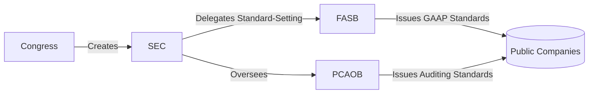

## 6.1 SEC Regulatory Environment (Securities Exchange Act of 1934)

The Securities Exchange Act of 1934 (“the 1934 Act”) serves as the cornerstone of federal regulation for companies whose securities trade on U.S. public markets. The Act introduced the Securities and Exchange Commission (SEC) and granted it comprehensive authority to regulate exchanges, periodic reporting requirements, anti-fraud measures, and the ongoing obligations of public companies. This framework, refined over the decades, underscores how critical transparent, consistent, and reliable financial reporting is to capital markets.

In this section, we will explore the key provisions of the 1934 Act, understand the SEC’s role and enforcement powers, discuss how the SEC interacts with the Financial Accounting Standards Board (FASB) for standard setting, and offer insights into practical reporting considerations for public companies. Additionally, we will cover the importance of ongoing disclosures, the principles that guide U.S. capital markets, and strategies to avoid common compliance pitfalls.

---

### Historical Context and Purpose

The Securities Exchange Act of 1934 was enacted in the wake of the stock market crash of 1929 and the Great Depression. Previously, the Securities Act of 1933 focused on regulating initial offerings of securities, requiring a registration statement and prospectus to protect investors from fraudulent or misleading activities. However, the 1933 Act did not address the secondary trading of securities on national exchanges. To fill that gap, the 1934 Act was passed, extending regulatory oversight to the trading of securities after their initial issuance and providing the legal foundation for the creation of the SEC.

Key objectives of the 1934 Act include:  
• Ensuring fair and orderly markets for security trading.  
• Protecting investors from manipulative and deceptive practices.  
• Establishing mandatory periodic reporting requirements (e.g., annual and quarterly reports).  
• Granting authority to the SEC to enforce federal securities laws, investigate wrongdoing, and impose penalties.

The SEC and other regulatory bodies born out of this legislation have been crucial to sustaining investor confidence. This confidence is underpinned by the availability of transparent, accurate, and complete financial data from publicly traded corporations.

---

### The Role of the SEC

At the heart of public company financial reporting is the Securities and Exchange Commission, an independent federal agency with a mission to “protect investors, maintain fair, orderly, and efficient markets, and facilitate capital formation.” The SEC is organized into five main divisions:

1. Division of Corporation Finance (Corp Fin)  
2. Division of Enforcement  
3. Division of Trading and Markets  
4. Division of Investment Management  
5. Division of Economic and Risk Analysis  

Collectively, these divisions oversee corporate disclosures, trading practices, investment management, and the enforcement of securities laws, among other duties.

#### Key Responsibilities

• Overseeing issuer disclosures and ensuring compliance with regulations such as Regulation S-K (covering nonfinancial disclosures) and Regulation S-X (covering financial statements and related footnotes).  
• Reviewing registration statements, periodic filings, and other exchange filings.  
• Investigating possible securities violations, which can include fraudulent financial reporting, insider trading, market manipulation, and other illicit activities.  
• Issuing rules and regulations to address emerging market issues or close regulatory gaps.  
• Working with the FASB to shape and endorse financial accounting standards, thereby promoting uniformity and transparency in public company financial statements.

---

### Key Provisions of the 1934 Act

The 1934 Act sets out the foundation for ongoing reporting and public disclosure requirements, as well as antifraud provisions. Below is a high-level breakdown of crucial sections relevant to public companies and CPAs alike.

#### Registration of Securities

Companies must register their securities with the SEC under Section 12 if they meet certain asset and shareholder thresholds or if they list their securities on a national exchange. Registration triggers ongoing disclosure obligations, including periodic filings such as Form 10-K, Form 10-Q, and Form 8-K.

#### Periodic Reporting and Disclosure

• Form 10-K (Annual Report): Contains audited financial statements, footnotes, Management’s Discussion and Analysis (MD&A), disclosures on internal controls, and other quantitative and qualitative data.  
• Form 10-Q (Quarterly Report): Includes unaudited interim financial statements and provides updates on company financials, operations, and material developments.  
• Form 8-K (Current Report): Discloses significant events or corporate changes that shareholders and the public should know about promptly (e.g., bankruptcy, change in auditors, changes in control, major acquisitions).

#### Antifraud Provisions

Sections 9 and 10(b), along with Rule 10b-5, prohibit manipulative and deceptive devices or contrivances. These are the main tools the SEC uses to combat fraud, insider trading, misrepresentation, and misleading statements in connection with securities.

#### Proxy Solicitations and Tender Offers

Regulations require companies to make accurate disclosures in proxy statements whenever shareholders vote on corporate issues (e.g., electing directors, approving business combinations). This includes disclosures of executive compensation, related-party transactions, and other governance matters. Meanwhile, tender offer rules ensure fairness and adequate disclosure when one entity proposes to buy a significant percentage of a company’s shares.

---

### Integration with FASB and GAAP

The 1934 Act empowers the SEC to set accounting standards for public companies. Early on, the SEC recognized the need to delegate standard-setting to an independent body. Over time, this responsibility fell to the Financial Accounting Standards Board (FASB), which promulgates U.S. Generally Accepted Accounting Principles (GAAP).

The SEC, through its Division of Corporation Finance, monitors compliance with GAAP in financial reports included in Forms 10-K and 10-Q. Although the FASB sets standards independently, the SEC retains ultimate authority. It can reject or challenge a standard if it conflicts with the SEC’s mandate. Additionally, the SEC issues Staff Accounting Bulletins (SABs) where it interprets or clarifies GAAP in the context of existing accounting pronouncements.

Below is a simplified diagram illustrating the relationship among major U.S. regulatory and standard-setting entities:

**Explanation**:  
• Congress created and empowered the SEC, which ultimately governs publicly traded companies.  
• The SEC delegates accounting standard-setting to FASB, yet retains the authority to intervene.  
• The Public Company Accounting Oversight Board (PCAOB) sets auditing standards for public entities.  
• Public companies must follow GAAP and auditing standards, ensuring transparent reporting.

---

### Essential Reporting Forms Under the 1934 Act

Public companies have multiple filing obligations that accountants should master in order to ensure compliance. The most common forms include:

1. **Form 10-K**  
   – Due within 60 to 90 days after fiscal year-end, depending on filer status (Large Accelerated, Accelerated, or Nonaccelerated).  
   – Must include audited financial statements, footnotes, MD&A, details on internal controls (SOX 404 compliance), and other disclosures.  
   – Critical for external users when performing comprehensive financial analysis.

2. **Form 10-Q**  
   – Filed three times a year for each quarter except the final quarter (which is covered by the 10-K).  
   – Contains unaudited financial statements and management updates on significant events or changes in financial condition.  
   – Due within 40 to 45 days after each quarter’s end, depending on filer category.

3. **Form 8-K**  
   – Current report used to disclose material events or corporate changes.  
   – Typically due within four business days of the triggering event.  
   – Examples of triggering events: bankruptcy filings, mergers or acquisitions, leadership changes, changes in outside auditors, or other anything significant that affects the company.

4. **Forms 3, 4, and 5**  
   – Used to report insider holdings and transactions (e.g., acquisitions or dispositions of securities held by officers, directors, or beneficial owners).  
   – Key to fostering transparency around insider activity.

---

### Enforcement and Penalties

The Division of Enforcement within the SEC investigates potential securities law violations. If a company or individual is suspected of engaging in fraudulent financial reporting, market manipulation, or insider trading, the SEC can launch a formal inquiry. Potential consequences include:

• Civil injunctive actions, cease and desist orders, monetary fines, and disgorgement of ill-gotten gains.  
• Administrative proceedings that may impose bans on serving as an officer or director of a public company.  
• Coordination with the Department of Justice (DOJ) if criminal behavior is suspected, leading to possible criminal charges.

---

### Working with External Auditors and the PCAOB

While the SEC regulates financial disclosures, the Public Company Accounting Oversight Board (PCAOB) establishes and enforces auditing standards for firms that audit public companies. CPAs performing audit engagements on public issuers must comply with PCAOB standards, undergo regular inspections, and maintain independence as defined by the SEC and PCAOB rules.  

Failing to abide by the SEC regulations or PCAOB standards can expose both the company under audit and the audit firm to compliance risk, enforcement actions, and reputational damage.  

---

### Practical Examples and Case Study

Consider a hypothetical publicly traded technological manufacturer, TechParts Inc., which must file a Form 10-K within 75 days of its fiscal year-end. As part of its preparation, TechParts Inc. compiles:

1. Audited financial statements (Balance Sheet, Income Statement, Cash Flow Statement, and Statement of Stockholders’ Equity) in accordance with GAAP, accompanied by footnotes disclosing any significant accounting policies, estimates, and contingencies.  
2. Management’s Discussion and Analysis (MD&A) detailing operational results, liquidity, capital resources, and known trends that may affect future performance.  
3. Internal Controls over Financial Reporting (ICFR) attestation aligning with Sarbanes-Oxley Act (SOX) Section 404 guidelines. An independent external auditor (registered with the PCAOB) also provides an opinion on the company’s financial statements and internal controls.  

If TechParts Inc. merges with a competitor, that event triggers Form 8-K, requiring a timely disclosure. If they revise their revenue recognition method, that change must comply with ASC 606 (Revenue from Contracts with Customers) and be disclosed in the subsequent 10-Q or 10-K. If any executive or director of TechParts Inc. acquires or disposes of the company’s stock, the transaction is disclosed via Forms 3, 4, or 5.  

---

### Common Reporting Pitfalls

Companies must navigate numerous potential pitfalls that could lead to scrutiny or enforcement action. Common trouble spots include:

1. **Revenue Recognition Errors**  
   – Inconsistent application of ASC 606.  
   – Under- or overstatement of sales due to misclassification or timing.  

2. **Improper Use of Estimates**  
   – Overly optimistic forecasts or reserves lacking sufficient evidence.  
   – Inadequate documentation to support management judgments.  

3. **Inadequate Disclosure of Related-Party Transactions**  
   – Not identifying or fully disclosing relationships and transactions that could create conflicts of interest.  

4. **Deficient Internal Controls**  
   – Weaknesses in segregation of duties, reconciliation processes, or oversight of financial close procedures.  
   – Lack of well-documented control environment, fostering material misstatements.  

5. **Late or Incomplete Filings**  
   – Missing reporting deadlines for Forms 10-K, 10-Q, or 8-K.  
   – Failing to provide requisite disclosures, leading to restatements and penalties.

---

### Best Practices for Compliance

1. **Establish Robust Internal Controls**  
   – Develop a clear control environment with well-defined roles and responsibilities.  
   – Adopt standardized accounting policies and procedures to maintain consistent application of GAAP.  

2. **Maintain Frequent Communication with External Auditors**  
   – Ensure alignment on audit scope, significant accounting estimates, and emerging issues.  
   – Regularly address potential internal control deficiencies to maintain a clean audit opinion.  

3. **Conduct Periodic Trainings**  
   – Provide regular workshops for accounting staff and management on SEC regulations and GAAP updates.  
   – Keep the board of directors and audit committee informed on changes in SEC or FASB guidelines.  

4. **Leverage Technology and Automation**  
   – Implement accounting software solutions to reduce manual errors, improve data integrity, and streamline reporting.  
   – Maintain robust data analytics tools to quickly identify transactions or trends that pose a risk of misstatement.  

5. **Stay Current with Regulatory Developments**  
   – Monitor SEC staff guidance, new FASB pronouncements, and evolving PCAOB standards.  
   – Engage with professional associations, industry groups, and continuing education programs.  

---

### Illustrative Table: Key SEC Filings and Timelines

Below is a simplified table summarizing some major filings and their deadlines. Note that specific deadlines can vary based on filer status.

| Filing        | Content Overview                                    | Frequency              | Deadline (Approx.)                    |
|---------------|-----------------------------------------------------|------------------------|---------------------------------------|
| Form 10-K     | Audited financials, MD&A, ICFR                      | Annual                | 60-90 days after fiscal year-end      |
| Form 10-Q     | Unaudited financials, interim updates               | Quarterly (3x/year)   | 40-45 days after quarter-end          |
| Form 8-K      | Material events or changes (e.g., mergers, changes in auditors) | As needed (event-driven) | 4 business days after event           |
| Form 3, 4, 5  | Insiders’ holdings and transactions                 | As needed (depending on transaction) | Varies; typically days after the transaction |

---

### Interaction with Other Regulators and Convergence with IFRS

While the 1934 Act’s provisions focus primarily on U.S. markets, globalization has amplified calls for convergence between U.S. GAAP and International Financial Reporting Standards (IFRS). The SEC has historically encouraged a single set of high-quality global standards, leading to periodic joint initiatives between the FASB and the International Accounting Standards Board (IASB). However, the United States has not fully adopted IFRS for domestic registrants. Instead, the SEC allows certain foreign private issuers to file IFRS-based statements without reconciliation to U.S. GAAP, facilitating cross-border capital flows.

Key Takeaways:  
• IFRS may still differ in areas such as revenue recognition, inventory cost methods, and financial instruments accounting.  
• U.S. GAAP remains the standard for domestic public companies, though IFRS influences continued standard-setting and disclosures.

---

### Looking Forward: Evolving Regulatory Landscape

The SEC’s regulatory scope constantly evolves to address new market risks, technological advancements (e.g., cryptocurrency offerings), and financial innovations. Recent areas of focus include:

• **Environmental, Social, and Governance (ESG) Disclosure**: Growing discourse on mandating consistent ESG disclosures.  
• **Cybersecurity Risks**: Enhanced disclosure requirements for data breaches and cybersecurity governance.  
• **SPACs and Direct Listings**: SEC scrutiny of unique or emerging avenues for companies to go public.

As these changes unfold, public companies and accounting professionals must adapt, keeping abreast of rule changes and ensuring robust systems for gathering and verifying relevant data.

---

### References for Further Exploration

• Official SEC Website:  
  [https://www.sec.gov/](https://www.sec.gov/)  

• FASB Accounting Standards Codification:  
  [https://asc.fasb.org/](https://asc.fasb.org/)  

• PCAOB Standards and Guidance:  
  [https://pcaobus.org/](https://pcaobus.org/)  

• SEC Staff Accounting Bulletins:  
  [https://www.sec.gov/interps/account.shtml](https://www.sec.gov/interps/account.shtml)  

• AICPA Resources on SEC Filings:  
  [https://www.aicpa.org/interestareas/frc/accountingfinancialreporting/secactivities.html](https://www.aicpa.org/interestareas/frc/accountingfinancialreporting/secactivities.html)

Each of these resources offers valuable insights into the day-to-day practicalities and emerging trends that shape the SEC’s regulatory environment.

---

## SEC Regulatory Compliance Knowledge Quiz



### Which legislation created the SEC and governs secondary trading of securities in the U.S.?

- [ ] The Securities Act of 1933
- [x] The Securities Exchange Act of 1934
- [ ] The Sarbanes-Oxley Act of 2002
- [ ] The Investment Company Act of 1940

> **Explanation:** The Securities Exchange Act of 1934 established the SEC and governs activities in secondary markets, including regulation of exchanges and the ongoing disclosures of public companies.

### Which SEC division is primarily responsible for reviewing corporate filings like Form 10-K?

- [x] The Division of Corporation Finance
- [ ] The Division of Enforcement
- [ ] The Division of Economic and Risk Analysis
- [ ] The Division of Trading and Markets

> **Explanation:** The Division of Corporation Finance reviews periodic filings, including annual and quarterly reports, and ensures compliance with disclosure obligations.

### What does the FASB provide under the Securities Exchange Act of 1934?

- [ ] Enforcement of insider trading laws
- [ ] Director nomination guidelines
- [x] U.S. GAAP accounting standards
- [ ] Rules for voting procedures in annual meetings

> **Explanation:** The FASB issues U.S. GAAP, which public companies must follow in preparing their financial statements filed with the SEC.

### Which form must a public company file to announce a significant corporate event, such as a change in auditor or merger agreement?

- [ ] Form 10-K
- [ ] Form 10-Q
- [x] Form 8-K
- [ ] Form 4

> **Explanation:** Form 8-K is used to report material events affecting the company, usually within four business days of the occurrence.

### Which entity sets auditing standards for auditors of public companies?

- [x] PCAOB
- [ ] FASB
- [ ] AICPA
- [ ] GASB

> **Explanation:** The Public Company Accounting Oversight Board (PCAOB), established by the Sarbanes-Oxley Act, sets the standards that CPAs must follow when auditing public companies.

### A corporation with significant internal control deficiencies and an overly optimistic revenue forecast may face penalties under which SEC mechanism?

- [x] Investigations and enforcement actions
- [ ] Regulation S-X checklist
- [ ] Voluntary compliance programs only
- [ ] Exemption from the Securities Act of 1933

> **Explanation:** The SEC’s Division of Enforcement can investigate suspected violations and take appropriate actions if the firm’s financial reporting or disclosures are misleading or deficient.

### According to the 1934 Act, why must officers and directors file Forms 3, 4, or 5?

- [x] To report stock ownership and transactions in the company
- [ ] To disclose compensation packages
- [x] To increase transparency around insider trading
- [ ] To report personal loans

> **Explanation:** Officers, directors, and beneficial owners of more than 10% of a class of registered equity securities must reveal their ownership and any trades of the company’s securities, promoting transparency and deterring insider misconduct.

### What is the top reason for requiring ongoing periodic reports from companies?

- [x] To protect investors through access to timely and accurate financial data
- [ ] To reduce the cost of accounting personnel
- [ ] To replace annual audits
- [ ] To eliminate legal liabilities

> **Explanation:** Protecting investors by ensuring they have up-to-date, relevant, and transparent information is the core objective of periodic reporting requirements.

### Which of the following best describes Rule 10b-5 of the 1934 Act?

- [x] A principal antifraud provision prohibiting deceptive practices
- [ ] A filing requirement for new stock issuances
- [ ] A standard accounting principle mandated by the FASB
- [ ] A method of measuring fair value for nonfinancial assets

> **Explanation:** Rule 10b-5 broadly prohibits any act or omission resulting in fraud or deceit in connection with the purchase or sale of any security.

### The SEC’s role in standard-setting can be characterized as:

- [x] Delegating primary authority to the FASB but retaining ultimate oversight
- [ ] Allowing the AICPA to issue mandatory principles
- [ ] Setting IFRS standards in conjunction with the IASB
- [ ] Issuing customized GAAP for each industry

> **Explanation:** The SEC has the statutory authority to set U.S. accounting standards but delegates this role to the FASB while reserving the power to override or reject standards when necessary.



---

## For Additional Practice and Deeper Preparation

**[FAR CPA Hardest Mock Exams: In-Depth & Clear Explanations](https://www.udemy.com/course/far-cpa-mock-exams/?referralCode=F88050F8D5C76764F6BD)**  

**Financial Accounting and Reporting (FAR) CPA Mocks:** 6 Full (1,500 Qs), Harder Than Real! In-Depth & Clear. Crush With Confidence!

- Tackle full-length mock exams designed to mirror real FAR questions.  
- Refine your exam-day strategies with detailed, step-by-step solutions for every scenario.  
- Explore in-depth rationales that reinforce higher-level concepts, giving you an edge on test day.  
- Boost confidence and minimize anxiety by mastering every corner of the FAR blueprint.  
- Perfect for those seeking exceptionally hard mocks and real-world readiness.  

_Disclaimer: This course is not endorsed by or affiliated with the AICPA, NASBA, or any official CPA Examination authority. All content is for educational and preparatory purposes only._
