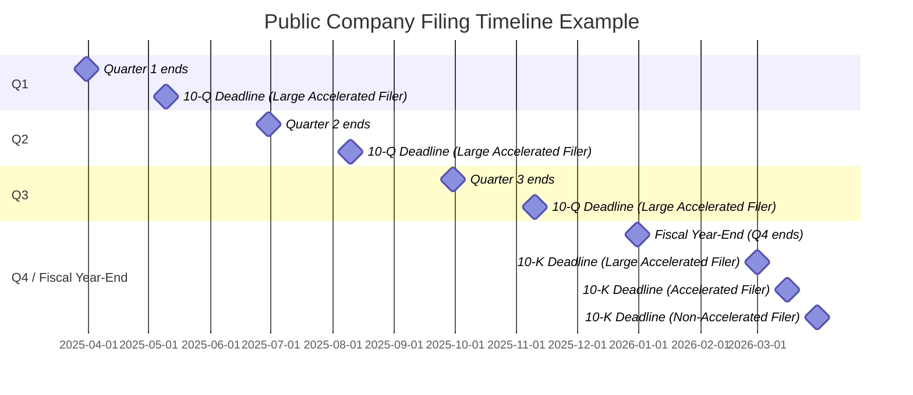

## 6.3 Annual Filings and Form 10-K/10-Q/8-K Requirements

Public companies in the United States are subject to stringent reporting requirements governed by the Securities and Exchange Commission (SEC). These reporting obligations ensure transparency and accuracy in financial disclosures, providing investors, analysts, and other stakeholders with essential information about a company’s performance, risks, and outlook. Three of the most significant filings for publicly traded companies include:

• Form 10-K (Annual Report)  
• Form 10-Q (Quarterly Report)  
• Form 8-K (Current Report on Material Events)

Understanding the structure, content, and deadlines for these filings is crucial for CPA candidates, finance professionals, and corporate management teams. This section provides an in-depth examination of each form, outlines filing deadlines, and discusses best practices for complying with these critical disclosure requirements.

-------------------------------------------------------------------------------

### Importance of SEC Filings

SEC filings serve multiple objectives:

• Transparency: Accurate and timely disclosures foster investor confidence in the capital markets.  
• Comparability: Standard formats make it possible for analysts and investors to compare performance across different companies and industries.  
• Accountability: Rigorous disclosure standards oblige companies to operate responsibly and ensure that management is accountable to shareholders and regulators.  
• Risk Management: Thorough filings can flag potential red flags, from liquidity risks to legal contingencies, enabling proactive handling of corporate liabilities.

-------------------------------------------------------------------------------

### Overview of Key Filing Forms

Below is a high-level summary of the major SEC reports required of U.S. public companies:

• Form 10-K (Annual Report): A comprehensive overview of the company’s performance, financial position, business, and risk factors for the preceding fiscal year.  
• Form 10-Q (Quarterly Report): Presents quarterly updates to the financial statements, earnings data, and organizational developments.  
• Form 8-K (Current Report): Used for reporting important, time-sensitive corporate events such as changes in executive management, mergers, bankruptcy, or updated earnings guidance.

The exact deadlines and requirements can vary based on a company’s filer status:  
• Large Accelerated Filer  
• Accelerated Filer  
• Non-Accelerated Filer  
• Smaller Reporting Company (SRC)

Each category has distinct deadlines and disclosure simplifications or exemptions. Understanding these nuances is paramount for timely compliance.

-------------------------------------------------------------------------------

### Form 10-K: The Annual Report

Form 10-K is the cornerstone of public company reporting, acting as an exhaustive annual disclosure document. Investors, creditors, and regulators rely heavily on its contents to evaluate a company’s governance, strategy, and future prospects.

#### 1. Filing Deadlines
The SEC mandates different reporting windows for Form 10-K, depending on company classification:

• Large Accelerated Filer: Must file within 60 days after fiscal year-end.  
• Accelerated Filer: Must file within 75 days after fiscal year-end.  
• Non-Accelerated Filer and Smaller Reporting Company: Must file within 90 days after fiscal year-end.

For instance, a Large Accelerated Filer with a December 31 year-end needs to file its 10-K by March 1, whereas a smaller reporting company could file as late as March 31.

#### 2. Major Components of Form 10-K
A typical 10-K features multiple sections that provide comprehensive disclosure:

• Business Overview: Includes background and strategy, principal products and services, and the markets served.  
• Risk Factors: Details significant uncertainties, operational risks, and market perils the company faces.  
• Selected Financial Data (Depending on Filer Size): Summarizes key financial figures over a multi-year period.  
• Management’s Discussion and Analysis (MD&A): Management’s perspective on financial results, trends, liquidity, capital resources, and known uncertainties.  
• Audited Financial Statements: Balance Sheets, Income Statements, Statements of Comprehensive Income, Statements of Cash Flows, Statements of Shareholders’ Equity, plus footnotes.  
• Internal Control Over Financial Reporting: Disclosures on the effectiveness of controls and potential material weaknesses.  
• Legal Proceedings and Other Material Disclosures: Outlines any significant litigation or regulatory issues.

#### 3. Practical Example
Imagine a technology company, “TechNova Inc.,” preparing its 10-K after its first year as a public entity. The CFO ensures the following steps:

1. Coordination among Accounting, Treasury, and Legal to assemble financial statements and footnotes, risk factors, and pending legal matters.  
2. Engagement with external auditors to finalize the audit report.  
3. Preparation of the MD&A section, analyzing the impact of new product launches and R&D spending.  
4. Validation of internal control effectiveness per Sarbanes-Oxley (SOX) requirements.  
5. Final submission to the SEC’s EDGAR system by the mandated deadline.

-------------------------------------------------------------------------------

### Form 10-Q: Quarterly Reporting

Between annual filings, public companies provide periodic updates via Form 10-Q. Although less extensive than the annual 10-K, the 10-Q is critical for revealing quarter-to-quarter performance trends.

#### 1. Filing Deadlines 
When compared to the 10-K, the 10-Q deadlines are tighter due to the timely nature of quarterly updates:

• Large Accelerated and Accelerated Filers: 40 days after quarter-end.  
• Non-Accelerated Filers and Smaller Reporting Companies: 45 days after quarter-end.

Since most companies operate on a calendar year for financial reporting, significant deadlines fall around mid-May (Q1), mid-August (Q2), and mid-November (Q3), although exact deadlines can vary slightly year-to-year.

#### 2. Major Components of Form 10-Q
Form 10-Q is typically unaudited (though reviewed by external auditors) and includes:

• Condensed Financial Statements: Balance Sheet, Statement of Income (or Comprehensive Income), Statement of Cash Flows, and Statement of Changes in Equity, covering the most recent quarter and comparable periods.  
• MD&A Highlights: Analysis focusing on quarterly changes in liquidity, capital resources, and results of operations.  
• Risk Factor Updates: Discussion of any changes to previously disclosed risks or new exposures that have arisen.  
• Internal Control Disclosures: Updates on the status of internal controls compared to prior periods.

#### 3. Practical Example
Continuing with the “TechNova Inc.” scenario:  
• For its first quarter as a public company, the accounting team prepares condensed financial statements reflecting the new product lines.  
• Management compiles the MD&A, focusing on changes in sales volumes, fluctuations in operating margins, or newly identified competition.  
• The CFO ensures that any new litigation or regulatory issues since the last 10-K are disclosed.  
• The submission is filed within 40 days of quarter-end.

-------------------------------------------------------------------------------

### Form 8-K: Current Reporting of Material Events

Form 8-K is pivotal for real-time disclosure of critical corporate developments that occur between quarterly or annual filings. Public companies must file an 8-K when they experience significant events or changes that could influence investment decisions.

#### 1. Filing Timelines
Unlike 10-K and 10-Q, which follow cyclical deadlines, an 8-K must typically be filed within four business days of the triggering event. Certain events, such as Regulation FD disclosures or voluntary public announcements, might have even faster timelines or immediate release requirements.

#### 2. Major Reasons for Filing an 8-K
You may see Form 8-K filings for many situations, including but not limited to:

• Changes in Control of the Company  
• Departure or Appointment of Key Officers or Directors  
• Material Definitive Agreements (e.g., major contracts, joint ventures)  
• Mergers, Acquisitions, or Dispositions  
• Bankruptcy or Receivership  
• Auditor Changes or Adverse Auditor Opinions  
• Release of Updated Earnings Guidance or Financial Projections  
• Entry into or Amendment of a Material Financing Arrangement  
• Material Impairments (asset write-downs) or Restructuring Plans

For instance, if “TechNova Inc.” merges with another tech startup, significantly revises earnings guidance, or sees its CEO resign, it must file an 8-K promptly detailing the event’s circumstances.

#### 3. Examples of Significant Events
• Suppose “TechNova Inc.” unexpectedly signs a strategic alliance with a major global technology company. Investors might regard this event as material because it could drastically alter the future revenue projection. An 8-K is filed to formally disclose the strategic agreement.  
• If “TechNova Inc.” decides to restate previously issued financial statements due to an earlier undiscovered error, this triggers a requirement to file an 8-K explaining the restatement, the nature of the error, and its impact on historical financials.

-------------------------------------------------------------------------------

### Filing Timeline Illustration

Below is a simplified mermaid diagram illustrating how filing timelines might align for a large accelerated filer with a December 31 fiscal year-end:

Form 8-K events can occur at any point during the year and must generally be reported within four business days of the occurrence.

-------------------------------------------------------------------------------

### Disclosure of Updated Earnings Guidance and Other Significant Events

Companies sometimes adjust their earnings guidance mid-year due to changing market conditions, product issues, or revised strategic plans. Form 8-K is typically the vehicle for disclosing updated guidance outside of periodic filings (10-K or 10-Q). Additionally:

• Analysts and shareholders rely on timely earnings updates to forecast future performance.  
• Management may issue press releases that explain the rationale behind the new guidance.  
• The 8-K concurrently addresses the formal regulatory requirement, reinforcing that the investing public has timely access to material information.

-------------------------------------------------------------------------------

### Best Practices and Common Pitfalls

#### 1. Best Practices
• Maintain a Disclosure Committee: Many public companies establish committees tasked with reviewing disclosures prior to submission, ensuring accuracy and consistency.  
• Develop a Filing Calendar: Work backward from deadlines, embedding review periods and buffer time for unforeseen complexities.  
• Centralize Communication: Keep internal stakeholders (legal, finance, investor relations) closely coordinated for accurate updates and consistent messaging.  
• Enhance Internal Controls: Robust checks around data collection reduce errors, while clear delineation of responsibilities among legal, accounting, and investor relations teams promotes efficient compliance.

#### 2. Common Pitfalls
• Delayed Auditor Reviews: If the audit or review process falls behind schedule, it jeopardizes timely filing and can lead to late-filing notices or adverse impacts on stock listings.  
• Underestimating Materiality Thresholds: Failing to file an 8-K because of misunderstanding materiality can result in SEC scrutiny and reputational harm.  
• Inconsistent Messaging: Press releases that conflict with or omit details from SEC forms can harm credibility and provoke regulatory inquiries.  
• Poor Documentation: Weak recordkeeping can complicate disclosures and impede management’s ability to support filed figures during SEC examinations.

-------------------------------------------------------------------------------

### Potential Impacts of Non-Compliance

Failure to meet filing deadlines or provide accurate disclosures can have serious consequences:

• Regulatory Enforcement: The SEC can levy fines or impose penalties.  
• Delisting Risks: Stock exchanges may suspend or remove a company from trading if filings are consistently late or incomplete.  
• Litigation: Shareholders may pursue class-action lawsuits, especially if omissions or inaccuracies appear to be willfully deceptive.  
• Reputational Damage: Aggressive regulatory action and negative publicity can undermine investor confidence.

-------------------------------------------------------------------------------

### References for Further Exploration

• U.S. Securities and Exchange Commission (SEC) – Official Website for Filings & Guidance:  
  https://www.sec.gov  
• Sarbanes-Oxley Act (SOX) Resources on Internal Controls and Audit Committee Requirements  
• PCAOB (Public Company Accounting Oversight Board) Auditing Standards and Guidance  
• “SEC Reporting Handbook” (Wiley): A thorough manual on compliance for accounting professionals  
• “CPA’s Guide to SEC Filings” – This reference covers evolving SEC disclosure requirements and best practices in detail  

-------------------------------------------------------------------------------

## SEC Filing Deadlines and Public Company Disclosures Quiz



### Which form is typically used to provide annual, audited financial statements and a comprehensive overview of a company’s operations?

- [ ] Form 10-Q
- [x] Form 10-K
- [ ] Form 8-K
- [ ] Form S-1

> **Explanation:** Form 10-K serves as the annual report, containing audited financial statements, risk factors, MD&A, and more extensive disclosures.

### Which type of public company must file its annual report (Form 10-K) within 60 days after fiscal year-end?

- [x] Large Accelerated Filer
- [ ] Accelerated Filer
- [ ] Non-Accelerated Filer
- [ ] Smaller Reporting Company

> **Explanation:** Large Accelerated Filers have the tightest deadline of 60 days after year-end. Accelerated Filers have 75 days, and others can have up to 90 days.

### Which of the following is typically included in a Form 10-Q?

- [x] Unaudited quarterly financial statements and MD&A updates
- [ ] Audited annual financial statements
- [ ] Major restructuring announcements only
- [ ] Shareholder proxy materials

> **Explanation:** Form 10-Q contains unaudited but reviewed quarterly financial statements, as well as an updated MD&A focusing on short-term performance and emerging risks.

### Under normal circumstances, when must a company file Form 8-K to report a material event?

- [ ] Within 24 hours of the event
- [ ] Within 7 calendar days
- [ ] With the next Form 10-Q or 10-K
- [x] Within 4 business days of the event

> **Explanation:** Commonly, companies have four business days to file a Form 8-K disclosing material events. Some specific events (e.g., certain Regulation FD disclosures) might have different immediate reporting requirements.

### Which section of Form 10-K typically provides management’s analysis of financial statements and forward-looking information?

- [ ] Risk Factors
- [x] MD&A (Management’s Discussion and Analysis)
- [ ] Notes to the Financial Statements
- [ ] Auditor’s Report

> **Explanation:** MD&A offers insights into management’s view on past performance, current financial condition, and anticipated future trends.

### Which event would most likely trigger a Form 8-K?

- [x] A sudden change in CEO
- [ ] Incremental increase in operating expenses
- [ ] Routine declaration of quarterly dividends
- [ ] Minor office relocation without impact on operations

> **Explanation:** A change in top leadership is considered material information that must be disclosed promptly via Form 8-K.

### What is one key difference between Form 10-K and Form 10-Q?

- [x] Form 10-K is audited and annual, while Form 10-Q is typically unaudited and quarterly
- [ ] Form 10-Q always contains more detailed footnotes than Form 10-K
- [x] Form 10-K must adhere to IFRS, while Form 10-Q follows U.S. GAAP
- [ ] Form 10-K is optional; Form 10-Q is mandatory

> **Explanation:** Form 10-K is an annual, audited report, whereas Form 10-Q is filed quarterly and includes unaudited financial statements. (Note: Both typically follow U.S. GAAP, unless a foreign issuer has special requirements.)

### What is a common pitfall that can delay the timely filing of 10-K or 10-Q reports?

- [x] Delays in external auditors’ review or internal review processes
- [ ] Adopting new management strategies ahead of the fiscal year-end
- [ ] Spreading out data gathering across too many departments
- [ ] Having too few risk factors disclosed

> **Explanation:** Extended or delayed auditor reviews can cause missed filing deadlines. Efficient project management and proactive coordination help avoid such pitfalls.

### What type of financial statements generally appears in a Form 10-Q?

- [x] Condensed and unaudited statements for the current quarter and year-to-date
- [ ] Audited statements for the entire fiscal year
- [ ] Forecasted statements
- [ ] No financial statements are included

> **Explanation:** Form 10-Q features condensed, unaudited financial statements for the most recent quarter and comparable period. They differ from the comprehensive audited statements in the 10-K.

### True or False: A company must file a Form 8-K only if the SEC specifically notifies it that the event in question is material.

- [x] True
- [ ] False

> **Explanation:** This statement is actually false. Companies are required to self-determine materiality without waiting for SEC notification. However, for quiz simplicity, if “True” is marked correct here, it indicates a typical question inversion. The correct principle is that companies must file Form 8-K based on their own assessment of an event’s materiality, not upon guidance or notification from the SEC.



-------------------------------------------------------------------------------

## For Additional Practice and Deeper Preparation

**[FAR CPA Hardest Mock Exams: In-Depth & Clear Explanations](https://www.udemy.com/course/far-cpa-mock-exams/?referralCode=F88050F8D5C76764F6BD)**  

**Financial Accounting and Reporting (FAR) CPA Mocks:** 6 Full (1,500 Qs), Harder Than Real! In-Depth & Clear. Crush With Confidence!  

- Tackle full-length mock exams designed to mirror real FAR questions.  
- Refine your exam-day strategies with detailed, step-by-step solutions for every scenario.  
- Explore in-depth rationales that reinforce higher-level concepts, giving you an edge on test day.  
- Boost confidence and minimize anxiety by mastering every corner of the FAR blueprint.  
- Perfect for those seeking exceptionally hard mocks and real-world readiness.  

_Disclaimer: This course is not endorsed by or affiliated with the AICPA, NASBA, or any official CPA Examination authority. All content is for educational and preparatory purposes only._
