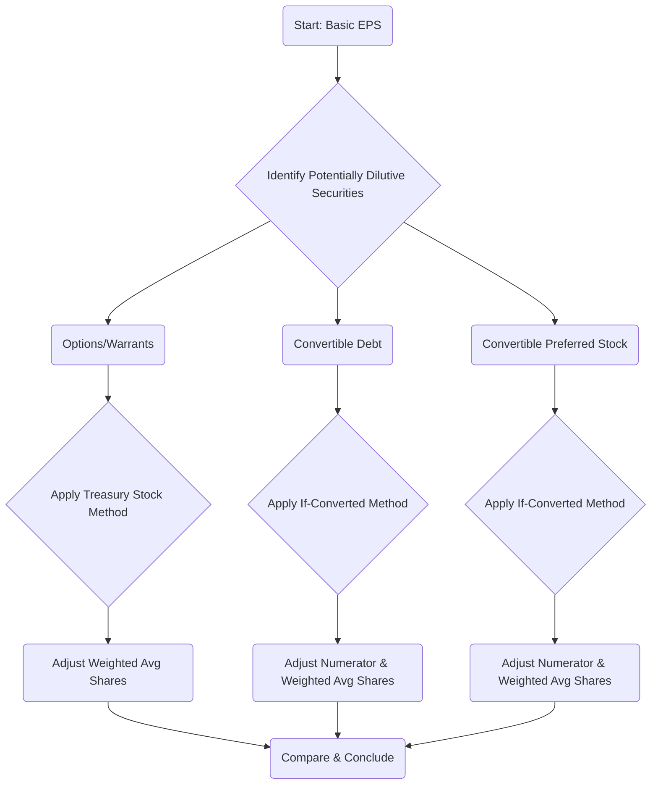

## 6.4 Earnings per Share (Basic and Diluted Calculation)

Earnings per Share (EPS) is a critical metric used by investors, analysts, and other financial statement users to assess a company's performance on a per-share basis. Publicly traded companies—particularly those regulated by the Securities and Exchange Commission (SEC)—are required to report both Basic EPS and Diluted EPS to provide clarity on how equity structure and potential dilutive instruments affect a firm’s performance. This section covers the conceptual background of EPS, mechanics of calculation, considerations for common share equivalents, the impact of convertible debt and convertible preferred stock, and how to present EPS for continuing operations versus net income, under U.S. GAAP. Comparisons to IFRS and related best practices in disclosures round out this discussion.

--------------------------------------------------------------------------
### Importance of EPS in Public Reporting
EPS provides a standardized figure that condenses a company’s profitability into “per-share” terms. Because net income alone does not reveal how the profits are allocated among existing and potential shares, EPS is often used as a benchmark to compare performance across time and against peers. Investors also rely on EPS to evaluate the potential diluted impact of additional shares entering the market (e.g., through options exercised, convertible securities converted, or other factors).

--------------------------------------------------------------------------
### Overview and Relevant Accounting Standards
Under U.S. GAAP, the authoritative guidance for EPS is primarily found in ASC 260, “Earnings Per Share.” Key topics include:
• The calculations and presentation of Basic EPS and Diluted EPS.  
• Special rules for handling stock options, warrants, restricted shares, convertible debt, and convertible preferred stock.  
• Presentation of EPS for continuing operations, discontinued operations, and net income.  

Within IFRS, International Accounting Standard (IAS) 33 governs EPS calculations. While the core principles remain similar, users should note certain differences (e.g., treatment of certain contingently issuable shares), though these differences are gradually converging.

--------------------------------------------------------------------------
### Basic Earnings per Share
Basic EPS = (Net Income – Preferred Dividends) / Weighted Average Number of Common Shares Outstanding

Basic EPS is often considered the starting point. It focuses on the actual common shares outstanding during the period without adjusting for potential share conversions or exercises. It is calculated by dividing the income available to common shareholders by the weighted average number of common shares outstanding throughout the reporting period.

#### 1. Income Available to Common Shareholders
• Net Income (or Net Loss) is the starting point for EPS.  
• Subtract dividends on preferred stock (if these are cumulative or declared and paid) from Net Income to derive the amount of income available to holders of common stock.  

Example: If a company reports Net Income of \$1,000,000 and has \$50,000 in annual preferred dividends (whether declared or undeclared if cumulative), income available to common shareholders is \$950,000.

#### 2. Weighted Average Number of Common Shares
• Companies rarely have a constant number of shares outstanding throughout a reporting period—shares can be issued, repurchased, or retired at various dates.  
• The weighted average method apportions the number of shares outstanding for the fraction of the time period they were outstanding.  

Example:  
• Company begins the year with 500,000 shares.  
• On April 1, the company issues 100,000 shares.  
• On October 1, the company repurchases 50,000 shares.  

Weighted average calculation:

┌───────────────────────┬───────────────────────┐
│ Period                │ Shares Outstanding    │
├───────────────────────┼───────────────────────┤
│ Jan 1 - Mar 31 (3/12) │ 500,000              │
│ Apr 1 - Sep 30 (6/12) │ 600,000              │
│ Oct 1 - Dec 31 (3/12) │ 550,000              │
└───────────────────────┴───────────────────────┘

Weighted average shares   
= (500,000 × 3/12) + (600,000 × 6/12) + (550,000 × 3/12)  
= 125,000 + 300,000 + 137,500  
= 562,500  

By dividing income available to common shareholders by 562,500, you obtain Basic EPS for the period.

--------------------------------------------------------------------------
### Reporting Earnings per Share for Multiple Components
GAAP requires disclosure of EPS for the following line items in the income statement:
1. Continued Operations: EPS from the portion of net income attributed to continuing operations.  
2. Discontinued Operations (if applicable).  
3. Net Income (bottom-line figure).

Companies often show EPS on the face of the income statement, typically as “Basic EPS” and “Diluted EPS.” The continuing operations EPS figure is shown before the EPS for discontinued operations, with net income EPS last.

--------------------------------------------------------------------------
### Diluted Earnings per Share
Diluted EPS recognizes that other securities—such as convertible bonds, convertible preferred stock, stock options, warrants, and other potentially dilutive instruments—might be converted or exercised, increasing total shares outstanding and thus reducing the per-share earnings figure.

The formula for Diluted EPS is generally:

Diluted EPS = (Net Income – Preferred Dividends + Convertible Adjustments)  
              / (Weighted Average Shares + Dilutive Potential Shares)

The numerator might be adjusted if a security’s assumed conversion eliminates related interest or dividends. The denominator is increased to reflect the number of additional shares from these conversions or exercises that would dilute EPS.

--------------------------------------------------------------------------
#### Step-by-Step Process for Calculating Diluted EPS

To better visualize how each step flows, consider the following diagram illustrating a typical path to compute Diluted EPS:

1. Identify all potentially dilutive securities.  
2. Apply the specific method (treasury stock method for options/warrants and the if-converted method for convertible instruments).  
3. Compute the incremental shares that would be added if these securities were exercised or converted.  
4. Adjust the numerator, if applicable, for saved interest (net of tax) or saved preferred dividends.  
5. Recompute EPS for each category of dilutive security, layering them in from the most dilutive to the least dilutive.  
6. Conclude with the final Diluted EPS figure.

--------------------------------------------------------------------------
### Common Share Equivalents
Common share equivalents are financial instruments (or components thereof) that can be immediately converted into or create additional shares of common stock. They factor into Diluted EPS calculations because they have the potential to reduce the per-share figure.

Examples:  
• Stock options, restricted stock units (RSUs), warrants (using treasury stock method).  
• Convertible debt/preferred stock (using if-converted method).  
• Contingently issuable shares (e.g., performance-based shares if conditions are satisfied).  

--------------------------------------------------------------------------
### Treasury Stock Method (Options and Warrants)
Under the Treasury Stock Method:  
1. Assume in-the-money options/warrants are exercised at the beginning of the period (or issuance date if later).  
2. The proceeds received from the assumed exercise are used to hypothetically buy back shares at the average market price during the period.  
3. The net increase in shares (exercised shares issued less treasury shares repurchased) is added to the denominator of Diluted EPS.

Example:  
• A company has 10,000 outstanding call options with an exercise price of \$20/share.  
• The average market price over the period is \$25/share.  

Steps:  
• Assumed that 10,000 options are exercised: 10,000 additional shares.  
• Proceeds = 10,000 × \$20 = \$200,000.  
• At \$25/share, \$200,000 buys back 8,000 shares from the market.  
• Net increase in shares = 10,000 - 8,000 = 2,000 shares.  

This net increase is then added to the denominator as part of Diluted EPS. Since there are no adjustments to the numerator for options, there is no effect on net income.

--------------------------------------------------------------------------
### If-Converted Method (Convertible Debt/Preferred Stock)
Convertible debt and convertible preferred stock require the if-converted method, which assumes the instruments were converted into common stock at the earliest possible date during the reporting period (or issuance date, if later).

#### 1. Convertible Debt
• Numerator Adjustment: Add back interest on the convertible debt (net of tax) to income available to common shareholders, because by assuming conversion, the company is no longer obligated to pay interest.  
• Denominator Adjustment: Increase shares outstanding by the number of shares that would be issued upon conversion.

Example:  
• \$1,000,000 of convertible bonds paying 5% annual interest (market interest rates do not matter here, just the coupon rate).  
• Tax rate = 25%.  
• The bond is convertible into 50,000 shares of common stock.  
• Net income available to common shareholders is \$500,000 (basic figure).  

Steps for Diluted EPS if assumed conversion:  
• Numerator: Basic net income available to common = \$500,000.  
• Add interest net of tax: 5% × \$1,000,000 = \$50,000 interest, net of tax = \$50,000 × (1 – 25%) = \$37,500.  
• Adjusted numerator = \$500,000 + \$37,500 = \$537,500.  
• Denominator: Add 50,000 shares for the conversion.  

Diluted EPS if-converted = \$537,500 / (Weighted Avg. Shares + 50,000)

#### 2. Convertible Preferred Stock
Convertible preferred stock under the if-converted method requires:  
• Numerator Adjustment: Add back any preferred dividends (if previously subtracted).  
• Denominator Adjustment: Add the shares issued upon conversion to the common shares outstanding.  

Example:  
• \$100,000 par value in preferred stock with a 10% dividend rate, convertible into 20,000 common shares.  
• Net income available to common shareholders = \$300,000 (after subtracting the \$10,000 in preferred dividends for basic EPS).  

Steps for Diluted EPS if assumed conversion:  
• Numerator: \$300,000 + \$10,000 = \$310,000.  
  (Because the preferred dividends are no longer subtracted if we assume conversion.)  
• Denominator: Increase by 20,000 shares.  

Diluted EPS = \$310,000 / (Weighted Avg. Shares + 20,000)

--------------------------------------------------------------------------
### Incremental Approach and Order of Dilution
When companies have multiple categories of dilutive securities, they are added to the calculation in an order that typically goes from the most dilutive to the least dilutive. In practice, all potentially dilutive securities are considered. However, if any security’s assumed conversion or exercise would increase EPS (i.e., be anti-dilutive), it is excluded from the Diluted EPS calculation.

--------------------------------------------------------------------------
### Presentation of EPS for Continuing Operations vs. Net Income
GAAP requires that both Basic and Diluted EPS appear on the face of the income statement for:
• Income (or loss) from continuing operations.  
• Net income (or net loss).  

If there are discontinued operations, each line may present a per-share figure, or if it is not a separate line item on the income statement, disclosures will typically appear in the notes. The most critical point is that the continuing operations EPS figure appears prominently to highlight performance from the ongoing business.

--------------------------------------------------------------------------
### Example: Comprehensive EPS Calculation (Including Multiple Securities)

Assume the following data for XYZ Corp for the year ended December 31:
• Net Income = \$2,000,000.  
• Preferred dividends (cumulative) = \$100,000.  
• Weighted average common shares = 1,000,000.  
• 2,000 outstanding call options (exercise price of \$50, average market price \$70).  
• \$1,000,000 of convertible bonds at 5% coupon, convertible into 40,000 shares, tax rate = 25%.  

Steps:

1. Basic EPS  
   • Numerator (Income to common) = \$2,000,000 – \$100,000 = \$1,900,000  
   • Denominator (Wtd. Avg. Shares) = 1,000,000  
   • Basic EPS = \$1,900,000 / 1,000,000 = \$1.90  

2. Diluted EPS – Step 1: Treasury Stock Method for Options  
   • Options: 2,000 × \$50 = \$100,000 proceeds.  
   • Shares issued upon exercise = 2,000.  
   • Shares repurchased at \$70 with \$100,000: \$100,000 / \$70 ≈ 1,429 shares.  
   • Net increase in shares = 2,000 – 1,429 = 571 shares (rounded).  
   • New share count (temporary) = 1,000,000 + 571 = 1,000,571  

   No numerator adjustment for stock options, so numerator remains \$1,900,000.

   Diluted EPS so far (including only options) = \$1,900,000 / 1,000,571 ≈ \$1.90 (rounded)

3. Diluted EPS – Step 2: If-Converted for Convertible Bonds  
   • Interest saved = \$1,000,000 × 5% = \$50,000.  
   • After-tax interest = \$50,000 × (1 – 25%) = \$37,500.  
   • Numerator = \$1,900,000 + \$37,500 = \$1,937,500.  
   • Denominator = 1,000,571 + 40,000 = 1,040,571  

   Diluted EPS assuming all conversions = \$1,937,500 / 1,040,571 ≈ \$1.86  

Hence, in this example:  
• Basic EPS: \$1.90  
• Diluted EPS: \$1.86  

On the income statement, XYZ Corp would present the following EPS data for continuing operations (if all the above data pertains to continuing operations) and for net income if the entire amount is from continuing operations:

--------------------------------------------------------------------------
### IFRS Similarities and Differences
Under IFRS (IAS 33):  
• Both basic and diluted EPS must be presented on the face of the income statement for profit or loss from continuing operations and net profit or loss attributable to ordinary shareholders.  
• The calculation methods (treasury stock vs. if-converted) are largely similar to those under U.S. GAAP.  
• Slight differences exist in how contingently issuable shares are treated.  

Nonetheless, the conceptual objective—to show the effect of dilution on per-share earnings—is the same.

--------------------------------------------------------------------------
### Key Disclosures and Presentation
GAAP requires key disclosures in the notes to the financial statements, including:  
• Reconciliation of the numerators and denominators used in calculating basic and diluted EPS.  
• Discussion of any material conversions or exercises that occurred post-balance sheet date but before issuance of the financial statements (subsequent events).  
• Anti-dilutive securities that were excluded from the Diluted EPS calculation, along with the number of such excluded shares.  

--------------------------------------------------------------------------
### Best Practices and Common Pitfalls
1. **Timely Data Gathering**: Accurately tracking the issuance and repurchase of shares can be complicated. Maintain an organized share register.  
2. **Watch for Partial-Period Effects**: Adjust for changes in shares outstanding promptly, especially for mid-year share issuances or conversions.  
3. **Identify Anti-Dilutive Circumstances**: If the exercise price or conversion terms increase EPS rather than decrease it, exclude these shares from the calculation.  
4. **Keep an Eye on Complex Capital Structures**: Entities with multiple classes of shares, complex convertible agreements, and share-based compensation must be meticulous in layering out the impact of each security.  
5. **Disclosures**: Provide transparent disclosures for users to understand potential future dilution.

--------------------------------------------------------------------------
### Practical Insights and Real-World Considerations
• **Volatile Stock Prices**: Rapidly changing stock prices can alter the treasury stock method adjustments significantly, especially for companies with frequent fluctuations.  
• **Convertible Instruments Trigger Events**: Conversion may be triggered by changes in interest rates, credit ratings, or covenant breaches. Watch for these triggers to see if debt is more likely to convert.  
• **Preferred Dividends**: Cumulative vs. non-cumulative dividends can alter the basic EPS numerator, even if dividends aren’t declared.  
• **Continuing vs. Discontinued Operations**: Always clarify how much EPS pertains to the core operations of the firm. This is particularly relevant if a major portion of the business is sold or spun off.

--------------------------------------------------------------------------
### References for Further Exploration
• ASC 260 – Earnings Per Share  
• IAS 33 – Earnings Per Share  
• FASB Accounting Codification for convertible instruments (ASC 470-20)  
• Guidance on share-based payments (ASC 718)  
• AICPA Publications on EPS with examples and case studies  

---------------------------------------------------------------------------

## Mastering Earnings per Share: Basic & Diluted EPS Quiz



### In Basic EPS calculations, how are preferred dividends treated when computing income available to common shareholders?  
- [x] They are subtracted from net income if they are cumulative or declared for the period.  
- [ ] They are only subtracted if there is a net loss for the period.  
- [ ] They are never subtracted from net income.  
- [ ] They are added to net income before dividing by weighted average shares.  

> **Explanation:** For Basic EPS, net income must be reduced by the amount of preferred dividends (whether declared for the period or cumulative). Only the residual amount is considered income available to common shareholders.

### Which per-share measures are required on the face of the income statement according to GAAP?  
- [x] Basic EPS and Diluted EPS for both continuing operations and net income  
- [ ] Only Basic EPS for continuing operations  
- [ ] Only Diluted EPS for net income  
- [ ] Diluted EPS for discontinued operations only  

> **Explanation:** GAAP mandates that both Basic and Diluted EPS for continuing operations and net income (and if relevant, discontinued operations) appear on the face of the statement.

### Under the treasury stock method for options, what happens with the assumed proceeds the company hypothetically receives from exercise?  
- [x] They are used to buy back shares at the average market price.  
- [ ] They are added directly to the numerator of the EPS calculation.  
- [ ] They are ignored in EPS computations.  
- [ ] They are recognized as revenue.  

> **Explanation:** Under the treasury stock method, the exercise proceeds are used to purchase treasury shares at the average market price, reducing the net increase in shares added to the denominator for Diluted EPS.

### Which EPS figure might exclude potentially dilutive convertible securities?  
- [x] Basic EPS  
- [ ] Diluted EPS  
- [ ] Both Basic and Diluted EPS  
- [ ] Neither Basic nor Diluted EPS  

> **Explanation:** Basic EPS focuses solely on the actual common shares outstanding, without considering any potentially dilutive effect of convertible securities. Diluted EPS incorporates those potential shares.

### What adjustment is made to the numerator in a Diluted EPS calculation using the if-converted method for convertible debt?  
- [x] Add back interest (net of tax) related to the convertible debt.  
- [ ] Subtract interest (net of tax).  
- [x] Subtract accrued dividends.  
- [ ] Add any undistributed net income.  

> **Explanation:** For convertible debt, you add back the interest net of taxes that would have been paid if the bonds were not converted. (Note: The question includes two correct statements—adding back interest net of tax and subtracting accrued dividends if convertible preferred stock is involved—but the main highlight when dealing with convertible debt is adding back interest net of tax.)

### Which of the following would be deemed anti-dilutive and thus excluded from the Diluted EPS computation?  
- [x] A convertible security whose inclusion increases the overall EPS figure.  
- [ ] Options that are in-the-money and reduce EPS.  
- [ ] Stock warrants with an exercise price lower than the average market price.  
- [ ] Convertibles that lower the EPS figure.  

> **Explanation:** If including the security results in a higher EPS, then it is anti-dilutive and should be excluded from the final Diluted EPS calculation.

### For Convertible Preferred Stock in the if-converted method, which adjustment is made to the numerator?  
- [x] Add back preferred dividends that were originally subtracted.  
- [ ] Subtract interest expense.  
- [x] Add back interest net of tax.  
- [ ] Add negative goodwill.  

> **Explanation:** When assuming conversion of preferred stock, the previously subtracted preferred dividends are added back to the numerator because those dividends would no longer be paid.

### How does the presentation of EPS differ under IFRS (IAS 33) compared to U.S. GAAP (ASC 260)?  
- [x] They are broadly similar, both presenting basic and diluted EPS on the face of the statement; differences relate mostly to certain contingently issuable shares.  
- [ ] IFRS does not require EPS disclosure at all.  
- [ ] U.S. GAAP forbids presenting EPS for discontinued operations.  
- [ ] IFRS only presents Basic EPS.  

> **Explanation:** IFRS and U.S. GAAP both require basic and diluted EPS on the face of the statement, but differences in contingent shares and other nuanced areas may arise.

### Which statement best characterizes the role of weighted average shares in computing Basic EPS?  
- [x] Shares are weighted by the length of time they are outstanding during the period.  
- [ ] All shares issued are simply counted at year-end.  
- [ ] Shares are only counted if they have voting rights.  
- [ ] Fractional share changes within the year are generally ignored unless they are above 1%.  

> **Explanation:** The key aspect is that each share (or share issuance/repurchase) is accounted for in proportion to the fraction of the reporting period it was outstanding.

### A company has continuing operations and discontinued operations. How should it present EPS figures under U.S. GAAP?  
- [x] Present Basic and Diluted EPS for continuing operations and for net income; disclose the effect of discontinued operations.  
- [ ] Present only a single Basic EPS figure for the entire net income.  
- [ ] Present a single Diluted EPS that aggregates continuing and discontinued operations.  
- [ ] No special presentation is required for discontinued operations.  

> **Explanation:** U.S. GAAP requires EPS for continuing operations, discontinued operations (if material), and net income, ensuring clarity about the performance from ongoing vs. discontinued segments.



---

## For Additional Practice and Deeper Preparation

**[FAR CPA Hardest Mock Exams: In-Depth & Clear Explanations](https://www.udemy.com/course/far-cpa-mock-exams/?referralCode=F88050F8D5C76764F6BD)**  

**Financial Accounting and Reporting (FAR) CPA Mocks:** 6 Full (1,500 Qs), Harder Than Real! In-Depth & Clear. Crush With Confidence!

- Tackle full-length mock exams designed to mirror real FAR questions.  
- Refine your exam-day strategies with detailed, step-by-step solutions for every scenario.  
- Explore in-depth rationales that reinforce higher-level concepts, giving you an edge on test day.  
- Boost confidence and minimize anxiety by mastering every corner of the FAR blueprint.  
- Perfect for those seeking exceptionally hard mocks and real-world readiness.  

_Disclaimer: This course is not endorsed by or affiliated with the AICPA, NASBA, or any official CPA Examination authority. All content is for educational and preparatory purposes only._
