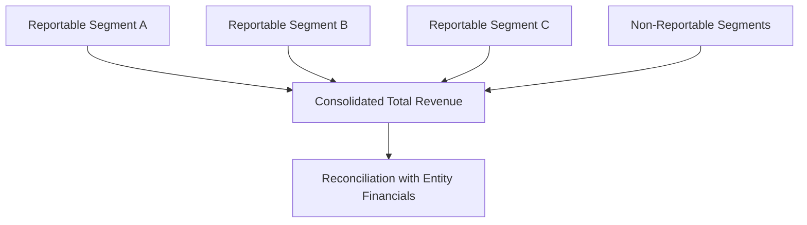

## 6.5 Segment Reporting (Identifying Reportable Segments, Disclosure Requirements)

Segment reporting offers stakeholders a clear look into the distinct operating units contributing to an entity’s consolidated results. By disaggregating financial information, companies provide investors, creditors, and regulators with deeper insight into the risk and return profiles of their various lines of business. For public companies in the United States, generally accepted accounting principles (GAAP) for segment reporting are primarily governed by ASC 280 (Segment Reporting). This section outlines the techniques and regulatory requirements to identify reportable segments, determine quantitative thresholds, and present segment disclosures that reconcile to consolidated financial statements.

-------------------------------------------------------------------------------

## Purpose and Foundation of Segment Reporting

Segment reporting aims to provide financial statement users with a transparent view of how an enterprise is organized and how management evaluates performance and allocates resources. The primary objectives:

• Enhance the predictive value of financial statements.  
• Improve the assessment of relative risks and returns.  
• Align external reporting with the entity’s internal financial data, emphasizing the “management approach.”

The “management approach” under ASC 280 focuses on how the leaders of an organization manage, evaluate, and discuss operating results internally. This approach ensures that the same metrics used by the Chief Operating Decision Maker (CODM) to allocate resources and measure performance become the basis for external segment disclosures.

-------------------------------------------------------------------------------

## Identifying Operating Segments

An “operating segment” is defined by three key criteria:

1. The business component engages in revenue-producing activities, and incurs expenses.  
2. The business component’s results are regularly reviewed by the CODM to make resource allocation and performance evaluation decisions.  
3. Discrete financial information is available for that business component—meaning it tracks revenue, expenses, profits, or other performance measures separately.

### Chief Operating Decision Maker (CODM)
The CODM is not necessarily a single individual; rather, it represents the function that decides where and how company resources will be deployed. In some large corporations, the CODM might be an executive committee, while in others, it may be a single executive officer (e.g., CEO or COO).

### Internal Organizational Structures
Companies often conduct a preliminary assessment of their internal structure, including lines of business, product lines, geographical territories, or other profit centers, to determine operating segments.  
• An entity might have numerous divisions, but not all divisions qualify as separate operating segments if the CODM does not regularly review their individual performance.  
• Some divisions might be aggregated or combined if they share similar economic characteristics and meet criteria for aggregation (discussed later).

-------------------------------------------------------------------------------

## Aggregating Operating Segments

After identifying operating segments, management may aggregate certain segments if they share common economic characteristics. According to ASC 280, segments can be combined when they:

• Offer similar products and services.  
• Use similar production processes (or distribution channels).  
• Operate within similar regulatory environments.  
• Serve a similar customer base.  
• Have similar long-term averages of gross margins or other profitability metrics.

Aggregation allows organizations to avoid excessive detail in reporting. However, proper aggregation should carefully respect the principle of meaningful disclosure. Over-aggregation can mask the underlying performance of individual segments, while under-aggregation can overwhelm statements with excessive, immaterial detail.

-------------------------------------------------------------------------------

## Determining Reportable Segments

### Quantitative Thresholds
ASC 280 provides three principal quantitative tests to determine whether an operating segment is “reportable”:

1. Revenue Test  
   A segment’s reported revenues (both external and intersegment) must be ≥ 10% of the combined revenues of all reported segments (including intersegment sales).  
2. Profit or Loss Test  
   The absolute measure of the segment’s profit or loss must be ≥ 10% of the greater of:  
   (a) The total of all segments that reported profits  
   (b) The total of all segments that reported losses (taken as an absolute amount)  
3. Asset Test  
   A segment’s assets must be ≥ 10% of the combined total assets of all segments.

If any given operating segment meets one or more of these thresholds, it must be reported separately—unless it is aggregated with other segments that share similar characteristics. However, management may choose to separately disclose a segment that does not meet these thresholds if it deems the segment’s disclosure useful to stakeholders.

### Additional 75% Rule
In addition to the above thresholds, the total external revenue of all disclosed segments must account for at least 75% of the entity’s consolidated external revenue. If after disclosing all segments meeting the quantitative tests the total external revenue of these reported segments is still below 75% of consolidated external revenue, additional segments must be reported—even if they do not individually meet the 10% threshold—until the 75% criterion is satisfied.

### Limit on the Number of Segments
If too many segments are deemed reportable, financial report users may be inundated with excessive detail. In practice, the FASB does not prescribe a specific maximum number of reportable segments. Rather, the guidance suggests that an organization should consider limiting the proliferation of segments by applying appropriate aggregation criteria.

-------------------------------------------------------------------------------

## Required Segment Disclosures

Once an entity identifies its reportable segments, it must disclose specific operating results, risks, and resources associated with each. The main categories of information to disclose include:

1. General Information  
   • Factors used to identify reportable segments.  
   • Types of products and services from which each segment derives its revenues.  
   • Information about how operating segments relate to each other, if aggregated.  

2. Segment-Level Profit or Loss  
   Entities must explain the measurement used to determine segment profit or loss, consistent with internal reports reviewed by the CODM. Typically, this disclosure includes:  
   • Revenues from external customers.  
   • Intersegment revenues where material.  
   • Interest revenue and interest expense, if these amounts are used in measuring segment profit/loss.  
   • Depreciation, amortization, or other major noncash expenses noted by management.  
   • Unusual or infrequent items that affect segment profit or loss.  

3. Segment Assets  
   • Total assets for each segment.  
   • A detailed explanation if the measure of segment assets differs from amounts reported in the consolidated entity’s balance sheet.  

4. Reconciliations  
   • Reconciliation of segment revenues to the entity’s total consolidated revenues.  
   • Reconciliation of segment profit or loss to consolidated net income (or other relevant performance measure if used internally).  
   • Reconciliation of segment assets to consolidated total assets.  
   Where liabilities or certain other metrics are consistently noted to the CODM, those must also be reconciled.

5. Geographic Information  
   If material, companies must also disclose:  
   • Revenues attributed to the company’s country of domicile and foreign countries.  
   • Long-lived assets located in the company’s country of domicile and foreign countries.

6. Major Customer Information  
   Companies must identify any single external customer that provides 10% or more of the entity’s total revenues, without specifically naming the customer. Instead, the total amount of revenue from that major customer and the segments involved in generating that revenue should be disclosed.

### Measurement Consistency
The segment information disclosed should generally mirror how the CODM measures performance. This might differ from a GAAP basis for certain financial statement elements—e.g., management could measure segment performance using a different depreciation method, or exclude certain items like corporate overhead from segment profit/loss.

-------------------------------------------------------------------------------

## Reconciliation to Entity Totals

A critical part of segment reporting is bridging segment measures to the consolidated results presented in the financial statements. Firms must detail how each disclosed segment’s revenue, profit/loss, and assets tie back to the totals reported in the consolidated income statement and balance sheet.

Let’s illustrate a basic structure of reconciliation with a simplified mermaid diagram:

In this flowchart:

• Reportable Segment A, B, and C revenues roll into the aggregated “Consolidated Total Revenue.”  
• Non-Reportable Segments (aggregated) also feed into the total.  
• Reconciliation steps confirm that the sum matches the consolidated statements.

Organizations must mirror this concept for profit/loss and asset totals. If there are any reconciling items (e.g., corporate-level adjustments, intersegment eliminations, differences in measurement), they should be clearly explained.

-------------------------------------------------------------------------------

## Example: Segment Reporting for ABC Group

Consider ABC Group, a multinational corporation with three identified operating segments: Manufacturing, Distribution, and Retail. Assume the following:

• Revenues (External + Intersegment):  
  – Manufacturing: $600 million  
  – Distribution: $150 million  
  – Retail: $100 million  
  – Consolidated total: $850 million  

• Segment Profit/(Loss):  
  – Manufacturing: $100 million profit  
  – Distribution: $10 million profit  
  – Retail: $-5 million loss  

• Segment Assets:  
  – Manufacturing: $1.2 billion  
  – Distribution: $200 million  
  – Retail: $50 million  
  – Consolidated total: $1.6 billion  

### Determining Thresholds

1. Revenue Test (≥ 10% of total $850 million = $85 million)  
   – Manufacturing ($600 million) meets the revenue test.  
   – Distribution ($150 million) meets the revenue test.  
   – Retail ($100 million) meets the revenue test.

2. Profit or Loss Test (≥ 10% of the greater of (a) sum of profit segments or (b) sum of loss segments)  
   – Sum of operating profit segments: $110 million (100 + 10)  
   – Absolute loss: $5 million  
   – The greater of $110 million or $5 million is $110 million.  
   – 10% is $11 million.  
   – Manufacturing ($100 million) meets.  
   – Distribution ($10 million) is just below the threshold.  
   – Retail’s $5 million loss is below the threshold in absolute terms.  

3. Asset Test (≥ 10% of $1.6 billion = $160 million)  
   – Manufacturing ($1.2 billion) meets.  
   – Distribution ($200 million) meets.  
   – Retail ($50 million) does not meet.

Note that each segment only needs to meet one threshold. Manufacturing meets all three. Distribution meets the revenue and asset thresholds. Retail meets the revenue threshold but not the others. Even though it has a loss just below the test, it still qualifies from the revenue test perspective.

Additionally, the total external revenue from these segments (Manufacturing, Distribution, and Retail) already surpasses 75% of the entity’s consolidated revenue. Therefore, no further segments need to be disclosed solely for satisfying the 75% rule.

ABC Group’s disclosures would include:

• General descriptive information about each segment.  
• Segment-level revenues, intersegment revenues, profit or loss, and total assets.  
• Reconciliation of segment totals to the consolidated financial statements.  
• Geographic data if required (e.g., $400 million from the U.S., $450 million from other countries).  
• Major customer disclosures if any single customer’s purchases exceed 10% of total consolidated revenue (i.e., $85 million).

-------------------------------------------------------------------------------

## Common Pitfalls and Challenges

Despite the clear guidance, companies often encounter pitfalls in segment reporting:

• Over-aggregation: Combining segments that do not truly share similar economic characteristics, obscuring material differences in risk.  
• Under-aggregation: Listing every tiny profit center as a separate segment, thereby confusing users with excessive detail.  
• Misapplication of Internal Measures: Presenting profit or loss metrics that differ significantly from GAAP without providing clear reconciliation or explanation.  
• Inconsistent Use of Thresholds: Failing to revisit thresholds year-over-year. A previously nonreportable segment might grow to surpass the 10% threshold in subsequent periods.  
• Failing to Comply with the 75% External Revenue Rule: Neglecting the requirement to add additional segments until 75% coverage of external revenue is reached.

-------------------------------------------------------------------------------

## Best Practices in Segment Reporting

• Regular Internal Assessments: Continually review changes in operations, mergers, or reorganizations that may create or dissolve a segment.  
• Consistent Measurement Approaches: Maintain uniform measurement criteria across all periods to ensure comparability, or clearly disclose any measurement changes.  
• Clear Reconciliation Tables: Provide well-labeled, easy-to-follow reconciliations for segment-level revenue, profit/loss, assets (and liabilities if disclosed).  
• Thoughtful Aggregation: Aggregate operating segments only when they share fundamentally similar economic profiles, and disclose the rationale.  
• Early Stakeholder Involvement: Communicate with auditors, legal counsel, and investor relations to ensure segment reporting aligns with user needs.

-------------------------------------------------------------------------------

## Summary

Segment reporting is a powerful tool in enhancing the decision-usefulness of financial statements. By implementing a “management approach,” ASC 280 ensures external users have access to the same performance metrics employed by an organization’s CODM. The process of identifying reportable segments rests on both qualitative and quantitative considerations, following the 10% thresholds and 75% rule for aggregated revenue coverage. Furthermore, segment disclosures revolve around consistent presentation, including segment-level assets, profit or loss, reconciliation to entity totals, plus additional geographic and major customer information.  

When effectively executed, segment reporting provides clearer insights for investors, creditors, and other stakeholders. It also compels corporate management to maintain detailed, reliable internal reporting processes. The result is a more transparent portrayal of a company’s strategic operations and performance, crucial for modern business analysis and informed decision-making.

-------------------------------------------------------------------------------

## Mastering Segment Reporting: 10 Essential Exam Questions



### A company's CODM reviews only revenue and profit data for three distinct business divisions. Which criterion most strongly indicates that each division is an operating segment?
- [ ] The divisions may occasionally have shared overhead costs.  
- [x] The divisions each have discrete financial information that the CODM regularly evaluates.  
- [ ] The divisions' products are sold in the same geographic region only.  
- [ ] The divisions have different fiscal year-ends.  

> **Explanation:** Under ASC 280, an operating segment must have discrete financial information that is regularly reviewed by the CODM. Shared overhead or identical geography does not alone establish segment status; management’s review of discrete data is key.

### When aggregating multiple operating segments into one reportable segment, which factor should be present to justify the combining of segments?
- [x] Similar economic characteristics in terms of long-term gross margins.  
- [ ] Shared legal counsel.  
- [ ] Similar number of employees.  
- [ ] Proximity of operational facilities.  

> **Explanation:** ASC 280 requires that combined operating segments share similar economic characteristics, such as long-term gross margins, and have similar products, processes, and regulatory environments.

### Company X has three operating segments with the following external revenues: Segment A = $40M, Segment B = $100M, and Segment C = $60M. Consolidated revenue is $200M. Which statement is true regarding the revenue threshold for reportable segments?
- [ ] Segment A meets the threshold because its revenue is 25% of Segment B's revenue.  
- [ ] None of the segments meet the threshold.  
- [x] Segment B meets the threshold by exceeding 10% of $200M.  
- [ ] Segments A and C both meet the 10% threshold.  

> **Explanation:** The revenue threshold is 10% of consolidated revenue ($20M in this scenario). Segment B exceeds $20M, so it meets the threshold. Segments A ($40M) and C ($60M) both exceed $20M, so they also meet the threshold. The correct interpretation is that B definitely meets it; A and C also exceed $20M, so they meet it, but the question emphasizes which segment meets the threshold. Strictly, A = $40M and C = $60M also exceed $20M. The correct statement focusing on the threshold is that B meets it by exceeding $20M; in fact, A and C do as well, but the provided option about B is the correct one among these choices.

### Under ASC 280, which of the following items is not necessarily required to be disclosed for each reportable segment?
- [ ] Segment profit or loss.  
- [x] Segment-level Statement of Cash Flows.  
- [ ] Segment revenues from external customers.  
- [ ] Total segment assets.  

> **Explanation:** ASC 280 does not require a separate statement of cash flows for each segment. It does require profit or loss, revenues, and total assets, along with other reconciliations to consolidated amounts.

### A corporation’s segment information shows total external revenues for its reportable segments to be 68% of the entity’s consolidated external revenue. Which requirement applies under ASC 280?
- [x] The corporation must disclose additional segments until at least 75% of consolidated external revenue is included.  
- [ ] The corporation must discontinue reporting any segments below 10% of total revenues.  
- [ ] The corporation must reclassify intersegment profits as external income.  
- [ ] No action is required as long as each reported segment individually meets the 10% threshold.  

> **Explanation:** Once the combined total external revenue from reported segments is below 75% of consolidated external revenue, the entity must add additional segments to meet the 75% rule thus ensuring that substantially all external operations are represented in disclosed segments.

### How should an entity measure profit or loss for segment reporting purposes under the management approach?
- [x] Use the same measure that is reported to the CODM for internal decision-making.  
- [ ] Prepare the measure strictly according to GAAP profit or loss.  
- [ ] Only include noncash expenses such as depreciation in the segment measure of profit or loss.  
- [ ] Exclude any intercompany eliminations.  

> **Explanation:** Under the management approach, segment profit or loss is measured by the same metrics used internally by the CODM, even if that differs from formal GAAP-based income figures.

### When reconciling segment-level results to the entity’s consolidated financial statements, which of the following must be disclosed if used internally and materially affects segment metrics?
- [x] Interest income and expense.  
- [ ] Depreciation method reconciliations only.  
- [x] Intersegment transfers and eliminations.  
- [ ] The tax treatment for foreign subsidiaries only.  

> **Explanation:** If interest income/expense or intersegment transfers are included in segment measures, they must be disclosed and reconciled. The reconciliation must clearly bridge segment-level data to the consolidated totals.

### Which of the following is most critical in determining whether an operating segment is reportable solely on a qualitative basis (i.e., even though it does not meet 10% revenue, profit, or asset thresholds)?
- [x] Management believes the segment’s disclosure would provide relevant information to users.  
- [ ] The segment has a new manager who wants to showcase growth projections.  
- [ ] The segment is mostly an internal overhead cost center with minimal external sales.  
- [ ] The segment only operates in an emerging market.  

> **Explanation:** Even if a segment does not meet any quantitative threshold, it may still be designated as reportable if management deems disclosures about the segment to be meaningful for investors and other users.

### A major customer accounts for $80M of a company's $750M revenue. Does the company need to disclose this relationship under segment reporting standards?
- [x] Yes, because it meets the 10% threshold of total revenue.  
- [ ] No, because the customer’s purchases do not exceed $100M.  
- [ ] No, the company must not disclose private customer information.  
- [ ] Only if the same customer does not purchase from multiple segments.  

> **Explanation:** ASC 280 requires the disclosure of major customers when total revenues from that customer are ≥ 10% of consolidated revenue. The standard protects the actual identity of the customer but requires disclosure of the total revenue and the segments affected.

### A company reports three operating segments that meet the quantitative thresholds. However, in the current year, a fourth segment, previously not disclosed, now makes up 15% of consolidated revenues. Which statement best addresses the shift?
- [x] The company should evaluate whether the newly expanded segment is now reportable.  
- [ ] The company may continue to combine it with other segments until formal reorganization.  
- [ ] The company should restate prior periods by combining all small segments.  
- [ ] The company is not required to take any action if it has no CODM review.  

> **Explanation:** Once a previously nonreportable segment exceeds one of the thresholds, the company must evaluate and likely disclose it as a separate segment in the current period if the CODM is reviewing it. Prior periods may be restated for consistency, but that depends on how the standard addresses comparability requirements.



-------------------------------------------------------------------------------

## For Additional Practice and Deeper Preparation

[**FAR CPA Hardest Mock Exams: In-Depth & Clear Explanations**](https://www.udemy.com/course/far-cpa-mock-exams/?referralCode=F88050F8D5C76764F6BD)

Financial Accounting and Reporting (FAR) CPA Mocks: 6 Full (1,500 Qs), Harder Than Real! In-Depth & Clear. Crush With Confidence!

- Tackle full-length mock exams designed to mirror real FAR questions.  
- Refine your exam-day strategies with detailed, step-by-step solutions for every scenario.  
- Explore in-depth rationales that reinforce higher-level concepts, giving you an edge on test day.  
- Boost confidence and minimize anxiety by mastering every corner of the FAR blueprint.  
- Perfect for those seeking exceptionally hard mocks and real-world readiness.

_Disclaimer: This course is not endorsed by or affiliated with the AICPA, NASBA, or any official CPA Examination authority. All content is for educational and preparatory purposes only._
