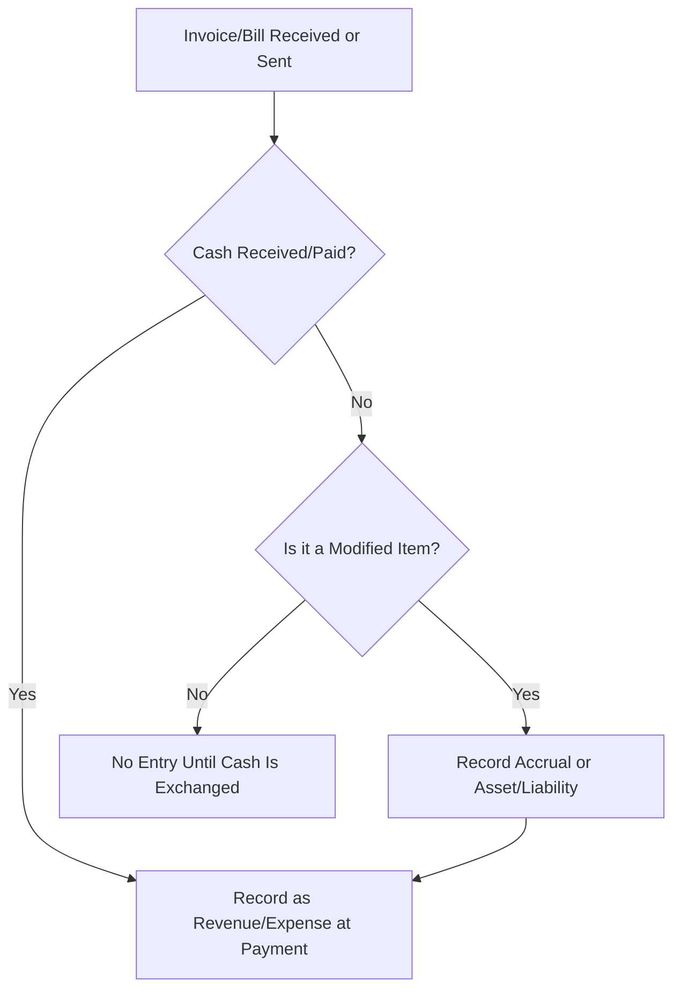

## 7.1 Cash-Basis and Modified Cash-Basis Financial Statements

Cash-basis and modified cash-basis financial statements are frequently employed by smaller organizations, professional service providers, and other entities that do not require the extensive complexities of U.S. GAAP-based accrual measurements. These special purpose frameworks can be more streamlined and often less costly to maintain, yet they must still present financial information accurately to assist internal and external users in making meaningful assessments. This chapter explores the fundamental principles, the benefits, and the downsides of using cash-basis and modified cash-basis reporting; it also examines specific variations that organizations commonly adopt, along with best practices and pitfalls to avoid.

### Foundations of Special Purpose Frameworks

A special purpose framework (sometimes referred to as an other comprehensive basis of accounting—OCBOA) is a coherent accounting framework other than GAAP that organizations may use to prepare their financial statements. These frameworks often simplify the recognition and measurement requirements found in GAAP. Common special purpose frameworks include:

• Cash-basis financial statements  
• Modified cash-basis financial statements  
• Tax-basis financial statements (see §7.2)  
• Regulatory- or contractual-basis statements  

This section deals specifically with the cash-basis and its modifications, both of which offer a simplified approach, focusing on the point at which cash either enters or leaves the organization.

--------------------------------------------------------------------------------

### The Pure Cash-Basis Approach

Under the pure cash-basis of accounting, revenues and expenses are recognized only when cash is received or disbursed. Entities using this system do not record receivables, payables, accruals, or deferrals in a traditional sense—most noncash activities simply do not appear in the financial records until a cash transaction happens.

#### Key Features of Cash-Basis Accounting

• → Revenue Recognition: Only recognized when cash is received.  
• → Expense Recognition: Only recognized when cash is disbursed.  
• → Simplicity: The system is relatively simple to understand and maintain, often making it attractive for smaller entities.  
• → Emphasis on Liquidity: By focusing solely on actual cash inflows and outflows, the cash-basis approach gives clear insights into an entity’s immediate liquidity situation.

To see how this differs from accrual accounting, where receivables and payables are recorded when an economic event occurs regardless of when cash is exchanged, review chapters covering elements of GAAP-based recognition in this guide (see §§3.1, 3.2, and 3.5). Under GAAP, revenue is often recognized when earned, and expenses when incurred—a fundamental difference from cash-basis.

#### Advantages of Cash-Basis

1. Ease of Maintenance: Transactions are straightforward; one only records cash in or cash out.  
2. Reduced Risk of Misstatement in Receivables and Payables: Because few or no accruals exist, the risk of misstating balances for uncollected revenue or unpaid obligations is curtailed.  
3. Immediate Cash Insight: Financial statements generally display accurate data about the actual cash on hand at a given date, which supports liquidity management.

#### Disadvantages of Cash-Basis

1. Limited Matching for Income and Expenses: The alignment between related revenue and expenses may be weak. For example, significant sales at the end of a period might not be recognized as revenue if cash is not received until after the reporting date.  
2. Lack of Completeness: An entity’s obligations and resources might be misstated or omitted. A pure cash-basis balance sheet typically excludes dues from customers (accounts receivable) and pending obligations (accounts payable).  
3. External Credibility and Analysis: Lenders, regulators, or potential investors may require more robust financial data consistent with GAAP. They might request additional reconciliations.

#### Illustrative Example of Pure Cash-Basis

Imagine a freelance consultant who sells a package of services on December 10 but does not receive payment until January 15. Under the cash-basis method, no revenue would appear in December; the entire revenue recognition event would be recorded in January when the cash is actually received. Similarly, if the consultant incurred an expense in December but paid it in February, the expense would be recorded in February rather than December.

--------------------------------------------------------------------------------

### The Modified Cash-Basis Approach

Modified cash-basis reporting blends elements of the cash-basis with certain aspects of accrual accounting. It aims to retain the simplicity inherent in the pure cash method while incorporating modifications that improve the matching of revenues and expenses or the inclusion of certain significant monetary or near-monetary assets and liabilities.

#### Common Modifications

1. **Recording Long-Lived Assets and Depreciation**  
   Organizations often capitalize major equipment or property, plant, and equipment (PP&E), rather than recording the full outflow as an expense at the time of purchase. They then recognize depreciation expense over the useful life of these assets.  

2. **Recognition of Certain Payables and Accruals**  
   Entities may choose to recognize material liabilities, such as payroll taxes or mortgage balances, even though these obligations are not fully settled in the period.  

3. **Inventory Adjustments**  
   Some uses of modified cash-basis allow for inventory to be recognized as an asset at the end of the period, adjusting cost of sales accordingly.  

4. **Accrual of Income Taxes**  
   In certain frameworks, adjustments for current-year taxes payable or prepaid taxes are included in the statements to produce a more fair presentation.  

5. **Other Noncash Transactions**  
   Entities sometimes adopt partial accrual-like treatments for items considered vital to understanding financial performance, such as unearned revenue, intangible assets, or major liabilities.  

It is essential for users of these statements to fully understand the nature and extent of the modifications from pure cash-basis. Disclosures are critical so that financial statement readers can interpret the numbers in context.

#### Structure of Modified Cash-Basis Statements

Similar to a GAAP-based set of statements, the modified cash-basis typically includes:

• Statement of Assets, Liabilities, and Equity: Reflects normal balances for cash transactions, along with recognized modifications for certain accrued liabilities, capital assets, or intangible assets.  
• Statement of Revenues and Expenses: Cash receipts and disbursements adjusted by certain accrual-like entries.  
• Supplementary Disclosures: To indicate precisely which modifications to pure cash-basis have been employed.

Below is an overview diagram to compare the broad differences among pure cash-basis, modified cash-basis, and accrual (GAAP) approaches:

```mermaid
flowchart LR
    A[Transaction Occurs] --> B{Accounting Framework?}
    B -- Pure Cash-Basis --> C[Record only on cash receipt or payment]
    B -- Modified Cash-Basis --> D[Partial accrual adjustments (Selected items)]
    B -- Accrual (GAAP) --> E[Record revenues when earned and expenses when incurred]
```

Under modified cash-basis, the overriding principle remains that recognition occurs primarily upon cash receipts and disbursements. However, the modifications introduce accrual-type elements to enhance the relevance and faithful representation of the statements.

#### Benefits of Modified Cash-Basis

1. Improved Matching: By recognizing certain “big-ticket” items like long-lived assets or significant payables, users can see a closer correlation of revenue and expenses.  
2. Same Operational Ease: The system is still less complex than full accrual accounting.  
3. Flexibility: Entities can tailor modifications to their specific needs, as long as they maintain consistency and adequate disclosures.

#### Challenges and Considerations

1. Consistency of Modifications: Entities must consistently apply the same modifications from one period to the next to ensure comparability.  
2. User Understanding: Stakeholders need to comprehend which items are included or not, to interpret the statements correctly.  
3. Risk of Misinterpretation: If disclosures are limited, users may erroneously assume the statements are closer to GAAP or purely cash-based.  
4. Audit and Assurance: Auditors must be knowledgeable and experienced with the customized approach to provide accurate attestations.

--------------------------------------------------------------------------------

### Practical Applications and Examples

#### Example: Modifying for Fixed Assets and Depreciation

Assume a small law firm runs on a modified cash-basis. During the year, it purchases new furniture for its waiting room, paying $5,000 in cash. Although under a strict cash-basis system it would immediately expense the $5,000, management believes the benefits extend beyond the current year, so they adopt a modified approach:

• They capitalize the $5,000 as a furniture asset.  
• Each year, the firm records depreciation expense at $1,000 (straight-line over five years).  

In this scenario, the Balance Sheet (or Statement of Financial Position) shows a long-term asset net of accumulated depreciation, and the annual Statement of Revenues and Expenses includes a $1,000 depreciation expense. This approach more accurately represents the consumption of the furniture’s economic benefits over time than would a lump-sum expense.

#### Example: Recognizing Payroll-Related Liabilities

Consider a nonprofit organization that pays its employees bi-weekly. The final payroll of the year is partially incurred but not fully disbursed by December 31. Under pure cash-basis, no expense is recorded until January, when paychecks are issued. However, the entity chooses a modified cash-basis that recognizes wages payable and a corresponding wage expense, so they split the transaction as follows:

• As of December 31, the “wages payable” liability is recognized for the portion of salaries owed but not yet paid.  
• This approach better aligns the expense to the period in which the labor was performed.

--------------------------------------------------------------------------------

### Comparing Cash-Basis, Modified Cash-Basis, and GAAP

The following table illustrates some common components:

| Component                 | Cash-Basis                 | Modified Cash-Basis                              | GAAP Accrual                                      |
|---------------------------|-----------------------------|--------------------------------------------------|---------------------------------------------------
| Revenue Recognition       | When cash is received      | Primarily when cash is received; partial accrual for selected items | When earned (performance obligations satisfied)   |
| Expense Recognition       | When cash is paid          | Primarily when cash is paid; partial accrual for selected items | When incurred                                     |
| Accounts Receivable       | Not recognized             | Typically not recognized (unless the entity chooses)              | Always recognized                                 |
| Accounts Payable          | Not recognized             | Can be partially recognized for major items                        | Always recognized                                 |
| Fixed Assets & Depreciation | Expensed when purchased | Typically capitalized and depreciated if a modification is chosen  | Always capitalized and depreciated                |
| Inventory                 | Expensed when purchased    | May be recognized as an asset with periodic adjustments            | Recognized and measured at lower of cost or market/NRV |
| Strictness/Complexity     | Low                        | Moderate                                          | High                                             |

--------------------------------------------------------------------------------

### Best Practices for Implementing and Maintaining Cash-Basis or Modified Cash-Basis Accounting

• **Clear Policy Definitions**  
  Clearly define policies for recognition and measurement. For instance, specify thresholds for capitalizing assets or types of liabilities subject to accrual.  

• **Consistent Application**  
  Apply the same policies period to period unless there’s a compelling reason to change, and disclose any such changes.  

• **Adequate Documentation**  
  Retain documentation for modifications, including support for calculations (e.g., depreciation schedules) and decisions about which liabilities to accrue.  

• **Strong Internal Controls Over Cash**  
  Since statements rely heavily on cash transactions, it is essential to have robust controls over cash handling, reconciling bank statements, and verifying completeness of incoming and outgoing cash.  

• **Transparent Disclosures**  
  Provide readers with enough information to understand precisely which modifications have been made, how they are applied, and their effect on the statements.  

• **Regular Reassessment**  
  Over time, the entity’s complexity may grow, or user needs may evolve. The entity should consider whether continued use of the special purpose framework is still appropriate.  

--------------------------------------------------------------------------------

### Common Pitfalls and How to Avoid Them

• **Incomplete Disclosure of Modifications**: Entities might forget to detail exactly which items are accounted for on a modified basis. This can lead to confusion and potential misinterpretation.  
  → To avoid: Provide a clear and comprehensive note to the financial statements describing modifications.

• **Inconsistent Treatment Period Over Period**: Sometimes organizations apply a modification (e.g., capitalizing a certain type of equipment) in one period but not the next.  
  → To avoid: Document policies and apply them consistently, with changes requiring robust justification and disclosure.

• **Underestimating the Impact of Debt Obligations**: Under pure cash-basis, principal payments might be recorded as expenses and interest as additional expenses only when actually paid, potentially obscuring the true financial burden of debt obligations.  
  → To avoid: If highly leveraged, consider a modified approach that discloses debt and associated interest more clearly.

• **Misclassification of Major Expenditures**: Mistakes may occur where lumpsum payments for intangible resources are expensed immediately, even though the entity effectively receives multi-year benefits.  
  → To avoid: Evaluate if intangible assets or other expenditures should be capitalized under a limited accrual approach for clarity.

--------------------------------------------------------------------------------

### Real-World Scenarios and Case Studies

• **Startup Service Firms**: Many small startups or consultancies adopt the cash-basis method during early years to keep things simple. As their investor or lender base expands, they transition to a modified approach or even a full accrual system to meet external reporting requirements.  

• **Professional Partnerships**: Legal or medical partnerships often use modified cash-basis to capture the essence of day-to-day cash transactions while also accounting for significant capital assets like diagnostic equipment or office buildings. This approach provides partners a clearer picture of the firm’s net resources.  

• **Not-for-Profit Organizations**: Though some nonprofits use accrual accounting to comply with donor requirements, others use modified cash-basis. For instance, they might modify to recognize major pledge receivables or restricted funds to uphold transparency.  

--------------------------------------------------------------------------------

### Visualizing the Accounting Flow

The diagram below summarizes the typical data flow for a modified cash-basis entity, focusing on how a transaction is recognized depending on its nature:



1. When cash is exchanged, transactions go through to the financial statements immediately.  
2. For selected items (e.g., recognized payables, depreciation), modifications are applied even without a cash exchange.  
3. Otherwise, no entry is made until cash changes hands.

--------------------------------------------------------------------------------

### Recommended Strategies for Transitioning from Cash-Basis to Modified Cash-Basis

1. **Assessment of Significant Assets and Liabilities**  
   Start by analyzing your balance sheet accounts to identify assets and liabilities with a material impact.  

2. **Establishing Capitalization Policies**  
   Decide on thresholds for capitalizing assets—e.g., any purchase above $2,500.  

3. **Documenting Internal Workflows**  
   Realign accounting procedures to capture data needed for partial accrual entries. For instance, track accounts payable to show short-term liabilities.  

4. **Incremental Approach**  
   Rather than adopting all modifications at once, consider phasing them in. Begin with the easiest changes (e.g., depreciation for large purchases) and then incorporate more complex modifications.  

5. **Consulting Professionals**  
   CPAs, accounting software consultants, and industry peers can offer guidance. Especially for nonprofits or small businesses that rely on external assurance, it’s vital to coordinate with your auditor to ensure smooth transitions.

--------------------------------------------------------------------------------

### References and Further Exploration

• Financial Accounting Standards Board (FASB) and AICPA guidelines on special purpose frameworks.  
• Internal Revenue Service (IRS) publications, which often reference cash-basis methods for small businesses and sole proprietors.  
• Industry-specific whitepapers discussing hybrid frameworks for tailored reporting solutions.  
• Chapters within this guide covering Tax-Basis Financial Statements (§7.2) or additional special purpose framework approaches in subsequent sections.  
• “The CPA Journal” and “Journal of Accountancy” often have case studies regarding small entity financial reporting frameworks.

Whether you’re an accountant advising clients on the best approach or an organization looking for simpler yet accurate financial reporting, understanding the fundamentals of cash-basis and modified cash-basis accounting is pivotal. Mastery of these methods grants flexibility, reduced complexity, and—when properly disclosed—clear financial statements that effectively communicate an entity’s performance and position.

--------------------------------------------------------------------------------

## Test Your Knowledge: Cash-Basis & Modified Cash-Basis Mastery



### Which of the following is a key characteristic of a pure cash-basis accounting system?

- [x] Transactions are recorded only when cash is received or disbursed.
- [ ] Expenses are recognized by matching them with related revenues.
- [ ] Inventory is capitalized at period-end.
- [ ] Payroll liabilities are recorded regardless of whether they have been paid.

> **Explanation:** Pure cash-basis recognizes revenues and expenses only upon receipt or payment of cash. There is no recognition of payables, accruals, or inventories.

### Which of the following is a common reason why an entity might adopt a modified cash-basis?

- [x] They wish to capitalize and depreciate long-lived assets while leaving most other transactions on a cash approach.
- [ ] They want to eliminate all accounts receivable and accounts payable.
- [ ] They need to comply with full GAAP requirements for external reporting.
- [ ] They prefer using LIFO for their inventory.

> **Explanation:** Under modified cash-basis, entities often retain cash recognition for most transactions but choose to capitalize and depreciate or partially accrue items like long-lived assets, major liabilities, or other specific transactions.

### In a modified cash-basis system, which of the following statements is correct?

- [x] Some expenditures are recorded as assets and subsequently depreciated or amortized.
- [ ] All transactions are recognized only when cash is exchanged, with no exceptions.
- [ ] No liabilities are ever recognized unless they are paid in the same period.
- [ ] Revenues and expenses always follow strict GAAP recognition rules.

> **Explanation:** Modified cash-basis uses cash recognition for most transactions, but assets like property, plant, and equipment can be capitalized and depreciated, creating a partial accrual element.

### A small law firm purchases computer equipment for $10,000 during the current year. Under modified cash-basis, what is the most likely treatment?

- [x] Recognize a long-term asset and depreciate it over its useful life.
- [ ] Immediately expense the entire cost when cash is paid.
- [ ] ompletely defer any recognition until the asset is sold or scrapped.
- [ ] Record as revenue to offset other expenses.

> **Explanation:** One typical modification is capitalizing significant assets and depreciating them over their useful lives, even though the rest of the firm’s transactions may be recorded on a cash basis.

### Which of the following is a recommended disclosure practice for modified cash-basis financial statements?

- [x] Clearly explain each significant modification, such as capitalizing fixed assets or recognizing major liabilities.
- [ ] Disclose only the items recognized as expenses and omit explanations.
- [x] Provide any relevant policy thresholds for capitalizing assets.
- [ ] For simplicity, include no footnotes in modified cash-basis statements.

> **Explanation:** Entities using modified cash-basis must disclose what has been accrued, capitalized, or otherwise treated differently from pure cash-basis. Policy thresholds (e.g., minimum capitalization amounts) also help users understand the financial statements.

### Which statement is TRUE regarding adjustments in a modified cash-basis system?

- [x] Adjustments are made for selective transactions to enhance financial representation.
- [ ] All accrual adjustments from GAAP are fully adopted.
- [ ] No adjustments are allowed for any prepaid expenses or interest.
- [ ] Adjustments are strictly prohibited for fixed assets.

> **Explanation:** Modified cash-basis allows partial accrual adjustments (e.g., fixed assets, significant liabilities) to improve representational faithfulness while maintaining overall simplicity.

### In practice, when changing from a pure cash-basis to a modified cash-basis, the entity should:

- [x] Document the rationale, identify major items to capitalize or record as liability, and disclose the change.
- [ ] Convert all transactions to full accrual for comparability, then revert to cash-basis.
- [x] Ensure consistent application of the modifications going forward.
- [ ] Avoid mentioning the previous method in the financial statements.

> **Explanation:** Entities must carefully document changes, spell out newly capitalized items (e.g., PP&E), and consistently apply the chosen modifications in subsequent periods. Disclosure is essential to inform statement users of the change.

### Which of the following best describes a disadvantage of cash-basis or modified cash-basis statements?

- [x] They may omit significant noncash transactions that could affect evaluation of financial health.
- [ ] They overstate revenues by recording them earlier than accrual-based methods.
- [ ] They have stricter rules than GAAP for revenue recognition.
- [ ] They typically require higher compliance costs than GAAP-based statements.

> **Explanation:** In cash-basis systems, transactions not involving immediate cash may be deferred or omitted, potentially concealing significant obligations or resources from financial statement users.

### A nonprofit that adopts modified cash-basis could:

- [x] Recognize revenue when cash is received for an unrestricted donation but accrue a liability for an ongoing lease obligation.
- [ ] Never capitalize fixed assets.
- [ ] Recognize in-kind donations at fair market value on receipt, consistent with accrual GAAP.
- [ ] Recognize all pledges for future periods.

> **Explanation:** Nonprofits might use a selective approach, such as recording major lease obligations and depreciation on fixed assets, while revenue remains in line with cash flows.

### A key feature of pure cash-basis reporting is that it:

- [x] Does not include accrued or prepaid items unless cash has been exchanged.
- [ ] Always includes depreciation schedules for large purchases.
- [ ] Requires the use of accounts receivable and accounts payable.
- [ ] Fully complies with the matching principle.

> **Explanation:** Under pure cash-basis, items like receivables, payables, and accruals are generally excluded until cash is exchanged, which is unlike accrual accounting that attempts to match revenues and expenses in the period they occur.



--------------------------------------------------------------------------------

## For Additional Practice and Deeper Preparation

**[FAR CPA Hardest Mock Exams: In-Depth & Clear Explanations](https://www.udemy.com/course/far-cpa-mock-exams/?referralCode=F88050F8D5C76764F6BD)**  

**Financial Accounting and Reporting (FAR) CPA Mocks:** 6 Full (1,500 Qs), Harder Than Real! In-Depth & Clear. Crush With Confidence! 

- Tackle full-length mock exams designed to mirror real FAR questions.  
- Refine your exam-day strategies with detailed, step-by-step solutions for every scenario.  
- Explore in-depth rationales that reinforce higher-level concepts, giving you an edge on test day.  
- Boost confidence and minimize anxiety by mastering every corner of the FAR blueprint.  
- Perfect for those seeking exceptionally hard mocks and real-world readiness.  

_Disclaimer: This course is not endorsed by or affiliated with the AICPA, NASBA, or any official CPA Examination authority. All content is for educational and preparatory purposes only._
