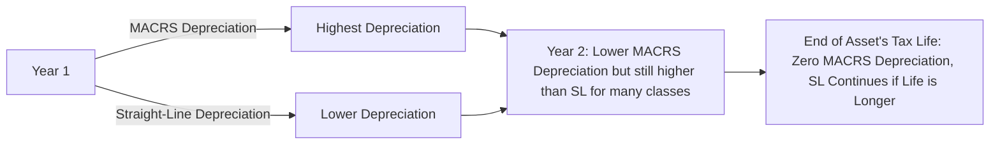

## 7.2 Tax-Basis Financial Statements (Common Adjustments vs. GAAP)

Within a special purpose framework, entities may prepare their financial statements on a tax basis rather than in strict conformity with U.S. Generally Accepted Accounting Principles (GAAP). Tax-basis financial statements utilize rules defined by the Internal Revenue Code (IRC) and related income tax regulations, allowing financial statements to better align with how an entity prepares its income tax returns. For many small and mid-sized enterprises, tax-basis financial statements can simplify the reporting process. However, understanding how tax rules differ from GAAP is crucial to properly reconciling the two frameworks.

In this section, we delve into the concepts and mechanics behind tax-basis financial statements, emphasizing key adjustments CPAs commonly encounter. We will also review the best practices for reconciling from GAAP to tax-basis financials, illustrative examples and case studies, and highlight potential pitfalls.

---

### Overview of Tax-Basis Financial Statements

Tax-basis financial statements apply revenue recognition and expense deduction principles consistent with the rules set forth by the IRC. In many cases, these rules differ from GAAP standards established by the Financial Accounting Standards Board (FASB). Because of these differences, net income or loss per GAAP does not necessarily reflect taxable income or loss. Preparing statements on a tax basis can reduce complexity if the organization’s primary objective is compliance with income tax reporting.

#### Key Benefits of Tax-Basis Reporting

• Simplification of recordkeeping: Entities can maintain a single set of books that aligns directly with tax regulations.  
• Reduced risk of errors during the tax return preparation process: There are fewer end-of-year adjustments required to convert GAAP net income to taxable income.  
• Streamlined compliance: For smaller or less regulated entities, tax-basis statements may be sufficient for external lenders, investors, or regulators.  

#### When Entities Choose Tax Basis

• Closely-held corporations and partnerships that place a high priority on tax compliance.  
• Businesses with minimal external financial statement users who demand GAAP or IFRS compliance.  
• Entities aiming to minimize time and cost associated with maintaining dual sets of books and reconciling to GAAP each period.  

---

### Common Differences Between GAAP and Tax Basis

Tax-basis financial statements typically incorporate timing and permanent differences compared to GAAP. Familiarity with these categories is vital:

• Timing (temporary) differences: These items affect net income under GAAP and taxable income differently in a particular period but eventually offset over time. Common examples include depreciation, bad debt allowances, and deferred revenue.  
• Permanent differences: These items never reverse. For instance, certain fines and penalties are non-deductible for tax purposes, or certain municipal bond interest is tax-exempt, resulting in book-tax disparities that never reconcile.

#### 1. Depreciation Methods

Under GAAP, depreciation is typically recorded using straight-line or an accelerated method (e.g., double-declining balance) over the estimated useful life of the asset, consistent with accounting principles. On the tax side, the Modified Accelerated Cost Recovery System (MACRS) often governs depreciation, offering defined recovery periods and accelerated methods that do not always match GAAP assumptions about asset consumption.

Common differences:  
• Classification of assets into MACRS property classes (e.g., 5-year, 7-year, 15-year structures).  
• Application of half-year or mid-quarter conventions under MACRS.  
• Section 179 immediate expensing that can shift what would be a long-term asset depreciation under GAAP into a current-period expense for tax purposes.

#### 2. Revenues: Accrual vs. Cash Treatment

Even if an entity keeps full accrual records for GAAP, it may elect or be required to recognize revenue on a different basis for tax, especially if it qualifies for certain small-business exceptions. Examples include:  
• Cash-basis tax reporting for qualified service businesses.  
• Different criteria for unearned revenue—some items recognized later under GAAP may be recognized immediately for tax or vice versa.  
• Special rules for advanced payments or prepayments that allow deferral for tax but require earlier recognition under GAAP (e.g., software license fees, gift card liabilities).

#### 3. Allowances for Doubtful Accounts

GAAP normally requires an allowance approach for estimated uncollectible receivables (bad debts) using the expected credit loss model or a historical-based allowance. For tax purposes, the direct write-off method is typical—businesses deduct bad debts only when they become partially or completely worthless under IRC rules. This discrepancy regularly leads to timing differences in income recognition and deduction.

#### 4. Inventories

Under GAAP, sophisticated inventory costing (FIFO, LIFO, average cost, or specific identification) and lower of cost or net realizable value (LCNRV) rules apply. Tax rules can differ, particularly when an entity elects or is required to use specific methods for tax, such as the uniform capitalization (UNICAP) rules under IRC §263A for producers or resellers with average annual gross receipts exceeding certain thresholds.

#### 5. Intangible Assets and Amortization

For GAAP, finite-lived intangible assets are amortized over their useful life, and indefinite-lived intangibles, like goodwill, undergo annual impairment testing. Under tax basis, intangible assets often follow Section 197 rules, requiring them to be amortized over a statutory 15-year period, regardless of actual useful life. The mismatch between GAAP-based amortization and statutory tax amortization creates timing differences on intangible asset recognition.

#### 6. Accrued Liabilities (e.g., Vacation Pay, Bonuses)

GAAP frequently requires that future cash outflows for most liabilities become recognized when they are probable and estimable. However, for tax purposes, certain accrued liabilities—particularly those extended to beyond 2½ months after year-end—may not be deductible until they are actually paid. This is another source of timing difference between GAAP and tax basis.

#### 7. Other Permanent Differences

• Non-deductible expenses (e.g., certain fines, penalties, or political contributions).  
• Tax-exempt interest (e.g., municipal bonds).  
• Meals and entertainment limitations (e.g., 50% deductibility for certain business meals).  

---

### Reconciling GAAP Income to Taxable Income

When an entity maintains its records according to GAAP but decides to prepare financial statements on a tax basis, a reconciliation process is required. One of the core objectives is adjusting GAAP net income (or net loss) to reflect the tax treatment of income and expenses. In official tax returns (e.g., corporate returns Form 1120), this reconciliation appears on Schedule M-1 or M-3, summarizing the differences that cause GAAP income to deviate from the tax-basis income.

#### Step-by-Step Reconciliation Approach

1. **Start with GAAP Net Income**  
   Take the net income (or loss) figure from the GAAP income statement.

2. **Identify Permanent Differences**  
   Add or subtract revenues and expenses that will never be recognized or deducted for tax. Examples include non-deductible fines or penalties and interest on municipal bonds.

3. **Account for Timing Differences**  
   Make adjustments for items that have different recognition periods under GAAP and tax. For instance, convert GAAP depreciation to MACRS depreciation by calculating the difference in depreciation expense. Similarly, convert GAAP allowance for doubtful accounts to actual write-offs recognized for tax.

4. **Add/Eliminate Deferred Tax Amounts**  
   Since tax-basis statements do not record deferred tax assets or liabilities, remove any deferred tax effects recognized under GAAP.

5. **Combine All Adjustments**  
   Aggregate permanent and timing differences to derive taxable income.

6. **Conclude with Tax-Basis Net Income**  
   The final result is the entity’s net income (or loss) according to tax rules. This figure aligns with the taxable income determined for federal returns.

---

### Practical Example: GAAP to Tax-Basis Reconciliation

Scenario:  
• A corporation uses GAAP-based financial statements showing $500,000 of net income.  
• Depreciation recorded under GAAP is $80,000. Under MACRS, depreciation for the same assets is $150,000 in the current year.  
• The entity recognized $20,000 in bad debt expense under the allowance method; actual write-offs for the year were $12,000.  
• The corporation paid a $5,000 penalty that is non-deductible for tax.  
• Municipal bond interest of $3,000 was included in GAAP net income but is tax-exempt.  

Reconciliation:

Mermaid diagram illustrating the flow:

```mermaid
flowchart LR
    A[GAAP Net Income = $500,000] --> B[Subtract MACRS vs.\ GAAP Depreciation Difference = ($150k - $80k) = $70k]
    B --> C[Add Back Allowance vs.\ Write-Off Difference = ($20k - $12k) = $8k]
    C --> D[Add Non-Deductible Penalty = $5k]
    D --> E[Subtract Tax-Exempt Income = ($3k)]
    E --> F[Tax-Basis Net Income]
```

Starting Point: $500,000 (GAAP net income)

1. **Depreciation difference**: GAAP expense was $80,000; tax expense is $150,000. Tax-basis statements reflect an additional $70,000 expense. → Subtract $70,000 from GAAP net income.  
2. **Bad debts**: GAAP recognized a $20,000 expense; actual write-offs for tax were $12,000. This yields an $8,000 higher expense under GAAP that is not currently deductible. For tax basis, reduce the expense by $8,000 → Add back $8,000.  
3. **Penalty**: $5,000 is non-deductible. GAAP includes it as an expense, but for tax, we remove its deductibility → Add back $5,000.  
4. **Tax-exempt income**: GAAP includes $3,000 interest from municipal bonds. For tax, this is excluded → Subtract $3,000 from income.  

Summation:

• GAAP net income = $500,000  
• Depreciation difference = –$70,000  
• Bad debts difference = +$8,000  
• Non-deductible penalty = +$5,000  
• Tax-exempt income = –$3,000  

Calculation:  
$500,000 – $70,000 + $8,000 + $5,000 – $3,000 = $440,000 (Tax-Basis Net Income)

---

### Presentation of Tax-Basis Financial Statements

When compiling or presenting tax-basis financial statements, the accountant should disclose the basis of accounting used in the notes. This includes details such as reference to the IRC or state tax regulations. Any additional schedules needed for further clarification—particularly regarding depreciation methods, intangible amortization, or expense items subject to partial deductibility—should accompany the financial statements.

Just as with GAAP financial statements, tax-basis statements typically include:  
• Balance Sheet (or Statement of Assets, Liabilities, and Capital)  
• Income Statement (or Statement of Revenues and Expenses)  
• Statement of Owners’ Equity (if relevant)  
• Cash Flow Statement (may or may not be included, depending on the purpose and the nature of the tax-basis financials)  
• Accompanying disclosures referencing the specific framework (tax basis)  

---

### Diagrams and Visual Representations

To aid in understanding how adjustments flow, you might create and reference diagrams. The Mermaid diagram above shows a high-level overview of reconciling GAAP net income to tax-basis net income. You can also develop charts illustrating how MACRS depreciation compares with straight-line throughout an asset’s life:



In this illustration, MACRS often accelerates depreciation deductions in early years, whereas the straight-line method under GAAP spreads it more evenly.

---

### Potential Pitfalls and Best Practices

• **Frequent Regulation Changes**: IRC rules evolve frequently. Regularly check for modifications that can shift the timing or method of recognizing expenses, such as bonus depreciation percentages or Section 179 thresholds.  
• **Consistency**: Once a method is selected for tax-basis reporting (cash vs. accrual, inventory valuation choices, etc.), changes require approvals or justification within the tax return filing process.  
• **Documentation**: Adequately document the rationale for each difference and maintain schedules to support changes in depreciation, intangible assets, or other items.  
• **Stakeholder Understanding**: Clearly communicate to lenders or investors that tax-basis statements lack certain GAAP-based insights (e.g., fair value measurements, comprehensive disclosures).  
• **Deferred Taxes**: Because tax-basis statements do not incorporate deferred tax assets and liabilities (no concept of an “income tax provision”), stakeholders must be made aware that reduced complexity may compromise comparability to GAAP.  

---

### Case Study: Acquisition of an Intangible Asset

ABC Tech purchases a software license for $300,000 with an estimated useful life of 10 years under GAAP. For tax purposes, the intangible is considered a Section 197 intangible, which has a 15-year amortization requirement. Let’s see how these differences play out:

• **Year 1 GAAP Amortization**: $300,000 ÷ 10 years = $30,000 expense.  
• **Year 1 Tax Amortization**: $300,000 ÷ 15 years = $20,000 expense.  

• **GAAP Net Income**: If no other factors, the intangible reduces net income by $30,000.  
• **Tax Net Income**: Reduces taxable income by $20,000 for Year 1.  

The $10,000 difference is a timing difference that reverses eventually between Year 1 and Year 15. By Year 10, the software license is fully amortized on GAAP books, but tax returns still claim an additional five years of amortization.

---

### Best Practices for Preparing Tax-Basis Financial Statements

• Organize accounting records according to IRC guidelines from the start to avoid complex year-end adjustments.  
• Leverage sub-ledgers or dedicated accounts that track tax depreciation, intangible amortization, and permanent vs. temporary differences.  
• Develop a robust chart of accounts that facilitates easy transition or reconciliation to GAAP if required in the future.  
• Communicate with tax advisors or CPAs regularly to stay informed on changes in tax legislation affecting depreciation, deductions, and other significant areas.  
• Provide clear footnotes that highlight policies and assumptions used under tax basis and how they diverge from traditional GAAP.  

---

### References and Further Exploration

• Internal Revenue Code (IRC), particularly sections covering depreciation (Section 168), intangible amortization (Section 197), and deductions (various sections).  
• IRS Publications 535 (Business Expenses) and 946 (How to Depreciate Property) provide insights into permissible tax methods.  
• AICPA’s “Guide to Non-GAAP Financial Statements: Tax-Basis” for thorough analyses and illustrative tax-basis financial statements.  
• FASB ASC 740, “Income Taxes,” for background on deferred taxes and the differences recognized for GAAP.  
• IRS website (https://www.irs.gov/businesses) for the latest updates to tax rules and sections affecting businesses.

---

## Test Your Knowledge: Tax-Basis vs. GAAP Financial Statements Quiz



### Which of the following describes a common reason why a business would choose tax-basis financial statements?

- [ ] They are always required by all regulatory authorities.  
- [ ] They are more complex and time-consuming than GAAP statements.  
- [x] They simplify the recordkeeping process by aligning with tax reporting.  
- [ ] They provide more disclosures than GAAP.  

> **Explanation:** Tax-basis statements often eliminate the need for separate financial and tax adjustments, making the recordkeeping process simpler for many enterprises.

### When preparing tax-basis statements, which of the following items is most likely treated differently than under GAAP?

- [x] Depreciation expense on fixed assets.  
- [ ] Sales revenue earned during the year.  
- [ ] Utility expenses recorded each month.  
- [ ] Selling, general, and administrative costs.  

> **Explanation:** Tax regulations apply MACRS or specific statutory methods that differ from typical GAAP techniques for depreciation.

### In a GAAP-to-tax reconciliation, how would non-deductible fines be handled?

- [ ] They would be included as a part of normal tax deductible expenses.  
- [x] They would be added back to GAAP income on the tax return.  
- [ ] They would be subtracted from GAAP income on the tax return.  
- [ ] They would not appear on the statement.  

> **Explanation:** Because fines are not deductible for tax, they must be added back to increase taxable income.

### Which best describes a permanent difference?

- [ ] A difference that reverses over time.  
- [x] A difference that never reverses.  
- [ ] A difference arising solely from the timing of revenue recognition.  
- [ ] A difference only affecting intangible assets.  

> **Explanation:** Permanent differences never reverse; they cause a lasting divergence between GAAP net income and taxable income.

### Under tax-basis accounting, allowances for bad debts are typically replaced by:

- [x] The direct write-off method.  
- [ ] A consistent accrual method.  
- [x] MACRS-based deductions.  
- [ ] Reporting it as a contingent liability.  

> **Explanation:** The tax rules allow a deduction only when the debt is partially or wholly worthless, often referred to as the direct write-off method. (Note that MACRS is specifically for depreciation of tangible property; the mention “MACRS-based deductions” here is also correct in a broader sense for tangible assets, but the direct write-off method is the most specific correct answer for bad debts.)

### Which of the following is an example of a timing (temporary) difference between GAAP and tax basis?

- [x] MACRS depreciation vs. straight-line depreciation.  
- [ ] Municipal bond interest.  
- [ ] Charitable contributions exceeding the deduction limit.  
- [ ] Penalties and fines.  

> **Explanation:** MACRS departs from straight-line depreciation on an annual basis, but eventually, the total depreciation is the same over the asset’s life, making it a timing difference.

### Which financial statements might not be a required component of a tax-basis presentation?

- [x] The statement of cash flows.  
- [ ] The statement of assets, liabilities, and capital.  
- [x] The income statement.  
- [ ] Detailed footnotes on the tax rules used.  

> **Explanation:** While entities often prepare a balance sheet (or similar statement) and an income statement for tax-basis reporting, a statement of cash flows may not be mandatory under certain special purpose frameworks.

### Under the IRC Section 197, how long must certain intangibles be amortized for tax purposes?

- [ ] 5 years  
- [ ] 10 years  
- [x] 15 years  
- [ ] 25 years  

> **Explanation:** Section 197 specifies a 15-year recovery period for many purchased intangible assets.

### Which item is typically excluded from taxable income but included in GAAP income?

- [ ] Gains on the sale of fixed assets.  
- [ ] Interest on business-related loans.  
- [x] Interest from municipal bonds.  
- [ ] Dividend income.  

> **Explanation:** Municipal bond interest is tax-exempt, making it a permanent difference that is included in GAAP but excluded from tax-based income.

### For a corporation preparing tax-basis financial statements, the concept of deferred tax liabilities:

- [x] Does not arise, since there is no separate recognition of deferred taxes under tax basis.  
- [ ] Is recognized on the balance sheet for future taxable temporary differences.  
- [ ] Is recognized as an increase to capital.  
- [ ] Is required by IRC regulations to be disclosed in footnotes.  

> **Explanation:** Tax-basis statements do not recognize deferred tax liabilities or assets. They record only current tax obligations; the concept of deferred taxes is a GAAP requirement.



---

## For Additional Practice and Deeper Preparation

**[FAR CPA Hardest Mock Exams: In-Depth & Clear Explanations](https://www.udemy.com/course/far-cpa-mock-exams/?referralCode=F88050F8D5C76764F6BD)**  

**Financial Accounting and Reporting (FAR) CPA Mocks:** 6 Full (1,500 Qs), Harder Than Real! In-Depth & Clear. Crush With Confidence!  

- Tackle full-length mock exams designed to mirror real FAR questions.  
- Refine your exam-day strategies with detailed, step-by-step solutions for every scenario.  
- Explore in-depth rationales that reinforce higher-level concepts, giving you an edge on test day.  
- Boost confidence and minimize anxiety by mastering every corner of the FAR blueprint.  
- Perfect for those seeking exceptionally hard mocks and real-world readiness.  

_Disclaimer: This course is not endorsed by or affiliated with the AICPA, NASBA, or any official CPA Examination authority. All content is for educational and preparatory purposes only._
