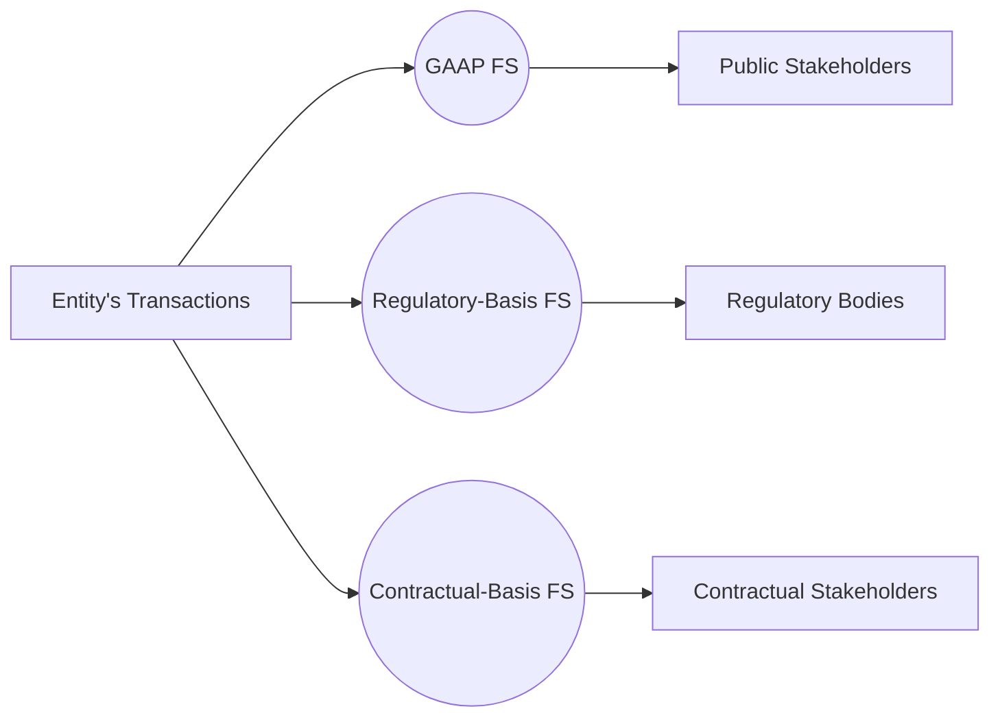

## 7.3 Other Regulatory or Contractual-Basis Financial Statements

In certain industries and contractual setups, entities may prepare financial statements using a basis of accounting other than Generally Accepted Accounting Principles (GAAP). These specialized frameworks are not necessarily designed to comply with GAAP or International Financial Reporting Standards (IFRS), but rather adhere to specific regulations or contractual requirements. Such frameworks can be mandated by insurance regulators, banking legislation, or even defined in lending agreements for businesses that do not maintain GAAP statements. Understanding these “other regulatory or contractual-basis” frameworks is essential for Certified Public Accountants (CPAs) who may encounter entities bound by these specialized reporting rules.

This topic expands on key themes introduced in Chapter 7 (Special Purpose Frameworks) by focusing specifically on how and why entities might use a regulatory basis (e.g., statutory basis for insurance) or a contractual basis (e.g., accounting rules specified by a lender). We will cover the unique principles that govern these statements, common pitfalls, best practices, and how practitioners can navigate the complexities of preparing, auditing, or using these specialized financial statements.

---

### The Rationale Behind Alternative Bases of Accounting

Most business entities prepare financial statements according to U.S. GAAP or IFRS to meet shareholder, creditor, and regulatory requirements. However, there are situations where a different basis of accounting may be required to serve a unique stakeholder need that is not fully addressed by traditional GAAP standards. For example:

• Insurance regulators often require detailed, conservative statutory financial statements that meet solvency and reserve requirements laid out by the National Association of Insurance Commissioners (NAIC).  
• Banks may need specialized statements to meet certain capital adequacy or reserve rules imposed by federal or state banking authorities.  
• Entities with sophisticated borrowing arrangements may have contractual clauses necessitating a specific format or accounting treatment for the lender.  

In each case, the overriding goal is to address the information needs of a particular stakeholder group—be it regulators, creditors, or other parties—rather than providing a complete GAAP-based financial picture for the general public.

---

### Regulatory-Basis Financial Statements

Regulatory-basis financial statements are prepared under accounting rules set forth by a regulatory agency rather than GAAP. While there are many different regulatory frameworks, the most common examples include:

• **Statutory Accounting for Insurance Companies**: Insurance entities in the United States report to state insurance commissioners using Statutory Accounting Principles (SAP). These rules emphasize solvency and the protection of policyholders, often resulting in more conservative financial metrics than GAAP.  
• **Banking Industry Filings**: Certain depository institutions may prepare “Call Reports” under rules established by the Federal Financial Institutions Examination Council (FFIEC). These include specific loan classification rules and capitalization requirements that can diverge from GAAP.  
• **Other Industry-Specific Filings**: Regulated utilities, broker-dealers, mortgage companies, and other industries might be subject to specialized reporting standards imposed by agencies such as the Federal Energy Regulatory Commission (FERC) or the Securities and Exchange Commission (SEC) in certain contexts.  

Under these frameworks, the regulators’ main interest is often ensuring that the enterprise remains financially sound and can meet its obligations. As a result, regulatory statements might require immediate recognition of losses, mandate specific valuation methods, or restrict how certain assets and liabilities are presented.

#### Characteristics of Regulatory-Basis Statements

1. **Conservative Recognition and Valuation**: Regulators often prioritize solvency and protect consumers (policyholders, depositors). As a result, losses may be recognized sooner, and assets might be valued at lower amounts compared to GAAP standards.  
2. **Industry-Specific Disclosures**: Detailed breakdowns of reserves, reinsurance, or specific capital requirements for insurance companies, or specialized disclosures surrounding nonperforming loans for banks.  
3. **Custom Formatting and Schedules**: Certain regulators mandate standardized forms or schedules to facilitate uniform data collection across the industry.  

---

### Contractual-Basis Financial Statements

Contractual-basis financial statements result from agreements between private parties, typically a lender and a borrower, or between a company and an investor or grant provider. These contracts stipulate the rules for recognizing and measuring assets, liabilities, revenues, and expenses, often to ensure compliance with loan covenants or other obligations.

A contractual basis might require a company to:

• Follow specific depreciation schedules that differ from GAAP.  
• Use a defined method for revenue recognition (e.g., percentage-of-completion or completed-contract) that may not align with GAAP guidance.  
• Restrict intangible asset capitalization, or require immediate expensing of certain development costs.  
• Maintain specific ratios (e.g., debt-to-equity, interest coverage) under the contract’s definitions rather than GAAP-based formulas.

Contractual-basis statements are generally prepared for a narrow audience (e.g., a single major creditor or group of creditors), so they do not necessarily provide the full suite of information typically found in general-purpose GAAP statements. Instead, they are designed to validate whether the entity meets the agreed-upon terms and conditions.

#### Common Contractual Requirements

1. **Predefined Definitions**: The contract might have explicit definitions for terms like “EBITDA,” “operating profit,” or “capital expenditures,” which could differ substantially from GAAP definitions.  
2. **Reporting Frequency**: Certain lenders may require monthly or quarterly statements to monitor covenant compliance.  
3. **Adjusted or Modified Net Income**: Covenants might exclude certain non-cash items (e.g., goodwill impairments) from net income, thereby creating a custom measure of profitability.  

---

### Differences Between GAAP Accounting and Other Bases

When an entity departs from GAAP to adopt a regulatory or contractual basis, there are unique considerations to keep in mind. Below is a simplified table summarizing potential differences.

| Aspect                    | GAAP                                         | Regulatory/Contractual Basis               |
|---------------------------|----------------------------------------------|--------------------------------------------|
| **Primary Audience**      | Investors, creditors, general stakeholders   | Regulators, creditors, or specific parties |
| **Focus**                 | Fair presentation, accrual-based, economic reality | Solvency, compliance, contract-specific metrics |
| **Recognition**           | Principles-based with broad interpretations  | Often rules-based, specific recognition triggers |
| **Valuation**             | Typically fair value or historical cost      | May be more conservative (lower of cost or real-time valuations) |
| **Reporting Format**      | Flexible, with GAAP guidance                 | Often standardized forms or custom schedules |
| **Disclosure**            | Comprehensive footnotes covering all aspects of the entity | Narrow focus on regulated or contractual elements |

The objective of GAAP is to provide a fair view of an entity’s financial performance and position for a wide audience. Regulatory-basis and contractual-basis statements, on the other hand, aim to satisfy specialized requirements. The level of detail, focus areas, and measurement approaches can vary significantly, and, as a CPA, it is critical to recognize these differences and communicate them appropriately to stakeholders.

---

### Auditor’s Role and Reporting Considerations

From an auditing standpoint, Other Regulatory or Contractual-Basis Financial Statements often require a unique auditor’s report that clearly states:

1. **Framework Disclosure**: A statement identifying the basis of accounting used.  
2. **Purpose Restriction**: A mention that the statements are not intended for general use but solely for the use of those with regulatory or contractual rights to the information.  
3. **Opinion Language**: The auditor provides an opinion based on the specified framework, which may not be comparable to GAAP-based opinions.  

For example, an auditor’s report on a statutory-basis financial statement could include language such as: “We have audited the accompanying statutory-basis financial statements… which have been prepared in conformity with accounting practices prescribed or permitted by the XYZ State Department of Insurance…” Then, the auditor would mention that these statements differ from GAAP and are intended for use by the insurance regulator.

---

### Illustrative Case: Insurance Statutory Accounting vs. GAAP

To understand the differences between regulatory-basis and GAAP financial statements, consider an insurance company’s statutory financial statements versus its GAAP statements:

• **Policy Acquisition Costs**: Under GAAP, costs are often deferred and amortized over the policy term, while SAP might require immediate expensing.  
• **Reserves**: SAP typically mandates more conservative reserving, potentially resulting in higher reserves for potential claims.  
• **Surplus Notes**: Under SAP, surplus notes may be included as surplus (equity), whereas GAAP might present them as liabilities.  

These differences can materially alter the appearance of an insurer’s financial health. Regulators favor approaches that show a more conservative depiction of equity to ensure policyholders’ claims can be met even under adverse conditions.

---

### Illustrative Case: Contractual-Basis Statements for a Manufacturing Firm

Imagine a manufacturing firm that secures a large loan from a consortium of banks. The loan agreement specifies:

• Inventory valuation required to follow the lower of cost or net realizable value, even for items normally valued at a standardized cost basis under GAAP.  
• Depreciation on the manufacturing equipment must be computed using a straight-line method over 10 years, despite GAAP’s allowance for different methods or estimates of useful life.  
• Certain intangible assets (like product patents) must be fully expensed in the period incurred rather than capitalized and amortized.  

The firm’s creditors care primarily about the firm’s ability to generate consistent cash flows, make debt service payments, and maintain certain coverage ratios. Because the bank demands very specific definitions of profit and asset values, the manufacturing firm prepares a set of statements in accordance with these contractual rules, separate from the GAAP statements it might release to investors.

---

### Diagram: Regulatory vs. Contractual Accounting Paths

Below is a Mermaid diagram illustrating how an entity’s accounting may branch into different bases depending on stakeholder requirements.

**Diagram Explanation**:  
• An entity engages in various business transactions.  
• Those transactions may be recorded simultaneously or separately under GAAP, regulatory-basis rules, or contractual-basis rules.  
• GAAP-based financial statements serve stakeholders like equity investors or broad-based creditors.  
• Regulatory-basis statements satisfy industry-specific regulators (e.g., state insurance departments).  
• Contractual-basis statements address certain lenders, investors, or other parties under contract.  

---

### Preparing and Presenting Other Regulatory or Contractual-Basis Financial Statements

Despite the differences, the process of preparing specialized statements generally includes the following steps:

1. **Identify Applicable Rules**  
   Carefully determine the exact regulatory or contractual requirements. For insurance companies, refer to NAIC guidelines; for banks, refer to FFIEC instructions; for contractual arrangements, analyze the loan or partnership agreement in detail.

2. **Maintain Clear Documentation**  
   Since regulatory or contractual frameworks can deviate significantly from GAAP, documentation is crucial for explaining why certain items are recognized or measured differently.

3. **Segregate Transactions**  
   If an entity also produces GAAP statements, it often needs separate ledgers or schedules for items required by the regulator or contract to avoid confusion in the financial records.

4. **Disclose the Purpose**  
   Because these statements are typically not for general use, standard disclosures should clarify the nature of the framework used and who the intended users are.

5. **Reconcile to GAAP, if Needed**  
   Some regulators or contractual parties may require a reconciliation to GAAP to facilitate analysis and comparability. This can involve bridging schedules or summary footnotes.

---

### Potential Challenges and Pitfalls

1. **Complexity and Dual Reporting**  
   Many entities must maintain dual reporting systems: one for GAAP, another for the specialized basis. Coordinating these systems requires robust internal controls and clear governance structures.

2. **Lack of Familiarity Among Stakeholders**  
   Investors or board members unfamiliar with specialized bases may misinterpret the entity’s financial health. CPAs and management should proactively explain the purpose and limitations of these statements.

3. **Greater Risk of Noncompliance**  
   Failing to meet regulatory requirements can lead to penalties, sanctions, or a loss of license. Likewise, contractual noncompliance can trigger loan default provisions or other severe consequences.

4. **Rapidly Changing Regulations**  
   Regulatory frameworks evolve in response to market conditions and legislative changes, demanding constant vigilance and updates to an entity’s reporting practices.

5. **Auditor’s Report Modifications**  
   Traditional “unmodified” GAAP audit reports might not apply. The auditor may need to issue a special purpose report, adding disclaimers or highlighting inherent limitations.

---

### Best Practices for Practitioners

• **Stay Current**: Continuously monitor changes in regulatory guidance or the contractual agreement to ensure compliance.  
• **Engage in Early Planning**: Involve auditors, legal counsel, and internal stakeholders early in the reporting cycle to prevent surprises.  
• **Train Staff**: Accounting staff should be well-versed in the relevant regulatory or contractual requirements, beyond standard GAAP training.  
• **Communicate with Stakeholders**: Provide clear, user-friendly explanations of differences between GAAP and specialized frameworks.  
• **Leverage Technology**: Use accounting software capable of generating separate sets of books or providing on-demand reconciliations.

---

### Real-World Example: Statutory Filings for Insurance Regulators

A mid-sized life insurance company, ABC LifeCo, prepares two sets of financial statements:

• **GAAP**: used for external investors, rating agencies, and general stakeholders, focusing on the true economic performance of underwriting and investment activities.  
• **Statutory**: follows the NAIC’s Accounting Practices and Procedures Manual, ensuring compliance with the state insurance department’s solvency regulations. Key differences might include:  
  - Immediate expensing of acquisition costs.  
  - Unique treatments for reinsurance recoverables and policy reserves.  
  - Lower capitalization thresholds for certain investments.  

Because statutory accounting is designed to protect policyholders, the net equity (referred to as “surplus” in statutory statements) might be significantly lower than in GAAP-based financial statements. ABC LifeCo undergoes an annual statutory audit, in addition to a GAAP audit, and files its statutory statements with state regulators to maintain its license to write insurance policies.

---

### Real-World Example: Construction Loan Contractual Requirements

A construction company, BuildMax LLC, obtains a large-scale loan from a consortium of private equity lenders for a commercial development project. The terms specify:

• **Revenue Recognition**: Must use the completed-contract method for partial compliance with the lenders’ risk management view, even though GAAP might favor percentage-of-completion for a more accurate reflection of progress.  
• **Expense Policies**: Research and development (R&D) costs related to new project techniques cannot be capitalized; they must be fully expensed when incurred.  
• **Ratios and Covenants**: Net income must be adjusted to exclude certain intangible impairments. The company must maintain a minimum adjusted debt-to-equity ratio of 1.5:1, computed according to the definitions in the loan document.  

In this scenario, the contractual-basis statements help the lenders continuously evaluate how the project aligns with their risk tolerance. They check BuildMax LLC’s compliance with the financial covenants to ensure the project remains on track, thereby reducing the risk of default.

---

### Comparison with Other Special Purpose Frameworks

Apart from regulatory and contractual-basis financial statements, you may encounter other special purpose frameworks such as:

• **Cash-Basis or Modified Cash-Basis**: Chapter 7.1 covers these approaches used primarily by smaller organizations or nonprofits without complex accrual activities.  
• **Tax-Basis**: Chapter 7.2 details how tax-basis reporting centers on the rules utilized for income tax returns, which can differ significantly from GAAP.  

While these other frameworks also provide valuable insights under specific circumstances, regulatory and contractual-basis statements present a unique dimension of compliance and specialized stakeholder demands.

---

### Looking Ahead

As industries grow more complex and regulatory oversight becomes more rigorous, the importance of understanding specialized frameworks cannot be overstated. Whether advising an insurance client on statutory filing or helping a manufacturer handle bank covenant compliance, CPAs play a pivotal role in ensuring that these alternative-basis statements are both accurate and transparent. By keeping pace with changing regulations, nurturing clear communication channels, and upholding robust auditing and reporting standards, financial professionals can effectively serve the specialized needs of regulatory bodies, lenders, and other relevant parties.

---

## SEO-Optimized Quiz on Other Regulatory or Contractual-Basis Financial Statements



### Which of the following statements best captures the primary objective of regulatory-basis financial statements for insurance companies?

- [ ] To maximize net income for investors.
- [x] To emphasize solvency and protect policyholders.
- [ ] To comply strictly with IFRS guidelines.
- [ ] To ensure revenue recognition matches GAAP precisely.

> **Explanation:** Insurance regulators focus on solvency to safeguard policyholders. Thus, statutory or regulatory accounting for insurance often prioritizes conservative financial practices rather than maximizing reported earnings or adhering to IFRS.

### A contractual-basis financial statement might be required primarily in which of the following scenarios?

- [ ] A nonprofit records all transactions under GAAP for the sake of uniformity.
- [ ] A publicly traded company files 10-K reports with the SEC.
- [x] A borrower’s loan agreement stipulates non-GAAP accounting rules for covenants.
- [ ] An international business prepares IFRS statements for global investors.

> **Explanation:** Contractual-basis financial statements arise from agreements where a creditor or other party insists on custom accounting treatments, such as specific revenue recognition or asset valuation methods, as defined in the loan covenant.

### One major distinction between GAAP and a regulatory basis is:

- [x] Regulatory accounting may require immediate recognition of certain deferred expenses.
- [ ] GAAP always reports lower reserves than regulatory accounting.
- [ ] GAAP prohibits intangible asset recognition, while regulatory basis allows it freely.
- [ ] There are no differences because both must meet the needs of the general public.

> **Explanation:** Regulators often require immediate or more conservative treatment of certain expenses to ensure solvency. By contrast, GAAP might allow amortization or deferral over time.

### When an auditor issues an opinion on a regulatory-basis financial statement, which of the following must be included?

- [ ] A statement attesting that the framework is fully compliant with GAAP.
- [ ] An assertion that the financials can be freely used for general purposes.
- [ ] A note that no special disclaimers are required.
- [x] A clear reference to the framework and a restriction of use to those familiar with that framework.

> **Explanation:** For regulatory-basis financial statements, auditors must clarify the distinct framework and highlight any restrictions, noting that the statements are not intended for general use but for the specific regulatory audience.

### Which of the following is a characteristic of insurance statutory accounting (SAP) compared to GAAP?

- [x] SAP typically requires the immediate expensing of acquisition costs.
- [x] SAP reserves may be set at more conservative levels for policyholder protection.
- [ ] SAP statements do not need to follow any standardized methodology.
- [ ] SAP is identical to IFRS in every aspect.

> **Explanation:** Statutory accounting often employs more conservative practices, such as immediate expensing of certain costs, to ensure policyholder protection. Additionally, reserves are typically higher under SAP than under GAAP.

### Contractual-basis financial statements often feature:

- [x] Specialized definitions and adjustments of net income to meet covenant terms.
- [ ] A universal format that all lenders follow.
- [ ] Fewer disclosures than GAAP statements, with no focus on uniqueness.
- [ ] Never requiring an auditor’s report or examination.

> **Explanation:** Contractual-basis statements typically incorporate unique definitions and adjustments for covenant compliance. The reporting entity must clearly disclose the specialized rules, and these statements often do require an auditor’s report, with proper disclaimers.

### Which of the following represents a potential challenge when preparing regulatory-basis statements?

- [x] Integration with GAAP-based systems can be complex and time-consuming.
- [ ] They require no specific disclosures.
- [x] Rapidly changing regulations lead to frequent updates.
- [ ] They are automatically considered valid for general-purpose use.

> **Explanation:** Preparing regulatory-basis statements often necessitates maintaining dual reporting systems and staying current with evolving regulations. Such statements are generally restricted to regulatory audiences, not general-purpose distribution.

### In a contractual-basis framework for a manufacturer, a long-lived asset might:

- [x] Be depreciated on a strictly defined schedule that differs from GAAP estimates.
- [ ] Not require any depreciation expense ever.
- [ ] Be reported only as an expense immediately without any recognition as an asset.
- [ ] Always be measured at fair value quarterly.

> **Explanation:** Contractual-basis frameworks may specify fixed schedules for depreciation, irrespective of GAAP assumptions about useful life or salvage value, in order to meet unique covenant requirements.

### What is a key reason lenders might demand contractual-basis financial statements?

- [ ] They wish to compare multiple entities using IFRS.
- [x] They need a specific definition of performance for monitoring covenants.
- [ ] They want to comply with statutory guidelines from the NAIC.
- [ ] They are mandated by the SEC to produce these statements.

> **Explanation:** Lenders may impose custom definitions of financial metrics to ensure they can properly assess covenant compliance. These definitions can depart significantly from those used in standard GAAP or IFRS.

### A lender requires an entity to exclude non-cash impairments from their earnings metric. This approach is most consistent with:

- [x] A contractual-basis modification to net income.
- [ ] A GAAP requirement for intangible assets.
- [ ] A statutory requirement by insurance regulators.
- [ ] The IFRS approach to intangible assets.

> **Explanation:** Lenders often ask for modifications to standard net income calculations—such as excluding non-cash impairments—so they can monitor a performance measure that better aligns with the cash flow available for debt service.



---

## For Additional Practice and Deeper Preparation

[**FAR CPA Hardest Mock Exams: In-Depth & Clear Explanations**](https://www.udemy.com/course/far-cpa-mock-exams/?referralCode=F88050F8D5C76764F6BD)

Financial Accounting and Reporting (FAR) CPA Mocks: 6 Full (1,500 Qs), Harder Than Real! In-Depth & Clear. Crush With Confidence!

- Tackle full-length mock exams designed to mirror real FAR questions.  
- Refine your exam-day strategies with detailed, step-by-step solutions for every scenario.  
- Explore in-depth rationales that reinforce higher-level concepts, giving you an edge on test day.  
- Boost confidence and minimize anxiety by mastering every corner of the FAR blueprint.  
- Perfect for those seeking exceptionally hard mocks and real-world readiness.  

_Disclaimer: This course is not endorsed by or affiliated with the AICPA, NASBA, or any official CPA Examination authority. All content is for educational and preparatory purposes only._
