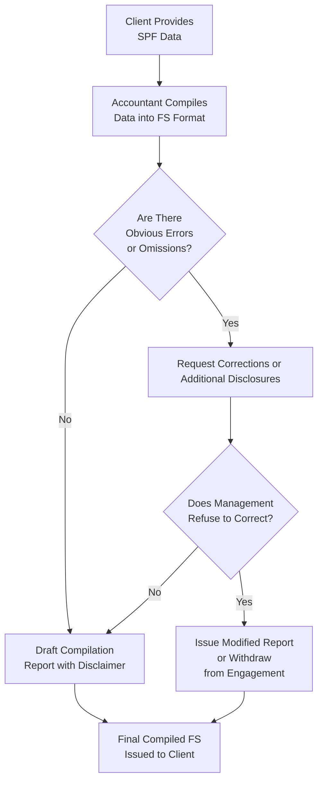

## 7.4 Reporting and Compilation Considerations

Financial statements prepared under special purpose frameworks (SPFs)—such as cash-basis, tax-basis, regulatory-basis, or contractual-basis—often require special attention when it comes to reporting and compilation engagements. While frameworks like U.S. GAAP aim to meet general-purpose reporting needs, SPFs are structured for specific user requirements and contexts. Therefore, one of the accountant’s most critical responsibilities is to understand when and how to properly compile or issue a report on these statements, ensuring appropriate disclaimers, disclosures, and modifications are included.

This section provides a comprehensive exploration of the accountant’s responsibilities in reporting on, and compiling, special purpose framework financials. We also address the importance of disclaimers and any modifications needed to comply with professional standards and stakeholders’ expectations.

## Understanding Special Purpose Frameworks

Before discussing reporting and compilation issues, it is crucial to briefly review the nature of SPFs. As discussed in prior chapters (see Chapter 7: Special Purpose Frameworks), these frameworks are not designed to meet general-purpose financial statement objectives. Instead, they focus on a narrower scope—such as tax reporting or cash-based measurement. Common SPFs include:

• Cash-Basis: Records transactions only when cash changes hands.  
• Modified Cash-Basis: A hybrid of cash-basis with certain accrual-basis adjustments.  
• Tax-Basis: Aligns with rules for filing income tax returns.  
• Regulatory-Basis: Conforms to requirements of a regulator (e.g., insurance commission).  
• Contractual-Basis: Prepared for specific contractual compliance, such as a lender covenant.

Each of these frameworks has its own unique reporting objectives, measurement attributes, and disclosure requirements. Consequently, the accountant must ensure that the financial statements clearly describe the utilized framework, its inherent limitations, and the nature of how transactions and balances are recorded and presented.

## Key Distinctions Among Audit, Review, and Compilation

When dealing with special purpose frameworks, the accountant’s level of involvement can range from a full audit (reasonable assurance) to a review (limited assurance) or compilation (no assurance) engagement. Here’s a simplified overview:

• Audit Engagement: Provides reasonable (positive) assurance that the financial statements are free from material misstatement.  
• Review Engagement: Provides limited (negative) assurance based primarily on inquiry and analytical procedures.  
• Compilation Engagement: Offers no assurance. The accountant compiles the financial statements from the client’s data into an appropriate format without verifying the underlying data in detail.  
• Preparation Engagement: Also offers no assurance but is typically used for internal purposes or for management without issuance of a formal report by the accountant.

Given that many organizations using special purpose frameworks opt for compilations or lower-level engagements, we will concentrate on compilation reports, disclaimers, and related modifications in the context of SPFs.

## Accountant’s Responsibilities in Compiling SPF Financial Statements

Compilations under Statements on Standards for Accounting and Review Services (SSARS) require the accountant to:

• Collect financial information from the client and organize it into a structured format.  
• Ensure that the compiled presentation is free of obvious material errors that would undermine its credibility.  
• Attach or provide a compilation report disclaiming any assurance over the financial statements.  
• Disclose the framework used, emphasizing that it may differ significantly from U.S. GAAP.  
• Indicate if the accountant lacks independence (when that is the case).  

It is vital to note that, in a compilation engagement, the accountant does not provide an opinion, nor does the accountant guarantee the absence of misstatements. Instead, the accountant exercises professional judgment to identify any glaring anomalies. If the client has significant deficiencies or if the statements appear to be materially misstated, the accountant must address these issues—either by requesting corrections or by modifying the report accordingly.

### Independence Considerations

While independence is not strictly required for compilation engagements, professional ethics standards require the accountant to disclose any lack of independence within the compilation report. For example, if the accountant also performs payroll and bookkeeping services for the same client, independence could be considered impaired. The SSARS framework specifies how and when such disclosures should be made.

## Disclaimers and Modifications in Special Purpose Framework Reporting

### The Disclaimer of Opinion

For compilation engagements, the accountant commonly issues a “disclaimer of opinion.” This is often phrased as:  
“Management (or owners) is (are) responsible for the accompanying financial statements of XYZ Company, which have been prepared on [Name of SPF]… We have performed a compilation engagement in accordance with Statements on Standards for Accounting and Review Services (SSARS) promulgated by the Accounting and Review Services Committee of the AICPA. We do not express an opinion, a conclusion, nor provide any form of assurance on these financial statements.”

This disclaimer is critical because it clarifies that the accountant has not performed an audit or review. Importantly, this language must specify the special purpose framework used and address any modifications or departures.

### Additional Disclaimers for SPFs

Because SPFs are not designed for general-purpose use, the accountant’s report should include disclaimers advising third parties of the framework’s limitations. For instance, with a contractual-basis framework:  
“These financial statements are prepared on a basis of accounting in accordance with the Company’s debt covenants with XYZ Bank, which is a basis of accounting other than accounting principles generally accepted in the United States of America. Accordingly, they may not be suitable for other purposes.”

Similarly, if the client’s financial statements are prepared only on a cash receipts and disbursements basis, the accountant highlights that certain accrual adjustments required by GAAP (such as depreciation, receivables, payables, etc.) may not be included.

### Modifications to the Standard Report

Occasionally, an accountant may need to modify the standard compilation report to emphasize certain matters or to address missing or incomplete disclosures. Reasons for modifications include:

• Management’s partial or complete omission of required disclosures.  
• Known departures from the applicable SPF or from the stated framework’s guidelines.  
• Going concern uncertainties that management refuses to disclose.  
• Significant subsequent events that are not addressed or that management declines to disclose.  

In these cases, the accountant typically adds a paragraph to the compilation report discussing the nature of the modified disclosure or departure. If management will not correct significant issues, the accountant may be obliged to withdraw from the engagement and decline to issue a compilation report altogether, depending on the severity of the departure.

## Practical Examples and Case Studies

### Example 1: Cash-Basis Compilation with Omitted Disclosures

Assume a small construction contractor, ABC Builders, prepares its financial statements strictly on the cash-basis of accounting. ABC wants the contractor’s bonding agency to review these statements. The accountant compiles ABC’s financial data and notices that no disclosures related to equipment leases or long-term debt were included.

• The accountant issues a compilation report stating that the financial statements are presented on the cash-basis of accounting, which is a basis other than U.S. GAAP.  
• The report also includes a note addressing omitted disclosures, clarifying that the statements are not intended for users requiring complete GAAP-based financial statements.  
• The accountant disclaims any opinion or assurance, notes any lack of independence if applicable, and highlights that users of these statements must be aware of the narrower accounting basis.

In some cases, the bonding agency might still accept these statements given their own internal thresholds or comfort with simplified financial reporting. However, the accountant has done due diligence by clearly disclaiming opinion and referencing the omitted disclosures.

### Example 2: Tax-Basis Compilation with a Departure

XYZ Corporation prepares financial statements for the sole purpose of filing corporate income tax returns. The company has historically expensed items that should be capitalized under IRS rules, resulting in a known departure from the tax-basis framework.

• During the compilation, the accountant identified the departure but management declined to make adjustments.  
• The accountant modifies the standard compilation report with an additional paragraph describing the nature of the departure and its potential quantitative effect.  
• If the impact cannot be easily quantified, the accountant states so.  

This communication ensures that any external stakeholder—such as a lender or potential investor—understands the discrepancy should they receive these statements.

## Illustrating the Reporting Workflow

Below is a visual flow diagram illustrating how an accountant typically proceeds when preparing a compilation engagement for special purpose framework statements:

• The accountant receives financial data from the client, organized under an SPF (cash, tax, contractual, etc.).  
• The accountant evaluates whether errors or omissions are significant. If so, the accountant seeks remediation from management.  
• If management refuses correction of a material departure, the accountant must decide between issuing a modified report or withdrawing.  
• Otherwise, the accountant finalizes the compilation report, including disclaimers.

## Best Practices and Common Pitfalls

### Best Practices

• Clearly Label the Applicable Framework: Prominently highlight that the financial statements are prepared using a special purpose framework.  
• Thoroughly Review Disclosures: Even though no assurance is provided, ensure obvious omissions or material misstatements are addressed.  
• Disclose Lack of Independence: If you lack independence, be transparent about it.  
• Document Engagement Objectives: Clarify from the outset that this is a compilation, not an audit or review, and that the report will disclaim any form of assurance.  
• Maintain Good Communication with Management: Encourage timely responses and adjustments when errors or omissions are identified.

### Common Pitfalls

• Failing to Provide the Required Special Purpose Framework Disclosures: Users may assume “GAAP-like” statements if disclaimers are missing or inadequate.  
• Overlooking a Known Departure: Failure to discuss a known departure can create reputational and legal risks.  
• Lack of Planning for Subsequent Events: Even in a compilation, an accountant should recognize material subsequent events and encourage management to disclose them.  
• Insufficient Documentation of Communication: It is imperative to maintain a trail of the discussions held with management regarding material departures or omitted disclosures.

## Communication With Management and Third Parties

A compilation engagement often implies frequent communication with client management about the financial reporting process. Management remains responsible for:

• Selecting the appropriate SPF.  
• Maintaining adequate records.  
• Making decisions about necessary disclosures.  

The accountant’s role is to ensure that the final financial statements are accurately compiled with appropriate disclaimers. If third parties—like lenders or regulators—will rely on these statements, it is crucial that everyone understands the limitations of SPF reporting. Additionally, certain third parties may require clarifications about the accountant’s scope of work and disclaimers to ensure they do not interpret the compilation as a higher level of assurance.

## References for Further Exploration

• AICPA Professional Standards – SSARS (AR-C Section 70)  
• AICPA Statements on Standards for Attestation Engagements (SSAE)  
• FASB and GASB guidance, where appropriate, for references to recognition and measurement variations  
• Internal Revenue Service and relevant regulatory bodies (e.g., state insurance commissions, banking authorities) for specific regulatory-basis reporting requirements

## Conclusion

Preparing financial statements under a special purpose framework can be an efficient way to meet the needs of specific user groups. However, it also introduces unique reporting and compilation considerations that must be rigorously addressed. By using disclaimers, explanatory paragraphs, and appropriate modifications, accountants protect themselves and their clients from potential misunderstandings. Clear communication, thorough documentation, and alignment with SSARS guidelines are paramount to ensure that SPF financial statements serve their intended purpose accurately and responsibly.

Compilations do not provide an opinion or assurance but, when done well, add structure, clarity, and credibility to a client’s financial data under specialized frameworks. By combining professional judgment with clear disclaimers, an accountant can successfully guide clients through the nuances of SPF reporting while upholding the highest ethical and professional standards.

--------------------------------------------------------------------------------

## Test Your Knowledge: Reporting and Compilation of Special Purpose Frameworks



### In a compilation engagement for a special purpose framework, which statement best describes the accountant’s level of assurance?

- [ ] The accountant provides reasonable assurance.  
- [ ] The accountant provides limited assurance.  
- [x] The accountant does not provide any assurance.  
- [ ] The accountant provides absolute assurance.  

> **Explanation:** In a compilation engagement, the accountant only compiles the data into financial statement format and issues a disclaimer of opinion, meaning no assurance is provided on those statements.

### Which of the following is true regarding disclaimers in a compilation report?

- [x] The report should clearly state that no opinion or assurance is expressed.  
- [ ] The report must always express a “clean” opinion.  
- [ ] The report must explicitly describe the auditor’s procedures performed.  
- [ ] The report must state that it is prepared according to GAAP.  

> **Explanation:** Compilation reports carry a disclaimer of opinion, explicitly stating that the accountant does not express any form of assurance and is not performing an audit or review.

### Management of a company that follows the cash-basis of accounting refuses to disclose any information about their long-term debt. What should the accountant do?

- [ ] Issue an unmodified (standard) compilation report.  
- [ ] Convert the financials to GAAP for clarity.  
- [x] Modify the compilation report or potentially withdraw if the omission is significant.  
- [ ] Conduct an audit to ensure completeness.  

> **Explanation:** When management omits significant disclosures, the accountant may need to emphasize them in the report or withdraw if the departure is too severe.

### If an accountant lacks independence in a compilation engagement, which of the following is required?

- [x] The fact that the accountant is not independent must be disclosed.  
- [ ] The engagement must immediately be converted to a review or audit.  
- [ ] The client must be informed, but no disclosure is required.  
- [ ] No mention of independence is permitted in the report.  

> **Explanation:** SSARS requires the accountant to disclose any lack of independence within the compilation report if independence is impaired.

### Under a contractual-basis framework, which of the following disclaimers would be most appropriate?

- [x] “These statements are prepared on a basis of accounting in accordance with the Company’s covenant with XYZ Bank and may not be suitable for other purposes.”  
- [ ] “These statements should be relied upon by all general-purpose users.”  
- [x] “This framework may differ from GAAP in recognition and presentation.”  
- [ ] “This framework fully aligns with IFRS.”  

> **Explanation:** Because contractual-basis accounting is narrow in scope, it must be disclosed that the statements might not be suitable for general-purpose use and can differ from standard GAAP or IFRS.

### Which of the following best illustrates a known departure from the special purpose framework that must be reported?

- [x] A tax-basis entity capitalizing instead of expensing certain costs, contradicting tax rules.  
- [ ] A GAAP-based entity that estimates accrued expenses.  
- [ ] An SPF-based entity following the cash-basis recognition of expenses.  
- [ ] Issuing financials in HTML format.  

> **Explanation:** A known departure from the stated framework occurs when the company’s chosen treatment contradicts the rules of that framework. Capitalizing items that should be expensed under tax regulations is a clear example of such a departure.

### What action should an accountant take if management refuses to address obviously material misstatements in a compilation?

- [ ] Sign a clean opinion on the statements.  
- [x] Modify the compilation report or withdraw from the engagement.  
- [x] Disclose the departure in the footnotes only.  
- [ ] Immediately escalate to the SEC.  

> **Explanation:** If material misstatements remain unresolved, the accountant should either modify the report to describe the departure or, if necessary, withdraw to avoid association with potentially misleading statements.

### Why is it crucial to highlight that a special purpose framework is different from GAAP in the compilation report?

- [x] So users understand the limitations and scope of the accounting basis used.  
- [ ] To fulfill the AICPA requirement that all statements must conform to GAAP.  
- [ ] Because auditors always prefer GAAP-based reports.  
- [ ] It is optional and typically not required.  

> **Explanation:** Users must be made aware of the differences between an SPF and GAAP to avoid any assumption that the statements follow traditional financial reporting norms.

### When issuing a compilation report on regulatory basis financial statements, which additional step might be necessary?

- [x] Include a paragraph stating that they are intended solely for a specific regulatory agency.  
- [ ] Provide a qualified audit opinion.  
- [ ] Obtain negative assurance from management.  
- [ ] Combine the regulatory-basis statements with GAAP compliance.  

> **Explanation:** Regulatory basis statements often serve particular regulatory agencies and may not be suitable for other users. Thus, the accountant should highlight this limitation.

### The use of a special purpose framework:

- [x] Must be clearly described in the financial statements.  
- [ ] Implies that the statements automatically follow IFRS.  
- [ ] Eliminates the need for disclaimers.  
- [ ] Requires the accountant to omit any reference to GAAP.  

> **Explanation:** The accountant should ensure that the special purpose framework is identified clearly to help users understand the accounting methods employed and their limitations.



--------------------------------------------------------------------------------

## For Additional Practice and Deeper Preparation

**[FAR CPA Hardest Mock Exams: In-Depth & Clear Explanations](https://www.udemy.com/course/far-cpa-mock-exams/?referralCode=F88050F8D5C76764F6BD)**  

**Financial Accounting and Reporting (FAR) CPA Mocks:** 6 Full (1,500 Qs), Harder Than Real! In-Depth & Clear. Crush With Confidence!  

- Tackle full-length mock exams designed to mirror real FAR questions.  
- Refine your exam-day strategies with detailed, step-by-step solutions for every scenario.  
- Explore in-depth rationales that reinforce higher-level concepts, giving you an edge on test day.  
- Boost confidence and minimize anxiety by mastering every corner of the FAR blueprint.  
- Perfect for those seeking exceptionally hard mocks and real-world readiness.  

_Disclaimer: This course is not endorsed by or affiliated with the AICPA, NASBA, or any official CPA Examination authority. All content is for educational and preparatory purposes only._
