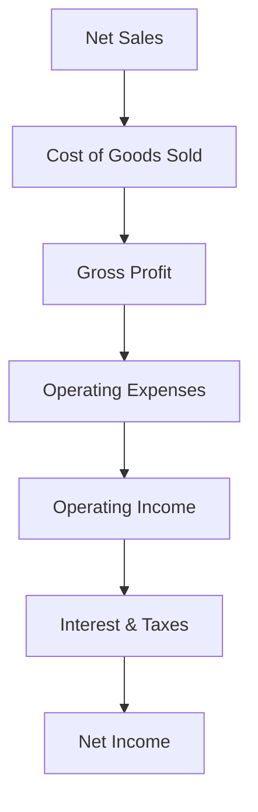
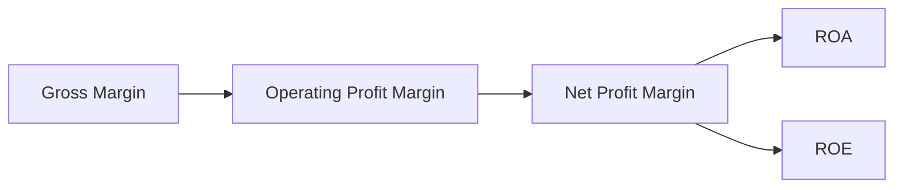

## 8.2 Profitability Ratios (Gross Margin, ROE, ROA, etc.)

Profitability ratios gauge a company’s ability to generate profits from its various activities, assets, and shareholder investments. They provide insights into how effectively an organization manages its revenue, expenses, and capital structures to create value. In the context of the Uniform CPA Examination (FAR Section), understanding and analyzing profitability ratios is essential for evaluating an entity’s overall financial performance and how that performance appears in financial reports. This section builds on the foundational financial statements (discussed in Chapter 3), financial analysis techniques (Chapter 8, Section 8.1), and not-for-profit or governmental nuances (Chapters 4–5).

Below, we explore the definitions, calculations, and interpretations of key profitability ratios, including their relevance to specific transactions and real-world examples. We will also illustrate how changes in accounting methods or estimates (e.g., from Chapter 18) may influence these ratios.

### Importance of Profitability Ratios

Profitability ratios measure the degree to which a company earns a return on its investments, offers shareholders a suitable rate of return, and manages operational costs effectively. Investors, creditors, auditors, and other stakeholders routinely assess profitability ratios to:

• Compare one company’s performance to peers or industry benchmarks.  
• Track performance over time to gauge trends and long-term viability.  
• Evaluate management’s ability to control costs and drive revenue growth.  
• Identify potential red flags or early indicators of financial distress.

Profitability ratios are also often featured in financial presentations to boards of directors, potential investors, lenders, and regulators. For CPA candidates, mastery of these ratios and their associated financial statement interrelationships is critical for success on the FAR exam.

### Gross Profit Margin

Gross Profit Margin (sometimes called “Gross Margin”) evaluates how much profit a company retains after incurring direct costs tied to producing goods or services. It reveals how effectively management uses labor and supplies in production and how pricing decisions affect profitability.

• Formula:

  (Gross Profit) / (Net Sales) × 100

or expressed in decimal form:

  Gross Profit ÷ Net Sales

Gross profit is typically calculated as Net Sales less Cost of Goods Sold (COGS) or Cost of Sales:

Gross Profit = Net Sales – Cost of Goods Sold

• Interpretation:  
  – A higher Gross Profit Margin indicates greater efficiency in controlling direct production costs or charging premium prices.  
  – A declining trend might point to rising material costs, labor inefficiencies, or intense pricing competition.  
  – Typical ranges vary widely by industry (e.g., technology or pharmaceuticals often have higher gross margins than retail).

• Real-World Example:  
  Suppose a company has net sales of $1,000,000 and COGS of $600,000 for the year. The Gross Profit is $400,000. The Gross Profit Margin is 40% ($400,000 ÷ $1,000,000). If margins slip to 35% next year, this might suggest that raw material prices increased or direct labor costs rose significantly.

• Links to Specific Transactions:  
  – Purchase of materials at higher cost will increase COGS and compress gross margin.  
  – Discounts offered on sales or price reductions to customers reduce net sales and, potentially, the margin if fixed production costs remain unchanged.

### Operating Profit Margin (Operating Income Margin)

While not always separately itemized in simpler calculations, Operating Profit Margin is extremely important for analyzing an entity’s core operating efficiency.

• Formula:

  (Operating Income) / (Net Sales) × 100

where Operating Income = Gross Profit – Operating Expenses (e.g., selling, general, administrative).  

• Interpretation:  
  – Useful for evaluating performance without the effects of non-operating items such as interest and taxes.  
  – If operating profit margin is consistently below industry averages, management may need to reevaluate cost structures or pricing strategies.

• Example:  
  Consider a manufacturing firm with net sales of $1,000,000, cost of goods sold of $600,000, and operating expenses of $250,000. Operating Income is thus $150,000, giving an Operating Margin of 15%.

### Net Profit Margin (Profit Margin on Sales)

This ratio measures the company’s “bottom line” profitability after all expenses, including interest and taxes, have been deducted from revenue.

• Formula:

  (Net Income) / (Net Sales) × 100

• Interpretation:  
  – A high Net Profit Margin indicates strong overall managerial efficiency in controlling all costs, including financing.  
  – Historically, Net Profit Margins can vary significantly based on the economic sector. Software companies might have 20–30% margins, whereas low-margin retailers might be around 3–5%.

• Example:  
  If a clothing retailer’s Net Income is $50,000 on Net Sales of $1,000,000, its Net Profit Margin is 5%. If the company sees an uptick to 8%, that often signals operational improvements, cost cutting, or increased pricing power.

### Return on Assets (ROA)

Return on Assets (ROA) assesses how effectively a company uses its assets to generate earnings, providing an integrated view of operational performance and asset management.

• Formula:

  (Net Income) / (Average Total Assets)

Average Total Assets is often the mean of beginning and ending asset balances.  

• Interpretation:  
  – A higher ROA suggests more efficient utilization of assets.  
  – Extremely capital-intensive industries (utilities, airlines) typically report lower ROAs. Industries where intangibles are significant (software, consulting) may produce higher ROAs due to relatively lower total assets on the balance sheet.

• Example with Calculation:  
  Assume an entity’s Net Income is $200,000. Beginning total assets were $1,500,000, and ending total assets were $2,100,000. Average total assets = ($1,500,000 + $2,100,000) / 2 = $1,800,000. ROA = $200,000 ÷ $1,800,000 ≈ 11.1%.  

• Transaction Link:  
  – Purchasing expensive equipment would increase total assets, potentially shrinking ROA unless Net Income grows proportionally.  
  – Sales of unproductive equipment could improve ROA if Net Income remains stable while total assets decline.

### Return on Equity (ROE)

Return on Equity (ROE) measures how effectively management is leveraging shareholders’ investments to create profit. Shareholders and potential investors pay close attention to ROE as it speaks directly to the potential return on their equity stake.

• Formula:

  (Net Income) / (Average Shareholders’ Equity)

As with assets in ROA, you often use the average of beginning and ending equity.

• Interpretation:  
  – A high ROE might reflect efficient capital usage, but could also be the result of excessive leverage (i.e., high debt).  
  – A lower-than-industry-average ROE might signal suboptimal use of shareholder capital or a conservative leverage strategy.

• Example:  
  If Net Income is $500,000 and average shareholders’ equity is $2,500,000, the ROE is 20%. Depending on the industry, this could be an indicator of strong performance.

### Earnings per Share (EPS) and Profitability

Though EPS is technically not a ratio in the same sense as margins or returns, it is closely tied to shareholder profitability. It is covered extensively in Chapter 6, specifically Section 6.4 on Earnings per Share. Nonetheless, EPS data can complement the profitability ratios discussed above and is commonly reported in the income statement.

### Building A Conceptual Flow using a Mermaid Diagram

Below is a simple flowchart that illustrates the derivation of basic profit measures from revenue:

• Gross Profit Margin = C ÷ A  
• Operating Profit Margin = E ÷ A  
• Net Profit Margin = G ÷ A  
• ROA and ROE reference G (Net Income) in the numerator and assets/equity, respectively, in the denominator.

### Working Through a Comprehensive Example

To demonstrate how these ratios might look in tandem, let’s consider an entity, BlueWave Electronics, that manufactures specialized circuit boards. Its summarized financial information for the year ended December 31 is as follows:

• Net Sales: $2,400,000  
• Cost of Goods Sold: $1,500,000  
• Operating Expenses (SG&A): $500,000  
• Interest Expense: $50,000  
• Tax Expense: $50,000  
• Net Income: $300,000 (computed as $2,400,000 – $1,500,000 – $500,000 – $50,000 – $50,000)  
• Beginning Total Assets (Jan 1): $2,000,000  
• Ending Total Assets (Dec 31): $2,600,000  
• Beginning Shareholders’ Equity (Jan 1): $1,200,000  
• Ending Shareholders’ Equity (Dec 31): $1,520,000  

From this data:

1. Gross Profit Margin  
   Gross Profit = Net Sales – COGS = $2,400,000 – $1,500,000 = $900,000  
   Gross Profit Margin = $900,000 ÷ $2,400,000 = 37.5%

2. Operating Profit Margin  
   Operating Income = Gross Profit – Operating Expenses = $900,000 – $500,000 = $400,000  
   Operating Profit Margin = $400,000 ÷ $2,400,000 = 16.7%

3. Net Profit Margin  
   Net Profit Margin = $300,000 ÷ $2,400,000 = 12.5%

4. Return on Assets (ROA)  
   Average Total Assets = ($2,000,000 + $2,600,000) ÷ 2 = $2,300,000  
   ROA = $300,000 ÷ $2,300,000 ≈ 13.0%

5. Return on Equity (ROE)  
   Average Shareholders’ Equity = ($1,200,000 + $1,520,000) ÷ 2 = $1,360,000  
   ROE = $300,000 ÷ $1,360,000 ≈ 22.1%

These results indicate the entity is performing well based on this hypothetical industry’s benchmarks. A 22.1% ROE, for example, might be deemed outstanding if comparable industry peers average around 15%.

### Typical Ranges and Trends

Profitability ratios can vary considerably across industries, business models, and economic cycles. For instance:

• Retailers often operate with small Net Profit Margins (2–6%) because they rely on high volume.  
• Technology or pharmaceutical companies sometimes have very high Gross Profit Margins (60–80%) due to intangible or patent-protected product lines, but they may invest heavily in research and development, impacting Net Profit.  
• Utility companies might present moderate Gross Margin but lower Net Profit Margins because of regulatory constraints or high fixed costs.

When analyzing these ratios over time or against industry peers, consider:

• Seasonality: Many businesses fluctuate due to seasonal demand.  
• Capital Structure: High leverage can inflate ROE but may reduce Net Income if interest expense is substantial.  
• Accounting Policies: Changes in depreciation methods (Chapter 12), inventory valuation (Chapter 11), revenue recognition (Chapter 20), or intangible asset treatment (Chapter 14) affect reported earnings, thus impacting profitability ratios.

### Impact of Specific Transactions on Profitability Ratios

1. Changes in Inventory Costing Method  
   – Switching from FIFO to LIFO or Weighted Average can alter Cost of Goods Sold, thus influencing Gross Profit Margin.  
   – Over the longer term, such changes can significantly impact Return on Assets due to differences in recognized inventory values.

2. Large Asset Purchases  
   – Acquiring capital assets raises total assets, potentially reducing ROA and could also impact Net Income if depreciation or interest expense rises.

3. Stock Buybacks  
   – Reducing shareholders’ equity by repurchasing shares can increase ROE if Net Income remains stable.  
   – This may also influence EPS (Chapter 6.4).

4. Debt Refinancing  
   – Lowering interest rates or extending maturities can reduce interest expense, thereby increasing Net Profit and Net Profit Margin, ROA, and ROE.

5. Major Legal Settlement or Contingency (Chapter 19)  
   – Significant settlement payments decrease Net Income dramatically, impacting margins and returns.

### Best Practices in Using and Interpreting Profitability Ratios

• Compare Ratios to Benchmarks: Evaluate a company’s ratios against industry averages or specific competitors. This approach promotes context-driven interpretation rather than isolated data points.  
• Trend Analysis: Monitor ratio changes over multiple quarters or years to identify continuous improvement or systematic decline. Short-term fluctuations could be less meaningful.  
• Use a Balanced Scorecard Approach: Profitability ratios should be considered in conjunction with liquidity (Chapter 8.3) and solvency ratios (Chapter 8.4) to get a holistic financial health assessment.  
• Investigate Outliers: Extremely high or low ratios may suggest an acquisition, a change in strategic focus, or changes to accounting estimates. Always investigate unusual spikes or drops.

### Common Pitfalls and Challenges

• Accounting Manipulation: Companies might manage earnings by deferring revenue or accelerating expenses. Ratio analysis is more reliable when cross-referenced with footnotes and risk disclosures (Chapters 3.6, 3.7).  
• Single-Period vs. Multi-Period: Basing major conclusions on a single accounting period might be misleading due to seasonal or one-time effects (e.g., disposal of a major division).  
• Industry-Specific Metrics: Failing to recognize industry-specific operational metrics or specialized accounting can lead to erroneous assumptions. For example, software-as-a-service companies often track recurring revenue or user churn in addition to standard profitability ratios.  
• Not-For-Profit Entities: Some ratios have limited utility for not-for-profit organizations (Chapter 4) that focus on mission-related outcomes. Alternative performance indicators are often used there, though partial expansions of these ratios can still appear (e.g., “program efficiency ratio”).

### Additional Visual Representation: Ratio Interconnections

Consider the following high-level schematic that shows how shifting one ratio can impact another:

• If Gross Margin slips, Operating Profit Margin often follows (unless offset by significant reductions in operating expenses).  
• Changes in Net Profit Margin flow through to both ROA and ROE, linking back to an entity’s asset base and equity financing.

### References and Further Reading

• FASB Accounting Standards Codification (ASC) Sections 205 (Presentation of Financial Statements), 210 (Balance Sheet), 220 (Comprehensive Income), and 606 (Revenue from Contracts).  
• Chapter 8.1 of this guide for Horizontal and Vertical Analysis Techniques.  
• Chapter 6.4 for deeper coverage of Earnings per Share (EPS) calculations.  
• AICPA resources on Advanced Financial Statement Analysis.  
• “Intermediate Accounting” by Kieso, Weygandt, and Warfield for an in-depth exploration of profitability and other financial metrics.

---

## SEO-Optimized Quiz Title: Mastering Profitability Ratios for CPA Exam Success



### Gross Profit Margin Analysis
- [ ] It measures how well a company manages its fixed costs.
- [ ] It focuses on non-operating expenses.
- [x] It indicates the profitability after direct costs are deducted from net sales.
- [ ] It only measures net income in relation to net sales.

> **Explanation:** Gross Profit Margin specifically reflects net sales minus cost of goods sold as a percentage of net sales, showing how much profit remains after covering direct production costs.

### ROA Calculation
- [x] ROA = Net Income / Average Total Assets
- [ ] ROA = Net Income / Closing Shareholder Equity
- [ ] ROA = Gross Profit / Ending Total Assets
- [ ] ROA = Net Income / Net Sales

> **Explanation:** Return on Assets (ROA) assesses a firm’s efficiency in using assets to generate profit. The most common formula is Net Income divided by Average Total Assets over the period.

### Effect of Equipment Purchase on ROA
- [x] It may decrease ROA if net income does not grow proportionally.
- [ ] It automatically increases ROA.
- [ ] It has no impact on profitability ratios.
- [ ] It eliminates the need for interest expense analysis.

> **Explanation:** When total assets rise and net income stays the same (or grows more slowly), ROA typically decreases.

### Net Profit Margin Significance
- [ ] Reflects only labor efficiency.
- [ ] Ignores operating expenses.
- [ ] Focuses on dividends to shareholders.
- [x] Measures overall profitability after all expenses, including interest and taxes.

> **Explanation:** Net Profit Margin reveals how much of each dollar of sales is profit after accounting for all expenses, offering a comprehensive look at profitability.

### Operating Profit Margin vs. Net Profit Margin
- [x] Operating Profit Margin excludes interest and taxes, while Net Profit Margin includes them.
- [ ] Both exclude cost of goods sold.
- [x] Operating Profit Margin can be higher than Net Profit Margin by definition.
- [ ] Net Profit Margin is always higher.

> **Explanation:** Operating Profit excludes non-operating expenses such as interest and taxes; thus, Net Profit Margin includes those additional costs and is typically lower than the Operating Profit Margin.

### ROE Interpretation
- [x] ROE gauges how effectively the company uses shareholder equity to generate profit.
- [ ] ROE measures the speed of receivables collection.
- [ ] ROE is irrelevant when evaluating leverage.
- [ ] ROE excludes net income from continuing operations.

> **Explanation:** Return on Equity focuses on how well managers deploy shareholder funds to earn returns. High leverage may inflate ROE by limiting equity capital.

### Impact of Debt Refinancing on Profitability
- [x] It may reduce interest costs, increasing net income and thus increasing margins.
- [ ] It eliminates the need to track liabilities.
- [x] It can improve ratios like ROA and ROE if the net income boost is significant.
- [ ] It removes all repayment obligations.

> **Explanation:** Refinancing at a lower rate lowers interest expense, potentially raising net income. This improvement can enhance margins and returns, including ROA and ROE.

### Comparing Profitability Ratio Trends Over Time
- [x] Highlights whether efficiency is improving or declining.
- [ ] Is only relevant for companies in the same industry.
- [ ] Should always be consistent with single-period analysis.
- [ ] Never considers changes in accounting policies.

> **Explanation:** Evaluating ratio trends over multiple periods helps neutralize short-term anomalies, offering insights into consistent improvements or problems. One must still be mindful of changes in accounting policies.

### Gross Margin Changes Caused by COGS
- [x] Increases in COGS without proportional rises in net sales will reduce gross margin.
- [ ] They have no impact on operating margin.
- [ ] They only affect net margin.
- [ ] They always improve the net income.

> **Explanation:** If cost of goods sold rises faster than net sales, the surplus portion of sales after direct costs (i.e., gross profit) will shrink, lowering the gross margin.

### Non-Operating Items in Net Profit Margin
- [x] True
- [ ] False

> **Explanation:** Net Profit (or Net Income) includes non-operating items like interest expense, interest income, and taxes, so the Net Profit Margin reflects the comprehensive outcome of both operating and non-operating activities.



---

## For Additional Practice and Deeper Preparation

**[FAR CPA Hardest Mock Exams: In-Depth & Clear Explanations](https://www.udemy.com/course/far-cpa-mock-exams/?referralCode=F88050F8D5C76764F6BD)**  

**Financial Accounting and Reporting (FAR) CPA Mocks:** 6 Full (1,500 Qs), Harder Than Real! In-Depth & Clear. Crush With Confidence!  

- Tackle full-length mock exams designed to mirror real FAR questions.  
- Refine your exam-day strategies with detailed, step-by-step solutions for every scenario.  
- Explore in-depth rationales that reinforce higher-level concepts, giving you an edge on test day.  
- Boost confidence and minimize anxiety by mastering every corner of the FAR blueprint.  
- Perfect for those seeking exceptionally hard mocks and real-world readiness.  

_Disclaimer: This course is not endorsed by or affiliated with the AICPA, NASBA, or any official CPA Examination authority. All content is for educational and preparatory purposes only._
