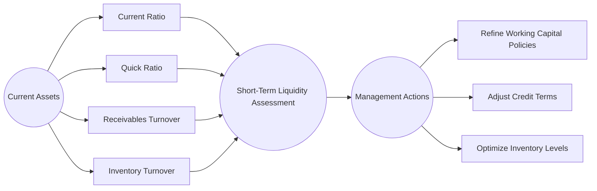

## 8.3 Liquidity Ratios (Current, Quick, Receivables, Inventory Turnover)

Liquidity ratios serve as critical indicators of a company’s ability to meet its short-term obligations. These indicators are often the first stop for analysts, lenders, and investors who want to assess the firm’s capacity to convert its current assets into cash quickly and efficiently. A strong set of liquidity ratios can enhance a firm’s credibility in the marketplace, influence financing terms, and offer a measure of financial resilience during economic shocks and market volatility.

This section explores the most common and telling liquidity measurements: (1) the Current Ratio, (2) the Quick Ratio, (3) the Receivables Turnover Ratio, and (4) the Inventory Turnover Ratio. We will define each ratio, examine how they are calculated, discuss typical thresholds and practical benchmarks, and analyze how they collectively portray an entity’s short-term solvency. Concepts will be illustrated with contextual examples, case studies, and diagrams. By the end of this section, you will have a comprehensive understanding of how these ratios work together to form a clear picture of a firm’s operating and financial health.

-------------------------------------------------------------------------------

### Importance of Liquidity Analysis

Liquidity ratios generally focus on a firm’s current assets (cash, receivables, inventories) and current liabilities (short-term obligations such as accounts payable, accrued expenses, and current maturities of long-term debt). Liquidity analysis is often performed not just once but periodically as part of ongoing performance tracking or as an annual or quarterly routine by external stakeholders.

1. Creditors and Short-Term Lenders: Short-term lenders are keenly interested in whether the enterprise can repay its obligations on time. Liquidity ratios help creditors understand how quickly a firm can transform its short-term resources into cash to meet upcoming payments.

2. Investors: While longer-term investors tend to emphasize profitability and growth, liquidity still matters. If a firm faces cash flow difficulties, it might be forced into costly financing arrangements or asset sales that undermine growth.

3. Management: Internally, a robust understanding of liquidity helps management anticipate potential cash flow bottlenecks. Companies with strong liquidity are often more resilient in downturns and can seize timely business opportunities without risking insolvency.

-------------------------------------------------------------------------------

### Current Ratio

The Current Ratio is one of the most recognized measures of liquidity. It indicates how many dollars of current assets the company has for every dollar of current liabilities. 

#### Definition and Formula

The **Current Ratio** is calculated as:


\text{Current Ratio} \;=\; \frac{\text{Current Assets}}{\text{Current Liabilities}}


• **Current Assets** typically include cash and cash equivalents, short-term marketable securities, accounts receivable, inventories, and other assets expected to be converted to cash within one year or one operating cycle (whichever is longer).  
• **Current Liabilities** encompass short-term obligations like accounts payable, accrued expenses, short-term loans, and the current portion of long-term debt.

#### Interpretation

1. **Value above 1.0**: A Current Ratio exceeding 1.0 suggests the entity has more current assets than current liabilities. This is often considered the baseline measure of adequate short-term solvency.  
2. **Higher isn’t Always Better**: A very high Current Ratio could indicate underutilized or idle assets, or possibly inefficient working capital management.  
3. **Industry Norms**: Ideal Current Ratios vary significantly by industry. For instance, a Current Ratio of 1.2 might be solid for a retail operation with rapid inventory turnover, whereas a manufacturing firm might seek a higher ratio due to slower inventory cycling.

#### Example

Assume Company Dynamic Solutions has the following as of December 31:  
• Current Assets = $500,000  
• Current Liabilities = $400,000  

Its Current Ratio is:  

\frac{\$500{,}000}{\$400{,}000} = 1.25
  
A ratio of 1.25 means the firm has $1.25 of current assets for every $1.00 of current liabilities. While generally acceptable, management may still analyze whether some portions of these current assets are illiquid (e.g., slow-moving inventory) when making decisions.

#### Practical Thresholds

• 1.0 is often used as a rough benchmark to distinguish whether a firm’s short-term assets cover its short-term liabilities.  
• Industries with quick turnover of receivables and inventory (e.g., grocery stores) may sustain a healthy business model with a ratio slightly below 1.0.  
• Capital-intensive industries often prefer a ratio > 2.0 to ensure coverage of large upcoming obligations and potential capital expenditures.

-------------------------------------------------------------------------------

### Quick Ratio (Acid-Test Ratio)

While the Current Ratio provides an overview of all current assets, the **Quick Ratio** refines the analysis by focusing only on those current assets that can be easily converted to cash. Also referred to as the Acid-Test Ratio, it excludes inventories and other less liquid components from its numerator.

#### Definition and Formula


\text{Quick Ratio (Acid-Test)} \;=\; \frac{\text{Current Assets} \;-\; \text{Inventory} \;-\; \text{Prepaid Expenses}}{\text{Current Liabilities}}


Alternatively, a common approximation is:


\text{Quick Ratio} \;=\; \frac{\text{Cash} + \text{Marketable Securities} + \text{Net Receivables}}{\text{Current Liabilities}}


#### Interpretation

1. **Stringent View of Liquidity**: By excluding items like inventory and prepaid expenses that may not be immediately convertible to cash, the Quick Ratio tightens the lens to near-cash assets.  
2. **Industry-Dependent**: Companies that rely on fast-moving inventory often operate effectively with a lower Quick Ratio, whereas service or tech firms that carry minimal inventory might expect their Quick Ratio to approximate their Current Ratio.

#### Example

Continuing our previous example of Dynamic Solutions, assume the following:  
• Cash = $50,000  
• Marketable Securities = $20,000  
• Accounts Receivable = $180,000 (net of allowance for uncollectibles)  
• Inventories = $220,000  
• Prepaid Expenses = $10,000  
• Current Liabilities = $400,000  

Quick Ratio would be:


\text{Quick Ratio} = \frac{\$50{,}000 + \$20{,}000 + \$180{,}000}{\$400{,}000} = \frac{\$250{,}000}{\$400{,}000} \approx 0.63


(Note that in this formula we did not subtract inventory or prepaid expenses first; we simply added assets that qualify as quick assets. Either approach yields the same number.)

A Quick Ratio of 0.63 indicates that if the firm’s liabilities become due immediately, its quick assets only cover about 63% of short-term obligations. This highlights the potential reliance on inventory conversions (sales) or additional financing to meet liquidity needs.

#### Practical Thresholds

• A Quick Ratio close to 1.0 suggests the firm can meet current obligations without selling inventory or seeking external financing.  
• Values below 1.0 can still be acceptable for firms that can quickly turn over inventory or secure short-term loans on favorable terms.  

-------------------------------------------------------------------------------

### Receivables Turnover Ratio

Receivables (largely accounts receivable) represent amounts owed to the company by its customers. How quickly these amounts are collected is vital to liquidity. The **Receivables Turnover Ratio** measures how many times in a period (usually a year) a company converts its receivables into cash.

#### Definition and Formula


\text{Receivables Turnover Ratio} = \frac{\text{Net Credit Sales}}{\text{Average Net Receivables}}


• **Net Credit Sales**: Total sales on credit, minus returns, allowances, or discounts.  
• **Average Net Receivables**: Often calculated by \\(\frac{\text{(Beginning Net Receivables) + (Ending Net Receivables)}}{2}\\).

#### Days Sales Outstanding (DSO)

An alternative representation of the Receivables Turnover Ratio is the **Days Sales Outstanding (DSO)**, which expresses the average collection period in days:


\text{DSO} = \frac{365}{\text{Receivables Turnover Ratio}}


A smaller DSO means the business collects receivables more swiftly, boosting liquidity.

#### Interpretation

1. **Higher Turnover Ratio**: Indicates frequent and quick collection of receivables, implying strong credit control and robust cash flow.  
2. **Lower Turnover Ratio**: Could signal slow collection, potential credit risks, or less aggressive follow-up procedures for overdue accounts.

#### Example

Company Alpha Beta sells on credit and reports:  
• Net Credit Sales for the year = $1,200,000  
• Beginning Net Receivables = $150,000  
• Ending Net Receivables = $190,000  


\text{Average Net Receivables} = \frac{\$150{,}000 + \$190{,}000}{2} = \$170{,}000



\text{Receivables Turnover Ratio} = \frac{\$1{,}200{,}000}{\$170{,}000} \approx 7.06


Thus, Alpha Beta effectively “turns over” its receivables about 7 times a year.

To find the DSO:  

\text{DSO} = \frac{365}{7.06} \approx 52 \; \text{days}

So, on average, it takes 52 days for Alpha Beta to collect on credit sales.

#### Practical Thresholds

• **Industry Norms**: In some industries, a DSO of 30–45 days is common. Others operating with extended credit terms might consider 60–90 days acceptable.  
• **Efficiency Goals**: Many companies set internal targets to reduce DSO to free up cash flow.  

-------------------------------------------------------------------------------

### Inventory Turnover Ratio

Inventory is often the largest current asset on balance sheets of manufacturing, wholesale, or retail-based businesses. The **Inventory Turnover Ratio** evaluates how rapidly a company sells and replaces its inventory during a given period.

#### Definition and Formula


\text{Inventory Turnover Ratio} = \frac{\text{Cost of Goods Sold (COGS)}}{\text{Average Inventory}}


• **COGS** includes the direct costs associated with the production of goods sold in that reporting period.  
• **Average Inventory**: This can be the average of the beginning and ending inventory balances, or a more refined approach if monthly or quarterly data are available.

#### Days in Inventory

Similar to receivables, we can convert the turnover into an average holding period in days:


\text{Days in Inventory} = \frac{365}{\text{Inventory Turnover Ratio}}


A lower Days in Inventory indicates that inventory moves quickly and cash is not tied up for long.

#### Interpretation

1. **Higher Turnover**: Suggests a firm is selling inventory rapidly, which often implies efficient operations, strong product demand, or just-in-time management.  
2. **Lower Turnover**: Indicates slower-moving inventory, which may lead to excess holding costs or obsolescence risks.

#### Example

Company ApparelOne shows the following data for its fiscal year:  
• COGS = $800,000  
• Beginning Inventory = $120,000  
• Ending Inventory = $160,000  


\text{Average Inventory} = \frac{\$120{,}000 + \$160{,}000}{2} = \$140{,}000


\text{Inventory Turnover Ratio} = \frac{\$800{,}000}{\$140{,}000} \approx 5.71


The firm sold and replenished inventory about 5.71 times throughout the year. Days in Inventory computation:


\text{Days in Inventory} = \frac{365}{5.71} \approx 64 \; \text{days}


So on average, ApparelOne keeps 64 days of inventory on hand before it gets sold.

#### Practical Thresholds

• **Industry Influences**: For example, a fresh food retailer might have an extremely high turnover rate with minimal days in inventory. A luxury car dealership could see lower turnover.  
• **Cash Flow Implications**: Slow inventory turnover can stress a firm’s liquidity by trapping cash in unsold goods.  

-------------------------------------------------------------------------------

### Combined Analysis of Liquidity Ratios

Liquidity ratios provide complementary insights. The **Current Ratio** and **Quick Ratio** gauge a firm’s broader solvency capacity, while the **Receivables Turnover Ratio** and **Inventory Turnover Ratio** drill down into critical working capital components.  

The diagram below illustrates the relationship between these ratios and how they collectively support an overall liquidity analysis:

From this simplified flowchart, you can observe:

1. Both the Current Ratio and Quick Ratio provide top-level perspectives.  
2. Receivables Turnover and Inventory Turnover ratios delve deeper into operational factors affecting liquidity.  
3. The ultimate goal for management is to take informed actions that improve short-term solvency, reduce risks, and support ongoing operations.

-------------------------------------------------------------------------------

### Thresholds, Benchmarks, and Industry Norms

Liquidity ratios vary widely across industries due to differences in business cycles, credit terms, production processes, and product shelf life. It is imperative to compare any ratio against:

- **Historical Values**: Look for trends within the company over time.  
- **Industry Averages**: Compare with peers to evaluate relative performance.  
- **Economic Context**: Adjust expectations based on macroeconomic conditions that affect cash availability or consumer demand.

-------------------------------------------------------------------------------

### Best Practices in Managing Liquidity

1. **Regular Monitoring**: Liquidity ratios should be computed on a monthly, quarterly, or an as-needed basis to promptly detect emerging issues.  
2. **Tight Cash Management**: Use shorter credit policy windows where feasible and enforce robust collections procedures for overdue accounts.  
3. **Inventory Optimization**: Employ just-in-time or lean inventory methods to limit overstocking and free up working capital.  
4. **Relationships with Banks**: Maintain a good rapport with financial institutions and keep lines of credit open. This can serve as a buffer if cash inflows are delayed.  
5. **Scenario Planning**: Use “what-if” analyses to see how liquidity might be affected by downturns, new product launches, or capital expenditures.

-------------------------------------------------------------------------------

### Common Pitfalls and Challenges

1. **Over-Reliance on Single Ratio**: Assessing a company solely by its Current Ratio can mask deeper problems, such as slow-turning inventory or uncollectible receivables.  
2. **Window Dressing**: Firms may artificially inflate certain liquidity ratios at period-end—e.g., by delaying payments to vendors just before the reporting date.  
3. **Ignoring Quality of Current Assets**: A large amount of obsolete inventory or doubtful receivables can mislead ratio interpretations.  
4. **Complacency with Industry Averages**: Merely meeting the industry average might not be enough if a firm’s strategic goals demand higher liquidity. 
5. **Erratic Cash Management**: Rapid expansions or unanticipated projects can strain liquidity if not planned carefully.

-------------------------------------------------------------------------------

### Real-World Case Study: BestTec Manufacturing

BestTec Manufacturing is a midsize electronics assembly company. Over the past year, the company’s management noticed tight cash flows near quarter-ends. The CFO conducted a liquidity analysis to reveal the underlying issues.

• **Step 1: Current Ratio**  
  - Current Assets (Dec 31) = $2,500,000  
  - Current Liabilities (Dec 31) = $2,000,000  
  - Current Ratio ≈ 1.25  

  At first glance, 1.25 did not indicate acute danger. However, further investigation was warranted.

• **Step 2: Quick Ratio**  
  - Cash + Marketable Securities + Net Receivables = $1,100,000  
  - Quick Ratio = $1,100,000 / $2,000,000 = 0.55  

  This was a red flag. Nearly half of BestTec’s current assets sat in raw materials and work-in-process inventory.

• **Step 3: Receivables Turnover**  
  - Net Credit Sales = $8,000,000  
  - Average Net Receivables = $1,000,000  
  - Receivables Turnover = 8, corresponding to a DSO of ~46 days.  

  This was moderately acceptable. Customers typically paid around 45 days, but some were stretching to 60 days.

• **Step 4: Inventory Turnover**  
  - COGS = $5,400,000  
  - Average Inventory = $1,350,000  
  - Inventory Turnover = 4, implying an average of 91 days in inventory.  

  For electronics, a 91-day holding period was somewhat high, especially for fast-changing technologies with the risk of inventory obsolescence.

After examining all ratios, the CFO identified that BestTec’s cash crunch stemmed from excessive inventory investment. As a solution:

1. The company introduced a new production scheduling system aligned with customer orders, reducing the average inventory from $1,350,000 to $1,100,000 over six months.  
2. They offered small discounts for earlier payments to accelerate receivables.  

As a result, by the following year, BestTec’s Quick Ratio improved to 0.80, and the Inventory Turnover Ratio improved to 5. This alleviated quarter-end cash pressure and gave management a clearer strategic focus.

-------------------------------------------------------------------------------

### Strategies to Improve Liquidity Ratios

1. **Shorten Operating Cycle**: Compressing the time frame between paying for input materials and collecting from customers can improve short-term solvency.  
2. **Optimize Credit Policies**: Conduct credit checks and impose late payment penalties to maintain healthy receivable levels.  
3. **Negotiate Supplier Terms**: Extended payment terms with suppliers can match or exceed your receivables collection period, further stabilizing cash flow.  
4. **Liquidate Excess or Obsolete Inventory**: Sell (even at a discount) slow-moving items to free working capital.  
5. **Supplement with Short-Term Financing**: Use revolving credit lines or commercial paper for temporary liquidity. However, over-reliance on debt can raise interest costs and financial leverage.

-------------------------------------------------------------------------------

### Diagrams and Tables

Below is a sample table illustrating how a hypothetical company’s liquidity ratios compare over two accounting periods along with industry norms:

| Ratio                  | Year 1   | Year 2   | Industry Avg. |
|------------------------|----------|----------|---------------|
| Current Ratio          | 1.20     | 1.15     | 1.30          |
| Quick Ratio            | 0.70     | 0.65     | 0.80          |
| Receivables Turnover   | 6.5      | 7.0      | 7.2           |
| Inventory Turnover     | 4.2      | 4.6      | 5.0           |

Management can see that while the company’s Inventory Turnover is inching closer to the industry average, the Quick Ratio is slightly deteriorating. Such insights can guide specific operational or financing decisions, such as tightening credit collection or reducing inventory purchase quantities.

-------------------------------------------------------------------------------

### Final Thoughts

Liquidity ratios act as the financial “early warning systems,” alerting stakeholders to potential short-term solvency challenges. By looking at the Current and Quick Ratios in tandem, management obtains both a broad and refined view of the firm’s near-cash assets. Meanwhile, analyzing the Receivables and Inventory Turnover Ratios highlights how effectively the firm is managing two of its largest short-term items—credit sales and stock.

Understanding and improving these ratios strengthens short-term solvency, enhances relationships with creditors, and offers strategic flexibility. As you prepare for the CPA Exam’s Financial Accounting and Reporting (FAR) section, remember that liquidity analysis does not exist in a silo: it ties to broader issues of working capital management, credit risk, and even capital structure decisions. By integrating all these insights, you will be better equipped to interpret real-world financial statements, diagnose potential problem areas, and propose solutions that optimize a company’s financial health.

-------------------------------------------------------------------------------

## SEO-Optimized Liquidity Ratios Knowledge Check



### Which ratio best reflects the company’s ability to meet short-term obligations using only its most liquid assets?

- [ ] Current Ratio
- [x] Quick Ratio
- [ ] Debt-to-Equity Ratio
- [ ] Gross Profit Margin

> **Explanation:** The Quick Ratio, also called the Acid-Test Ratio, excludes less liquid sources of current assets (like inventories and prepaids), providing a more stringent view of a company’s immediate liquidity.

### An extremely high Current Ratio might indicate:

- [x] Idle or underutilized current assets
- [ ] The company will likely face insolvency
- [ ] An inaccurate use of inventory and prepaid expenses in the formula
- [ ] Industry-leading collection practices

> **Explanation:** While a current ratio above 1.0 can be positive, a very high ratio may suggest that assets are tied up in unproductive ways, indicating possible inefficiency in working capital management.

### Which of the following describes the calculation of Days Sales Outstanding (DSO)?

- [x] (365 ÷ Receivables Turnover)
- [ ] (365 ÷ Inventory Turnover)
- [ ] (Net Sales ÷ Accounts Receivable)
- [ ] (Gross Profit ÷ Average Receivables)

> **Explanation:** The DSO formula takes 365 days in a year and divides by the Receivables Turnover to convert that turnover ratio into a measure of how many days it takes, on average, to collect receivables.

### A Receivables Turnover Ratio of 4.0 implies:

- [ ] The company collects its receivables in 15 days on average
- [ ] The company has a Quick Ratio of 4.0
- [x] The company collects its receivables 4 times per year
- [ ] The company has extremely tight credit policies

> **Explanation:** A Receivables Turnover of 4.0 indicates that the company converts its receivables into cash four times a year, or on average, every three months (365/4 ≈ 91 days).

### Which of the following factors could lower the Inventory Turnover Ratio?

- [x] Increased levels of unsold inventory
- [ ] Increased sales demand
- [x] Overestimation of the cost of goods sold
- [ ] Selling inventory at a discount to boost turnover

> **Explanation:** If unsold inventory accumulates or COGS is erroneously inflated, the Inventory Turnover will decline, suggesting slower movement of goods.

### If a company's Quick Ratio is consistently below 1.0, this likely indicates:

- [x] The firm may need to rely on selling inventory or obtaining external financing to meet current obligations
- [ ] The firm is using equity financing exclusively
- [ ] The firm's inventory is turning faster than industry norms
- [ ] The company will never be able to pay its debt

> **Explanation:** A Quick Ratio under 1.0 is not necessarily dire, but it signals that the company must convert inventory into sales or secure financing in order to pay all its short-term obligations.

### A very high Receivables Turnover Ratio might suggest:

- [ ] The credit terms offered are extremely lenient
- [x] The firm collects outstanding receivables quickly
- [x] The firm predominantly makes cash sales
- [ ] The firm’s customers are consistently delinquent

> **Explanation:** A high Receivables Turnover Ratio implies that the company collects receivables frequently, possibly because of efficient collection processes or more cash-based sales. Both factors can result in rapid turnovers.

### What does it imply if a firm’s Current Ratio remains stable over time, but the Quick Ratio deteriorates?

- [ ] Total current liabilities have decreased
- [ ] The firm has no changes in receivables or inventory
- [ ] It has improved its cash-to-debt coverage
- [x] An increasing proportion of current assets is made up of less liquid items like inventory

> **Explanation:** A stable Current Ratio but a declining Quick Ratio suggests that the composition of current assets has shifted toward inventory, prepaids, or other less liquid items.  

### When a company overstates its ending inventory, which ratio is most directly impacted?

- [ ] Current Ratio increases
- [ ] Quick Ratio decreases
- [x] Inventory Turnover Ratio decreases
- [ ] Receivables Turnover Ratio increases

> **Explanation:** Overstating ending inventory inflates the average inventory balance, leading to a decrease in the Inventory Turnover Ratio (since COGS stays the same while the denominator is artificially increased).

### A higher Inventory Turnover generally indicates:

- [x] The company is efficiently managing and selling its goods
- [ ] The company has extended its days in inventory
- [ ] A decreased COGS relative to inventory
- [ ] Slow acceptance of new product lines by the market

> **Explanation:** A higher turnover ratio shows that items move quickly through the system before replenishment, reflecting efficient production planning or strong consumer demand.



-------------------------------------------------------------------------------

## For Additional Practice and Deeper Preparation

**[FAR CPA Hardest Mock Exams: In-Depth & Clear Explanations](https://www.udemy.com/course/far-cpa-mock-exams/?referralCode=F88050F8D5C76764F6BD)**  

**Financial Accounting and Reporting (FAR) CPA Mocks:** 6 Full (1,500 Qs), Harder Than Real! In-Depth & Clear. Crush With Confidence! 

- Tackle full-length mock exams designed to mirror real FAR questions.  
- Refine your exam-day strategies with detailed, step-by-step solutions for every scenario.  
- Explore in-depth rationales that reinforce higher-level concepts, giving you an edge on test day.  
- Boost confidence and minimize anxiety by mastering every corner of the FAR blueprint.  
- Perfect for those seeking exceptionally hard mocks and real-world readiness.  

_Disclaimer: This course is not endorsed by or affiliated with the AICPA, NASBA, or any official CPA Examination authority. All content is for educational and preparatory purposes only._
