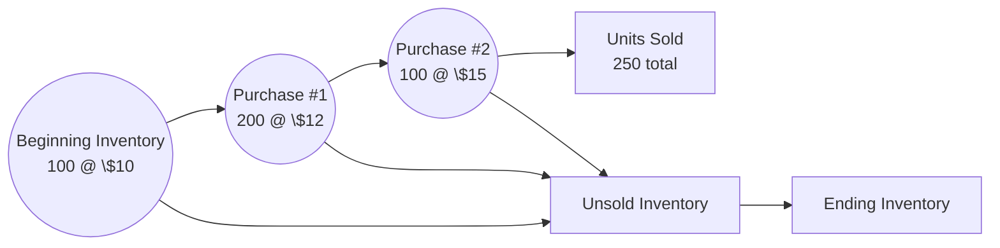

## 11.2 Costing Methods (FIFO, LIFO, Weighted-Average, Specific ID)

Inventory often represents a substantial asset on the balance sheet of many entities, and the method used for assigning costs to inventory and cost of goods sold (COGS) can significantly affect financial statement presentation. Selecting a proper costing method is not merely a matter of financial statement aesthetics—it impacts reported net income, taxes, and key ratios used by investors and creditors. In this section, we explore four principal inventory costing methods:

• First-In, First-Out (FIFO)  
• Last-In, First-Out (LIFO)  
• Weighted-Average (or Average Cost)  
• Specific Identification  

These methods differ in their underlying cost flow assumptions, which may or may not reflect the physical movement of goods. Understanding the strengths, limitations, and financial statement implications of each approach is crucial for CPA candidates, accounting professionals, and stakeholders who rely on accurate financial reporting.

## Understanding Inventory Costing Methods

In the United States, Generally Accepted Accounting Principles (GAAP) permit multiple inventory costing methods to acknowledge variability in operational processes. While some companies physically move their inventories using FIFO or LIFO concepts, many others experience random or mixed flows, rendering the cost flow assumption purely an accounting method of assigning costs.

The choice among FIFO, LIFO, Weighted-Average, or Specific Identification is ultimately driven by considerations including:  
• Industry conventions and regulatory guidelines.  
• Managerial objectives (e.g., tax minimization, income smoothing).  
• IFRS vs. U.S. GAAP limitations (noting that IFRS disallows LIFO).  

Regardless of which method is chosen, consistency in application is essential for comparability across periods. Any change in inventory costing method often requires retrospective or prospective treatment depending on the relevant accounting standards.

Below is a simple diagram illustrating how inventory ultimately flows into cost of goods sold (COGS) and ending inventory:

```mermaid
flowchart LR
    A[Raw Materials Purchases] --> B[Inventory On Hand]
    B --> C{Costing Method \n (FIFO, LIFO, \n Weighted-Average, Specific ID)}
    C --> D[Cost of Goods Sold \n (Income Statement)]
    C --> E[Ending Inventory \n (Balance Sheet)]
```

## First-In, First-Out (FIFO)

FIFO assumes that the first units purchased (i.e., the oldest inventory costs) are the first to be sold. While this may coincide with the natural physical flow of many goods—especially perishable or time-sensitive items—it is not strictly required that inventory physically moves in this sequence.

### Key Characteristics of FIFO

• COGS is based on the oldest (earliest) costs.  
• Ending inventory is valued at the more recent (newer) purchase costs.  
• During periods of rising prices, FIFO typically produces lower COGS and higher net income.  
• Ending inventory approximates current replacement cost, which can make the balance sheet appear more up-to-date.  

### Example of FIFO

Assume the following transactions (periodic inventory system):

• Beginning Inventory: 100 units @ $10 = $1,000  
• Purchase #1: 200 units @ $12 = $2,400  
• Purchase #2: 100 units @ $15 = $1,500  
• Units Sold: 250 units  

Units available for sale: 100 + 200 + 100 = 400 units  
Total cost of goods available: $1,000 + $2,400 + $1,500 = $4,900  

Under FIFO, the first 100 units sold would come from the $10 layer, and the next 150 units sold would come from the $12 layer (assuming a periodic system).  

COGS Calculation:  
• First 100 units → 100 × $10 = $1,000  
• Next 150 units → 150 × $12 = $1,800  
• Total COGS = $2,800  

Ending Inventory:  
• 50 units remain from the $12 layer → 50 × $12 = $600  
• 100 units from the $15 layer remain (not sold) → 100 × $15 = $1,500  
• Total Ending Inventory = $2,100  

### Impact on Financial Statements

Because newer, more expensive purchases remain in ending inventory, FIFO can inflate the recorded asset value during periods of rising prices, often leading to higher reported net income. This can produce higher reported profits but may also suggest higher taxes, given that taxable income is generally based on the same assumptions used for financial reporting under many jurisdictions (with exceptions for LIFO conformity rules in the U.S.).

## Last-In, First-Out (LIFO)

LIFO assumes that the last units acquired are the first to be sold, effectively matching the most recent costs against current revenues. While common in certain industries for tax advantages under U.S. GAAP, LIFO is not allowed under IFRS.

### Key Characteristics of LIFO

• COGS is based on the most recent (newest) purchase costs.  
• Ending inventory is valued at older (possibly outdated) costs.  
• During periods of rising prices, LIFO typically produces higher COGS and lower net income.  
• Lower net income generally yields lower taxes in inflationary environments, often cited as a primary motivation for adoption in the U.S.  

### Example of LIFO

Using the same information as the FIFO example:

• Beginning Inventory: 100 units @ $10  
• Purchase #1: 200 units @ $12  
• Purchase #2: 100 units @ $15  
• Units Sold: 250 units  

Under LIFO in a periodic system, for the 250 units sold, we assume the last purchases are sold first:  

COGS Calculation:  
• First 100 units (under LIFO’s assumption) come from the $15 layer → 100 × $15 = $1,500  
• Next 150 units come from the $12 layer → 150 × $12 = $1,800  
• Total COGS = $3,300  

Ending Inventory:  
• All 200 units from the $12 purchase are now partially used (50 remain unused here or in beginning inventory?). More precisely, we used 150 out of the 200 $12 units, leaving 50 units @ $12 = $600.  
• Beginning Inventory still remains at 100 units @ $10 = $1,000 (since we assumed the most recent layers were sold first).  
• Total Ending Inventory = $1,600  

### Impact on Financial Statements

Because COGS under LIFO is higher when prices are rising, net income shrinks, and taxes tend to be reduced. However, the balance sheet may show a lower (and potentially outdated) inventory valuation. Investors and creditors may have difficulty comparing statements when LIFO-layers (sometimes called “LIFO reserves”) become substantial. Additionally, managerial incentives, such as minimizing tax liability, often play a role in adopting LIFO.

## Weighted-Average Method

The Weighted-Average (or Average Cost) method, often used in manufacturing or commodity-based industries, blends all available costs in proportion to the number of units. 

### Key Characteristics of Weighted-Average

• Each unit of inventory is assigned the same average cost.  
• COGS and ending inventory reflect an averaged cost basis.  
• Fluctuations in purchase prices are smoothed, reducing volatility in reported income.  
• Can be implemented under either a periodic or perpetual system, but computations differ slightly (with perpetual average cost recalculated after each purchase).

### Weighted-Average Formula

Under a periodic system, the Weighted-Average unit cost at the end of the period typically is:


\text{Weighted Average Unit Cost} = \frac{\text{Total Cost of Goods Available for Sale}}{\text{Total Units Available for Sale}}


### Example of Weighted-Average (Periodic)

Using the same data:

• Beginning Inventory: 100 units @ $10 = $1,000  
• Purchase #1: 200 units @ $12 = $2,400  
• Purchase #2: 100 units @ $15 = $1,500  
• Units Sold: 250 units  

Total units available for sale = 400  
Total cost of goods available = $1,000 + $2,400 + $1,500 = $4,900  

Weighted-Average Unit Cost = $4,900 ÷ 400 = $12.25 per unit  

COGS for 250 units sold = 250 × $12.25 = $3,062.50  

Ending Inventory (150 units) = 150 × $12.25 = $1,837.50  

### Impact on Financial Statements

By averaging costs, the Weighted-Average method smooths fluctuations in COGS and ending inventory valuation. This smoothing effect can be beneficial for managerial planning and budgeting. During times of volatile price changes, Weighted-Average often lags behind the extremes seen in FIFO and LIFO.

## Specific Identification

Specific Identification assigns the actual invoice cost of each unit to that unit, making it possible to precisely match cost with the specific item sold. This is common when each item is unique, high-value, or otherwise easily tracked—such as vehicles with specific VIN numbers, fine jewelry, or pieces of art.

### Key Characteristics of Specific Identification

• Each unit cost is easily traceable by its unique identifier.  
• Best suited for industries dealing with custom or unique items.  
• Offers the truest matching of cost to the revenue from the specific item sold.  
• Can be cumbersome for homogeneous products with large volumes.  

### Example of Specific Identification

Imagine a car dealership with the following inventory:

• Car A – cost $20,000  
• Car B – cost $21,000  
• Car C – cost $22,500  

If Car B is sold for $28,000, the exact cost of $21,000 is recognized as COGS. The inventory left on the balance sheet reflects the actual costs of Car A ($20,000) and Car C ($22,500).

### Impact on Financial Statements

When feasible, Specific Identification provides the most precise matching of expenses and revenues. However, logistical complexity and administrative costs often limit its widespread use. Companies must ensure robust internal controls and reliable tracking methods to implement this system effectively.

## Comparing the Methods

All four methods conform to U.S. GAAP (except that IFRS disallows LIFO). Each produces different financial results, particularly when purchase costs change significantly between periods. Below is a summary of how each method often performs during inflationary periods, although the outcome reverses when prices are falling:

| Method Name          | COGS (Inflationary) | Ending Inventory (Inflationary) | Net Income (Inflationary) |
|----------------------|---------------------|---------------------------------|----------------------------|
| FIFO                 | Lower               | Higher                          | Higher                    |
| LIFO                 | Higher              | Lower                           | Lower                     |
| Weighted-Average     | Between FIFO & LIFO | Between FIFO & LIFO             | Moderate                  |
| Specific Identification | Varies—depends on the actual items sold | Varies—depends on which items remain | Results vary based on items sold |

**Important Note:** LIFO users often disclose a “LIFO reserve” in the notes to reconcile the difference between LIFO inventory amounts and FIFO or average-cost inventory amounts. This disclosure enables financial statement users to compare the firm’s inventory to other methods.

## Detailed Example Comparing All Methods

Consider a periodic inventory system with the following data:

• Beginning Inventory: 100 units @ $10 = $1,000  
• Purchase #1 (March): 200 units @ $12 = $2,400  
• Purchase #2 (November): 100 units @ $15 = $1,500  
• Total Units Available = 400  
• Units Sold = 250  

Here’s a fluid illustration of the cost flow:



### FIFO vs. LIFO vs. Weighted-Average: Numerical Outcome

| Method              | COGS       | Ending Inventory  | Notes                                     |
|---------------------|-----------:|-------------------:|-------------------------------------------|
| FIFO               | $2,800     | $2,100            | Lower COGS under rising prices            |
| LIFO               | $3,300     | $1,600            | Higher COGS under rising prices           |
| Weighted-Average   | $3,062.50  | $1,837.50         | Moderating effect between FIFO & LIFO     |

**Specific Identification** would depend on which exact units are sold. If all cheaper units happen to be sold, the cost would be lower; if more expensive units are sold, cost would rise.

## Physical Flow vs. Cost Flow

A vital distinction is that these costing methods do not require inventory to physically move in the same sequence as the cost assumptions. In practice, goods may flow in a FIFO-like manner, but the firm might still choose LIFO for financial advantages. The key point is to remain consistent in applying whichever method is chosen and to disclose it clearly in the financial statements.

## Financial Statement Presentation Considerations

• **Balance Sheet:** Ending inventory is one of the largest current assets. Using FIFO generally yields an inventory amount approximating current replacement cost (assuming rising prices). LIFO often yields an understated inventory balance compared to current market values.  
• **Income Statement:** FIFO typically shows lower COGS and higher net income in inflationary times, while LIFO generally shows higher COGS and lower net income. Weighted-Average provides a middle ground, and Specific Identification directly matches each item’s cost.  
• **Cash Flow Statement:** Although the statement of cash flows is not directly affected by the cost flow assumption (actual cash outflows remain the same), changes in net income and taxes indirectly influence operating cash flows.  
• **Disclosures:** GAAP mandates disclosure of the method used, any changes to the method, and certain calculations such as the LIFO reserve.

## Common Pitfalls and Best Practices

• **Inconsistent Application:** Switching from LIFO to FIFO (or vice versa) can result in confusion if not handled correctly. Always follow GAAP requirements for accounting changes and properly disclose.  
• **Complex Recordkeeping:** LIFO can create challenges in perpetual systems, as frequent cost layers must be tracked. Weighted-Average in perpetual systems may require re-computation of the average after each purchase. Specific Identification demands robust item tracking.  
• **Matching Principle vs. Economic Reality:** LIFO enthusiasts cite better matching of current costs with current revenues. FIFO advocates point to a more meaningful balance sheet valuation. Weighted-Average fosters stable earnings.  
• **Tax vs. Financial Reporting Motivations:** Under the “LIFO conformity rule,” companies using LIFO for tax purposes must also use LIFO for financial reporting. Choices may be driven by the desire to lower tax liabilities in inflationary environments.

## References and Further Exploration

• FASB Accounting Standards Codification (ASC) 330, “Inventory,” providing guidance on measurement and disclosures.  
• IAS 2, “Inventories,” for IFRS-based accounting (note that LIFO is not permitted).  
• AICPA resources on cost flow assumptions and audit considerations.  
• Managerial Accounting texts exploring inventory management and cost control systems.  

Below is a concise formula recap for Weighted-Average (periodic):


\text{Weighted Average Unit Cost} = \frac{\text{Total Cost of Goods Available for Sale}}{\text{Total Units Available for Sale}}


Companies should exercise professional judgment when selecting or changing inventory costing methods, ensure accurate recordkeeping, and provide transparent disclosures.

---

## Master Your Inventory Cost Flow Knowledge: Essential Quiz for FAR Success



### FIFO generally results in what type of ending inventory valuation when prices are consistently rising?

- [ ] Lower ending inventory than LIFO  
- [x] Higher ending inventory than LIFO  
- [ ] Exactly the same ending inventory as Weighted-Average  
- [ ] Comparable to Specific Identification only  

> **Explanation:** FIFO assigns the most recent costs to ending inventory, which are typically higher in an inflationary environment. As a result, ending inventory values tend to be higher than those under LIFO.

### In periods of rising prices, which of the following statements often applies to LIFO?

- [ ] It leads to higher net income compared to FIFO.  
- [ ] It yields the same net income as Weighted-Average.  
- [x] It results in lower net income compared to FIFO.  
- [ ] It cannot be used under GAAP at all.  

> **Explanation:** By matching recent, higher-cost inventory against sales, LIFO produces a higher COGS and thus lower net income compared to FIFO when prices are rising. LIFO is allowed under U.S. GAAP but prohibited under IFRS.

### When using the Weighted-Average method under a periodic system, the average unit cost is computed by:

- [x] Dividing the total cost of goods available by the total units available.  
- [ ] Dividing the total units sold by the total cost of goods available.  
- [ ] Adding all unit costs and then dividing by the number of purchases.  
- [ ] Taking the average of beginning inventory unit cost and ending inventory unit cost.  

> **Explanation:** Under the Weighted-Average (periodic) method, the total cost of goods available is divided by the total units available to find an average cost, which is then applied to both COGS and ending inventory.

### Which of the following is a defining characteristic of Specific Identification?

- [ ] It averages the cost of all units.  
- [ ] It always results in the lowest inventory value in periods of rising prices.  
- [ ] It matches the oldest cost to the units sold.  
- [x] It tracks each item’s unique cost directly to that item.  

> **Explanation:** In Specific Identification, each unit in inventory is tracked individually, enabling exact matching of cost to the specific item sold.

### What is a common motivation for businesses to adopt LIFO?

- [x] Tax savings in periods of inflation.  
- [ ] Gaining higher net income during inflation.  
- [x] Matching recent costs with current revenue.  
- [ ] Simplifying recordkeeping.  

> **Explanation:** LIFO’s main appeal lies in its ability to produce tax savings when costs are rising because it matches the latest (more expensive) cost layers against revenue, resulting in a higher COGS and lower taxable income. Additionally, it more closely matches current revenue with current costs.

### Under FIFO, which costs will be assigned to COGS when items are sold?

- [x] The oldest costs of inventory on hand.  
- [ ] The newest costs of inventory on hand.  
- [ ] The average of the oldest and newest costs.  
- [ ] Whichever costs produce the lowest net income.  

> **Explanation:** FIFO (“First In, First Out”) assumes the earliest (oldest) costs incurred are the first to be expensed to COGS when sales occur.

### Which of the following statements is correct regarding the LIFO conformity rule?

- [x] If a company uses LIFO for tax purposes, it must also use LIFO for financial reporting.  
- [ ] LIFO and FIFO must be used simultaneously for financial reporting.  
- [x] It only applies under IFRS.  
- [ ] It requires all subsidiaries to use the same costing method.  

> **Explanation:** Under U.S. tax laws, if an entity adopts LIFO for tax reporting, it must conform to that method for financial reporting as well. The IFRS reference is incorrect; IFRS does not permit LIFO.

### A company sells high-ticket custom furniture, each individually shipped and identified. Which method is most logical?

- [x] Specific Identification  
- [ ] FIFO  
- [ ] LIFO  
- [ ] Weighted-Average  

> **Explanation:** Each piece of custom furniture can be tracked separately; thus, Specific Identification provides the most accurate cost assignment for such unique inventory items.

### When prices are decreasing (deflationary environment), which statement is generally true?

- [x] LIFO results in higher net income than FIFO.  
- [ ] LIFO results in lower net income than FIFO.  
- [ ] FIFO and Weighted-Average produce the same ending inventory.  
- [ ] Specific Identification always aligns with physical flow.  

> **Explanation:** When prices are falling, LIFO’s most recent (lower) costs are transferred to COGS, leading to a lower COGS and higher net income compared to FIFO. The direction of the effect reverses from an inflationary setting.

### True or False: Under GAAP, inventory cost-flow assumptions must always match the actual physical flow of goods.

- [x] True  
- [ ] False  

> **Explanation:** Trick question—GAAP does not require the cost-flow assumption to match the physical flow. Companies regularly choose a cost-flow assumption different from the actual logistics of how their inventory moves. While it's not mandated, consistency and proper disclosure are critical.  



---

## For Additional Practice and Deeper Preparation

**[FAR CPA Hardest Mock Exams: In-Depth & Clear Explanations](https://www.udemy.com/course/far-cpa-mock-exams/?referralCode=F88050F8D5C76764F6BD)**  

**Financial Accounting and Reporting (FAR) CPA Mocks:** 6 Full (1,500 Qs), Harder Than Real! In-Depth & Clear. Crush With Confidence!  

- Tackle full-length mock exams designed to mirror real FAR questions.  
- Refine your exam-day strategies with detailed, step-by-step solutions for every scenario.  
- Explore in-depth rationales that reinforce higher-level concepts, giving you an edge on test day.  
- Boost confidence and minimize anxiety by mastering every corner of the FAR blueprint.  
- Perfect for those seeking exceptionally hard mocks and real-world readiness.  

_Disclaimer: This course is not endorsed by or affiliated with the AICPA, NASBA, or any official CPA Examination authority. All content is for educational and preparatory purposes only._
