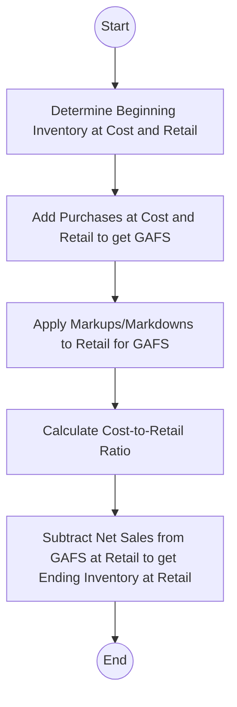

## 11.4 Retail Inventory Method, Gross Profit Method

Keeping track of inventory valuations accurately and efficiently can be a complex challenge. To address this, two popular techniques often used for interim financial reporting or quick estimates of ending inventory are the Retail Inventory Method (RIM) and the Gross Profit Method. Both methods serve practical purposes when physical counts of inventory are not easily obtainable or when an organization needs to rapidly estimate costs for financial or managerial reasons. In this section, we will delve into these methods in detail—explaining the theoretical foundations, demonstrating calculations through step-by-step examples, and providing guidance on how to apply them effectively. We will also discuss common pitfalls, best practices, and how both methods help accountants and financial managers make better decisions.

## Introduction to the Retail Inventory Method

The Retail Inventory Method is an indirect way of valuing ending inventory. This approach is especially prevalent in retail organizations where a consistent markup (or margin) is applied to inventory items. By maintaining detailed records of both cost and retail amounts, an entity can compute the cost-to-retail ratio, which in turn is used to estimate the cost of ending inventory without having to take a physical count.

### Why the Retail Inventory Method Matters
1. Interim Financial Reporting: Many retailers produce interim financial statements throughout the year. A physical inventory count can be time-consuming, disruptive, and expensive. The Retail Inventory Method enables quick and relatively reliable estimates.
2. Insurance Claim Calculations: In the event of a natural disaster or other damage, companies may need to calculate inventory losses. RIM provides an efficient way to arrive at a defensible estimate.
3. Perpetual Inventory Systems: Even if a company keeps perpetual records, the Retail Inventory Method can double-check the reasonableness of cost allocations and highlight potential discrepancies or shrinkage.

### Key Concepts in the Retail Inventory Method
• Cost: The amount the retailer pays for the goods (including freight, taxes, and other acquisition costs).  
• Retail Price: The sales price charged to customers before considering discounts or sales promotions.  
• Markups and Markdowns: Adjustments to the original retail selling price due to price changes. Markups increase the retail price, while markdowns decrease it.  
• Cost-to-Retail Ratio: The ratio (or percentage) used to convert the retail value of ending inventory back to the corresponding cost.

## Steps in the Retail Inventory Method

The Retail Inventory Method follows a logical sequence of steps. The ultimate objective is to derive the estimated cost of ending inventory using the cost-to-retail ratio.

1. **Calculate the Goods Available for Sale (GAFS) at Both Cost and Retail:**  
   Gather data on beginning inventory at both cost and retail. Add the net purchases during the period at both cost and retail. Adjust for freight-in (added to cost), any vendor allowances, and purchase returns for both cost and retail amounts.

2. **Incorporate Markups and Markdowns to Determine the Retail Value of Items:**  
   Add net markups to the retail value of GAFS if there were price increases. Subtract net markdowns to reflect any permanent reductions in price. These adjustments give a more precise measure of the total retail value before items are sold.

3. **Derive the Cost-to-Retail Ratio:**  
   This ratio is calculated by dividing the cost of GAFS by the retail value of GAFS (after considering markups and possibly excluding markdowns, depending on the type of RIM—conventional vs. cost method, etc.).  

   Using KaTeX:

   
     \text{Cost-to-Retail Ratio} = \frac{\text{Goods Available for Sale at Cost}}{\text{Goods Available for Sale at Retail} \pm \text{Adjustments}}
   

4. **Calculate the Estimated Ending Inventory at Retail:**  
   Subtract net sales (and related adjustments for employee discounts, sales returns, etc. if necessary) from the total retail value of GAFS. The result is the estimated ending inventory at retail.

5. **Convert the Estimated Ending Inventory at Retail to Cost:**  
   Multiply the estimated ending inventory at retail by the cost-to-retail ratio derived in step 3. This final multiplication yields the estimated cost of ending inventory, which can be reported on the financial statements.

Below is a simplified Mermaid.js flowchart illustrating the Retail Inventory Method process:

## Example: Calculating the Retail Inventory Method

Assume you manage a small retail clothing store. Your starting data for the year are as follows:

• Beginning Inventory:  
  – Cost: $60,000  
  – Retail: $100,000  

• Purchases Made During the Period:  
  – Cost: $150,000  
  – Retail: $250,000  

• Markups and Markdowns During the Period:  
  – Net Markups: $10,000  
  – Net Markdowns: $5,000  

• Net Sales (at Retail): $270,000  

### Step 1: Goods Available for Sale  
At Cost = Beginning Inventory ($60,000) + Purchases ($150,000) = $210,000  
At Retail = Beginning Inventory ($100,000) + Purchases ($250,000) = $350,000  

### Step 2: Adjust Retail for Markups and Markdowns  
Retail Value of GAFS (adjusted) = $350,000 + $10,000 (Net Markups) – $5,000 (Net Markdowns) = $355,000  

### Step 3: Cost-to-Retail Ratio  

  \text{Cost-to-Retail Ratio} = \frac{210,000}{355,000} \approx 59.15\%


### Step 4: Ending Inventory at Retail  
Subtract net sales at retail ($270,000) from the retail GAFS ($355,000), so:  
Ending Inventory at Retail = $355,000 – $270,000 = $85,000  

### Step 5: Estimated Ending Inventory at Cost  

  \text{Ending Inventory at Cost} = 85,000 \times 59.15\% \approx 50,277.50

Rounded and simplified, we might record this on our financial statements as $50,278, which is the estimated cost of ending inventory using the Retail Inventory Method.

## Types of Retail Inventory Method

While the process above outlines the general approach, different variations on the Retail Inventory Method exist to address specific accounting practices:

• **Conventional (Lower of Cost or Market) RIM:** Excludes markdowns from the denominator when calculating the cost-to-retail ratio, leading to a lower ratio and hence a more conservative inventory valuation.  
• **Cost Method RIM:** Includes markdowns in the denominator, providing an inventory valuation that more closely reflects average cost.  
• **Dollar-Value LIFO RIM:** Uses index layers to adjust for inflation or changes in price levels over time, combining RIM and LIFO complexities.  

Each approach aims to provide a reliable measure of ending inventory, but the choice of which to use often depends on a company’s accounting policies and regulatory requirements.

## Challenges and Best Practices for the Retail Inventory Method

1. **Accuracy of Markups and Markdowns:** Retailers must carefully track every price change, including temporary promotional markdowns vs. permanent markdowns. Accuracy directly impacts the cost-to-retail ratio.  
2. **Shrinkage and Spoilage:** The RIM assumes that any difference between recorded amounts and actual amounts is accounted for by net sales. If shrinkage (e.g., theft) is substantial and not captured in the records, the RIM’s estimate will be off.  
3. **Multiple Product Categories:** For complex stores that carry a wide variety of product lines, the RIM calculation might be performed separately by department or category. Weighted averages and multiple cost-to-retail ratios might be necessary.  
4. **Evolving Markup Rates:** In dynamic retail environments, markup rates can vary significantly across different product lines. Fine-tuning the RIM to consider these variations is key to accurate inventory estimates.

## The Gross Profit Method: Key Concepts

The Gross Profit Method is another popular technique used to estimate inventory, often during interim periods or in cases of significant inventory damage or theft where precise counts are challenging. This method relies on the relationship between cost of goods sold (COGS) and net sales. By applying a known gross profit (or gross margin) percentage to net sales, accountants can estimate COGS and derive ending inventory.

### Why the Gross Profit Method Matters
1. Speed and Simplicity: The Gross Profit Method is straightforward and often easier to explain to stakeholders than the Retail Inventory Method.  
2. Interim Reporting and Month-End Estimates: It is frequently used for monthly or quarterly statement preparation, reducing the need for ongoing physical counts.  
3. Insurance and Damage Estimations: In cases of catastrophic loss, the Gross Profit Method provides an estimate for insurance claims when inventory records may be incomplete.

### Key Assumptions
• The gross profit (or margin) percentage remains relatively stable within the period.  
• Historical gross profit rates can serve as reliable benchmarks.  
• Sales returns, allowances, and discounts are adequately tracked to adjust net sales.

## Steps in the Gross Profit Method

1. **Determine Net Sales:** Identify the actual net sales for the period, adjusting for sales returns, allowances, and discounts if needed.  
2. **Establish the Gross Profit Percentage:** Typically derived from prior-year data or the current year’s overarching sales pattern. Suppose your typical markup on cost is 40% or, equivalently, your gross profit rate on selling price is about 28.6%.  
3. **Estimate Cost of Goods Sold (COGS):** Multiply net sales by (1 – gross profit percentage based on selling price).  
4. **Calculate Estimated Ending Inventory:** Subtract the estimated COGS from the Goods Available for Sale (at cost).

Below is a simple schematic diagram to visualize how the Gross Profit Method estimates ending inventory:

## Example: Using the Gross Profit Method for Interim Reports

Imagine a home appliance retailer that wants to estimate its ending inventory at the end of a quarter without performing a physical count. The following data are available:

• Beginning Inventory (at cost): $400,000  
• Net Purchases: $600,000  
• Net Sales: $1,200,000  
• Gross Profit Percentage (on sales): 25%  

### Step 1: Goods Available for Sale (GAFS)  
GAFS = Beginning Inventory ($400,000) + Net Purchases ($600,000) = $1,000,000  

### Step 2: Estimate Cost of Goods Sold  
Since the gross profit rate is 25% of net sales, the cost of goods sold represents 75% of net sales. Thus:  

  \text{Estimated COGS} = 1,200,000 \times (1 - 0.25) = 1,200,000 \times 0.75 = 900,000


### Step 3: Calculate Estimated Ending Inventory  
Subtract estimated COGS from GAFS:  

  \text{Ending Inventory} = 1,000,000 - 900,000 = 100,000


Hence, the company would estimate $100,000 as the cost of its ending inventory for that quarter.

## Comparison Between Retail Inventory Method and Gross Profit Method

Although both methods estimate ending inventory, they differ in underlying assumptions and data requirements:

• **Data Requirements:** RIM needs detailed records of retail prices, markups, and markdowns. The Gross Profit Method primarily relies on a known historical margin or gross profit percentage and net sales.  
• **Situational Use:** RIM is widely used in retail sectors with consistent markup patterns, while the Gross Profit Method is simpler and suits interim estimates, especially when a stable gross profit percentage is available.  
• **Refinements:** RIM can produce a more refined estimate if accurate markup/markdown information is readily available. The Gross Profit Method can be less precise if gross profit ratios fluctuate significantly across products or over time.

## Potential Pitfalls in Applying the Gross Profit Method

1. **Changing Market Conditions:** A sudden alteration in product mix, promotions, or inflationary pressures can skew the historical gross profit rate.  
2. **Seasonality:** Some businesses experience significant seasonal variations. If the initial markup for winter merchandise differs greatly from that for summer merchandise, applying a single gross profit percentage could lead to misestimation.  
3. **Over-Reliance on Historical Data:** Basing your gross profit on past performance without verifying current trends in sales and costs can result in inaccuracies.

## IFRS Considerations and International Practices

Under International Financial Reporting Standards (IFRS), the principles for inventory valuation largely mirror those used in U.S. GAAP for determining cost (e.g., FIFO, Weighted Average). However, IFRS does not explicitly mandate or prohibit the Retail Inventory Method or the Gross Profit Method in determining cost for interim financial statements. Instead, IFRS places an emphasis on reliability and the reflection of economic reality.

When either RIM or the Gross Profit Method is used under IFRS, it must be disclosed as an estimation technique and consistently applied. Entities should ensure the methods produce results that closely approximate actual cost. Any significant deviations from actual cost should be described, along with the reasons for selecting that estimation method.

## Best Practices and Strategies for Effective Application

• **Maintain Detailed Records:** Both RIM and the Gross Profit Method depend heavily on accurate, up-to-date records of sales, markups, markdowns, and costs.  
• **Conduct Periodic Physical Counts:** Periodically verify the estimated inventory quantities by performing an actual count. Any discrepancies should be investigated and reconciled. This helps validate your estimation method on an ongoing basis.  
• **Adjust for Shrinkage:** Recognize that shoplifting, spoilage, or other shrinkage can undermine the assumptions of both methods. Proactively estimate and adjust for these factors if they are significant.  
• **Segment Your Inventory:** Consider calculating separate cost-to-retail ratios or gross profit ratios for different product lines or departments when item-level or category-level variations are substantial.  
• **Stay Current on Economic Trends:** Changes in inflation, fluctuations in commodity prices, or shifts in consumer demand can all affect your margins. Update your estimates regularly to reflect current operating conditions.

## Conclusion

The Retail Inventory Method and the Gross Profit Method each offer valuable pathways to estimating ending inventory when immediate physical counts are unfeasible. Retailers that maintain thorough, accurate records of cost and retail data often benefit from RIM, while businesses with stable historical margins may find the Gross Profit Method more straightforward for routine interim estimates. 

Despite the simplicity and convenience of these methods, both require careful attention to detail. Regular validations against physical counts, ongoing monitoring of profit margins, and timely recordkeeping play crucial roles in ensuring accuracy. Understanding the strengths and limitations of each method empowers accountants and financial managers to choose the most effective tool for their specific circumstances. As with all estimates, transparency in disclosures is key—both for internal decision-making and external reporting—to uphold trust and maintain compliance with U.S. GAAP or IFRS standards.

--------------------------------------------------------------------------------

## Retail Inventory Method and Gross Profit Method Practice Quiz



### Retailers use the Retail Inventory Method primarily to:
- [ ] Evaluate customer preferences for various product categories.
- [x] Estimate the cost of ending inventory using cost-to-retail ratios.
- [ ] Determine employee discount policies.
- [ ] Forecast next year’s sales volume.

> **Explanation:** The Retail Inventory Method is specifically used to estimate the cost of ending inventory by applying a cost-to-retail ratio to the retail value of available goods.

### What is the primary purpose of net markups in the Retail Inventory Method?
- [ ] They reduce the cost-to-retail ratio to a more conservative figure.
- [ ] They help determine the amount of shrinkage.
- [x] They adjust the retail value of goods available for sale before net sales are subtracted.
- [ ] They apply only when using the conventional RIM approach.

> **Explanation:** Net markups are added to the initial retail value of goods available for sale, reflecting higher selling prices before calculating the cost-to-retail ratio. This ensures a correct retail total for the period.

### Which of the following is a key difference between the Retail Inventory Method (RIM) and the Gross Profit Method (GPM)?
- [ ] RIM requires historical data while GPM uses only current data.
- [x] RIM relies on detailed retail records (markups/markdowns), whereas GPM heavily relies on a consistent gross profit percentage.
- [ ] RIM is more reliable for all types of inventories, while GPM is less reliable for retailers.
- [ ] GPM is only acceptable under IFRS and not under U.S. GAAP.

> **Explanation:** While both methods estimate ending inventory without a physical count, RIM needs extensive data on cost and retail values per item, while GPM depends primarily on stable gross profit margins.

### Under the Gross Profit Method, if your historical gross profit on sales is 30%, what portion of net sales represents your estimated COGS?
- [ ] 20%
- [ ] 30%
- [ ] 80%
- [x] 70%

> **Explanation:** If the gross profit rate is 30% on sales, then the cost of goods sold is 70% of sales. COGS = (1 – 30%) × Net Sales.

### Which data point is least critical when applying the Retail Inventory Method?
- [ ] Beginning inventory at cost and at retail.
- [x] Employee salary expenses.
- [ ] Markups and markdowns.
- [ ] Recorded net sales for the period.

> **Explanation:** Since the Retail Inventory Method focuses on inventory and sales data—including markups, markdowns, and net sales—employee salary expenses are not directly relevant in determining ending inventory cost.

### What is a common pitfall businesses must watch out for when using the Gross Profit Method?
- [ ] Double-counting markdowns in the cost-to-retail ratio.
- [x] Assuming the gross profit percentage remains constant, even if the sales mix changes.
- [ ] Excluding purchase discounts from inventory calculations.
- [ ] Mixing different merchandise categories.

> **Explanation:** A major shortcoming arises if changes in sales mix or changing market conditions alter the gross profit rate, but the method continues to assume a static historical rate.

### In a period of rising costs, which variant of the Retail Inventory Method generally yields the lowest ending inventory?
- [ ] Dollar-Value LIFO RIM
- [x] Conventional RIM (Lower of Cost or Market)
- [ ] Gross Profit Method
- [ ] Cost Method RIM

> **Explanation:** Conventional RIM typically excludes markdowns from the cost-to-retail ratio, leading to a lower ratio and thus a more conservative (often lower) inventory valuation compared to the cost method.

### The calculation of the cost-to-retail ratio under the conventional RIM does not typically include:
- [ ] Freight-in costs.
- [ ] Beginning inventory costs.
- [ ] Net purchases.
- [x] Net markdowns in the denominator.

> **Explanation:** Conventional RIM (also referred to as the lower-of-cost-or-market approach) typically excludes net markdowns from the denominator to be more conservative, resulting in a higher ratio of cost to retail.

### When calculating the cost of Goods Available for Sale at cost, what items are included?
- [x] Beginning inventory at cost plus net purchases at cost plus freight-in.
- [ ] Beginning inventory at cost plus net sales plus net markups.
- [ ] Ending inventory at cost minus gross margin plus net sales.
- [ ] All items that affect retail prices but not the cost portion.

> **Explanation:** Goods Available for Sale at cost typically include beginning inventory at cost, net purchases at cost, plus any freight-in or other relevant costs.

### True or False: IFRS explicitly prohibits the use of the Gross Profit Method in determining approximate inventory costs.
- [x] True
- [ ] False

> **Explanation:** Strictly speaking, IFRS doesn’t outright prohibit the Gross Profit Method; it does allow approximate methods for interim reporting as long as they are reliable and consistently applied. However, IFRS prefers actual costs and requires thorough disclosure if approximations like GPM are used. This question is a bit tricky—strict prohibition does not exist, but there is no direct endorsement either. The statement can be interpreted as “true” in the sense that IFRS generally expects actual valuation or close approximations with disclosure; it does not provide an explicit official “prohibition” or “permission” stance for GPM. The correct approach is to understand IFRS guidelines require the method to be supportable. Refer to your IFRS or regulatory text for official endorsement or disclaimers on approximations.



--------------------------------------------------------------------------------

## For Additional Practice and Deeper Preparation

**[FAR CPA Hardest Mock Exams: In-Depth & Clear Explanations](https://www.udemy.com/course/far-cpa-mock-exams/?referralCode=F88050F8D5C76764F6BD)**  

**Financial Accounting and Reporting (FAR) CPA Mocks:** 6 Full (1,500 Qs), Harder Than Real! In-Depth & Clear. Crush With Confidence!  

- Tackle full-length mock exams designed to mirror real FAR questions.  
- Refine your exam-day strategies with detailed, step-by-step solutions for every scenario.  
- Explore in-depth rationales that reinforce higher-level concepts, giving you an edge on test day.  
- Boost confidence and minimize anxiety by mastering every corner of the FAR blueprint.  
- Perfect for those seeking exceptionally hard mocks and real-world readiness.  

_Disclaimer: This course is not endorsed by or affiliated with the AICPA, NASBA, or any official CPA Examination authority. All content is for educational and preparatory purposes only._
