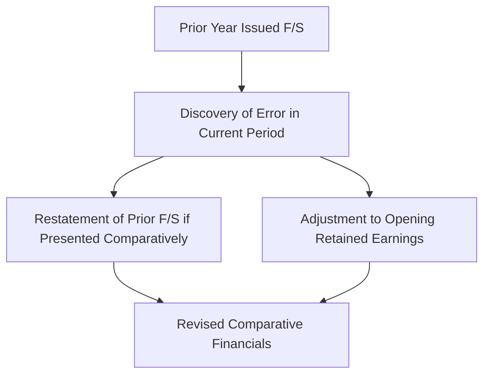

## 11.5 Inventory Errors and Adjustments

Effective inventory accounting is a foundational component of reliable financial statements. However, errors in inventory measurement and recording can frequently occur due to miscounting, incorrect costing, or timing errors. Understanding how to detect, correct, and adjust for these errors is essential when preparing financial statements in accordance with U.S. GAAP. This section will guide you through the conceptual and practical approaches to handling inventory errors, with a particular focus on the “2-year approach” that explains how errors self-correct over two reporting periods if left unadjusted. We will also illustrate how to handle prior-year corrections retrospectively.

Use this chapter in coordination with Chapter 3 (General Purpose Financial Reporting for For-Profit Entities) and Chapter 18 (Accounting Changes and Error Corrections) for a holistic understanding of how inventory misstatements affect the balance sheet, income statement, and retained earnings.

---

### Importance of Accurate Inventory Valuation

An accurate inventory valuation ensures proper measurement of Cost of Goods Sold (COGS) and a fair presentation of assets on the balance sheet. Since ending inventory for one period becomes beginning inventory for the next period, errors can have cascading effects on multiple reporting periods. As a result, timely detection and correction of errors is vital for preventing material misstatements of net income and equity.

Common scenarios that lead to inventory misstatements include:
• Counting errors (e.g., mismatch in physical counts).  
• Cutoff errors regarding shipment or receipt.  
• Costing method misapplication (e.g., using LIFO vs. FIFO incorrectly).  
• Misclassification of defective or obsolete goods in inventory.  

---

### Types of Inventory Errors

Before we delve into the 2-year approach, let’s understand the different types of inventory errors and how they manifest on the financial statements:

1. Overstatement of Ending Inventory  
   • If a company overstates its ending inventory in Year 1, COGS is understated, which inflates net income.  
   • In Year 2, when the overstated ending inventory from Year 1 becomes the beginning inventory, COGS is overstated, reducing net income in Year 2.  

2. Understatement of Ending Inventory  
   • If a company understates its ending inventory in Year 1, COGS is overstated, which decreases net income.  
   • In Year 2, the understated inventory from Year 1 becomes the beginning inventory, resulting in understated COGS and inflated net income in Year 2.  

3. Temporary (Self-Correcting) Effect vs. Cumulative Effect  
   • An inventory error in one period typically has a reversed effect in the subsequent period if the error is not corrected. This is why we often refer to a 2-year approach or the self-correcting nature of inventory errors.  
   • However, if the error is carried forward for multiple years without detection and correction, the balance sheet remains misstated until the point the error is discovered.

---

### The 2-Year Approach to Inventory Errors

To illustrate how inventory errors self-correct over two consecutive periods (Year 1 and Year 2), consider the following flow diagram in Mermaid.js:

```mermaid
flowchart LR
    A[Year 1 Beg. Inventory] --> B[Year 1 End. Inventory (Error)]
    B --> C[Year 2 Beg. Inventory]
    C --> D[Year 2 End. Inventory]
```

In this flow:
• The misstated ending inventory in Year 1 (B) becomes the misstated beginning inventory in Year 2 (C).  
• By Year 2 end (D), the overall cumulative effect on net income across both years is theoretically zero—but only if the same error does not carry forward beyond two years and is isolated to the single-year measurement. However, the balance sheet at the end of Year 1 was incorrect, and if the error goes unnoticed, any year-end analysis for Year 1 could be materially misstated.

#### Example of the 2-Year Approach

Assume the following facts for a company’s inventory:

• Actual ending inventory at December 31, Year 1, is $200,000, but it is mistakenly recorded as $220,000 (an overstatement of $20,000).  
• Cost of Goods Sold in Year 1 is consequently understated by $20,000, which means net income is overstated by $20,000.  
• In Year 2, the $220,000 figure becomes the beginning inventory when it should have been $200,000, creating an overstatement in Year 2’s beginning inventory. When the Year 2 ending inventory is accurately counted (let’s assume no further errors in Year 2), COGS in Year 2 will be overstated by $20,000, therefore reducing net income by $20,000.

Over the two years combined, the net effect on total net income is zero. However, the Year 1 balance sheet was overstated by $20,000 in ending inventory, and Year 1 net income was overstated by $20,000. This highlights the critical need for adjustments to ensure each period’s financial statements are individually correct.

---

### Carry-Forward Effects and Discovery Timing

When the same error is carried forward and continues into subsequent years without detection, cumulative misstatements may occur. If discovered in Year 3 or later, the correction entries may require prior-period adjustments that affect retained earnings and opening balances. The correction method depends on the materiality of the error and the guidance in ASC 250 (Accounting Changes and Error Corrections), which calls for retrospective restatement if the error is deemed material to prior statements.

---

### Correcting Inventory Errors

#### Current Year Detection

If an inventory error is detected within the same year before financial statements are issued:
• Adjust the inventory account to its correct balance.  
• Record any corresponding entry to COGS or another relevant account (such as a contra asset, if appropriate).  
• Ensure ending inventory is correctly stated on the balance sheet at year-end.  

#### Post-Year Detection: Prior-Period Adjustments

If an inventory error occurred in a previous year but is discovered only after the financial statements for that year have been issued, a prior-period adjustment is typically warranted. Under ASC 250 on error corrections:
1. Restate the prior-year financial statements that were misstated, if those prior statements are presented comparatively with the current financial statements.  
2. Adjust the beginning balance of retained earnings for the earliest period presented for the cumulative effect of the error, if the error impacted prior years that are not presented in the financial statements.  

##### Example of Prior-Year Correction

Let’s assume the same overstatement of $20,000 in ending inventory at December 31, Year 1, but the error was discovered late in Year 2, after the financial statements for Year 1 were issued. At December 31, Year 2, the overstatement is fully self-corrected in COGS. However, the previously reported net income for Year 1 remains misstated in the published financial statements.

The company should:
• Restate the En d-of-Year 1 financial statements, reducing inventory by $20,000 and increasing COGS by the same amount.  
• Decrease retained earnings as of January 1, Year 2, if Year 1’s financial statements are being presented for comparative purposes.  
• Disclose the nature of the error, its impact on the financial statements, and how it was corrected.

Under no circumstances should the correction appear in the current year’s income statement alone. Doing so could distort trends and hamper comparability among periods.

---

### Disclosure Requirements

When correcting inventory errors, companies should provide disclosures under ASC 250 outlining:
• The nature and cause of the error.  
• The periods affected by the error.  
• A quantification of the cumulative effect of the error on previously issued financial statements.  
• The method of correction and the effect on line items, including any changes to net income, retained earnings, and balance sheet accounts.

---

### Practical Illustration: 2-Year Approach Calculation

To help visualize an example with numbers, consider the following scenario:

• Company ABC uses a perpetual inventory system.  
• Actual Year 1 data:  
  – Sales: $600,000  
  – Beginning inventory (correct): $100,000  
  – Purchases: $300,000  
  – **Ending inventory (TRUE)**: $80,000  
  – **Ending inventory (RECORDED)**: $100,000 (i.e., overstated by $20,000)  

#### Year 1 Correct vs. Erroneous Income Statement

|                         | Correct Data  | With Overstated Inventory |
|-------------------------|--------------:|---------------------------:|
| Sales                   | $600,000      | $600,000                  |
| Beginning Inventory     | $100,000      | $100,000                  |
| Purchases              | $300,000      | $300,000                  |
| Cost of Goods Available | $400,000      | $400,000                  |
| Less: Ending Inventory  | ($80,000)     | **($100,000)**            |
| COGS                    | $320,000      | **$300,000**              |
| Gross Profit            | $280,000      | **$300,000**              |
| Net Income (Assume no other expenses) | $280,000 | **$300,000** |

• The error causes gross profit (and net income) to be overstated by $20,000 in Year 1.  

#### Year 2 Impact

Assume the Year 2 correct data is:
• Beginning inventory should be $80,000 but is recorded as $100,000 (overstated by $20,000) because of prior year’s error.  
• Actual Year 2 data (purchases, sales, ending inventory) are all correct. Let’s assume the correct Year 2 ending inventory is $90,000.  

With no further errors in Year 2, the beginning inventory is overstated, and the ending inventory is correct. This yields an overstated COGS of $20,000 and an understatement of net income by $20,000. Therefore, over two years combined, total net income remains accurate; however, each individual year’s statements were misstated if the error was left uncorrected.

---

### Common Pitfalls and Best Practices

• Failing to investigate reconciling items during a physical count or cycle count can perpetuate errors across multiple periods.  
• Relying solely on the self-correcting nature of inventory errors can lead to disruptions in trend analyses and can mislead stakeholders about performance in individual periods.  
• Properly documenting all adjustments with supporting evidence ensures audit trails remain intact.  
• Use dual controls (e.g., separation of duties in counting and costing) to mitigate the risk of inventory misstatements.  
• Regularly reconcile general ledger inventory balances with perpetual system records and conduct periodic physical counts.  

---

### Additional Real-World Scenarios

• **Obsolete Inventory Adjustments**: Overlooking outdated or damaged items can overstate inventory and understate COGS. Such errors will not self-correct if the items are continuously carried as assets without reevaluation.  
• **Estimation Errors**: Estimating shrinkage or lower-of-cost-or-market (LCM) adjustments inaccurately in one period could either under- or overstate inventory.  
• **Multiple Year-Carried Forward**: A small error that persists for multiple years—such as repeatedly overstating ending inventory—could have a compounding effect, necessitating a multi-year restatement once discovered.  

---

### Helpful Mermaid Diagram of Prior-Period Corrections

Below is a broad overview of how prior-period adjustments flow through comparative financial statements:



1. Identify the previously issued financial statements.  
2. Upon error discovery, adjust or restate as necessary.  
3. Adjust the opening retained earnings if the error impacts a period not presented or previously closed.  
4. Provide comprehensive disclosures.  
5. Present revised comparative financial statements.  

---

### Intersection with Other Topics

• **Accounting Changes (Chapter 18)**: The process of correcting an error is distinguished from a change in accounting principle. An error correction is retrospective unless impracticable, while an accounting principle change also follows ASC 250 but has distinct guidance, especially if mandated by new accounting standards.  
• **Financial Statement Presentation (Chapter 3)**: Misstated inventories lead to inaccurate COGS and, in turn, affect the income statement presentation of gross profit. The ending inventory figure on the balance sheet requires prompt correction to accurately reflect assets and retained earnings.  

---

### References and Further Reading

1. FASB Accounting Standards Codification (ASC) 250, “Accounting Changes and Error Corrections.”  
2. FASB ASC 330, “Inventory.”  
3. AICPA Audit and Accounting Guides – For guidance on audit procedures related to inventory.  
4. Online Courses and Tutorials on Inventory Reconciliation and Internal Controls.  

Consider cross-referencing these authoritative sources and professional guides for a comprehensive understanding of how to identify and correct common inventory-related issues.

---

## Quiz on Inventory Errors and Adjustments



### When an ending inventory error in Year 1 is not corrected, how does it typically affect Year 2’s financial statements?

- [ ] It results in an identical statement of net income for Year 2.  
- [ ] It has no impact on Year 2’s beginning inventory.  
- [x] It causes an opposite effect on COGS and net income in Year 2.  
- [ ] It permanently distorts net income in Year 1 and Year 2.  

> **Explanation:** An overstatement (or understatement) of ending inventory in Year 1 usually leads to an understatement (or overstatement) of COGS in Year 1. In the subsequent year, that misstated figure becomes the beginning inventory, causing the opposite effect in Year 2.

### What is the primary reason an inventory error in one year often self-corrects by the end of the next year?

- [x] The ending inventory of one year becomes the beginning inventory of the next, reversing the effect on COGS.  
- [ ] The FASB mandates a forced correction after 12 months.  
- [ ] GAAP requires not carrying over inventory balances.  
- [ ] None of the above.  

> **Explanation:** The cyclical nature of beginning and ending inventory means that an error in one year flips the COGS the following year, resulting in a zero cumulative effect over two years if no other factors change.

### If an inventory error is discovered after the issuance of the prior-year financial statements, how should it typically be treated?

- [ ] Show the correction only in the current year’s income statement.  
- [x] Restate the prior year’s financial statements and adjust retained earnings appropriately.  
- [ ] Correct it prospectively going forward only.  
- [ ] Do not disclose the error if it is immaterial.  

> **Explanation:** Under ASC 250, if an error from a prior year is discovered after issuance, the company generally must restate those previously issued financials (if they are presented comparatively) and adjust the opening retained earnings of the earliest period presented.

### In which section of the codification would you find guidance on Inventory?

- [x] ASC 330  
- [ ] ASC 250  
- [ ] ASC 840  
- [ ] ASC 230  

> **Explanation:** ASC 330 specifically addresses the accounting for inventory. Although ASC 250 (Accounting Changes and Error Corrections) governs error corrections, ASC 330 deals with the initial recognition and measurement of inventory.

### Which of the following best describes the effect of overstating ending inventory on Year 1’s financial statements?

- [ ] Decreased Year 1 net income  
- [x] Decreased Cost of Goods Sold and increased net income  
- [ ] Increased Cost of Goods Sold and decreased net income  
- [x] Overstated assets on the balance sheet  

> **Explanation:** Overstating ending inventory understates COGS, which in turn overstates net income. Additionally, assets are overstated because inventory is reported too high on the balance sheet.

### When is an inventory error least likely to self-correct?

- [x] When the error pertains to obsolete or damaged goods that remain in inventory for multiple periods.  
- [ ] When the error is discovered during the year-end audit.  
- [ ] When the error is related to a simple miscount.  
- [ ] When the error pertains to the understatement of inventory by a small amount.  

> **Explanation:** Overstating goods that are obsolete or never sold can persist on the balance sheet, preventing the normal self-correction mechanism that happens when inventory is sold or scrapped.

### Which of the following is a best practice to detect or prevent inventory errors?

- [x] Performing periodic physical counts and reconciling with the perpetual records  
- [ ] Relying entirely on automated systems  
- [x] Ensuring proper segregation of duties in inventory counting  
- [ ] Issuing retroactive purchase orders  

> **Explanation:** Regular inventory counts and segregation of duties (e.g., people responsible for recording inventory are not the same people counting inventory) are essential to mitigate errors.

### An overstatement of $10,000 in ending inventory in Year 1 is discovered in Year 2, but no comparative statements are being presented. Which is the correct approach?

- [x] Debit retained earnings and credit inventory in Year 2’s opening balances.  
- [ ] Credit current year COGS for $10,000.  
- [ ] Do nothing, as it will self-correct.  
- [ ] Wait until Year 3 to adjust if the error persists.  

> **Explanation:** If prior-year statements are not presented, the correction should be made by adjusting the opening retained earnings and inventory balances in the period the error is discovered.

### Which GAAP principle is most directly compromised by an inventory error that remains uncorrected?

- [x] Reliability  
- [ ] Economic entity assumption  
- [ ] Going concern  
- [ ] Cost effectiveness  

> **Explanation:** Reliability and faithful representation are key GAAP principles that require accurate data. An uncorrected inventory error compromises the reliability of financial statements.

### True or False: A minor inventory error that is discovered and corrected within the same reporting period should not require retrospective adjustments.

- [x] True  
- [ ] False  

> **Explanation:** If the error is detected and corrected before the end of the reporting period or financial statement issuance, no prior-period adjustments are necessary, as the error never made it into issued statements.



---

## For Additional Practice and Deeper Preparation

**[FAR CPA Hardest Mock Exams: In-Depth & Clear Explanations](https://www.udemy.com/course/far-cpa-mock-exams/?referralCode=F88050F8D5C76764F6BD)**  

**Financial Accounting and Reporting (FAR) CPA Mocks:** 6 Full (1,500 Qs), Harder Than Real! In-Depth & Clear. Crush With Confidence!  

- Tackle full-length mock exams designed to mirror real FAR questions.  
- Refine your exam-day strategies with detailed, step-by-step solutions for every scenario.  
- Explore in-depth rationales that reinforce higher-level concepts, giving you an edge on test day.  
- Boost confidence and minimize anxiety by mastering every corner of the FAR blueprint.  
- Perfect for those seeking exceptionally hard mocks and real-world readiness.  

_Disclaimer: This course is not endorsed by or affiliated with the AICPA, NASBA, or any official CPA Examination authority. All content is for educational and preparatory purposes only._
