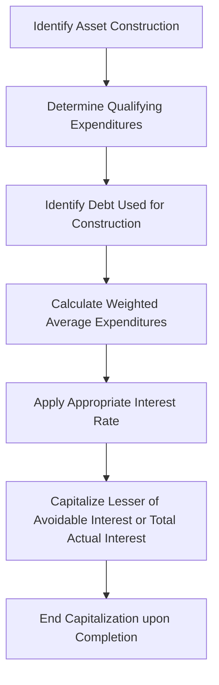

## 12.1 Acquisition and Capitalization (Self-Constructed Assets)

Acquisition and capitalization of self-constructed assets is a core concept within Property, Plant, and Equipment (PP&E). From costing methodology to the proper recording of interest, these considerations play a crucial role not only in financial statement presentation but also in operational decision-making and regulatory compliance. This section delves into the intricacies of direct and indirect cost allocation, discusses the rules for interest capitalization, and provides clear guidance on differentiating capital improvements from ordinary repairs and maintenance. By the end of this chapter, you should have a solid understanding of how to accurately value self-constructed PP&E and comply with U.S. GAAP regulations.

------------------------------------------------------------------------------------------------
  
### Overview of Self-Constructed Assets

In many industries, companies opt to build large operating assets themselves—whether it be for strategic control, potential cost savings, or gained expertise. Such assets might include custom machinery, power-generating equipment, specialized buildings, or proprietary assembly lines. While purchased PP&E is typically recorded at the purchase price plus related costs, self-constructed assets involve more nuanced allocation of various expenses over the asset’s construction period.

Key steps in recognizing self-constructed assets include:
• Defining which costs should be capitalized (direct vs. indirect).  
• Applying interest capitalization in accordance with GAAP when borrowing costs are incurred during construction.  
• Separating maintenance or repair costs from capital improvements.  

-------------------------------------------------------------------
  
### Direct vs. Indirect Costs

#### Direct Costs

Direct costs of self-constructed assets are those that can be traced specifically and exclusively to the construction of the asset. Common examples include:
• Materials used in construction (e.g., lumber, steel, concrete).  
• Direct labor (wages of workers directly involved in building the asset).  
• Subcontractor fees related to the asset.  
• Specific design or engineering costs incurred for the particular project.  

U.S. GAAP requires that these direct costs be included in the asset’s total recorded (capitalized) cost. Since these expenses are integral to bringing the asset to the intended condition and location for its use, they form part of the “constructed cost” basis.

#### Indirect Costs

Indirect costs, also known as overhead costs, are those not directly traceable to a single product or project, but are instead shared across multiple activities or organizational units. Examples often include:
• Depreciation of equipment used in construction.  
• Supervisory salaries, if supervisors work on multiple projects.  
• Utilities (electricity, water) for overall production processes.  
• Repairs and maintenance of machinery used in various construction projects.  

The FASB allows for a portion of indirect costs reasonably related to construction activities to be capitalized as part of the self-constructed asset, under the rationale that they contribute to acquiring or building it. However, the standard does not permit capitalizing speculative overhead costs or administrative overhead that would exist regardless of construction (e.g., executive salaries, marketing expenses). When in doubt, management should apply a systematic and rational approach to allocating overhead.

One common approach is activity-based costing (ABC), which uses measurable drivers (like machine hours or labor hours) to allocate shared costs. The key objective is to capture those overhead costs that would not have been incurred had the asset not been built.

------------------------------------------------------------------------------------------------

### Interest Capitalization

When constructing an asset, companies may finance their activities through borrowing. In such cases, U.S. GAAP prescribes interest capitalization on qualified expenditures during the asset’s construction period. The rationale is that interest is a necessary financing cost of getting the asset ready for its intended use.

#### Basic Overview

• Only interest on borrowings directly contributing to the asset’s development (i.e., construction loans) or a portion of general debt (if the company does not have a specific construction loan) is capitalizable.  
• The interest capitalization period typically begins when expenditures are incurred, activities necessary to get the asset ready for use are in progress, and debt is outstanding.  
• The capitalization period ends when the asset is substantially complete and ready for its intended use, or when construction activities are otherwise suspended for an extended period.  

#### Step-by-Step Interest Capitalization

Below is a simplified representation of the interest capitalization process:

1. Identify asset construction: Management first determines that a project meets the criteria for capitalization and that construction is in progress.  
2. Determine qualifying expenditures: Track actual cash outflows or accounts payable incurred for materials, labor, and overhead that specifically relate to the construction.  
3. Identify debt used: If there is a specific construction-related loan, apply that interest rate to relevant expenditures. Otherwise, use the weighted-average interest rate on the entity’s general debt.  
4. Calculate weighted-average expenditures (WAE): The weighted-average approach assigns a fraction of the year during which each expenditure was incurred and multiplies it by the incurred amount.  
5. Apply the appropriate interest rate: Use the rate from the specific borrowing if available. If not, use a weighted-average rate on general borrowings.  
6. Capitalize the lesser of avoidable interest or total actual interest: “Avoidable interest” means the amount that theoretically could have been avoided if the expenditure was not made.  
7. End capitalization when the asset is “substantially complete.”  

#### Example: Interest Capitalization

Suppose Bright Builders takes out a dedicated construction loan of $1,000,000 at a 6% annual interest rate. The company spends evenly on construction ($500,000 in the first half of the year, $500,000 in the second half). The asset becomes ready for use at year-end (i.e., the entire year was used for construction).

Weighted-average expenditures (WAE) = (500,000 × 6/12) + (500,000 × 3/12) if the second $500,000 was spent mid-year.  
= (500,000 × 0.5) + (500,000 × 0.25)  
= 250,000 + 125,000 = 375,000  

Interest to capitalize = WAE × Interest rate = 375,000 × 6% = $22,500  

If the total interest paid on the construction loan is $60,000 (because the loan was outstanding all year), the company capitalizes only $22,500 (the avoidable interest portion) to the asset. The remainder of the interest is expensed as interest expense.

------------------------------------------------------------------------------------------------

### Repairs vs. Capital Improvements

A critical accounting determination is deciding whether subsequent expenditures on PP&E qualify for capitalization or must be expensed immediately. Generally, routine repairs and maintenance should be expensed, while improvements that significantly enhance the asset’s functionality, extend its life, or increase its service capacity may be capitalized.

• Repairs and Maintenance (Expensed): These are expenditures that keep an asset functioning as expected, without significantly extending its life or increasing its productive capacity. Examples include routine oil changes in machinery, part replacements, cleaning, or painting that maintains the original operating condition.  
• Capital Improvements (Capitalized): These are expenditures that upgrade an asset’s usefulness or substantially extend its remaining life. Such improvements might include major overhauls, additions, expansions, or retrofittings that allow the asset to either function better or longer than originally anticipated.  

#### Indicators of a Capital Improvement
• The expenditure modifies the asset so that it performs more efficiently, increases capacity, lowers future operating costs, or lengthens its useful life.  
• The expenditure is required to address a defect that significantly shortens the asset’s life or disrupts operations if left unaddressed.  
• The costs are material enough that they constitute an enhancement rather than a routine fix.

#### Example: Distinguishing Repairs from Improvements

Scenario 1: A manufacturing company conducts a regular maintenance routine on its assembly line every six months, replacing worn belts and making minor adjustments to keep the line running smoothly. This is typically recognized as a repair and recorded as “Repairs and Maintenance Expense.”

Scenario 2: The same company invests in an updated robotic arm for its assembly line that operates more efficiently, reduces labor costs, and extends the line’s usable life by five years. This is considered a capital improvement. The cost is added to the asset’s book value and depreciated over time.

------------------------------------------------------------------------------------------------

### Self-Constructed Assets: Comprehensive Example

Consider a construction company, Tigris Builders, constructing a specialized piece of equipment for its own use. The timeline and cost structure are as follows:

• January 1: The project begins, with an initial purchase of $100,000 in raw materials.  
• March 1: Additional purchase of $50,000 in materials.  
• May 1: Payment of $120,000 in subcontractor fees.  
• June 30: Incurred $40,000 in direct labor costs.  
• Ongoing: The company uses its existing machinery in the building process, incurring overhead costs and depreciation.  

Tigris Builders financed part of the construction with a $200,000 loan at 5% interest. The rest of its financing is from general corporate borrowings at a weighted-average rate of 4%. The asset is completed on September 30.

Steps to Record:
1. **Direct Materials and Labor**: Each purchase related to materials is capitalized as incurred. Similarly, direct labor is assigned to the asset cost.  
2. **Indirect Costs**: A portion of the overhead (including the depreciation of machinery used and supervisory salaries specifically attributed to building the equipment) is allocated to the asset, based on documented usage logs.  
3. **Interest Capitalization**:  
   - Identify the portion of expenditures up to $200,000 that can be directly traced to the 5% loan.  
   - For amounts over $200,000, apply the 4% weighted-average rate.  
   - Compute the weighted-average expenditures and multiply them by the respective borrowing rates.  
   - Capitalize the result, not to exceed total actual interest incurred.  
4. **Completion**: As of September 30, once the equipment is ready for use, Tigris Builders stops capitalizing interest and begins depreciating the total capitalized cost starting in October.  

------------------------------------------------------------------------------------------------

### Best Practices and Common Pitfalls

• **Documenting Allocation of Indirect Costs**: One frequent challenge is justifying which overhead costs belong in the capitalized cost pool. Strictly follow a systematic allocation method to ensure credibility and compliance.  
• **Interest Suspensions**: If construction stalls or is suspended indefinitely, interest capitalization must cease until active development resumes.  
• **Inadequate Tracking of Construction Phases**: Managing the timing of expenditures is crucial for accurately computing weighted-average expenditures for interest capitalization. A robust project management system or cost tracking mechanism can be indispensable.  
• **Misclassification between Repairs and Improvements**: Overzealous capitalization of maintenance or repairs can inflate asset values and understate expenses. Conversely, failing to capitalize legitimate improvements understates asset value and overstates expenses.  
• **Regulatory and Internal Policy Compliance**: Companies should ensure that their capitalization policies are consistent with GAAP (and IFRS, if relevant) and documented in their accounting manuals. Periodic audits help confirm consistent application of these policies.  

------------------------------------------------------------------------------------------------

### Practical Diagrams and Tables

#### Example Table of Capitalized vs. Expensed Costs

| Type of Cost                | Capitalize? (Yes/No) | Reasoning                                                   |
|-----------------------------|-----------------------|-------------------------------------------------------------|
| Direct materials            | Yes                   | Integral to asset construction                             |
| Direct labor                | Yes                   | Labor costs directly attributable to the project           |
| Supervisory salaries        | Partially (allocated) | Overhead allocation for project-based activity             |
| Marketing department costs  | No                    | Not directly related to project construction               |
| Maintenance during build    | Partially or No       | Only capitalizable if it extends the asset’s future benefits|
| Interest on construction loan| Yes                   | Capitalize avoidable interest during construction period   |
| Repairs after asset in use  | No                    | Typically expensed unless it extends the asset’s useful life|

------------------------------------------------------------------------------------------------

### IFRS vs. U.S. GAAP: Brief Comparison

While this chapter focuses on U.S. GAAP, IFRS treatment of self-constructed assets is largely similar, requiring the capitalization of direct costs and systematically allocated overhead. IFRS also allows interest capitalization but requires slightly different guidance on the portion of borrowing to be allocated. However, for CPA exam preparation (particularly FAR section), emphasize the specific rules under ASC 360 (Property, Plant, and Equipment) and ASC 835 (Interest).

------------------------------------------------------------------------------------------------

### References for Further Study

• FASB Accounting Standards Codification (ASC) 360, “Property, Plant, and Equipment.”  
• FASB ASC 835‑20, “Capitalization of Interest.”  
• AICPA “Audit and Accounting Guide: Construction Contractors” for detailed construction overhead allocation.  
• “Intermediate Accounting” by Kieso, Weygandt, and Warfield, for comprehensive coverage of PP&E.  

------------------------------------------------------------------------------------------------

### Conclusion

Properly accounting for self-constructed assets requires diligence in capturing direct and indirect costs, methodical application of interest capitalization rules, and careful distinction between routine repairs and capital improvements. By applying robust project tracking methods, adhering to authoritative guidance, and documenting methodologies thoroughly, organizations can produce accurate financial statements and avoid potential misstatements. As you continue exploring other sections—such as depreciation methods (Section 12.2) and subsequent expenditures—the knowledge gained here will reinforce your overall understanding of PP&E and ensure compliance with U.S. GAAP standards.

------------------------------------------------------------------------------------------------

## Master the Essentials of Acquisition and Capitalization: A Comprehensive Quiz



### Which of the following would generally be considered a direct cost for a self-constructed asset?

- [ ] Executive salaries of the company’s corporate office
- [x] Direct labor used in constructing the asset
- [ ] General marketing expenses
- [ ] Office rent for headquarters

> **Explanation:** Direct labor specifically attributed to constructing the asset is capitalized. Executive salaries and general marketing expenses are not directly traceable to construction.

### Which costs can be capitalized in relation to overhead for a self-constructed asset?

- [ ] All corporate overhead costs
- [x] Only those indirect costs reasonably allocable to the construction
- [ ] Only depreciation of old equipment
- [ ] All manufacturing overhead costs, irrespective of linkage

> **Explanation:** GAAP permits capitalization of indirect costs that are fairly attributed to construction activity using a systematic allocation method.

### When does the period of interest capitalization generally end for an asset under construction?

- [ ] At inception of the construction loan
- [x] When the asset is substantially complete and ready for its intended use
- [ ] After one year, regardless of construction completion
- [ ] Only after the construction loan is fully paid

> **Explanation:** The interest capitalization period ends when the asset is substantially complete and ready for the intended use, per ASC 835.

### In interest capitalization, if the calculated “avoidable interest” is less than total actual interest paid, what amount should be capitalized?

- [ ] The entire amount of actual interest paid
- [ ] The difference between avoidable and actual interest
- [x] Only the avoidable interest amount
- [ ] No interest is capitalized if avoidable interest is less

> **Explanation:** Under U.S. GAAP, the company capitalizes the lesser of actual interest incurred or the computed “avoidable interest.”

### Which of the following scenarios best illustrates a capital improvement rather than a repair?

- [x] Installing a costly new production system that increases capacity
- [ ] Replacing a broken component on an assembly line
- [x] Retrofitting an asset to extend its remaining life by several years
- [ ] Performing routine quick fixes on the asset

> **Explanation:** Capital improvements extend life and/or enhance capacity (e.g., new production systems or major overhauls). Minor part replacements or routine fixes are expensed.

### Which of the following statements regarding repairs vs. improvements is correct?

- [x] Ordinary repairs that do not increase efficiency or useful life are expensed.
- [ ] Ordinary repairs should be capitalized as part of the asset’s new cost.
- [ ] All upgrades to existing machinery are expensed.
- [ ] Required legal fees always qualify as a capital improvement.

> **Explanation:** Expenditures that do not significantly extend useful life or improve efficiency are recognized as expenses.

### What is the principal reason the FASB allows interest capitalization for self-constructed assets?

- [x] Because interest is a cost needed to bring the asset to a working condition
- [ ] Because interest is always fully deductible for tax purposes
- [x] Because interest cost must always be expensed under IFRS
- [ ] Because it is easier for financial statement users to disregard financed projects

> **Explanation:** GAAP views interest as a necessary cost to “bring the asset to condition and location for its intended use,” thus capitalizing it during construction.

### Which best describes the appropriate treatment of indefinite construction delay on interest capitalization?

- [ ] Capitalization should continue until the delay is resolved
- [ ] Half the interest should be capitalized
- [x] Capitalization should be suspended until construction restarts
- [ ] All interest is immediately written off

> **Explanation:** GAAP requires ceasing interest capitalization when construction is suspended for a substantial period.

### Which factor primarily influences the portion of overhead costs that can be capitalized for a self-constructed asset?

- [x] A systematic and rational allocation of overhead that ties specifically to the project
- [ ] The CEO’s determination of overhead value
- [ ] The total company budget for overhead
- [ ] The ratio of total assets to liabilities

> **Explanation:** Overhead must be allocated to the construction using a systematic and rational method that reasonably reflects the overhead resources consumed by the project.

### True or False: A major reconstruction project that significantly extends an asset’s useful life should be capitalized.

- [x] True
- [ ] False

> **Explanation:** Capitalizing major reconstruction or overhauls is required when the expenditure increases useful life or improves efficiency beyond the initial estimate.



---

## For Additional Practice and Deeper Preparation

**[FAR CPA Hardest Mock Exams: In-Depth & Clear Explanations](https://www.udemy.com/course/far-cpa-mock-exams/?referralCode=F88050F8D5C76764F6BD)**  

**Financial Accounting and Reporting (FAR) CPA Mocks:** 6 Full (1,500 Qs), Harder Than Real! In-Depth & Clear. Crush With Confidence! 

- Tackle full-length mock exams designed to mirror real FAR questions.  
- Refine your exam-day strategies with detailed, step-by-step solutions for every scenario.  
- Explore in-depth rationales that reinforce higher-level concepts, giving you an edge on test day.  
- Boost confidence and minimize anxiety by mastering every corner of the FAR blueprint.  
- Perfect for those seeking exceptionally hard mocks and real-world readiness.  

_Disclaimer: This course is not endorsed by or affiliated with the AICPA, NASBA, or any official CPA Examination authority. All content is for educational and preparatory purposes only._
