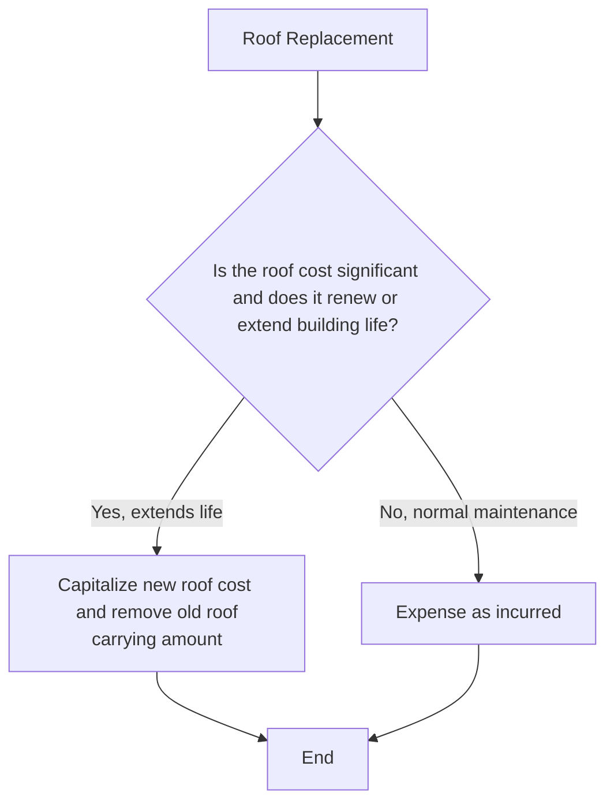

## 12.3 Subsequent Expenditures (Repairs, Betterments, Replacements)

Subsequent expenditures on property, plant, and equipment (PP&E) play a critical role in a company’s financial reporting. Deciding whether an expenditure should be capitalized or expensed can significantly impact financial statements and, by extension, key performance indicators (KPIs) such as return on assets (ROA) or earnings per share (EPS). In this section, we will explore the criteria, best practices, and common pitfalls regarding subsequent expenditures, including repairs, betterments, and replacements.

This discussion builds upon earlier topics in Chapter 12 by focusing on how to treat costs incurred after an asset has been placed in service. We will address the relevant U.S. GAAP guidance, provide practical examples, show illustrative diagrams, and offer tips on handling typical issues—like roof replacements or major overhauls. We will also touch on IFRS comparisons to highlight differences in international practice.

-------------------------------------------------------------------------------

### Purpose and Significance of Subsequent Expenditures

Once an entity purchases a long-lived asset or constructs it in-house, they typically record it at historical cost (including all expenditures necessary to bring the asset to the condition and location intended for use). However, costs don’t stop there. Over an asset’s useful life, a company may incur additional expenses:

• Ordinary repairs and maintenance (e.g., painting, light bulb replacements)  
• Major repairs or overhauls (e.g., replacing a building’s roof, engine overhaul on a plane)  
• Replacements of significant components (e.g., upgrading a hydraulic system of a crane)  
• Improvements or betterments (e.g., expanding a warehouse to increase capacity)

The key question is whether these expenditures should be immediately expensed (thus reducing current period income) or capitalized (thus depreciated over future periods).

-------------------------------------------------------------------------------

### Distinguishing Expense vs. Capitalization

Under U.S. GAAP (ASC 360), subsequent expenditures may be capitalized if:  
1. They prolong the asset’s useful life,  
2. Increase its productivity,  
3. Enhance the asset’s earnings potential, or  
4. Significantly improve the quality of the asset’s output.

In simple terms, if the expenditure either (a) extends the asset’s useful life beyond the original estimate or (b) adds to the value or functionality of the asset, it may qualify for capitalization. Otherwise, the expenditure is treated as a period expense.

#### Common Terminology

• Ordinary Repairs and Maintenance: These costs typically restore the asset to its original or normal operating capacity. They do not increase life, capacity, or productivity beyond the original estimates.  
• Betterments or Improvements: These include structural or technical modifications that enhance an asset’s performance or capacity.  
• Replacements or Renewals: These occur when an old component is replaced with a new one (e.g., a building roof). If the new component significantly extends the asset’s useful life or improves its functionality, those costs are capitalized.

Below is a simplified decision diagram illustrating when to capitalize versus expense.

```mermaid
flowchart TB
    A[Start: Subsequent Expenditure] --> B{Does it enhance: <br>1) Useful Life? <br>2) Productivity or Capacity?}
    B -- No --> C[Expense in current period]
    B -- Yes --> D[Capitalize and adjust depreciation]
    C --> E[End]
    D --> E[End]
```

In this flowchart, the expenditure is capitalized only if it meets specific criteria (i.e., extending life, improving capacity, improving quality, or reducing operating costs in a manner that was not previously recognized).

-------------------------------------------------------------------------------

### Ordinary Repairs and Maintenance

Ordinary repairs typically maintain assets in their current operating condition without extending useful life or improving functionality. Examples include:

• Minor repairs to machinery (e.g., replacing bolts and nuts, small parts)  
• Repainting walls or a storefront to maintain aesthetic appeal  
• Routine safety inspections and minor tune-ups  

The guiding principle is that these costs occur regularly and do not provide future economic benefits beyond those originally estimated. Therefore, they are typically charged to expense as incurred.

#### Illustration: Painting a Manufacturing Building

XYZ Manufacturing decides to repaint its main production facility at a cost of $50,000. The building’s structural integrity remains the same, and its useful life, capacity, or quality of output is not improved beyond the original state. Hence, this $50,000 is considered a maintenance expense in the current period and not capitalized.

-------------------------------------------------------------------------------

### Major Repairs or Overhauls

Major repairs or overhauls differ from ordinary maintenance in that they may significantly restore or improve the asset's capacity or performance. Generally, if a major overhaul or repair substantially increases future benefits (for instance, by extending the asset’s life beyond the original estimate), it may be capitalized. However, determining whether a cost truly extends the life can be complex and requires judgment based on engineering reports, prior asset condition, and industry norms.

#### Example: Aircraft Engine Overhaul

Consider an airline that performs a substantial overhaul of an aircraft engine, costing $2 million. If the overhaul extends the engine’s useful life by five years beyond the original 20-year estimate, under GAAP, the expenditures could be capitalized as part of the aircraft’s carrying amount or recognized as a separate component (depending on the chosen accounting method). The capitalized amount would then be depreciated over the new estimated remaining useful life of the engine.

-------------------------------------------------------------------------------

### Betterments and Improvements

Betterments (sometimes called improvements) refer to enhancements that increase an asset’s operating efficiency, capacity, or quality of output. For instance, installing a solar panel system on a building’s rooftop could reduce energy costs and/or increase the building’s environmental compliance or capacity for electricity production. 

Examples of betterments include:
• Adding a new wing to a manufacturing plant to accommodate higher production volume.  
• Enhancing a software system to allow for increased transactions per second (in business contexts where software is intangible, but the same principle applies for capitalizing intangible development costs if criteria are met).  
• Installing high-efficiency HVAC systems in a building to significantly reduce operating costs beyond original expectations.

The key is that the improvement yields additional benefits that were not inherent in the asset’s initially estimated life or capacity.

#### Journal Entries for Betterments

1. Capitalize the cost of the new improvement.  
2. If the improvement replaces an old component, the carrying amount of the old component is derecognized (if it can be isolated and estimated).  
3. Depreciate the new cost over the shorter of the new component’s useful life or the remaining life of the overall asset, subject to professional judgment and engineering or architectural evaluations.

-------------------------------------------------------------------------------

### Replacements

A replacement is the substitution of one major component with another that is of similar or higher quality. On occasion, the new component substantially extends the overall asset’s service life or improves its performance. If the cost of the old component is known and the replacement extends the life or capacity, you remove the old cost from the books (and any remaining accumulated depreciation) and capitalize the replacement cost. If you cannot separately identify and measure the cost and accumulated depreciation of the old component reliably, you may capitalize the cost of the new component and remove a marginal portion based on engineering estimates or appraisal data if feasible.

#### Case Study: Roof Replacement

A typical scenario is replacing the roof of a factory building. Let’s assume the original roof had an estimated useful life of 15 years, matching the building’s 50-year life at the time of acquisition. After 20 years from the acquisition date, the company replaces the roof because of structural issues discovered. 

• If the new roof is of substantially higher quality and extends the building’s total useful life beyond the original 50-year estimate, the replacement (roof cost) should be capitalized.  
• If the new roof merely restores the building’s functionality for the remainder of its original life (i.e., the building still has 30 years left in its projected life), an argument can be made that it does not extend the overall building’s life or capacity beyond what was originally estimated. In that case, the cost might still be capitalized if it represents a significant component with a separately identifiable useful life. However, some consider that if the roof is replaced within the original overall projected life of the building, and it simply maintains the building’s original function, the cost might not be considered an extension of the entire building’s life. Instead, it may be recognized as a new component with its own depreciation schedule, while you remove the old roof’s carrying amount if it is identifiable.

The treatment requires professional judgment, adherence to the entity’s capitalization policy, and compliance with relevant accounting guidance.



-------------------------------------------------------------------------------

### Accounting Implementation and Journal Entries

#### Scenario: Replacing a Major Component

• The cost of the new component is $120,000.  
• The carrying value of the old component is $20,000 (original cost $100,000 less accumulated depreciation $80,000).  
• The new component significantly enhances the capacity of the machine, qualifying for capitalization.

1. Remove the old component from the asset account:  
   (Dr) Accumulated Depreciation – Machine $80,000  
   (Dr) Loss on Disposal of Component (if any) $20,000  
   (Cr) Machine (old component) $100,000  

2. Capitalize the cost of the new component:  
   (Dr) Machine (new component) $120,000  
   (Cr) Cash/Accounts Payable $120,000  

3. Depreciate the new component over its useful life (or the remaining life of the machine, whichever is appropriate).

#### Scenario: Major Overhaul that Extends Useful Life

If a major overhaul cost of $500,000 extends the useful life of an asset from 10 years to 12 years, and the current book value is $1,200,000 with 4 years of useful life left:

1. Capitalize the overhaul cost:  
   (Dr) Asset – Overhaul $500,000  
   (Cr) Cash/Accounts Payable $500,000  

2. Revise the depreciation schedule for the combined carrying amount ($1,700,000) over the new remaining life of 6 years.

-------------------------------------------------------------------------------

### Practical Considerations and Policies

#### Capitalization Thresholds

Companies frequently establish a minimum dollar threshold below which all costs are expensed, even if they have many of the capitalization indicators. This threshold is designed for practical expediency and to avoid excessive administrative costs associated with tracking relatively minor expenditures (e.g., $1,000 or $5,000).

#### Consistency and Documentation

Consistency in application and proper documentation are essential:

• Written internal policies should define what qualifies as a capital expenditure vs. maintenance.  
• Audit trails should include proper approvals, engineering reports (if needed), or managerial documentation demonstrating that the asset’s life or capacity is extended.

#### IFRS Angle 

Under IFRS (IAS 16 – Property, Plant, and Equipment), the same general principle applies. Subsequent costs are capitalized if they meet the definition of an asset—i.e., they bring probable future economic benefits to the entity and can be reliably measured. IFRS emphasizes a component approach. If the replaced part is a separately identifiable component, its carrying value should be derecognized; the cost of the new component should be capitalized and depreciated over its expected useful life.

| Key Differences | U.S. GAAP (ASC 360)                      | IFRS (IAS 16)                                            |
|-----------------|-------------------------------------------|----------------------------------------------------------|
| Component Approach | Not strictly required but permitted.  | Required. Components with significant costs must be separately depreciated. |
| Derecognition    | Encouraged if cost of old component can be measured reliably. | Required when old component is replaced.                 |
| General Guidance | Capitalize if betterment extends life or capacity, or improves quality of output. | Similar principle: Capitalize if probable future economic benefits. |

-------------------------------------------------------------------------------

### Common Pitfalls and Best Practices

1. **Overlooking Capitalization Criteria**  
   Some companies might expense all subsequent expenditures without carefully evaluating whether a cost extends an asset’s useful life or enhances capacity. This can understate assets and overstate current period expenses.

2. **Premature Capitalization**  
   Conversely, management might incorrectly capitalize ordinary maintenance to inflate the balance sheet and reduce current period expenses. This practice can lead to overstated assets and understated expenses, possibly misrepresenting financial performance.

3. **Insufficient Documentation**  
   Without clear documentation (e.g., engineering analyses, cost-benefit studies), the judgment surrounding major repairs or replacements becomes vulnerable to error or bias.

4. **Forgetting to Remove the Old Component**  
   In a replacement situation, failing to remove the carrying value of the replaced component can lead to double-counting assets.

5. **Ignoring the Final Stage**  
   After a significant replacement, management should update depreciation schedules to ensure consistent treatment for the new asset cost.

#### Best Practice Recommendations

- Implement a clear, written policy delineating capitalization thresholds and criteria.  
- Train accounting and operational staff to identify potential capitalizable expenditures early in the process.  
- Employ reliable estimation approaches or engineering reports to determine whether an expenditure extends useful life or improves an asset’s performance beyond original assumptions.  
- Be consistent in applying the component approach, especially for major assets, and coordinate with operations or technical teams to gauge the asset’s condition.  
- Periodically review asset componentization policies to ensure compliance with GAAP or IFRS updates.

-------------------------------------------------------------------------------

### Real-World Scenario: Warehouse Expansion

Company ABC expands an existing warehouse to include an additional loading dock and upfit the interior to hold automated storage and retrieval systems. The total cost is $2 million. The expansion will enable the warehouse, which was previously handling 50 shipments an hour, to handle 75 shipments an hour.

• Since the expansion increases operating capacity beyond the original design, it clearly indicates probable future economic benefits.  
• The $2 million will be capitalized, likely as a building improvement.  
• The company recalculates the depreciation of the new additions over their estimated useful life, which may coincide with the original warehouse or be separate if they have different economic lifespans.

-------------------------------------------------------------------------------

### Strategic Insight

Beyond compliance, capitalizing appropriate improvements and replacements can signal growth, modernization, and efficiency to investors. However, it also increases fixed assets on the balance sheet, potentially affecting key ratios such as asset turnover. Over-capitalization can inflate earnings in the short term, but the ongoing depreciation expense will impact the bottom line in future periods. Thus, maintaining accuracy and transparency in subsequent expenditure accounting is vital.

-------------------------------------------------------------------------------

### References and Suggested Reading

• Financial Accounting Standards Board (FASB) Accounting Standards Codification (ASC) 360, “Property, Plant, and Equipment.”  
• International Accounting Standard (IAS) 16, “Property, Plant, and Equipment.”  
• AICPA Audit and Accounting Guide: Property, Plant, and Equipment for industry-specific applications.  
• FASB Conceptual Framework (primarily discussing relevance and faithful representation).  

Additional in-depth technical guidance is also available through Big Four Accounting Firm publications on PP&E componentization and best practices.

-------------------------------------------------------------------------------

## Test Your Knowledge: Capitalizing Repairs, Betterments, and Replacements



### Subsequent expenditures on PP&E should be capitalized under which of the following conditions according to U.S. GAAP?

- [ ] When the cost exceeds the entity’s materiality threshold, regardless of effect on usefulness.  
- [x] When the expenditure extends the asset’s useful life or improves capacity or functionality.  
- [ ] Only when the expenditure’s cost is greater than 5% of the asset’s carrying amount.  
- [ ] When the maintenance is routine or recurring.  

> **Explanation:** Under U.S. GAAP (ASC 360), an expenditure must extend useful life, enhance capacity, or improve functionality to qualify for capitalization. Simply exceeding a materiality threshold or representing a recurring maintenance cost does not automatically justify capitalization.

### Which of the following is generally expensed rather than capitalized?

- [ ] Adding a new building wing that increases storage space.  
- [ ] Replacing a major component that enhances production speed.  
- [x] Ordinary painting of a building.  
- [ ] Upgrading computer hardware to substantially improve performance.  

> **Explanation:** Ordinary painting is considered routine maintenance that does not extend the asset’s useful life or capacity, so it is expensed immediately.

### A company replaces an identifiable component of a manufacturing machine. The new component extends the machine’s overall life by three years. How should this be accounted for under U.S. GAAP?

- [x] Remove the old component from the books and capitalize the new component’s cost.  
- [ ] Record the cost as an expense, as the original machine was already being depreciated.  
- [ ] Defer the cost as a prepaid expense.  
- [ ] Only disclose the replacement in the notes without adjusting the asset’s carrying amount.  

> **Explanation:** If the replacement extends the machine’s useful life, the old component’s carrying amount is removed, and the new component’s cost is capitalized and depreciated over its new or remaining useful life.

### Which of the following is most likely to be capitalized?

- [ ] Routine cleaning of a delivery truck.  
- [ ] Monthly oil changes for an airplane engine.  
- [x] Major overhaul of a production line that extends its life beyond original estimates.  
- [ ] Periodic quality inspections of a forklift.  

> **Explanation:** A major overhaul that extends the productive life of an asset meets the criteria for capitalization. Routine maintenance and inspections typically do not.

### Under IFRS (IAS 16), which statement is correct regarding subsequent expenditures on PP&E?

- [ ] All subsequent expenditures must be charged to expense under IFRS.  
- [x] Subsequent expenditures are capitalized if they meet the definition of an asset, bringing probable future economic benefits.  
- [ ] No component approach is required under IFRS.  
- [ ] IFRS requires capitalization of all subsequent expenditures above a set minimum threshold.  

> **Explanation:** IFRS requires capitalizing subsequent expenditures if they result in probable future economic benefits and can be measured reliably. The component approach is indeed mandated under IFRS, contrary to one of the incorrect options.

### Which of the following best describes the component-based approach?

- [x] Each significant part of an asset is depreciated separately, and replacements of components are accounted for individually.  
- [ ] All parts of an asset must be depreciated as a single whole.  
- [ ] Components are only recognized if their cost exceeds the entity’s total asset threshold.  
- [ ] The component-based approach applies only to intangible assets, not PP&E.  

> **Explanation:** The component-based approach requires identifying and separately depreciating significant components of an asset. When a component is replaced, its carrying amount is removed, and the new part is capitalized and depreciated.

### A building roof is replaced with a much more durable material. The building’s total useful life is extended by 10 years. Under U.S. GAAP, how should this transaction be reported?

- [x] Capitalize the new roof and remove the old roof’s carrying amount if known.  
- [ ] Expense the new roof because roofs are considered maintenance items.  
- [x] Both “Capitalize the new roof…” and “Remove the old roof carrying amount…” are correct because the life is extended significantly.  
- [ ] Defer the cost in accumulated depreciation.  

> **Explanation:** Since the new roof extends the building’s overall useful life significantly, the cost should be capitalized, and if you can identify the carrying value of the old roof, you would remove it from the asset’s balance.

### Which scenario could lead to an overstatement of assets?

- [x] Capitalizing routine maintenance.  
- [ ] Immediately expensing major improvements.  
- [ ] Using componentization where feasible.  
- [ ] Tracking depreciation carefully.  

> **Explanation:** Capitalizing maintenance costs that should be expensed inflates the asset’s carrying amount and understates expenses, leading to an overstatement of net assets.

### Suppose a company has a policy to expense all costs under $5,000. Which statement is true?

- [x] This is considered a capitalization threshold that simplifies accounting entries.  
- [ ] All expenditures exceeding $5,000 must always be expensed.  
- [ ] It is a violation of GAAP.  
- [ ] It guarantees compliance with IFRS.  

> **Explanation:** Many companies adopt a capitalization threshold (e.g., $1,000, $5,000, etc.) to simplify accounting. As long as the threshold is reasonable and consistently applied, it generally aligns with GAAP.

### IFRS requires removal of the carrying value of replaced parts if:

- [x] The replaced part was recorded as a separate component of the asset.  
- [ ] The replaced part cost is less than the capitalization threshold.  
- [ ] The total asset is revalued under the revaluation model.  
- [ ] The replaced part has been fully depreciated.  

> **Explanation:** Under the component approach in IFRS, you must remove the carrying amount of a replaced part if it was accounted for as a separate component.



-------------------------------------------------------------------------------

## For Additional Practice and Deeper Preparation

**[FAR CPA Hardest Mock Exams: In-Depth & Clear Explanations](https://www.udemy.com/course/far-cpa-mock-exams/?referralCode=F88050F8D5C76764F6BD)**  

**Financial Accounting and Reporting (FAR) CPA Mocks:** 6 Full (1,500 Qs), Harder Than Real! In-Depth & Clear. Crush With Confidence! 

- Tackle full-length mock exams designed to mirror real FAR questions.  
- Refine your exam-day strategies with detailed, step-by-step solutions for every scenario.  
- Explore in-depth rationales that reinforce higher-level concepts, giving you an edge on test day.  
- Boost confidence and minimize anxiety by mastering every corner of the FAR blueprint.  
- Perfect for those seeking exceptionally hard mocks and real-world readiness.  

_Disclaimer: This course is not endorsed by or affiliated with the AICPA, NASBA, or any official CPA Examination authority. All content is for educational and preparatory purposes only._
