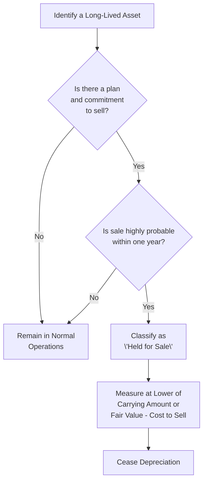

## 12.5 Assets Held for Sale and Disposal

Long-lived assets (or disposal groups) that meet certain criteria may be classified as “held for sale” rather than continuing as part of normal operations. This classification significantly affects financial statements, as it alters the measurement of the asset and requires that depreciation on that asset be ceased. This section provides an in-depth look at the U.S. GAAP and IFRS requirements for recognizing and accounting for assets held for sale, along with practical examples, diagrams, and case studies.

-------------------------------------------------------------------------------
### Overview of Held-for-Sale Classification

Under U.S. GAAP (ASC 360‑10, “Property, Plant, and Equipment”), a long-lived asset (or disposal group) is classified as held for sale if—and only if—it meets certain specific criteria developed by the Financial Accounting Standards Board (FASB). IFRS (IFRS 5, “Non-Current Assets Held for Sale and Discontinued Operations”) has substantially similar criteria but minor variations in certain details. Regardless of the accounting framework, the **overarching principle** remains that the asset must be available for immediate sale and that the sale must be “highly probable.”

#### Core Criteria (U.S. GAAP)
1. **Management Commitment:** There must be a committed plan to sell the asset, supported by the appropriate level of corporate governance.  
2. **Available for Immediate Sale:** The asset must be in a condition to be sold immediately with minimal further work.  
3. **Active Program to Locate a Buyer:** The asset must be actively marketed for sale at a price that is reasonable relative to its current fair value.  
4. **Probable Sale Within One Year:** The completion of the sale must be reasonably expected to occur within one year from the date of classification (with certain exceptions for events beyond the entity’s control).  
5. **Appropriate Solicitation of Buyers:** Management must be seeking out buyers, typically through brokers, listing with agencies, or direct negotiations.  
6. **Unlikely to Change Plan:** It must be unlikely that the sale plan will be significantly changed or withdrawn.

Once these conditions are met, the asset is reclassified from Property, Plant, and Equipment (or another noncurrent category) into “Assets Held for Sale,” typically reported as a separate line item in the balance sheet.

#### Similarities and Differences (IFRS)
IFRS 5 largely mirrors these conditions, especially regarding management approval and active marketing at a price consistent with fair value. IFRS 5 also covers “non-current assets (or disposal groups) held for distribution to owners,” which triggers similar measurement and presentation requirements. Under IFRS 5, an entity may classify assets for distribution (for instance, spinoffs) under the same standard.

-------------------------------------------------------------------------------
### Decision Flow: Classification as Held for Sale

Below is a simplified decision flowchart illustrating how an entity might determine if a long-lived asset (or disposal group) qualifies for held-for-sale classification.  



Explanatory notes:

• **A → B:** Evaluate whether management is formally committed to a disposal or sale plan.  
• **B → D:** If no commitment, continue to account for the asset as usual (i.e., depreciation continues).  
• **B → C:** Confirm that external marketing of the asset has begun and that the time horizon is within one year.  
• **C → E:** Classify the asset as held for sale.  
• **E → F:** Begin measurement at the lower of carrying amount or fair value less costs to sell.  
• **F → G:** Once classified as held for sale, the asset is no longer depreciated.

-------------------------------------------------------------------------------
### Measurement and Valuation

#### Initial Measurement
Once classified as “held for sale,” the asset (or disposal group) is measured at **the lower of:**  
• Its **carrying amount** (the net book value on the date of reclassification), or  
• Its **fair value less costs to sell** (often referred to as “FV − CTS”).

If the **fair value less costs to sell** is below the carrying amount, the entity recognizes an **impairment loss** in the period of reclassification. This reduction is recognized in the income statement (e.g., as part of continuing operations’ loss from impairment).

If **fair value less costs to sell** is higher than the carrying amount, no upward adjustment is typically recognized under U.S. GAAP. Under IFRS, minor reversals of impairments recognized in previous periods are possible, subject to certain limitations. However, generally, IFRS also does not permit any increase in carrying value above what it would have been absent any impairment.

#### Subsequent Measurement Changes
After classification as held for sale, the asset (or disposal group) is remeasured each reporting period. If the fair value less costs to sell changes, an increase may offset a previously recognized impairment loss (only to the extent of the original impairment) under IFRS. Under U.S. GAAP, subsequent increases in fair value cannot be recorded for previously impaired assets; instead, the asset remains at its new carrying amount unless further declines require additional impairment expense.

A typical scenario illustrating subsequent measurements could include an asset initially written down to a fair value less costs to sell of $500,000. In the next period, if fair value less costs to sell rises to $520,000, U.S. GAAP prohibits reversing the impairment. IFRS might allow a partial or full reversal up to the amount of the cumulative impairment recognized. In either regime, the carrying amount after reclassification cannot exceed the “what would have been” carrying value had no impairment been recognized.

-------------------------------------------------------------------------------
### Cessation of Depreciation

Once an asset is classified as held for sale, **depreciation is no longer recorded** because the asset’s use in the ordinary course of business is presumed to be ending. The entity expects to dispose of the asset, not continue to use it. Therefore:

1. **Stop Depreciation at Reclassification Date:** On the day the asset meets the held-for-sale criteria, depreciation for that asset ceases.  
2. **Tracking of New Carrying Amount:** The new carrying amount, typically the lower of the net book value or fair value less costs to sell, is carried forward until the sale is consummated.  
3. **No Further Lifecycle Charges:** Normal depreciation or amortization no longer applies, but the discard value can still be adjusted if fair value declines further below this carrying amount.

-------------------------------------------------------------------------------
### Disposal Groups vs. Individual Assets

A **disposal group** is defined as a group of assets—possibly with related liabilities—that are intended to be sold together in a single transaction. Under ASC 360 and IFRS 5:

• **Measurement:** The disposal group as a whole is measured at the lower of its carrying amount or fair value less costs to sell. Total fair value typically refers to net proceeds from selling the group’s assets and settling the group’s liabilities.  
• **Impairment Testing:** Impairment is allocated among the noncurrent assets in the disposal group if the group as a whole is impaired.  
• **Presentation:** The assets and liabilities of the disposal group are presented separately in the statement of financial position. For instance, “Assets Held for Sale” and “Liabilities Associated with Assets Held for Sale” are shown separately.  

-------------------------------------------------------------------------------
### Impact on the Financial Statements

#### Balance Sheet
Assets classified as held for sale are generally reported separately from the continuing operations assets. If liabilities are included in the disposal group, they appear separately as “Liabilities Related to Assets Held for Sale.” This segregation improves transparency and helps users identify resources that are no longer intended for ongoing operations.

#### Income Statement
Impairment losses recognized upon reclassification, along with any subsequent adjustments, typically appear in the determination of income from continuing operations unless these assets meet the conditions for **discontinued operations**. If the disposal group qualifies as a discontinued operation, the results of that component’s operations, net of tax, are presented in a separate “discontinued operations” section of the income statement under both U.S. GAAP (ASC 205) and IFRS (IFRS 5).

-------------------------------------------------------------------------------
### Practical Example

Imagine Horizon Manufacturing, Inc. decides to sell a specialized production facility. The carrying amount of the facility is $2 million. After obtaining an appraisal, they determine that the fair value of this facility is $1.8 million. Horizon’s management also estimates $50,000 of transaction costs (legal fees, agent commissions, etc.). Thus, fair value less costs to sell is $1.75 million.

• **Held-for-Sale Classification Date:** January 1, 20X5  
• **Carrying Amount of Facility:** $2,000,000  
• **Fair Value:** $1,800,000  
• **Costs to Sell:** $50,000  
• **Fair Value Less Costs to Sell:** $1,750,000

Upon reclassification to held for sale on January 1, 20X5, Horizon recognizes an impairment loss of $250,000 to write the facility down from $2,000,000 to $1,750,000. Depreciation on the facility at January 1, 20X5, immediately ceases.  

If by March 31, 20X5, the best estimate of fair value less costs to sell drops to $1,700,000, an **additional impairment loss** of $50,000 must be recognized. Depreciation remains stopped.

However, if after June 30, 20X5, the company obtains an offer at $1,760,000, U.S. GAAP generally does not allow reversing the earlier impairment, so the carrying amount remains at $1,700,000. Under IFRS, the entity may potentially reverse some or all of the $50,000 impairment recognized in March, but the **maximum carrying amount** cannot exceed $1,750,000 (i.e., the carrying amount that would have been determined had no impairment loss existed before June 30, 20X5).

-------------------------------------------------------------------------------
### Challenges and Pitfalls

1. **Timing of Classification:** A frequent challenge arises in determining the exact date when the management commitment meets the “highly probable” threshold for sale. Entities must exercise professional judgment to ensure all criteria are genuinely satisfied.  
2. **Changes to Plans:** If circumstances change and the sale is no longer probable within one year, the asset may need to be reclassified from held for sale back to normal operating classifications, potentially triggering reinstatement of depreciation (and restatement of prior depreciation schedules).  
3. **Active Marketing Requirements:** Merely having a formal plan might not suffice if there is no active and persistent attempt to market or otherwise identify a buyer. Auditors and regulators often focus on marketing efforts to validate classification.  
4. **Fair Value Estimation:** Determining fair value less costs to sell can be subjective. Entities must ensure that market quotes, valuations, and cost estimates are robust, current, and reflect the actual value.  
5. **Partial Sales or Sale to a Related Party:** If there is a planned partial disposal or a sale at a nominal amount to a related party, the classification must still adhere to the “highly probable sale” criterion. Transactions with related parties can raise additional scrutiny around the verifiability of fair value.  

-------------------------------------------------------------------------------
### IFRS Variations and Discontinued Operations

Under IFRS 5, “discontinued operations” are reported on the face of the income statement separately from continuing operations. A discontinued operation is a component of an entity that has been disposed of or is classified as held for sale, representing a separate major line of business or geographical area of operations. While U.S. GAAP also has the concept of discontinued operations (ASC 205), IFRS requires a detailed breakdown of the revenue, expenses, and after-tax profit or loss of discontinued operations on the income statement or in the notes.  

Key IFRS Distinctions:
- **Held for Distribution to Owners:** IFRS 5 covers assets that may be settled by distributing them directly to owners (e.g., spin-off of a subsidiary). U.S. GAAP does not have an equivalent standard within ASC 360 for a direct distribution scenario.  
- **Reversal of Impairment:** IFRS permits partial or full reversal of previously recognized impairments when the fair value recovers, up to the original carrying amount, adjusted for any amortization or depreciation that would have been recognized if no impairment had occurred.

-------------------------------------------------------------------------------
### Best Practices

1. **Early Identification:** Establish an internal protocol that anticipates major disposals and sets the formal plan in motion as soon as the decision is made.  
2. **Proper Documentation:** Maintain robust documentation, including management approvals, marketing efforts, valuation techniques, and timelines to demonstrate compliance with the “held for sale” criteria.  
3. **Valuation Rigor:** Use reputable appraisers, recent comparable sales data, or discounted cash flow analyses to determine fair values. Revisit valuations regularly if sales are delayed for any reason.  
4. **Communication with Stakeholders:** Inform the board of directors, audit committee, and external auditors about the disposal plan to align everyone on key steps and timing.  
5. **Continuous Reassessment:** Reassess the “held for sale” status each reporting period to confirm the plan remains on track. If conditions change, reclassify promptly and adjust measurements as required.

-------------------------------------------------------------------------------
### Illustrative Case Study

**Case Background:** A publicly traded health-care conglomerate, HealthPlus Corp., decides to divest one of its underperforming hospitals. The conglomerate’s board of directors formally approves the sale, and HealthPlus Corp. negotiates with local health networks to identify potential buyers. The carrying amount of the hospital’s building and land is $10 million, and new appraisal data predicts a fair value of $9 million. Legal fees and broker commissions related to selling the hospital and its land are estimated at $200,000.

#### Step 1: Classification  
• Management obtains formal board approval on October 1, 20X7.  
• HealthPlus lists the hospital with a commercial broker and immediately begins negotiations with several parties.  
• The asset is considered “available for immediate sale” because the hospital can quickly cease operations once a buyer is found.  
• Sale is expected by April 20X8 (within 12 months).  

As of October 1, 20X7, the hospital is reclassified as “held for sale” because all criteria have been met:
  
1) Board commitment  
2) Immediate readiness for sale  
3) Active marketing  
4) Probability of sale within a year  
5) Reasonable listing price of $9 million reflecting current fair value  

#### Step 2: Measurement  
• Carrying Amount on Oct 1, 20X7: $10,000,000  
• Fair Value: $9,000,000  
• Estimated Costs to Sell: $200,000  
• Fair Value Less Costs to Sell: $8,800,000  
• Impairment upon reclassification: $1,200,000 ($10,000,000 – $8,800,000)

HealthPlus Corp. recognizes an immediate impairment loss of $1,200,000, reducing the carrying amount to $8,800,000 as of October 1, 20X7.

#### Step 3: Cessation of Depreciation  
• The hospital building ceases depreciation as of October 1, 20X7.  
• If the building was previously depreciated at a rate of $20,000 per month, no depreciation is recognized after September 30, 20X7.

#### Step 4: Subsequent Adjustments  
• In December 20X7, HealthPlus receives multiple offers ranging from $8.2 million to $8.9 million.  
• Under U.S. GAAP, if an updated fair value less costs to sell indicates the asset is now worth only $8.3 million, the carrying amount is reduced again, recognizing an additional impairment loss of $500,000.  
• If a later offer mid-20X8 goes up to $8.7 million, U.S. GAAP still prohibits reversing previously recognized impairment. Under IFRS, HealthPlus could record a partial reversal of the $500,000 impairment if they had previously recognized an impairment that “overshot” the ultimate fair value.  

#### Step 5: Final Disposal  
• Suppose the sale closes on April 15, 20X8, for $8.85 million.  
• Any differences between the carrying amount and final sale proceeds are recognized as a gain (or additional loss), net of selling costs incurred in excess of prior estimates.

-------------------------------------------------------------------------------
### Additional Considerations

#### Reclassification From Held for Sale to Held and Used
If at any point, management decides not to sell the asset—perhaps due to strategic shifts—or fails to meet the criteria within the required one-year window without legitimate justification, the asset must be **reclassified** out of held-for-sale status. In this scenario:

• The asset is measured at the lower of the current carrying amount or the carrying amount had depreciation continued from the date of classification.  
• Depreciation resumes prospectively.  

#### Extension Beyond 12 Months
In rare circumstances, a sale might be delayed beyond one year but still qualify for continued held-for-sale classification if all other criteria are met and the delay was beyond the entity’s control. For example, certain regulatory approvals may stall the sale, and if management continues to be committed to the plan, the held-for-sale status may still stand.

#### Disposal by Other Means
In addition to cash sales, an entity may dispose of assets through **exchanges, distributions to owners (spinoffs), or charitable donations**. Under IFRS, a spinoff distribution classifies under IFRS 5 if it meets the relevant criteria for “held for distribution to owners.” U.S. GAAP primarily addresses spinoffs in other literature, but once a plan for disposal is set in motion, the entity should evaluate whether the disposal meets the “held for sale” concept if the transaction is ultimately structured as a sale.

-------------------------------------------------------------------------------
### Diagram: Accounting for an Asset Held for Sale

```mermaid
flowchart LR
   A[Classify Asset as Held for Sale] --> B(Measure at Lower of Carrying Amount or FV - CTS)
   B --> C{Fair Value < Carrying Amount?}
   C -- Yes --> D[Record Impairment Loss<br>Stop Depreciation]
   C -- No --> E[Stop Depreciation<br> No Impairment Loss]
   D --> F[Subsequent Periodic Remeasurement]
   E --> F[Subsequent Periodic Remeasurement]
   F --> G{FV - CTS Changes?}
   G -- Down --> D1[Recognize Additional Impairment<br>If GAAP or IFRS Allows]
   G -- Up --> E1[No GAAP Reversal<br>(Partial IFRS Reversal Possible)]
   E1 --> H[Maintain Adjusted Carrying Amount]
   D1 --> H[Maintain Adjusted Carrying Amount]
   H --> I[Final Disposal <br>(Recognize Gain or Loss)]
```
Explanation of the diagram flow:
1. **Classify Asset as Held for Sale** – Determine if the criteria have been met.  
2. **Measure at Lower of Carrying Amount or Fair Value Less Costs to Sell** – Initial impairment testing is done.  
3. **Record Impairment Loss / Stop Depreciation** – If a loss occurs, recognize it and cease depreciation.  
4. **Subsequent Periodic Remeasurement** – Evaluate at each reporting date if there is a change in fair value less costs to sell.  
5. **Additional Impairment or IFRS Reversal** – If fair value worsens, record more impairment. Under IFRS, if fair value improves, reverse part of previous impairment but not above what the carrying amount would have been without any impairment recognized.  
6. **Maintain Adjusted Carrying Amount** – Continue to carry the asset at the new amount until final sale.  
7. **Final Disposal** – Remove the asset from the books; recognize gain or loss based on final proceeds versus carrying amount.  

-------------------------------------------------------------------------------
### References and Further Reading

• FASB ASC 360‑10, “Property, Plant, and Equipment”  
• IFRS 5, “Non-Current Assets Held for Sale and Discontinued Operations”  
• FASB ASC 205‑20, “Presentation of Financial Statements—Discontinued Operations” (for details on U.S. GAAP discontinued operations)  
• PwC Manual of Accounting: IFRS 5  
• Deloitte, “A Roadmap to Disposals of Long-Lived Assets and Discontinued Operations”

-------------------------------------------------------------------------------
## Quiz: Assets Held for Sale and Disposal



### Under U.S. GAAP, once a long-lived asset is classified as held for sale, the entity must:
- [ ] Continue to record depreciation.
- [ ] Revalue the asset upward to fair value if market conditions improve.
- [x] Cease depreciation on the asset from the date it is classified as held for sale.
- [ ] Ignore any changes in fair value until the date of disposal.

> **Explanation:** Under U.S. GAAP (ASC 360‑10), once classified as held for sale, the asset is no longer depreciated because it is not considered to be used in normal operations.

### Which of the following is a key criterion for an asset to be classified as held for sale under both U.S. GAAP and IFRS?
- [ ] The management must have sold an identical asset within the same fiscal period.
- [x] Management must be committed to a plan to sell and actively marketing the asset.
- [ ] The asset must already have a signed purchase agreement.
- [ ] The asset must have a carrying amount below its fair value.

> **Explanation:** Both ASC 360 and IFRS 5 require a formal plan and active marketing for the sale, committed at the management level, among other highly probable criteria.

### When measuring a long-lived asset classified as held for sale, the standard requires entities to use:
- [ ] Carrying amount only.
- [ ] Cost to acquire plus subsequent improvements.
- [ ] Fair value only.
- [x] The lower of carrying amount or fair value less costs to sell.

> **Explanation:** An entity measures a held-for-sale asset at the lower of its existing net book value or its fair value minus the costs to sell.

### If the fair value less costs to sell of a held-for-sale asset is determined to be below the carrying amount:
- [x] An impairment loss is recognized immediately.
- [ ] Depreciation is recalculated and recognized before reclassification.
- [ ] The amount is disclosed but not recognized.
- [ ] The held-for-sale classification is revoked.

> **Explanation:** If the new fair value is lower, the difference is recognized as an impairment loss, reducing the carrying amount upon classification as held for sale.

### Under U.S. GAAP, what happens if the fair value of an asset classified as held for sale increases after a significant impairment has been recorded?
- [ ] The prior impairment is reversed, and the asset is written up.
- [x] The asset remains at the impaired value (no reversal is permitted).
- [ ] Depreciation is reinstated to compensate for the missed periods.
- [x] Both the second and third answers are correct.

> **Explanation:** U.S. GAAP generally prohibits reversing previously recognized impairment losses for assets held for sale, even if fair value recovers.

### What is “fair value less costs to sell”?
- [x] The best estimate of the price at which the asset could be sold in an orderly transaction between market participants, minus the direct incremental costs to sell.
- [ ] Book value minus all taxes paid over the asset’s life.
- [ ] Replacement cost of the asset based on unobservable inputs.
- [ ] Carrying value under IFRS only.

> **Explanation:** Fair value less costs to sell is essentially the net realizable value if the asset were to be sold under normal market conditions, net of all transactional or disposal costs.

### Which statement is most accurate regarding the cessation of depreciation for assets reclassified as held for sale?
- [x] Depreciation stops immediately upon meeting the held-for-sale criteria.
- [ ] Depreciation continues until the entity obtains a firm purchase order.
- [x] Depreciation stops if fair value is greater than carrying amount.
- [ ] Depreciation continues if a buyer has not yet been identified.

> **Explanation:** Depreciation ceases immediately once the asset meets the criteria to be classified as held for sale. The fair value test or having a purchase order in place is not relevant to ceasing depreciation.

### If an entity has a disposal group held for sale, how are the assets and related liabilities presented in the balance sheet?
- [ ] Net the assets and liabilities and show them as a single net amount.
- [ ] Continue to classify each asset and liability under its previous heading.
- [x] Present the assets as “Assets Held for Sale” and liabilities as “Liabilities Related to Assets Held for Sale.”
- [ ] Present in equity, since disposal is imminent.

> **Explanation:** Under ASC 360 (and IFRS 5), disposal group assets and related liabilities appear separately, enhancing transparency of items no longer used in continuing operations.

### If circumstances force a delay so that the sale occurs beyond one year, but all other criteria remain valid, how should the asset be classified under U.S. GAAP?
- [ ] It must be reclassified back to an operating asset.
- [x] It can remain as held for sale if the delay is beyond the entity’s control and a commitment to sell remains.
- [ ] It is automatically written off the books.
- [ ] The entity must recognize the asset as an intangible.

> **Explanation:** An extension beyond one year is acceptable under certain circumstances (e.g., regulatory approval delays) as long as the sale is still highly probable and actively pursued.

### Assets held for sale are no longer depreciated once the held-for-sale criteria are met.
- [x] True
- [ ] False

> **Explanation:** True. Depreciation or amortization ceases immediately when the asset is classified as held for sale, reflecting that the asset will no longer be used in operations and is expected to be disposed of.



-------------------------------------------------------------------------------
## For Additional Practice and Deeper Preparation

**[FAR CPA Hardest Mock Exams: In-Depth & Clear Explanations](https://www.udemy.com/course/far-cpa-mock-exams/?referralCode=F88050F8D5C76764F6BD)**  

**Financial Accounting and Reporting (FAR) CPA Mocks:** 6 Full (1,500 Qs), Harder Than Real! In-Depth & Clear. Crush With Confidence!

- Tackle full-length mock exams designed to mirror real FAR questions.  
- Refine your exam-day strategies with detailed, step-by-step solutions for every scenario.  
- Explore in-depth rationales that reinforce higher-level concepts, giving you an edge on test day.  
- Boost confidence and minimize anxiety by mastering every corner of the FAR blueprint.  
- Perfect for those seeking exceptionally hard mocks and real-world readiness.

_Disclaimer: This course is not endorsed by or affiliated with the AICPA, NASBA, or any official CPA Examination authority. All content is for educational and preparatory purposes only._
