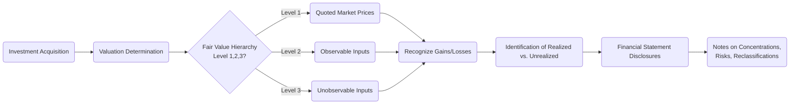

## 13.4 Disclosure Requirements for Investments

Investment disclosures in financial statements play a crucial role in enhancing transparency, comparability, and decision usefulness. They allow external stakeholders—such as investors, creditors, and regulators—to better understand the nature, risks, and performance of an entity’s investment portfolios. This section focuses on the essential disclosures regarding investments, including fair value levels, realized and unrealized gains and losses, concentration risks, and reclassification adjustments. We will explore the applicable U.S. GAAP requirements, illustrate examples of footnote disclosures, and highlight best practices to ensure compliance and clarity.  

------------------------------------------------------------------------------
  
### Importance of Detailed Disclosures

Investments can represent a significant portion of a company's assets and can dramatically affect financial performance. Comprehensive disclosures provide stakeholders with the necessary information to evaluate:

• The measurement basis for investments, including levels of fair value accounting.  
• The amount, timing, and uncertainty of future cash flows.  
• Exposure to credit, market, currency, and liquidity risks.  
• The quality of earnings and the volatility arising from changes in fair value.  

Failing to disclose investment positions and valuation strategies accurately can mislead readers of the financial statements and undermine confidence in the reporting entity’s financial integrity.  

------------------------------------------------------------------------------

### Key Disclosure Objectives

1. Identify different categories of investments (trading, available-for-sale (AFS), held-to-maturity (HTM), equity method, and fair value through net income).  
2. Distinguish between realized and unrealized gains and losses, as well as the recognition of such gains and losses on profit or loss or other comprehensive income (OCI).  
3. Detail fair value measurement, segregated by the appropriate hierarchy levels (Levels 1, 2, and 3), and describe valuation techniques and inputs, assumptions, and any changes in methodology.  
4. Provide insight into concentration risks and credit exposures, including how management monitors and mitigates these risks.  
5. Ensure that reclassifications between categories (e.g., from AFS to HTM) are explained, justified, and appropriately measured on reclassification dates, along with the related impacts on the financial statements.  

------------------------------------------------------------------------------

### Fair Value Disclosures and the Hierarchy

Under U.S. GAAP (Topic 820, Fair Value Measurement), entities must disclose information to help users evaluate:

• The valuation techniques and inputs used for determining the fair value of investments.  
• The uncertainty associated with fair value measurements, especially if investments are valued based on significant unobservable inputs.  

#### Fair Value Hierarchy Overview

The fair value hierarchy categorizes inputs to valuation techniques used to measure fair value into three levels:

Level 1 Inputs: Quoted prices in active markets for identical assets or liabilities that the reporting entity can access at the measurement date (e.g., stock traded on a major exchange).  

Level 2 Inputs: Inputs other than quoted prices included within Level 1 that are observable, either directly or indirectly (e.g., quoted prices for similar assets in active markets, interest rates, yield curves).  

Level 3 Inputs: Unobservable inputs for the asset or liability, used when relevant observable inputs are not available (e.g., internal valuation models, limited market quotes, management assumptions).

When measuring fair value, entities generally use the most observable inputs available. To enhance transparency, financial statements typically include a tabular presentation of fair value by hierarchy level.  

#### Illustrative Fair Value Footnote Disclosure

Below is an example of a simplified footnote that discloses the categorization of an entity’s investment portfolio within the fair value hierarchy:

--------------------------------------------------------------------------------
  
XYZ Corporation  
Notes to the Financial Statements  
Note X: Fair Value Measurements of Investments  

The following table presents the fair value of our investment portfolio as of December 31, 20XX, aggregated by the level in the fair value hierarchy within which those measurements fall:

| Investment Type          | Level 1        | Level 2           | Level 3           | Total Fair Value  |
|--------------------------|----------------|--------------------|--------------------|-------------------|
| Equity Securities (Trading)  | $2,500,000    | $     –           | $     –           | $2,500,000        |
| Debt Securities (AFS)    | $     –        | $4,000,000         | $     –           | $4,000,000        |
| Private Equity Investments   | $     –        | $     –           | $1,200,000        | $1,200,000        |
| Total                    | $2,500,000    | $4,000,000         | $1,200,000        | $7,700,000        |

We use quoted market prices (Level 1 inputs) to measure the fair value of publicly traded equity securities. The fair value of our debt securities is based on inputs other than quoted prices that are observable for the asset, such as spread curves and benchmarking to similar securities (Level 2). Private equity investments are measured using unobservable inputs based on management’s estimates of discounted future cash flows and comparable market valuations (Level 3).  

--------------------------------------------------------------------------------

In such disclosures, entities must also describe significant valuation policies and procedures, changes in valuation techniques, and quantitative information about unobservable inputs for Level 3 measurements.  

------------------------------------------------------------------------------

### Realized vs. Unrealized Gains and Losses

Companies often categorize their investments in ways that impact how gains and losses flow through financial statements. Common categories for debt and equity investments under U.S. GAAP include:  

• Trading Securities (or Fair Value through Net Income): Changes in fair value are recognized directly in net income.  
• Available-for-Sale (AFS) Securities: Unrealized gains and losses are recognized in OCI until realized or a permanent impairment is recorded, at which point the effect is recognized in net income.  
• Held-to-Maturity (HTM) Securities: Carried at amortized cost with minimal fair value adjustments unless an impairment is recognized (ASC 320).  
• Equity Method: Used for investments where the company has significant influence but not control (generally 20%–50% ownership); recognized share of investee’s earnings or losses in net income.  
• Fair Value through Net Income (for certain equity investments without significant influence).

#### Disclosure of Realized and Unrealized Amounts

Entities should separately disclose:  

• Realized gains and losses recognized in net income during the reporting period.  
• Unrealized holding gains and losses recognized in OCI, distinguishing current-period changes from cumulative amounts.  
• Any reclassifications from OCI to net income, such as when an AFS security is sold and the previously unrealized amounts are recognized in earnings.  

#### Illustrative Disclosure of Gains and Losses

--------------------------------------------------------------------------------
  
XYZ Corporation  
Notes to the Financial Statements  
Note Y: Gains and Losses on Investments  

The following table presents realized and unrealized gains and losses for the year ended December 31, 20XX:

| Description                                    | Amount         |
|------------------------------------------------|----------------|
| Realized gains (trading securities)            | $375,000       |
| Realized losses (AFS securities upon sale)     | $(105,000)     |
| Net unrealized gains (trading securities)      | $290,000       |
| Unrealized gains (AFS securities in OCI)       | $220,000       |
| Total net investment gains recognized in income| $565,000       |

During the year, the Company reclassified $105,000 of losses from accumulated other comprehensive income to net investment results due to the sale of certain AFS securities.  

--------------------------------------------------------------------------------  

In practice, these tables may contain more or less granularity based on the complexity of the organization’s investment portfolio.  

------------------------------------------------------------------------------

### Concentration Risks

For investments, particularly in situations where a few large positions or counterparties represent a substantial portion of the portfolio, disclosure around concentration risk is critical. Concentration risk disclosures can include:

• The magnitude of the investment(s) relative to total investments or total assets.  
• A description of the industry, geographical region, or credit rating of the investments.  
• An explanation of how management monitors or mitigates risk, including diversification strategies, credit enhancements, or hedging.  

#### Example Disclosure on Concentration Risk

--------------------------------------------------------------------------------
  
XYZ Corporation  
Notes to the Financial Statements  
Note Z: Concentration of Credit and Market Risk  

At December 31, 20XX, approximately 35% of our investment portfolio was composed of corporate bonds from three major U.S. technology firms, each with investment-grade ratings ranging from A to AA. The Company closely monitors the creditworthiness of these issuers. Our risk management program includes periodic review of sector allocations and credit ratings to reduce significant concentrations in any industry or issuer.  

--------------------------------------------------------------------------------  

Such disclosures provide insight into how reliant the entity might be on the performance of certain sectors or counterparties.  

------------------------------------------------------------------------------

### Reclassification Adjustments

Reclassification adjustments arise when securities move between categories. For example, an AFS instrument might be reclassified to HTM if the company declares an intention and ability to hold the security to maturity. The reclassification triggers the transfer of any previously recognized unrealized gains or losses from accumulated OCI to the new category.  

#### Requirements for Reclassification

1. Clearly state the justification for reclassification, including the change in circumstances or strategy.  
2. Record the asset’s fair value at the date of transfer.  
3. Recognize any accumulated OCI related to the securities as part of the carrying amount for HTM reclassifications.  
4. Disclose the effect of the reclassification on the financial statements, including amounts reclassified from equity to net income as realized gains or losses (if any).  

#### Illustrative Reclassification Footnote

--------------------------------------------------------------------------------
  
XYZ Corporation  
Notes to the Financial Statements  
Note A: Reclassification of Investment Securities  

During the year ended December 31, 20XX, the Company reclassified $2,000,000 of corporate debt securities from the available-for-sale category to held-to-maturity. At the date of transfer, the fair value of the securities was $1,980,000, and the net unrealized loss of $20,000 was included in accumulated other comprehensive income. This amount will be amortized through interest income over the remaining life of the securities, consistent with the treatment of discounts on purchased debt securities.  

--------------------------------------------------------------------------------  

------------------------------------------------------------------------------

### Visualizing the Disclosure Process

The following diagram (created using Mermaid.js) outlines a simplified process of generating and presenting disclosures for investments covered under fair value measurement:

• (A) begins with investment acquisition.  
• (B) calls for using consistent, robust valuation methods.  
• (C) involves identifying which level of the fair value hierarchy applies.  
• (D1, D2, D3) reflect the type of inputs being used.  
• (E) addresses how to record any gains or losses, realized or unrealized.  
• (F) distinguishes which gains or losses flow through net income or OCI.  
• (G) ensures proper statement disclosures.  
• (H) specifically highlights notes about risk concentration and any reclassification impacts.  

------------------------------------------------------------------------------

### Best Practices and Common Pitfalls

• Consistency and Clarity: Apply consistent valuation techniques, especially for Level 3 inputs. Inconsistent or opaque methods raise red flags for auditors and regulators.  
• Comprehensive Qualitative Disclosures: Quantitative data is helpful, but providing context about management’s judgments, estimates, and methodology changes is essential for completeness.  
• Timeliness: Disclosures must reflect the valuation environment at the balance sheet date. Rapid changes in markets (e.g., volatile interest rate shifts) should be properly accounted for and discussed.  
• Overlooking Concentrations: Entities sometimes underdisclose concentration risks, which can mislead stakeholders about potential vulnerabilities.  
• Mismanaged Reclassifications: Inappropriate or unjustified reclassifications open the door to earnings management accusations. Make sure to follow the codification rigorously, and describe any reclassifications clearly.  

------------------------------------------------------------------------------

### Practical Illustrations and Case Studies

• A technology startup invests heavily in a competitor’s stock. Because the competitor’s shares are thinly traded, the startup must use a discounted cash flow model (Level 3) to determine fair value. Its footnotes must provide robust disclosure about the model’s inputs, discount rate assumptions, and the approach used to determine the competitor’s revenue growth.  
• A large manufacturing company invests primarily in publicly traded corporate bonds. These instruments are valued using observable inputs, placing them in Level 2. If the company invests in a less liquid bond issue, it must explain why certain Level 3 adjustments were necessary, plus the valuation model’s assumptions.  

------------------------------------------------------------------------------

### References and Further Reading

• FASB ASC 820: Fair Value Measurement  
• FASB ASC 320: Investments—Debt and Equity Securities  
• FASB ASC 825: Financial Instruments  
• IFRS 13: Fair Value Measurement (for IFRS-based comparisons)  
• AICPA Audit and Accounting Guide: Investment Companies  

For a deeper dive, consider specialized publications on accounting for financial instruments available through the AICPA and major accounting firms, as they offer detailed discussions and nuanced examples for real-world application.  

------------------------------------------------------------------------------

## Test Your Knowledge: Disclosure Requirements for Investments



### Which fair value hierarchy level includes quoted prices in active markets for identical assets or liabilities?

- [x] Level 1
- [ ] Level 2
- [ ] Level 3
- [ ] None of the above

> **Explanation:** Level 1 inputs are directly observable quoted prices in active markets for the exact item being measured, making them the most reliable form of fair value measurement.

### Which category typically recognizes unrealized gains and losses in Other Comprehensive Income (OCI) rather than net income?

- [ ] Trading securities
- [x] Available-for-sale (AFS) securities
- [ ] Held-to-maturity (HTM) securities
- [ ] Equity method investments

> **Explanation:** AFS securities recognize unrealized holding gains and losses in OCI until realized, except in cases of impairment.  

### What is a key disclosure requirement when a company reclassifies a security from available-for-sale (AFS) to held-to-maturity (HTM)?

- [x] The reason for the transfer and the carrying amount at the date of transfer
- [ ] Only the fair value of the security at the date of original acquisition
- [ ] The historical cost of the security at the initial recognition date
- [ ] Recalculation of the par value of the security

> **Explanation:** Companies must disclose the justification behind the transfer and the security’s fair value at the time of transfer, as well as recognize any prior unrealized gains or losses in accumulated OCI.  

### When might fair value measurements for investments fall into Level 3 inputs?

- [x] When observable inputs are not available and management relies heavily on unobservable assumptions
- [ ] When a security trades on the New York Stock Exchange
- [ ] When prices are derived from other, similar securities’ active markets
- [ ] When no pricing models are used

> **Explanation:** Level 3 inputs reflect measurements based on the entity’s own assumptions about the assumptions that market participants would use in pricing the asset or liability if observable inputs are not available.  

### Which of the following best describes “realized gains”?

- [x] Gains recognized when an investment is sold, settled, or otherwise disposed of
- [ ] Gains recorded based solely on changes in market price with no transaction
- [x] Gains from reclassifications of investments that occur within the same reporting period
- [ ] Gains reported only in the statement of financial position

> **Explanation:** Realized gains occur from an actual transaction (e.g., sale). If an AFS security is sold, previously unrealized gains in OCI become realized. Gains from reclassifications may also be recognized if the transfer triggers realization under GAAP.  

### Which of the following can be considered a concentration risk?

- [x] Holding a significant portion of investments in a single industry sector
- [ ] Holding several different types of investments
- [ ] Diversifying your portfolio across different geographical regions
- [ ] Having minimal amounts invested in single securities

> **Explanation:** Concentration risk arises when a large portion of an entity’s resources is exposed to the same or closely related source of potential loss.  

### Which statement about disclosures for unrealized gains is correct?

- [x] Unrealized gains on AFS securities should be reported in OCI until realized
- [ ] Unrealized gains on trading securities must be deferred until sale
- [x] Unrealized gains for HTM securities should be immediately recognized in net income
- [ ] Unrealized gains on equity method investments are recognized immediately in OCI

> **Explanation:** Under GAAP, unrealized gains and losses on AFS securities go to OCI, whereas unrealized gains and losses on trading securities flow through net income. HTM securities are recorded at amortized cost.  

### What is a common pitfall in disclosing Level 3 fair value investments?

- [x] Failing to explain the significant unobservable inputs used in the valuation
- [ ] Presenting a table that separates Level 1 and Level 2 inputs
- [ ] Using quoted market prices to value a publicly traded share
- [ ] Confirming that no unrealized losses exist in the portfolio

> **Explanation:** For Level 3 valuations, entities must describe the valuation techniques, unobservable inputs, and changes in those inputs; omission of this detail undermines transparency.  

### How should a company typically disclose reclassification adjustments in its financial statements?

- [x] Through tabular or narrative footnotes indicating amounts moving from OCI to net income
- [ ] By removing any reference to OCI entirely
- [ ] By consolidating all reclassification details into a single line item
- [ ] By hiding it under non-operating income

> **Explanation:** Reclassification adjustments should be clearly disclosed so that users understand which amounts in OCI are shifting to net income and the reasons for those changes.  

### True or False: Entities must disclose both quantitative and qualitative information about Level 3 inputs?

- [x] True
- [ ] False

> **Explanation:** GAAP requires both quantitative and qualitative disclosures for Level 3 fair value measurements, providing transparency into how unobservable inputs are derived and applied.  



------------------------------------------------------------------------------

## For Additional Practice and Deeper Preparation

[**FAR CPA Hardest Mock Exams: In-Depth & Clear Explanations**](https://www.udemy.com/course/far-cpa-mock-exams/?referralCode=F88050F8D5C76764F6BD)

Financial Accounting and Reporting (FAR) CPA Mocks: 6 Full (1,500 Qs), Harder Than Real! In-Depth & Clear. Crush With Confidence!

- Tackle full-length mock exams designed to mirror real FAR questions.  
- Refine your exam-day strategies with detailed, step-by-step solutions for every scenario.  
- Explore in-depth rationales that reinforce higher-level concepts, giving you an edge on test day.  
- Boost confidence and minimize anxiety by mastering every corner of the FAR blueprint.  
- Perfect for those seeking exceptionally hard mocks and real-world readiness.  

_Disclaimer: This course is not endorsed by or affiliated with the AICPA, NASBA, or any official CPA Examination authority. All content is for educational and preparatory purposes only._
