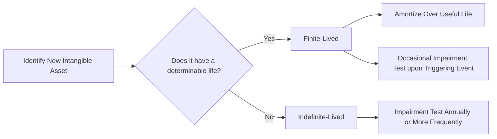

## 14.1 Finite-Lived vs. Indefinite-Lived Intangibles (Amortization, Impairment)

Intangible assets play a critical role in modern financial statements, reflecting rights and privileges that may provide future economic benefits to an entity. Unlike tangible assets such as buildings and equipment, intangible assets lack physical substance but hold significant value, whether through legal protections (e.g., patents) or brand recognition (e.g., trademarks). Accounting for these assets appropriately is essential for transparent financial reporting, and it requires a firm understanding of their nature, categorization, and proper valuation methods.

This section delves into the distinctions between finite-lived and indefinite-lived intangible assets, explores the approaches to amortization and impairment testing, and illustrates concepts with practical examples. While intangible assets can enhance an entity’s competitive edge, they also require careful attention to ensure that their carrying amounts reflect economic realities.

### Understanding Intangible Assets

Under U.S. GAAP (ASC 350, Intangibles—Goodwill and Other), intangible assets are primarily recognized if they meet certain criteria:

• They must be identifiable, meaning they are separable or arise from contractual or legal rights.  
• The entity must have control over the future economic benefits arising from the asset.  
• The asset must provide probable future economic benefits.  

When capitalizing intangible assets, their cost often includes purchase price, legal fees, and any directly attributable costs required to bring the asset to its intended state of use. Internally generated intangibles (e.g., brand development) generally do not meet recognition criteria unless they satisfy specific rules (such as internal-use software under ASC 350-40 or development costs for IFRS).

### Categories of Intangible Assets

Typical categories of intangible assets include:

• Patents: Legal rights to produce, use, or sell an invention.  
• Copyrights: Exclusive rights to reproduce, distribute, or display creative works.  
• Trademarks and Trade Names: Symbols and names associated with products or services.  
• Franchises: Contractual rights to operate a business under the franchisor’s brand.  
• Licenses and Permits: Government or private agreements to operate within certain regulations.  
• Customer Lists or Customer Relationships: Acquired through mergers or acquisitions.

In practice, the nature of these assets significantly impacts their accounting treatment. Some assets have a finite legal or economic life (finite-lived), while others may not be subject to definitive expiration or could be renewed indefinitely (indefinite-lived).

### Finite-Lived Intangible Assets

Finite-lived intangible assets have a determinable economic or legal life, after which the asset no longer provides economic benefit. Common examples include patents with a fixed legal term, copyrights with a set duration, or a franchise license that expires after a certain period.

#### Amortization of Finite-Lived Intangibles

Because finite-lived intangible assets have a limited useful life, they are systematically amortized over that life. The objective is to match the asset’s consumption or usage to the periods benefitting from its use. Under U.S. GAAP:

1. Determine the Useful Life: This reflects assumptions about contractual, regulatory, and economic factors. The legal life might be adjusted if the entity expects to renew or otherwise extend the asset’s period of economic benefit.  
2. Amortization Method: Common methods include straight-line amortization and accelerated methods. The straight-line method is most widely used for simplicity.  
3. Residual Value: Typically, intangible assets have zero residual value unless there is evidence to the contrary (e.g., a patent that retains market value after expiration).  

Amortization is recognized as an expense in the income statement, reducing the carrying amount of the intangible asset on the balance sheet. This systematic allocation continues until the end of the asset’s useful life or until the asset is derecognized.

### Indefinite-Lived Intangible Assets

Indefinite-lived intangible assets are those for which there is no foreseeable limit to the period in which they are expected to generate net cash inflows. Examples include:

• Certain trademarks that can be renewed indefinitely without substantial cost (e.g., a famous brand name).  
• Renewable franchises, licenses, or permits with indefinite renewal terms.  

Since there is no determinable limit to their economic benefits, indefinite-lived intangibles are not amortized. Instead, they remain on the balance sheet at their initial cost subject to possible impairment.

### Impairment Testing: Key Differences

While both finite-lived and indefinite-lived intangible assets are subject to impairment considerations, the timing and methodology differ.

#### Impairment Testing for Finite-Lived Assets

Finite-lived intangible assets are tested for impairment when events or changes in circumstances suggest that the carrying amount may not be recoverable. Indicators of impairment include:

• A significant adverse change in legal or business conditions (e.g., a license is revoked or restricted).  
• Demand for products reliant on a certain patent declines sharply.  
• Negative changes in technology that render the intangible asset obsolete.

Under U.S. GAAP, finite-lived intangible assets undergo a recoverability test:

1. Compare the carrying amount to the sum of the undiscounted future cash flows expected from the asset (or asset group).  
2. If the carrying amount exceeds these undiscounted future cash flows, an impairment loss is computed as the difference between the asset’s fair value and its carrying amount.  
3. Write the asset down to its fair value and record an impairment loss in the income statement.

#### Impairment Testing for Indefinite-Lived Assets

Indefinite-lived intangible assets must be tested for impairment at least annually, or more frequently if circumstances change. The annual test can typically be performed at the same time every year—for instance, at the company’s fiscal year-end. The test follows a simplified approach:

1. Compare the fair value of the intangible asset to its carrying amount.  
2. If the fair value is less than its carrying amount, the difference is recorded as an impairment loss.  

Unlike finite-lived assets, indefinite-lived assets do not undergo a recoverability test using undiscounted cash flows; the evaluation focuses directly on fair value. Entities may apply an optional qualitative assessment (known as Step Zero) to determine if it is “more likely than not” that the asset’s fair value exceeds its carrying amount. If so, no further testing is required.

### Presentation and Disclosure Requirements

Proper financial reporting requires transparent disclosures. Among the key elements to disclose are:

• The gross carrying amount and accumulated amortization (for finite-lived assets).  
• The amortization methods used and the estimated amortization expense for the next five years.  
• The aggregate carrying amount of indefinite-lived intangible assets.  
• The nature of an impairment loss recognized and how fair value was determined.  
• Any significant assumptions or valuation techniques used to gauge impairment.

Regulatory bodies such as the SEC often scrutinize intangible asset valuations closely, as they can be subjective and reliant on management’s assumptions about future cash flows and growth.

### Practical Example: Patent Amortization

Assume Company A purchases a patent for a new manufacturing process at a cost of $600,000. The patent has a legal life of 20 years, but the company estimates an economic life of 10 years, after which new technology is likely to render the patent obsolete. Using the straight-line amortization method:

• Annual amortization expense = Initial cost / Estimated economic life  
• Annual amortization expense = $600,000 / 10 years = $60,000  

An annual expense of $60,000 reduces the patent’s carrying amount on the balance sheet each year and is recognized as an expense in the income statement.

### Practical Example: Trademark Impairment (Indefinite Life)

Company B acquires a major trademark with an indefinite life for $2 million. The trademark can be renewed indefinitely at minimal cost. After a competitor’s disruptive advertising campaign, the brand’s recognition begins to weaken significantly. On the annual impairment test, Company B estimates the fair value of the trademark at $1.5 million (using discounted residual income from brand royalties). If the carrying amount remains at $2 million, Company B records a $500,000 impairment loss to write the trademark down to its fair value of $1.5 million.

### Diagram: Intangible Asset Decision Flow

Below is a simple Mermaid flowchart illustrating the high-level decisions for intangible assets based on their estimated life and impairment testing requirements:

In this diagram, the path diverges based on whether the intangible asset has a determinable life (finite) or not (indefinite). Finite-lived assets undergo systematic amortization and are tested for impairment if triggering events occur, whereas indefinite-lived assets skip ongoing amortization and go directly to annual impairment testing.

### Common Pitfalls and Best Practices

Accounting for intangible assets can be challenging. Below are frequent pitfalls and recommended best practices:

• Overlooking Triggering Events: Companies may fail to detect or act on market and technological shifts that compromise future cash flows. Stay vigilant across regulatory, legal, and economic developments.  
• Overly Optimistic Cash Flow Projections: In impairment testing, managers might use unrealistic assumptions. Use defensible, market-based assumptions, and document rationale thoroughly.  
• Misclassifying Assets: Some assets appear indefinite due to renewable terms but have practical limitations or rising renewal costs that limit their life. Carefully evaluate whether renewal is truly indefinite without significant additional cost.  
• Inconsistent Amortization Schedules: Ensure consistent application of chosen amortization methods and review assumptions for changes in useful life.  
• Inadequate Disclosures: Comply with ASC 350 and relevant SEC guidance by clearly presenting the carrying amounts, accumulated amortization, impairment losses, and valuation approaches.

### Case Study: Combined Assessment of Multiple Intangibles

Imagine Company C acquires a subsidiary that holds a portfolio of intangible assets: multiple patents (finite-lived) and a highly renowned trademark (indefinite-lived). Company C identifies an economic life of 15 years for the patents, which leads to systematic amortization. Initially, the trademark is considered indefinite-lived, tested annually for impairment. However, after regulatory changes result in a newly required renewal fee, management determines that the trademark is no longer indefinite-lived and reclassifies it as a finite-lived asset with an estimated remaining life of eight years. From that point, the trademark is amortized over eight years based on its revised carrying amount, and impairment analyses follow the finite-lived model.

This example underlines the evolving nature of intangible assets. Management’s assumptions about useful lives can shift due to legal, economic, or technological changes, prompting reclassification from indefinite to finite (or vice versa in rare instances when it becomes clear that the useful life is indefinite).

### IFRS vs. U.S. GAAP Considerations

While this chapter focuses on U.S. GAAP, International Financial Reporting Standards (IFRS) also require intangible assets to be classified as either finite or indefinite. Under IAS 38, intangible assets with indefinite useful lives are not amortized but tested annually for impairment, closely paralleling ASC 350. Both frameworks emphasize the importance of robust assumptions regarding future economic benefits and the necessity for regular impairment analyses.

### Encouraging Critical Thinking

• When is it appropriate to classify an intangible asset as indefinite-lived rather than finite?  
• How might competitive pressures, emerging technologies, or evolving consumer preferences signal an impairment trigger event?  
• What additional procedures might an auditor undertake to verify management’s assumptions of fair value?

By reflecting critically on these questions, CPA candidates and finance professionals alike can build a deep understanding of intangible assets, ensuring that financial statements remain transparent, comparable, and relevant to investors and other stakeholders.

### References and Further Exploration

For readers seeking more in-depth coverage of intangible asset accounting, consult the following resources:

• Financial Accounting Standards Board (FASB) Accounting Standards Codification (ASC) 350: Intangibles—Goodwill and Other.  
• IAS 38, Intangible Assets, under the International Financial Reporting Standards.  
• SEC Staff Accounting Bulletin Topic 5: Miscellaneous Accounting.  
• FASB and IFRS official websites for conceptual framework updates and convergence activities.  

These documents offer comprehensive guidance on recognition, measurement, presentation, and disclosure requirements for intangible assets in different contexts.

---

## Quiz on Finite-Lived vs. Indefinite-Lived Intangible Assets



### Which statement best describes a finite-lived intangible asset?
- [x] It has a limited economic life and is systematically amortized over that life.
- [ ] It cannot be separately identified from goodwill.
- [ ] It must be tested annually for impairment, regardless of any triggering events.
- [ ] It never requires an impairment charge if assumptions remain unchanged.

> **Explanation:** A finite-lived intangible asset is amortized over its estimated useful life. It may be tested for impairment if triggering events occur.

### When is an impairment test generally required for indefinite-lived intangible assets under U.S. GAAP?
- [x] At least annually, or more frequently if impairment indicators arise.
- [ ] Only when there is a triggering event indicating the asset’s value may be compromised.
- [ ] Never, because indefinite-lived intangible assets are not subject to impairment.
- [ ] In alternating years to match IFRS guidelines on impairment.

> **Explanation:** Indefinite-lived intangible assets are tested for impairment annually, or more frequently if circumstances indicate a reduction in value.

### Which factor is most likely to indicate a finite useful life of an intangible asset?
- [x] A contractual or legal term that sets a definitive period of use.
- [ ] The freedom to renew the intangible asset at minimal cost indefinitely.
- [ ] A well-known brand that has existed for many decades.
- [ ] Registration with a government agency without expiration.

> **Explanation:** A finite useful life usually stems from a contractual, legal, or regulatory term that prevents indefinite renewal.

### Which step is included in the impairment test for a finite-lived intangible asset but not for an indefinite-lived intangible asset?
- [x] Recoverability test based on undiscounted cash flows.
- [ ] Assessing fair value relative to carrying amount.
- [ ] Measuring an impairment loss as the difference between fair value and carrying amount.
- [ ] Recognition of an immediate write-down if carrying amount exceeds fair value.

> **Explanation:** Under U.S. GAAP, finite-lived intangible assets use a “recoverability test” comparing carrying amount to undiscounted future cash flows, which does not apply to indefinite-lived assets.

### How are legal costs to successfully defend a finite-lived patent generally treated?
- [x] Capitalized as part of the asset’s carrying amount and amortized over the remaining useful life.
- [ ] Immediately expensed in the period incurred.
- [x] Capitalized and not amortized because the patent is indefinite-lived.
- [ ] Classified as research and development expenses under ASC 730.

> **Explanation:** Legal costs to defend a finite-lived patent are typically capitalized and amortized over the asset’s remaining useful life if they successfully extend or preserve the patent’s benefits.

### For indefinite-lived intangibles under ASC 350, which of the following statements is correct?
- [x] An optional qualitative assessment can be performed to determine if a quantitative test is necessary.
- [ ] The undiscounted future cash flows test is mandatory.
- [ ] They are amortized over the lesser of 10 years or their legal life.
- [ ] They must be tested for impairment only if revenues from the asset decline by more than 25%.

> **Explanation:** Under ASC 350, entities may apply a qualitative test (“Step Zero”) to determine if a quantitative test is needed. If it is more likely than not that the carrying amount exceeds fair value, a quantitative test must follow.

### What typically triggers an impairment test for a finite-lived intangible asset?
- [x] A significant adverse event suggesting the asset’s carrying amount may not be recoverable.
- [ ] The endpoint of each fiscal year, regardless of events.
- [x] Every two years, consistent with indefinite-lived intangible assets.
- [ ] When the amortization method changes from straight-line to accelerated.

> **Explanation:** Finite-lived intangible assets are tested for impairment when an event or change in circumstances indicates that the carrying amount may not be recoverable.

### An impairment loss for a finite-lived intangible asset is measured as:
- [x] The difference between the asset’s carrying amount and its fair value.
- [ ] The total of the asset’s future cash inflows over its remaining life.
- [ ] The carrying amount multiplied by the discount rate used.
- [ ] 20% of the asset’s carrying amount, consistent with segment reporting guidelines.

> **Explanation:** Once an impairment is indicated, the impairment loss is measured by the difference between the carrying amount and fair value of the asset.

### Which of the following intangible assets is most likely to be classified as indefinite-lived?
- [x] A trademark that can be renewed indefinitely at an insignificant cost.
- [ ] A franchise license that expires in 15 years and cannot be renewed.
- [ ] A software license that expires every two years.
- [ ] A patent that becomes invalid after a certain date.

> **Explanation:** Indefinite-lived intangible assets usually have no foreseeable limit to cash flows, such as a trademark renewable indefinitely at minimal cost.

### An intangible asset is considered impaired if:
- [x] Its carrying amount exceeds its fair value.
- [ ] Its carrying amount is less than its net realizable value.
- [ ] Future cash flows exceed current cost basis.
- [ ] Customers still recognize the brand even if the market has contracted.

> **Explanation:** An impairment occurs when the intangible asset’s carrying amount is not recoverable, and its fair value is lower than the carrying amount.



---

## For Additional Practice and Deeper Preparation

**[FAR CPA Hardest Mock Exams: In-Depth & Clear Explanations](https://www.udemy.com/course/far-cpa-mock-exams/?referralCode=F88050F8D5C76764F6BD)**  

**Financial Accounting and Reporting (FAR) CPA Mocks:** 6 Full (1,500 Qs), Harder Than Real! In-Depth & Clear. Crush With Confidence! 

- Tackle full-length mock exams designed to mirror real FAR questions.  
- Refine your exam-day strategies with detailed, step-by-step solutions for every scenario.  
- Explore in-depth rationales that reinforce higher-level concepts, giving you an edge on test day.  
- Boost confidence and minimize anxiety by mastering every corner of the FAR blueprint.  
- Perfect for those seeking exceptionally hard mocks and real-world readiness.  

_Disclaimer: This course is not endorsed by or affiliated with the AICPA, NASBA, or any official CPA Examination authority. All content is for educational and preparatory purposes only._
