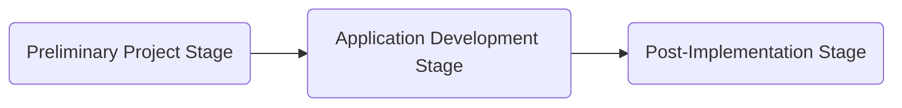

## 14.3 Internal-Use Software (Capitalization, Amortization Rules)

Internal-use software (IUS) plays a pivotal role in modern business operations, enabling companies to streamline processes, enhance customer experiences, and maintain robust data management practices. Due to its growing significance, understanding the accounting treatment of internal-use software under U.S. GAAP is critical for financial professionals. In this section, we delve into authoritative guidance, highlight the different project stages, discuss capitalization rules, explore amortization approaches, and examine common pitfalls. We will also illustrate these concepts with practical examples and diagrams, further equipping you to apply them in real-world scenarios.

-------------------------------------------------------------------------------

### Definition and Scope of Internal-Use Software

In the context of U.S. GAAP, internal-use software refers to software acquired, developed, or modified solely to meet the needs of an entity’s internal operations. This contrasts with software intended for sale, lease, or licensing to external parties. The Financial Accounting Standards Board (FASB) provides guidance under Accounting Standards Codification (ASC) 350-40, “Internal-Use Software,” which governs the capitalization and subsequent measurement of software costs.

Key points regarding the scope:
• Internal-use software is acquired or developed to meet an entity's specific internal needs.  
• There is no substantive plan to market the software externally.  
• The software's functionality primarily supports internal processes, data management, or service delivery within the organization.  

-------------------------------------------------------------------------------

### Overview of Applicable Accounting Guidance

ASC 350-40 (“Intangibles—Goodwill and Other—Internal-Use Software”) outlines the general framework for recognizing and measuring costs incurred in developing or acquiring software for internal use. The standard provides explicit guidelines to determine:
• Which costs should be capitalized.  
• Which costs should be expensed.  
• The timing of capitalization relative to the various stages of development.  
• The useful life of the software and the appropriate methods of amortization.  

In practice, these rules ensure consistency and comparability of software-related accounting, enabling stakeholders to assess the return on IT investments and evaluate an entity's financial health more accurately.

-------------------------------------------------------------------------------

### The Three Stages of Internal-Use Software Development

ASC 350-40 divides the internal-use software lifecycle into three primary stages. Correctly distinguishing among these stages is essential for accurate financial reporting and compliance:

1. Preliminary Project Stage (often referred to as the “Planning” stage).  
2. Application Development Stage (active development and customization).  
3. Post-Implementation/Operation Stage (maintenance and day-to-day operations).

Below is a mermaid diagram illustrating these stages:

Each stage entails specific accounting treatment, predominantly distinguishing between activities where costs must be expensed and activities where costs can be capitalized.  

#### Preliminary Project Stage  
During the preliminary project stage, management typically explores technical alternatives, determines project feasibility, and refines project objectives. Activities might include:  
• Evaluating vendor proposals.  
• Conducting conceptual formulation and defining system needs.  
• Selecting hardware or software vendors.  
• Drafting initial designs and architectural concepts.

All costs incurred during the preliminary project stage are **expensed as incurred**. At this point, there is no firm commitment to develop the software, and many of these costs relate to feasibility studies, research, or brainstorming. The principle here is akin to R&D expenses, which are generally expensed until technological feasibility or a clear plan for development has been established.

#### Application Development Stage  
The application development stage begins once the decision is made to proceed with software development or purchase. Typically, the entity has decided on specific functional components, and the development or customization of software has commenced. This stage covers activities such as:
• Coding, software configuration, and integration.  
• Installing hardware and software necessary for development.  
• Testing software modules and functionalities (prior to acceptance testing).  
• Designing software interfaces and specifying coding structures.

During the application development stage, **certain direct and incremental costs** associated with coding, configuration, and testing (before the software is substantially complete) **are capitalized**. This includes costs for employees directly involved in the internal-use software project (e.g., salaries and wages of software developers) related to the programming or coding of the software. It also encompasses third-party consulting fees if external programmers or software engineers are contracted to build or customize the product.

However, overhead-type costs—for instance, general administrative or overhead employee costs—are typically not capitalized unless they are directly attributable to the software development project. Additionally, training costs for staff to use the new software are expensed. Only the specific costs that add future economic value to the software under development are to be capitalized.

#### Post-Implementation/Operation Stage  
The final stage begins once the software is ready for its intended use—this typically coincides with substantial completion and user acceptance. Subsequent costs in the post-implementation stage generally relate to:
• Day-to-day software maintenance.  
• Routine repairs to keep the software operational.  
• User support and troubleshooting.  
• Minor or cosmetic updates that do not add new functionality.

All such maintenance and support costs are **expensed as incurred**. Only if additional development or major upgrades substantially enhance the software’s existing functionality or significantly improve performance can costs be capitalized again under the application development cost guidance.

-------------------------------------------------------------------------------

### Capitalization Rules and Considerations

The guiding principle is to capitalize expenditures that directly enhance the future economic benefit of internal-use software. The general considerations include:

• **Direct Costs:** For internal software developers, direct costs include salaries, wages, and payroll taxes for the hours spent actively coding or configuring the software. If an entity has a robust time-tracking mechanism, it can allocate a proportionate share of staff costs to the project for capitalization (only for the period covering the application development stage).  
• **Third-Party Costs:** If a company pays external vendors or consultants to develop the software, these costs can be capitalized, provided they occur during the application development stage and directly contribute to the creation or enhancement of internally used software.  
• **General and Administrative (G&A) Costs:** Typically not capitalizable unless they are directly associated with software development activities.  
• **Training and Data Conversion:** Excluded from capitalization and expensed as incurred because they do not directly result in new or enhanced software functionality.  
• **Indirect Costs:** Indirect overhead that cannot be directly tied to the development effort is expensed.  

Capitalized costs should be recorded as an asset on the balance sheet in the “Intangible Assets” or “Property, Plant, and Equipment” section, depending on the entity’s accounting policies and the nature of expenditures for intangible assets. It is essential to maintain clear documentation and time allocation records to ensure only eligible costs go into capitalization.

-------------------------------------------------------------------------------

### Amortization of Internal-Use Software

#### Commencement and Useful Life

Once the software is ready for its intended use—i.e., when it has passed acceptance testing and is placed into service—capitalized costs for internal-use software are amortized over its **estimated useful life**.  
• The amortization period typically begins when the software is fully operational and performing as intended.  
• The useful life is usually determined by considering how long the software is expected to provide value to the entity, its anticipated upgrades or obsolescence, and the pace of technological change in the industry.  

In practice, many companies select an estimated useful life ranging from three to seven years, depending on the nature of the software and the industry’s pace of innovation.

#### Amortization Methods

Under U.S. GAAP, the **straight-line method** is most commonly used to amortize internal-use software. Straight-line amortization allocates the capitalized cost evenly across the chosen life (e.g., if a software asset costing $500,000 is amortized over five years, the amortization expense is $100,000 per year).

Other methods (e.g., sum-of-the-years’-digits or units-of-production) can be used if they better reflect the pattern in which the software’s economic benefits are consumed. However, simplicity and consistency often drive entities to adopt straight-line amortization.

In formulaic form, if C is the capitalized cost and n is the estimated useful life in years:

  Amortization\_expense\_per\_year = \\(\frac{C}{n}\\)

Depending on whether an accelerating pattern of benefit is clearly established, a method alternative to straight-line might be justified.  

#### Impairment Testing

Internal-use software is subject to impairment testing under the same general framework that applies to other long-lived assets (ASC 360). Indicators for impairment may include significant changes in technology, usage, or economic conditions. If the carrying amount of the internal-use software exceeds its fair value and is not recoverable, an impairment loss should be recognized.

-------------------------------------------------------------------------------

### Post-Implementation Maintenance and Enhancements

Though post-implementation costs are generally expensed, companies must identify if certain post-implementation costs actually meet the criteria for capitalization of software enhancements. If the upgrade or update:  
1. Expands or enhances the software’s earlier capabilities, and  
2. Produces additional benefits or new functionalities,

then those costs might be capitalized under the application development cost guidance. It is critical to maintain thorough documentation that clearly distinguishes routine maintenance (expensed) from significant enhancements (capitalized).

-------------------------------------------------------------------------------

### Special Considerations and Emerging Trends

#### Cloud Computing Arrangements

A growing area of confusion in practice involves cloud hosting or Software-as-a-Service (SaaS) arrangements. In these arrangements, the entity does not typically own the software (i.e., it’s not truly “internal-use software”), but rather pays a subscription fee to access and use the software. Generally, subscription fees are expensed as incurred unless the arrangement meets certain criteria that would allow capitalizing implementation costs.  

ASC 350-40 was updated to address implementation costs in cloud computing arrangements, aligning their treatment with that of internal-use software only if specific conditions are met (e.g., the arrangement is or contains a software license). Companies must carefully analyze whether a contract conveys a right to control or license software or is purely a service.

#### Convergence with IFRS

While IFRS does not have a specific standard explicitly dedicated to internal-use software—IFRS typically analyzes such costs under IAS 38 (Intangible Assets)—the principles are broadly consistent. IFRS also requires that pre-development expenditures be expensed until the software is considered feasible for development. However, differences in specific terminology and detail often exist, and IFRS can allow more judgment in certain areas. U.S. entities that are subject to IFRS reporting in foreign jurisdictions should carefully assess these distinctions.

-------------------------------------------------------------------------------

### Illustrative Example

#### Case Study: Software Customization Project at Omega Co.

Omega Co. decided to build an in-house customer relationship management (CRM) system rather than purchasing an off-the-shelf solution. Below is the breakdown of costs incurred during the project timeline:

• Preliminary Project Stage:
  – Conceptual studies and vendor evaluations: $50,000  
  – Creation of the business requirements document: $10,000  

• Application Development Stage:
  – In-house developers’ salaries during coding: $180,000  
  – Consultant fees for modules integration: $70,000  
  – Quality assurance testing prior to acceptance: $50,000  
  – Data conversion from an older system: $30,000  

• Post-Implementation Stage:
  – Maintenance updates for minor bugs: $5,000/month  
  – Customer service staff training: $25,000  

Based on ASC 350-40:
1. **Preliminary Project Stage Costs** ($60,000 total) are expensed as incurred.  
2. **Application Development Stage Costs** related to the developers’ salaries, consultant fees, and QA testing ($300,000 total) are capitalized. However, data conversion expenses ($30,000) are expensed.  
3. **Post-Implementation Stage Costs** such as maintenance ($5,000/month) and training ($25,000) are expensed as incurred.  

At the end of the development stage, Omega Co. capitalizes $300,000 of software costs. Assuming they place the software into service on January 1 of the following year with an estimated useful life of 5 years, Omega Co. records $60,000 in amortization expense annually ($300,000 / 5 years). Maintenance costs and other post-implementation fees remain on the income statement as expenses.

-------------------------------------------------------------------------------

### Best Practices and Common Pitfalls

#### Best Practices

1. **Implement Rigorous Project Management:** Document each phase (preliminary, development, post-implementation) with a clear scope and timeline. This helps isolate costs and apply the correct accounting treatment.  
2. **Maintain Robust Time-Tracking:** Accurately record time spent by programmers, ensuring direct costs are identified and allocated properly to capitalize only those hours spent on software development activities.  
3. **Establish Clear Capitalization Policies:** Draft internal policies consistent with ASC 350-40 to guide employees on how to classify software-related expenditures.  
4. **Perform Periodic Reviews:** Reassess the ongoing status of the software project, particularly if there are significant scope changes or functional enhancements.

#### Common Pitfalls

1. **Misclassifying Stages:** Failing to distinguish between preliminary and application development stages can lead to improper capitalization of costs that should be expensed.  
2. **Capitalizing Training and Maintenance Costs:** These costs do not meet capitalization requirements and must be expensed.  
3. **Lack of Documentation:** Insufficient records of hours and tasks performed can lead to inaccurate capitalization and potential audit issues.  
4. **Ignoring Impairment Indicators:** Entities sometimes overlook changing technology or underutilization, missing the point at which an impairment test is triggered.

-------------------------------------------------------------------------------

### Diagrams & Tables for Quick Reference

Below is a concise table summarizing which types of costs are capitalized vs. expensed in each stage:

| Development Stage               | Example of Costs                         | Treatment         |
|---------------------------------|------------------------------------------|-------------------|
| Preliminary Project Stage       | Feasibility studies, vendor evaluation   | Expense           |
| Application Development Stage   | Coding, testing (prior to acceptance), direct consulting | Capitalize        |
| Application Development Stage   | Data conversion, general overhead        | Expense           |
| Post-Implementation/Operation   | Maintenance, training, user support      | Expense           |
| Post-Implementation/Operation   | Major upgrades adding new functionality  | Potential Capitalize (if criteria met) |

-------------------------------------------------------------------------------

### References and Further Readings

Below are resources for additional guidance and deeper study on internal-use software and related intangible asset accounting:

1. Financial Accounting Standards Board (FASB) ASC 350-40, “Internal-Use Software.”  
2. FASB ASC 360, “Property, Plant, and Equipment” (for impairment guidance).  
3. IAS 38, “Intangible Assets,” for IFRS perspective on capitalization vs. expensing (non-U.S. GAAP).  
4. AICPA Practice Aid, “Assets Acquired to Be Used in Research and Development Activities.”  
5. The AICPA’s “Audit and Accounting Guide: Software Entities” for additional insights.

-------------------------------------------------------------------------------

## SEO-Optimized Quiz on Accounting for Internal-Use Software



### Which stage of internal-use software development typically involves expensing research, evaluations, and feasibility studies?

- [ ] Application development stage
- [x] Preliminary project stage
- [ ] Post-implementation stage
- [ ] Amortization stage

> **Explanation:** The preliminary project stage focuses on feasibility assessments, vendor evaluations, and conceptual formulation. Under ASC 350-40, costs during this stage are expensed as incurred.

### Which of the following is generally capitalized during the application development stage?

- [ ] Feasibility study costs
- [ ] Data conversion expenses
- [x] Direct coding and programming costs
- [ ] Employee general overhead costs

> **Explanation:** Direct costs such as coding and programming can be capitalized once the project has moved from the preliminary stage into the application development stage, whereas feasibility studies, data conversion, and overhead are typically expensed.

### True or False: Routine maintenance costs that occur after the software is available for use should be capitalized if they are minor but frequent.

- [ ] True
- [x] False

> **Explanation:** Routine maintenance costs are expensed as incurred under ASC 350-40. Only major enhancements that add new or significantly improved functionality qualify for capitalization.

### A company implements major modifications that extend the existing software's capabilities. Under what circumstances can these updates be capitalized?

- [ ] Always, since any update to existing software is capitalizable
- [ ] Never, since the software is already operational
- [ ] Only if the update is performed by the original software developer
- [x] Only if the modifications substantially enhance capabilities or functionality

> **Explanation:** Subsequent enhancements that provide new or substantially expanded functionality beyond the original design can be capitalized, consistent with ASC 350-40 guidelines.

### What is the most commonly used method to amortize capitalized internal-use software costs under U.S. GAAP?

- [x] Straight-line method
- [ ] Double-declining balance method
- [ ] Sum-of-the-years’-digits method
- [ ] Units-of-production method

> **Explanation:** While alternative methods are permitted, most companies choose the simplicity of the straight-line method to allocate software cost evenly over its estimated useful life.

### Under ASC 350-40, which of the following costs is generally expensed?

- [ ] Salaries of software developers coding in the application stage
- [ ] Consulting fees for system design in the application stage
- [x] Employee training on using the new software
- [ ] Direct incremental software customization costs

> **Explanation:** Employee training does not add future economic benefit to the software itself. Training costs are expensed under U.S. GAAP.

### A company builds internal software for its new manufacturing process. Which factor most likely triggers an impairment test under ASC 360?

- [ ] Completion of a routine update
- [x] Evidence of significant reduction in software usage or technological obsolescence
- [ ] Addition of new users
- [ ] Regular staff turnover

> **Explanation:** Recognition of potential impairment arises when the carrying value of long-lived assets, including internal-use software, may not be recoverable. Technological obsolescence or declining usage often triggers impairment analysis.

### What is the primary focus of the preliminary project stage in internal-use software?

- [ ] Operating the software daily
- [ ] Amortizing capitalized costs
- [ ] Monitoring user acceptance
- [x] Determining software feasibility and evaluating alternatives

> **Explanation:** The preliminary project stage focuses on research and feasibility studies, vendor assessments, and decision-making about whether to proceed with the project or not.

### Under ASC 350-40, which is an example of a direct cost that can be capitalized?

- [ ] General marketing expenses
- [ ] Network infrastructure upgrades that partially relate to the new software
- [x] Salary of a developer who codes the software modules
- [ ] IT support staff unassociated with project tasks

> **Explanation:** Direct development costs that are clearly attributable to the project during the application development stage are capitalizable. Developer time spent on coding is a prime example.

### When does amortization for internal-use software typically begin?

- [x] When the software is ready for its intended use
- [ ] Whenever final acceptance testing fails
- [ ] During the preliminary project stage
- [ ] As soon as planning for the software begins

> **Explanation:** Amortization commences only once the software becomes operational and is placed into service for its intended use, per ASC 350-40.



-------------------------------------------------------------------------------

## For Additional Practice and Deeper Preparation

**[FAR CPA Hardest Mock Exams: In-Depth & Clear Explanations](https://www.udemy.com/course/far-cpa-mock-exams/?referralCode=F88050F8D5C76764F6BD)**

**Financial Accounting and Reporting (FAR) CPA Mocks:** 6 Full (1,500 Qs), Harder Than Real! In-Depth & Clear. Crush With Confidence!

- Tackle full-length mock exams designed to mirror real FAR questions.  
- Refine your exam-day strategies with detailed, step-by-step solutions for every scenario.  
- Explore in-depth rationales that reinforce higher-level concepts, giving you an edge on test day.  
- Boost confidence and minimize anxiety by mastering every corner of the FAR blueprint.  
- Perfect for those seeking exceptionally hard mocks and real-world readiness.  

_Disclaimer: This course is not endorsed by or affiliated with the AICPA, NASBA, or any official CPA Examination authority. All content is for educational and preparatory purposes only._


