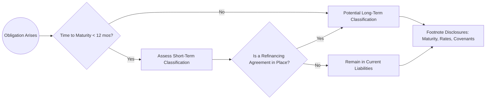

## 15.3 Classification and Presentation Considerations

Effective financial reporting for payables and accrued liabilities hinges on the accurate classification and clear disclosure of these obligations. Users of financial statements must understand the nature, timing, and terms of the debts an entity owes. The classification of liabilities affects important financial metrics—such as liquidity ratios—while transparent and consistent presentation is a key element of high-quality financial reporting.

This section will guide you through fundamental considerations for distinguishing short-term from long-term obligations, refinancing scenarios, and footnote disclosures about maturities and interest rates. Real-world examples, best practices, common pitfalls, and visual aids are included to ensure you have a comprehensive understanding of this critical topic.

---

### Overview of Liabilities Classification

In the most fundamental sense, liabilities are classified based on whether they are expected to be settled (i.e., paid or otherwise extinguished) within one year (or the operating cycle, if longer) or beyond that timeframe. The general categories are:

• Current (Short-Term) Liabilities  
• Noncurrent (Long-Term) Liabilities  

From a user’s perspective, proper classification underpins their ability to assess the liquidity and solvency of the reporting entity. Debt that becomes due soon must be managed carefully to ensure the entity remains able to meet its obligations.

---

### Short-Term vs. Long-Term Obligations

Current liabilities, also known as short-term liabilities, are obligations expected to be settled within one year or the entity’s operating cycle, whichever is longer. They include:

• Accounts payable  
• Short-term notes payable  
• Accrued liabilities (e.g., accrued salaries, accrued taxes)  
• Current maturities of long-term debt  
• Other obligations that are expected to be paid shortly  

By contrast, noncurrent or long-term liabilities typically involve repayment periods extending beyond one year. Examples include:

• Bonds payable  
• Long-term notes payable  
• Finance lease obligations  
• Asset retirement obligations (discussed further in Chapter 15.2 and Chapter 12.4)  

However, classification involves more nuances than a simple one-year cutoff. Entities must consider contractual arrangements, the possibility of refinancing, existing covenants, and the timing of required payments.

---

### Contractual Maturity Dates and Grace Periods

When determining the classification of an obligation, the contractual maturity date is a critical reference point. If an obligation is contractually due within 12 months from the balance sheet date, it is typically a current liability. Exceptions arise if an entity has a contractual right (and intent) to defer settlement beyond that period, such as through a financing agreement in place before the financial statements are issued. Additionally, grace periods within loan agreements can play a role: if a covenant breach automatically accelerates the debt but the entity has a grace period or waiver in place before issuance of the financial statements, the debt may remain a long-term liability in certain cases.

---

### The Role of Refinancing in Classification

A major area of complexity surfaces when short-term obligations can be refinanced on a long-term basis. Under both U.S. GAAP (primarily FASB ASC 470‑10) and IFRS (IAS 1), if an entity has the ability to refinance a short-term obligation on a long-term basis, the debt can often be classified as noncurrent, assuming specific conditions are met. These conditions vary slightly between frameworks but generally include:

• A formal refinancing agreement is in place before the financial statements are issued.  
• The entity demonstrates its capacity to refinance the liability on a long-term basis, typically via signed documentation or actual refinancing before the issuance date.  

One of the most common misconceptions is that mere intent to refinance is enough to justify reclassification. In practice, accounting standards generally require evidence of a firm refinancing arrangement. While minor differences in timing exist between U.S. GAAP and IFRS, the principle remains that a realistic, enforceable agreement must be in place.

#### Example: Refinancing a Short-Term Loan

Imagine that Company Alpha has a $1 million short-term loan due on December 31, 20X1. The balance sheet date is December 31, 20X0. Initially, this loan is classified as short-term because its contractual due date is within one year from the reporting date. However, Company Alpha negotiates a long-term refinancing agreement with a bank on January 25, 20X1, before the issuance of the 20X0 financial statements (issued once the audit is complete in early February). If this agreement extends repayment beyond December 31, 20X1, and the documentation is binding, Company Alpha may classify the obligation as noncurrent in its December 31, 20X0 balance sheet.

---

### Flowchart: Classification of Short-Term Obligations

Below is a simple Mermaid.js flowchart illustrating the classification decision process for short-term obligations, including whether the entity has the ability to refinance them on a long-term basis prior to issuance of the financial statements.

```mermaid
flowchart TB
    A((Short-term Obligation)) --> B{Can it be refinanced on a long-term basis?}
    B -->|Yes<br>(Binding Agreement in Place)| C(Long-term Classification)
    B -->|No| D(Short-term Classification)
```

This diagram highlights the pivotal question: “Is there a binding long-term refinancing arrangement already in place before the financial statements are issued?” If yes, the liability may be reclassified to long-term. If not, it remains in the short-term section.

---

### Impact of Covenant Violations

Loan agreements often include financial or operational covenants. If the borrower violates a covenant, the lender may have the right to call the loan immediately due. In such circumstances, a long-term loan can become current. However, if the lender provides a waiver before issuance of the financial statements, allowing the company time to correct or avoid the covenant breach, the debt may remain classified as long-term.

This underscores the importance of carefully reviewing debt covenants and maintaining documentation that lenders have waived the right to demand immediate repayment. Failing to handle these waivers appropriately can lead to significant changes in the presentation of liabilities and, consequently, key ratios such as the current ratio and debt-to-equity ratio.

---

### Presentation in the Financial Statements

On the balance sheet, liabilities should be presented in order of their maturity or in order of liquidity. Common headings in the liabilities section include:

• Current Liabilities  
• Noncurrent Liabilities (or Long-Term Liabilities)  

Some entities present further subdivisions to highlight specific major obligations, such as “Current Portion of Long-Term Debt,” “Short-Term Debt,” and “Long-Term Debt.” The classification serves both users’ need for clarity and regulatory requirements that specify certain headings.

#### Aggregation vs. Disaggregation

While it is acceptable to group similar liabilities into major captions, certain items warrant separate line items—particularly if doing so is essential to help users appreciate the nature and timing of the obligation. For example, you might see lines such as “Accounts Payable—Trade” and “Accounts Payable—Related Parties,” each distinctly shown if such a disaggregation is material to the users of the financial statements.

---

### Footnote Disclosures

Beyond placing liabilities under current or noncurrent sections, authoritative accounting standards impose specific footnote disclosure requirements that provide readers with detail and context. These disclosures generally address:

• Maturity schedules setting forth annual principal repayments for each of the next five years.  
• Interest rates (fixed vs. variable) and the range of interest rates or weighted-average interest rate.  
• Terms and conditions of significant debt agreements, including collateral, restrictive covenants, and grace periods.  
• Refinancing agreements or subsequent events that alter classification.  

Footnotes should also include a discussion of any contingencies or conditions that could accelerate or postpone repayment. Clarity in these disclosures can significantly impact a user’s interpretation of the financial position. If an entity has significant short-term debt arrangements, such as lines of credit or commercial paper, enumerating key details—maximum borrowings outstanding, average borrowings, interest rates—in a separate section can create greater transparency.

#### Maturity Schedule Example

Companies often present tabular schedules in a footnote that summarize the future maturities of long-term debt, for example:

| Year             | Amount (in USD) |
|------------------|-----------------|
| 20X1             | 500,000         |
| 20X2             | 750,000         |
| 20X3             | 900,000         |
| 20X4             | 1,000,000       |
| 20X5 and beyond  | 2,800,000       |
| Total           | 5,950,000       |

This table helps users visualize when major debt maturities occur and assess the company’s ability to meet these obligations based on projected cash flows.

---

### Interest Rate Disclosures

Interest expense is often a significant line item for entities carrying substantial debt. U.S. GAAP and IFRS mandate disclosures concerning both the nominal (stated) and effective interest rates, especially for significant debt agreements. Common items disclosed include:

• Fixed vs. variable interest rates and the basis for variability (e.g., LIBOR or SOFR plus a margin).  
• Effective interest rate if any discount or premium amortization significantly differs from the stated rate.  
• Debt issuance costs capitalized and how they are amortized.  

A brief formula for calculating interest expense under a standard simple interest formula is:


\text{Interest Expense} = \text{Principal} \times \text{Annual Interest Rate} \times \text{Time Period (in years)}


For more complex debt arrangements, such as bonds with embedded derivatives or convertible features, additional footnote disclosures and calculations may be necessary. These topics are explored in greater depth in Chapter 16.

---

### Real-World Scenarios and Illustrative Examples

• A manufacturing company faces covenant violations when its debt-to-equity ratio temporarily breaches contractual limits due to a seasonal slump in sales. Because the lender grants a waiver prior to the issuance of financial statements, the debt remains in the noncurrent section.  
• A retail chain obtains a new five-year loan to refinance a short-term debt just days before its financial statements are released. With evidence of a binding agreement, the short-term debt is reported under noncurrent liabilities.  
• A technology startup includes a detailed maturity schedule in the footnotes for multiple convertible notes with different maturity dates and widely varying interest rates. This schedule, combined with narrative disclosures, provides clarity about the startup’s future cash requirements.  

---

### Common Pitfalls and Strategies to Avoid Them

• Failure to Obtain Timely Waivers: If you breach a covenant which automatically accelerates debt repayment, you must classify the debt as current unless you secure a waiver or cure the breach before the financial statements are issued.  
• Mere Intent vs. Actual Refinancing Agreement: Simply planning to refinance debt on a long-term basis is insufficient. You need a signed, enforceable commitment from a lender before issuing the financial statements to justify noncurrent classification.  
• Inconsistent Disclosure of Maturity Dates: Presenting a maturity schedule that conflicts with narrative disclosures undermines the credibility of the financial statements. Ensure all disclosures align with the actual contract terms.  
• Overlooking Interest Rate Details: In complex lending arrangements, variable and stepped rates need special disclosure to avoid misleading or incomplete footnotes.  

---

### Diagram: Putting It All Together

The following diagram depicts the overall flow for classifying different obligations and deciding the level of disclosure needed:



---

### IFRS vs. U.S. GAAP: A Brief Note

Though the fundamental principle is similar, IFRS (particularly IAS 1) often focuses on the entity’s right to defer settlement at the end of the reporting period. U.S. GAAP, under ASC 470‑10, emphasizes that an agreement must exist before the date the financial statements are issued. Companies operating across multiple reporting standards must pay attention to these timing nuances.

---

### Best Practices for Classification and Presentation

• Maintain Ongoing Communication with Lenders: Timely discussions can help avoid unforeseen covenant breaches or accelerate the renewal of credit lines.  
• Align Legal and Finance Teams: Ensure that any contractual modifications or waivers are drafted correctly and complete prior to year-end or filing dates.  
• Prepare Cross-Referenced Footnotes: Link numeric tables (e.g., maturity schedules) with explanations in the notes to avoid confusion.  
• Monitor Subsequent Events: Changes after the balance sheet date but before financial statements are issued may affect classification. (See Chapter 24 for more on subsequent events.)  

---

### Additional References for Further Study

• FASB ASC 470‑10 (Debt)  
• IAS 1, Presentation of Financial Statements (IFRS)  
• Chapter 16: Debt (Financial Liabilities) of this guide, covering bonds and notes payable in detail  
• Chapter 24: Subsequent Events, focusing on obligations and reclassifications occurring after the balance sheet date but before issuance  

---

## Mastering Debt and Payables Classification & Presentation: A Comprehensive Quiz



### How is a liability generally classified as current (short-term)?

- [x] If it is due within 12 months (or the operating cycle, if longer) unless the entity has an enforceable long-term refinancing agreement in place.
- [ ] If it has any maturity beyond 12 months but can be accelerated at the lender’s request.
- [ ] Only if the lender specifically demands immediate repayment.
- [ ] If current interest payments exceed 10% of the principal.

> **Explanation:** Liabilities are considered current if they are due within one year or the operating cycle, whichever is longer, unless there is a demonstrable long-term refinancing plan in place before issuance of the financial statements.

### Which of the following is generally required for a short-term obligation to be classified as long-term under U.S. GAAP?

- [x] A binding long-term refinancing agreement executed before the financial statements are issued.
- [ ] An informal agreement with the bank that has not been documented.
- [x] Evidence of the company’s ability to refinance in the form of an agreement or actual refinancing.
- [ ] Merely the desire to extend the repayment.

> **Explanation:** Under U.S. GAAP, intent alone is not sufficient. A binding agreement or completed refinancing must exist by the date the financial statements are issued for short-term debt to be classified as long-term.

### What is typically included in the footnotes regarding maturities of long-term debt?

- [x] A schedule showing principal payments due each year for at least the next five years.
- [ ] Only the current year’s maturity, ignoring future years.
- [ ] A separate balance sheet showing debt for each reporting period.
- [ ] The dividend payout ratio for upcoming years.

> **Explanation:** Disclosure requirements specify a maturity schedule that includes annual principal repayments for each of the next five years (or until the debt matures).

### Under what circumstance is a covenant violation most likely to force the reclassification of long-term debt to current?

- [x] If the debt covenant violation accelerates the loan without a waiver by the lender before financial statement issuance.
- [ ] If the debt covenant violation happens after the balance sheet date but prior to issuance of statements, regardless of waiver.
- [ ] If the entity provides a personal guarantee for the loan.
- [ ] If there is a formal cumulative preference shares redemption clause.

> **Explanation:** A covenant violation can accelerate debt repayment, thereby making it current. However, if a waiver is obtained before the financial statements are issued, the debt can often remain long-term, assuming the lender does not exercise its acceleration rights.

### When should interest rates on long-term obligations be disclosed in the footnotes?

- [x] When the amounts are material, or when knowledge of the rates significantly influences users’ understanding of future cash outflows.
- [ ] Only when the interest expense exceeds a certain threshold.
- [x] If the rates have a significant variable component and could change the future cost.
- [ ] Never, as rates are operational details that need not be mentioned.

> **Explanation:** Material interest rates, especially arrangements with variable or step-up rates, qualify for disclosure because they directly influence the assessment of the entity’s financial risk and cash flows.

### According to ASC 470‑10 (U.S. GAAP), which of the following is a primary requirement to classify a currently maturing debt as long-term?

- [x] The company must have a valid refinancing agreement or must have already refinanced the debt by the date the financial statements are issued.
- [ ] The company can show average forecast profits.
- [ ] The company’s board has verbally approved a debt roll-over.
- [ ] The company’s liquidity ratio is above the bank’s threshold.

> **Explanation:** ASC 470‑10 specifically states that for an entity to avoid classifying debt as current, it must either actually refinance the debt on a long-term basis or have a binding agreement in place to do so before issuing its financial statements.

### Which best practice could help avoid the surprise reclassification of long-term debt to current due to a covenant breach?

- [x] Maintaining continuous communication with lenders to obtain timely waivers.
- [ ] Only reviewing covenants once a year during the audit.
- [x] Ensuring that any covenant breach is waived or cured before financial statements are issued.
- [ ] Relying on an internal e-mail confirming the bank’s “general support.”

> **Explanation:** Continuous lender communication and proper waiver documentation are vital to prevent unexpected reclassifications, which can affect a company’s financial health indicators.

### What aspect of IFRS (IAS 1) differs most notably from U.S. GAAP in classifying liabilities as long-term?

- [x] IFRS evaluates whether the entity has the right to defer settlement at the end of the reporting period, while U.S. GAAP can consider refinancing events occurring after year-end but before issuance.
- [ ] IFRS always relies on the entity’s intent to pay.
- [ ] U.S. GAAP never allows subsequent refinancing to alter classification.
- [ ] IFRS does not allow any refinancing arrangements to affect classification.

> **Explanation:** Under IAS 1 (IFRS), the classification of liabilities is based on the situation as at the end of the reporting period, focusing on the entity's right to defer. In U.S. GAAP, refinancing completed (or a binding agreement obtained) before issuance may still affect classification.

### Which disclosure practice best supports transparency regarding variable-rate debt obligations?

- [x] Present a range or weighted-average interest rate, plus narrative explaining the index used for the variable portion.
- [ ] Show only the prime rate for every loan regardless of actual rates.
- [ ] Omit outlier loans to avoid confusion.
- [ ] Combine interest rates for all loans under one average rate without explaining calculations.

> **Explanation:** Disclosing a range or weighted-average interest rate along with an explanation of the underlying index helps users understand the borrowing costs’ sensitivity to market fluctuations.

### True or False: A short-term loan maturing in six months can be classified as long-term if there is no binding refinancing agreement by the time the financial statements are issued.

- [x] True
- [ ] False

> **Explanation:** If there is no legally enforceable refinancing arrangement in place by the time of issuance, or if the loan has not actually been refinanced, it remains short-term under U.S. GAAP. However, if IFRS is applied and the entity has the unilateral right at the balance sheet date to roll the debt for a long term, it might still be treated differently. The question states U.S. GAAP context, so typically this remains current unless a binding agreement or actual long-term refinancing occurs prior to issuance of the statements.



---

## For Additional Practice and Deeper Preparation

**[FAR CPA Hardest Mock Exams: In-Depth & Clear Explanations](https://www.udemy.com/course/far-cpa-mock-exams/?referralCode=F88050F8D5C76764F6BD)**  

**Financial Accounting and Reporting (FAR) CPA Mocks:** 6 Full (1,500 Qs), Harder Than Real! In-Depth & Clear. Crush With Confidence!

- Tackle full-length mock exams designed to mirror real FAR questions.  
- Refine your exam-day strategies with detailed, step-by-step solutions for every scenario.  
- Explore in-depth rationales that reinforce higher-level concepts, giving you an edge on test day.  
- Boost confidence and minimize anxiety by mastering every corner of the FAR blueprint.  
- Perfect for those seeking exceptionally hard mocks and real-world readiness.  

_Disclaimer: This course is not endorsed by or affiliated with the AICPA, NASBA, or any official CPA Examination authority. All content is for educational and preparatory purposes only._
