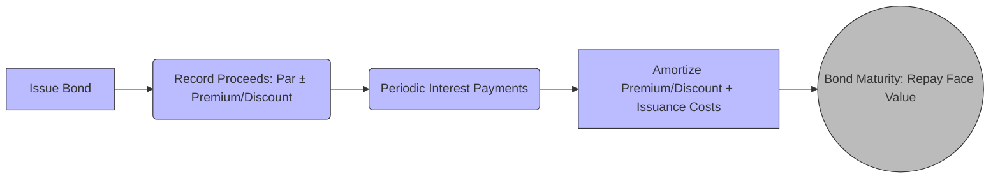

## 16.1 Notes Payable, Bonds Payable, Debt Issuance Costs

Debt instruments are a cornerstone of corporate finance, providing entities with a means to raise capital for everything from day-to-day operations to major expansion projects. This section explores the accounting treatment of notes payable, bonds payable, and the associated debt issuance costs under U.S. Generally Accepted Accounting Principles (GAAP). By understanding the nuances of these liabilities, you will be well-prepared to handle exam questions and real-world scenarios involving debt. We also discuss net vs. separate presentation of issuance costs and compare different premium and discount amortization approaches—two topics that frequently arise on the CPA exam.

Building on foundational concepts from previous chapters (particularly those covering the balance sheet and financial statement disclosures), this section provides the bedrock knowledge needed to assess and record debt transactions accurately.

---

### Introduction to Notes Payable and Bonds Payable

Both notes payable and bonds payable represent formalized debt obligations. Although the underlying principle—borrowing money that is to be repaid at a future date—is the same, the key differences lie in their structure, issuance, redemption terms, and sometimes regulatory requirements.

• Notes Payable  
Typically, a promissory note that can be short-term or long-term. Entities often use notes payable to fund immediate working capital needs or to finance specific capital expenditures. Interest rates, maturity dates, and repayment schedules can vary widely.

• Bonds Payable  
A more structured and often larger-scale debt instrument, usually issued to multiple investors in capital markets. Bonds tend to have a defined coupon rate, principal (face) amount, maturity date, and specified interest payment intervals.

Organizations may choose between notes and bonds depending on factors such as desired interest rate, prevailing market conditions, regulatory compliance options, and the duration of capital needs.

---

### Recognition and Measurement

Under U.S. GAAP, both notes and bonds payable are generally measured at amortized cost. Upon issuance, the entity initially recognizes the liability at the proceeds received, adjusted for any premiums, discounts, or issuance costs. Over the life of the debt, the entity systematically amortizes these amounts via interest expense.

##### Initial Recognition Example

• A corporation issues a $1,000,000 bond with a coupon rate of 5%, payable semiannually for 5 years.  
• The market (effective) interest rate is also 5%, so the bond is issued at par (i.e., $1,000,000).  
• The issuer records the carrying value of $1,000,000 and establishes interest expense at 5% of $1,000,000 over time.

If, in contrast, the market interest rate is higher than the coupon rate, the bond would be issued at a discount (proceeds < face value). Conversely, if the market rate is lower than the coupon rate, the bond would be issued at a premium (proceeds > face value).

---

### Notes Payable

Notes payable are written promises to pay a specified amount (the principal) plus interest at one or more future dates. Depending on financing and business needs, notes can be short-term or long-term:

• Short-term notes payable  
  Typically due within one year. Interest is often paid when the note matures.

• Long-term notes payable  
  Extend beyond one year, possibly including multiple interest payment periods and a final balloon payment at maturity.

When an entity issues a note, the borrower debits the cash account (or the asset account, if obtaining some other resource instead of cash) and credits a “Notes Payable” liability. Over the life of the note, the borrower records interest expense and interest payable (or cash disbursements, if the interest is paid periodically).

### Bonds Payable

Bonds payable usually involve large sums and are broken into smaller denominations (e.g., bonds with a par value of $1,000) that are offered to multiple investors. Bonds tend to have specific issuance features:

• Coupon or stated interest rate (printed on the bond certificate)  
• Maturity date  
• Interest payment frequency (annually, semiannually, quarterly)  
• Call or convertible features (where applicable)

#### Issuance at Premium or Discount

The bond’s face rate (coupon rate) is compared to the market (effective) rate at issuance.  
• If the coupon rate > market rate, investors pay more than the face value (premium).  
• If the coupon rate < market rate, investors pay less than the face value (discount).  
• If the coupon rate = market rate, the bond is issued at par (face value).

The premium or discount is fundamentally an adjustment to yield the market’s effective interest rate. Over the life of the bond, the issuer systematically “amortizes” the premium or discount, effectively bringing the carrying amount of the bond closer to its maturity (face) amount.

---

### Debt Issuance Costs and Presentation

Debt issuance costs include underwriting fees, legal fees, accounting fees, and printing costs directly attributable to issuing the bond or note. Under U.S. GAAP, an entity presents the debt issuance costs as a direct deduction from the carrying amount of the related debt. This results in the net liability presentation, rather than a separate asset. Over time, these costs are amortized to interest expense, similar to the approach for discount or premium amortization.

#### Net vs. Separate Presentation

Prior to ASU 2015-03, debt issuance costs were often capitalized as an asset (deferred charges) and amortized. Now, generally accepted practice demands that they be presented as a direct offset to the corresponding debt liability:

• Net Presentation:  
  The carrying amount of the liability is reduced by the unamortized debt issuance costs on the balance sheet (U.S. GAAP requirement for typical bonds/notes).  

• Separate Asset Presentation:  
  In some limited cases (e.g., revolving credit arrangements), debt issuance costs may remain as assets if they are associated with securing a line of credit rather than issuing fixed-term debt. However, for most standard note or bond issuances, net presentation applies.

---

### Accounting Entries: An Illustrative Example

Below is a conceptual overview of how a bond issued at a discount with issuance costs might be recorded initially and subsequently amortized. This example also highlights the net presentation of the issuance costs.

1) A corporation issues $500,000 of 10% bonds with a 5-year term, payable semiannually. The market rate is 12%, so the bond is sold at a discount. The present value of the bond is $460,000. Additionally, the corporation incurs $5,000 in issuance costs.  
2) The corporation will present on its balance sheet a net bond liability of $455,000 ($460,000 − $5,000).  
3) Over the life of the bond, the discount of $40,000 ($500,000 − $460,000) plus the $5,000 in issuance costs are amortized to interest expense.

#### Journal Entries

• At issuance:  
  Cash (debit) …………………………… 455,000  
  Discount on Bonds Payable (debit) ……. 45,000 (the $40,000 bond discount + $5,000 bond issuance cost)  
  Bonds Payable (credit) ……………… 500,000  

• Over time (semiannual interest payment + amortization):  
  Interest Expense (debit) ……………… XXX  
  Discount on Bonds Payable (credit) ….. XXX  
  Cash (credit) ………………………… XXX (if interest is paid in cash)  

The exact amount of discount amortization in each period depends on whether the straight-line method or the effective interest method is used.

---

### Effective Interest vs. Straight-Line Amortization

Investors and creditors care about the effective interest rate on their debt. Accordingly, GAAP prefers the effective interest method for amortization of discounts and premiums, as it provides a constant rate of interest over the bond’s life relative to the liability’s carrying amount.

#### Effective Interest Method

Under the effective interest method, the interest expense for each period is the carrying value of the debt at the beginning of the period multiplied by the effective interest rate. The difference between this interest expense and the actual cash interest payment is the amortization of the premium or discount.

The following table provides a simplified schedule for a 3-year, $100,000 bond with a 10% stated rate, issued at a discount to yield 12%. For simplicity, assume annual coupon payments.

Carrying Values and Interest (Example)

| Date       | Beginning CV  | Interest Expense [(Beg. CV) × 12%] | Cash Paid [(Face) × 10%] | Amortized Discount | Ending CV (Beg. CV + Discount Amort.) |
|------------|---------------|-------------------------------------|--------------------------|---------------------|----------------------------------------|
| Issuance   | $ 92,810      | -                                   | -                        | -                   | $ 92,810                               |
| End of Yr1 | $ 92,810      | $ 11,137                            | $ 10,000                | $ 1,137            | $ 93,947                               |
| End of Yr2 | $ 93,947      | $ 11,273                            | $ 10,000                | $ 1,273            | $ 95,220                               |
| End of Yr3 | $ 95,220      | $ 11,426                            | $ 10,000                | $ 1,426            | $ 96,646                               |

By the end of Year 3, the carrying value is closer to the $100,000 face value. Over the life of the bond, the total of discount amortized equals $7,190 ($100,000 − $92,810).

#### Straight-Line Method

Although GAAP prefers the effective interest method, some entities use the straight-line method if the difference from the effective method is not materially different. Under the straight-line approach, the total premium or discount is divided evenly over the number of interest periods. An equal amount is amortized each period, resulting in a simpler but potentially less accurate reflection of the time value of money.

---

### Using Diagrams to Understand Bond Amortization

Below is a Mermaid diagram illustrating the high-level flow of a bond’s life cycle, from issuance to final payment. Here, “Issue Bond” is the starting point, with coupon payments made periodically, leading to final redemption at maturity.

1. At “Issue Bond,” the entity receives proceeds, records the liability, and recognizes any discount/premium or issuance costs.  
2. Periodic interest payments occur each period.  
3. Concurrently, the discount/premium and debt issuance costs are amortized.  
4. At maturity, the face value is repaid, bringing the carrying value to zero (or in the case of certain calls or conversions, modifications apply based on the bond’s terms).

---

### Real-World Considerations and Case Studies

#### Case Study: Early Extinguishment of Debt

A company issues $2,000,000 of bonds for a net carrying amount of $1,950,000 (after discount and unamortized issuance costs). Two years later, with interest rates at a historic low, the company retires the bonds early by paying investors $1,980,000. The company must:  
• Remove the carrying amount ($1,950,000).  
• Record a loss on extinguishment for the difference between the reacquisition price ($1,980,000) and the net carrying amount ($1,950,000)—a $30,000 charge to the income statement.  
• Eliminate any related unamortized bond premium, discount, and issuance costs at the time of retirement.

#### Case Study: Modifications and Debt Restructuring

Sometimes, entities negotiate changes to existing debt terms, either due to financial distress or to take advantage of favorable market conditions. Professionals must carefully evaluate whether the changes constitute a new debt instrument (substantial modification) or are simply adjustments to existing debt (non-substantial modification). Any unamortized debt issuance costs might be carried forward or written off, based on these determinations.

---

### Common Pitfalls

• Failing to Amortize Issuance Costs Properly  
  Some assume issuance costs are immediately expensed, which is incorrect. They are capitalized (as a direct reduction of debt) and amortized over the debt’s life.

• Incorrectly Classifying Premium/Discount  
  Proper classification is crucial. A discount arises when the market rate > coupon rate. A premium arises when the coupon rate > market rate. Errors in this classification lead to incorrect interest expense recognition.

• Inconsistent Methods of Amortization  
  Using the straight-line method in one period and then switching to effective interest in the next period without justification can result in misstatements. GAAP typically prefers the effective interest method unless the variances are immaterial.

• Overlooking Disclosure Requirements  
  Entities must disclose the nature of debt, maturity dates, interest rates, call provisions, collateral, and other critical details. Adequate footnote disclosures help users of financial statements assess the timing, amount, and uncertainty of future cash flows.

---

### Best Practices and Exam Strategies

• Make sure to dissect the bond or note’s key terms: face value, coupon rate, timing of payments, maturity date, and any special features (e.g., convertible debt, callable bonds).  
• Use the time value of money tables or a financial calculator (depending on exam or test environment rules) to compute present values accurately.  
• Always consider if the difference between straight-line and effective interest is material. For CPA Exam questions, the effective rate method typically applies unless otherwise stated.  
• Pay extra attention to the net presentation requirements for issuance costs and understand that these are credited or debited to a valuation account rather than recognized as a separate asset on the issuer’s balance sheet.  
• When dealing with advanced topics like troubled debt restructuring or modifications, carefully assess how existing unamortized issuance costs and any discount/premium are treated.  
• Practice multiple iterations of amortization tables—both for discount and premium scenarios. The best way to master these concepts is to work through examples step by step.

---

### References and Further Reading

• FASB ASC 835-30, “Imputation of Interest,” for guidance on imputing interest when no stated rate or a below-market rate exists.  
• FASB ASC 470-10, “Debt,” for classification guidance and general presentation.  
• FASB ASC 470-50, “Modifications and Extinguishments,” for early extinguishments and restructuring.  
• FASB ASC 835-20, “Interest—Capitalization of Interest,” for special cases of capitalizing interest in self-constructed assets.  
• FASB ASC 310, “Receivables,” and ASC 320, “Investments—Debt and Equity Securities,” for references to interest calculations in other contexts.  

---

## Test Your Understanding: Notes Payable, Bonds Payable, and Debt Issuance Costs



### Which statement best describes how debt issuance costs are presented on the balance sheet under U.S. GAAP?

- [ ] As a separate asset, similar to prepaid items.
- [x] As a direct deduction from the carrying amount of the related debt.
- [ ] As a liability equal to the total issuance cost.
- [ ] Deferred and presented in Other Comprehensive Income.

> **Explanation:** Under current U.S. GAAP, debt issuance costs are shown as a direct deduction from the carrying amount of the debt and amortized to interest expense over the life of the debt.

### A company issues a long-term note payable at a discount. Which method does GAAP generally prefer to use to amortize the discount?

- [ ] Straight-line method exclusively.
- [x] Effective interest method, unless the difference from straight-line is immaterial.
- [ ] Declining balance method.
- [ ] Double-declining balance method is required for all intangible amortizations.

> **Explanation:** GAAP typically requires the effective interest method for discounts and premiums, as it reflects the time value of money more accurately. The straight-line method may be acceptable if it does not produce materially different results.

### What happens to the unamortized premium or discount on bonds payable when the bonds are retired early?

- [ ] It remains in equity.
- [ ] It is recognized as part of additional paid-in capital.
- [x] It is included in the gain or loss on extinguishment of debt.
- [ ] It becomes a deferred asset.

> **Explanation:** Upon early extinguishment of debt, any unamortized portion of premium or discount is netted against the reacquisition price to arrive at the gain or loss on extinguishment.

### If a bond is issued at a price higher than its face amount, which of the following is most likely true?

- [x] The stated (coupon) rate on the bond exceeds the prevailing market interest rate.
- [ ] The bond was issued in an oversubscribed market.
- [ ] The coupon rate matches the effective yield.
- [ ] No interest will be paid until maturity.

> **Explanation:** When a bond’s coupon rate is greater than the market interest rate, investors are willing to pay more (a premium) for the higher interest payments, resulting in proceeds above the bond’s face value.

### When is the straight-line method for amortizing a bond discount or premium permitted?

- [x] Only when it is not materially different from the effective interest method.
- [ ] Always required for note and bond disclosures.
- [x] If specifically stated in the debt agreement.
- [ ] Never; it is prohibited by GAAP.

> **Explanation:** GAAP generally prefers the effective interest method, but the straight-line method may be used if the results are not significantly different from the effective interest method or if it is specifically allowed in the question or real-world scenario.

### Which of the following directly affects the carrying amount of notes or bonds payable over time?

- [x] Amortization of premiums or discounts.
- [ ] Stock dividends declared.
- [ ] Changes in the inflation rate.
- [ ] Depreciation of fixed assets.

> **Explanation:** The amortization of a premium or discount systematically increases or decreases the carrying value of the debt until it reaches the face amount at maturity. Other listed options are unrelated to carrying values of notes/bonds payable under U.S. GAAP.

### Why do bond issuers utilize a discount account rather than simply recording the bond liability at the net amount?

- [x] To disclose the difference between the bond's face and its issue price.
- [ ] Because GAAP prohibits netting in all circumstances.
- [x] To show the time value of money in a separate account on the balance sheet.
- [ ] To facilitate easier tax reporting for the IRS.

> **Explanation:** The discount or premium account provides clear disclosure of how a bond’s carrying value differs from its face amount. This highlights the impact of market interest rates on issuance and aids in understanding future interest expenses.

### Under the effective interest method, how is interest expense computed in each period for a discounted bond?

- [x] By multiplying the beginning carrying amount of the bond by the market (effective) interest rate.
- [ ] By using the bond’s contractual coupon rate only.
- [ ] By dividing total discount over the total number of periods.
- [ ] By matching the coupon payment and ignoring any difference.

> **Explanation:** The effective interest method calculates interest expense based on the bond's carrying value at the start of each period multiplied by the constant effective interest rate. The difference between expense and the coupon payment is the amortization of the discount or premium.

### Which of the following is a key disclosure related to debt on the financial statements?

- [x] Maturity dates, interest rates, and call provisions.
- [ ] Age of the primary shareholders.
- [ ] Settlement dates for derivative equity instruments only.
- [ ] Scope of intangible asset valuations.

> **Explanation:** Disclosures about debt typically include maturity schedules, stated interest rates, call or conversion features, collateral, and other details that inform creditors and investors about the nature of the debt and repayment terms.

### If a borrower has debt issuance costs associated with a revolving credit facility, how are those costs generally presented under U.S. GAAP?

- [x] They may remain as an asset, subject to amortization, rather than a direct deduction of the debt.
- [ ] They must be directly netted against the credit limit.
- [ ] They are immediately expensed in the current period.
- [ ] They are presented in equity as part of capital contributions.

> **Explanation:** Debt issuance costs for a revolving credit facility can sometimes be capitalized as an asset rather than deducted from the debt balance, given the nature of the arrangement. For most term debt, the costs are netted against the debt.



---

## For Additional Practice and Deeper Preparation

**[FAR CPA Hardest Mock Exams: In-Depth & Clear Explanations](https://www.udemy.com/course/far-cpa-mock-exams/?referralCode=F88050F8D5C76764F6BD)**  

**Financial Accounting and Reporting (FAR) CPA Mocks:** 6 Full (1,500 Qs), Harder Than Real! In-Depth & Clear. Crush With Confidence!

- Tackle full-length mock exams designed to mirror real FAR questions.  
- Refine your exam-day strategies with detailed, step-by-step solutions for every scenario.  
- Explore in-depth rationales that reinforce higher-level concepts, giving you an edge on test day.  
- Boost confidence and minimize anxiety by mastering every corner of the FAR blueprint.  
- Perfect for those seeking exceptionally hard mocks and real-world readiness.  

_Disclaimer: This course is not endorsed by or affiliated with the AICPA, NASBA, or any official CPA Examination authority. All content is for educational and preparatory purposes only._
