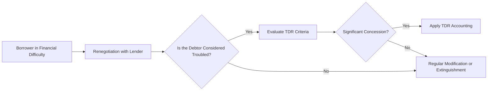

## 16.3 Covenants, Troubled Debt Restructurings, Debt Modifications

Covenants, troubled debt restructurings (TDR), and debt modifications are pivotal topics for both preparers and consumers of financial statements. They determine how debt is reported, whether modifications should be treated as extinguishments, and what disclosures are required for debt agreements. A clear understanding of these areas is essential for CPA candidates, accountants, and financial analysts. This section builds on earlier insights from Chapter 16 on Debt (Financial Liabilities) and integrates them with real-world transactions, disclosures, and advanced applications in practice.

Covenants protect the lender’s interests. Troubled debt restructurings address what happens when a borrower is in dire straits and the lender grants concessions. Debt modifications cover how debt terms can be changed and the resulting accounting treatment, distinguishing between minor changes to existing debt and a more substantial transaction that qualifies as an extinguishment.

This chapter provides a detailed framework for each of these components, reinforcing best practices, potential pitfalls, and the significance of accurate financial reporting.

---

Covenant Fundamentals

Debt covenants are contractual provisions in lending agreements designed to protect creditors by limiting borrower actions or requiring the borrower to maintain specific financial ratios. Covenants range from restrictions on leverage (debts relative to equity or EBITDA) to stipulations on dividend payments and asset dispositions. In many cases, lenders require the borrower to meet certain thresholds or maintain particular financial ratios continuously or at measurement dates (such as quarterly or annually).

Covenants also serve the borrower by clarifying the financial boundaries, thus reducing default risk. From an accounting standpoint, covenant compliance heavily influences the classification of debt (current vs. noncurrent) and can affect the cost of borrowing if a breach leads to higher interest rates or penalties.

Common Types of Covenants

• Financial Ratio Covenants: Examples include debt-to-equity ratios, interest coverage ratios (e.g., EBIT or EBITDA relative to interest expense), and fixed-charge coverage ratios.  
• Operational Covenants: These might restrict capital expenditures or large asset sales.  
• Affirmative Covenants: Require the borrower to perform certain tasks, such as providing periodic financial statements.  
• Negative Covenants: Prohibit or limit certain borrower actions, such as paying large dividends or incurring additional debt.  

Measuring Covenant Compliance

Compliance often requires periodic measurement of specific metrics as defined in the loan agreement. An entity must ensure consistency with the definitions in the agreement, which sometimes differ from Generally Accepted Accounting Principles (GAAP). For instance, “EBITDA” in a covenant might exclude certain non-cash or unusual items not excluded in GAAP EBITDA calculations.

If a borrower violates a covenant, the lender may have the right to call the debt immediately, triggering classification of the entire outstanding loan as a current liability unless a waiver or modification is obtained before the financial statements are issued. Refer to ASC 470-10 for guidance on this reclassification requirement.  

Accounting for Covenant Breaches

• Reclassification of Debt: A breach or violation generally requires reclassification of the debt as current (unless the covenant is waived).  
• Waivers Received After the Balance Sheet Date: Under certain conditions, if the waiver is received after the balance sheet date but before the financial statements are issued, the debt might remain noncurrent. The facts and circumstances must be carefully evaluated.  
• Disclosure: ASC 470 requires detailed disclosures on the nature of the covenant violation, any waivers obtained, and the terms of any modifications granted to maintain compliance.

---

Troubled Debt Restructurings (TDR)

When a borrower experiences significant financial difficulty, the lender may agree to restructure the terms of the debt. If a concession is granted to the borrower that the lender would not otherwise consider, the arrangement typically falls under the scope of a troubled debt restructuring (ASC 470-60).

This occurs when:

• The borrower is in or near default on the existing terms.  
• The lender grants concessions (e.g., reduced interest rates, extended maturity date, lower principal payments) that it would not have granted otherwise.  
• The concessions are made with the intent of accommodating the financial distress of the borrower.  

Types of TDR

• Modification of Terms: Includes changes in the interest rate, extension of maturity dates, or modification of principal amounts due.  
• Asset Swaps: The lender may accept an asset in lieu of cash to extinguish or partially extinguish the debt.  
• Equity Swaps: The lender may accept equity instruments in satisfaction of amounts owed.  

The key principle is that the lender is making an economic concession to minimize its losses because the borrower’s financial condition suggests a real risk of default.

Decision Process: TDR or Not?

Below is a simplified mermaid diagram illustrating the decision process for identifying a TDR:



Accounting for TDR

According to ASC 470-60, the borrower must measure the restructured debt based on the present value of the future cash flows (including both principal and interest) under the new terms, discounted at the original effective interest rate. The difference between this present value and the carrying amount of the debt before restructuring is recognized as a gain if the carrying amount exceeds the revised cash flow’s present value.

When a borrower transfers assets or equity instruments to the lender, the new basis for the assets or equity is fair value at the date of restructuring, with any excess of the debt’s carrying amount recognized as a gain.

Calculation of present value in a TDR for a typical note can be summarized as:

```tex

\text{Note Present Value} = \sum_{t=1}^{n} \frac{\text{Payment}_t}{(1 + i)^t}

```

where:
• “Payment_t” represents the modified scheduled payment in period t, including both interest and principal under the new terms.  
• “i” represents the original effective interest rate.  
• “n” is the number of remaining payment periods under the restructured terms.  

Disclosure Requirements

ASC 470-60 and ASC 310-40 (for creditors) mandate substantial disclosures for TDRs, including:
• Nature of the restructuring and principal changes in terms.  
• Effects on financial statements, including the gain recognized by the borrower.  
• Qualitative and quantitative details of how the borrower’s financial difficulties led to the restructuring.  

From the creditor’s perspective, TDR accounting involves evaluating any potential impairment immediately upon restructuring. The creditor employs a similar discounted cash flow analysis based on the contractual effective interest rate.  

---

Debt Modifications vs. Extinguishments

Debt modifications refer to changes to the terms of an existing obligation—such as interest rates, payment schedules, or covenants—that do not constitute a new instrument or require derecognition of the old liability. Debt extinguishments, on the other hand, occur when the borrower legally or in-substance cancels or replaces the original debt with a new obligation substantially different from the old one.

ASC 470-50 provides guidance to determine whether a modification is substantial enough to be treated as extinguishment. If the present value of the restructured cash flows under the new or modified debt terms differs from the remaining cash flows under the old debt by at least 10%, the old debt is considered extinguished. Any unamortized issuance costs or fees are recognized as a loss (or gain) on extinguishment in the income statement.

Key Considerations to Evaluate

• 10% Test: The net present value of the old and new debt is compared to determine if the difference is more than 10%.  
• Legal Form vs. Substance: Even if the legal form does not change, the lender-borrower relationship might have changed substantially in substance if there’s a significant shift in terms.  
• Fees and Costs: Fees paid to the creditor, third-party fees, or original issuance costs must be accounted for in line with ASC 470 to determine the new effective interest rate or immediate gain/loss on extinguishment.  
• Disclosure: If the modification qualifies as an extinguishment, the new liability is recorded at fair value or the proceeds received (less any issuance costs), and the old liability is removed from the balance sheet.

Illustrative Example

Assume a borrower has a $1,000,000 note payable with a carrying value of $980,000 (including unamortized discount). The lender reduces the interest rate from 8% to 5% and extends the maturity by five years. The present value of the new cash flows (discounted at the original effective rate) equals $910,000, which is more than a 10% difference from the old carrying amount (a difference of $70,000 from the old carrying amount of $980,000 is about 7%). Since 7% is less than the 10% threshold, this transaction is a modification rather than an extinguishment. The borrower amortizes any difference as an adjustment to interest expense prospectively.

If, however, the present value of new cash flows was $850,000, the difference from $980,000 would be $130,000, or 13%, which exceeds the 10% threshold. In that scenario, the borrower would record the old debt as extinguished, recognize a gain/loss, and establish a new liability with the updated terms.

---

Reflecting Covenant Compliance in Financial Statements

Debt covenants often require the maintenance of certain liquidity or leverage ratios. Proper classification of debt depends on the borrower's compliance at the measurement date. If the borrower violates a covenant that triggers a default, the entire amount of the debt must typically be classified as current unless the lender waives the covenant for a period beyond a year (or the operating cycle, if longer). 

Disclosures about covenant compliance usually include:
• Description of the covenant requirements.  
• Measurement date(s) and compliance status.  
• Potential consequences of default (acceleration of maturity, penalty fees).  
• Any waiver or forbearance agreements obtained (with details on their timelines and conditions).

Failing to provide transparent disclosures may mislead financial statement users regarding the entity’s solvency, liquidity, and creditworthiness. CPAs must guide their clients or organizations in thorough and accurate reporting.

---

Case Studies and Practical Illustrations

• A startup carrying debt subject to quarterly adjusted net worth covenants might experience volatility in compliance if it regularly invests in intangible R&D assets. Securing temporary waivers from the lender and adjusting future covenant thresholds may be necessary to avoid default.  
• A distressed retail company obtains a concession from its lender to reduce its interest rate from a high double-digit rate to a more manageable single-digit rate. The reduction is significant, and the company was close to default prior to the restructuring. This scenario is a likely candidate for TDR treatment.  
• A manufacturing entity that refinances its bond just before maturity by issuing a new bond with slightly lowered interest payments, paying moderate transaction fees to the underwriter. Upon calculation, the present value of the new cash flows is only 5% lower than the old carrying amount, so the original debt is not treated as extinguished.

---

Best Practices and Common Pitfalls

Best Practices:
• Early Monitoring of Covenants: Implement internal controls that allow management to project whether covenants will be met.  
• Proactive Communication: If default or breach is imminent, open dialogue with lenders to negotiate waivers or restructured terms.  
• Proper Documentation: Retain all legal documents, waivers, and communication with the lender; these records are crucial during audits.  
• Detailed Accounting Analysis: Use the guidance in ASC 470, including performing the 10% test (or relevant IFRS standards if applicable), to ascertain whether a modification is an extinguishment.  
• Comprehensive Disclosure: Full transparency on the nature of changes, timing, and financial impact builds confidence with investors and regulators.

Common Pitfalls:
• Neglecting to Apply the 10% Test: Casual assumptions can lead to improper classification of modifications vs. extinguishments.  
• Inconsistent Covenant Calculations: Finance teams might inadvertently use a standard GAAP ratio instead of the ratio defined specifically in the loan document.  
• Last-Minute Waiver Negotiations: Obtaining waivers post-balance sheet date can complicate classification and require additional disclosures.  
• Misclassifying Debt: Failing to reclassify long-term debt as current in a covenant breach scenario can produce materially misstated financial statements.

---

Conclusion

Covenants, troubled debt restructurings, and debt modifications are intricately connected to an entity’s credit profile and disclosure transparency. Whether considering the classification of a loan on the balance sheet, evaluating waivers, or determining the accounting for a restructured note, the guiding principle is substance over form. CPAs must carefully navigate ASC 470 guidance and maintain an acute awareness of changes to terms and the borrower’s underlying financial condition.

Successful compliance requires robust internal processes, clear documentation, and timely examination of financial ratios. When lenders and borrowers renegotiate terms—whether minor modifications or large-scale overhauls—accountants must ensure proper classification, measurement, and disclosure. Thorough mastery of these concepts not only fulfills regulatory obligations but also upholds the integrity and clarity of the financial statements.

---

## Master Your Understanding: Covenants, Troubled Debt Restructurings, and Debt Modifications Quiz



### A debt covenant typically:
- [ ] Only exists to penalize the borrower.  
- [x] Aims to protect lenders by limiting certain borrower actions.  
- [ ] Is unrelated to financial ratios or operational restrictions.  
- [ ] Ensures an automatic waiver if the borrower defaults.  

> **Explanation:** Covenants are contractual provisions designed to protect the lender’s interest by restricting or requiring certain borrower actions. They also help borrowers maintain clear financial boundaries.

### When a borrower in financial distress negotiates a reduced interest rate and extended maturity date with the lender, this scenario is most likely:
- [ ] A standard debt modification.  
- [x] A troubled debt restructuring (TDR).  
- [ ] An accounting error.  
- [ ] An immaterial covenant amendment.  

> **Explanation:** A TDR occurs when the lender grants a concession due to the borrower’s financial difficulties. Reduced interest rates and extended maturity dates commonly indicate a concession scenario.

### Under ASC 470, a debt modification is treated as an extinguishment if:
- [x] The net present value of revised cash flows differs by at least 10% from the old arrangement.  
- [ ] The borrower is in compliance with all covenants.  
- [ ] The loan has a variable interest rate that changes with market conditions.  
- [ ] The lender approves only minor changes in payment dates.  

> **Explanation:** Per ASC 470-50, the 10% test is a significant indicator; if the difference in cash flows crosses that threshold, the old debt is removed (extinguished) and the new obligation is recognized.

### A borrower transferring a piece of equipment to partially settle its debt under a TDR must:
- [ ] Record the equipment at historical cost.  
- [x] Treat the equipment transfer at fair value for settlement purposes.  
- [ ] Expel all liabilities from the balance sheet with no effect on income.  
- [ ] Recognize an expense for the carrying value of the equipment.  

> **Explanation:** In a TDR, noncash assets (or equity instruments) transferred must be measured at fair value. If the carrying amount of the debt exceeds this fair value, a gain is recognized.

### Which is the most accurate definition of “default” in the context of debt covenants?
- [x] Failure to meet a contractual obligation or violation of a covenant’s terms.  
- [ ] Reduced balance in the borrower’s bank account.  
- [x] Strategically choosing not to make a payment to improve cash flow.  
- [ ] Missing an interest payment by at most one day.  

> **Explanation:** Default is generally defined as any instance where a borrower fails to satisfy a required obligation or breaches agreed-upon covenant terms.

### A waiver for a covenant breach received after the balance sheet date but before issuance of the financial statements usually requires:
- [x] Disclosure regarding the covenant violation and the waiver terms.  
- [ ] No changes to long-term classification.  
- [ ] Immediate reclassification of debt as current.  
- [ ] Nonrecognition of the debt in the financial statements.  

> **Explanation:** When a waiver is obtained post-balance sheet but prior to issuance, ASC 470 mandates disclosure and could allow the debt to remain long term if certain conditions are met.

### In calculating the net present value for a TDR, the discount rate used is typically:
- [x] The original effective interest rate of the debt.  
- [ ] The risk-free rate at the time of restructuring.  
- [x] The new effective interest rate negotiated with the lender.  
- [ ] Any benchmark rate, at the borrower’s discretion.  

> **Explanation:** For TDR analysis under ASC 470-60, the future cash flows are discounted using the original effective interest rate of the debt, not the renegotiated rate.

### Which statement best describes a financial ratio covenant?
- [x] It requires the borrower to maintain certain numerical metrics (e.g., debt-to-equity) at specified intervals.  
- [ ] It has no relevance to the creditor’s decision-making.  
- [ ] It legally obligates the borrower to only use GAAP-endorsed measures without adjustments.  
- [ ] It mostly governs operational choices, such as vendor selection.  

> **Explanation:** Financial ratio covenants obligate the borrower to maintain certain metrics within stated thresholds, thus helping the lender monitor credit risk.

### One hazard in covenant calculations is:
- [x] Using definitions or items different from those in the loan agreement.  
- [ ] Double-checking each ratio for alignment with GAAP.  
- [ ] Collecting the data before the balance sheet date.  
- [ ] Over-disclosing the covenant details in the notes.  

> **Explanation:** Differences between GAAP-based measures and covenant-specific definitions can lead to inaccurate calculations and breach of covenant. This is a common pitfall in practice.

### A borrower in violation of a covenant that the lender has not waived should generally classify the debt as:
- [x] Current on the balance sheet.  
- [ ] Noncurrent if the borrower believes the violation is minor.  
- [ ] An off-balance-sheet item.  
- [ ] Extinguished because of the violation.  

> **Explanation:** If the lender does not waive or modify the covenant to cure the breach, the debt is typically reclassified as a current liability because the lender can demand immediate repayment.



---

## For Additional Practice and Deeper Preparation

[**FAR CPA Hardest Mock Exams: In-Depth & Clear Explanations**](https://www.udemy.com/course/far-cpa-mock-exams/?referralCode=F88050F8D5C76764F6BD)

Financial Accounting and Reporting (FAR) CPA Mocks: 6 Full (1,500 Qs), Harder Than Real! In-Depth & Clear. Crush With Confidence!

• Tackle full-length mock exams designed to mirror real FAR questions.  
• Refine your exam-day strategies with detailed, step-by-step solutions for every scenario.  
• Explore in-depth rationales that reinforce higher-level concepts, giving you an edge on test day.  
• Boost confidence and minimize anxiety by mastering every corner of the FAR blueprint.  
• Perfect for those seeking exceptionally hard mocks and real-world readiness.

_Disclaimer: This course is not endorsed by or affiliated with the AICPA, NASBA, or any official CPA Examination authority. All content is for educational and preparatory purposes only._
