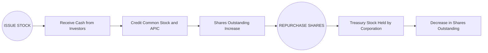

## 17.1 Stock Issuance, Treasury Stock Transactions

Effective management and accurate reporting of stock issuance and treasury stock transactions are central to understanding a corporation’s equity structure. This section builds on core concepts of Chapter 17: Equity, exploring the legal and accounting foundations of stock issuance and the treatment of treasury shares. Readers will learn how to distinguish between par-value and no-par-value stock, properly record entries and disclosures, and comprehend the effect of various repurchase methods on retained earnings and additional paid-in capital (APIC). Mastery of these principles is essential for performing well on the Financial Accounting and Reporting (FAR) section of the CPA Exam.

Stock transactions—both issuances and repurchases—significantly influence a company’s financing, capital structure, profitability, and strategic direction. This chapter covers the underlying theory, practical examples, and industry best practices to strengthen your knowledge in this critical area.

---

Stock Issuance and Par Value

Par value historically provided a minimal legal capital meant to protect creditors. Many states and jurisdictions still recognize par value as the nominal portion of each share. For instance, if a share has a par value of $1 and is sold for $15, the excess over par ($14 in this example) is recorded in APIC. At issuance, the par value is credited to Common Stock or Preferred Stock, and any amount over par is credited to APIC.

No-par-value stock, on the other hand, has no stated or nominal value. In some states, to create a capital buffer for legal protection, a “stated value” is assigned upon issuance, but this is not universal. With no-par stock, companies typically credit the entire proceeds to the stock account (Common Stock or Preferred Stock), or they may separate a portion into an APIC account if a stated value is used.

Key points about par vs. no-par stock:  
• Par-value stock assigns a legal capital amount, typically low (e.g., $1 or $0.01 per share).  
• No-par stock omits a stated nominal value. However, some states require a stated value to establish a minimum legal capital.  
• Journal entries differ slightly, but both revolve around splitting total proceeds between the par/stated value and APIC (if applicable).  
• The presence or absence of par value can affect legal and regulatory disclosures but does not inherently alter the share’s preemptive rights or voting privileges.

Example: Issuance of Par-Value Stock  
A corporation issues 1,000 shares of $1 par-value common stock for cash at $20 per share.  

Journal Entry:
• Cash (1,000 shares × $20) → Debit $20,000  
• Common Stock (1,000 shares × $1 par-value) → Credit $1,000  
• APIC–Common Stock (remainder) → Credit $19,000  

If the same 1,000 shares had no par value, and no stated value is involved, the entire $20,000 would generally be credited to the Common Stock account, unless the board assigns a stated value.

---

Common Equity Accounts and Their Significance

• Common Stock (or Preferred Stock): Represents legal capital at par or stated value.  
• Additional Paid-in Capital (APIC): Captures the amount investors pay above par or stated value. May also be called “Paid-in Capital in Excess of Par.”  
• Retained Earnings: Accumulated net income not distributed to shareholders.  
• Treasury Stock: Shares repurchased by the corporation, reported in equity as a contra account (under the Cost Method) or by reducing the stock accounts (under the Par Value Method).  

These accounts collectively reflect a company’s ownership structure and corporate governance.

---

Treasury Stock Transactions

Treasury stock represents a corporation’s repurchase of its own previously issued shares. Corporations may reacquire shares for numerous reasons:  
• Belief that the stock is undervalued on the open market.  
• Desire to increase earnings per share (EPS) by reducing the outstanding share count.  
• To have shares available for employee stock compensation plans.  
• To reduce the threat of takeover or create an internal market for shares.

In financial reporting, the reacquired shares are not an asset because a company cannot own itself in the same sense it owns other investments. Instead, treasury stock is treated as a contra-equity account or by adjusting the capital stock and APIC accounts, depending on the method used.

Two primary methods exist for accounting for treasury stock:

Cost Method  
• Under the Cost Method, the treasury shares are recorded at their reacquisition cost.  
• When the company reissues or retires the shares, any difference between the proceeds from resale (if reissued) or the original cost is usually debited or credited to APIC–Treasury Stock, if available, or to Retained Earnings (if APIC–Treasury Stock is insufficient).  
• The Treasury Stock account is presented in the Stockholders’ Equity section as a reduction of total equity.

Par Value Method  
• The Par Value Method (also known as the Stated Value Method) records treasury stock at the par value of the shares.  
• At the time of repurchase, the company debits the Treasury Stock account for the par value of the shares and debits APIC-Common Stock (or credited for excess amounts in certain circumstances) for a portion of the difference between par and the price paid.  
• Differences between the par value and the reacquisition cost flow through APIC–Treasury Stock or Retained Earnings if APIC–Treasury Stock is not sufficient.

In practice, the Cost Method is far more common because of its relative simplicity; however, the Par Value Method may be used in some jurisdictions and in certain specialized cases, and knowledge of both is important for CPA candidates.

---

Diagram: Life Cycle of Stock Issuance and Treasury Stock

Below is a Mermaid diagram representing the flow of events from issuing stock to repurchasing shares:

Explanation:  
• Step A: The corporation issues stock, receiving cash from investors.  
• Steps B and C: The issuance is recorded, increasing equity (e.g., Common Stock and APIC).  
• Step D: Shares outstanding rise in the market.  
• Step E: The corporation repurchases shares (creating treasury stock).  
• Step F: The reacquired shares are held in the treasury stock account.  
• Step G: Shares outstanding are reduced accordingly.

---

Cost Method in Detail

When shares are repurchased under the Cost Method, the cost of reacquiring those shares is debited to Treasury Stock. No adjustments are made to the Common Stock or APIC–Common Stock accounts at the time of repurchase.

Example: Cost Method Purchase  
A corporation repurchases 500 of its own shares for $5,000 (i.e., $10 per share).  

• Treasury Stock (500 × $10) → Debit $5,000  
• Cash → Credit $5,000  

These 500 treasury shares are recorded in the Treasury Stock (a contra-equity account) at their purchase price of $5,000. The entry reduces the total Stockholders’ Equity by this amount.

Reissuance of Treasury Stock at a Price Above Cost  
If the treasury shares are later reissued at $12 per share, the corporation receives a total of $6,000 cash (500 × $12). The original cost per share was $10, so there is a $2 per share excess over the cost.

• Cash (500 × $12) → Debit $6,000  
• Treasury Stock (500 × $10) → Credit $5,000  
• APIC–Treasury Stock (500 × $2) → Credit $1,000  

Reissuance of Treasury Stock at a Price Below Cost  
If the treasury shares are reissued at $8 per share, the corporation receives $4,000 (500 × $8). The cost basis is $10 per share, so there is a $2 per share shortfall from the original reacquisition cost.

• Cash (500 × $8) → Debit $4,000  
• APIC–Treasury Stock (if available) → Debit $1,000  
• Treasury Stock (500 × $10) → Credit $5,000  

If APIC–Treasury Stock does not have a balance or is insufficient, the remaining debit difference must be charged to Retained Earnings. Generally, companies do not want to reduce retained earnings unless absolutely necessary, so they must maintain sufficient APIC–Treasury Stock to absorb potential losses on treasury share reissuances.

Retirement of Treasury Stock under the Cost Method  
Retirement removes the shares from circulation permanently. The cost method requires removing the treasury stock balance at cost and adjusting common stock or APIC. Usually, any difference between par value and cost is debited or credited to APIC, and if that account is insufficient, the difference may go to Retained Earnings.

---

Par Value Method in Detail

Under the Par Value Method, the treasury stock is recorded at par value when repurchased, rather than at cost. The difference between the purchase price and par value is recorded in APIC–Common Stock and/or APIC–Treasury Stock. This method can produce more complicated entries and less direct matching of purchase cost to treasury stock amounts in the financial statements.

Example: Par Value Method  
Assume a company acquires 1,000 shares of its $5 par-value common stock in the open market for $8,000.  

1) At reacquisition:  
• Treasury Stock (1,000 × $5 par) → Debit $5,000  
• APIC–Common Stock → Debit $2,000 (to reduce some of the original premium recognized when shares were issued)  
• APIC–Treasury Stock or Retained Earnings (depending on the entity’s policy and prior APIC balances) → Debit $1,000  
• Cash → Credit $8,000  

2) If the shares are immediately retired instead:  
• Common Stock is reduced by $5,000.  
• APIC–Common Stock is reduced by $2,000.  
• The difference of $1,000 (the excess paid over par and APIC) could be debited to Retained Earnings or APIC–Treasury Stock, if available.

Effect on Equity  
Under both methods, treasury stock transactions cause total Stockholders’ Equity to decrease at repurchase. The difference lies primarily in how the treasury stock is reported and how subsequent reissuances affect APIC. The choice of method may have a significant impact on financial ratios and undistributed earnings balances.

---

Impact on Financial Ratios and Disclosures

Shares repurchased and held as treasury stock reduce the total number of shares outstanding used in computing per share measures, such as earnings per share (EPS) and book value per share. Investors typically monitor buybacks for signals regarding management’s confidence in share value, or for possible shifts in capital structure policy. Disclosures must identify treasury stock as a contra-equity item under the Cost Method or explicitly show the effect on par and contributed capital under the Par Value Method, along with the policy for differences in repurchase and reissuance prices.

Common Pitfalls and Best Practices

Pitfalls:  
• Overlooking the difference between the Cost Method and Par Value Method, leading to incorrect account balances.  
• Forgetting to adjust APIC–Treasury Stock when shares are reissued above or below cost.  
• Omitting required disclosures related to treasury share transactions and ending balances.  
• Mixing methods within the same reporting entity due to misunderstanding local regulations or board authorizations.

Best Practices:  
• Maintain robust records of historical issuance prices, APIC balances, and treasury reissuance activity.  
• Align repurchase decisions with corporate governance and capital structure strategies.  
• Provide clear footnotes on the method chosen (Cost or Par Value), total treasury shares held, and potential impact on dividend distributions.  
• Keep track of separate equity accounts for each class of stock, including those authorized, issued, outstanding, and in treasury.

---

Real-World Example and Case Study

• Technology Sector Repurchase Program: Tech giants often repurchase shares to offset dilution from employee stock options or to return excess cash to shareholders. A large company might announce a repurchase authorization of, say, $50 billion. Under the Cost Method, each buyback transaction adds to Treasury Stock at the actual purchase price.  
• Traditional Manufacturing Company Using Par Value Contributions: In some states, older corporations with higher par values must apply the Par Value Method. Significant differences between par and market prices can produce large swings in APIC. Because of the complexities, many have converted to the Cost Method or set par value extremely low.

---

Additional Considerations: IFRS vs. U.S. GAAP

Under IFRS, repurchased shares are often referred to as “treasury shares” as well. The IFRS framework is somewhat similar to U.S. GAAP but provides fewer detailed rules on treasury shares. IFRS focuses on the principle that a company’s own shares reacquired shall be treated as a deduction from equity. Differences in IFRS revolve more around disclosure approaches and certain legal capital concepts, but the underlying principle—the reacquisition being a reduction of equity—remains consistent with U.S. GAAP.

---

Practical Diagrams and Tables

You might summarize par-value issuance and treasury stock using a table:

| Category        | Par-Value Stock                          | No-Par Stock                                    |
|-----------------|------------------------------------------|-------------------------------------------------|
| Definition      | Shares carry a nominal or stated value   | Shares have no assigned nominal or stated value |
| Journal Entry   | Issue Price = Par + APIC                 | Issue Price → Common Stock (or if stated value, Par + APIC) |
| Treasury Stock  | May use Cost or Par Value Method         | May use Cost or Par Value Method                |
| Impact on Equity| Par value credited to Stock account; remainder to APIC | Entire proceeds either to Stock or partially allocated to APIC (for stated value) |

---

Conclusion

Managing stock issuance and treasury stock transactions is essential to understanding a corporation’s equity structure. Knowledge of par vs. no-par stock, and of the Cost vs. Par Value methods for treasury stock, is critical to accurately presenting a company’s financial position. Exam candidates should pay close attention to how each transaction flows through Common Stock, APIC, Retained Earnings, and how the subsequent reissuance or retirement of treasury shares affects audio accounts. Thorough preparation on these topics frequently appears on the FAR section of the CPA exam and in professional practice.

Staying organized with detailed record-keeping, implementing robust internal controls, and presenting thorough disclosures ensures clarity and transparency. As you progress in mastering equity accounting, reinforce your understanding by working through practical examples, analyzing corporate announcements, and practicing end-of-chapter questions and mock exam items.

---

## Mastering Stock Issuance and Treasury Transactions: FAR CPA Exam Quiz



### In the context of stock issuance, what is the main difference between par-value stock and no-par-value stock?

- [x] Par-value stock assigns a nominal or legal capital, whereas no-par-value stock does not have a stated face value.
- [ ] No-par-value stock always has a stated legal value equal to $1.
- [ ] Par-value stock is only used by private companies.
- [ ] Only public companies issue no-par-value stock.

> **Explanation:** Par value designates a nominal or legal capital amount per share, often very low, while no-par stock has no assigned face value unless a stated value is established.

### Under the Cost Method of treasury stock accounting, which account is increased (debited) when shares are repurchased?

- [ ] APIC–Common Stock
- [ ] Common Stock
- [x] Treasury Stock
- [ ] Retained Earnings

> **Explanation:** The Cost Method debits the Treasury Stock account for the full purchase price when the shares are repurchased.

### How is Additional Paid-in Capital (APIC) generally affected when a corporation reissues treasury stock at a price above its reacquisition cost under the Cost Method?

- [x] It increases, because the reissue price exceeds the reacquisition cost.
- [ ] It decreases, because the difference is charged to Retained Earnings.
- [ ] It remains the same.
- [ ] APIC is eliminated under the Cost Method.

> **Explanation:** When shares are reissued above the cost at which they were acquired, the excess is credited to APIC–Treasury Stock.

### If a corporation uses the Par Value Method and repurchases stock below par, what is the initial debit to the Treasury Stock account?

- [ ] The lower of market price or cost.
- [x] The par value of the shares repurchased.
- [ ] The difference between the market price and par value.
- [ ] There is no entry made under the Par Value Method.

> **Explanation:** Under the Par Value Method, the Treasury Stock account is recorded at the par value of the shares, regardless of how much the corporation paid.

### Which of the following best describes how treasury stock is presented on the balance sheet under the Cost Method?

- [x] A contra-equity account that reduces total Stockholders’ Equity.
- [ ] An asset account reported at historical cost.
- [ ] A liability for reacquired shares.
- [ ] A reduction to Retained Earnings only.

> **Explanation:** Treasury Stock is shown as a reduction in equity under the Cost Method, not an asset, liability, or direct offset to Retained Earnings alone.

### What is the typical reason a corporation would repurchase its own shares?

- [ ] To classify treasury stock as an asset and improve liquidity ratios.
- [ ] To prepare for potential liquidation and close business operations.
- [x] To potentially increase EPS or to have shares available for employee compensation plans.
- [ ] To dilute existing ownership percentages.

> **Explanation:** Common reasons include boosting earnings per share, creating a pool of shares for employee plans, and signaling undervaluation of shares.

### How do treasury stock transactions generally affect a company’s financial ratios?

- [x] They can increase earnings per share due to fewer shares outstanding.
- [x] They can lower total equity, altering the debt-to-equity ratio.
- [ ] They neither affect equity nor the total number of shares outstanding.
- [ ] They eliminate the need for stock-based compensation plans.

> **Explanation:** Reducing the shares outstanding boosts EPS, and buying back shares reduces equity, which may increase leverage ratios like debt-to-equity.

### Under IFRS, how are repurchased treasury shares recognized?

- [x] They are recognized as a deduction from equity, similar to U.S. GAAP principles.
- [ ] They are recorded as an asset and depreciated over time.
- [ ] They are reported under “Other Comprehensive Income (OCI).”
- [ ] They are combined with retained earnings automatically.

> **Explanation:** IFRS requires reacquired shares to be recorded as a negative component of equity, effectively similar to U.S. GAAP, even though the precise rules and disclosures may differ.

### If no-par stock is issued without a stated value, which account is typically credited for the entire proceeds?

- [x] Common Stock
- [ ] APIC–Common Stock
- [ ] Retained Earnings
- [ ] Treasury Stock

> **Explanation:** For no-par, no-stated-value shares, the entire proceeds typically go to the Common Stock account.

### Treasury stock is:

- [x] Shares of the company’s own stock that have been repurchased and not retired.
- [ ] Always categorized as a current asset.
- [ ] Used only by government entities for short-term funding.
- [ ] Recorded as a gain or loss in the Income Statement upon repurchase.

> **Explanation:** Treasury stock is reacquired stock that is not considered outstanding but is still issued; it is presented in equity, not on the Income Statement.



---

## For Additional Practice and Deeper Preparation

**[FAR CPA Hardest Mock Exams: In-Depth & Clear Explanations](https://www.udemy.com/course/far-cpa-mock-exams/?referralCode=F88050F8D5C76764F6BD)**  

**Financial Accounting and Reporting (FAR) CPA Mocks:** 6 Full (1,500 Qs), Harder Than Real! In-Depth & Clear. Crush With Confidence! 

- Tackle full-length mock exams designed to mirror real FAR questions.  
- Refine your exam-day strategies with detailed, step-by-step solutions for every scenario.  
- Explore in-depth rationales that reinforce higher-level concepts, giving you an edge on test day.  
- Boost confidence and minimize anxiety by mastering every corner of the FAR blueprint.  
- Perfect for those seeking exceptionally hard mocks and real-world readiness.  

_Disclaimer: This course is not endorsed by or affiliated with the AICPA, NASBA, or any official CPA Examination authority. All content is for educational and preparatory purposes only._
