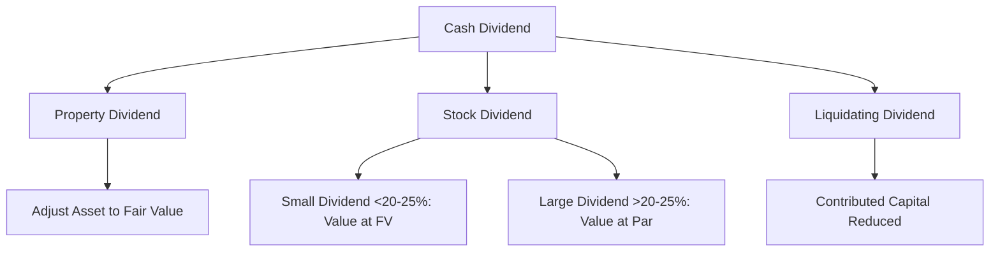

## 17.2 Dividends (Cash, Property, Liquidating), Stock Dividends, Splits

Dividends are a key aspect of corporate finance and a central topic in understanding shareholders’ equity. Whether a corporation chooses to pay a cash dividend, distribute property to its shareholders, or issue additional shares, each type of dividend affects the company’s financial position and the way investors view the firm. This section provides comprehensive guidance on the different types of dividends—cash, property, and liquidating—as well as stock dividends and stock splits. You will learn about the critical dates associated with dividend declarations, guidance on journal entries, and how each type of dividend impacts retained earnings, contributed capital, and corporate valuation.

Use this chapter in conjunction with Chapter 17.1 (Stock Issuances, Treasury Stock Transactions) if you need additional background on equity-related transactions, and Chapter 18 (Accounting Changes and Error Corrections) if a dividend policy adjustment leads to changes in estimates or corrections of prior-period errors.

---

Dividends are typically governed by the corporate charter, state law, and relevant accounting standards. Under U.S. GAAP, most dividend transactions and disclosures are covered by ASC 505 (Equity). Meanwhile, IFRS contains guidelines for distributions to owners under IAS 1 (Presentation of Financial Statements) and IAS 10 (Events After the Reporting Period) for timing considerations. While the accounting treatment under both sets of standards is generally consistent for dividends, certain nuances may exist regarding their timing and disclosures.

Below, we delve into each major category of dividends and the fundamental concepts you need to master for the CPA Exam.

## Key Dividend Dates

Dividends revolve around four critical dates:

• Date of Declaration: The board of directors formally declares a dividend. On this date, a liability for a cash or property dividend is recorded.  
• Date of Record: Shareholders on record as of this date are entitled to receive the dividend. No journal entry is required.  
• Ex-Dividend Date (often two business days prior to the date of record in practice): Determines which buyers of stock are entitled to the upcoming dividend. Not an official accounting date, but crucial for understanding share price behavior.  
• Date of Payment (or Distribution): The date the declared dividend is actually paid or distributed. The liability recorded at declaration is settled on this date.

The following diagram illustrates the typical life cycle of a cash or property dividend:

In most cases, the date of record occurs between the declaration and payment dates. This timeline helps ensure only shareholders who hold the company’s stock as of the record date receive the dividend.

---

## Cash Dividends

Cash dividends remain one of the most common ways corporations distribute earnings to shareholders. By returning cash, companies reward investors and communicate confidence in their profitability and liquidity.

• Date of Declaration:  
  – A liability is recognized.  
  – Dr. Retained Earnings (or Dividends Declared), Cr. Dividends Payable (a current liability).  

• Date of Record:  
  – No journal entry.  
  – The only purpose is to identify which shareholders are entitled to the dividend.  

• Date of Payment:  
  – Dr. Dividends Payable, Cr. Cash.  

Example:  
Assume ABC Corporation declares a $0.50 per share cash dividend on 100,000 shares outstanding, to be paid a month later. On the date of declaration, ABC records:

Dr. Retained Earnings ……………………………….. $50,000  
Cr. Dividends Payable ……………………………….. $50,000  

No entry is recorded on the date of record. On the payment date:

Dr. Dividends Payable ……………………………….. $50,000  
Cr. Cash ……………………………………………………… $50,000  

---

## Property Dividends

Also referred to as dividends in kind, property dividends involve the distribution of noncash assets to shareholders. Although less common than cash dividends, property dividends can be an effective way for a corporation to divest certain assets.

1. Measurement of the Dividend:  
   – The distributed property is remeasured to fair value at the date of declaration.  
   – Any gain or loss arising from the remeasurement is recognized in the income statement.  
2. Liability Recognition:  
   – On the date of declaration, the company debits Retained Earnings for the fair value of the property (or Dividends Declared) and credits Dividends Payable.  
3. Distribution Date:  
   – The noncash asset (net of any recorded gain or loss) is removed from the books, and Dividends Payable is debited.

Example:  
XYZ Corporation has an available-for-sale (AFS) investment recorded at a carrying amount of $70,000 and a fair value of $100,000. The board declares a property dividend, distributing this investment to its shareholders.

On the date of declaration:  
• Step 1: Recognize gain for the difference between the asset’s carrying amount and fair value.  

Dr. Investment (AFS) – Valuation Allowance … $30,000  
Cr. Unrealized Gain (Income) …………………… $30,000  

(This step aligns the asset’s carrying value to $100,000 fair value prior to distribution.)

• Step 2: Declare the dividend at fair value.  

Dr. Retained Earnings ………………………………… $100,000  
Cr. Dividends Payable ………………………………… $100,000  

On the distribution date:  

Dr. Dividends Payable ………………………………… $100,000  
Cr. Investment (AFS) …………………………………… $100,000  

---

## Liquidating Dividends

Liquidating dividends arise when a firm returns capital to its shareholders that exceeds retained earnings. This type of dividend signals a return of contributed capital, rather than a distribution of accumulated profits. Liquidating dividends commonly occur when a company is partially or fully ceasing operations or has low retained earnings but substantial paid-in capital.

Key points:  
• Liquidating dividends reduce additional paid-in capital (APIC) or other contributed capital after retained earnings is exhausted.  
• The portion of the dividend that comes from retained earnings is treated as a regular dividend. Once retained earnings is depleted, the remainder is a liquidating dividend.  

Example:  
EFG Corporation declares a $100,000 dividend when it has only $60,000 remaining in retained earnings. The excess $40,000 is treated as a liquidating dividend. On declaration:

1. Regular Dividend Portion  
   Dr. Retained Earnings ………………………………… $60,000  
   Cr. Dividends Payable ………………………………… $60,000  

2. Liquidating Dividend Portion  
   Dr. Additional Paid-In Capital ……………………… $40,000  
   Cr. Dividends Payable ………………………………… $40,000  

On the payment date, the entire $100,000 liability is paid in cash:  

Dr. Dividends Payable ………………………………… $100,000  
Cr. Cash ……………………………………………………… $100,000  

---

## Stock Dividends

Stock dividends involve the issuance of additional shares to existing shareholders, generally on a pro rata basis. Though they do not distribute assets, stock dividends still reduce the corporation’s retained earnings. Their primary effect is to transfer an amount from retained earnings to contributed capital (common stock and additional paid-in capital). The rationale behind stock dividends often includes preserving cash, signaling optimistic future prospects, or maintaining a certain share price range.

### Small vs. Large Stock Dividends

• Small Stock Dividend (< 20–25% of the existing shares):  
  – Accounted for at the fair value of the additional shares issued.  
  – Retained Earnings is debited for the fair value of the shares.  
  – Common Stock (at par value) and Additional Paid-In Capital are credited accordingly.  

• Large Stock Dividend (> 20–25% of the existing shares):  
  – Typically accounted for at par or stated value.  
  – Retained Earnings is debited for the par value of the shares.  
  – Common Stock is credited.  

Example – Small Stock Dividend:  
DEF Corporation has 100,000 common shares outstanding and a $1 par value. The market price is $15 per share. The board declares a 10% stock dividend, which means 10,000 new shares (10% × 100,000) will be distributed.

On the date of declaration, record at fair value ($15 × 10,000 = $150,000):  

Dr. Retained Earnings ………………………………… $150,000  
Cr. Common Stock (10,000 × $1 par) …………… $10,000  
Cr. Additional Paid-In Capital ………………………… $140,000  

No entry on the date of distribution, as the distribution effectively occurs concurrently with the issuance.

Example – Large Stock Dividend:  
GHI Corporation has 100,000 shares outstanding and a $1 par value. The company declares a 30% stock dividend. Assume the same fair value of $15 per share. Because 30% is above the 20–25% threshold, the large stock dividend is recorded at par:

Dr. Retained Earnings ………………………………… $30,000  
Cr. Common Stock (30,000 × $1 par) …………… $30,000  

---

## Stock Splits

A stock split increases the number of shares outstanding while proportionally decreasing the par (or stated) value per share. It does not affect retained earnings, APIC, or total shareholders’ equity. Commonly, corporations undertake stock splits to reduce the market price per share, making shares more affordable and potentially increasing liquidity.

### Example – 2-for-1 Stock Split

JKL Corporation has 100,000 shares outstanding at a $2 par value per share. If JKL executes a 2-for-1 split, the new par value becomes $1 per share, and the total number of shares doubles to 200,000. There is no net change in total equity because the reclassification is simply within shareholders’ equity.

Before Split:  
• 100,000 shares × $2 par = $200,000 total par.  

After 2-for-1 Split:  
• 200,000 shares × $1 par = $200,000 total par.  

No journal entry is required under U.S. GAAP for a typical stock split. In some cases, a split may be structured as a “stock split effected in the form of a dividend,” causing a reclassification from retained earnings to common stock. This nuanced situation is less common but can appear on the exam.

---

## Real-World Considerations and Best Practices

• Dividend Policy: Companies often strive to maintain consistent dividend practices. Frequent changes in dividend policy can signal potential financial instability.  
• Dividend Preference vs. Growth: Some shareholders prefer high dividend payouts, while others, especially in growth sectors, prefer firms to reinvest earnings.  
• Taxation: Dividends can be taxed differently across jurisdictions. Corporate decisions on dividends may reflect tax considerations for both the corporation and its shareholders.  
• Common Pitfalls:  
  – Confusing the small stock dividend (measured at fair value) with the large stock dividend (measured at par or stated value).  
  – Overlooking gain or loss recognition for property dividends (the asset must be adjusted to fair value first).  
  – Mixing up record date and payment date in the accounting cycle (only the declaration and payment date require journal entries).

---

## Diagram: Dividend Types at a Glance

Explanation:  
• A corporation may choose a cash dividend or a property dividend. If the distribution is in excess of retained earnings, it becomes (partly) a liquidating dividend, reducing contributed capital.  
• Stock dividends are unique in that no net assets leave the corporation. However, they reclassify amounts within equity from retained earnings to common stock (and possibly APIC).  

---

## IFRS Perspective

Under IFRS (IAS 10), an entity must disclose the declaration of dividends after the reporting period but before the financial statements are authorized for issue as a non-adjusting event (unless an appropriation of retained earnings was required by law before the balance sheet date). The recognition and measurement of dividends, whether cash or noncash, generally align with U.S. GAAP, particularly regarding the reduction of retained earnings when dividends are declared. However, IFRS is often less specific about small vs. large stock dividends; local regulations might drive certain classifications that mirror U.S. GAAP conventions.

---

## Practical Case Study

ABC Biotech, Inc. is in its fifth year of operations with the following equity balances at year-end:  
• Common Stock (par $1, 1,000,000 shares authorized, 200,000 shares issued) = $200,000  
• Additional Paid-In Capital = $2,000,000  
• Retained Earnings = $300,000  

Due to solid profits, the board declares a $100,000 cash dividend, plus it announces a 5% stock dividend. The stock’s current market price is $10 per share. At the time of the dividend declaration, ABC has 200,000 shares outstanding.

1. Cash Dividend Entry:  
   Dr. Retained Earnings  ……………… $100,000  
   Cr. Dividends Payable ……………… $100,000  

2. Small Stock Dividend, 5% of 200,000 = 10,000 new shares issued. Measured at fair value, which is $10/share = $100,000 total.  
   Dr. Retained Earnings (or Stock Dividends) …………… $100,000  
   Cr. Common Stock (10,000 × $1 par) …………………… $10,000  
   Cr. APIC……………………………………………………………………… $90,000  

On the distribution date for the cash dividend:  
   Dr. Dividends Payable ……………… $100,000  
   Cr. Cash ………………………………… $100,000  

And upon issuance of the stock dividend, the company records no further journal entry if it has already recorded the distribution at declaration.

---

## Common Challenges and Strategies

• Timing: Make sure you correctly identify which dates require journal entries and which do not.  
• Proper Valuation: For property dividends, always adjust the asset to fair value and recognize any gain or loss in the income statement.  
• Identifying a Liquidating Dividend: Carefully distinguish between a normal dividend (from retained earnings) and a liquidating dividend (reducing APIC).  
• Stock Dividend Threshold: The 20–25% guideline is critical in determining whether a dividend is treated as small or large, with implications for the amounts reclassified from retained earnings.  
• Disclosure: Remember that any significant stock split or dividend event (especially if it occurs after the balance sheet date) might require disclosure under ASC 855 (Subsequent Events) or IAS 10 (Events after the Reporting Period).

---

## References and Further Reading

• FASB ASC 505, Equity  
• IAS 1, Presentation of Financial Statements  
• IAS 10, Events After the Reporting Period  
• IFRS Foundation. (2022). IFRS Accounting Standards Red Book  
• AICPA, “Uniform CPA Examination Blueprints,” relevant sections on equity transactions  

For more details on how to structure your references, see Chapter 2.4, “Hierarchy of U.S. GAAP and Researching the Codification.”

---

## Comprehensive Dividends & Stock Splits Mastery Quiz



### Which date represents the point at which a liability for a cash dividend is first recorded?

- [ ] Date of record
- [x] Date of declaration
- [ ] Ex-dividend date
- [ ] Date of payment

> **Explanation:** Under U.S. GAAP, a liability is recognized at the date of declaration, when the board officially commits to the dividend.

### Which of the following statements about large stock dividends is correct?

- [x] They are generally recorded at par or stated value.
- [ ] They require no reduction of retained earnings.
- [ ] They are recorded at market value on the declaration date.
- [ ] Their issuance has a direct impact on total stockholders' equity.

> **Explanation:** Large stock dividends (over 20–25% of existing shares) are typically recorded at par value, reducing retained earnings by the par value rather than market value.

### In a property dividend, which of the following must occur before the dividend is declared?

- [ ] The property’s book value must be used to determine the dividend liability.
- [x] The property must be adjusted to fair value, with any gain or loss recognized.
- [ ] Retained earnings must be increased to reflect the property’s fair value.
- [ ] The dividend must be recorded strictly at carrying value.

> **Explanation:** For property dividends, the distributing asset’s carrying amount is adjusted to fair value. Any gain or loss is recognized in the income statement before the dividend is recorded.

### What is the primary distinction between liquidating dividends and regular dividends?

- [ ] Liquidating dividends are paid only with preferred stock.
- [x] Liquidating dividends represent a return of contributed capital once retained earnings is exhausted.
- [ ] Liquidating dividends do not require any journal entries.
- [ ] Liquidating dividends are tax-free for shareholders.

> **Explanation:** A liquidating dividend draws from contributed capital after retained earnings is depleted, effectively returning part of the original investment to shareholders.

### Which of the following is true regarding stock splits?

- [x] They increase the number of shares outstanding and proportionally reduce the par value per share.
- [ ] They drastically reduce total stockholders’ equity.
- [x] No journal entry is typically required under U.S. GAAP.
- [ ] They lead to an increase in retained earnings.

> **Explanation:** Stock splits do not alter total equity; they spread the same total par value over a larger number of shares. Often, no journal entry is required (the corporation’s records simply update the par value per share).

### When a company declares a small stock dividend, which account(s) is debited?

- [x] Retained Earnings for the fair value of the shares issued
- [ ] Dividends Payable for the fair value of the shares issued
- [ ] Common Stock for the total market value of shares issued
- [ ] Additional Paid-In Capital for the par value of shares issued

> **Explanation:** For a small stock dividend, retained earnings is debited for the fair value of shares issued, while common stock is credited at par value, and APIC is credited for any excess.

### For a property dividend, which step immediately follows the revaluation of the asset to fair value?

- [x] Recording a gain or loss in the income statement.
- [ ] Recognizing a reduction in contributed capital.
- [x] Declaring the dividend liability in retained earnings.
- [ ] Increasing the carrying amount of the asset to par value.

> **Explanation:** Once the asset’s carrying amount is adjusted to fair value, any gain or loss flows through the income statement, and the dividend is then declared against retained earnings.

### Which of the following best describes the ex-dividend date?

- [x] The first trading day on which the seller of the stock (not the buyer) is entitled to the dividend.
- [ ] The date on which the dividend is declared by the board of directors.
- [ ] The date the dividend is paid to shareholders.
- [ ] The date when the dividend liability becomes recognized in the financial statements.

> **Explanation:** The ex-dividend date is set by the exchange. Investors who purchase shares on or after this date are not entitled to the upcoming dividend.

### A 2-for-1 stock split generally has what effect on total shareholders’ equity?

- [x] No effect.
- [ ] It increases retained earnings.
- [ ] It decreases shareholders’ equity by the par value.
- [ ] It increases shareholders’ equity by the market value.

> **Explanation:** A stock split redistributes equity among a larger number of shares at a reduced par value without changing the total amount of shareholders’ equity.

### A company has $50,000 in retained earnings and declares a $70,000 dividend. How much of this dividend is considered liquidating?

- [x] $20,000
- [ ] $50,000
- [ ] $70,000
- [ ] $0

> **Explanation:** The first $50,000 draws down retained earnings, while the additional $20,000 is considered a liquidating dividend that reduces contributed capital.



---

## For Additional Practice and Deeper Preparation

**[FAR CPA Hardest Mock Exams: In-Depth & Clear Explanations](https://www.udemy.com/course/far-cpa-mock-exams/?referralCode=F88050F8D5C76764F6BD)**  

**Financial Accounting and Reporting (FAR) CPA Mocks:** 6 Full (1,500 Qs), Harder Than Real! In-Depth & Clear. Crush With Confidence!  

- Tackle full-length mock exams designed to mirror real FAR questions.  
- Refine your exam-day strategies with detailed, step-by-step solutions for every scenario.  
- Explore in-depth rationales that reinforce higher-level concepts, giving you an edge on test day.  
- Boost confidence and minimize anxiety by mastering every corner of the FAR blueprint.  
- Perfect for those seeking exceptionally hard mocks and real-world readiness.  

_Disclaimer: This course is not endorsed by or affiliated with the AICPA, NASBA, or any official CPA Examination authority. All content is for educational and preparatory purposes only._
