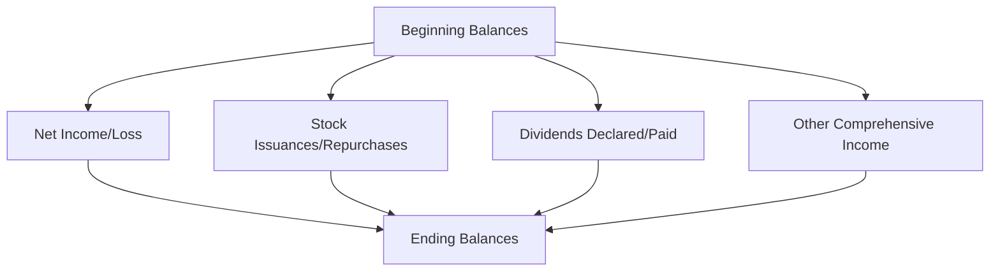

## 17.3 Equity Presentation and Key Disclosures

Equity represents the residual interest in an entity’s assets after deducting liabilities. It is, in many respects, the cornerstone of a corporation’s capital structure, serving as an essential metric for stakeholders evaluating financial stability, profitability, and solvency. Transparent presentation and disclosure of equity ensures that users of the financial statements can accurately assess the entity’s financial health and owners’ rights. This section focuses on the layout and presentation of equity in the financial statements, disclosure requirements, and best practices. Topics include the statement of changes in equity, capital structure disclosures, dividends, share-based implications, and key IFRS comparisons.

Building on Chapter 17’s discussions of stock issuance, treasury stock, and dividends, this section explains how these components of equity are reported in the financial statements and disclosed in the notes. It examines practical examples and case scenarios to help you understand intricate details and avoid common pitfalls. Additionally, we will address key differences under IFRS (see also Chapter 25), highlighting certain nomenclature differences and additional or alternative disclosures required by international standards.

-----

### Importance of Equity Presentation

Accurate and consistent equity presentation:

• Reflects an entity’s ownership and capital structure.  
• Demonstrates how transactions affect equity accounts (e.g., share issuance, treasury stock transactions, dividend distributions, changes in ownership interest).  
• Offers insight into financing strategies, retained profits, and net worth over time.

Under U.S. GAAP, entities must provide comprehensive information on equity in their financial statements—most commonly through the statement of changes in equity (or statement of stockholders’ equity) and accompanying footnote disclosures. The statement of changes in equity is often presented alongside the balance sheet (statement of financial position), income statement, statement of comprehensive income, and statement of cash flows.

-----

### Components of Equity

Equity can comprise various elements, including:

• Common stock (or ordinary shares in some jurisdictions).  
• Preferred stock (which may have special features, such as a fixed dividend rate or liquidation preference).  
• Additional paid-in capital (APIC) or share premium.  
• Treasury stock (repurchased shares).  
• Retained earnings (accumulated net income that has not been distributed as dividends).  
• Accumulated other comprehensive income (AOCI) (e.g., gains or losses on foreign currency translation, certain hedging instruments, or defined benefit pension plans).  
• Noncontrolling interest (in consolidation scenarios).

Each of these components has specific recognition, measurement, and disclosure requirements under U.S. GAAP. For instance, common and preferred stock must be reported at par or stated value, with any excess proceeds over par recognized in APIC (or share premium). Treasury stock transactions must be accounted for under either the cost method or the par value method, each with its own direct impact on total equity. Meanwhile, retained earnings detail the accumulation of undistributed profits, allowing stakeholders to track how net income builds shareholder wealth over time.

-----

### Statement of Changes in Equity

The statement of changes in equity (sometimes also titled the statement of stockholders’ equity or statement of shareholders’ equity) provides a detailed reconciliation of the carrying amounts of each component of equity for the reporting period. This statement typically tracks equity movements across columns for each significant equity classification (e.g., common stock, APIC, retained earnings, treasury stock, AOCI) and rows that reflect different transactions, such as:

• Beginning balances.  
• Issuances of stock.  
• Repurchases of stock (treasury stock).  
• Net income (or loss).  
• Other comprehensive income (OCI) components.  
• Dividends declared and paid (cash, property, or stock dividends).  
• Effects of changes in accounting principles or error corrections (see Chapter 18).  
• Ending balances.

A simplified illustration might look like this in tabular form:

|                       | Common Stock | APIC     | Retained Earnings | Treasury Stock | AOCI    | Total Equity |
|-----------------------|-------------:|---------:|------------------:|---------------:|--------:|------------:|
| Beginning Balance     |  100,000     | 500,000  |       750,000     |     (50,000)   | 10,000  | 1,310,000   |
| Issuance of Shares    |   20,000     |  80,000  |             –     |          –     |      –  |   100,000   |
| Net Income            |       –      |      –   |       200,000     |          –     |      –  |   200,000   |
| Dividends Declared    |       –      |      –   |      (100,000)    |          –     |      –  |  (100,000)  |
| Treasury Stock Buyback|       –      |      –   |             –     |     (30,000)   |      –  |   (30,000)  |
| OCI (Unreal. Gains)   |       –      |      –   |             –     |          –     |  5,000  |    5,000    |
| Ending Balance        |  120,000     | 580,000  |       850,000     |     (80,000)   | 15,000  | 1,485,000   |

By presenting changes over each period, users can trace how each component of equity evolved based on transactions or events, enabling them to assess the overall equity profile. In addition, each equity component column must reconcile from the opening balance to the closing balance, taking into account all interim movements.

**Mermaid Diagram: Conceptual Flow of Statement of Changes in Equity**

In this diagram, each arrow represents a major transaction or economic event that impacts equity, funneling into the final total in the statement of changes in equity.

-----

### Disclosures About Capital Structure

#### Authorized, Issued, and Outstanding Shares

For each class of capital stock (e.g., common stock, preferred stock, Class A vs. Class B shares), entities must disclose:

• The number of shares authorized.  
• The number of shares issued.  
• The number of shares outstanding.  
• Par value (if any) or stated value.  
• Rights, preferences, and restrictions (e.g., voting rights, dividend rates, redemption features).  

This information helps readers evaluate potential dilution, dividend obligations, and voting control. Many entities also describe any share-based arrangement that could significantly alter the capital structure (e.g., employee stock options, warrants, convertible securities).

#### Preferred Stock Features

Preferred stock may carry unique economic rights, including cumulative dividends, liquidation preferences, conversion rights, or callable feature. Under U.S. GAAP, each significant attribute must be comprehensively disclosed:

• Dividend rate and whether it is cumulative or noncumulative.  
• Call (or redemption) dates and prices (if any).  
• Conversion features and exchange ratios.  
• Any sinking fund or mandatory redemption requirements.  
• Participation rights in residual corporate profits.  

By detailing these features, management communicates the financial effect such preferences may have in periods of profitability or liquidation.

#### Restrictions on Retained Earnings

Certain covenants or legal requirements may restrict the distribution of retained earnings. For instance, a bond covenant might require the entity to maintain a specific debt-to-equity ratio, limiting dividend payouts. Footnote disclosures should explain these restrictions, including their nature, amounts, and relevant conditions.

-----

### Dividends and Their Impact on Equity

Dividends represent a return of equity to shareholders. Their declaration and payment directly reduce retained earnings. By extension, dividends also reduce total equity. Key dividend categories include:

• Cash Dividends: The most common type, reducing both retained earnings and cash.  
• Stock Dividends: Distributions of the entity’s own shares to existing shareholders.  
• Property Dividends: Distributions of non-cash assets.  
• Scrip Dividends: Dividends settled in the form of promissory notes (usually short-term).  
• Liquidating Dividends: Return of contributed capital rather than a distribution of retained earnings.

Entities must disclose the dollar amount of dividends declared and per-share amounts for each type of share, especially if multiple classes of shares exist. They also explain the nature of the dividend and the financial statement line items affected.

For example, the footnotes might detail a property dividend:

“On December 1, 20XX, the Board of Directors declared a property dividend consisting of marketable securities with a carrying amount of $50,000 and a fair value of $60,000. As a result of the distribution, the Company recognized a $10,000 gain, which is reported within Other Income in the income statement, and decreased retained earnings by $60,000.”

-----

### Share-Based Payment Implications on Equity

Share-based payments (e.g., employee stock options, restricted stock units, performance shares) can significantly affect equity. Under ASC 718 (Compensation—Stock Compensation), share-based payment transactions generally result in compensation expense recognized over the vesting period, credited to an equity account (often APIC). Upon exercise or vesting of share-based awards:

• The amount of cash received (if any) is credited to share capital (and possibly APIC).  
• The accumulated compensation cost recognized in APIC is reclassified appropriately.  
• Shares are issued to the employee or other beneficiary.  

Footnote disclosures about share-based payments must include:

• The nature and terms of such arrangements, such as vesting conditions and contractual lives.  
• The method used to estimate the fair value of share-based awards (e.g., Black-Scholes or binomial option pricing model).  
• The total compensation cost recognized and the tax effects.  
• Outstanding and exercisable award details and weighted-average exercise prices.

Share-based compensation can expand the number of shares outstanding (or partially outstanding in the form of dilutive potential shares), which also impacts earnings per share calculations (see Chapter 6).

-----

### Additional Equity-Related Disclosures

#### Treasury Stock

Treasury stock represents an entity’s own shares that have been repurchased but not retired. This can be accounted for under the cost method or par (stated) value method. Although treasury stock reduces total stockholders’ equity, it is typically presented in a contra-equity account. Key disclosures:

• Number of treasury shares held.  
• Cost of treasury shares (under the cost method).  
• Reasons for the buyback (if significant or strategic, e.g., for share-based compensation or to influence stock price).  
• Any subsequent reissuance or retirement of treasury shares and resulting gains or losses.  

#### Accumulated Other Comprehensive Income (AOCI)

AOCI includes items that bypass net income but still affect equity, such as gains or losses on certain derivative instruments designated as hedges, pension adjustments, or foreign currency translation adjustments. Disclosing the components of AOCI and their changes during the period is crucial for understanding comprehensive profitability. Most companies then present a consolidated total for AOCI in the equity section. A statement or schedule reconciling each component of AOCI from period to period is typically provided.

#### Noncontrolling Interests

When consolidating financial statements of subsidiaries, the portion of equity not owned by the parent—i.e., the minority interest—must be separately stated as “noncontrolling interest” in the consolidated statement of financial position. Entities must clearly present the portion of net income (or loss) and comprehensive income (or loss) attributable to noncontrolling interests.

#### Quasi-Reorganizations and Pushdown Accounting (Advanced Topics)

Occasionally, entities may utilize a quasi-reorganization to eliminate a deficit in retained earnings. Under U.S. GAAP, quasi-reorganizations adjust equity accounts to reflect the current fair values of the entity’s assets and liabilities, effectively giving the company a “fresh start” while maintaining the historical legal structure. Related disclosures must clearly communicate the nature, timing, and effects of the quasi-reorganization on consolidated equity.

Pushdown accounting, triggered when an acquired entity’s financial statements reflect the acquirer’s acquisition cost basis, can also significantly change the equity section of the acquired company’s individual financial statements. Disclosure of the valuation and remeasurement adjustments enhances transparency for the users of those financial statements (see Chapter 26 for additional advanced discussion).

-----

### IFRS Perspective and Key Differences

Under IFRS (International Financial Reporting Standards), equity-related disclosures are mandatory and broadly similar to U.S. GAAP but often use different terminology, such as “share capital,” “share premium,” and “other reserves.” Entities provide a statement of changes in equity as one of the primary statements, highlighting movements by each equity component similar to U.S. GAAP requirements.

Major nuances include:

• IFRS does not have a concept of “Other Comprehensive Income” entirely separate from the statement of profit or loss. It does, however, require items recognized in other comprehensive income to be reclassified to profit or loss under certain circumstances.  
• Several IFRS standards (e.g., IFRS 2 for share-based payment, IAS 1 for presentation of financial statements) specify additional or alternate disclosures.  
• IFRS often combines revaluation surpluses (applicable, for example, in property, plant, and equipment measured at revalued amounts) in a separate equity reserve.

Despite these differences, the underlying principle of transparent and consistent equity reporting remains consistent between U.S. GAAP and IFRS, as well as other special-purpose frameworks (see Chapter 7).

-----

### Practical Best Practices and Common Pitfalls

**Best Practices**

• Maintain clear, concise footnotes detailing rights and preferences of various share classes.  
• Provide reconciliations for beginning and ending balances in each equity account, disaggregating significant transactions (e.g., large share issuances, treasury stock transactions, or business combinations).  
• Incorporate tabular presentations wherever possible to enhance clarity.  
• Cross-reference related notes (e.g., share-based compensation, earnings per share) for cohesive financial reporting.

**Common Pitfalls**

• Failing to disclose restrictions on retained earnings or other equity accounts, thereby misleading users about distributable funds.  
• Mishandling treasury stock adjustments, particularly when reissuing or retiring repurchased shares.  
• Inconsistency or omission in describing the terms or features of multiple share classes.  
• Errors in distinguishing between changes in equity from net income, other comprehensive income, and ownership transactions.  

Entities should address these pitfalls by developing robust internal controls and consistent, thorough documentation practices in the equity accounting cycle.

-----

### Practical Example: Dual Class Equity Structure

Assume Company X issues 500,000 shares of Class A common stock (voting rights) and 250,000 shares of Class B common stock (limited or no voting rights). The footnote disclosures might read:

“Our authorized capital comprises 1,000,000 Class A shares, par value $1 per share, and 500,000 Class B shares, par value $1 per share, as of December 31, 20XX. Of these amounts, 500,000 Class A shares and 250,000 Class B shares are issued and outstanding. Class A and Class B shares participate equally in dividends and liquidation proceeds, but Class B shares carry no voting rights except on matters required by law.”

When the company declares dividends, it must clearly specify the per-share amounts for both classes. If Class B shareholders are entitled to the same economic benefits, the footnote might include a line clarifying, “For the year ended December 31, 20XX, dividends of $0.15 per share were declared and paid on both Class A and Class B shares.” This clarifies that despite voting differences, dividend distribution remains consistent between the share classes.

-----

### Illustrative Case: Impact of a Stock Dividend

Company Y has 1,000,000 shares of $1 par common stock authorized, with 300,000 shares issued and outstanding at the beginning of the year. The total par value is $300,000. APIC stands at $1,500,000, and retained earnings is $2,000,000. The Board of Directors declares a 10% stock dividend when the fair market value of each share is $10. Because it is a small stock dividend (less than 20-25%), the entity capitalizes retained earnings at the fair market value of the shares distributed:

• Number of new shares distributed: 300,000 × 10% = 30,000 shares.  
• Total fair market value: 30,000 × $10 = $300,000.  
• Par value component: 30,000 × $1 = $30,000.  
• Excess over par: $300,000 – $30,000 = $270,000.  

The journal entries are:

Dr. Retained Earnings  $300,000  
   Cr. Common Stock       $30,000  
   Cr. APIC              $270,000  

After the transaction, total shares outstanding increase to 330,000 shares. Retained earnings is reduced by $300,000, and common stock and APIC each increase accordingly. The statement of changes in equity and footnote disclosures should highlight these movements, including the nature and reason for the stock dividend (typically to reward shareholders and maintain market liquidity).

-----

### Conclusion

Equity presentation is more than just completing a line item on the balance sheet; it requires thoughtful, transparent reporting of ownership structure, terms and restrictions of share classes, and the timing and amount of distributions. Through the statement of changes in equity and accompanying disclosures, management conveys critical information about how equity evolves over time, which is fundamental to users’ assessments of corporate governance, solvency, and profitability. By implementing best practices, addressing common pitfalls, and adhering to both U.S. GAAP and IFRS requirements, entities can ensure that their equity presentation stands up to the highest scrutiny.

-----

## Essential Equity Presentation and Key Disclosures Quiz



### In the statement of changes in equity, which of the following items is most likely presented as a separate column?
- [ ] Depreciation expense
- [x] Treasury stock
- [ ] Interest expense
- [ ] Operating lease surcharge

> **Explanation:** The statement of changes in equity tracks distinct equity components such as treasury stock, retained earnings, share capital, and other comprehensive income. Depreciation and interest expenses do not appear as separate columns in this statement.

### Which of the following must be disclosed for each class of stock?
- [x] Par value or stated value
- [x] Number of shares authorized, issued, and outstanding
- [ ] Detailed list of each shareholder’s contact information
- [ ] The date the stock was initially conceptualized

> **Explanation:** Entities disclose par value (if applicable) and the number of shares authorized, issued, and outstanding. Shareholder contact details and conceptual dates are not part of standard external financial statement disclosures.

### A 10% stock dividend is declared on 100,000 shares of common stock with a $5 par value and a $12 market value per share. What is the total amount debited to retained earnings?
- [x] $120,000
- [ ] $50,000
- [ ] $60,000
- [ ] $12,000

> **Explanation:** For small stock dividends, the fair value of the shares issued is usually debited to retained earnings. 10% of 100,000 shares equals 10,000 shares. At $12 per share, the total fair value is $120,000.

### Under U.S. GAAP, which account is typically credited when recording share-based compensation expense over a vesting period?
- [ ] Retained earnings
- [ ] Unearned revenue
- [x] Additional paid-in capital (APIC)
- [ ] Treasury stock

> **Explanation:** For share-based payments, the expense recognized over the vesting period is generally offset by a credit to an equity account, often APIC, reflecting issuance of equity instruments.

### Which of the following statements is true about property dividends?
- [x] They require the property to be remeasured to fair value prior to distribution.
- [ ] They increase retained earnings by the carrying value of the property.
- [x] Any difference between carrying value and fair value is typically recognized as a gain or loss.
- [ ] They do not need to be disclosed separately.

> **Explanation:** Property dividends are recorded at fair value, resulting in a gain or loss if the carrying value differs from the property’s fair value. They reduce retained earnings and must be disclosed in the notes.

### Which accounting method is commonly used to record treasury stock transactions under U.S. GAAP?
- [x] The cost method
- [ ] The completed-contract method
- [ ] The discounted cash flow method
- [ ] The capital lease method

> **Explanation:** Treasury stock transactions in the U.S. are typically recorded under either the cost method or the par value method, with the cost method being more prevalent.

### Under IFRS, how is the equity section primarily referred to?
- [x] Share capital, share premium, and reserves
- [ ] Stocks, bonds, and derivatives
- [x] “Issued capital” and “other reserves”
- [ ] Paid-in capital and intangible assets

> **Explanation:** IFRS typically uses the term “share capital” and “share premium” for contributed equity, along with various “reserves” for other comprehensive income or revaluation surpluses.

### Which of the following gains or losses is most likely to bypass net income and impact accumulated other comprehensive income (AOCI) directly?
- [ ] Gain on the sale of fixed assets
- [ ] Loss on inventory write-down
- [ ] Gain on extinguishment of debt
- [x] Unrealized holding gains on certain available-for-sale securities

> **Explanation:** Under U.S. GAAP, unrealized gains or losses on certain available-for-sale or equity securities bypass net income and are recognized in OCI until realized. They accumulate in AOCI, a separate component of equity.

### Which item is credited when a company declares a cash dividend?
- [x] Dividends (or Retained Earnings)
- [ ] Treasury stock
- [ ] Accumulated other comprehensive income (AOCI)
- [ ] Unearned revenue

> **Explanation:** When a cash dividend is declared, the liability Dividends Payable is credited, and an equity account (commonly Retained Earnings or a “Dividends” account that closes to Retained Earnings) is debited. In final statements, Retained Earnings is effectively the source of the dividend.

### True or False: Quasi-reorganizations reset retained earnings, effectively eliminating a deficit while preserving the legal entity and prior reporting periods unaltered.
- [x] True
- [ ] False

> **Explanation:** Quasi-reorganizations allow entities to eliminate a deficit in retained earnings and reflect current fair values of assets and liabilities, providing a “fresh start” in the same corporate structure without losing prior legal history.



-----

## For Additional Practice and Deeper Preparation

**[FAR CPA Hardest Mock Exams: In-Depth & Clear Explanations](https://www.udemy.com/course/far-cpa-mock-exams/?referralCode=F88050F8D5C76764F6BD)**

Financial Accounting and Reporting (FAR) CPA Mocks: 6 Full (1,500 Qs), Harder Than Real! In-Depth & Clear. Crush With Confidence!

- Tackle full-length mock exams designed to mirror real FAR questions.  
- Refine your exam-day strategies with detailed, step-by-step solutions for every scenario.  
- Explore in-depth rationales that reinforce higher-level concepts, giving you an edge on test day.  
- Boost confidence and minimize anxiety by mastering every corner of the FAR blueprint.  
- Perfect for those seeking exceptionally hard mocks and real-world readiness.  

_Disclaimer: This course is not endorsed by or affiliated with the AICPA, NASBA, or any official CPA Examination authority. All content is for educational and preparatory purposes only._
