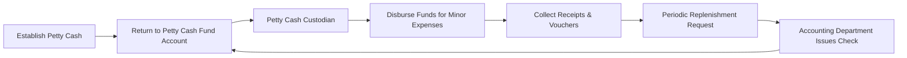

## 9.1 Definitions, Classifications, Petty Cash

This section covers the definitions, classifications, and treatment of Cash and Cash Equivalents for financial reporting purposes. Specifically, we explore what constitutes “cash” on the balance sheet, how to identify “cash equivalents,” and common scenarios and borderline cases such as money market funds and short-term investments. We also delve into the basics of setting up and managing a petty cash fund, emphasizing best practices and the proper documentation of transactions.

___________________________________________

### Introduction and Importance of Cash & Cash Equivalents

Cash is the lifeblood of any organization. It enables entities to pay suppliers, compensate employees, and settle obligations as they come due. Understanding how to classify and report cash, as well as determine which instruments qualify as cash equivalents, is a crucial component of Financial Accounting and Reporting. The Financial Accounting Standards Board (FASB) provides guidance on how such transactions should be recognized, measured, and disclosed, typically within U.S. GAAP (ASC 305, “Cash and Cash Equivalents”).

The accurate classification of cash and cash equivalents significantly affects an entity’s liquidity ratios, financial flexibility assessment, and stakeholder confidence. Furthermore, a well-structured petty cash fund ensures employees have immediate access to funds for minor expenses while maintaining rigorous controls to prevent fraud and errors.

___________________________________________

### Definitions of “Cash” and “Cash Equivalents”

Under U.S. GAAP, “cash” typically includes:

• Coins and currency on hand.  
• Checking account balances, demand deposits, and certain money-market accounts with checking privileges.  
• Negotiable instruments such as checks and bank drafts that are collectible on demand.  

Financial accounting standards also identify “cash equivalents” as short-term, highly liquid investments that are:

• Readily convertible to a known amount of cash.  
• So near their maturity date that they present insignificant risk of changes in value due to changes in interest rates (often with an original maturity of three months or less at the time of purchase).  

Common examples of cash equivalents include:

• Treasury bills (T-bills) with a maturity of 90 days or less.  
• Commercial paper with a maturity of 90 days or less.  
• Short-term money market funds (with certain conditions).  

Oracle Corporation’s and other large publicly traded entities’ annual financial statements often provide real-life illustrations of these definitions in practice. By reviewing such disclosures, you can see an application of classification rules in real business contexts.

#### Flowchart of Cash and Cash Equivalents

```mermaid
flowchart LR
    A[Cash & Cash Equivalents] --> B{Cash on Hand}
    A --> C{Demand Deposits}
    A --> D{Short-Term Investments}
    D --> E[Money Market Funds]
    D --> F[Treasury Bills (< 3 mo.)]
    D --> G[Commercial Paper (< 3 mo.)]
```

In the diagram above, “Short-Term Investments” may be classified as cash equivalents if they have a very short maturity (three months or less) and can be readily converted to a known amount of cash. Although money market funds are typically considered short-term investments, some variations of these funds might not immediately meet the criteria for cash equivalents due to liquidity or withdrawal restrictions.

___________________________________________

### Clarifications and Borderline Cases

Though guidelines for a financial instrument to qualify as a cash equivalent are seemingly straightforward, certain borderline cases exist. These borderline cases can be fact-driven, and the reporting entity must apply professional judgment:

1. **Money-Market Funds**  
   Money-market funds are mutual fund investments that typically invest in short-term, high-quality debt instruments. Many money-market funds allow almost immediate access to invested capital. If withdrawal can be made on demand without significant penalties or restrictions, such accounts generally qualify as cash equivalents. However, if there are limitations, penalty fees, or a required holding period, the fund might be recognized under “short-term investments” rather than “cash equivalents.”

2. **Short-Term Certificates of Deposit (CDs)**  
   A CD with an original maturity of three months or less typically qualifies as a cash equivalent if it can be liquidated at any time without substantial penalty. If the CD’s maturity is slightly longer than three months, or if prepayment penalties are extensive, it likely would be classified as a short-term investment (or possibly a long-term investment if the maturity date extends beyond one year).

3. **Commercial Paper**  
   This is short-term unsecured debt issued by corporations, commonly with maturities of 30 to 270 days. If it matures in three months or less at the date of purchase and there is minimal default risk, it is typically considered a cash equivalent. Should the maturity be longer or if there is notable liquidity risk, it should be disclosed under short-term or long-term investments.

4. **Treasury Bills**  
   T-bills are often used as a classic example of a cash equivalent if the maturity at the time of purchase is three months or less. T-bills with terms of six months, nine months, or one year will still qualify only to the extent that three months or fewer remain until maturity at the point of purchase.

5. **Time Deposits or Savings Accounts**  
   Savings accounts and interest-bearing time deposits may or may not be classified as cash depending on the degree of liquidity and the ability to withdraw funds without penalty. Many companies choose to list them under “cash and cash equivalents” if the bank allows withdrawal on demand and they function similarly to checking accounts.

6. **Restricted Cash**  
   If any portion of cash is subject to contractual or legal restrictions—e.g., a cash deposit held as collateral—disclosure is made separately, typically with an indication that it is “restricted.” Such amounts cannot be counted toward the entity’s available cash balance. Under U.S. GAAP, companies often separate restricted cash under a distinct line item on the balance sheet or in the notes, depending on immateriality vs. materiality thresholds.

These borderline cases require the entity to study the unique terms, potential withdrawal restrictions, maturity dates, and nature of the instruments. A consistent policy reflecting U.S. GAAP is crucial in classification and subsequent measurement.

___________________________________________

### Petty Cash: Purpose and Mechanics

Petty cash is a small amount of cash on hand managed by a custodian for the purpose of paying relatively small and immediate expenditures—such as office supplies, minor hospitality expenses, or reimbursements—that do not justify writing a check or processing electronic payments. Petty cash effectively streamlines processes by giving employees instant access to limited amounts of money.

#### Setting Up a Petty Cash Fund
1. **Establish Fund**  
   Management decides on the fund’s size—often ranging from a few hundred up to a few thousand dollars, depending on organizational needs. For instance, a small local nonprofit may only need $150 for routine out-of-pocket needs, whereas a medium-sized law office might keep $1,000 to settle daily administrative expenses.

2. **Custodian**  
   A single employee is typically appointed as the petty cash custodian. This individual is responsible for guarding the cash, keeping receipts, and reconciling the fund regularly.

3. **Documentation**  
   Each transaction from petty cash should be documented with a petty cash voucher or slip, including:  
   • Date and amount.  
   • Purpose of disbursement.  
   • Signatures (custodian and recipient).  

#### Recording Petty Cash Transactions

When initially establishing petty cash, the accounting entry is:

(Dr) Petty Cash Fund  
( Cr ) Cash (Operating Bank Account)

Once the petty cash account is established, subsequent disbursements from petty cash do not immediately create journal entries. The only time a journal entry is needed is when the fund is replenished. At replenishment, the custodian compiles all petty cash vouchers, ensuring they sum up to the total disbursements. The journal entry typically appears as follows (assuming the nature of expenses is recognized at replenishment):

(Dr) Various Expenses (based on receipts)  
( Cr ) Cash (Operating Bank Account)

The petty cash fund balance shown on the balance sheet (under “Cash”) remains the same total amount established initially. If the fund size changes—e.g., management decides to increase or decrease the float—a journal entry adjusts the petty cash balance.

#### Internal Controls over Petty Cash
Because petty cash is highly susceptible to theft, strong internal controls are necessary:

• **Segregation of Duties**: The person responsible for approving petty cash disbursements should not also be the custodian whenever possible.  
• **Lock and Key Access**: Keep the petty cash in a locked box or drawer in a secure location.  
• **Periodic Reconciliations**: Compare receipts plus leftover cash to the total petty cash fund at regular intervals.  
• **Random Audits**: Management or an internal auditing function may perform unannounced checks to ensure compliance.

___________________________________________

### Financial Statement Presentation and Note Disclosures

Cash (including petty cash) and cash equivalents are generally reported as the first line item under Current Assets on the balance sheet (Statement of Financial Position). If there is restricted cash, it should be appropriately labeled, often under a separate line item, depending on its nature and the length of time restrictions are expected to remain in place.

Petty cash is customarily rolled up into the “Cash” line item for external reporting purposes. Detailed petty cash disclosures are typically unnecessary unless amounts are material to the financial statements or highlight a deficiency in internal controls that could sway readers’ decisions.

#### Example of Balance Sheet Presentation

Below is a simplified excerpt of what a Cash and Cash Equivalents line might look like on a for-profit entity’s balance sheet:

Balance Sheet (partial):  
• Cash and Cash Equivalents: $150,000  
   – Cash on Hand (including Petty Cash): $ 1,500  
   – Checking Accounts: $100,000  
   – Treasury Bills (maturity < 3 months): $ 48,500  

If the entity also has restricted cash related to a bond covenant of $20,000, this might be reported on a separate line item or within the notes, such as:

• Restricted Cash (Bond Covenant – due 2027): $20,000  

___________________________________________

### Best Practices, Common Pitfalls, and Practical Considerations

1. **Maintain Up-to-Date Accounting Policies**  
   Update the accounting policies for classifying new short-term investments as cash equivalents to reflect changing market conditions (e.g., negative interest rates, new financial products).

2. **Closely Track Maturity Dates**  
   Companies should confirm the maturity date of any instrument they classify as cash equivalents. If the maturity extends beyond three months, or has significant variability in fair value, the classification might be inaccurate.

3. **Overly Large Petty Cash Amounts**  
   Some organizations incorrectly maintain high petty cash balances to handle unplanned expenses. A large petty cash fund invites greater risk of misappropriation. Regular reassessment of the fund size ensures the petty cash balance remains adequate but not excessive.

4. **Unrecorded Replenishments**  
   Failing to record petty cash transactions in a timely manner results in incomplete expense recognition. This situation often creates confusion and inaccurate financial reporting, as reflected in overstated petty cash vs. understated expenses.

5. **Insufficient Documentation**  
   Organizations sometimes forgo petty cash vouchers or lose receipts, making accurate reconciliation difficult. This practice can obscure fraudulent activity or personal use of organization funds.

6. **Segregation of Duties Issues**  
   The same individual might end up authorizing disbursements, holding petty cash, and reconciling the fund. This lack of separation fosters an environment where misuse could go undetected. Splitting responsibilities or setting up consistent reviews by a second party helps mitigate these risks.

___________________________________________

### Real-World Examples and Case Studies

1. **Technology Startup**  
   A small technology startup keeps a $300 petty cash fund on hand. Given the availability of online payment platforms, the company rarely uses petty cash for anything more than cab fares or office refreshments. Because an early-stage startup may pivot quickly, the CFO periodically reviews whether to reduce or discontinue petty cash, since online payment methods often replace physical cash transactions.

2. **Manufacturing Company**  
   A large manufacturing firm maintains multiple petty cash funds across several departments, each with its own custodian. This structure works if each department has sufficiently frequent petty expenses (e.g., maintenance supplies, shipping materials, staff reimbursements). However, the accounting department ensures that petty cash vouchers from each site are collected bi-weekly and compiled into a single consolidated journal entry for month-end close.

3. **Healthcare Organization**  
   This not-for-profit healthcare system invests significant portions of its funds in short-term T-bills and money-market accounts, classifying them under “Cash Equivalents” if they can be readily converted to cash. The organization thoroughly discloses such balances and any restrictions in its annual financial statements. An internal check system ensures that no instrument remains under “Cash Equivalents” once it hits more than three months to maturity from the date of purchase, preventing misclassification.

___________________________________________

### Diagram: Petty Cash Process Flow



In this flow, the Accounting Department or Treasurer issues a check to replenish the petty cash fund back to its approved level once supporting receipts have been submitted and verified.

___________________________________________

### References and Further Exploration

• FASB Accounting Standards Codification (ASC) 305, “Cash and Cash Equivalents”  
• AICPA Audit and Accounting Guide for Not-for-Profit Entities (for additional coverage on restricted cash)  
• Internal Revenue Service (IRS) guidance on employee reimbursements and accountable plan rules (for the U.S. tax environment)  
• Online Courses: Many educational platforms (e.g., Coursera, edX) offer introductory accounting courses covering basic cash management and petty cash controls  

Additionally, you may explore the following resources for deeper understanding and more real-world examples:

• Government and Not-for-Profit Accounting: Concepts and Practices by Granof & Khumawala  
• Intermediate Accounting by Kieso, Weygandt, and Warfield for a comprehensive discussion of classification issues  

___________________________________________

### Conclusion

Classifying and managing cash and cash equivalents appropriately is fundamental for presenting an accurate picture of an entity’s liquidity and short-term financial health. Petty cash, while a relatively small item in most organizations, underscores the importance of robust internal controls and sound accounting practices. When combined with a thorough understanding of borderline instruments such as certain money-market funds and short-term securities, these concepts ensure compliance with U.S. GAAP and foster clearer communication of financial information to stakeholders.

Building on these foundational insights, readers are encouraged to review additional chapters of this guide for a deeper exploration of other balance sheet accounts, such as Trade Receivables (Chapter 10) and Inventory (Chapter 11). Each account’s classification, control mechanisms, and recognition criteria can significantly impact an organization’s reported financial position and performance.

___________________________________________

## Quiz: Mastering Cash, Cash Equivalents, and Petty Cash



### Which of the following items most commonly qualifies as a “cash equivalent” under U.S. GAAP?
- [ ] Inventory on consignment  
- [x] U.S. Treasury bill with a maturity of 90 days at the time of purchase  
- [ ] A 6-month certificate of deposit with a significant penalty for early withdrawal  
- [ ] Accounts receivable invoices  
> **Explanation:** U.S. Treasury bills that mature in three months or less are generally viewed as cash equivalents if they can be readily converted to cash without significant risk.

### Which of the following is a significant feature of a petty cash system?
- [ ] Using large denominations to simplify big transactions  
- [ ] Eliminating the need for internal controls  
- [x] Replenishing the fund once expenses are recorded and verified  
- [ ] Recording petty cash expenses in real time after each disbursement  
> **Explanation:** Petty cash systems typically wait for receipts and vouchers to accumulate before replenishing and recording expenses. This ensures consistent and traceable documentation.

### What is the primary concern with classifying time deposits or savings accounts as “cash”?
- [ ] Potential confusion about the interest rate  
- [x] Restrictions or penalties that limit immediate withdrawal  
- [ ] Overstating refunds from suppliers  
- [ ] Understating the bank reconciliation  
> **Explanation:** The main issue is whether these deposits are readily available for immediate use without penalties. If withdrawal is restricted, reclassification may be necessary.

### A likely control mechanism for petty cash involves:
- [x] Requiring receipts and vouchers for every disbursement from petty cash  
- [ ] Allowing any employee to open and manage the petty cash fund  
- [ ] Having multiple custodians for the same fund at once  
- [ ] Providing access to all employees without authorization  
> **Explanation:** Requiring detailed evidence of all transactions is the cornerstone of strong petty cash control.

### Which statement most accurately describes how “restricted cash” should be reported on the financial statements?
- [x] It must be disclosed separately from regular cash, either on the face of the balance sheet or in the notes  
- [ ] It can always be combined with regular cash if immaterial  
- [x] Only if the amount is below the materiality threshold does it need separate disclosure  
- [ ] It should be lumped into “cash and cash equivalents” without comment  
> **Explanation:** Restricted cash is generally reported as a separate line item or disclosed in the notes. The exact treatment depends on materiality and specific constraints.

### How are finance department best practices evolving in a world with fewer cash transactions?
- [x] Many businesses reduce or eliminate petty cash, relying on company credit cards and digital transactions  
- [ ] Petty cash balances are typically expanded to adapt to smaller digital payments  
- [ ] Petty cash vouchers are used to buy intangible assets regularly  
- [ ] There is no shift in modern corporate finance best practices  
> **Explanation:** Greater reliance on short-term digital payment solutions often leads to a reduction in petty cash usage.

### A $2,000 T-bill purchased two months before its maturity date is typically:
- [x] Classified as a cash equivalent if within the three-month window  
- [ ] Categorized as a long-term investment if it is publicly traded  
- [x] Ineligible for the statement of financial position  
- [ ] Placed under “restricted cash”  
> **Explanation:** If the original maturity from the date of purchase is three months or less, it’s considered a cash equivalent.

### A short-term investment in commercial paper is typically considered a cash equivalent when:
- [x] The commercial paper has an original maturity of three months or less at the time of purchase  
- [ ] Its value fluctuates significantly with interest rates  
- [ ] It matures in one year  
- [ ] It is a convertible bond  
> **Explanation:** ASC 305 states that commercial paper with an original maturity of three months or less (and minimal default risk) typically qualifies as a cash equivalent.

### When initially creating a petty cash fund, the journal entry typically involves:
- [x] Debiting Petty Cash and crediting Cash (Operating Account)  
- [ ] Debiting Expenses and crediting Accounts Payable  
- [ ] Debiting Income Summary and crediting Petty Cash  
- [ ] No journal entry is needed until the first disbursement  
> **Explanation:** Establishing the petty cash fund takes money from the operating account. Hence, debit Petty Cash and credit Cash in Bank.

### True or False: Petty cash disbursements are recorded as expenses in a formal journal entry at the time each individual petty cash transaction occurs.
- [x] False  
- [ ] True  
> **Explanation:** The practice is to record total expenses when the fund is replenished. During the replenishment process, receipts are compiled, and the petty cash custodian creates a single entry that debits various expenses and credits cash.



---

## For Additional Practice and Deeper Preparation

**[FAR CPA Hardest Mock Exams: In-Depth & Clear Explanations](https://www.udemy.com/course/far-cpa-mock-exams/?referralCode=F88050F8D5C76764F6BD)**  

**Financial Accounting and Reporting (FAR) CPA Mocks:** 6 Full (1,500 Qs), Harder Than Real! In-Depth & Clear. Crush With Confidence! 

- Tackle full-length mock exams designed to mirror real FAR questions.  
- Refine your exam-day strategies with detailed, step-by-step solutions for every scenario.  
- Explore in-depth rationales that reinforce higher-level concepts, giving you an edge on test day.  
- Boost confidence and minimize anxiety by mastering every corner of the FAR blueprint.  
- Perfect for those seeking exceptionally hard mocks and real-world readiness.  

_Disclaimer: This course is not endorsed by or affiliated with the AICPA, NASBA, or any official CPA Examination authority. All content is for educational and preparatory purposes only._
