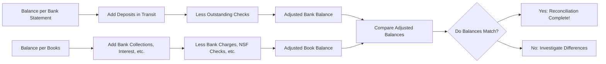
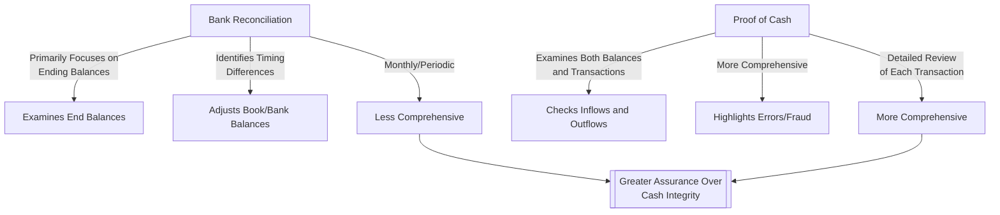

## 9.2 Bank Reconciliations, Proof of Cash

Cash is often considered the lifeblood of any organization, making its accurate measurement and presentation in the financial statements critically important. Bank reconciliations and the proof of cash procedure are two essential tools for ensuring that a company’s recorded cash balances agree with actual bank records. They also help detect errors, fraud, and potential control weaknesses. This section provides a detailed framework for preparing bank reconciliations, highlights common reconciling items such as outstanding checks and deposits in transit, and introduces the proof of cash method.

### Understanding the Purpose of Bank Reconciliations

Bank reconciliations serve to harmonize the difference between a company’s general ledger cash account (often referred to as the “book balance”) and the balance per the bank statement. Because timing differences and bank charges or credits may not be recognized in a company’s records immediately, discrepancies can exist. A well-executed bank reconciliation systematically identifies and explains these differences, ensuring that any necessary adjustments are recorded properly.

Performing regular bank reconciliations can:
• Identify timing differences between the company’s records and the bank statement.  
• Pinpoint unrecorded transactions, such as bank fees or service charges.  
• Detect potential fraud, such as unauthorized withdrawals.  
• Reveal bookkeeping errors in either the company’s accounting records or the bank’s records.  
• Contribute to reliable financial statements by ensuring accurate cash balances.

### Key Concepts in Bank Reconciliations

Reconciling items typically arise from timing differences or omissions. The following are some of the most common and important reconciling items:

• Outstanding Checks: Checks that have been issued and recorded by the company but have not yet cleared the bank. These cause the bank balance to be higher than what the company’s records show.  
• Deposits in Transit: Deposits that have been recorded on the company’s books but have not yet been processed by the bank. These cause the company’s recorded balance to exceed the balance per the bank.  
• Bank Service Charges: Fees charged by the bank for account maintenance, wire transfers, or other bank services. These charges are often first reflected in the bank statement and may not be recorded in the company’s books until discovered.  
• NSF (Not Sufficient Funds) Checks: Checks deposited that have been returned by the bank due to insufficient funds. When this occurs, the company’s initial recording of a deposit must be reversed.  
• Interest Income: Some accounts may earn interest, which may be recorded in the bank statement before the company updates its books.  
• Bank Collections: The bank might collect notes or accounts receivable on behalf of the company, which appear on the bank statement but are not immediately recorded in the company’s books.

### Preparing a Bank Reconciliation: A Step-by-Step Process

While there can be slight variations depending on organizational policies or software systems, the core steps remain largely consistent across businesses and industries.

Gather Relevant Documents  
Obtain the bank statement for the period to be reconciled and the corresponding cash ledger or check register from the company’s accounting system. The statement typically contains all checks paid, deposits credited, and any fees or other transactions for that statement cycle.

Compare Balances  
Identify the statement end balance at the bottom of the bank statement. Compare this figure to the ending book balance from the general ledger’s cash account. These two balances will rarely match, primarily due to timing differences.

Adjust the Bank Balance  
Reconcile the bank statement balance to the correct, up-to-date balance:

• Add Deposits in Transit: These deposits have been recorded in the company’s books but not yet by the bank.  
• Subtract Outstanding Checks: These checks have been issued and recorded by the company but have not yet cleared the bank.  

This yields the “Adjusted Bank Balance.” It should reflect the true balance that the bank would show if all recorded transactions were processed.

Adjust the Book Balance  
Adjust the company’s book balance to also arrive at the same true, up-to-date amount:

• Add Items Not Recorded by the Company (Bank Collects, Interest Earned): Sometimes the bank may collect notes or interest on behalf of the company. If the company has not recognized these or other bank credits, they must be added to the book balance.  
• Subtract Items Not Yet Recorded by the Company (Bank Service Charges, NSF Checks): Deduct any fees or returned deposits that the bank has recognized, but which have not yet been recorded in the company’s books.

The resulting figure is the “Adjusted Book Balance,” the corrected version of the company’s ledger balance.

Compare Adjusted Balances  
After the above adjustments, the adjusted bank balance should match the adjusted book balance. Any lingering difference indicates an unresolved or unrecorded item that must be found and reconciled. Repeated mismatches may suggest errors, fraud, or that some transactions are being overlooked.

Example Table of a Simplified Bank Reconciliation:

|                                        | Amount    |
|----------------------------------------|-----------|
| Balance per Bank Statement, 5/31/20XX  | $25,000   |
| Add: Deposits in Transit               | $ 3,000   |
| Less: Outstanding Checks               | $ 2,200   |
| Adjusted Bank Balance                  | $25,800   |
|                                        |           |
| Balance per Company’s Books, 5/31/20XX | $26,300   |
| Add: Bank Collection on Note           | $   400   |
| Less: Bank Service Charge              | $    50   |
| Less: NSF Check                        | $   850   |
| Adjusted Book Balance                  | $25,800   |
|                                        |           |
| Difference                             | $     -0- |

In this example, the difference has been resolved to zero, indicating a properly reconciled bank statement.

### Visualizing the Reconciliation Process

Below is a Mermaid.js flowchart to illustrate the reconciliation process:

When the process is complete, both the adjusted bank balance and the adjusted book balance should be the same. If they differ, the accountant or bookkeeper must investigate errors or omissions.

### Common Reconciling Items in Greater Detail

Outstanding Checks  
• Tend to be significant for companies that issue a large volume of checks.  
• May be identified by comparing the check numbers on the bank statement to the company’s check register or general ledger.  
• If a check remains outstanding for an extended period, the company may need to investigate why it has not cleared.

Deposits in Transit  
• Often occur when deposits are made near the end of the month.  
• Larger organizations sometimes have internal cutoffs, meaning a deposit recorded on the company’s book on the last day of the month might not be reflected in the bank until the following business day.  
• It is crucial for the person reconciliating to distinguish between actual deposits in transit versus posted errors or missing deposits.

Bank Service Charges  
• Can be monthly fees, check image fees, wire transfer fees, or charges related to specific services like returned check processing.  
• Often small amounts, but overlooked fees can accumulate if not dealt with consistently.

NSF Checks  
• Occur when a customer’s check bounces after having been initially recorded as a deposit.  
• The company’s ledger would reflect an increased cash balance upon initial deposit, making the subsequent bank correction a negative adjustment.  
• Must ensure that any related bank fees are also promptly recorded.

Interest Income  
• May be minimal at times, but important to record accurately to maintain integrity in the company’s cash and interest income accounts.  
• Especially relevant for interest-bearing accounts, money market accounts, or other investment vehicles integrated with the bank.

### Additional Adjustments

In addition to the typical items mentioned, some reconciliations may include unusual or one-time items, such as special bank corrections, errors in the company’s records (e.g., a deposit posted to cash for $5,900 instead of the correct $5,090), or erroneous bank postings. Ensuring all unidentified items are investigated before finalizing the reconciliation is vital to preventing misstatements.

### The Proof of Cash: An Enhanced Control Procedure

Beyond the standard bank reconciliation, a proof of cash represents a more in-depth analysis that reconciles not only ending balances but also the transactions recorded during a particular period. In essence, a proof of cash ties together the beginning balances, the total inflows (debits to cash), the total outflows (credits to cash), and the ending balances for both the bank statement and the company’s books.

The process can be broken down into the following elements:

• Beginning Cash Balance: Confirm that the previous period’s reconciled cash balance matches the current period’s starting point for both the bank and the company’s ledger.  
• Total Cash Receipts: Summarize all deposits recorded in the company’s books and compare with all deposits per the bank statement. Identify and investigate any differences (e.g., deposits in transit or bank errors).  
• Total Cash Disbursements: Examine all checks and electronic withdrawals recorded in the company’s books and reconcile them to the bank statement’s total checks and electronic payments.  
• Ending Cash Balance: Ensure that the prior period’s ending balance plus total cash receipts, minus total cash disbursements, equals the current period’s ending balance for both sets of records.

#### When to Use Proof of Cash

• When internal controls are weak, and management suspects possible manipulations or fraudulent disbursements.  
• When turnover in the accounting department is high, leading to increased risk of errors.  
• During external audits, especially if the auditor wants greater assurance over cash transactions.  
• In heavily cash-dependent industries where small discrepancies can accumulate quickly.

Here is a simple schematic representation of a proof of cash table, showing the detailed alignment of inflows, outflows, and balances:

|                            | Bank Statement | GL (Books) | Differences |
|----------------------------|---------------:|-----------:|------------:|
| Beginning Balance          | $10,000       |  $10,000   |       -     |
| Add: Total Deposits        |  50,000       |   49,950   |   50        |
| Less: Total Disbursements  | (45,000)      |  (44,900)  |  (100)      |
| Ending Balance             | $15,000       |  $15,050   |   (50)      |

In this simplified example, differences of $50 and $(100) are identified between the bank statement and the company books. Tracing these differences might reveal either timing issues or errors that need adjusting entries. At the end of the proof of cash procedure, these differences should be fully explained or corrected.

### Practical Example and Case Study

Consider the case of a small retail business that had experienced multiple cases of misplaced receipts. The new accountant decided to implement a monthly proof of cash procedure to ensure that all deposits and withdrawals were accounted for. Over a period of three months, the accountant uncovered that certain cash sales were being routinely deposited one day late, causing deposits in transit to perpetually appear. This insight prompted the company to adjust its cutoff policies, ultimately improving accuracy in month-end bank reconciliations and reducing staff errors and confusion.

### Best Practices for Bank Reconciliations and Proof of Cash

• Reconcile Cash Accounts Monthly: Performing reconciliations more frequently enables prompt identification of errors or suspicious transactions.  
• Maintain Proper Segregation of Duties: Prevent the same individual from handling receipts/disbursements and performing reconciliations. This separation lowers fraud risk.  
• Keep Adequate Documentation: Ensure all reconciling items (e.g., outstanding checks, deposits in transit) are supported by proper records. This helps expedite future reconciliations and audits.  
• Use Accounting Software Features: Modern accounting systems can automate much of the comparison, though one should actively review unusual or large differences.  
• Investigate Unusual Patterns: Repeated discrepancies might indicate chronic timing delays or potential fraud. A deep dive may reveal issues requiring policy or system changes.  
• Consider Rolling Bank Reconciliations: For organizations with high transaction volumes, a rolling or continuous reconciliation approach ensures that differences are resolved promptly rather than waiting for month-end.  
• Implement the Proof of Cash for High-Risk Periods: This method should be considered when major changes occur or during year-end to tighten control over the most liquid asset—cash.

### Diagram: Key Differences Between Bank Reconciliation and Proof of Cash

The bank reconciliation primarily ensures that ending balances agree, while the proof of cash method dives into both the beginning and ending balances and all transactions in between.

### Conclusion

Bank reconciliations and the proof of cash procedure are indispensable for ensuring that an entity’s recorded cash balance aligns with its actual cash balance at the bank. By regularly performing these procedures, organizations can spot and resolve errors, detect fraudulent activity, and maintain the integrity of their financial statements. Understanding both the basic steps of reconciliation and the in-depth nature of proof of cash empowers accountants, auditors, and managers to bolster financial controls while improving the accuracy and reliability of financial reporting.

Adopting these tools not only supports compliance with accounting standards but also provides management and stakeholders with confidence in the organization’s financial health. Whether you are a seasoned accountant or learning these processes for the first time, continuous practice, attention to detail, and adherence to best practices will help you master the art of reconciling and safeguarding one of the most critical assets in any organization—cash.

## Mastering Bank Reconciliations and Proof of Cash: 10-Question Quiz



### Which of the following best describes the primary purpose of a bank reconciliation?
- [ ] To compare a company’s net income to the bank’s reported income 
- [x] To reconcile the company’s book balance of cash with the bank statement balance
- [ ] To identify net credit sales not yet recorded
- [ ] To reconcile the company’s retained earnings for the period
> **Explanation:** A bank reconciliation compares and adjusts the company’s internal cash records to the balance per the bank statement, identifying timing differences and unrecorded items.

### Which of the following is a common addition to the balance per the bank in a bank reconciliation?
- [ ] Outstanding checks
- [x] Deposits in transit
- [ ] NSF checks
- [ ] Bank service charges
> **Explanation:** Deposits in transit are recorded in the company’s books but have not yet been processed by the bank, so they are added to the balance per the bank statement.

### What is the main difference between a bank reconciliation and a proof of cash?
- [ ] Bank reconciliation is performed monthly, while proof of cash is performed weekly
- [x] Bank reconciliation focuses mainly on ending balances, while proof of cash also reconciles total receipts and disbursements
- [ ] Bank reconciliation cannot detect fraud, while proof of cash can
- [ ] Proof of cash can only be used for large corporations
> **Explanation:** A proof of cash is more comprehensive, looking at both the movement of cash (inflows and outflows) and ending balances, whereas a bank reconciliation typically focuses on aligning the ending balances.

### Which of the following would typically decrease a company’s book balance of cash during the month after a bank statement is received?
- [ ] A deposit in transit
- [ ] An outstanding check
- [x] A bank service charge not yet recorded
- [ ] Customer checks received but not yet deposited
> **Explanation:** Bank service charges would cause the company to reduce its book balance, as they must be recorded as an expense or a deduction from cash.

### What is the primary function of a “deposit in transit” during the bank reconciliation process?
- [ ] To record checks that have bounced due to insufficient funds
- [x] To indicate that a deposit posted on the company’s books has not yet been recognized by the bank
- [ ] To signal that the bank has collected funds on behalf of the company
- [ ] To show that the company has received a refund from a creditor
> **Explanation:** Deposits in transit represent deposits already recorded in the company’s ledger but not processed by the bank, necessitating an addition to the bank side of the reconciliation.

### Which of the following scenarios would most likely lead to an “NSF check” entry in the bank statement?
- [ ] A wire transfer fee from the bank
- [ ] A direct deposit from a customer
- [x] A check deposited by the company that was returned due to insufficient funds in the issuer’s account
- [ ] A bank error in crediting the wrong customer account
> **Explanation:** NSF (Not Sufficient Funds) checks arise when a customer’s check is returned unpaid by the bank, requiring a reversal of the initial deposit entry.

### In a bank reconciliation, which item is subtracted from the balance per the bank statement?
- [ ] Bank collections
- [x] Outstanding checks
- [ ] Bank interest earned
- [x] Bank errors that increase the company’s bank statement
> **Explanation:** Outstanding checks (already deducted from the company’s books) have not cleared the bank, so they must be subtracted from the bank balance. Bank errors that incorrectly increase the bank statement are also subtracted from the bank side.

### Why might management choose to perform a proof of cash rather than only a standard bank reconciliation?
- [ ] To reduce the time needed for monthly financial reporting
- [ ] Because a proof of cash focuses solely on interest income
- [ ] Because it automatically resolves all errors without review
- [x] To obtain a more detailed review of all cash inflows and outflows, enhancing fraud detection
> **Explanation:** A proof of cash reconciles beginning balances, ending balances, and all transactions in between, providing a thorough check on actual cash receipts and disbursements.

### Which of the following statements is true regarding adjustments for a bank reconciliation?
- [x] Both the bank balance and the book balance may require adjustments
- [ ] Only the bank balance requires adjustments
- [ ] Only the book balance requires adjustments
- [ ] Adjustments should be made after finalizing financial statements
> **Explanation:** Common adjustments appear on both sides of the reconciliation. For instance, deposits in transit adjust the bank side, while service charges adjust the book side.

### The proof of cash method is more complete than a bank reconciliation because it:
- [x] Verifies beginning balances, receipts, disbursements, and ending balances for both the bank and the company
- [ ] Ensures the bank’s total income agrees with the company’s net profits
- [ ] Replaces the need for a formal audit
- [ ] Eliminates the possibility of outstanding checks
> **Explanation:** A proof of cash is an expanded reconciliation tool that reconciles both balances and total transactions over a period, thus catching errors or fraud more effectively.



---

## For Additional Practice and Deeper Preparation

[**FAR CPA Hardest Mock Exams: In-Depth & Clear Explanations**](https://www.udemy.com/course/far-cpa-mock-exams/?referralCode=F88050F8D5C76764F6BD)

Financial Accounting and Reporting (FAR) CPA Mocks: 6 Full (1,500 Qs), Harder Than Real! In-Depth & Clear. Crush With Confidence!

• Tackle full-length mock exams designed to mirror real FAR questions.  
• Refine your exam-day strategies with detailed, step-by-step solutions for every scenario.  
• Explore in-depth rationales that reinforce higher-level concepts, giving you an edge on test day.  
• Boost confidence and minimize anxiety by mastering every corner of the FAR blueprint.  
• Perfect for those seeking exceptionally hard mocks and real-world readiness.

_Disclaimer: This course is not endorsed by or affiliated with the AICPA, NASBA, or any official CPA Examination authority. All content is for educational and preparatory purposes only._
