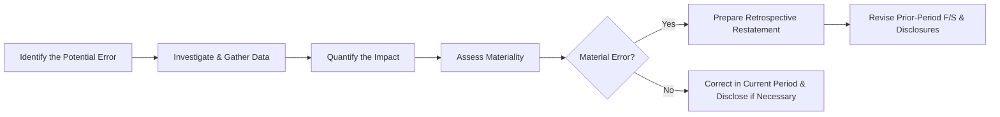

## 18.3 Error Corrections, Prior-Period Adjustments

When preparing financial statements, organizations strive for accuracy, completeness, and reliability. However, errors can occur due to misclassifications, oversight of transactions, computational or clerical mistakes, or misapplication of accounting principles. Once identified, these errors must be appropriately corrected to preserve the integrity of an entity’s financial information and maintain users’ confidence in the financial reporting process. This section explores U.S. GAAP guidance (ASC 250, Accounting Changes and Error Corrections) surrounding error corrections, including how to retrospectively adjust prior-period financial statements and the specific effects on retained earnings (or net assets for not-for-profit entities). We also highlight best practices, illustrate detailed real-world scenarios, and explain how these corrections interplay with comparative financial statements.

----------------------------------------------------------------------------
  
## Nature and Types of Errors

Errors vary in complexity and impact. Common categories include:

• Mathematical/Clerical Errors: Computation mistakes, such as incorrect summations or omissions in spreadsheet calculations.  
• Misapplication of Accounting Principles: Applying an incorrect principle, such as capitalizing an expenditure that should have been expensed, or using an improper inventory valuation method.  
• Oversight of Facts or Transactions: Neglecting differences between GAAP and IFRS, ignoring contract details, or missing relevant adjustments at the period-end closing.  
• Misclassifications: Recording items in the wrong account or using an incorrect functional classification (e.g., misclassifying a long-term liability as current).  

Regardless of the type, the overarching goal is consistent, comparable financial statements that faithfully represent the entity’s financial position, operating results, and cash flows.

----------------------------------------------------------------------------
  
## Key Authoritative Guidance

Under U.S. GAAP, ASC 250, “Accounting Changes and Error Corrections,” lays out a framework for correcting material errors in previously issued financial statements. The fundamental principle is restatement: errors generally require retrospective correction, treating the correction as if the error never occurred. This ensures that the financial statements are presented on a comparable basis from period to period.

In IFRS, the equivalent requirements fall under IAS 8, “Accounting Policies, Changes in Accounting Estimates and Errors,” which similarly mandates retrospective restatement unless impracticable.

----------------------------------------------------------------------------
  
## Identifying an Error

Before any corrective procedure is undertaken, the entity must identify the existence of an error. This process may result from:

• Internal Audits or Management Reviews: Scrutinizing historical transactions can reveal misapplications of GAAP or computational breakdowns.  
• External Audits: External auditors might detect irregularities during their annual review.  
• Regulatory Scrutiny: The SEC (in the case of public companies) or other regulatory authorities might question or challenge certain accounting methods or presentations.  
• Whistleblower or Internal Reporting: Employees with knowledge of an error or misapplication might alert management or internal audit.  

As soon as a potential error is flagged, management must investigate thoroughly, determine its root cause, and assess the materiality of the error.

----------------------------------------------------------------------------
  
## Materiality Considerations

Not all errors necessitate restatement. Materiality involves the magnitude of the error in relation to the entity’s financial statements as a whole and whether it could influence the decisions of users (investors, lenders, regulators, etc.). ASC 250 states that an error must be corrected if it is material. Immaterial errors can be corrected in the current period, although best practice calls for transparent disclosures.

Evaluating materiality often includes both quantitative and qualitative factors. For instance, a small misclassification might be quantitatively immaterial but could be qualitatively significant if it masks a trend or violates a debt covenant. Typically, an error is considered material if it alters net income or key performance measures enough to change decisions made by the financial statement users.

----------------------------------------------------------------------------
  
## Retrospective Restatement: The General Rule

Under U.S. GAAP, the correction of material errors requires retrospective restatement. In other words, the financial statements are revised as though the error never happened. The process generally involves:

1. Adjusting each prior-period financial statement to reflect the correction of the error.  
2. Updating the carrying amounts of assets and liabilities at the beginning of the earliest period presented, if necessary.  
3. Recording the cumulative effect of the error correction as an adjustment to the opening balance of retained earnings (or net assets for a not-for-profit entity) if the error originated in a period prior to the earliest presented.  

When prior periods are presented for comparative purposes, the statements must show revised amounts for all impacted line items, along with note disclosures that explain the nature of the error and how the correction affected key line items.

----------------------------------------------------------------------------
  
## Prior-Period Adjustments and the Effect on Retained Earnings

One of the most significant impacts of correcting errors is on retained earnings (for for-profit entities) or net assets (for not-for-profit entities). If the error occurred in a previous year that is presented in the comparative financial statements, the prior-period income statement(s) are adjusted in those periods. If the error predates the earliest period presented—or if certain comparative periods are not included in the financial statements—then the cumulative effect of correcting the error is recognized as an adjustment to opening retained earnings (or net assets).

Example – Correction of a Depreciation Error  
--------------------------------------------
Suppose in 20X4, Company A discovered that the useful life of a major piece of equipment initially placed in service in 20X2 was originally estimated incorrectly. They had used a 5-year life instead of the correct 10-year life. This resulted in excess depreciation expense in 20X2 and 20X3.

• Step 1: Quantify the Overall Error: Management calculates the lower depreciation expense that should have been recorded in 20X2 and 20X3 under a 10-year life.  
• Step 2: Determine Materiality: The excess depreciation is deemed material.  
• Step 3: Adjust Financial Statements: In the comparative financial statements for 20X4:  
  – The 20X2 and 20X3 line items related to depreciation expense, net income, and retained earnings are restated.  
  – The beginning retained earnings for 20X2 is also adjusted for the cumulative effect of the error prior to 20X2 (if applicable, or if an even earlier year was impacted).  

The net effect is to reduce depreciation expense in the restated periods, thereby increasing net income for those prior years and increasing retained earnings correspondingly.

----------------------------------------------------------------------------
  
## Practical Steps to Correct Prior Period Errors

A systematic approach ensures completeness and accuracy when correcting an error.

Explanation of the Steps:  
• Identify the Potential Error: The process starts once there is a suspicion or indication something is amiss.  
• Investigate & Gather Data: Ascertain the nature of the error by reviewing documents, any relevant contractual information, or evidence from accounting systems.  
• Quantify the Impact: Determine the amounts affected, whether they span multiple periods, and how they influence assets, liabilities, revenues, and expenses.  
• Assess Materiality: Evaluate whether the discrepancy is large enough to warrant a restatement.  
• Material Error → Retrospective Restatement: Undertake adjustments of the prior periods. This includes re-computing impacted accounts, adjusting beginning balances of retained earnings where necessary, and updating disclosures.  
• Immaterial Error → Current Period Correction: Minor errors may be corrected in the current period (through normal accounting entries) with minimal prior-year restatement, if any.  

----------------------------------------------------------------------------
  
## Effect on Comparative Financial Statements

When comparative financial statements are presented (for example, 20X4, 20X3, and 20X2 are shown side by side), the retroactive approach adjusts the prior periods to reflect the corrected amounts. The financial statements can then show a restated 20X3 and 20X2. This ensures year-over-year comparability for the reader.

Disclosing the changes is critical. Entities must provide footnotes that describe the nature of the error, its effect on each line item, and how net income and retained earnings changed. These disclosures typically highlight the corrected amounts for each amended line item and explain the cause of the error.

----------------------------------------------------------------------------
  
## Disclosure and Transparency

ASC 250 requires robust disclosures to ensure users of the financial statements fully understand what changed and why:

• A description of the error and how it arose.  
• The effect of the correction on each financial statement line item, including earnings per share if applicable.  
• The cumulative effect on retained earnings for the earliest period presented if the error existed in a period prior to that earliest period.  
• Any impacts on ratios, compliance, or contractual obligations that rely on reported numbers.

Not-for-profit entities, as covered in Chapter 4, must also provide details on how the correction impacts net assets. Governmental entities, covered in Chapter 5, may adhere to GASB standards that similarly require retrospective restatement under certain circumstances (though the specifics of governmental accounting frameworks differ somewhat from FASB).

----------------------------------------------------------------------------
  
## Special Circumstances and Limitations

• Impracticability: If it is impracticable to determine the cumulative or period-specific effects of an error, ASC 250 allows slighter modifications to the strict retrospective approach. The entity adjusts current or future periods as best possible, with disclosures explaining why full retrospective adjustments were not feasible.  
• IFRS Considerations: IFRS (IAS 8) has largely parallel requirements, but international companies should confirm local regulatory or statutory specifications.  
• Prior Management or Auditor Turnover: If staff have changed significantly, it can be more difficult to unearth or verify past year transactions. Proper documentation, archiving, and procedures for knowledge transfer help mitigate these risks.

----------------------------------------------------------------------------
  
## Real-World Scenario: Misclassifying a Liability as Equity

Consider a company that, during 20X3, issued what it believed to be preferred stock. In fact, contractual terms indicated mandatory redemption, requiring classification as a liability under GAAP. Consequently, the 20X3 balance sheet listed an amount as “preferred stock” in the equity section instead of in liabilities. This classification error affected ratios like debt-to-equity and impacted compliance with loan covenants.

In 20X5, after reviewing the financing arrangement, management identified the error and concluded it was material to 20X3 and 20X4. Following ASC 250 guidelines:  
• The 20X3 and 20X4 financial statements were restated to reclassify the instrument as a liability.  
• The 20X3 and 20X4 income statements were adjusted if there were different financing costs involved (e.g., interest expense).  
• Retained earnings were adjusted for any difference in net income recognized under the proper classification.  

This approach preserved comparability and corrected all affected periods.

----------------------------------------------------------------------------
  
## IFRS vs. U.S. GAAP

Both IAS 8 and ASC 250 dictate retrospective restatement as the primary method of correcting prior-period errors. Differences between these standards are often procedural or disclosure-oriented rather than conceptual. For example, IFRS emphasises that entities must correct all material prior-period errors retrospectively in the first set of financial statements authorized for issue after the discovery of the error, with some exceptions for impracticability. U.S. GAAP includes similar steps but may be more prescriptive in certain disclosures.

The table below summarizes these similarities and minor distinctions:

| Aspect                          | U.S. GAAP (ASC 250)                                | IFRS (IAS 8)                                  |
|--------------------------------|----------------------------------------------------|-----------------------------------------------|
| Retrospective Restatement      | Required for material errors, if practicable       | Required for material errors, if practicable  |
| Disclosure Requirements        | Detailed footnote syntax and quantitative effects  | Broadly similar, with some IFRS-specific nuances |
| Impracticability Exceptions    | Allowed, with robust disclosure                    | Similar approach                               |
| Opening Equity Adjustment      | Correction typically runs through retained earnings | Correction runs through opening equity        |

In practice, the corrections are quite similar, but local regulations and guidance from regulators (e.g., the SEC for U.S. public companies) can introduce additional requirements.

----------------------------------------------------------------------------
  
## Common Pitfalls and Challenges

• Failing to Thoroughly Investigate the Root Cause: Quick fixes without determining whether the original issue extends to multiple periods might lead to repeated restatements.  
• Underestimating Materiality: Management may incorrectly deem an error immaterial and only discover after an external audit or regulatory inquiry that retrospective correction was needed from the start.  
• Delayed Disclosures: Investors and creditors often react negatively to restatements made without adequate and timely communication.  
• Inadequate Documentation: Insufficient records about how original entries were calculated create uncertainty when restating older periods.  
• Lack of Coordination with External Auditors: Not collaborating with auditors can cause friction, leading to confusion about the final restatement amounts.

----------------------------------------------------------------------------
  
## Best Practices for Error Corrections

• Maintain Comprehensive Documentation: File and preserve supporting documents for key accounting decisions, internal memoranda, and calculations.  
• Implement Robust Internal Controls: Consistent account reconciliations, timely closing processes, and segregation of duties help detect errors early.  
• Conduct Regular Self-Audits: Periodic reviews of significant accounts, especially those prone to estimates (e.g., allowances for doubtful accounts, depreciation, or intangible asset valuations).  
• Disclose Early and Transparently: Once an error is discovered, communicate with stakeholders, including regulators, lenders, and shareholders, as soon as reasonably possible.  
• Coordinate with Auditors: Collaborative efforts can streamline the restatement process, ensuring no step is overlooked.

----------------------------------------------------------------------------
  
## Illustrated Example – Multi-Year Misstated Expense

Company B discovered in 20X5 that a certain operational expense was incorrectly capitalized from 20X2 through 20X4. Suppose the total misstatement for those years is $300,000 and is deemed material.

1. Identify Periods Affected: 20X2–20X4.  
2. Compute Correct Amount Per Year:  
   • 20X2: $100,000  
   • 20X3: $100,000  
   • 20X4: $100,000  

3. Retrospective Adjustment:  
   • Restate 20X2 and 20X3 in the comparative financial statements.  
   • Adjust the beginning retained earnings balance of 20X4 for the cumulative effect if 20X2 is not presented (or if partial periods are shown).  
4. Disclosures: Include a narrative explaining nature of the error, prior statements affected, the line items and amounts involved, and updated retained earnings.  

Meantime, the entity must ensure the asset book values are correctly reduced (if they remain on the books), typically through a credit to the asset account and a debit to retained earnings (for previously overstated assets).

----------------------------------------------------------------------------
  
## Conclusion and Learning Takeaways

Error corrections and prior-period adjustments reflect a fundamental aspect of reliable financial reporting—ensuring transparency and accuracy. Whether errors arise from straightforward computational mistakes or complex misapplications of GAAP, the retrospective restatement requirement fosters comparability and consistency across financial statement periods.

• Retrospective Restatement: The gold standard for material errors, correcting impacted comparative periods and retained earnings.  
• Disclosure and Transparency: A cornerstone of user confidence in financial statements.  
• Impact on Retained Earnings: Adjust the opening retained earnings if the error dates to periods not presented or if it originated before the earliest comparative year.  
• Minimizing Errors: Strong internal controls, diligent reviews, and clear communication can significantly reduce the frequency and severity of restatements.

Armed with these concepts, you are better prepared to navigate the nuances of error corrections, prior-period adjustments, and the interplay of retrospective restate­ment on financial statements. For advanced practice, one might also explore Chapter 18.1 and 18.2, which address changes in accounting principles and changes in estimates, respectively, further rounding out your competence in addressing adjustments to prior financial data.

----------------------------------------------------------------------------

## Test Your Knowledge: Error Corrections and Prior-Period Adjustments



### A company discovers one of its expenses was recorded as capitalized in the prior year. Which statement best describes how to correct this material error under U.S. GAAP?
- [x] The company should restate the prior-year financial statements and adjust the opening retained earnings if the error began before the earliest year presented.  
- [ ] The company should only adjust retained earnings in the current year, with no retrospective correction.  
- [ ] The company should disclose the error but should not alter the previously issued financial statements.  
- [ ] The error can only be corrected prospectively in future financial statements.  

> Explanation: ASC 250 requires retrospective restatement for material errors, which includes adjusting the affected prior-year statements and retained earnings when the error extends back to periods not presented.

### A material error from 20X0 is discovered in 20X5, and comparative statements are presented for 20X4 and 20X3 only. How should this be corrected?
- [x] Record a prior-period adjustment to the opening balance of retained earnings in 20X3 and disclose the nature of the error.  
- [ ] Adjust 20X4 net income only, since that is the earliest comparative year.  
- [ ] Treat the error as prospective and adjust future financial statements.  
- [ ] Restate the 20X5 income statement because the error was discovered in that year.  

> Explanation: When an error occurs in a period before the earliest period presented, the correction is typically booked to the opening retained earnings of the earliest comparative year, backed by full disclosure.

### Which of the following categories of errors usually leads to prior-period adjustments?
- [x] An error arising from the misapplication of GAAP or an overlooked transaction that materially affects reported results in prior years.  
- [ ] A change in an accounting estimate that was based on new information unavailable in prior periods.  
- [ ] A voluntary accounting policy change that is applied prospectively.  
- [ ] Adjusting a sales transaction that was never recorded and is deemed immaterial.  

> Explanation: Material errors, such as improper GAAP application or overlooked events, require prior-period adjustments. Changes in estimates are handled prospectively, while policy changes are typically accounted for under a distinct set of guidelines.

### A restatement due to a mathematical miscalculation in the previous year’s inventory would require:
- [x] Retrospective recognition in the prior year’s financial statements and an adjustment to retained earnings if needed.  
- [ ] Prospective recognition starting in the current year.  
- [ ] An unrecognized subsequent event adjustment.  
- [ ] No adjustment if the error netted out over multiple years.  

> Explanation: Under ASC 250, a material mathematical error in the previous year prompts retrospective restatement of that prior year’s statements.

### Which of the following is true regarding IFRS error correction according to IAS 8?
- [x] IFRS requires retrospective restatement of material errors, similar to U.S. GAAP, unless it is impracticable.  
- [ ] IFRS always mandates prospective reporting of errors if discovered after the financial statements have been issued.  
- [x] IFRS only requires corrections for numerical errors, not classification errors.  
- [ ] IFRS does not allow an opening equity adjustment for prior-period errors.  

> Explanation: Both IFRS (IAS 8) and U.S. GAAP (ASC 250) demand retrospective restatement for material errors. IFRS also allows an opening equity adjustment where the error predates the earliest presented period.

### Why must errors be clearly disclosed in the notes to the financial statements?
- [x] To ensure transparency for stakeholders, clarifying the nature and magnitude of the correction.  
- [ ] To hide sensitive information from external auditors.  
- [ ] To obviate the need for a prior-period adjustment.  
- [ ] To comply with revenue recognition standards.  

> Explanation: Proper disclosure upholds transparency and compliance, enabling stakeholders to understand the reasons and effects of the restatement.

### Which step is essential in the process of correcting a prior-period error?
- [x] Quantifying the impact on net income, balance sheet accounts, and retained earnings.  
- [ ] Ignoring comparative financial statements and focusing only on the latest statements.  
- [x] Withholding details from investors to prevent confusion.  
- [ ] Classifying it as an extraordinary item.  

> Explanation: A thorough quantification is fundamental to ensure appropriate adjustments to historical financial statements and the related equity accounts. Disclosures must be transparent, not withheld.

### When an error extends back more years than are presented in the financial statements, how is the earliest year presented typically adjusted?
- [x] The cumulative effect of the error is recorded in the opening retained earnings balance of the earliest year.  
- [ ] The financial statements of that earliest presented year are left as-is.  
- [ ] The error is noted but no actual adjustments are made.  
- [ ] Management adjusts only the comparatives from the second-oldest year.  

> Explanation: Any effect of an error that predates the earliest presented period is adjusted through the opening retained earnings (or net assets for NFPs) of that earliest period, ensuring continuity and consistency.

### A company’s internal audit discovers that they overstated their revenue in each of the last three years due to an oversight. Which action is correct?
- [x] Restate all affected years to correct revenue and related balance sheet accounts, adjusting beginning retained earnings if needed.  
- [ ] Record the entire revenue adjustment in the current year.  
- [ ] Write off the overstated revenue as “Miscellaneous Expense” in the current year.  
- [ ] Adjust only the upcoming financial statements to reduce future revenue.  

> Explanation: A revenue overstatement is corrected retrospectively in each year impacted. If any period predates the earliest year presented, that portion is booked through opening retained earnings.

### Correcting a material prior-period error discovered in the current year is:
- [x] A prior-period adjustment under ASC 250 requiring retrospective restatement unless impracticable.  
- [ ] A change in accounting estimate.  
- [ ] A voluntary change in accounting principle.  
- [ ] A one-time prospective expense.  

> Explanation: Material prior-period errors are handled as prior-period adjustments per ASC 250, applying a retrospective approach where feasible.



----------------------------------------------------------------------------

## For Additional Practice and Deeper Preparation

[FAR CPA Hardest Mock Exams: In-Depth & Clear Explanations](https://www.udemy.com/course/far-cpa-mock-exams/?referralCode=F88050F8D5C76764F6BD)

Financial Accounting and Reporting (FAR) CPA Mocks: 6 Full (1,500 Qs), Harder Than Real! In-Depth & Clear. Crush With Confidence!

• Tackle full-length mock exams designed to mirror real FAR questions.  
• Refine your exam-day strategies with detailed, step-by-step solutions for every scenario.  
• Explore in-depth rationales that reinforce higher-level concepts, giving you an edge on test day.  
• Boost confidence and minimize anxiety by mastering every corner of the FAR blueprint.  
• Perfect for those seeking exceptionally hard mocks and real-world readiness.

_Disclaimer: This course is not endorsed by or affiliated with the AICPA, NASBA, or any official CPA Examination authority. All content is for educational and preparatory purposes only._
