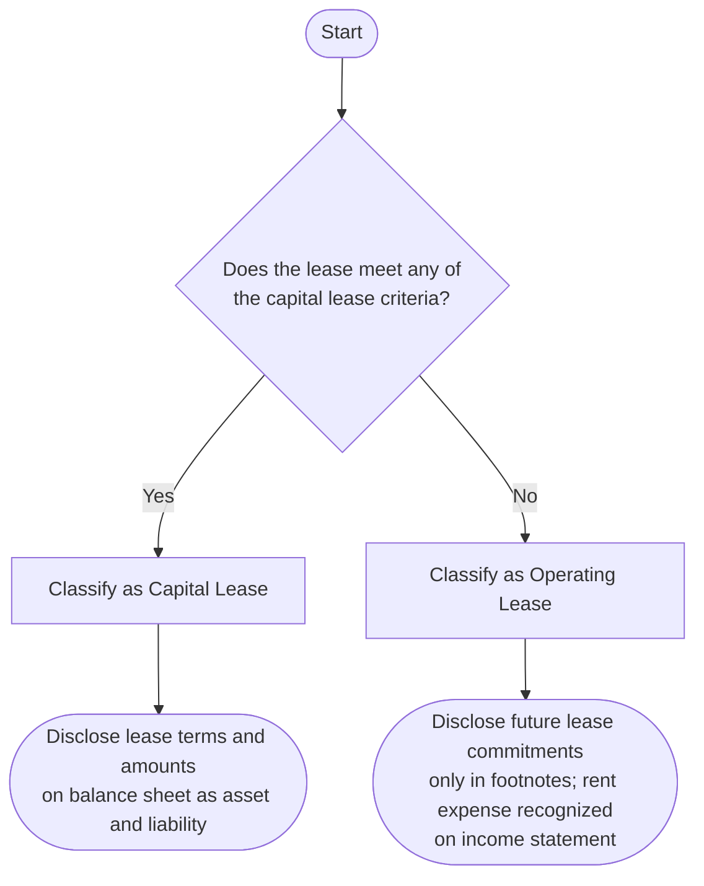

## 19.3 Commitments (Operating Leases, Purchase Obligations)

Commitments represent obligations that an entity takes on but may not yet be fully reflected in its primary financial statements. Two primary categories of commitments under the legacy standard (pre-ASC 842) include operating lease commitments and long-term purchase obligations. Although lease rules have changed significantly under ASC 842, it is still important to understand how these commitments were treated historically or for comparison purposes. By mastering these concepts, you gain deeper insight into the evolution of lease accounting, best practices for disclosure, and the different paths companies have taken to manage and report their obligations.

This section delves into the conceptual framework, accounting and disclosure requirements, real-world scenarios, common pitfalls, and recommended strategies for handling operating leases (prior to ASC 842) and purchase obligations.

---------------------------------------------------------------------------------------------------
## Overview of Commitments

In accounting, “commitments” generally refer to obligations that may not necessarily be recognized in the current balance sheet but warrant disclosure under U.S. GAAP. These arrangements can materially affect the timing and magnitude of future cash flows, and thus, proper disclosure is critical for both transparency and compliance purposes.

Commitments usually include:  
• Noncancelable operating leases under ASC 840 (legacy standard).  
• Contractual obligations to purchase goods or services over a specified time period (purchase obligations).  

The guiding principle behind the disclosure of commitments is ensuring that users of the financial statements have sufficient information to understand the extent of the company’s future obligations.

---------------------------------------------------------------------------------------------------
## Operating Lease Commitments (Under ASC 840)

Under the legacy standard (ASC 840), leases are classified as either capital (finance) leases or operating leases. An operating lease typically does not transfer substantially all benefits and risks of ownership from the lessor to the lessee. In other words, the lessee treats it almost like a rental agreement, with no recognition of the leased asset or corresponding liability on its balance sheet (except for accrued rent or deferred rent) prior to ASC 842. However, the entity must disclose future minimum payments under these agreements.

### Key Characteristics of an Operating Lease Under ASC 840

• Ownership remains with the lessor.  
• No transfer of the leased asset’s title to the lessee by the end of the lease term.  
• No bargain purchase option providing the lessee an opportunity to acquire the leased asset for significantly less than its fair value.  
• The lease term does not encompass the majority of the asset's economic life (i.e., typically less than 75% of the asset’s useful life).  
• The present value of the lease payments is not substantially all (typically below 90%) of the fair value of the asset.

If any one of these criteria is met under ASC 840, the lease would be classified as a capital lease rather than an operating lease. Otherwise, by default, it remains an operating lease, and the lessee recognizes periodic rent expense on a straight-line basis (unless another systematic approach is more representative of the benefit consumption).

### Lease Expense Recognition

For an operating lease, rent expense is generally recognized on a straight-line basis over the lease term. For example, a 5-year lease with regular monthly payment amounts means the same rent expense would generally appear on the income statement each month, regardless of the payment schedule, unless certain irregularities within the lease contract call for a different systematic allocation.

### Example: Operating Lease Recognition and Disclosure

Suppose Company A signs a noncancelable 5-year lease for a warehouse. The annual payment is $100,000, commencing on January 1 of the first year. Under ASC 840, Company A will:  

1. Record a rent expense of $100,000 each year (assume a straight-line pattern).  
2. Disclose in the notes to the financial statements the amount of rent expense for the period and any significant terms of the lease (such as renewal options or escalation clauses).  
3. Disclose the future minimum lease payments for each of the next five years as lease commitments and, in aggregate, the total future lease payments thereafter. These commitments are not recognized as a liability on the balance sheet but appear in the footnotes.

### Operating Lease Disclosures

Under pre-ASC 842 rules, annual financial statement disclosures for operating leases typically included:  
• A general description of the leasing arrangement.  
• The total rent expense for each period presented.  
• Future minimum lease payments required under noncancelable operating leases for each of the next five years and in the aggregate thereafter.  

Investors, creditors, and other financial statement users rely on these disclosures to assess the magnitude of a company’s off-balance-sheet commitments and the potential future cash outflows.

---------------------------------------------------------------------------------------------------
## Purchase Obligations

A “purchase obligation” is a binding agreement to acquire goods or services that sets a fixed or determinable price and schedule. These obligations can span multiple reporting periods and often result in significant future cash outlays. While they may not always lead to immediate recognition on the balance sheet (unless there is an associated prepayment or liability for goods already delivered), they are crucial for understanding the entity’s commitment to future costs and activities.

### Common Examples

• Long-term supply arrangements (e.g., a 10-year arrangement to buy raw materials from a supplier at certain volumes or prices).  
• Construction or development contracts obligating the entity to pay for construction services over time.  
• Noncancelable purchase orders for major items of property, plant, and equipment.

### Recognition vs. Disclosure

Under U.S. GAAP (pre-ASC 842), a purchase obligation does not usually result in immediate liability recognition, because payment often depends on the future delivery of goods or services. However, once the goods are received or the services are rendered, the liability (e.g., accounts payable) is recognized on the balance sheet. The primary requirement is disclosure, particularly for long-term or material obligations, so that users can gauge the enterprise’s total contractual commitments.

### Practical Example: Long-Term Purchase Obligations

Assume Company B, a manufacturer, signs a 5-year, noncancelable contract with Supplier X to purchase a minimum of 100,000 units of a specialized component each year at a fixed price of $20 per unit. The total contractual commitment is $2 million annually, or $10 million over 5 years. Even if the units have not yet been delivered, Company B has a purchase obligation to pay for these units under certain contract terms. Therefore:

1. **Balance Sheet**: Company B does not recognize a liability at contract inception because no goods or services have yet been delivered.  
2. **Income Statement**: Expenses are recognized as the goods are received and used in production.  
3. **Disclosure**: Company B includes details in the footnotes about the noncancelable obligations for the term of the contract. For example, it would disclose $2 million of commitments in each of the next five years, with a total of $10 million in the aggregate, if the contract is strictly noncancelable and no volume adjustments are permitted.

### Disclosure Requirements for Purchase Obligations

Financial statement notes typically include:  
• A description of the nature and terms of significant purchase obligations.  
• The required future payments, by year, over the next five years and in the aggregate thereafter.  
• Potential risks, such as penalties for nonperformance or price escalation clauses.

---------------------------------------------------------------------------------------------------
## Best Practices and Common Pitfalls

### Best Practices

1. **Maintain Clear Documentation**  
   Document the terms of each material contract—including lease agreements and purchase obligations—and align them with the company’s accounting policies. Proper documentation helps ensure completeness and accuracy in disclosures.

2. **Internal Controls**  
   Implement controls to identify, measure, and track significant purchase and lease commitments. This can involve reconciling departmental records and ensuring that any unauthorized commitments are swiftly detected and rectified.

3. **Frequent Reassessment**  
   Continuously monitor changes in contractual terms—renegotiations, extensions, expansions, or early settlements. A reevaluation ensures that disclosures remain accurate and up to date.

4. **Cross-Functional Collaboration**  
   Work with procurement, legal, and strategic sourcing teams for timely updates on major contracts. Accounting personnel need full visibility into the terms and scope of commitments to properly report them.

### Common Pitfalls

1. **Incomplete Disclosure**  
   Failing to record all noncancelable operating leases or purchase agreements is a common oversight. This can lead to understated commitments and mislead financial statement users.

2. **Incorrect Classification**  
   Treating a lease as operating when it meets one or more of the capital lease criteria under ASC 840 can lead to misrepresentation of liabilities.

3. **Not Considering Renewal Options**  
   Renewal options can sometimes be probable or certain, but if not reported appropriately, future obligations may be understated.

4. **Focusing Solely on Recognition Instead of Disclosure**  
   Some organizations may overly focus on whether lease or purchase commitments should be recognized on the balance sheet, while neglecting crucial narrative disclosures. Comprehensive disclosures enrich the decision-making ability of external users.

---------------------------------------------------------------------------------------------------
## Real-World Considerations

• **Industry Practices**: Certain industries (e.g., airlines, retail) frequently enter into large multi-year operating lease agreements and take-or-pay commitments. Their disclosures can significantly influence investor perception of their long-term obligations and liquidity needs.  
• **Interest Rate Fluctuations**: For multi-year purchase commitments involving variable pricing or escalations tied to interest rates or inflation, monitoring changes becomes important for accurate forecasting and disclosures.  
• **Potential for Renegotiation**: While some commitments may appear burdensome, companies often renegotiate asset usage, purchase quantities, or payment schedules if market conditions change drastically. Such modifications can alter the original reporting obligations and require additional disclosures.

---------------------------------------------------------------------------------------------------
## IFRS Comparison (Brief Note)

Under IFRS (pre-IFRS 16), leased assets and liabilities were recognized under IAS 17, which used a finance vs. operating lease model similar to ASC 840 in spirit, though some details differed. Disclosure requirements for commitments followed IAS 17 and IAS 37 for non-lease purchase obligations, emphasizing the same principle of transparent reporting of future obligations.

---------------------------------------------------------------------------------------------------
## Visual Overview of Lease Classification Under ASC 840

Below is a simplified flowchart (in Mermaid.js) illustrating the classification decision for leases under ASC 840.

Explanation of the Flowchart:  
1. Begin by examining the lease agreement.  
2. If it meets any of the capital lease criteria (transfer of ownership, bargain purchase option, lease term >= 75% of useful life, or PV of payments >= 90% of asset's fair value), classify as capital lease.  
3. Otherwise, it is deemed an operating lease.  
4. A capital lease under ASC 840 recognizes an asset and a corresponding liability, while an operating lease is recognized primarily as periodic rent expense, with future commitments disclosed in footnotes.

---------------------------------------------------------------------------------------------------
## Illustrative Table: Disclosure of Major Commitments

Below is an example table that a company might include in its footnotes to summarize long-term noncancelable commitments:

| Commitment Type                | Year 1   | Year 2   | Year 3   | Year 4   | Year 5   | Thereafter | Total      |
|--------------------------------|----------|----------|----------|----------|----------|------------|------------|
| Operating Lease Payments       | 100,000  | 100,000  | 100,000  | 100,000  | 100,000  |  –         | 500,000    |
| Purchase Obligations (Material)| 500,000  | 500,000  | 500,000  | 500,000  | 500,000  | 1,000,000  | 3,500,000  |
| Total Commitments              | 600,000  | 600,000  | 600,000  | 600,000  | 600,000  | 1,000,000  | 4,000,000  |

In this hypothetical scenario, the entity is contractually bound for at least $4 million across five years plus a portion beyond year 5 in a purchase agreement.

---------------------------------------------------------------------------------------------------
## Practical Tips and Strategies

• **Creating Centralized Commitment Registers**  
  Maintain a central database or register that documents the details of key operating leases and long-term purchase agreements, ensuring timely updates and preventing missing or inconsistent data.  
• **Considering Segregation of Duties**  
  Separate the individuals responsible for initiating purchase orders from those responsible for recording and disclosing commitments to minimize mistakes.  
• **Scenario Planning**  
  Assess how changes in production volumes, expansion, or downsizing might impact purchase obligations or lease usage. Scenario analysis can help leadership decide whether to renegotiate contract terms or manage new inventory or leasing strategies.  
• **Stay Updated on Evolving Standards**  
  Although ASC 842 has superseded ASC 840 for most entities, knowledge of the legacy framework remains essential for historical comparison and for organizations that still have transitional issues.

---------------------------------------------------------------------------------------------------
## References and Further Reading

• Financial Accounting Standards Board (FASB) Accounting Standards Codification, Topic 840 (legacy lease guidance).  
• FASB ASC Topic 440, Commitments, for general commitments guidance.  
• SEC Regulations S-K, Item 303 for management’s discussion and analysis relating to contractual obligations.  
• IAS 17 (IFRS predecessor to IFRS 16) for comparative analysis of lease accounting.  
• IFRS and US GAAP: Similarities and Differences (KPMG or PwC Publications).

---------------------------------------------------------------------------------------------------
## Quiz: Mastering Operating Lease and Purchase Obligation Disclosures



### An operating lease under ASC 840 generally:
- [x] Keeps the leased asset off the lessee’s balance sheet.
- [ ] Treats the leased asset as a capital expenditure.
- [ ] Requires the lessee to accrue interest on the lease liability.
- [ ] Recognizes the entire asset and liability on the lessor’s books only.

> **Explanation:** Before ASC 842, operating leases did not appear on the lessee’s balance sheet (beyond any accrued rent payable). The lease was reported as a periodic rent expense, with future commitments disclosed in the notes.

### Which of the following conditions typically indicates an operating lease rather than a capital (finance) lease?
- [x] The present value of lease payments is less than 90% of the asset’s fair value.
- [ ] The lease transfers title to the lessee by the end of the lease term.
- [x] The lease term is less than 75% of the asset’s remaining useful life.
- [ ] The arrangement includes a bargain purchase option.

> **Explanation:** Under ASC 840, if the lease does not transfer substantially all the benefits and risks of ownership, it is treated as an operating lease. Two such indicators are a lease term less than 75% of the useful life and present value of payments less than 90% of the fair value.

### A manufacturer signs a noncancelable 5-year contract with a supplier to purchase widgets for a fixed price each year. How is this commitment reported before widgets are delivered?
- [x] Disclosed in the footnotes as a purchase obligation.
- [ ] Recognized immediately as a liability for the full contract amount.
- [ ] Reported as an intangible asset for the contract value.
- [ ] Ignored until first delivery occurs.

> **Explanation:** The manufacturer has not incurred a liability until widgets are delivered, but the significant purchase commitment still must be disclosed in the footnotes.

### The primary reason for disclosing noncancelable commitments is:
- [x] To inform users about the entity’s future cash outflows and enhance transparency.
- [ ] To reduce tax liabilities.
- [ ] So companies can capitalize these amounts as intangible assets.
- [ ] To classify them as current or noncurrent liabilities on the balance sheet.

> **Explanation:** The goal of disclosure is to enhance transparency about the timing and magnitude of future cash outflows, benefitting investors, creditors, and other stakeholders.

### Under ASC 840:
- [x] Lease expense on an operating lease is generally recognized on a straight-line basis. 
- [ ] All operating leases are effectively capital leases that must be on the balance sheet.
- [x] Future lease payments must be disclosed in the footnotes.
- [ ] All lease commitments need to be classified as short-term obligations.

> **Explanation:** Under the legacy guidelines of ASC 840, an operating lease’s rent expense is usually spread evenly over the lease term, and expected noncancelable lease obligations must be disclosed.

### A company agrees to pay $300,000 per year for 10 years to secure exclusive rights to a software service. Prior to using the service, this agreement:
- [x] Should be disclosed as a long-term commitment in the notes.
- [ ] Should be recorded as a liability of $3 million at the beginning.
- [ ] Is recognized as a prepaid expense in its entirety.
- [ ] Is reported as part of intangible assets.

> **Explanation:** Under pre-ASC 842 rules, if the service has not yet been provided, no obligation is recognized as a liability. Disclosure in footnotes is necessary since it’s a material and noncancelable commitment.

### Failure to disclose a significant purchase obligation:
- [x] Can lead to an understatement of future commitments and mislead users.
- [ ] Has no effect on the financial statements.
- [x] May be viewed as a material omission by auditors.
- [ ] Is permitted if management deems it immaterial.

> **Explanation:** Proper disclosure of significant obligations is a fundamental requirement, and omissions can be considered material misstatements.

### If a lease meets any of the capital lease tests under ASC 840:
- [x] The lease is recorded as a leashold asset and corresponding obligation on the lessee’s balance sheet.
- [ ] The lease is always classified as operating.
- [ ] The lessee may freely choose how to recognize it.
- [ ] There is no requirement for footnote disclosures.

> **Explanation:** ASC 840 states that if any of the capital lease indicators are met, the lease is accounted for as a capital lease, and thus recognized as an asset and liability on the lessee’s books.

### A noncancelable contract to acquire crucial equipment next year for $5 million is best described as:
- [x] A purchase obligation that must be disclosed for transparency.
- [ ] A liability recognized immediately at contract signing.
- [ ] A contingent liability.
- [ ] A revenue recognition issue for the buyer.

> **Explanation:** Before receiving the equipment, no liability is recognized because performance (i.e., delivery) has not occurred. It still requires note disclosure as a significant financial commitment.

### The disclosure of operating lease commitments aims primarily to:
- [x] Provide visibility into future minimum lease payments that are not on the balance sheet under ASC 840.
- [ ] Aggregate all contracts into a single liability recognized at fair value.
- [ ] Increase taxable income by including future lease obligations.
- [ ] Eliminate the need for separate analyses by creditors or investors.

> **Explanation:** Under ASC 840, operating lease obligations were not capitalized on the balance sheet. Disclosure of minimum lease payments allows users to gauge the scale and timing of future payments.



---------------------------------------------------------------------------------------------------
## For Additional Practice and Deeper Preparation

**[FAR CPA Hardest Mock Exams: In-Depth & Clear Explanations](https://www.udemy.com/course/far-cpa-mock-exams/?referralCode=F88050F8D5C76764F6BD)**  

**Financial Accounting and Reporting (FAR) CPA Mocks:** 6 Full (1,500 Qs), Harder Than Real! In-Depth & Clear. Crush With Confidence!

- Tackle full-length mock exams designed to mirror real FAR questions.  
- Refine your exam-day strategies with detailed, step-by-step solutions for every scenario.  
- Explore in-depth rationales that reinforce higher-level concepts, giving you an edge on test day.  
- Boost confidence and minimize anxiety by mastering every corner of the FAR blueprint.  
- Perfect for those seeking exceptionally hard mocks and real-world readiness.  

_Disclaimer: This course is not endorsed by or affiliated with the AICPA, NASBA, or any official CPA Examination authority. All content is for educational and preparatory purposes only._
