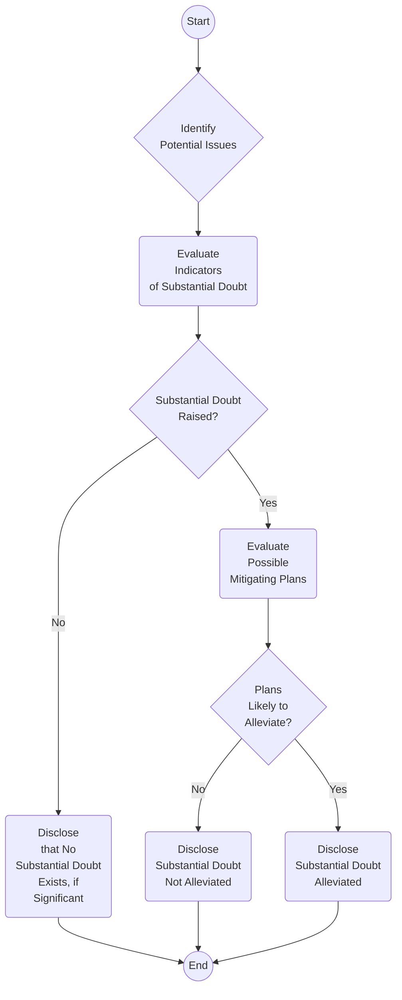

## 19.4 Going Concern (ASC 205‑40: Evaluation and Disclosure)

A critical aspect of financial reporting is whether an entity can continue as a going concern—meaning it is able to realize its assets and meet its obligations in the normal course of business. Under U.S. GAAP, Accounting Standards Codification (ASC) 205‑40 provides guidance on evaluating and disclosing conditions that raise substantial doubt about an entity’s ability to continue as a going concern. This topic is central for auditors, management, and stakeholders alike because uncertainty around going concern can dramatically impact the perceived viability of a business and influence investment and financing decisions.

This section delves into management’s responsibility to assess going concern doubts, the criteria and timeframe for that evaluation, strategies to mitigate identified risks, and the specific disclosures required to comply with ASC 205‑40. It also highlights best practices, pitfalls to avoid, and real-world examples to clarify these concepts. For additional reference, prior sections in this chapter (19.1 through 19.3) discuss other contingencies and commitments that often arise in tandem with going concern issues.

---

### Overview of Going Concern Requirements

In U.S. GAAP, the going concern assumption underlies the preparation of financial statements. Ordinarily, financial statements are prepared assuming that an entity will remain in operation for the foreseeable future (usually at least 12 months from the date the financial statements are issued or are available to be issued). Nonetheless, certain conditions or events—such as recurring losses, negative cash flows, or looming debt maturities—may signal significant uncertainties that threaten an entity’s existence. ASC 205‑40 imposes an obligation on management to:

• Evaluate whether there is substantial doubt about the entity’s ability to continue as a going concern.  
• Consider all known conditions and events.  
• Evaluate both quantitative and qualitative factors.  
• Disclose any substantial doubt, or the mitigation of that doubt, in the financial statements.  

These responsibilities were previously primarily the auditor’s domain. However, changes in the standards increased the explicit responsibility of management to perform the going concern analysis, document it, and provide the necessary disclosures.

---

### Management’s Evaluation Period

One of the most critical elements of ASC 205‑40 is defining the evaluation period during which management must assess the entity’s ability to continue as a going concern. Generally:

• Management must look forward for a period not to exceed one year from the date the financial statements are issued (or are available to be issued, depending on the reporting entity’s policy).  
• This evaluation should be performed for each annual and interim reporting period, recognizing that conditions can change rapidly.  

It is important to distinguish this timeframe from the annual audit cycle. Management’s evaluation period begins at the time financial statements are authorized for issuance (or are ready for issuance, as applicable) and extends 12 months from that point. This may differ from other reporting frameworks where the look-forward period might be tied to the financial statement date.

In practice, any material events after the end of the reporting period but before issuance are considered (see Chapter 24 on Subsequent Events), given that these events can significantly change the assessment of the entity’s viability.

---

### Substantial Doubt Criteria

ASC 205‑40 defines “substantial doubt about an entity’s ability to continue as a going concern” as when relevant conditions and events, considered in the aggregate, raise significant uncertainty about the entity’s ability to meet its obligations as they come due within one year after the date the financial statements are issued (or available to be issued). Key indicators include:

• Negative trends in operating results (e.g., recurring operating losses, negative cash flows).  
• Loan defaults, covenant violations, or inability to refinance maturing debt.  
• Unfavorable financial ratios (e.g., poor liquidity ratios, excessive leverage).  
• Other external factors such as pending litigation, judgments, or labor strikes that threaten the entity’s stability.  

If conditions raise substantial doubt, management must evaluate whether its plans to mitigate the adverse conditions are likely to alleviate that doubt.

---

### Mitigating Factors and Management’s Plans

After identifying potential conditions and events that could cast doubt on going concern, management should examine the feasibility and effectiveness of any proposed mitigating plans. Typical mitigation strategies include:

• Raising capital through equity or debt offerings.  
• Acquiring or renegotiating lines of credit with favorable terms.  
• Reducing expenses or restructuring operations to improve profitability.  
• Divesting non-core assets to generate additional liquidity.  
• Merging with or acquiring other businesses that can enhance financial stability.  

ASC 205‑40 specifically requires management to assess whether these plans will likely be effectively implemented within the evaluation period and whether they will effectively mitigate the conditions or events giving rise to substantial doubt. Merely having a plan is insufficient; the plan must be probable of implementation and probable of reducing the identified risk to an acceptable level.

To illustrate, consider a highly leveraged manufacturer facing debt maturities in less than a year. Management’s plan might include restructuring loan terms and securing additional equity financing. These plans would need to be backed by credible evidence, such as draft loan agreements or letters of intent from prospective investors, to be considered probable and therefore effectively mitigating.

---

### Required Disclosures

When substantial doubt is raised, the financial statement disclosures give stakeholders crucial insights into the severity of the uncertainty, potential outcomes, and management’s course of action. ASC 205‑40 differentiates between two disclosure scenarios:

1. Substantial doubt exists, but management’s plans alleviate that doubt.  
2. Substantial doubt exists and management’s plans do not alleviate that doubt.  

If management concludes that its plans alleviate substantial doubt, the financial statements should include:

• A statement guiding readers to the note where going concern topics are discussed.  
• Details of the significant conditions or events that raised substantial doubt.  
• Explanation of management’s plans that mitigate the doubt.  
• Possible implications if the plans are not executed as intended.  

However, if substantial doubt is not alleviated, the entity must:

• State that there is substantial doubt about the entity’s ability to continue as a going concern within one year from the issuance date.  
• Describe the events or conditions causing substantial doubt.  
• Explain management’s plans that are intended to mitigate those conditions, even if they are not likely to be sufficient or successful.  
• Provide disclosures that allow users of the financial statements to understand the nature and seriousness of the conditions or events as well as any potential mitigating actions.  

In either scenario, the emphasis is on transparency, ensuring that investors, creditors, and other financial statement users have a thorough understanding of the entity’s financial condition and prospects.

---

### Diagram: Going Concern Evaluation Process

Below is a simplified flow diagram outlining the major steps management typically follows to comply with ASC 205‑40 (in Mermaid syntax):

In practice, many additional details and analyses occur at each step, such as stress testing cash flow projections, reviewing covenants, or analyzing credit markets. However, this diagram captures the main logic ASC 205‑40 requires.

---

### Illustrative Example: Redwood Manufacturing

To bring these concepts to life, consider the case of Redwood Manufacturing (“Redwood”), a mid-sized entity experiencing slower sales, tight liquidity, and looming loan maturities. Redwood’s finance team conducts its going concern evaluation and identifies the following negative indicators:

• Negative operating cash flows for the past two quarters.  
• A line of credit nearing its limit, with covenants projected to be violated if sales remain sluggish.  
• Difficulty finding lenders to refinance existing long-term debt scheduled to mature in eight months.  

Management has several possible mitigating strategies:

1. Renegotiating the terms of existing debt, extending maturities by 18 months.  
2. Selling an underutilized division to generate immediate cash flows.  
3. Launching a new marketing campaign intended to bolster sales.  

Redwood’s leadership team obtains a letter of intent from the current lender agreeing to a 12-month extension, contingent upon Redwood cutting costs by 15%. Additionally, Redwood signs an agreement in principle to sell its underutilized division, with a closing date expected in six months. Given the robust interest in the subsidiary and progress in negotiations, Redwood’s management concludes that these plans are probable of being effectively implemented.

After careful analysis, management determines that, with these steps, Redwood’s liquidity risk within the next 12 months is significantly mitigated. Thus, management discloses the initial uncertainties, outlines its plans, and states that substantial doubt has been alleviated. Alternatively, if Redwood had been unable to secure the lender extension or sale agreement, the company might have had to disclose that substantial doubt was not alleviated.

A sample disclosure (simplified for illustrative purposes) could look like:

“Management has evaluated the Company’s ability to continue as a going concern for the 12 months following the issuance date of these financial statements. The Company’s recurring operating losses, negative cash flows, and upcoming debt maturities raised substantial doubt about its ability to continue operations. Management has secured a preliminary agreement to extend the maturity of existing debt by 12 months and has entered into a purchase agreement to sell its underutilized division, which is expected to close during the third quarter of the next fiscal year. These plans, which management believes are probable of being effectively implemented, alleviate the substantial doubt about the Company’s ability to continue as a going concern.”  

---

### Common Pitfalls and Challenges

• Overly Optimistic Forecasts: Management might be tempted to use unrealistic assumptions for revenue growth or cost savings. Overly optimistic projections can undermine the credibility of both the financial statements and the entity’s management team.  
• Vague or Generic Mitigation Plans: Stating that “we plan to raise funds” or “we will reduce expenses” without concrete steps or evidence is insufficient. Plans should be specific and supported by reasonable projections or agreements in principle.  
• Inadequate Documentation: Regulatory bodies and auditors require thorough documentation of the going concern evaluation. Failure to maintain detailed records of management’s analysis can lead to audit deficiencies.  
• Delayed Disclosures: Some companies mistakenly wait until conditions become dire before acknowledging going concern uncertainties. ASC 205‑40 requires management to evaluate going concern at each annual and interim period and disclose relevant uncertainties promptly.  
• Misinterpretation of Timeframe: Confusion can arise between the date of the balance sheet and the date the financial statements are issued. Always adhere to the one-year threshold from the date of issuance (or availability for issuance).  

---

### Best Practices for a Robust Going Concern Assessment

• Establish a Formal Evaluation Process: Integrate going concern analysis into periodic (monthly or quarterly) financial reviews.  
• Incorporate Sensitivity Analyses: Stress-test forecasts under best-case, worst-case, and base-case scenarios to capture realistic outcomes.  
• Seek Independent Review: If possible, engage consultants, outside counsel, or an internal audit function to validate assumptions and data.  
• Document, Document, Document: Maintain comprehensive records of the entire process to support audit requests and future evaluations.  
• Align With Other Disclosures: Ensure going concern discussion is consistent with MD&A (Management’s Discussion and Analysis), risk factors, or other disclosure sections required for public companies (see Chapter 6 for SEC Reporting Topics).  

---

### Additional Tools and Resources

• FASB Accounting Standards Codification (ASC) 205‑40: Primary authoritative guidance on going concern.  
• AICPA Audit and Accounting Guides: Helpful supplemental materials with industry-specific insights.  
• PCAOB AS 2415 (for Audits): Provides auditors’ perspective on evaluating an entity’s ability to continue as a going concern.  
• IFRS Users: Refer to IAS 1 “Presentation of Financial Statements” for parallel requirements under IFRS (though certain nuances differ from U.S. GAAP).  

---

### Conclusion

Going concern is central to financial reporting because it underpins how stakeholders interpret financial statements. Under ASC 205‑40, management holds the primary responsibility to assess conditions, measure substantial doubt, and propose credible mitigation plans. Thorough documentation, realistic forecasting, and transparent disclosures are paramount. While these requirements may appear daunting, they foster more accurate, reliable financial statements—and thus help maintain market confidence and protect the interests of shareholders, creditors, and employees.

A rigorous, proactive approach to going concern can avert crises, safeguard reputations, and ultimately position organizations to address financial challenges before they escalate. By understanding the key components—management’s evaluation period, substantial doubt criteria, mitigating factors, and requisite disclosures—CPA candidates and practitioners alike can ensure compliance, maintain ethical standards, and support robust decision-making processes.

---

## Mastering the Going Concern Concept: Essential FAR Quiz



### Which of the following describes the period management must evaluate when assessing the going concern assumption under ASC 205‑40?

- [ ] Up to 9 months following the financial statement date.
- [ ] Only through the end of the fiscal year.
- [x] Within 12 months from the date the financial statements are issued.
- [ ] Up to 24 months from the balance sheet date.

> **Explanation:** ASC 205‑40 requires management to evaluate conditions and events that may affect the entity’s ability to continue as a going concern within one year from the date the financial statements are issued (or available to be issued). This differs from assessing only through the fiscal year-end or some other arbitrary period.  

### Which of the following situations most likely indicates substantial doubt about an entity’s ability to continue as a going concern?

- [x] Recurring negative operating cash flows and impending debt maturities with no refinancing plan in place.
- [ ] A recent, slightly below-average quarter in sales but stable debt ratios.
- [ ] A minor product recall with limited financial impact.
- [ ] A new lease for a warehouse expansion.

> **Explanation:** Substantial doubt arises when significant uncertainties threaten the entity’s ability to meet obligations. Recurring negative operating cash flows, combined with near-term debt maturities and no plan to refinance, is a strong indicator of serious financial distress.  

### If substantial doubt about going concern exists, but management’s plans are probable of being effectively implemented to mitigate that doubt, ASC 205‑40 requires:

- [ ] No mention of the issue in the financial statements.
- [x] A disclosure describing the conditions that raised doubt and how management’s plans address those issues.
- [ ] Issuance of qualified financial statements.
- [ ] Immediate cessation of operations.

> **Explanation:** Entities must disclose the conditions or events that initially raised substantial doubt—even if that doubt is mitigated—and detail the specific plans that alleviate the doubt. This transparency allows users of the financial statements to evaluate the feasibility of those plans.  

### When assessing going concern, which of the following best characterizes management’s approach to evaluating mitigating factors?

- [x] The plans must be probable of being implemented and probable to mitigate the adverse conditions.
- [ ] Plans should only be identified but not quantitatively assessed.
- [ ] The existence of any plan, regardless of certainty, is sufficient to alleviate substantial doubt.
- [ ] Only documented loan agreements count as mitigating factors.

> **Explanation:** ASC 205‑40 instructs management to evaluate whether their plans are probable of implementation and will likely mitigate the uncertainties. The mere existence of a vague plan is insufficient.  

### To align with ASC 205‑40, the evaluation period for going concern starts:

- [x] On the date the financial statements are issued (or are available to be issued).
- [x] Extends through one year from that date.
- [ ] From the balance sheet date, continuing to the next quarterly report.
- [ ] From the end of the previous fiscal year.

> **Explanation:** The standard sets a look-forward period from the financial statement issuance date (or the date available to be issued) and continues for one year. Two answers are correct here: “On the date the financial statements are issued” and “Extends through one year from that date.”  

### In cases where management’s evaluation of going concern uncovers no substantial doubt, but certain significant conditions are noted, what is the most prudent action?

- [x] Disclose any significant uncertainties even if they do not rise to the level of substantial doubt.
- [ ] Omit all discussion in the financial statements.
- [ ] Delay recognition of any new information until next year’s statements.
- [ ] Classify the entire situation as immaterial.

> **Explanation:** While ASC 205‑40 focuses on substantial doubt, it does not preclude management from disclosing other material uncertainties. Providing transparency about significant conditions (even if they do not meet the threshold for substantial doubt) is viewed as best practice.  

### Under ASC 205‑40, which of the following is NOT typically considered a key indicator of potential going concern issues?

- [x] A small, favorable change in the debt-to-equity ratio.
- [ ] Recurring operating losses.
- [x] Inability to access the capital markets.
- [ ] Covenant violations that are not waived.

> **Explanation:** Recurring losses, capital inaccessibility, and covenant violations are common indicators of financial stress. A small, favorable change in the debt-to-equity ratio would not indicate a going concern issue unless it is overshadowed by other dire conditions. Note that two correct indicators of going concern issues appear here: “Recurring operating losses” and “Inability to access the capital markets.”  

### What is a frequent pitfall for companies in evaluating going concern?

- [ ] Seeking advice from multiple external consultants.
- [ ] Maintaining clear documentation of the going concern analysis.
- [ ] Updating the going concern judgment regularly.
- [x] Relying on overly optimistic cash flow forecasts without realistic back-up plans.

> **Explanation:** Overly optimistic projections can lead companies to overlook genuine risks. Realistic, data-driven forecasts are crucial.  

### In an effort to mitigate going concern doubts, which of the following statements best describes a credible management plan?

- [ ] “We will seek to raise a large sum of money next year without definitive steps.”
- [ ] “We intend to terminate 1% of our entire workforce if the economy falters.”
- [x] “We will reduce costs by 15%, documented in supplier renegotiations and verified by new contracts.”
- [ ] “We aim to expand our business operations to new regions.”

> **Explanation:** Credible plans must be specific, actionable, and probable of being effectively implemented. The plan to reduce costs by 15%—with documented supplier renegotiations—demonstrates a concrete, measurable strategy.  

### True or False: If substantial doubt about going concern remains unalleviated after management’s analysis, the entity must disclose the specific events or conditions that gave rise to the doubt, as well as management’s plans even if they are deemed insufficient or uncertain.

- [x] True
- [ ] False

> **Explanation:** Under ASC 205‑40, when substantial doubt is not alleviated, full disclosure of the nature of the uncertainties and management’s efforts to address them remains mandatory, even though those efforts may be insufficient.  



---

## For Additional Practice and Deeper Preparation

**[FAR CPA Hardest Mock Exams: In-Depth & Clear Explanations](https://www.udemy.com/course/far-cpa-mock-exams/?referralCode=F88050F8D5C76764F6BD)**  

**Financial Accounting and Reporting (FAR) CPA Mocks:** 6 Full (1,500 Qs), Harder Than Real! In-Depth & Clear. Crush With Confidence!  

- Tackle full-length mock exams designed to mirror real FAR questions.  
- Refine your exam-day strategies with detailed, step-by-step solutions for every scenario.  
- Explore in-depth rationales that reinforce higher-level concepts, giving you an edge on test day.  
- Boost confidence and minimize anxiety by mastering every corner of the FAR blueprint.  
- Perfect for those seeking exceptionally hard mocks and real-world readiness.  

_Disclaimer: This course is not endorsed by or affiliated with the AICPA, NASBA, or any official CPA Examination authority. All content is for educational and preparatory purposes only._
