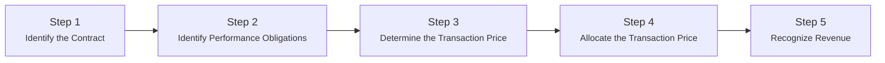

## 20.1 Five-Step Model (Identify Contract, Performance Obligations, etc.)

Revenue recognition is among the most critical aspects of financial reporting and can significantly impact a company’s financial statements. The Financial Accounting Standards Board (FASB) established ASC 606, “Revenue from Contracts with Customers,” which outlines a comprehensive five-step model for recognizing revenue. This model aims to unify the existing fragmented guidance under U.S. GAAP into a single standard that can be applied consistently across various industries and transactions. 

In this section, we explore each of the five steps in detail, guiding you through contract identification, identifying performance obligations, determining the transaction price, allocating that price to the obligations, and recognizing revenue when or as performance obligations are satisfied. We also provide practical examples, diagrams, and insights to build a robust understanding of the model.

---

### Background and Objective

The core principle of ASC 606 is that an entity should recognize revenue to depict the transfer of promised goods or services to customers in an amount that reflects the consideration (i.e., payment) to which the entity expects to be entitled. By applying the five-step model, preparers ensure that financial statements accurately illustrate the economics of transactions.

---

## Overview of the Five-Step Model

Below is a high-level overview of the five-step process before we dive into each step in detail:

1. Identify the contract(s) with a customer.  
2. Identify the performance obligations in the contract.  
3. Determine the transaction price.  
4. Allocate the transaction price to the performance obligations.  
5. Recognize revenue when (or as) the entity satisfies a performance obligation.

These steps may look straightforward, but many complexity points arise when dealing with real-life scenarios, such as contract modifications, variable consideration, and multiple-element (or multiple-deliverable) arrangements.



---

## Step 1: Identify the Contract with a Customer

A contract is typically an agreement between two or more parties that creates enforceable rights and obligations. The criteria for determining whether a contract exists under ASC 606 include:

• Approval from all parties involved (written, oral, or implied).  
• Identifiable rights regarding the goods or services to be transferred.  
• Payment terms can be identified.  
• The contract has commercial substance.  
• Collection of consideration is probable (the entity must assess the customer’s ability and intent to pay).

A “customer” is defined as a party that has contracted with an entity to obtain goods or services in exchange for consideration. This definition excludes collaborative relationships or partner transactions in which the counterparty may not be purchasing goods or services primarily as an end customer.

### Contract Modifications  
Contracts may evolve after their inception. ASC 606 provides guidance for modifications, defined as changes in scope or price (or both). An entity must determine whether each modification is:

• Treated as a new, separate contract (if it adds a distinct good or service and the price increases by an amount reflecting the standalone selling price).  
• Or combined with the existing contract, with a prospective or retrospective adjustment.

#### Example: New, Separate Contract  
An electronics retailer signs a contract to deliver 100 laptops at $1,000 each. Two months later, the customer asks for an additional 20 laptops at the same per-unit price. The original agreement accounted for $100,000 in revenue (100 units × $1,000). The price for the extra 20 laptops is $20,000 (20 × $1,000). Because these laptops are priced at standalone selling price and represent a distinct performance obligation, the modification is a separate contract.

#### Example: Modification Combined with Existing Contract  
Using the same scenario, if the retailer provides the extra 20 laptops for a discount—say $850 each instead of $1,000—careful evaluation is required to see whether that discount is consistent with the standalone selling price. If the standalone selling price was indeed $1,000, but the retailer gave a deep discount to reflect a bundle arrangement, the retailer might need to treat this as a single contract with a modification that requires reallocation of the transaction price.

---

## Step 2: Identify the Performance Obligations in the Contract

Performance obligations are the distinct goods or services promised in a contract. A good or service is “distinct” if:

1. The customer can benefit from the good or service on its own or together with other readily available resources (capable of being distinct), and  
2. The promise to transfer the good or service is separately identifiable from other promises in the contract (distinct within the contract).

### Combining Promises into a Single Performance Obligation

If multiple promised goods or services are highly interdependent or interrelated, they are combined into a single “performance obligation.” A classic example arises in construction-type or systems-integration contracts, where design, procurement, and installation are combined into one performance obligation if they cannot be meaningfully separated.

#### Practical Example: Multiple-Element Arrangements

A software company sells a bundle that includes:  
• Software license for 12 months.  
• Installation services.  
• Ongoing technical support for the duration of the contract.

The company must evaluate whether the license, installation, and technical support are each distinct. If the customer can operate the software without requiring further customization, and the support is optional, it is likely each element is distinct, thus creating multiple performance obligations. However, if the software is highly customized, the installation service might be interdependent with the software customization, potentially forming a single performance obligation.

---

## Step 3: Determine the Transaction Price

The “transaction price” is the amount of consideration (payment) an entity expects to be entitled to in exchange for transferring promised goods or services. This step can be complicated by factors such as variable consideration, significant financing components, and non-cash considerations.

### Variable Consideration

Variable consideration arises when the contract price is contingent on future events, such as rebates, discounts, incentives, penalties, or commissions. In these cases, the entity estimates the variable consideration by using one of two methods:

1. The Expected Value Method (probability-weighted approach).  
2. The Most Likely Amount Method (single most likely outcome).

The entity must also assess the constraint on variable consideration to minimize the likelihood of overstating revenue. Revenue from variable consideration is included in the transaction price only to the extent it is probable that a significant reversal will not occur when the uncertainty is resolved.

#### Example: Sales Rebates

Consider a consumer products manufacturer that sells to a retailer under a contract that includes a $1 rebate per unit after 10,000 units are purchased in a year. The determination of whether the 10,000-unit threshold will be met influences the estimation of the transaction price. The manufacturer could use either the Expected Value or the Most Likely Amount method:

• Expected Value: The manufacturer might forecast that there is an 80% chance of selling over 10,000 units and a 20% chance of selling below that threshold.  
• Most Likely Amount: The manufacturer might conclude that achieving 10,000 units is the most likely outcome, thus including the rebate in the transaction price from the outset (subject to the variable consideration constraint).

---

### Significant Financing Component

If the timing of payments provides either the customer or the entity with a significant benefit of financing, the transaction price should be adjusted to reflect the time value of money. However, no adjustment is needed if the payment is within a typical business cycle (one year or less) or if the difference between transfer of goods/services and payment is for reasons other than financing (e.g., to protect the customer or the seller’s interests).

---

### Non-Cash Consideration and Consideration Payable to the Customer

• Non-Cash Consideration: If a customer pays with something other than cash (e.g., shares of stock or a barter transaction), the transaction price is measured at the fair value of the non-cash consideration.  
• Consideration Payable to the Customer: If an entity owes consideration (e.g., coupons, vouchers, credit) to its customer, the transaction price may be reduced accordingly.

---

## Step 4: Allocate the Transaction Price to Performance Obligations

Once the transaction price has been determined, the entity allocates that price to each identified performance obligation based on the relative standalone selling price (SSP) of each obligation. To do this:

1. Identify the standalone selling price of each distinct good or service.  
2. Calculate the total of those standalone selling prices.  
3. Allocate the transaction price in proportion to each performance obligation’s standalone value.

### Standalone Selling Price (SSP)

SSP is what an entity would charge for the good or service if it were sold separately to a similar customer under similar circumstances. Methods of estimating SSP include:

• Adjusted Market Assessment Approach  
• Expected Cost Plus a Margin Approach  
• Residual Approach (if the stand-alone selling price is highly variable or uncertain)

#### Example: Allocation in a Software Bundle

Returning to our software bundle example:

1. Software license for 12 months – standalone price: $900  
2. Installation service – standalone price: $300  
3. Technical support – standalone price: $600  

If the transaction price for the bundle is $1,600, the sum of the standalone selling prices is $1,800 ($900 + $300 + $600). The allocation would be:

• Software license: ( $900 / $1,800 ) × $1,600 = $800  
• Installation service: ( $300 / $1,800 ) × $1,600 = $267  
• Technical support: ( $600 / $1,800 ) × $1,600 = $533  

Each performance obligation is allocated a portion of the total transaction price based on its relative standalone selling price.

---

## Step 5: Recognize Revenue When (or As) Each Performance Obligation Is Satisfied

Revenue is recognized when control of the goods or services transfers to the customer. Transfer of control implies the customer now has the ability to direct the use of, and obtain substantially all of the remaining benefits from, the asset (good or service).

### Over Time vs. Point in Time

• Over Time: Revenue is recognized over time if at least one of the following criteria is met:  
  - The customer receives and consumes the benefits as the entity performs.  
  - The entity’s performance creates or enhances an asset that the customer controls.  
  - The asset created has no alternative use to the entity, and the entity has an enforceable right to payment for performance to date.

• Point in Time: If none of these criteria are met, revenue is recognized at a specific point in time when control transfers.

#### Example: Construction Contract (Over Time)

A contractor builds a specialized warehouse on a customer’s property, with contractual terms specifying that the structure cannot be used for any other purpose. The construction meets the criterion that the asset has no alternative use, and the contractor has an enforceable right to payment for work completed to date. Revenue is recognized over time, typically using an input method (e.g., cost-to-cost) or output method (e.g., milestones reached).

#### Example: Retail Sale of a Laptop (Point in Time)

When a retail customer purchases a laptop in a store, control generally transfers at the point of sale. The customer immediately obtains possession of and the right to use the laptop, and the entity recognizes revenue at that moment.

---

## Combining the Five Steps in Complex Arrangements

Real-world arrangements often involve intricacies such as:

• Contract modifications where outcomes are uncertain.  
• Performance obligations with variable consideration or milestone-based payments.  
• Bundled goods and services requiring careful allocation.  
• License agreements that might be recognized at a point in time if “right to use,” or over time if “right to access” intellectual property.

When applying the five-step model, each of these complexities must be evaluated carefully. Entities often develop robust policies and procedures to ensure consistent application, especially in industries like telecommunications, construction, and software.

---

## Comprehensive Example: Multiple-Element Arrangement with Contract Modification

Imagine a technology solutions provider that enters into a contract for $2,000,000 to provide:

1. A customized software solution (distinct service).  
2. Installation and testing (installation is specified in the contract, required to integrate the software).  
3. One-year maintenance and support after installation.  

At contract inception, the entity determines:  
• Step 1 (Contract Identification): A valid contract exists with the customer, with probable collection of $2,000,000.  
• Step 2 (Performance Obligations): The software is distinct, but the installation and testing are highly interdependent with the software and therefore are not distinct on their own. The one-year maintenance is distinct because it can be provided even if the customer obtains services from another provider. Thus, we have two performance obligations:  
  1) Software plus installation/testing.  
  2) Maintenance and support.  

• Step 3 (Transaction Price): $2,000,000 is the agreed-upon consideration. There is no variable consideration.  
• Step 4 (Allocate the Transaction Price):  
  - The standalone selling price of the software plus installation/testing is $1,800,000.  
  - The standalone selling price of maintenance and support is $400,000.  
  - Total standalone selling prices = $2,200,000.  
  - Allocation to software + installation/testing: (1,800,000 / 2,200,000) × 2,000,000 = $1,636,364  
  - Allocation to maintenance: (400,000 / 2,200,000) × 2,000,000 = $363,636  

• Step 5 (Recognize Revenue):  
  - The software plus installation/testing is recognized over the period of customization and transfer of control. Because the system is customized, the entity may be able to apply an over-time recognition method if it meets one of the over-time criteria (e.g., if the contract states the customer owns the work in process and the developer has right to payment for performance to date). Otherwise, the entity may recognize at the point in time the project is completed and accepted by the customer.  
  - The one-year maintenance is recognized ratably over the maintenance period, assuming it’s a stand-ready obligation to serve the customer’s technical needs.

#### Mid-Contract Modification

After six months, the customer requests additional modules and extends the maintenance by another year. The solution provider must analyze whether the new modules are priced at their standalone selling price. If so, the modification may be accounted for as a new, separate contract. Otherwise, the original contract might be combined with the new modification, requiring a prospective reallocation of the remaining transaction price and performance obligations.

---

## Best Practices and Common Pitfalls

1. Thorough Assessment of Contract Terms: Legal enforceability, commercial substance, and the customer’s ability to pay are foundational to Step 1. Skipping or glossing over these details leads to misapplication of the standard.  
2. Clearly Defining Distinct Performance Obligations: Misidentifying performance obligations can dramatically skew revenue timing and amounts.  
3. Estimating Variable Consideration: Overly optimistic variable consideration estimates can result in significant restatements if revenue reverses in future periods.  
4. Handling Complex Allocation: Properly estimating the standalone selling prices is critical. Always document the methodologies used for consistent application.  
5. Monitoring Contract Modifications: Revenue guidance requires continuous updating of contract terms. Failing to recognize modifications might misrepresent revenue.

---

## Visual Summary of the Five-Step Model

Below is a tabular summary highlighting key points of each step:

| Step                                | Key Question                                           | Main Considerations                                          |
|-------------------------------------|--------------------------------------------------------|--------------------------------------------------------------|
| 1. Identify the Contract            | Does a valid and enforceable contract exist?          | Customer credit risk, approval, commitment, enforceability   |
| 2. Identify Performance Obligations | What promises are distinct in the contract?           | Distinct goods/services, bundling vs. separate obligations   |
| 3. Determine the Transaction Price  | What amount of consideration is expected?             | Variable consideration, financing, rebates, non-cash items   |
| 4. Allocate the Transaction Price   | How should the price be split among the obligations?  | Relative standalone selling price, residual approach         |
| 5. Recognize Revenue                | When does control transfer to the customer?           | Over time vs. point in time, input vs. output methods        |

---

## Diagrams and Flow Representations

A more nuanced representation of the five-step model can incorporate decisions surrounding variable consideration, financing, and performance obligations:

```mermaid
flowchart TB
    A((Start)) --> B{Contract Identified?}
    B -- No --> X[Stop - Do Not Recognize Revenue]
    B -- Yes --> C(Identify Distinct Performance Obligations)
    C --> D(Determine Transaction Price<br>Including Variable Components)
    D --> E(Allocate Price to Obligations)
    E --> F{Transfer of Control<br>(Over time or point in time)?}
    F -- Over Time --> G[Recognize Revenue on<br>Progress Toward Completion]
    F -- Point in Time --> H[Recognize Revenue<br>When Performance Obligation Satisfied]
    G --> I((End))
    H --> I((End))
```

This diagram integrates the decisions an entity must address from contract establishment to the point of revenue recognition.

---

## References for Further Exploration

• ASC 606: “Revenue from Contracts with Customers” (FASB Codification).  
• IFRS 15: “Revenue from Contracts with Customers” for global perspective and comparison.  
• AICPA Guides on Revenue Recognition for industry-specific implementation.  

You may also find detailed coverage of construction contract accounting in Chapter 19: Contingencies and Commitments for how it relates to evaluating going concern issues or warranties, and advanced discussions in Chapter 26: Complex Illustrations for consolidation and foreign currency complexities.

---

## Quiz: the Five-Step Model



### Which criterion is required for a valid contract under ASC 606?  
- [ ] Evidence that the contract can be canceled any time by either party without penalty.  
- [x] Payment terms that can be identified and collection is probable.  
- [ ] The contract must be fully performed before recognition of revenue.  
- [ ] The goods or services are always interdependent.  

> **Explanation:** Under ASC 606, a contract is valid if payment terms have been identified, the substance of the arrangement is clear, and the collection of consideration is probable.

### Which of the following is typically treated as a separate contract modification?  
- [x] An addition of a clearly distinct service at the standalone selling price.  
- [ ] A minor price discount that doesn’t alter the scope of the contract.  
- [ ] The assignment of accounts receivable to a factoring company.  
- [ ] A mere extension of payment terms beyond typical business cycles.  

> **Explanation:** ASC 606 states that a modification is recognized as a new, separate contract if it adds a distinct good or service and the price increases by an amount reflecting the standalone selling price.

### When does over-time revenue recognition generally apply?  
- [x] When an asset is created with no alternative use and there is an enforceable right to payment.  
- [ ] When there is a “right to return” clause.  
- [ ] When control is not transferred to the customer until delivery.  
- [ ] Only when a contract is canceled.  

> **Explanation:** Over-time recognition applies if the customer controls the asset as it is created or enhanced, or if there is no alternative use for the asset and the seller has a right to payment for performance to date.

### Which of the following is TRUE about variable consideration?  
- [x] Entities must include variable consideration in the transaction price only if it’s probable that a significant reversal of revenue will not occur.  
- [ ] Variable consideration can be recognized in full whenever management forecasts it.  
- [ ] It does not apply to contracts with sales-based royalties.  
- [ ] It can never exceed the contractually stated baseline amount.  

> **Explanation:** ASC 606 includes a constraint on variable consideration to reduce the risk of overstated revenue. Only amounts that are reasonably assured should be recognized.

### Which method of estimating the standalone selling price might be used if the price is highly variable or uncertain?  
- [ ] Adjusted Market Assessment Approach  
- [x] Residual Approach  
- [ ] Decomposition Approach  
- [ ] Benchmark Approach  

> **Explanation:** Under ASC 606, the residual approach is acceptable if the selling price of a good or service is highly variable or uncertain, provided certain conditions are met.

### Which situation commonly triggers a contract modification, requiring reallocation of the transaction price?  
- [x] Addition of new deliverables priced below fair market value.  
- [ ] An acceleration of payment that does not affect total consideration.  
- [ ] A customer’s request for a sales tax exemption.  
- [ ] A change in internal cost structures.  

> **Explanation:** If a modification changes the scope or price of the contract in a way that affects performance obligations (e.g., new goods/services at a discount), a reallocation of the transaction price may be necessary.

### A best practice when dealing with complex variable consideration calculations is:  
- [x] Using probability-weighted or most-likely amount methods and applying a constraint to avoid significant overstatement.  
- [ ] Recognizing all potential revenue immediately to simplify the process.  
- [x] Allocating zero to all performance obligations until final settlement.  
- [ ] Ignoring discount structures.  

> **Explanation:** Entities generally use either the probability-weighted or most-likely amount method and must apply the constraint to ensure they do not prematurely recognize revenue that may soon reverse.

### Which of the following would be recognized as revenue at a point in time?  
- [x] A retail transaction where the customer takes immediate possession of a product.  
- [ ] A specialized product under construction owned by the customer.  
- [ ] A service that is continuously transferred to the customer.  
- [ ] A long-term consulting contract with enforceable right to payment.  

> **Explanation:** Under point-in-time recognition, revenue is recognized when control transfers at a distinct moment—such as a typical retail sale.

### Which statement about contract modifications is correct?  
- [x] A modification that adds new goods at a significantly discounted price may require re-measurement of the entire contract.  
- [ ] Modifications must always be treated as separate contracts.  
- [ ] Modifications never affect previously recognized revenue.  
- [ ] Modifications only occur when the total transaction price decreases.  

> **Explanation:** If a contract modification represents a change in scope or price that is not reflective of a standalone selling price, the entity may need to re-measure the contract and reallocate transaction prices.

### ASC 606 stipulates that control of a good or service passes to the customer when:  
- [x] The customer can direct the use and obtain substantially all the remaining benefits.  
- [ ] The seller receives partial payment only.  
- [ ] The contract has not yet been signed.  
- [ ] The entity has recorded a journal entry.  

> **Explanation:** Control transfers when the customer has both the ability to direct the use of, and obtain substantially all of the benefits from, the good or service.



---

## For Additional Practice and Deeper Preparation

**[FAR CPA Hardest Mock Exams: In-Depth & Clear Explanations](https://www.udemy.com/course/far-cpa-mock-exams/?referralCode=F88050F8D5C76764F6BD)**  

**Financial Accounting and Reporting (FAR) CPA Mocks:** 6 Full (1,500 Qs), Harder Than Real! In-Depth & Clear. Crush With Confidence!

- Tackle full-length mock exams designed to mirror real FAR questions.  
- Refine your exam-day strategies with detailed, step-by-step solutions for every scenario.  
- Explore in-depth rationales that reinforce higher-level concepts, giving you an edge on test day.  
- Boost confidence and minimize anxiety by mastering every corner of the FAR blueprint.  
- Perfect for those seeking exceptionally hard mocks and real-world readiness.  

_Disclaimer: This course is not endorsed by or affiliated with the AICPA, NASBA, or any official CPA Examination authority. All content is for educational and preparatory purposes only._
