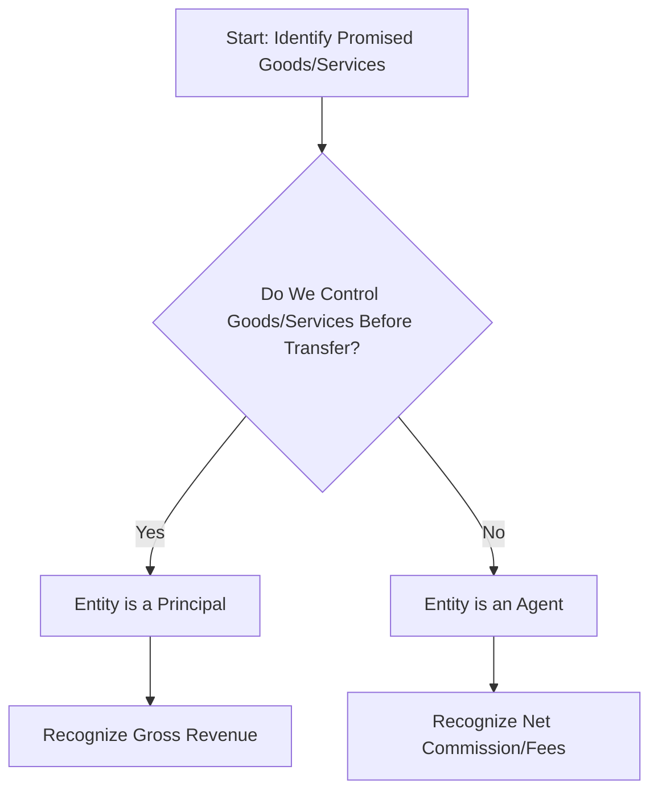

## 20.2 Principal vs. Agent, Variable Consideration

Revenue recognition in today’s global marketplace often involves complex arrangements spanning multiple parties, dynamic pricing structures, and uncertain outcomes. Under ASC 606, understanding whether an entity is acting as a principal (controlling the goods or services before transfer to the customer) or an agent (facilitating a sale between a principal and a customer) is critical for determining how much revenue to recognize. In addition, many transactions feature variable pricing elements—such as rebates, discounts, refunds, bonuses, or penalties—which require careful estimation and application of the “constraint” principle. This section dives deeply into these pivotal considerations and highlights real-world scenarios, including travel booking and consignment arrangements, showcasing how the principal-versus-agent determination and variable consideration interact within the five-step revenue recognition model.

Principles of ASC 606, Revenue from Contracts with Customers, call for a comprehensive approach to identifying the substance of a transaction, whether the entity has control over the goods or services promised (principal) or merely arranges for them (agent). Simultaneously, entities must determine an appropriate transaction price to allocate among performance obligations. When this price is uncertain or subject to future events, the rules around variable consideration and the related constraint become essential to ensure that revenues are neither overstated nor prematurely recognized.

Understanding these topics involves:

• Identifying key indicators of principal or agent status.  
• Estimating variable consideration using appropriate methods.  
• Applying the constraint on variable consideration to avoid significant reversals.  
• Aligning disclosures and documentation to ensure transparency.

Below is a detailed exploration of these concepts, followed by case examples and practical tips.

Understanding Principal vs. Agent

Under ASC 606-10-55-36 through 55-40, an entity must determine whether it controls the goods or services before they are transferred to the customer. In simpler terms:

• Principal: The entity obtains control of the promised goods or services (or a right to a service) before transferring them to the customer. The principal typically has primary responsibility for fulfilling the contract, is exposed to inventory risk (before or after the goods are transferred to the customer), and has discretion in establishing pricing. The principal recognizes revenue as the gross amount of consideration, with any direct costs presented separately as expenses.  
• Agent: The entity’s role is to arrange for another party (the principal) to provide the goods or services. The agent does not obtain control of the goods or services before they are transferred to the customer. Instead, the agent recognizes revenue net of any amount owed to the principal, retaining only the fee or commission it earns for facilitating the transaction.

Indicators of Control

ASC 606 provides several indicators that an entity might be a principal (i.e., controls the goods or services). Common ones include:

• Primary Responsibility: The entity is primarily responsible for fulfilling the promise to the customer.  
• Risk and Rewards: The entity bears risk and rewards of inventory or intangible assets.  
• Discretion in Establishing Price: The ability to set prices independently or significantly influence the pricing to the customer is a strong sign of principal status.  
• Integration or Customization: The entity integrates various goods or services into a single product or custom solution, reflecting control over the components before transferring them to the customer.

In contrast, an agent typically does not possess these attributes; instead, it primarily functions to connect the customer to another party that actually provides the goods or services.

Diagram: Principal vs. Agent Analysis

Below is a simplified Mermaid.js flowchart illustrating how an entity might assess whether it is acting as a principal or agent:



Real-Case Scenarios: Travel Booking

A travel agency often sells airline tickets, hotel bookings, or rental car reservations on behalf of service providers. Generally, the agency never takes control of the room, seat, or vehicle; it only arranges the transaction between the customer and the service provider. As a result:

• The customer pays for the service (e.g., an airline ticket).  
• The travel agency collects the fare but remits the majority to the airline, retaining only a commission or fee.  
• The travel agency does not bear the risk if the flight is canceled (beyond losing potential commission).  
• The airline sets the ticket prices, not the agency.

Thus, the travel agency is typically an agent, recognizing revenue equal to its commission or transaction fee. However, if the travel agency pre-purchases flight seats or hotel rooms, effectively bearing the risk of unsold inventory, it may be acting as a principal—it controls the inventory before transferring it to customers and thus might recognize revenue on a gross basis. Careful analysis of the contract terms is crucial.

Real-Case Scenarios: Consignment Arrangements

Consignment sales commonly occur in industries such as art galleries or consignment shops. One party (the consignor) transfers goods to another (the consignee) to sell on the consignor’s behalf. Under typical arrangements:

• The consignee does not take ownership of the items.  
• The consignee sells the goods, often at prices suggested or set by the consignor.  
• The consignee earns a commission or fee upon sale.  
• Unsold items are returned to the consignor without cost to the consignee.

In these circumstances, the consignee is acting as an agent, while the consignor retains control and is typically the principal. The consignee recognizes only its commission as revenue. By contrast, if the consignee must purchase inventory from the consignor (assuming full ownership risk if items do not sell), the consignee could be considered a principal, recognizing the gross amount of revenue upon sale to end customers.

Variable Consideration

Variable consideration arises when the transaction price is not fixed but depends on the occurrence or non-occurrence of future events, performance thresholds, or other contingencies. Under ASC 606, an entity must estimate variable consideration as part of determining the transaction price and must include the estimated amount in revenue only to the extent that it is probable that a significant reversal of cumulative revenue recognized will not occur.

Common Forms of Variable Consideration  
• Discounts, rebates, and price concessions.  
• Refunds for product returns or poor performance.  
• Performance bonuses or incentive payments.  
• Penalties for delayed or substandard performance.  
• Tiered pricing schedules based on volumes sold.

The estimation of variable consideration typically involves choosing between two methods:

• Expected Value: Summing probability-weighted outcomes for the transaction price if the contract presents multiple possible outcomes. This approach is well-suited for large portfolios of similar contracts.  
• Most Likely Amount: Selecting the single most likely outcome (e.g., a binary scenario of receiving a bonus or not).

In either case, the approach used must be applied consistently to similar transactions and be updated each reporting period as new information becomes available.

Constraint on Variable Consideration

To prevent overstatement of revenue, entities must apply the constraint: the estimated amount of variable consideration included in the transaction price should be limited to the amount for which it is probable that a significant reversal of revenue will not occur later. Factors contributing to the risk of reversal include:

• The extent to which the amount of consideration is outside the entity’s control (e.g., highly susceptible to external factors such as weather).  
• The length of time until uncertainty is resolved.  
• Experience with similar contracts and reliability of estimates.  
• The potential for broad range in possible outcomes.

Only when the risk of significant reversal has substantially dissipated can the entity include the variable consideration in its reported revenue.

Practical Example: Volume Rebates

Assume a manufacturing company offers volume rebates based on the total annual amount purchased by a customer. At the start of the year, the manufacturer estimates that the customer will purchase enough volume to receive a 5% rebate on all purchases. However, if actual incremental purchases exceed a certain threshold, the customer qualifies for a 7% rebate.

• The manufacturer estimates the most likely outcome for the total annual volume purchased and, correspondingly, the rebate percentage.  
• Each period, the manufacturer records revenues net of the expected rebate, adjusting as necessary if information emerges that the relevant volume thresholds will or will not be met.  

If the manufacturer is uncertain whether the 7% threshold might be reached, it uses its best estimate and applies the constraint, ensuring that it does not book revenues that would likely require a significant reversal.

Variable Consideration in Principal vs. Agent Settings

In many principal-agent scenarios, variable consideration is relevant when the agent’s fee depends on uncertain outcomes (e.g., performance-based commission). This can occur, for instance, in an online marketplace scenario, where an agent earns a variable commission if a transaction exceeds a certain dollar threshold or if certain add-on services are selected. The agent must determine whether it can reliably estimate these uncertain commission amounts and apply the constraint to avoid significant reversals.

Diagram: Estimating Variable Consideration Flow

Below is a Mermaid.js flowchart outlining a simplified approach to estimating variable consideration in a contract:

```mermaid
flowchart TB
    A[Determine Transaction Price Components] --> B[Identify Variable Elements (Discounts, Bonuses, Etc.)]
    B --> C[Choose Estimation Method: Expected Value or Most Likely Amount]
    C --> D[Apply Constraint: Limit Amount to Avoid Significant Reversal]
    D --> E[Recognize Revenue Based on Estimated Amount]
    E --> F[Monitor and Update Estimate Periodically]
```

Case Study: Online Marketplace

Consider an eCommerce platform facilitating sales between retailers and customers. The platform’s contract states:

• The eCommerce platform earns a commission if the transaction amount meets or exceeds $100 per order. Below $100, it does not earn a commission.  
• Once the order passes $300, an additional performance bonus is awarded.  
• The platform does not take physical possession of the goods; it merely facilitates payment and order confirmation between retailers and buyers.

Key insights:

• Principal vs. Agent: The platform never assumes control of the goods. The retailers store, ship, and remain responsible for the inventory. The platform is thus an agent.  
• Variable Consideration: The platform’s commission and bonus are not guaranteed—the order purchase price might be under $100, in which case no fee is earned, or above $300, in which case the fee is higher. Under ASC 606, the platform estimates the probability of order sizes falling into each bracket. It then recognizes commission revenue to the extent probable that no significant reversal of the cumulative amount recognized will occur.

Best Practices and Common Pitfalls

• Detailed Contract Review: Ensure assignments of control, risk, and responsibilities are clearly understood to support the principal or agent determination.  
• Consistent Methodology: Use the same estimation approach for variable consideration across similar contract types. Change methods only if more reliable and consistent with the previous usage of ASC 606.  
• Beware of Overconfidence: Overly optimistic estimates of bonuses, volume rebates, or price concessions can lead to significant future reversals. Apply the constraint judiciously.  
• Documentation for Auditors: Maintain comprehensive documentation of key judgments, especially for new or unusual transaction structures.  
• Ongoing Updates: Revisiting estimates each reporting period is essential, particularly in dynamic or volatile environments.

 real-case scenario: Consignment + Volume Discount

Imagine a chain of electronics retail stores (consignee) selling smartphones on behalf of a manufacturer (consignor). The stores do not purchase smartphones outright; they display and sell them, earning a fee per phone sold. Additionally:

• The manufacturer offers a tiered discount: if over 1,000 units are sold in a quarter, the discount provided to the stores is higher, allowing them a higher net margin.  
• The nature of if and when the 1,000-unit threshold will be reached depends on consumer demand, promotional campaigns, and competitive factors.  
• Because the stores do not hold title to the inventory, do not set the ultimate selling price, and typically do not bear unsold inventory risk, the stores are agents. They recognize net fees based on the contractual arrangement.  
• The variable consideration is the additional margin the retailer can earn if the smartphone sales exceed 1,000 units in a quarter. If meeting this threshold becomes more likely, the store updates its revenue estimate to reflect the probable additional fees—subject to applying the constraint to avoid significant reversals if demand dips unexpectedly.

Conclusion and Key Takeaways

The principal-vs.-agent determination sets the stage for how much revenue to recognize: is it the gross transaction price or a net fee or commission? Careful contract analysis is necessary to understand whether control of goods or services transfers to the entity before reaching the customer.

Simultaneously, variable consideration requires rigorous estimation and the application of a constraint to ensure the recognized amount of revenue reflects what is probable of not requiring significant reversal. These rules interact seamlessly with the principal-agent analysis; variable consideration can exist in either scenario, but agents in particular often earn variable commissions or fees based on uncertain transactional outcomes. Entities must remain diligent, updating estimates each period, documenting judgments thoroughly, and ensuring users of the financial statements receive transparent information regarding the nature, timing, and extent of revenue recognized.

References and Further Exploration

• ASC 606, Revenue from Contracts with Customers (FASB Codification).  
• Deloitte’s “A Roadmap to Applying the New Revenue Recognition Standard” provides thorough application guidance with multiple examples.  
• IFRS 15, Revenue from Contracts with Customers, offers global perspective alignment on principal vs. agent assessment.  
• PwC’s “In depth: Achieving a High-Quality Transition to ASC 606” includes detailed industry-specific case studies.  

Diagrams, tables, real-life examples, and consistent application of these principles can unify a proper revenue recognition framework, equipping you to handle the dynamic realities of modern commerce.

-------------------------------------------------------------------

## Test Your Knowledge of Principal vs. Agent and Variable Consideration



### An entity that assumes the risks and rewards of ownership before transferring goods or services to the customer is generally considered:
- [x] A principal
- [ ] An agent
- [ ] A consignor only
- [ ] A sub-vendor

> **Explanation:** The entity controlling the goods or services prior to transfer to the customer, and bearing the associated inventory risk, is deemed the principal under ASC 606.

### When is an online travel agency more likely to recognize revenue on a gross basis rather than a net commission basis?
- [ ] When price is determined by the airline but is collected by the travel agency
- [x] When the agency pre-purchases inventory (e.g., flight tickets or rooms) and bears inventory risk
- [ ] When flight schedules are under the carrier’s control
- [ ] Never, because travel agencies can only record net commissions

> **Explanation:** If the agency pre-purchases airline seats or hotel rooms, it gains control over the inventory, including the associated risks and the ability to establish pricing, thus acting as a principal.

### Which of the following best describes a situation in which an entity is acting as an agent?
- [x] The entity facilitates a transaction between a third-party service provider and the customer without taking control of the service
- [ ] The entity bears full responsibility for fulfillment and sets the final price to the customer
- [ ] The entity must purchase any unsold inventory at period end
- [ ] The entity retains all credit risk

> **Explanation:** An agent only arranges for another party to provide the goods or services and does not assume control or bear inventory risk.

### Variable consideration arises in a contract primarily due to:
- [ ] Fixed payment terms
- [x] Uncertainties in discounts, rebates, penalties, or performance bonuses
- [ ] The inability to determine if an entity is principal or agent
- [ ] Lack of any discount or rebate structure

> **Explanation:** Variable consideration includes components like discounts, rebates, and bonuses that create potential changes in the transaction price.

### Which method of estimating variable consideration is often suitable when there are multiple potential outcomes with varying probabilities?
- [ ] Most likely amount
- [x] Expected value
- [ ] Net present value
- [ ] Straight-line averaging

> **Explanation:** The expected value method uses probability-weighted outcomes to estimate variable consideration when multiple outcomes are possible.

### In applying the constraint to variable consideration, entities should:
- [x] Only include amounts in revenue that are probable of not resulting in a significant future reversal
- [ ] Recognize the maximum potential revenue
- [ ] Always use the most likely amount
- [ ] Disregard probability analysis and rely exclusively on actual outcomes

> **Explanation:** The constraint requires that only amounts deemed probable of not prompting a significant revenue reversal be recognized.

### What is a key factor in determining principal vs. agent status?
- [x] Ability to control the goods or services before transfer and setting the price
- [ ] The underwriting of insurance policies
- [x] Ownership of inventory
- [ ] Involvement of more than two parties in the contract

> **Explanation:** Primary responsibility for fulfilling the contract, price discretion, and the assumption of inventory risk are all strong indicators of principal status.

### An entity has a contract with a tiered commission structure depending on sales volume. The entity’s commission is uncertain until the end of the year, and the entity is only an intermediary. How should the entity account for its revenue?
- [x] Estimate the variable commission using the expected value or most likely amount method, subject to the constraint
- [ ] Recognize commission revenue only at the end of the year
- [ ] Recognize the maximum commission to signal strong future performance
- [ ] Recognize no revenue because the principal sets the price

> **Explanation:** The entity should apply ASC 606’s variable consideration guidance, using either expected value or most likely amount, ensuring that no significant reversal is probable.

### Which of the following examples often involves an agent relationship?
- [x] Consignment shops selling goods owned by consignors
- [ ] Manufacturing goods in-house for sale
- [ ] Acting as a principal in an eCommerce platform
- [ ] Buying inventory outright for resale

> **Explanation:** Consignment shops typically do not take ownership of the goods; they only facilitate the sale, and hence act as agents.

### A “significant reversal” of revenue under ASC 606 means:
- [x] An entity might have to materially reduce previously recognized revenue in future periods
- [ ] An immaterial correction to future revenue
- [ ] Recognizing revenue too late
- [ ] A minor restatement of expenses only

> **Explanation:** A significant reversal occurs if conditions indicate that the previously recognized revenue might not be realized and must be substantially written down in a future period.



-------------------------------------------------------------------

## For Additional Practice and Deeper Preparation

[**FAR CPA Hardest Mock Exams: In-Depth & Clear Explanations**](https://www.udemy.com/course/far-cpa-mock-exams/?referralCode=F88050F8D5C76764F6BD)

Financial Accounting and Reporting (FAR) CPA Mocks: 6 Full (1,500 Qs), Harder Than Real! In-Depth & Clear. Crush With Confidence!

- Tackle full-length mock exams designed to mirror real FAR questions.  
- Refine your exam-day strategies with detailed, step-by-step solutions for every scenario.  
- Explore in-depth rationales that reinforce higher-level concepts, giving you an edge on test day.  
- Boost confidence and minimize anxiety by mastering every corner of the FAR blueprint.  
- Perfect for those seeking exceptionally hard mocks and real-world readiness.

_Disclaimer: This course is not endorsed by or affiliated with the AICPA, NASBA, or any official CPA Examination authority. All content is for educational and preparatory purposes only._
