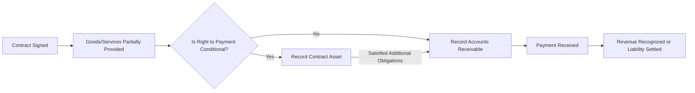
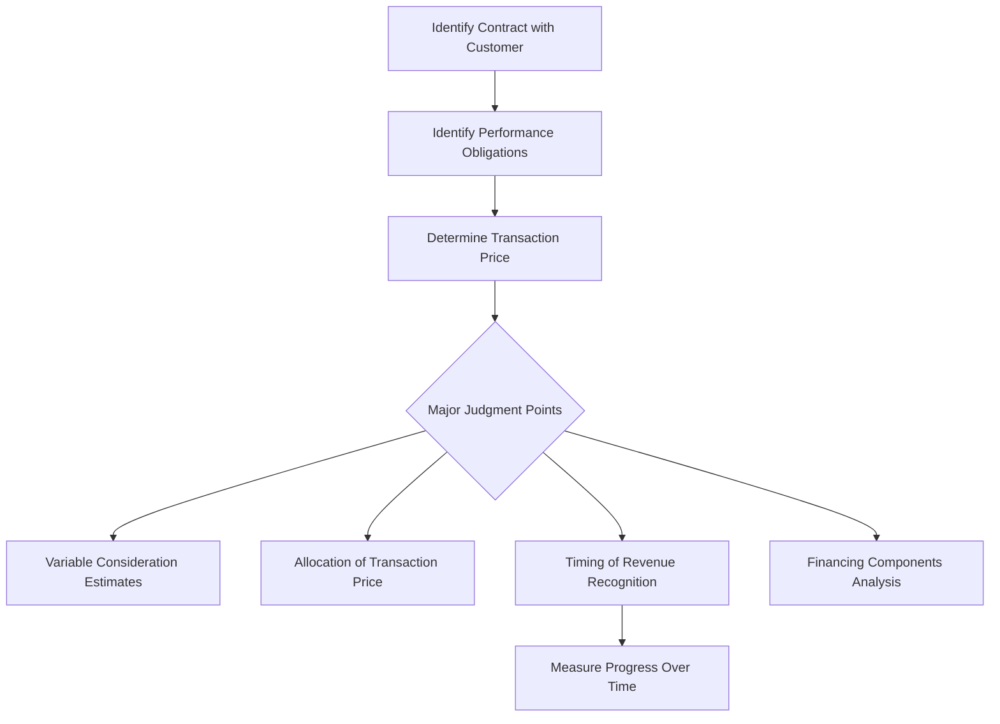

## 20.4 Presentation and Disclosure

Presenting revenue and associated balances in the financial statements requires a deep understanding of how contracts with customers impact a company’s assets, liabilities, and income. Under U.S. GAAP (ASC 606), entities are required to carefully classify and disclose contract assets and contract liabilities, provide relevant rollforwards, and highlight the significant judgments and estimates that underlie revenue measurement. This section explores these requirements in detail, illustrating key disclosure elements, common pitfalls, and best practices for ensuring transparent and consistent financial reporting.

### Contract Assets and Liabilities

In revenue recognition, a contract asset arises when an entity has transferred goods or services to a customer but has not yet established an unconditional right to payment. This situation commonly occurs when revenue recognition outpaces the billing process. On the other hand, a contract liability exists when an entity has received or is due consideration from a customer prior to transferring goods or services. A typical example of a contract liability is deferred (or unearned) revenue, where payment is received in advance of performance.

A critical distinction to remember is the difference between contract assets and accounts receivable. Accounts receivable represent unconditional rights to payment, only requiring the passage of time before payment is due. In contrast, a contract asset is contingent upon additional performance obligations or other constraints being satisfied.

Below is a simplified mermaid diagram illustrating the process of revenue recognition and the transition points between contract asset and receivable status:

In this flowchart, if the company has not performed sufficiently to secure an unconditional right to payment, the revenue recognized in excess of the amounts billed falls into the “contract asset” category. Over time, if additional milestones are met or conditions are satisfied, the contract asset transitions into an unconditional receivable. If at any point the amount billed to the customer exceeds the revenue recognized, that excess is a contract liability because the entity owes future performance.

### Presentation in the Financial Statements

Under ASC 606, contract assets and contract liabilities must typically be presented as separate line items on the balance sheet (or in related footnotes) if they are material. Entities may choose to present them under “Other current assets” or “Other current liabilities,” provided they sufficiently label the accounts and disclose the nature of the balances. In some industries, contract assets can also be referred to as “unbilled receivables.”

Common issues arise when companies improperly net contract assets and contract liabilities across multiple contracts and present only the net number. ASC 606 generally prohibits offsetting contract assets and liabilities across distinct contracts with customers, unless those contracts are combined under the guidance for contract combination. Even for combined contracts, the disclosure must clearly communicate how the net positions are determined.

#### Classification and Offsetting
• Entities should not offset contract assets and contract liabilities unless specific criteria for offsetting are met (e.g., a right of offset).  
• Companies must carefully evaluate whether contract assets are truly unconditional rights (receivables) or remain conditional upon further performance.

### Rollforwards of Contract Assets and Contract Liabilities

A critical disclosure requirement under ASC 606 (Revenue from Contracts with Customers) is providing a rollforward or reconciliation that enables users of financial statements to understand how contract balances change during the reporting period. This rollforward typically includes:

• Opening balance of contract assets and/or contract liabilities.  
• Additions due to new contracts or changes in transaction price.  
• Revenue recognized that was included in the opening balance of contract liabilities (i.e., satisfying performance obligations).  
• Transfers between contract assets and receivables (when a right to consideration becomes unconditional).  
• Closing balance of contract assets and/or contract liabilities at the end of the reporting period.  

A sample rollforward might appear as follows:

| Contract Assets (in $000s) | Amount |
|----------------------------|-------:|
| Beginning balance          |  1,200 |
| Additions                  |    900 |
| Transfer to accounts receivable | (650) |
| Adjustments for remeasurement   |   (50) |
| Ending balance             |  1,400 |

| Contract Liabilities (in $000s) | Amount |
|---------------------------------|-------:|
| Beginning balance               |  2,500 |
| Additional billings (cash received in advance) |  1,000 |
| Revenue recognized from beginning balance      |   (700) |
| Revenue recognized from new billings           |   (300) |
| Ending balance                  |  2,500 |

These tables provide transparency into how the entity’s overall contract balances shift quarter-over-quarter or year-over-year, allowing readers to gauge the nature and duration of revenue recognition activities.

### Major Judgments and Estimates

Revenue recognition often involves significant judgments around the timing and measurement of revenue, including:

• Determining the transaction price and estimating variable consideration (e.g., rebates, bonuses, and penalties).  
• Allocating the transaction price to multiple performance obligations (stand-alone selling prices and relative interests).  
• Estimating the progress toward completion for performance obligations satisfied over time.  
• Assessing whether a contract contains a significant financing component.  

Disclosure requirements highlight the need to clarify how management arrives at these estimates and the methods used to monitor changes in those estimates over time. Some common areas of judgment include:

1. Variable Consideration: Entities must explain how they estimate variable consideration, which may require using expected value or the most likely amount method. Disclosure should address any constraints applied to avoid significant revenue reversals.  
2. Timing of Satisfaction of Performance Obligations: Management must communicate the primary inputs or methods used to measure progress (e.g., cost-to-cost, units-of-delivery, or time-based methods).  
3. Stand-Alone Selling Prices (SASP): When multiple performance obligations exist, the company must disclose how it determines each obligation’s SASP and how discounts or variable considerations are allocated.  
4. Significant Financing Components: If payment terms extend beyond one year (or are significantly accelerated), ASC 606 requires evaluating whether a financing component exists, alongside recognizing interest expense or income.

Below is a mermaid diagram showcasing major judgment areas within the overall revenue recognition process:

### Detailed Disclosure Elements

Financial statements, particularly the notes, should convey:

• A qualitative and quantitative explanation of how revenue is recognized, including the methods and judgments applied.  
• The composition of contract assets and liabilities on the balance sheet, specifying amounts due to the timing of performance obligations versus billing cycles.  
• A description of the types of performance obligations, including remaining performance obligations and expected timing of revenue recognition.  
• The policy for determining stand-alone selling prices, if applicable.  
• Significant payment terms (e.g., variable consideration, financing components, etc.).  
• The types of warranties or return obligations, if material.  

Companies with multiple product lines or regions may also elect or be required to present disaggregated revenue, showing how the nature and timing of revenue vary among different segments. This helps financial statement users see how different economic factors or risk profiles affect each revenue stream.  

### Practical Considerations and Common Challenges

1. Consistency Across Interim and Annual Reporting: Disclosures in interim periods (Forms 10-Q under SEC guidance) should be informative yet concise. However, some entities fail to maintain consistency with annual disclosures (Form 10-K). The best practice is to maintain continuity and ensure any significant changes in judgments or amounts are adequately disclosed in both interim and annual periods.  
2. Bundled vs. Separate Performance Obligations: Complex software contracts or service arrangements may contain multiple performance obligations (e.g., warranties, upgrades). Separate identification and allocation of transaction price require robust internal controls and consistent application of estimation methods.  
3. Materiality Thresholds: ASC 606 does not prescribe explicit materiality thresholds. Nonetheless, each entity must determine whether certain revenue streams or contract balances are significant to understanding the financial position and results of operations.  
4. Transitioning Between Periods: Entities need to detail how contract assets and liabilities roll forward. In industries like construction or long-term manufacturing, where performance obligations span multiple years, disclosures become essential for understanding future revenue streams.  
5. Changes in Estimates and Retrospective Adjustments: If an estimate changes significantly from one period to another (e.g., an update to a variable consideration constraint or a revision in the measure of progress), entities are expected to disclose the nature of and reason for the change, along with the financial impact on the current and any prior periods.

### Illustrative Example

Imagine a software-as-a-service (SaaS) provider that enters into a two-year contract with a customer. The contract requires partial prepayment upfront, with the remainder billed monthly. Here’s how the company might present and disclose this arrangement:

• Contract Liabilities: The upfront payment is recognized as a contract liability. Each month, revenue is recognized for a portion of the software service provided, reducing the liability balance.  
• Contract Assets: If the company recognizes revenue for ongoing customization services before it can invoice the customer, a contract asset arises. For instance, the contract might specify that 40% of customization fees will be paid only upon completion. While partial tasks are completed, the company recognizes revenue under the percentage-of-completion model but cannot invoice until milestone completion, resulting in a contract asset.  
• Monthly Rollforward: Disclosures include a table reconciling opening contract liability balances, additions from new or renewed contracts, revenue recognized that was included in that beginning balance, and the ending balance. The company would also provide separate disclosure about the contract asset for customization tasks, including how it transitions to accounts receivable once the milestone is met.

### Best Practices for Clear Disclosures

• Provide a clear narrative that ties quantitative disclosures to the nature and timing of performance obligations.  
• Avoid highly technical language that obscures critical information. Instead, use plain language to correlate to your contractual terms.  
• Use illustrative examples or references to typical contract structures within your industry, ensuring the link between the disclosed amounts and actual operational processes is transparent.  
• Update disclosures regularly to reflect changes in business model, contract structures, and typical payment trends.  

### Encouraging Users to Read the Notes

One of the ongoing challenges for financial statement preparers is encouraging investors and stakeholders to read beyond the primary financial statements. Because revenue recognition involves complex judgments, it is essential to highlight the importance of these notes. Preparers can employ cross-referencing from the face of the financial statements to the notes, ensuring readers understand that each line item may have deeper context within the footnotes.

### References for Further Exploration

• FASB Accounting Standards Codification (ASC) 606 – Revenue from Contracts with Customers  
• FASB ASC 340-40 – Other Assets and Deferred Costs – Contracts with Customers  
• SEC Staff Accounting Bulletins (SAB) regarding revenue recognition, if applicable  
• AICPA Audit and Accounting Guide – Revenue Recognition  
• Industry-specific guidance, such as the AICPA’s Revenue Recognition Implementation Guides  

In sum, the presentation and disclosure requirements surrounding revenue recognition are as critical as the recognition and measurement guidelines themselves. The compositional elements of contract assets, contract liabilities, and rollforwards, combined with transparent disclosure of key judgments, enable financial statement users to assess both the current and future profitability of an entity. Entities that invest time in carefully structuring their disclosures can significantly enhance the decision usefulness of their financial statements.

---

## Presentation & Disclosure Mastery Quiz: Contract Assets, Liabilities, and Judgments



### Which of the following best describes a contract asset under ASC 606?
- [ ] An unconditional right to receive payment only pending the passage of time.
- [x] A right to consideration in exchange for goods or services transferred to a customer that is conditional on something other than the passage of time.
- [ ] A liability to the customer because payment has been received in advance.
- [ ] A contra-revenue account used for discounts or refunds.

> **Explanation:** A contract asset arises when an entity satisfies performance obligations but payment is contingent on satisfying additional performance obligations or other conditions, making it different from a receivable.

### Which statement about contract liabilities is most accurate?
- [ ] A contract liability only arises if the entity has fully performed all obligations.
- [x] A contract liability occurs when the entity has received consideration (or has the right to receive consideration) before transferring goods or services.
- [ ] A contract liability is an inventory account established to store products promised to customers.
- [ ] A contract liability is never recorded in the balance sheet, only disclosed in the footnotes.

> **Explanation:** A contract liability, often manifested as deferred or unearned revenue, arises when the customer has paid or owes payment for goods or services that have not yet been delivered or performed.

### What is the main purpose of the rollforward for contract assets and contract liabilities?
- [ ] To inform financial statement users of the entity’s macroeconomic forecasts.
- [ ] To demonstrate the entity’s compliance with international tax regulations.
- [x] To provide a reconciliation of how opening contract balances changed during the period due to revenue recognized, additional contract activity, and reclassifications.
- [ ] To restate all prior-period financial statements under the new revenue recognition standard.

> **Explanation:** The rollforward disclosure gives insight into the buildup and reduction of contract balances during the period, allowing users to track how an entity’s performance obligations and billing activities affect its assets and liabilities.

### Under ASC 606, which key judgment must be disclosed to help users understand revenue recognition practices?
- [x] The method used to estimate variable consideration and any constraints applied to avoid a significant revenue reversal.
- [ ] The name and contact details of the CFO responsible for financial reporting.
- [ ] Detailed employee headcount of the accounting department.
- [ ] The brand of accounting software used to prepare the financial statements.

> **Explanation:** Estimating variable consideration entails judgment about likely outcomes for rebates, bonuses, or penalties. Entities must disclose the methods used to arrive at these estimates and how they manage the risk of potential revenue reversals if the assumptions differ from actual results.

### Which of the following best describes a significant financing component under ASC 606?
- [ ] The portion of the contract that relates to shipping and handling.
- [ ] A fund allocated to marketing expenses.
- [x] A situation in which the timing of payments provides a significant benefit of financing to either the customer or the entity.
- [ ] A separate contractual agreement that is out of scope of ASC 606.

> **Explanation:** A significant financing component emerges when the contract includes payment terms that effectively allow one party to finance the other, leading to recognition of interest income or expense over time.

### When is it generally appropriate to offset a contract asset with a contract liability?
- [ ] Whenever the company decides it is easier to present a net balance.
- [x] Only when the two positions arise from the same contract and are subject to a right of offset under the contract or under law.
- [ ] Whenever management estimates that the net effect will be immaterial.
- [ ] Offsetting is never allowed under ASC 606.

> **Explanation:** ASC 606 generally requires entities to present contract assets and liabilities separately. Offsetting is permitted only in rare circumstances, such as when they originate from the same contract and legal right of offset exists.

### A rollforward of contract liabilities would typically include which line item?
- [ ] Depreciation expense on capital leases.
- [ ] Amortization of software development costs.
- [x] Revenue recognized that was included in the opening balance of contract liabilities.
- [ ] Cost of goods sold reclassifications.

> **Explanation:** The rollforward must detail how and when amounts initially reported as contract liabilities are recognized as revenue, specifically identifying how much of the change relates to revenue recognized from the opening balance.

### Which question should a preparer address when determining the allocation of transaction price to multiple performance obligations?
- [ ] Are all obligations covered by the same insurance policy?
- [ ] Do cost allocations match the prior audit period?
- [x] How is the stand-alone selling price determined for each performance obligation, and how will discounts or variable consideration be allocated?
- [ ] Will the entity automatically reallocate every quarter based on the budget?

> **Explanation:** ASC 606 requires allocation of the transaction price based on stand-alone selling prices; preparers must document how those prices are determined and how discounts or variable amounts are distributed among the performance obligations.

### Which element is most likely not required in disclosures about revenue recognition under ASC 606?
- [ ] Significant judgments in determining the transaction price.
- [ ] Information about contract balances and changes in those balances.
- [ ] The methods used to recognize revenue over time.
- [x] A full marketing analysis of potential future customers in the pipeline.

> **Explanation:** While disclosures under ASC 606 are extensive, they do not require entities to provide forecasts about uncommitted future customers. Instead, they focus on contracts already in place.

### In some circumstances, a company must calculate interest on a portion of the contract consideration if payment is significantly deferred. What does this approach reflect?
- [x] The presence of a significant financing component.
- [ ] A variable consideration call option.
- [ ] A derivative embedded in the contract.
- [ ] A foreign currency adjustment for imports.

> **Explanation:** When the timing of payments and performance obligations differ significantly, the arrangement may contain a financing component. In such cases, ASC 606 requires the entity to adjust the transaction price for the effects of the significant financing.



---

## For Additional Practice and Deeper Preparation

**[FAR CPA Hardest Mock Exams: In-Depth & Clear Explanations](https://www.udemy.com/course/far-cpa-mock-exams/?referralCode=F88050F8D5C76764F6BD)**  

**Financial Accounting and Reporting (FAR) CPA Mocks:** 6 Full (1,500 Qs), Harder Than Real! In-Depth & Clear. Crush With Confidence!

- Tackle full-length mock exams designed to mirror real FAR questions.  
- Refine your exam-day strategies with detailed, step-by-step solutions for every scenario.  
- Explore in-depth rationales that reinforce higher-level concepts, giving you an edge on test day.  
- Boost confidence and minimize anxiety by mastering every corner of the FAR blueprint.  
- Perfect for those seeking exceptionally hard mocks and real-world readiness.

_Disclaimer: This course is not endorsed by or affiliated with the AICPA, NASBA, or any official CPA Examination authority. All content is for educational and preparatory purposes only._
