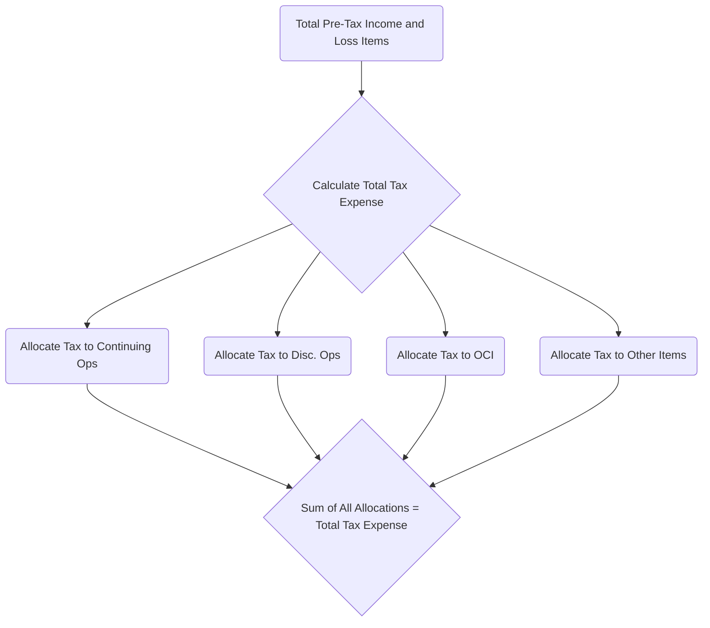
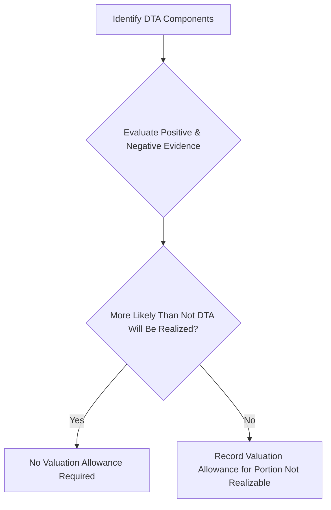

## 21.2 Valuation Allowances, NOLs, Intraperiod Tax Allocation

Income tax accounting is among the more challenging areas of financial reporting, governed primarily by ASC 740, Income Taxes. Within this topic, three critical areas—valuation allowances, net operating losses (NOLs), and intraperiod tax allocation—require both conceptual clarity and careful application to ensure the accuracy and transparency of financial statements. This section delves into these components, providing detailed explanations, illustrative examples, mermaid diagrams, and best-practice guidance to equip candidates with the knowledge necessary to master these concepts for the CPA Exam and practical, real-world accounting scenarios.

---

### Introduction to Deferred Tax Accounting Concepts

Under ASC 740, deferred tax assets (DTAs) and deferred tax liabilities (DTLs) arise from temporary differences between the financial reporting basis and the tax basis of assets, liabilities, and certain transactions. Deferred taxes serve to match revenue and expense recognition between GAAP financial statements and tax returns over multiple periods. However, the realization of these assets is only probable if there is likely enough taxable income to offset them. When there is uncertainty about whether certain DTAs will be realized, a valuation allowance is required. 

Additionally, entities often incur net operating losses (NOLs), which can be carried forward to offset future taxable income. A separate but equally intricate concept is intraperiod tax allocation, in which total income tax expense (or benefit) is spread across different sections of the financial statements—continuing operations, discontinued operations, other comprehensive income (OCI), and so forth—to accurately reflect each item’s share of the overall tax effect.

---

### Valuation Allowances

A valuation allowance is an integral component of U.S. GAAP accounting for income taxes. ASC 740 requires an organization to assess whether it is more likely than not (defined as a likelihood of greater than 50%) that the deferred tax asset will be realized. If it is not more likely than not, a valuation allowance must be recorded to reduce the DTA to the amount that is expected to be realized.

#### Key Elements of Valuation Allowances

• More-Likely-Than-Not Criterion: Entities evaluate all available positive and negative evidence, both qualitative and quantitative, to ascertain the likelihood of realizing a DTA.  
• Source of Taxable Income: The entity analyzes whether there will be sufficient future taxable income against which the deferred tax asset can be utilized. Sources typically include:
  – Future reversals of existing taxable temporary differences  
  – Projected future taxable income  
  – Tax-planning strategies that can generate taxable income  
  – Carrybacks of losses (for those jurisdictions that allow carrybacks)

• Determining the Amount of Valuation Allowance: Once an analysis shows that a portion (or all) of the DTA will not be realized, the entity will recognize a valuation allowance for that portion. This allowance is re-assessed each reporting period.

• Reduction or Elimination of Valuation Allowance: If future positive evidence, such as consistent profitability or new tax-planning strategies, indicates that it has become more likely than not that previously unrecognized DTAs are realizable, the valuation allowance may be reduced or removed.

#### Measuring the Valuation Allowance

Measurement typically involves comparing projected taxable income against future deductible amounts:

1. Identify the full potential benefit of the DTA.  
2. Assess all available evidence—this might include the company’s historical profitability or losses, cyclical trends, and forecasts of income.  
3. Quantify the portion of the DTA for which realization is not more likely than not.  
4. Record a valuation allowance for that portion.  

When the outlook changes—whether due to operational improvements, new legislation, or other external factors—entities revisit their valuation allowance determinations. Because of this re-assessment, the valuation allowance can be dynamic, causing significant fluctuations in reported tax expense and net income.

##### Example: Estimating a Valuation Allowance

Suppose a company has a $2 million DTA resulting from deductible temporary differences and NOL carryforwards. After a thorough analysis (including evaluating forecasted future income, trends in revenue, and cost structures), management concludes it is probable that they can only utilize $1.2 million of the DTA. Consequently, the company measures a $0.8 million valuation allowance, reducing the net DTA on the balance sheet to $1.2 million.

---

### Net Operating Loss Carryforwards (NOLs)

Net operating losses (NOLs) are the amounts by which tax-deductible expenses exceed taxable revenues in a given tax period. Historically, NOLs could be carried back to offset prior-period taxable income, generating an immediate refund, or carried forward to reduce future taxable income over a set period. After recent U.S. tax law changes (particularly under the Tax Cuts and Jobs Act of 2017), the rules around NOL usage have evolved.

#### Current Reporting for NOL Carryforwards (U.S. Context)

• Indefinite vs. Finite Carryforward Periods: While older NOLs may carry forward for up to 20 years, newer NOLs (post-2017 for U.S. federal purposes) often have an indefinite carryforward, though they may be limited to offsetting 80% of taxable income in any given year.  
• Deferred Tax Asset Recognition: NOL carryforwards create a deferred tax asset to the extent they have value in offsetting future taxable income. The applicable tax rate is typically the rate expected to be in effect when the NOL is utilized.  
• Valuation Allowance: If future taxable income projected by the company is not sufficient or uncertain, it may be necessary to record a valuation allowance against some or all of the NOL-related DTA.  

##### Practical Example of NOL Utilization

Let’s assume Company X has incurred an NOL of \$5 million in the current tax year. The applicable corporate tax rate is 21%. Therefore, the company initially recognizes a \$1.05 million (=\$5 million × 21%) deferred tax asset. If management forecasts consistent future taxable earnings such that the \$5 million NOL will fully offset taxes in subsequent years, no valuation allowance is recorded. However, if management’s projections indicate that only \$3 million of the NOL can be realized before expiration (or if indefinite rules limit usage to 80% of income in any given year), a partial valuation allowance is recorded.

---

### Intraperiod Tax Allocation

Intraperiod tax allocation is the process of allocating the total income tax expense or benefit for a period to the components of the financial statements that gave rise to those items. This concept ensures that each category of income (or other comprehensive income) reflects the correct amount of tax associated with it. ASC 740-20-45 provides specific guidance.

Components commonly subject to intraperiod tax allocation include:  
• Continuing operations  
• Discontinued operations  
• Other comprehensive income (e.g., unrealized gains/losses on available-for-sale securities)  
• Corrections of errors and changes in accounting principles  
• Items charged or credited directly to equity (rare, but certain transactions or reclassifications could be involved)

#### Conceptual Rationale

The rationale is that different sections of the statement of comprehensive income or retained earnings can reflect distinct economic events with unique tax implications. To ensure clarity and faithful representation, the total tax impact should be divided among those events. 

#### Basic Steps for Intraperiod Tax Allocation

1. Compute Income (Loss) Before Taxes for each relevant item (e.g., continuing operations vs. discontinued operations).  
2. Determine the Preliminary “Total Tax Provision” or “Total Tax Benefit” for the period.  
3. Allocate the tax provision or benefit among continuing operations, discontinued operations, OCI items, and other relevant components based on each item’s relative contribution to total taxable income or loss.  
4. Calculate the effective tax rate for each line item, ensuring that the amounts sum to the total tax expense or benefit.  

##### Illustration with Allocations

Suppose a company has the following pre-tax amounts in a single period:
- \$100,000 income from continuing operations  
- \$20,000 loss from a discontinued operation  
- \$30,000 gain recognized in other comprehensive income (related to certain hedging instruments)  

And assume the statutory tax rate is 21%. Roughly, the total pre-tax income amounts to \$110,000 when you net continuing ops with the loss from discontinued ops but exclude OCI. Under intraperiod allocation, we usually compute:

• Tax on continuing operations: \$100,000 × 21% = \$21,000  
• Discontinued operations: –\$20,000 × 21% = –\$4,200 (a tax benefit)  
• OCI: \$30,000 × 21% = \$6,300 (allocated in other comprehensive income)

The sum of these allocated tax amounts (\$21,000 – \$4,200 + \$6,300 = \$23,100) should reconcile to the total tax expense for the period (if there are no other items).

---

### Diagram: Intraperiod Tax Allocation Flow

Below is a mermaid diagram showcasing how total tax expense is allocated across different line items in the financial statements:

By visualizing it this way, we see that the intraperiod allocation process starts with identifying all sources of income or loss and deriving the total tax expense. That expense is then apportioned among various line items. The end result is that these allocated amounts from each component sum to the total tax expense or benefit.

---

### Comprehensive Example Combining Valuation Allowances, NOLs, and Intraperiod Tax Allocation

Consider an entity, “ABC Corp.,” that has the following facts during a reporting period:

• Pre-tax income from continuing operations: \$800,000  
• Pre-tax loss from discontinued operations: \$100,000  
• Other comprehensive income: \$50,000 (from unrealized gains in available-for-sale securities)  
• Current-year net operating loss carryforward generated: \$300,000  
• Existing deferred tax assets from prior years: \$400,000 (before considering the current-year NOL)  
• Based on projections, ABC Corp. expects to use only \$500,000 of its total DTAs, resulting in a need for a valuation allowance.  
• Statutory federal tax rate: 21%  

Step 1 – Calculate the total pre-tax amounts:
• Continuing operations: \$800,000  
• Discontinued operations: –\$100,000  
• OCI: \$50,000  
• Total pre-tax “standard” income for the period ignoring OCI is \$700,000 (i.e., \$800,000 – \$100,000).  

Step 2 – Compute DTA for current-year NOL and consolidate with existing DTAs:
• Current-year NOL DTA: \$300,000 × 21% = \$63,000  
• Total DTA from prior years: \$400,000  
• Combined DTA: \$463,000  

Step 3 – Determine Valuation Allowance:
• Management believes only \$500,000 of total DTAs (previous plus potential future) will be realized. If the total DTA (including prior years plus the new one) is \$463,000, and the company expects \$500,000 to be realizable, it indicates no additional valuation allowance might be needed.  
• However, if new evidence suggests an even lower realization potential (say only \$300,000 can be used), then the valuation allowance might be \$163,000 (=\$463,000 – \$300,000).  

Step 4 – Intraperiod Allocation:
• Total Income Before Taxes from continuing operations: \$800,000 × 21% = \$168,000 hypothetical tax.  
• Discontinued operations: \$100,000 loss × 21% = \$21,000 tax benefit.  
• OCI: \$50,000 × 21% = \$10,500 in other comprehensive income (tax effect).  
• Summation of intraperiod allocation: \$168,000 – \$21,000 + \$10,500 = \$157,500 total tax expense for the period (before considering the effect of the valuation allowance changes).

Step 5 – Adjust for Valuation Allowance:
• If a new or changed valuation allowance is required, it typically gets recorded in continuing operations unless a portion is specifically associated with items in other categories (such as discontinued operations or OCI). For example, if a \$50,000 increase in the valuation allowance is due entirely to a reevaluation of continuing operations’ future profitability, that \$50,000 would reduce (increase) tax expense in continuing operations.  

The net reported tax expense for continuing operations would incorporate these adjustments. Discontinued operations and OCI typically retain the original allocated amounts unless a specific portion of the DTA or DTL is directly attributable to them.

---

### Best Practices and Common Pitfalls

Maintaining accuracy in the deferred tax area demands consistent application of ASC 740 and robust documentation. Below are some recommended best practices and pitfalls to avoid:

**Best Practices**  
• Establish a Rigorous Forecasting Process: Realizing DTAs depends on future taxable income. Maintain clear, well-supported forecasts that align with actual and predicted economic performance.  
• Document Positive and Negative Evidence Thoroughly: Provide written support for every piece of evidence used to assess DTAs and valuation allowances.  
• Revisit Valuation Allowances Each Reporting Period: Shifts in market conditions, legal environments, or company performance can alter the realizability of deferred tax assets.  
• Coordinate Cross-Functional Teams: Collaboration between tax, finance, and operations departments helps ensure that tax accounting aligns with overall business strategies.  

**Common Pitfalls**  
• Overlooking Temporary vs. Permanent Differences: Not all book-tax differences create deferred taxes. Permanent differences (such as fines and penalties) do not result in DTAs/DTLs, and incorrectly recording them can misstate tax expense.  
• Failing to Update Valuation Allowances Promptly: Entities sometimes delay valuation allowance updates, causing sudden large adjustments in subsequent periods.  
• Improper Intraperiod Tax Allocation: Errors in splitting the total tax among continuing ops, discontinued ops, and OCI can misstate the financial statements. It is crucial to follow the specific guidance in ASC 740.  
• Neglecting Tax Rate Changes: If tax rates change (from either legislation or new jurisdictions in which the company operates), DTAs and DTLs must be remeasured. This remeasurement can significantly affect reported earnings.  

---

### Additional Illustrative Mermaid Diagram: Valuation Allowance Decision Tree

The following diagram illustrates a simplified decision process for determining if a valuation allowance is needed:

This high-level flow confirms that once management identifies the deferred tax assets, a systematic evaluation of the evidence determines whether those assets will be used. If not, a valuation allowance must be recorded or increased.

---

### IFRS Comparison (Brief Overview)

While the CPA Exam primarily focuses on U.S. GAAP, IFRS (IAS 12, Income Taxes) also addresses deferred taxes, but does not typically use a “valuation allowance” account structure. Under IFRS, a DTA is recognized only to the extent that it is probable (a higher threshold than “more likely than not”) that future taxable profit will be available. If it becomes probable that a previously unrecognized DTA can be used, it is recognized immediately. This conceptual approach can be seen as more “direct” than U.S. GAAP’s reliance on a full recognition followed by a valuation allowance.

Additionally, intraperiod tax allocation under IFRS requires allocation of tax to continuing operations, discontinued operations, and items recognized in other comprehensive income, consistent with the fundamental principle that each component of income affects the company’s overall tax position.

---

### References for Further Study

• ASC 740, Income Taxes, provides the primary U.S. GAAP guidance for deferred taxes, valuation allowances, and intraperiod allocation.  
• FASB Accounting Standards Codification (ASC) Master Glossary for definitions of terms such as “valuation allowance,” “deferred tax asset,” and “intraperiod tax allocation.”  
• IAS 12, Income Taxes, for the IFRS perspective on recognizing DTAs, DTLs, and allocating taxes among various components of the financial statements.  
• ASC 205-20 for discontinued operations classification and presentation considerations related to intraperiod tax allocation.

---

### Conclusion

Valuation allowances, net operating loss (NOL) carryforwards, and intraperiod tax allocation each require careful attention to detail, a thorough understanding of ASC 740, and ongoing monitoring of the company’s financial and tax environment. These considerations ensure that recognized DTAs and valuation allowances accurately reflect the company’s projected ability to generate taxable income, that NOLs are recorded at an appropriate value, and that the total income tax expense is properly allocated across the various components of the financial statements.

When performed competently, tax accounting communicates vital information to stakeholders about how a company’s business performance and strategies intersect with the tax code—one of the most complex and ever-changing areas in financial reporting.

---

## Test Your Knowledge: Valuation Allowances, Net Operating Losses, and Intraperiod Tax Allocation



### What triggers the establishment of a valuation allowance under ASC 740?
- [x] Evidence that it is not more likely than not that a portion of a deferred tax asset will be realized
- [ ] A temporary rate fluctuation in the market
- [ ] A permanent difference between book and tax records
- [ ] A partial discontinuance of a product line

> **Explanation:** ASC 740 requires a valuation allowance if it is not more likely than not that the deferred tax asset will be realized.

### Which piece of evidence is generally considered positive in evaluating whether a deferred tax asset will be realizable?
- [x] Firm sales commitments providing reliable future taxable income
- [ ] Recent recurring net losses in the past three years
- [ ] Ongoing litigation that could deplete future cash resources
- [ ] Customer contract cancellations

> **Explanation:** Having firm sales commitments indicates a likelihood of future taxable income, a positive piece of evidence favoring realization of a deferred tax asset.

### Under current U.S. federal tax rules, which of the following statements about net operating losses (NOLs) is correct?
- [x] Post-2017 NOLs generally have an indefinite carryforward period and are limited to offsetting 80% of taxable income
- [ ] All NOLs have a 20-year carryback period
- [ ] NOLs cannot be carried forward after 2017
- [ ] NOLs are always carried back before being carried forward

> **Explanation:** The Tax Cuts and Jobs Act of 2017 allows indefinitely carrying forward NOLs generated after 2017, capped at offsetting 80% of taxable income in a given year.

### Intraperiod tax allocation is primarily intended to:
- [x] Match the tax effects of each component of income and other comprehensive income
- [ ] Report all tax in continuing operations only
- [ ] Simplify the reporting of tax expense
- [ ] Eliminate deferred taxes from the balance sheet

> **Explanation:** Intraperiod tax allocation ensures that each source of income (continuing, discontinued, OCI items) shows the correct tax expense or benefit.

### Which of the following is true regarding a valuation allowance?
- [x] It reduces the carrying amount of a deferred tax asset to the amount expected to be realized
- [ ] It is an additional liability recognized on the balance sheet
- [x] It may be reversed in subsequent periods if conditions change
- [ ] It is prohibited under U.S. GAAP

> **Explanation:** A valuation allowance is a contra-account to DTAs and can be adjusted in later periods if the assessment of realizability changes.

### How is a valuation allowance recorded in the financial statements if related to a company’s projected inability to use future tax benefits?
- [x] It is recorded as an increase to tax expense (or a reduction of tax benefit) in continuing operations
- [ ] It directly reduces retained earnings
- [ ] It is charged against revenues
- [ ] It inflates other comprehensive income (OCI)

> **Explanation:** An increase in a valuation allowance typically increases tax expense in continuing operations unless it is specifically associated with an item outside continuing operations.

### Under intraperiod tax allocation, which item typically requires a separate tax effect presentation?
- [x] Discontinued operations
- [ ] Inventory write-downs
- [x] Other comprehensive income items
- [ ] Accounts receivable turnover

> **Explanation:** Both discontinued operations and items recognized in OCI require separate tax effect disclosure or allocation.

### If a company’s actual results show that a previously recorded valuation allowance is no longer necessary:
- [x] The company should reduce the valuation allowance and record a decrease in tax expense
- [ ] The allowance remains since it was booked in a prior period
- [ ] The allowance can only be changed after three years of profitability
- [ ] It should be shifted to retained earnings immediately

> **Explanation:** When conditions change indicating the company can realize more of its DTAs, the valuation allowance is reversed, reducing tax expense (in continuing operations unless specifically tied to other components).

### When allocating tax to other comprehensive income (OCI), which of the following items might typically require an intraperiod tax allocation?
- [x] Unrealized gains on available-for-sale securities
- [ ] A new bond issuance
- [ ] Depreciation expense on manufacturing equipment
- [ ] Cash distributions to shareholders

> **Explanation:** Unrealized gains (and losses) on available-for-sale securities are generally recognized in OCI, requiring a tax allocation under intraperiod tax allocation guidance.

### For intraperiod tax allocation, the total tax expense or benefit allocated to continuing operations, discontinued operations, OCI, and any other special items should equal the total tax expense (or benefit) for the period.
- [x] True
- [ ] False

> **Explanation:** All portions must sum up to the total tax expense or benefit for the period to ensure no double counting or omission of any tax effects.



---

## For Additional Practice and Deeper Preparation

[**FAR CPA Hardest Mock Exams: In-Depth & Clear Explanations**](https://www.udemy.com/course/far-cpa-mock-exams/?referralCode=F88050F8D5C76764F6BD)

Financial Accounting and Reporting (FAR) CPA Mocks: 6 Full (1,500 Qs), Harder Than Real! In-Depth & Clear. Crush With Confidence!

- Tackle full-length mock exams designed to mirror real FAR questions.  
- Refine your exam-day strategies with detailed, step-by-step solutions for every scenario.  
- Explore in-depth rationales that reinforce higher-level concepts, giving you an edge on test day.  
- Boost confidence and minimize anxiety by mastering every corner of the FAR blueprint.  
- Perfect for those seeking exceptionally hard mocks and real-world readiness.

_Disclaimer: This course is not endorsed by or affiliated with the AICPA, NASBA, or any official CPA Examination authority. All content is for educational and preparatory purposes only._
