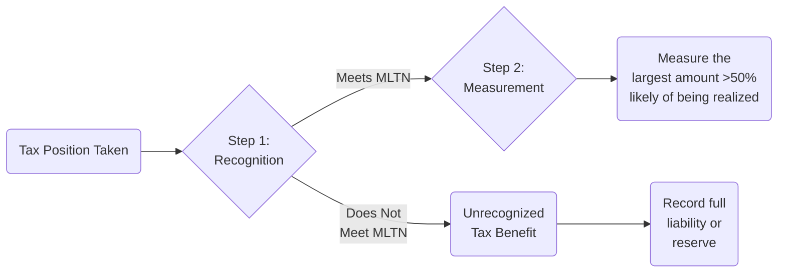

## 21.3 Uncertain Tax Positions, Disclosures

Uncertain tax positions represent a critical component of income tax accounting under U.S. GAAP, governed mainly by ASC 740. When an entity takes a tax position—for example, claiming certain deductions, credits, or structuring transactions to benefit from lower taxes—there is a risk that the taxing authority may challenge this position. To address this risk, ASC 740 prescribes a standardized framework for recognizing, measuring, and disclosing the financial statement effects of such uncertain tax positions.

This section elaborates on the two-step process for evaluating uncertain tax positions, explains the “more likely than not” recognition threshold, outlines key measurement concepts, and clarifies the disclosure requirements. By the end of this chapter, you will be equipped with the tools to navigate uncertain tax positions on the Uniform CPA Examination and in real-world accounting scenarios.

  
### Overview of Uncertain Tax Positions

A “tax position” can be broadly interpreted. It includes any position taken or expected to be taken on a tax return, whether or not a return has already been filed. This can range from clearly permissible items, such as legitimate deductions or credits, all the way to aggressive positions that rely on a particular legal interpretation. Often, management must assess how likely it is that a given position will be sustained upon examination by tax authorities.

Under ASC 740, entities are required to:
• Recognize a tax benefit from an uncertain tax position only if it is more likely than not that the position will be sustained upon examination.  
• Measure the recognized benefit as the largest amount of tax benefit greater than 50% likely of being realized upon settlement.  
• Record any differences between the amount claimed on the tax return and the amount recognized in the financial statements as an unrecognized tax benefit.  
• Disclose unrecognized tax benefits and other pertinent information regarding unsettled positions in the footnotes to the financial statements.

  
### The Two-Step Approach

ASC 740 prescribes a two-step process for evaluating uncertain tax positions: (1) Recognition and (2) Measurement. Understanding both phases is essential when determining how these positions impact an entity’s reported income tax expense and related liabilities.

  
#### Recognition Step

In the recognition phase, the entity must evaluate whether it is “more likely than not” (MLTN) that a tax position will be sustained upon examination by the relevant taxing authority. This assessment includes:

• Legal Support: Reviewing statutes, regulations, and relevant case law.  
• Documentation: Evaluating historical precedent, professional opinions, or external legal advice.  
• Tax Authority Considerations: Assessing the aggressiveness of tax authorities and whether past audits or appeals indicate potential for disallowance.

“More likely than not” means a greater than 50% likelihood of being sustained. If the tax position does not meet this threshold, the benefit cannot be recognized—no matter how significant it might be to the entity. If it does meet the threshold, it moves to the measurement phase.

  
#### Measurement Step

If the recognition criterion is satisfied (i.e., “more likely than not” is met), the entity measures the benefit to be recognized on the financial statements. The standard requires an entity to measure the tax benefit as the “largest amount of benefit that is greater than 50% likely of being realized upon ultimate settlement.” In other words, management should consider a range of possible outcomes and choose the single best estimate that cumulatively has a greater than 50% chance of being sustained if challenged by the taxing authority.

This measurement step often involves a probability-weighted analysis of different settlement scenarios. However, the final recognized amount should not exceed the portion of the total tax benefit with a cumulative probability of 50% or more. Any remainder is carried as an unrecognized tax benefit (a potential liability or reduction of a deferred tax asset in the financial statements).

  

The diagram above outlines the two-step approach: If the position meets the recognition threshold (Step 1), the entity proceeds to measure the recognized benefit (Step 2). If it fails, the entire position is unrecognized.

  
### “More Likely Than Not” Threshold

A cornerstone of evaluating uncertain tax positions, the “more likely than not” threshold significantly influences whether a tax position will appear on the financial statements. This threshold aligns with the general philosophy of conservatism in accounting: benefits are only recognized if there is a probability in excess of 50% that the position would be upheld.

Some practical considerations when assessing this threshold include:
• Strength of Legal Support: A robust legal foundation—supported by internal or external tax counsel—can bolster the argument that the position meets the recognition criteria.  
• Industry Practice: If a position aligns with widely recognized industry practice, it may be more defensible.  
• Legislative Intent: Sometimes, the legislative history behind a particular tax credit or deduction can clarify the original intent of lawmakers, influencing the likelihood of sustaining the position.

  
### Financial Statement Implications

When a position fails to reach the “more likely than not” benchmark, the entity must record a liability (or reduce a beneficial effect, such as a deferred tax asset). Conversely, if the position is recognized initially but is parlayed into a lower recognized benefit during the measurement step, the difference remains as an unrecognized tax benefit. These unrecognized amounts affect the reported income tax expense and, ultimately, net earnings.

  
### Presentation and Classification

For uncertain tax positions, the resulting unrecognized tax benefits are often recorded as a liability in the financial statements. Depending on the underlying nature of the position, it may also reduce deferred tax assets if the position is related to carryforwards or credits.

Entities typically present any interest accrued, as well as relevant penalties related to unrecognized tax positions, in the income tax expense category (or as a separate line item). This approach helps users of the financial statements to clearly see the total cost of uncertain tax positions, including any associated interest and penalties.

  
### Interest and Penalties

ASC 740 requires an entity to estimate and record interest associated with uncertain tax positions if interest is assessed by the taxing authority under relevant tax law. Penalties that are not purely interest in nature should be recognized as well, typically as a component of income tax expense. Nonetheless, the specific classification of interest and penalties in the income statement can vary based on the entity’s policy choice (disclosed in the footnotes). Some companies record these amounts in operating expenses rather than in income tax expense. Consistency in classification is essential for comparability.

  
### Required Disclosures

Financial statements must include extensive disclosures about uncertain tax positions. The aim is to provide users with transparent information regarding the nature of uncertain tax positions, their potential financial effects, and any changes in the unrecognized tax benefits over time. Key disclosures typically include:

• Discussion of the uncertainties related to the tax positions taken.  
• The tax years open to examination by major taxing jurisdictions.  
• A tabular roll-forward of unrecognized tax benefits, which often includes:  
  – Beginning balance.  
  – Additions based on tax positions of the current year.  
  – Additions for positions of prior years.  
  – Reductions for positions of prior years (e.g., settlements or lapses in the statute of limitations).  
  – Ending balance.  
• The total amount of unrecognized tax benefits that, if recognized, would affect the effective tax rate.  
• A description of tax positions for which it is “reasonably possible” that the total amounts of unrecognized tax benefits will significantly increase or decrease within 12 months of the reporting date due to, for instance, settlement or the application of a statute of limitations.

  
Footnotes also frequently include the entity’s accounting policy regarding the classification of interest and penalties in the financial statements. This helps users of financial statements understand how management chooses to present these supplementary costs.

  
### Example

Assume Entity A operates in multiple jurisdictions and has filed for a significant research and development (R&D) tax credit under federal and state laws. Management believes that their documentation strongly supports the credit claimed; however, an external tax advisor reviewing the position provides a more measured opinion. After careful evaluation, the company decides that there is a 60% chance that the full $1 million credit will be sustained. Because the threshold exceeds 50%, the entity moves to the measurement step.

In the measurement step, the entity assesses the range of possible settlement outcomes. The management’s probability analysis yields:
• 40% chance of no benefits (i.e., entire credit denied).  
• 20% chance of a $400,000 partial allowance.  
• 40% chance of a $1,000,000 full allowance.

The single best amount that is cumulatively more than 50% likely to be realized is $400,000 because the chances of getting at least $400,000 is 60% (20% partial allowance + 40% full allowance). Hence, the recognized benefit in the financial statements is $400,000, and the unrecognized $600,000 is carried as a liability for uncertain tax positions.

  
### Best Practices for Compliance

Entities should proactively manage their uncertain tax positions by:
• Maintaining detailed documentation of each tax position, including legal or technical memoranda supporting the position.  
• Continually monitoring changes in tax regulations or case law that could affect current or previously recognized positions.  
• Engaging legal counsel or tax accountants to review ambiguous positions to assess the likelihood of sustainability.  
• Developing internal controls and review processes to ensure consistent application of ASC 740 requirements.  
• Regularly updating disclosures and footnotes in line with fresh information, such as new tax rulings or impending audits.

  
### Common Pitfalls

• Over-reliance on Past Experience: Assuming that because a position has not been challenged historically, it meets the “more likely than not” threshold. Prior silence from tax authorities does not guarantee sustainability.  
• Insufficient Documentation: Failing to compile thorough records of how management reached its conclusions on each uncertain position.  
• Non-Disclosure: Omitting essential footnote details or the tabular roll-forward of unrecognized tax benefits. This can mislead stakeholders about the magnitude of tax risks.  
• Poorly Structured Settlement Analysis: Neglecting the probability distribution when determining the largest amount that is more than 50% likely of being realized.

  
### Strategies to Navigate Uncertain Tax Positions

Because uncertain tax positions can have material impacts on earnings and disclosures, consider the following strategies:
• Conduct Periodic Reviews: Revisit each material tax position at least quarterly to assess changes in probability, new legislation, or forthcoming audits.  
• Involve Qualified Professionals: Use professional judgment backed by up-to-date legal research or external tax counsel opinions.  
• Implement a Comprehensive Risk Management Framework: Treat uncertain tax positions as part of the broader enterprise risk management (ERM), ensuring strategic alignment with risk tolerance.  
• Communicate with External Auditors: Collaborate closely with auditors to update them on the entity’s uncertain tax positions, including evaluating whether recognized and unrecognized amounts are warranted.  
• Be Transparent in Disclosures: Provide clear explanations of significant changes in unrecognized tax benefits or uncertain tax position evaluations.

  
### Case Study: Multiple Jurisdictions

Suppose a multinational entity—Entity B—has operations in the U.S., Canada, and Germany. Each country has its own tax regulations, and the rules can also differ at the subsidiary or branch level. Entity B’s uncertain tax positions could include:

• Transfer Pricing Adjustments: The official pricing for goods or services transferred between international affiliates.  
• Residency Challenges: Whether the taxing authority recognizes certain deductions or special credits for cross-border employees.  
• Local Tax Incentives: Credits or incentives that local authorities might revisit.  

Entity B compiles a comprehensive matrix of all positions across jurisdictions, each with its own “more likely than not” assessment. If different tax authorities require different levels of documentation or apply different interpretations, B must break down each position by jurisdiction and evaluate whether local regulations make it more or less likely for the position to be upheld. This analysis feeds into a consolidated accounting approach and a unified set of disclosures, acknowledging that each country’s open tax years may vary.

  
### References for Further Exploration

• FASB Accounting Standards Codification (ASC) 740 – Income Taxes  
• AICPA – Tax Section Guidance on Uncertain Tax Positions  
• EY, Deloitte, KPMG, PwC – Tax Alerts or Whitepapers on ASC 740 Implementation  
• “Research & Development Tax Incentives: U.S. and Global Context” – A resource for understanding uncertain tax positions arising from R&D claims  
• Online courses on advanced tax accounting, focusing on ASC 740 best practices

These resources can provide additional clarity on how tax law interplay and technical accounting standards come together in uncertain tax positions.

  
## SEO-Optimized Quiz on Uncertain Tax Positions and Disclosures



### Which accounting standard primarily governs uncertain tax positions under U.S. GAAP?

- [ ] ASC 606
- [x] ASC 740
- [ ] ASC 842
- [ ] ASC 280

> **Explanation:** Uncertain tax positions fall under the scope of ASC 740, relating to accounting for income taxes.

### Under ASC 740, what is the threshold for recognizing a tax benefit related to an uncertain tax position?

- [ ] Probable
- [ ] Virtually certain
- [x] More likely than not
- [ ] At least reasonably possible

> **Explanation:** “More likely than not” means there must be a greater than 50% likelihood that the position will be sustained upon examination.

### In the measurement step, the tax benefit recognized is based on which of the following approaches?

- [ ] Weighted-average
- [ ] Median outcome
- [x] Largest amount more than 50% likely to be realized
- [ ] Smallest amount more than 50% likely to be realized

> **Explanation:** The measurement standard under ASC 740 is the single best estimate that has a cumulative probability of over 50% of being sustained.

### If a tax position does not meet the “more likely than not” threshold for recognition, how is it treated in the financial statements?

- [ ] As a recognized tax asset
- [x] As an unrecognized tax benefit (liability) or a reduction in a deferred tax asset
- [ ] There is no disclosure requirement
- [ ] It is recorded as a contra-equity account

> **Explanation:** If the position fails the threshold, no benefit is recognized and a corresponding liability (or reduction in deferred tax assets) is recorded, often referred to as an unrecognized tax benefit.

### Which of the following best describes the required footnote disclosure for unrecognized tax benefits?

- [x] A tabular roll-forward of unrecognized tax benefits, including beginning balance, additions, reductions, and ending balance
- [ ] Only a narrative description
- [ ] No disclosure required unless material
- [ ] A reconciliation of total unrecognized tax benefits to total recognized benefits only

> **Explanation:** ASC 740 calls for a tabular roll-forward of unrecognized tax benefits, with detailed information on activity in each reporting period.

### What types of cash flows are often recognized with uncertain tax positions aside from unpaid income taxes themselves?

- [ ] Inflation adjustments only
- [x] Interest and penalties
- [ ] Dividends and distributions
- [ ] Gains on investments

> **Explanation:** Tax authorities often assess interest and penalties on underpayments stemming from denied or disallowed positions.

### Where do many companies choose to record interest and penalties related to uncertain tax positions?

- [x] Within the income tax expense line item
- [ ] As a contra-liability in the balance sheet
- [ ] As a deferred revenue
- [ ] In other comprehensive income

> **Explanation:** ASC 740 guidance allows classification of interest and penalties either in income tax expense or in operating expenses, but it is generally classified within the income tax expense line item for clarity.

### Which of the following is a potential reason to adjust previously recognized uncertain tax positions?

- [x] A new court ruling or change in tax legislation
- [ ] A change in CFO’s preference
- [ ] Pressure from shareholders to reduce tax bills
- [ ] Year-end booking error

> **Explanation:** Changes in tax legislation, new regulations, or significant new court rulings may alter management’s assessment of whether a position remains “more likely than not.”

### The “more likely than not” threshold is best described as:

- [x] A more than 50% chance of the tax position being sustained
- [ ] Exactly a 50% chance
- [ ] Less than 10% chance
- [ ] No threshold; management has discretion

> **Explanation:** “More likely than not” implies over 50% likelihood that the position would be sustained upon examination by tax authorities.

### The largest amount of benefit that is more than 50% likely of being realized is determined in the measurement step by:

- [x] Evaluating the probability distribution of possible outcomes
- [ ] Adding and dividing by the total number of scenarios
- [ ] Taking the maximum possible benefit
- [ ] Taking the minimal amount across all possible outcomes

> **Explanation:** Entities assess various possible settlement outcomes and select the largest amount whose cumulative probability exceeds 50%.



---

## For Additional Practice and Deeper Preparation

[**FAR CPA Hardest Mock Exams: In-Depth & Clear Explanations**](https://www.udemy.com/course/far-cpa-mock-exams/?referralCode=F88050F8D5C76764F6BD)

Financial Accounting and Reporting (FAR) CPA Mocks: 6 Full (1,500 Qs), Harder Than Real! In-Depth & Clear. Crush With Confidence!  

• Tackle full-length mock exams designed to mirror real FAR questions.  
• Refine your exam-day strategies with detailed, step-by-step solutions for every scenario.  
• Explore in-depth rationales that reinforce higher-level concepts, giving you an edge on test day.  
• Boost confidence and minimize anxiety by mastering every corner of the FAR blueprint.  
• Perfect for those seeking exceptionally hard mocks and real-world readiness.  

_Disclaimer: This course is not endorsed by or affiliated with the AICPA, NASBA, or any official CPA Examination authority. All content is for educational and preparatory purposes only._
