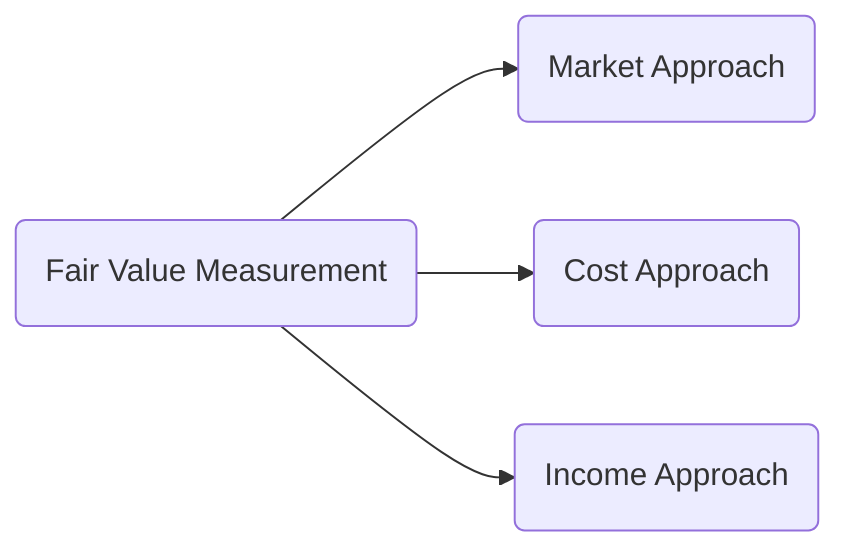
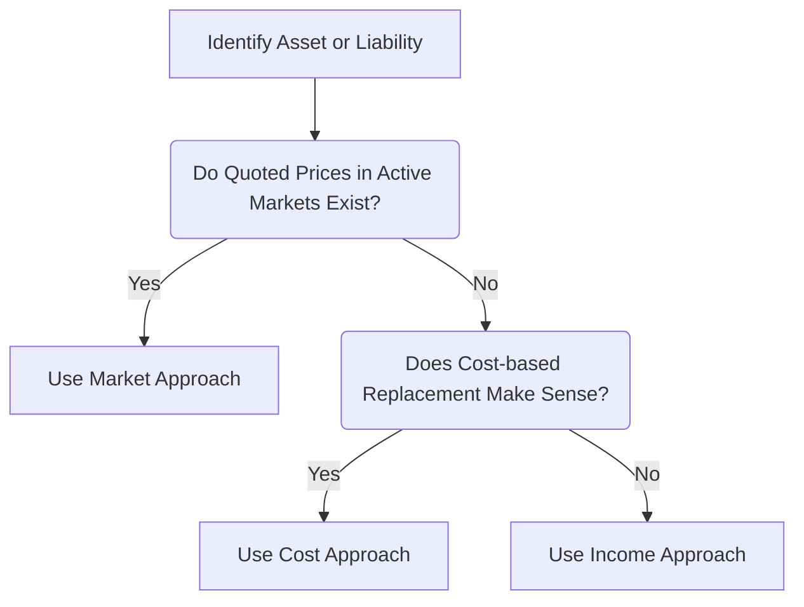

## 22.1 Definition of Fair Value, Valuation Approaches (Market, Cost, Income)

Fair value measurement forms a critical cornerstone of modern financial reporting. Accounting standards require companies—both public and private—to use fair value extensively across various transactions and reporting areas, including financial instruments, intangible assets, business combinations, lease transactions, and more. This section provides a comprehensive overview of the definition of fair value, the primary valuation approaches (Market, Cost, and Income), highest and best use considerations, and practical examples of observable versus unobservable inputs. Our goal is to equip you with the foundational knowledge essential for passing the CPA exam, as well as to deepen your understanding of how fair value principles apply in real-world financial reporting contexts. 

-------------------------------------------------------------------------------

### Understanding Fair Value

Under U.S. GAAP (specifically, ASC 820, Fair Value Measurement), fair value is defined as follows:

“Fair value is the price that would be received to sell an asset or paid to transfer a liability in an orderly transaction between market participants at the measurement date.”

Several key concepts flow from this definition:

• It is an exit price, not an entry price. That is, fair value is the amount a seller would receive in a current transaction if the asset or liability were sold or transferred at the measurement date.  
• The transaction is a hypothetical one, assumed to take place in the principal or most advantageous market.  
• The buyer and seller are assumed to be market participants who are independent, informed, and motivated but not forced to transact.  
• The measurement date is typically the financial statement reporting date, ensuring the fair value reflects the economic conditions on that date.  

Additionally, ASC 820 acknowledges the **highest and best use** concept for nonfinancial assets. This notion posits that, when evaluating the fair value of a nonfinancial asset (e.g., real estate or intangible property), you consider its highest and best use from a market-participant perspective—even if the entity does not currently deploy the asset in that manner. This ensures valuation remains objective, reflecting the perspective of a potential market participant who can optimize the asset’s utility.

-------------------------------------------------------------------------------

### Key Inputs: Observable vs. Unobservable

Fair value measurements often rely on inputs, and ASC 820 outlines a hierarchy for evaluating their objectivity and reliability:

• **Level 1 inputs** are quoted prices (unadjusted) in active markets for identical assets or liabilities that the entity can access at the measurement date. These are considered the most reliable.  
• **Level 2 inputs** are inputs other than quoted prices included in Level 1 that are observable for the asset or liability, either directly (e.g., quoted prices for similar assets in active markets) or indirectly (e.g., interest rate curves).  
• **Level 3 inputs** are unobservable inputs, which rely on the entity’s own assumptions about the assumptions that market participants would use when pricing the asset or liability. Examples include internal models or discount rates developed through historical trends and management judgment.

When valuing items under fair value measurement, practitioners prioritize observable inputs over unobservable ones to the greatest extent possible. However, certain transactions or specialized assets may only be measured using unobservable inputs, requiring considerable disclosure to maintain transparency.

-------------------------------------------------------------------------------

### Valuation Approaches: Market, Cost, and Income

ASC 820 stipulates three primary valuation approaches, which can be used alone or in varying combinations. Each approach has distinct methodologies, use cases, and input requirements.

#### Market Approach

**Definition and Overview**  
The **Market Approach** determines fair value by using prices and other relevant information generated by market transactions involving identical or comparable assets or liabilities. Essentially, if there is a ready market for the subject item—or a comparable item—this approach leverages those market dynamics and recent transaction data to arrive at a fair value.

• Useful when there are active markets or reliable price quotations for similar items.  
• Relies on observable Level 1 or Level 2 inputs to the extent possible.  
• Best suited for financial instruments (e.g., stocks trading on an exchange), as well as tangible assets where comparable sales data is readily available (e.g., real estate).  

**Key Example**  
Suppose a company holds equity shares of a publicly traded firm. The best evidence of fair value would be the quoted market price on an active securities exchange (i.e., a Level 1 input). In this scenario, the Market Approach is straightforward. If the shares last traded at $100 per share on the measurement date, their fair value generally is $100 per share times the number of shares held.

**Comparable Asset Transactions - Illustration**  
Imagine you’re valuing a piece of specialized equipment that does not trade on a recognized exchange but is similar to another item for which reliable price data exists. You might adjust the known transaction price of the comparable equipment for differences in age, condition, or functionality to arrive at an appropriate fair value.

**Benefits and Pitfalls**  
• **Benefit:** Often the most straightforward approach when reliable and current market data is available, reducing the degree of judgment required.  
• **Pitfall:** Inadequate or misleading comparables can compromise accuracy, particularly if significant adjustments are required. Proper due diligence in finding truly comparable transactions is crucial.

-------------------------------------------------------------------------------

#### Cost Approach

**Definition and Overview**  
The **Cost Approach** (also known as a replacement cost or reproduction cost approach) estimates the amount that would be required currently to replace the service capacity of an asset. This approach is often used for unique, specialized, or internally constructed assets where market transactions are not readily observable. The guiding principle is that a market participant would not pay more for an asset than it would cost to replace it in a similar condition and utility.

• Commonly used for valuing internally developed software, intangible assets with no active market, and specialized machinery.  
• Based on current replacement costs, factoring in depreciation or obsolescence.  

**Key Example**  
You have a custom machine that is critical to production, and the manufacturer has gone out of business. A new machine with the same functionality would cost $1 million to design and build. However, because your machine is five years old and half of its useful life has lapsed, you apply physical and functional obsolescence factors to arrive at a net replacement cost of, say, $450,000.

1. **Reproduction Cost:** The cost to construct an exact duplicate of the original asset with the same materials and design, adjusted for depreciation and obsolescence.  
2. **Replacement Cost:** The cost to acquire a substitute asset of comparable quality and utility. Replacement cost often integrates technological improvements that reduce obsolescence.  

**Factors in Cost Approach**  
• **Physical Deterioration:** Normal wear and tear that reduces the asset’s value.  
• **Functional Obsolescence:** Changes in technology or design that render older assets less valuable.  
• **Economic/External Obsolescence:** Negative external factors (e.g., regulatory changes or market shifts) that diminish an asset’s future economic benefit.  

**Benefits and Pitfalls**  
• **Benefit:** Provides a structured way to value unique assets that do not have active secondary markets.  
• **Pitfall:** Reliance on subjective measures of obsolescence can lead to variations in judgment and potential differences across companies or valuations.

-------------------------------------------------------------------------------

#### Income Approach

**Definition and Overview**  
The **Income Approach** values an asset or liability by converting the anticipated future amounts (e.g., cash flows or earnings) to a single present value. In other words, it projects the future economic benefits and discounts them back to their present worth at a rate reflecting both the time value of money and the risk profile associated with those cash flows. 

• Widely used for intangible assets, private company equity valuations, and certain liabilities lacking direct quoted market prices.  
• Relies heavily on estimated future earnings or cash flows, discount rates, growth assumptions, and other unobservable inputs.  

**Common Income Approach Methods**  
1. **Discounted Cash Flow (DCF):** Projects future cash flows over an estimated lifespan, then discounts them using a Weighted Average Cost of Capital (WACC) or another risk-appropriate discount rate.  
2. **Relief-from-Royalty Method:** Frequently applied to intangible assets such as trademarks or patents. The premise is to estimate what a market participant would pay in royalties if they did not own the asset, then discount those hypothetical royalty savings back to the present.  
3. **Multi-Period Excess Earnings Method (MPEEM):** Used primarily for intangible assets that are key value drivers (e.g., customer relationships, technology). It involves calculating the residual cash flows after deducting fair returns on contributory assets.  

**Key Example**  
A company wants to measure the fair value of an internally developed technology patent. The entity projects net cash flows of $500,000 per year for the next five years and then a terminal value. Using a 10% discount rate, the entity sums the present values of these cash flows. Suppose the result is approximately $1.86 million, which then represents the estimated fair value of the patent under the Income Approach.

**Benefits and Pitfalls**  
• **Benefit:** Provides a forward-looking measure that incorporates future economic potential.  
• **Pitfall:** Relies on numerous assumptions (e.g., discount rates, growth rates), which, if inaccurate, can significantly distort the fair value measurement.

-------------------------------------------------------------------------------

### Highest and Best Use Concept

The concept of **highest and best use** applies primarily to measuring **nonfinancial assets**. It requires the asset be valued from the perspective of a market participant, assuming the asset is deployed in its most advantageous (and legally permissible) manner. This ensures that valuations reflect the greatest economic utility. 

**Illustration**  
Consider an industrial warehouse located in a prime real estate district. If market participants believe the highest and best use is to convert it into a retail space or expand it into a multi-use development, the fair value might exceed the current use as a warehouse. The appraiser or management, in determining fair value, must consider how a typical market participant would value the asset under its most beneficial usage scenario.

**Regulatory and Practical Constraints**  
Although theoretically “highest and best use” can dramatically alter valuations, practical considerations impose constraints:  
• **Zoning laws** and regulations could prevent a change in asset use.  
• **Legal restrictions** or contract limitations may limit the property’s type of usage.  
• **Physical feasibility** must be considered. An asset that requires major structural changes to achieve the hypothetical “best use” might not truly be viable.  

-------------------------------------------------------------------------------

### Putting It All Together: An Integrated Example

Let’s take a simplified scenario to illustrate how an entity might decide among or combine valuation approaches:

1. **Scenario**: ABC Company is preparing its year-end financial statements and must measure the fair value of three items:  
   - (a) A block of publicly traded shares.  
   - (b) A custom-manufactured piece of equipment.  
   - (c) A customer relationship intangible asset acquired in a business combination.  

2. **Publicly Traded Shares** (Item a)  
   - Market Approach is the obvious choice. ABC references the most recent quoted market price in an active exchange.  

3. **Custom Equipment** (Item b)  
   - No active market or comparable market data. ABC uses the Cost Approach, estimating a reproduction or replacement cost, then adjusting for physical deterioration and technological obsolescence to arrive at fair value.  

4. **Customer Relationship Intangible** (Item c)  
   - Typically valued under an Income Approach, most often the Multi-Period Excess Earnings Method (MPEEM). ABC models projected future cash flows the customer relationships are expected to generate, applies a discount rate to reflect risk, and calculates current fair value.  

Each item uses a different approach, each aligns with the nature of the asset, and each results in a fair value measurement under ASC 820.  

-------------------------------------------------------------------------------

### Diagram: Overview of Fair Value Measurement

Below is a conceptual diagram showing how an entity might assess which valuation approach to use:

In some circumstances, a combination of methods may be used. Practitioners often reconcile results from the various approaches to arrive at a single final fair value.

-------------------------------------------------------------------------------

### Best Practices, Common Pitfalls, and Challenges

**Best Practices**  
• **Document Input Assumptions Thoroughly**: Whether using market-based, cost-based, or income-based techniques, maintain clear, well-supported documentation of key assumptions (e.g., discount rates, expected cash flows, comparables, or cost estimates).  
• **Regularly Calibrate Models**: If you’re using an income technique, ensure your discount rates, growth rates, and other projections align with historical performance and market data. Perform sensitivity analyses to understand the effect of changes in main assumptions.  
• **Seek Independent Validation**: For more complex fair value measurements, an external specialist or valuation expert can be invaluable in validating methodologies, assumptions, and calculations.  

**Common Pitfalls**  
• **Overreliance on Unobservable Inputs (Level 3)**: While some items genuinely require unobservable inputs, ensure you have exhausted all possibilities for observable or corroborative market-based data.  
• **Undervaluing or Overvaluing Obsolescence**: In the Cost Approach, incorrectly assessing depreciation or functional obsolescence can lead to misstated fair values.  
• **Poorly Supported Forecasts**: For the Income Approach, overly optimistic or pessimistic projections can undermine the reliability of fair value estimates.  

**Challenges**  
• **Market Volatility**: Changes in market conditions can rapidly alter fair values, especially for financial instruments.  
• **Complexity of Modeling**: Certain assets or liabilities (e.g., derivative instruments, multi-element intangible assets) demand complex valuation models that can be difficult to maintain accurately.  
• **Judgment and Estimates**: Fair value calculations often hinge on significant judgments, and different valuation professionals may reach different conclusions.  

-------------------------------------------------------------------------------

### Practical Guidance and Additional Observations

• **Fair Value vs. Historical Cost**: Where historical cost emphasizes original transaction amounts, fair value focuses on current market conditions. The shift to fair value can enhance timeliness and relevance of financial information but may also introduce volatility into financial statements.  
• **Highest and Best Use**: Keep in mind that the highest and best use concept applies primarily to nonfinancial assets. Financial liabilities, for instance, do not involve “use” in the same sense, so that concept is not relevant there.  
• **Interaction with Other Topics**: Fair value measurement intersects with many CPA exam areas, such as revenue recognition (when measuring non-cash consideration at fair value), leases (right-of-use asset measurement in certain cases), or intangible assets (business combinations). Mastering fair value concepts can simplify your study across these interconnected topics.  

-------------------------------------------------------------------------------

### References for Further Exploration

• **ASC 820, Fair Value Measurement**, Financial Accounting Standards Board (FASB) Codification.  
• **IFRS 13, Fair Value Measurement**, International Accounting Standards Board (IASB).  
• **FASB Conceptual Framework**, especially sections on relevance, reliability, and comparability.  
• Books and valuation guides by the American Institute of Certified Public Accountants (AICPA) on determining fair value.  
• Professional valuation societies and organizations, such as the American Society of Appraisers, Royal Institution of Chartered Surveyors, and CFA Institute, which offer detailed guidance on valuation approaches.  

-------------------------------------------------------------------------------

## Test Your Mastery of Fair Value Approaches: Comprehensive CPA Practice Quiz



### Fair value under ASC 820 is defined as:

- [x] The price that would be received to sell an asset or paid to transfer a liability in an orderly transaction between market participants at the measurement date.  
- [ ] The price an entity first paid for an asset, adjusted for accumulated depreciation and amortization.  
- [ ] The average historical sales price in completed transactions over the prior five years.  
- [ ] The cost to reproduce the asset free of any obsolescence adjustments.

> **Explanation:** ASC 820 defines fair value as an “exit price” reflecting what a seller would receive or a buyer would pay in an orderly transaction at the measurement date.

### Which of the following statements correctly illustrates the Market Approach?

- [x] Using recent comparable sales data of similar assets to determine a property’s fair value.  
- [ ] Discounting future cash flows from an intangible asset to a present value.  
- [ ] Calculating the approximate replacement cost of a custom-built machine.  
- [ ] Subtracting current liabilities from current assets to find the net realizable value.

> **Explanation:** The Market Approach emphasizes actual market data—including recent sale prices of comparable assets—to arrive at fair value.

### In measuring the fair value of nonfinancial assets, “highest and best use” means:

- [x] The valuation must consider how a typical market participant could maximize the asset’s utility within legal and physical constraints.  
- [ ] The valuation must always reflect the current use of the asset by the actual owner.  
- [ ] Only intangible assets require highest and best use considerations.  
- [ ] The concept is relevant only if the asset is solely financed by debt.

> **Explanation:** Highest and best use requires examining possible, permissible uses of the asset that would maximize its value to a market participant.

### Which of the following best describes the Cost Approach to fair value?

- [x] Valuing an asset by what it would cost to replace or reproduce it, minus adjustments for obsolescence.  
- [ ] Using quoted market prices for identical assets.  
- [ ] Modeling future cash flows and discounting them back to the present.  
- [ ] Calculating a historical cost basis plus inflation adjustments.

> **Explanation:** The Cost Approach hinges on determining how much a market participant would pay to replace the service capacity of the asset, considering depreciation or obsolescence.

### A primary pitfall when using the Income Approach for fair value measurement is:

- [x] Relying on overly optimistic revenue growth forecasts that distort the present value.  
- [ ] Failing to record prior-year obsolescence in the asset’s carrying value.  
- [x] Using historical cost data as the main source of value.  
- [ ] Always needing an active market for the asset or liability.

> **Explanation:** Overreliance on highly optimistic or subjective forecasts can skew fair value results. The Income Approach must be grounded in objective assumptions for accurate estimates.

### Which of the following scenarios suggests the Market Approach is most appropriate?

- [x] A company owns a large portfolio of common stock in multiple publicly traded entities with reliable price quotations.  
- [ ] A firm has a unique intangible asset for which no active market data exists.  
- [ ] An asset is old and specialized, requiring reproduction cost estimates.  
- [ ] Management believes that discounting projected future net cash inflows is the only reliable means of valuation.

> **Explanation:** The Market Approach is most suitable when an active trading market or reliable market data for comparable assets is readily available, such as for publicly traded stock.

### When measuring fair value, which approach relies most heavily on estimates of future revenues or cash flows?

- [x] Income Approach  
- [ ] Market Approach  
- [x] Cost Approach  
- [ ] Historical Cost Approach

> **Explanation:** The Income Approach converts future economic benefits (e.g., cash flows) into a present value. It looks forward and depends significantly on estimation and assumptions.

### Under ASC 820, what is the priority of inputs when measuring fair value?

- [x] Level 1 are most preferred, then Level 2, then Level 3 as a last resort.  
- [ ] Level 3 are always more reliable than Level 1.  
- [ ] Level 2 inputs include only adjusted historical cost data.  
- [ ] Only Level 1 inputs are recognized under GAAP.

> **Explanation:** ASC 820 prioritizes observable inputs (Level 1, then Level 2) over unobservable inputs (Level 3) to arrive at the most objective fair value measurement possible.

### A company owns a patent and chooses the Relief-from-Royalty Method. Which valuation approach does this fall under?

- [x] Income Approach  
- [ ] Market Approach  
- [ ] Cost Approach  
- [ ] Replacement Cost Approach

> **Explanation:** The Relief-from-Royalty Method estimates the future royalty streams that a market participant would avoid by owning the patent, then discounts them to the present—an Income Approach technique.

### For nonfinancial assets, fair value must consider the highest and best use from the perspective of:

- [x] A typical market participant who has the ability to maximize the asset’s utility.  
- [ ] The current owner’s usage, even if suboptimal.  
- [ ] The intangible asset’s legal advisor.  
- [ ] A purely hypothetical standpoint with no consideration of feasibility.

> **Explanation:** Fair value measurement for nonfinancial assets takes into account the highest and best use from the standpoint of reasonable market participants, not solely the entity’s present or intended use.



-------------------------------------------------------------------------------

## For Additional Practice and Deeper Preparation

[**FAR CPA Hardest Mock Exams: In-Depth & Clear Explanations**](https://www.udemy.com/course/far-cpa-mock-exams/?referralCode=F88050F8D5C76764F6BD)

Financial Accounting and Reporting (FAR) CPA Mocks: 6 Full (1,500 Qs), Harder Than Real! In-Depth & Clear. Crush With Confidence!

- Tackle full-length mock exams designed to mirror real FAR questions.  
- Refine your exam-day strategies with detailed, step-by-step solutions for every scenario.  
- Explore in-depth rationales that reinforce higher-level concepts, giving you an edge on test day.  
- Boost confidence and minimize anxiety by mastering every corner of the FAR blueprint.  
- Perfect for those seeking exceptionally hard mocks and real-world readiness.

_Disclaimer: This course is not endorsed by or affiliated with the AICPA, NASBA, or any official CPA Examination authority. All content is for educational and preparatory purposes only._
