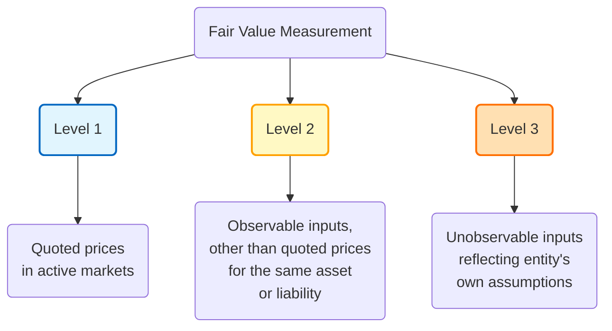

## 22.2 Fair Value Hierarchy (Levels 1, 2, 3)

Fair value measurement plays an essential role in providing consistent and reliable financial information under U.S. GAAP. Accounting Standards Codification (ASC) 820, Fair Value Measurement, introduces a hierarchical framework that prioritizes the inputs to valuation techniques used to measure fair value. The higher the reliability and observability of the inputs, the stronger the foundation for determining a financial asset’s or liability’s fair value. This hierarchy is classified into three levels—Level 1, Level 2, and Level 3—each reflecting different degrees of transparency and subjectivity in measurement.

This section provides a detailed discussion of the fair value hierarchy, highlighting how each level is defined, how to appropriately classify inputs into each category, and how to handle reclassifications when circumstances change. We will also delve into the typical disclosures required and best practices to ensure compliance with the standards. Whether you are new to fair value measurement or looking to refine your knowledge, these concepts serve as a cornerstone for accurate and transparent financial reporting.

---

### Overview of Fair Value and the Hierarchy

ASC 820 references an "exit price" notion in measuring fair value, focusing on the price that would be received to sell an asset or paid to transfer a liability in an orderly transaction between market participants at the measurement date. Under this approach, preparers must consider inputs from the markets, the condition of the asset or liability, and the nature of the principal (or most advantageous) market.

To achieve consistency and comparability, ASC 820 requires entities to classify their valuation inputs according to the following hierarchy:

• Level 1: Quoted prices in active markets for identical assets or liabilities.  
• Level 2: Inputs other than quoted prices included within Level 1 that are observable for the asset or liability, either directly or indirectly.  
• Level 3: Unobservable inputs for the asset or liability, often developed using an entity’s own assumptions.

Below is a conceptual Mermaid diagram illustrating the hierarchy, starting from the most reliable inputs at Level 1 down to the least observable inputs at Level 3.

This diagram shows fair value measurement branching into three levels, reflecting the degree of market observability of input data.

---

### Level 1 Inputs

#### Definition

Level 1 inputs are the most reliable inputs under the fair value hierarchy. They consist of quoted prices in active markets for identical assets or liabilities that the entity can access at the measurement date. “Access” implies that the entity can actually execute transactions in that market.

#### Key Characteristics

1. Active Market Indicators:  
   • High trading volume.  
   • Automatic trade executions.  
   • Minimal bid-ask spreads.

2. Identical Assets or Liabilities:  
   • The fair value measurement must be of precisely the same security or liability, not a similar one.

3. Unadjusted Quoted Prices:  
   • No adjustments for differences are necessary because the security is identical and the market is considered active.

#### Examples

• Equity securities listed on the New York Stock Exchange (NYSE) or NASDAQ with sufficient daily volume.  
• Actively traded government bonds with quoted prices updated in real time.  

#### Typical Disclosures

When classifying instruments in Level 1, entities often disclose:  
• The nature of the instruments (e.g., equity securities).  
• The valuation techniques used (though typically minimal explanation if quoted prices are readily available).  
• Any restrictions on the sale or transfer of these instruments, if applicable.

---

### Level 2 Inputs

#### Definition

Level 2 inputs include observable market data for the related asset or liability, but they do not rise to the level of priced quotes for identical items in active markets. Instead, they could be:  
1. Quoted prices for similar assets or liabilities in active markets.  
2. Quoted prices for identical or similar assets in markets that are not active.  
3. Other observable inputs, such as interest rates, yield curves, and implied volatilities, that can be corroborated by market data.

#### Key Characteristics

1. Less Active or Inactive Markets:  
   • Transactions occur, but perhaps not as frequently as required for Level 1 classification.  
   • May involve broker-dealer quotes that are indicative rather than actual transacted prices.

2. Adjustment to Pricing Data:  
   • Entities may make minor adjustments for differences between the instrument being measured and reference instruments.

3. Observable Inputs That Require Minimal Subjectivity:  
   • Interest rates and yield curves derived from publicly available sources.  
   • Spread data and credit-default swap (CDS) quotes from market participants.

#### Examples

• Corporate bonds traded in less active markets, where only infrequent quoted prices exist.  
• Derivatives valued using observable inputs such as LIBOR or SOFR-based yield curves, with minimal unobservable adjustments.  
• Real estate properties with objective market indexes, but not identically tracked daily.  

#### Typical Disclosures

In level 2 disclosures, companies typically highlight:  
• The nature of the valuation technique (e.g., discounted cash flow, matrix pricing).  
• All significant observable assumptions used (interest rates, credit spreads, etc.).  
• Any adjustments made to reflect differences between the reference instruments and the measured instrument.

---

### Level 3 Inputs

#### Definition

Level 3 inputs are the most subjective inputs, reflecting the preparer’s own assumptions about what market participants would consider in pricing the asset or liability—given that observable market data either does not exist or is extremely limited. These unobservable inputs are based on the best available information in the circumstances and often require the use of internal models and judgment.

#### Key Characteristics

1. Minimal or No Market Activity:  
   • The asset or liability is rarely or not at all traded on an exchange.  
   • Observable prices are absent or severely limited.

2. Entities' Own Assumptions:  
   • Valuations often stem from an internally developed method, such as a discounted cash flow analysis with unobservable assumptions about growth rates, discount rates, or default probabilities.

3. High Degree of Subjectivity and Estimation Uncertainty:  
   • Preparers must fully document and disclose how estimates were derived and which assumptions have the most significant effect on the fair value.

#### Examples

• Complex financial instruments such as certain unlisted private equity investments or structured products without an active secondary market.  
• Contingent consideration in a business combination (e.g., earnouts) that depend heavily on internal projections of a target’s future revenues or profitability.  
• Artwork or collectibles without active markets, requiring specialist valuations.

#### Typical Disclosures

Level 3 disclosures extend beyond quantitative data and often require:  
• Detailed descriptions of the valuation approach (e.g., discounted cash flow, market approach, or other specialized methods).  
• Significant unobservable inputs (e.g., discount rates, volatility, growth rates).  
• Sensitivity analyses showing how changes in unobservable inputs would affect fair value.  
• The rationale behind using particular assumptions, especially if they diverge from market consensus.  
• A roll-forward of Level 3 activity, including total gains or losses, purchases, sales, and transfers into or out of Level 3 classifications.

---

### Classification of Inputs vs. Classification of Assets

One common misunderstanding around fair value hierarchy is the difference between the classification of inputs and the classification of the entire asset or liability. The classification is determined by identifying the lowest level of input that is significant to the overall fair value measurement. Even if an asset’s valuation predominantly relies on Level 2 inputs, but a significant portion of the measurement hinges on a Level 3 assumption, the entire asset or liability must be categorized as Level 3.

---

### Reclassifications and Transfers Between Levels

#### Reasons for Reclassification

Changes in market conditions or the availability of observable data can cause an asset or liability to shift from one level to another. Examples include:  
• A market becomes more or less active (potentially moving from Level 1 to Level 2, or vice versa).  
• A previously available pricing source ceases to provide reliable quotes, prompting a move from Level 2 to Level 3.  
• Development of new, observable inputs that reduce the subjectivity of the measurement.

#### Best Practices in Handling Reclassifications

1. Establish a Formal Policy:  
   • Clearly define the timing and basis for any transfers among levels, which should be consistently applied from period to period.

2. Justify Any Moves:  
   • Document thorough reasons for each material reclassification. The rationale should be transparent and verifiable.

3. Disclose the Effects of Transfers:  
   • Provide a detailed discussion of transfers, both in and out of each level, and the impact on reported fair values (ASC 820 requires a roll-forward for Level 3 instruments).  
   • Users of financial statements must understand how changes in assumptions, markets, or data availability affect classification.

---

### Practical Examples

1. Quoted Stock Position (Level 1 → Level 2):  
   • A small-cap stock is actively traded and classified as Level 1. Suppose the market for the stock experiences severe liquidity issues due to sudden economic uncertainty. As trading volumes drop, quoted prices may no longer be reflective of actual trades. The company might classify the security as Level 2 if broker quotes are still available but are now indicative rather than directly transactable.

2. Private Equity Fund Investment (Level 2 → Level 3):  
   • An entity invests in a private equity fund that has historically provided quarterly net asset value (NAV) updates based on observable market data from underlying holdings. Over time, some of these holdings move out of public markets into private deals without frequent price updates, increasing reliance on unobservable internal models. Consequently, the investment might be reclassified to Level 3 once unobservable assumptions become significant.

3. Derivative with Structured Features (Level 3 → Level 2):  
   • A fixed-income derivative module once valued using extensive internal modeling might later find an active market for a similar derivative contract. This new data could convert a significant portion of the previously unobservable inputs into observable ones, prompting a reclassification from Level 3 to Level 2 if those observable factors now drive the derivative’s fair value determination.

---

### Disclosures in Detail

To promote transparency, ASC 820 requires robust disclosures. These disclosures help financial statement users to assess the reliability of fair value measurements and understand how such measurements might change over time.

Key Disclosure Areas:

• Valuation Methodologies: Describe each methodology (market approach, income approach, cost approach) and the reasons for applying it.  
• Key Inputs and Assumptions: Provide qualitative and quantitative information about significant inputs, including sensitivity analysis for Level 3.  
• Reconciliation of Level 3 Balances: Include the beginning and ending balances, purchases, sales, issuances, settlements, and unrealized gains/losses.  
• Policy for Transfers: Summarize the entity’s accounting policy regarding transfers in and out of each level, including the timing of recognizing transfers.  

---

### Common Pitfalls and Reminders

1. Underestimating Disclosure Requirements:  
   • Entities sometimes fail to disclose all the assumptions used for Level 3 measurements. Incomplete disclosures can lead to regulatory scrutiny or questions from stakeholders.

2. Over-Reliance on Broker Quotes:  
   • While broker quotes can be used as common evidence for Level 2 valuations, it is essential to evaluate whether these quotes are binding or just indicative. Reliance on “indicative only” quotes may sometimes push an asset to Level 3 unless additional market corroboration exists.

3. Insufficient Documentation for Transfers:  
   • Explanations for movement between levels often lack detail. Entities are expected to explain the when and why of reclassifications thoroughly.

4. Failure to Update Long-Standing Inputs:  
   • Over time, certain unobservable inputs may become observable if markets or data providers evolve. Entities should continuously monitor inputs to re-evaluate classification.

5. Incorrectly Grouping Instruments:  
   • A single security might be measured using multiple inputs. If any individually significant assumption is Level 3, the entire instrument is Level 3. Attempting to break out isolated parts incorrectly may lead to misclassification.

---

### Real-World Case Study

Company XYZ invests in a portfolio of financial instruments, including:

• Actively traded common stock (Level 1).  
• Corporate bonds with broker-quoted prices once every two weeks (Level 2).  
• A 15% stake in a private startup that is nearly impossible to value without internal projections of future cash flows (Level 3).

Over the year, the corporate bond issuer faced liquidity concerns, and references became scarce. In Q3, brokers provided only one quote per month, and its reliability was questioned. After internal consideration, Company XYZ concluded that significant assumptions about default probability were being used in the fair value calculation: a shift from limited Level 2 data to predominantly Level 3 assumptions. Therefore, a reclassification of the corporate bond from Level 2 to Level 3 was disclosed in Q3. Company XYZ’s disclosures detailed the basis of these reclassifications, the expanded internal credit analysis, and the sensitivity of bond valuation to changes in default risk assumptions.

This scenario underscores how fluidly and rapidly Level classifications can change with market conditions or shifts in data availability.

---

### Looking Ahead and Best Practices

• Monitor Market Conditions Continually: Market liquidity, trading volume, and the availability of pricing data can change, requiring re-evaluation of fair value hierarchy classification.  
• Refine Internal Models: For Level 3 measurements, robust internal models and documented assumptions are critical. Periodically review them for reasonableness.  
• Communicate Transparently: Provide stakeholders with in-depth disclosures. Clarify any uncertainties, especially those that can significantly alter fair value if market conditions evolve.  
• Ensure Cross-Functional Coordination: Fair value measurement often involves teams from accounting, risk management, treasury, and investment management. A coordinated approach helps maintain consistency and completeness.

---

### References for Further Exploration

• ASC 820, Fair Value Measurement (FASB Accounting Standards Codification)  
• IFRS 13, Fair Value Measurement (for international standards comparison)  
• “Fair Value Measurements: Practical Guidance and Implementation” by Mark L. Zyla  
• The CFA Institute’s resources on valuation techniques and best practices (www.cfainstitute.org)

---

## Assess Your Knowledge of the Fair Value Hierarchy



### Level 1 Inputs typically involve:
- [x] Quoted prices in active markets for identical assets or liabilities.
- [ ] Unobservable inputs that rely on an entity’s own assumptions.
- [ ] Broker quotes that are strictly indicative.
- [ ] Derived values using interest rate swap models.

> **Explanation:** Level 1 under ASC 820 refers to quoted prices in active markets for identical assets or liabilities. This is the most direct and least subjective measurement.

### Which of the following is not a characteristic of Level 2 inputs?
- [ ] Quoted prices for similar assets in active markets.
- [ ] Observable market data such as yield curves.
- [x] Significant reliance on unobservable inputs developed by the entity.
- [ ] Quoted prices for identical instruments in inactive markets.

> **Explanation:** Level 2 inputs center on observable market data and possibly minor adjustments. When the reliance on unobservable inputs is significant, it becomes Level 3.

### What typically triggers a transfer of an asset from Level 2 to Level 3?
- [x] Lack of observable quotations for the asset or liability and increased use of internal assumptions.
- [ ] The asset’s price becomes listed on a well-known exchange with high volume.
- [ ] The entity decides to use a new valuation technique despite available market data.
- [ ] The underlying bond issue changes from semiannual to annual coupon payments.

> **Explanation:** A transition from Level 2 to Level 3 occurs when observable data is no longer sufficient or reliable, leading the entity to rely heavily on unobservable inputs.

### For an investment in a private equity fund that uses internal models for valuation, it should generally be classified as:
- [ ] Level 1
- [ ] Level 2
- [x] Level 3
- [ ] Not required to be classified

> **Explanation:** Private equity fund valuations that rely heavily on internal models and unobservable assumptions are Level 3 fair value measurements.

### Which statement is most accurate regarding reclassifications within the fair value hierarchy?
- [x] Reclassifications must be disclosed, and the entity should provide reasons for the transfer.
- [ ] Transfers are not required to be reported if they occur at period-end.
- [x] Entities may establish a formal policy for when and how transfers occur.
- [ ] Transfers are prohibited once an asset is initially measured in Level 1.

> **Explanation:** ASC 820 requires disclosures and explanations for transfers between levels, typically in a roll-forward schedule for Level 3. Entities set policies that specify when transfers are recognized.

### The phrase “lowest level of input that is significant to the overall fair value measurement” implies:
- [x] The classification depends on the most significant unobservable input.
- [ ] Level 1 prices can be used if the majority of inputs are observable, regardless of significant unobservable inputs.
- [ ] The classification is always determined by the highest level of available data.
- [ ] The classification is based on the presence of at least one trivial unobservable input.

> **Explanation:** If a measurement includes both observable and unobservable inputs, but the unobservable input is significant, the overall measurement is classified as Level 3.

### Which of the following best illustrates a reclassification from Level 1 to Level 2?
- [x] A once-active stock trades infrequently, with limited daily quotes making it no longer considered an active market.
- [ ] A bond becomes traded frequently on a major exchange.
- [x] A derivative obtains a new set of data from market participants.
- [ ] An illiquid private equity holding obtains significant third-party validation.

> **Explanation:** Moving from Level 1 to Level 2 suggests that quoted prices are no longer considered active or reliable for identical assets, thus requiring additional market data or adjustments.

### If a company measures its real estate investments using a price index from comparable properties, with minor subjective adjustments for each property’s unique features, this typically falls under:
- [ ] Level 1  
- [x] Level 2  
- [ ] Level 3  
- [ ] Not applicable

> **Explanation:** Use of market-based observable data (price indexes, comparable property prices) with minor adjustments usually aligns with Level 2 classification.

### Which of the following is a significant disclosure requirement for Level 3 measurements?
- [x] A roll-forward of the Level 3 activity.
- [ ] A monthly price chart from a stock exchange.
- [ ] Broker quotes for the last five transactions.
- [ ] Form 8-K filing details regarding insider sales.

> **Explanation:** ASC 820 requires that entities provide a reconciliation (roll-forward) of the beginning to ending balance of Level 3 assets and liabilities, including total gains or losses, purchases, sales, and transfers.

### Fair value measurement under ASC 820 is primarily based on:
- [x] An exit price notion.
- [ ] An entry price notion.
- [ ] A historical cost approach.
- [ ] The entity’s unique cost-based valuations.

> **Explanation:** ASC 820 focuses on the exit price approach, meaning the price that would be received to sell an asset or transfer a liability in an orderly transaction between market participants at the measurement date.



---

## For Additional Practice and Deeper Preparation

**[FAR CPA Hardest Mock Exams: In-Depth & Clear Explanations](https://www.udemy.com/course/far-cpa-mock-exams/?referralCode=F88050F8D5C76764F6BD)**  

**Financial Accounting and Reporting (FAR) CPA Mocks:** 6 Full (1,500 Qs), Harder Than Real! In-Depth & Clear. Crush With Confidence!

- Tackle full-length mock exams designed to mirror real FAR questions.  
- Refine your exam-day strategies with detailed, step-by-step solutions for every scenario.  
- Explore in-depth rationales that reinforce higher-level concepts, giving you an edge on test day.  
- Boost confidence and minimize anxiety by mastering every corner of the FAR blueprint.  
- Perfect for those seeking exceptionally hard mocks and real-world readiness.  

_Disclaimer: This course is not endorsed by or affiliated with the AICPA, NASBA, or any official CPA Examination authority. All content is for educational and preparatory purposes only._
