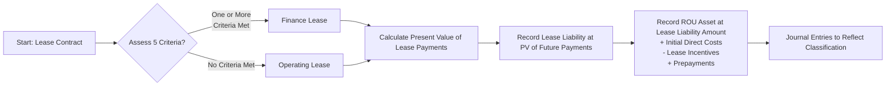

## 23.1 Lessee Accounting (Finance vs. Operating)

Properly accounting for leases from the lessee perspective is a critical skill for anyone preparing for the CPA Exam and for all finance professionals in practice. Under Accounting Standards Codification (ASC) 842, a lessee must classify each lease as either a finance lease or an operating lease. This classification dictates how expenses are recognized in the income statement over the life of the lease. Additionally, all leases with terms over 12 months generally require the lessee to record a right-of-use (ROU) asset and a corresponding lease liability on the balance sheet. This chapter explains the criteria used to classify leases, walks through initial and subsequent measurement of the ROU asset and lease liability, and provides illustrations to help students and professionals master this subject.

--------------------------------------------------------------------------------

Introduction to Lessee Accounting  
--------------------------------
When a lessee enters into a lease, they gain the right to use an identified asset. Prior to ASC 842, operating leases were off-balance-sheet obligations and finance (previously called “capital”) leases were shown on the balance sheet. Under ASC 842, the intention is to capture all lease-related obligations for leases longer than 12 months on the face of the balance sheet, ensuring that financial statements reflect the economics of lease transactions more accurately.

While the overarching requirement is to record both finance and operating leases on the balance sheet (except for certain short-term leases of 12 months or less, if the lessee elects the short-term lease exemption), the income statement treatment for each category varies. Therefore, determining the right classification (finance vs. operating) is essential for recognizing accurate lease-related expenses and for providing transparent disclosures.

--------------------------------------------------------------------------------

Key Classification Criteria for Finance vs. Operating Leases  
------------------------------------------------------------
ASC 842 provides five primary tests to decide if a lease qualifies as a finance lease from the lessee’s perspective. If a lease meets any one of these criteria, it must be classified as a finance lease. Otherwise, it is classified as an operating lease (unless subject to short-term lease exemptions or other specific scope exceptions). Here are the five criteria:

1. ► Transfer of Ownership  
   Does the lease transfer ownership of the underlying asset to the lessee by the end of the lease term?  
   • If yes, the lease is a finance lease.

2. ► Purchase Option  
   Does the lease grant the lessee an option to purchase the asset that the lessee is reasonably certain to exercise (often referred to as a “bargain purchase option”)?  
   • If yes, the lease is a finance lease.

3. ► Lease Term is a Major Part of the Asset's Economic Life  
   Is the lease term (including reasonably certain renewal periods) a major part of the underlying asset’s remaining economic life?  
   • Typically, “major part” can be interpreted as 75% or more. (While GAAP doesn’t mandate a specific numeric threshold, many companies use 75% as a guideline.)

4. ► Present Value of Lease Payments is Substantially All of the Fair Value  
   Does the present value (PV) of the lease payments, including any residual value guarantees, equal or exceed substantially all of the fair value of the underlying asset at lease commencement?  
   • Many practitioners use 90% as the guideline for “substantially all.”  
   • If yes, the lease is a finance lease.

5. ► Specialized Nature  
   Is the leased asset of such a specialized nature that it is not expected to have an alternative use to the lessor at the end of the lease term?  
   • If yes, the lease is a finance lease.

If none of these conditions are met, the lease is classified as an operating lease. Note that professional judgment sometimes is required for borderline cases, particularly with the lease term and present value thresholds.

--------------------------------------------------------------------------------

Initial Measurement of the Lease  
--------------------------------
Once a lessee determines the lease classification, the next step is to calculate the amounts reported on the balance sheet: the right-of-use (ROU) asset and the lease liability. Generally, the ROU asset and the lease liability are initially measured in the same amount at the lease commencement date. The two main components in the calculation are:

• Present value of future lease payments (using the discount rate)  
• Any initial direct costs incurred by the lessee (included in the ROU asset)

Under ASC 842, the lease liability is the present value of the future lease payments not yet paid, discounted at the rate the lessor charges the lessee (the “implicit rate”) if it is readily determinable. If not, the lessee’s incremental borrowing rate is used. The ROU asset is the lease liability, plus any initial direct costs incurred by the lessee, plus any prepayments made, and minus any lease incentives received before or at the commencement date.

--------------------------------------------------------------------------------

Right-of-Use (ROU) Asset and Lease Liability Recognition  
---------------------------------------------------------
The concept of the right-of-use asset is pivotal under ASC 842. Once recorded, it represents the lessee’s right to use the underlying asset throughout the lease term. Simultaneously, the lease liability reflects the obligation to make lease payments over the lease term. Together, these two amounts replace the previous concept of “capital lease asset and liability” under ASC 840 for finance leases, and “off-balance-sheet recognition” for operating leases (other than short-term leases).

Below is a generalized illustration of the relationship between classification and the steps to initially measure and record the lease:

--------------------------------------------------------------------------------

Subsequent Measurement: Finance Lease vs. Operating Lease  
---------------------------------------------------------
After initial recognition, lessees must account for the ROU asset and the lease liability differently depending on the lease classification.

Finance Lease  
-------------
• Income Statement Impact:  
  1. Interest Expense: Recognized on the lease liability using the effective interest rate method. The lease liability is reduced as payments are made.  
  2. Amortization Expense: The ROU asset is amortized, typically on a straight-line basis over the shorter of the asset’s useful life or the lease term.  

• Balance Sheet Impact:  
  1. Lease Liability: Carried at amortized cost (present value of remaining lease payments).  
  2. ROU Asset: Reduced by accumulated amortization (and any impairments).  

• Total Expense Pattern:  
  Over time, there is typically a front-loaded total expense pattern because of higher interest expense in the earlier periods and amortization that is generally recognized on a straight-line basis.  

Operating Lease  
---------------
• Income Statement Impact:  
  1. Single Lease Cost: Recognized typically on a straight-line basis, consisting of an interest component and an amortization component blended together.  
  2. This “single expense” is usually presented as lease expense within operating expenses, though classification can vary if the asset is used in cost of goods sold or other areas.  

• Balance Sheet Impact:  
  1. Lease Liability: Decreased by the portion of the lease payment allocated to the liability’s principal reduction (calculated using the effective interest method).  
  2. ROU Asset: Decreased generally by the difference between the straight-line lease expense recognized and the interest accrued on the lease liability.  

• Total Expense Pattern:  
  The same expense amount is recognized over each period, creating a straight-line expense profile.  

--------------------------------------------------------------------------------

Illustrative Example  
--------------------
Assume Company A leases equipment from Lessor B for five years with annual payments of \$10,000 due each December 31. The lessee’s incremental borrowing rate is 6%. The present value of the five payments is \$42,124 (rounded), and there are no initial direct costs or incentives. The fair value of the equipment is \$50,000, and its economic life is seven years.

Step 1: Classification Analysis  
• Does ownership transfer at the end of the lease? No.  
• Is there a purchase option that is reasonably certain to be exercised? No.  
• Is the lease term a major part of the economic life? 5 ÷ 7 ≈ 71%. Some entities interpret “major part” as 75%—this is borderline but does not strictly meet the 75% threshold.  
• Does the present value of payments represent substantially all of the fair value? \$42,124 ÷ \$50,000 ≈ 84%. This is below the 90% threshold used by most companies.  
• Is the asset specialized with no alternative use? No.  

Conclusion: This lease does not meet any one criterion, so it is classified as an operating lease.

Step 2: Initial Measurement of ROU Asset and Liability  
• Lease Liability: \$42,124  
• ROU Asset: \$42,124 (No initial direct costs or prepaid amounts)

Step 3: Subsequent Measurement – Operating Lease  
• Each year, Company A’s journal entries would reflect:  
  – One combined lease expense recognized on a straight-line basis over five years (annual expense of \$10,000 x 5 = \$50,000 total, \$10,000 per year).  
  – The lease liability is reduced using the effective interest method, while the difference is run through the ROU asset so that total lease expense is \$10,000 each period.

At the end of Year 1:  
• Cash Paid: \$10,000  
• Interest on Lease Liability = \$42,124 × 6% = \$2,527  
• Principal Reduction = \$10,000 – \$2,527 = \$7,473  

ROU Asset Amortization / Adjustments:  
• The total lease expense is \$10,000 for the period. Because the “interest” portion is \$2,527, the offset to ROU asset is \$7,473 to keep the total lease expense at \$10,000.  

--------------------------------------------------------------------------------

Common Pitfalls and Best Practices  
----------------------------------
1. Accurately Estimating the Discount Rate  
   Determining the proper rate for discounting future lease payments can be tricky. If the implicit rate is not readily determinable, the lessee’s incremental borrowing rate should be used. Updating or refining this estimate can have a material impact on the lease liability.

2. Properly Evaluating Renewal and Early Termination Options  
   Management must determine if it is “reasonably certain” that renewal or termination options will be exercised. This judgment impacts the lease term, thus influencing classification and measurement.

3. Handling Residual Value Guarantees  
   Some leases include residual value guarantees that alter the present value of the lease payments. These should be added to the total payments if they are probable of being owed by the lessee.

4. Assessing Specialized-Use Criteria  
   Determining whether an asset is specialized can be ambiguous. If there is a viable market for the asset, or if only minor modifications are required for alternative use, the specialized-use criterion is typically not met.

5. Recording Initial Direct Costs  
   Costs that are directly attributable to negotiating and arranging the lease (e.g., commissions) qualify as initial direct costs. General overhead or other indirect services should not be capitalized.

Best Practices  
• Keep thorough documentation of internal decision-making around each criterion, especially borderline classification situations.  
• Use standardized templates and checklists to evaluate each of the five classification criteria.  
• Integrate software solutions to store lease contracts and calculate necessary amounts to reduce the risk of manual error.  
• Periodically reassess lease assumptions, especially if there are significant changes in circumstances or new information.

--------------------------------------------------------------------------------

Case Study: Finance Lease Example  
---------------------------------
Imagine Company C leases specialized manufacturing machinery for four years with annual payments of \$30,000 due at the beginning of each year. The economic life of the asset is five years, and the present value of all payments is \$100,000, which equals approximately 95% of the machinery’s fair value of \$105,000. Because the present value of the lease payments is close to the entire fair value of the asset, the lease meets the “substantially all” threshold. Hence, it’s classified as a finance lease.

• Initial recognition at lease commencement:  
  – Lease Liability: \$100,000  
  – ROU Asset: \$100,000 (assuming no initial direct costs or prepayments)  

Over the term:  
• The machinery is amortized typically over four years (the lease term itself, since it does not transfer ownership).  
• Each payment reduces the lease liability, while an interest expense is recognized according to the effective interest method.  
• The total expense each period will include both interest expense and straight-line amortization of the ROU asset.

--------------------------------------------------------------------------------

Summary and Conclusion  
----------------------
Under ASC 842, lessees must identify and interpret five classification criteria to determine whether a lease will be treated as finance or operating. Both lease types require balance sheet presentation of the ROU asset and lease liability, but finance leases typically separate interest and amortization in the income statement. Operating leases combine these components into a single, straight-line expense over the lease term.  

Mastering these concepts is essential for passing the CPA Exam and for producing consistent, transparent financial statements in practice. By carefully evaluating lease terms, estimating discount rates, and considering all relevant factors, finance professionals can properly classify leases and accurately measure and report lease-related assets, liabilities, and expenses.

--------------------------------------------------------------------------------

References and Further Reading  
------------------------------
• FASB ASC 842: Leases (Available via the FASB Codification)  
• KPMG’s “Leases Handbook” – Detailed guidance and illustrative examples.  
• PwC’s “Lease Accounting Guide” – Comprehensive resource, covering common pitfalls.  
• EY’s “Financial Reporting Developments: Leases” – Thorough overview with focus on disclosures.  

--------------------------------------------------------------------------------

## Test Your Knowledge: Lessee Lease Classification & Measurement



### A lease that transfers ownership of the asset to the lessee by the end of the lease term should be classified as:
- [x] A finance lease
- [ ] An operating lease
- [ ] A short-term lease
- [ ] Neither finance nor operating

> **Explanation:** If title transfers during or at the end of the lease term, it meets a key finance lease criterion.

### Which of the following criteria does NOT automatically trigger a finance lease classification?
- [ ] The lease transfers ownership at the end of the term.
- [ ] The lease contains a purchase option reasonably certain to be exercised.
- [ ] The lease term is a major part of the asset’s remaining economic life.
- [x] The lessor has the option to terminate the lease with no penalty.

> **Explanation:** ASC 842 focuses on the criteria related to ownership transfer, purchase options, lease term, present value of payments, and specialized asset nature. A lessor’s option to terminate unilaterally with no penalty does not itself trigger finance lease classification for the lessee.

### In recognizing the lease liability at inception, a lessee should discount the future lease payments at:
- [ ] The federal funds rate
- [x] The rate implied in the lease (if determinable), otherwise the lessee’s incremental borrowing rate
- [ ] The Weighted-Average Cost of Capital (WACC)
- [ ] The prime rate

> **Explanation:** ASC 842 states that if the implicit rate is not readily determinable, the incremental borrowing rate is used.

### When using the operating lease model, the lessee typically recognizes:
- [ ] Significant front-loaded expenses
- [ ] Only an interest component in the income statement
- [x] A single straight-line lease expense over the lease term
- [ ] No expense if the lease term is over 12 months

> **Explanation:** Operating lease classification results in a single expense recognized generally on a straight-line basis.

### For a finance lease, the lessee’s income statement will show:
- [x] Both interest expense and amortization expense
- [ ] Only lease expense
- [x] Amortization of the ROU asset
- [ ] No expense in the early years

> **Explanation:** Finance lease accounting includes separate interest expense on the lease liability and amortization expense on the ROU asset.

### What typically happens to the lease liability over time for a finance lease?
- [x] It is reduced by the principal portion of each lease payment
- [ ] It remains constant
- [ ] It is increased by payments made
- [ ] It becomes part of the ROU asset

> **Explanation:** As the lessee makes payments, the principal portion reduces the lease liability. The interest portion is recognized as interest expense.

### Which of the following is a best practice in recording short-term leases?
- [x] Electing the short-term lease exemption policy and disclosing it
- [ ] Combining short-term and long-term leases
- [x] Carefully tracking lease renewal and termination options
- [ ] Capitalizing all amounts even if the lease is under 12 months

> **Explanation:** Lessees can adopt the short-term lease exemption policy to avoid balance sheet recognition for qualifying leases, but they must also monitor renewal and termination options closely to ensure the lease remains short-term.

### Under ASC 842, which item is included in a lessee’s initial measurement of the ROU asset?
- [x] Initial direct costs
- [ ] All overhead support costs
- [ ] Future maintenance fees not specified in the contract
- [ ] Security deposit that will be fully refunded

> **Explanation:** Initial direct costs typically are included in the measurement of the ROU asset. General overhead is not; future maintenance fees, if not part of the lease payments, typically are not included; a refundable security deposit is not included.

### A lease is classified as finance if:
- [x] Any one of the five criteria is met
- [ ] All five criteria are met
- [ ] It is a short-term lease
- [ ] None of the five criteria is met

> **Explanation:** A single criterion met is sufficient to classify a lease as finance.

### Lease classification often results in different income statement patterns because:
- [x] Finance leases separate interest and amortization, while operating leases present a single lease cost
- [ ] Both finance and operating leases require the same single expense
- [ ] Under finance leases, no expense is recognized
- [ ] Neither type of lease shows expenses until lease-end

> **Explanation:** Finance leases show two expenses (interest and amortization), while operating leases generally show a single, straight-line lease cost each period.



--------------------------------------------------------------------------------

## For Additional Practice and Deeper Preparation

**[FAR CPA Hardest Mock Exams: In-Depth & Clear Explanations](https://www.udemy.com/course/far-cpa-mock-exams/?referralCode=F88050F8D5C76764F6BD)**  

**Financial Accounting and Reporting (FAR) CPA Mocks:** 6 Full (1,500 Qs), Harder Than Real! In-Depth & Clear. Crush With Confidence!

- Tackle full-length mock exams designed to mirror real FAR questions.  
- Refine your exam-day strategies with detailed, step-by-step solutions for every scenario.  
- Explore in-depth rationales that reinforce higher-level concepts, giving you an edge on test day.  
- Boost confidence and minimize anxiety by mastering every corner of the FAR blueprint.  
- Perfect for those seeking exceptionally hard mocks and real-world readiness.

_Disclaimer: This course is not endorsed by or affiliated with the AICPA, NASBA, or any official CPA Examination authority. All content is for educational and preparatory purposes only._
