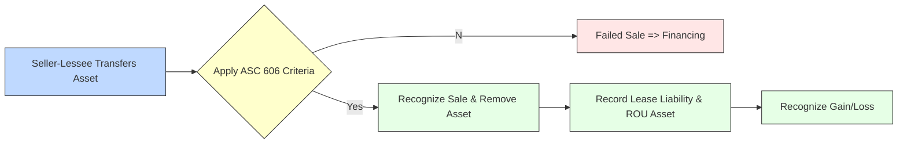

## 23.3 Sale-Leaseback Transactions

Sale-leaseback transactions involve a situation where one entity (the seller-lessee) sells an asset to another entity (the buyer-lessor) and, as part of the same arrangement, leases back that asset for continued use. Under U.S. GAAP (ASC 842) and IFRS (primarily IFRS 16), there are specific criteria and guidelines for determining whether a “sale” has in fact taken place, the timing and measurement of any recognized gains, and how to account for transactions that fail to meet the conditions of a sale. This section delves into these guidelines, providing practical insights, examples, and key considerations.

---

### Introduction and Context

From a practical point of view, sale-leaseback transactions can be motivated by several business considerations, such as:  
• Freeing up capital locked in long-lived assets.  
• Improving liquidity or cash flow, particularly if the entity is looking to fund new projects.  
• Favorable tax or balance sheet structuring (though these motivations depend on jurisdiction-specific rules).  

However, the accounting for sale-leaseback can be complex because of the interplay between revenue recognition, lease classification, and asset derecognition. ASC 842 (Leases) in the U.S. and IFRS 16 (Leases) internationally have modernized and aligned several aspects of lease accounting. Yet, differences remain, particularly in gauging when a transaction qualifies as a “sale” and how to measure and recognize gains or arrange financing when a sale is not established.

---

### Determining If a Sale Has Occurred

#### Core Requirements Under ASC 842 and ASC 606

Under U.S. GAAP, specifically ASC 842, an entity must look to ASC 606 (Revenue from Contracts with Customers) to determine if a sale has occurred. The core principle is whether the transfer of the asset meets all the criteria of a contract with a customer under the five-step model of ASC 606. This typically entails:  
1. A valid contract exists with enforceable rights and obligations.  
2. The entity has transferred control of the asset to the buyer.  
3. The transaction price is determinable, and there are no significant uncertainties around collectability.  
4. The rights to the asset do not revert back to the seller-lessee except under typical lease terms.  

If these criteria are met, the transaction can be treated as a sale. If not, the arrangement is accounted for as a financing (often referred to as a “failed sale-leaseback”).

#### Control and Legal Sale Indicators

“Control,” in a sale context, refers to the buyer’s ability to direct the use of the asset and obtain substantially all of its remaining benefits. In a sale-leaseback, the seller-lessee continues using the asset, leading to potential confusion about who really has “control.” The key is analyzing whether the buyer-lessor obtains:  
• The right to the cash flows from the asset.  
• The ability to possibly sell or transfer the asset to another party (subject to the lease terms).  
• The principal risks and rewards of ownership, subject to the constraints normally associated with leasing an asset back.

When an agreement includes repurchase options, guaranteed residual values, or other significant continuing involvement by the seller-lessee, it can impair the buyer-lessor’s control and lead to a conclusion that a sale did not occur.

---

### Timing and Measurement of Gains

#### Recognizing Gains on Sale-Leaseback

When a transaction is deemed a valid sale under ASC 842 and ASC 606, the seller-lessee should:  
1. Derecognize the asset from the balance sheet.  
2. Recognize a right-of-use (ROU) asset corresponding to the lease agreement.  
3. Record a lease liability for the obligation to make future lease payments.  
4. Recognize any gain or loss on the sale of the underlying asset based on the difference between the sale price (or measure of consideration) and the carrying amount of the asset.  

The gain or loss is typically recognized at the time of sale unless there are deferrals required. The portion of the gain or loss that relates to any “off-market” lease terms (e.g., lease payments well above or below market rates) must be deferred and recognized over the lease term. An “off-market” element might arise if the sales price is artificially inflated or the future lease payments are not set at arm’s length.  

#### Allocating Gains and Deferral

Under ASC 842, any adjustment to the sales price that is effectively a prepayment of the lease or a discount on future lease payments should be accounted for by adjusting the right-of-use asset or lease liability. The portion of a gain that relates to these adjustments is typically deferred and recognized over the lease term, ensuring that the total transaction reflects a market- or fair-value-based perspective.

#### IFRS Perspective on Gains

IFRS 16 prescribes a similar approach for sale-leaseback transactions where a sale occurs. The seller-lessee:  
• Measures and derecognizes the asset.  
• Recognizes lease liabilities and a right-of-use asset.  
• Recognizes gains (or losses) on the portion of the asset’s value that has been transferred to the buyer-lessor.  

However, IFRS 16 requires that only the “partial” gain be recognized immediately, specifically the gain attributable to the rights transferred to the buyer-lessor. Gains that relate to the portion of the asset retained through the right-of-use are not immediately recognized, thus IFRS 16 might require a proportional recognition of gain rather than the full amount at the sale date.

---

### Failed Sale and Financing Arrangement

A “failed sale” situation arises when the transaction does not meet the criteria for a sale, most commonly because:  
• The buyer-lessor does not obtain control of the asset under ASC 606.  
• There is a repurchase option that is deeply in-the-money or one that does not effectively transfer risks and rewards.  
• The lease terms are so restrictive that the buyer-lessor can’t meaningfully control the asset.  

When this happens, the asset remains on the seller-lessee’s balance sheet (no derecognition). The proceeds from the buyer-lessor are recorded as a financing liability. The seller-lessee continues to depreciate the asset over its useful life or over its remaining accounting life. Periodic payments to the buyer-lessor are split into principal and interest components, similar to a loan.  

This approach effectively means the seller-lessee has borrowed funds from the “would-be buyer” (the buyer-lessor), using the underlying asset as collateral (though under normal leasing contracts). There is no gain or loss recognized at inception, because no sale has effectively been recognized from an accounting standpoint.

---

### Mermaid Diagram: Sale-Leaseback Decision Tree

Below is a simplified diagram (in Mermaid.js format) that shows the high-level decision-making flow for a sale-leaseback transaction:

Explanation of Diagram:
1. The asset is transferred from the seller-lessee to the buyer-lessor.  
2. We test whether the ASC 606 (or IFRS 16/IFRS 15) sale criteria are met.  
3. If no sale is identified, it is a financing transaction; the asset remains on the seller’s books.  
4. If a sale is identified, the asset is derecognized.  
5. A new lease is recognized (ROU asset and lease liability).  
6. Any recognized gain or loss is recorded at the transaction date (adjusted for any off-market terms).

---

### Practical Examples and Case Studies

#### Example 1: Straightforward Sale and Leaseback

• Company ABC sells an office building at its fair value of $1,000,000.  
• The carrying value of the building is $700,000.  
• Company ABC immediately leases the building back at prevailing market rates for ten years.  

Step-by-step:  
1. Assess sale criteria: The arrangement transfers control (the buyer can mortgage, resell, or otherwise use the building subject only to normal lease constraints).  
2. Derecognize the building: Remove the $700,000 asset from ABC’s books.  
3. Recognize ROU asset and lease liability: Calculate the present value of future lease payments.  
4. Recognize a $300,000 gain (i.e., $1,000,000 – $700,000).  

If lease payments are at market rates, no portion of the gain is deferred. However, if lease payments were set well above market rates, part of the $300,000 might be deferred.

#### Example 2: “Failed Sale” with Repurchase Option

• Company XYZ sells specialized equipment to a financing company for $500,000.  
• The carrying value of the equipment is $520,000.  
• The arrangement includes a purchase option that is almost certain to be exercised by Company XYZ in four years at a nominal price.  

Analysis:  
1. Strong repurchase option: Because the repurchase price is nominal, control of the equipment never fully transfers to the buyer.  
2. Failed sale: Company XYZ does not derecognize the asset and continues to depreciate.  
3. Financing liability: The $500,000 proceeds received are recorded as a financing liability.  
4. Payments made to the buyer over time reduce the liability and include interest expense.  

No gain or loss is recognized initially.

---

### Key Considerations and Pitfalls

1. **Off-Market Lease Terms**: A common pitfall is forgetting to separate the portion of the gain or loss attributable to an off-market element of the lease, which must be deferred and recognized over the lease term.  
2. **Repurchase Options**: A deeply in-the-money or bargain repurchase option often precludes the recognition of a sale. Carefully evaluate the buyer’s control.  
3. **Lease Term and Residual Value Guarantees**: Extended lease terms or substantial residual value guarantees with large contingent payments can call into question who really has the “risks and rewards.”  
4. **Longer vs. Shorter Economic Life**: If the leaseback is for a significant portion of the asset’s remaining economic life, the buyer-lessor’s “ownership” benefits may be compromised, leading to a potential failed sale.  

---

### IFRS Versus U.S. GAAP

Though both ASC 842 and IFRS 16 have converged in many respects, some key differences remain:

• Under IFRS 16, the gain recognized by the seller-lessee is limited to only the portion of the excess of consideration received over the carrying value that relates to the buyer-lessor’s interest in the underlying asset. If the seller-lessee retains a portion of the asset’s economic rights, the gain is recognized on a partial basis.  
• Under U.S. GAAP, provided a sale is concluded under ASC 606, the entire gain is recognized at once—except for any portion related to off-market terms. There is no partial recognition approach specifically within ASC 842 if the sales price is at fair value.  
• IFRS provides more explicit guidance on partial recognition via IFRS 16, which can yield different gain or loss amounts compared to a similar transaction under ASC 842.

---

### Supporting Evidence and Cross-Reference

• In Chapter 20 on Revenue Recognition, we discuss the five-step model of ASC 606, which is crucial to determining whether a sale has occurred in a sale-leaseback transaction.  
• For guidance on fair value considerations and potential remeasurements, see Chapter 22 on Fair Value Measurement.  
• In real-world scenarios, consulting broader corporate governance publications and official pronouncements from the FASB (ASC 842) and the IASB (IFRS 16) is recommended for definitive interpretation.

---

### Comprehensive Example: End-to-End Scenario

Consider an advanced scenario:

1. Company MNO sells a manufacturing plant to Investor P for $2 million. The plant’s carrying amount is $1.25 million.  
2. Company MNO immediately leases the plant back for 15 years. The plant’s total remaining useful life is 20 years.  
3. The present value of lease payments is $1.5 million, which management determines is at market rates.  
4. An independent appraisal confirms the $2 million sales price is near fair value.  

Step-by-step:  
• Since the lease term is less than the plant’s entire remaining contemplated life, the buyer-lessor appears to gain control for that remaining portion. The arrangement does not include bargain repurchase options or guaranteed residuals that revert most risks back to the seller. Therefore, it likely qualifies as a sale, and the asset is derecognized.  
• Company MNO recognizes a gain of $750,000 ($2 million – $1.25 million) at the sale date, as lease payments are at market rates and there is no “off-market” component to defer.  
• Company MNO records a right-of-use asset of $1.5 million (the present value of lease payments) and a lease liability for the same amount.  
• Over the lease term, the ROU asset is amortized, and the lease liability is reduced as payments are made.

If the sale price had been inflated and the lease cost set well above market, a portion of that $750,000 gain would be deferred. Conversely, if the sale price is below fair value but lease payments are below market, part of the lease liability might be reduced accordingly, and the net effect might push more gain recognition upfront or over time, depending on the details.

---

### Best Practices to Ensure Compliance

• **Document Fair Value**: Always use independent appraisals or robust internal valuation models to justify the sale price.  
• **Evaluate Control Indicators**: Thoroughly assess whether the buyer obtains the ability to direct the use of, and obtain substantially all the remaining benefits from, the asset.  
• **Understand Local Regulatory Nuances**: Different jurisdictions might have tax or legal frameworks that affect how you structure the transaction or measure “control.”  
• **Watch for Embedded Options**: Pay special attention if the arrangement includes buy-back or renewal options that could undermine actual asset transfer.  
• **Stay Updated**: Sale-leaseback rules evolve with updated pronouncements and clarifications from standard-setters (e.g., FASB, IASB).  

---

### Conclusion

Sale-leaseback transactions can provide significant liquidity and balance sheet management benefits, but they require careful accounting treatment. It is critical first to assess whether a sale has taken place under ASC 606 or IFRS 15, then structure the transaction so that both parties’ rights and obligations are clear. Light must also be shed on how to recognize and possibly defer gains. When the transaction fails the sale criteria, it defaults to a financing arrangement that keeps the asset on the seller-lessee’s balance sheet and a corresponding liability is recognized.

A thorough understanding of these concepts, as well as reference to the relevant chapters on revenue recognition, leases, and fair value measurement, ensures that CPA candidates and practitioners alike can navigate complex sale-leaseback scenarios with confidence.

---

## Test Your Knowledge of Sale-Leaseback Transactions



### A key condition for determining if a sale has occurred under ASC 842 for a sale-leaseback is:
- [ ] The existence of a bargain purchase option.
- [x] Transfer of control in accordance with ASC 606 criteria.
- [ ] The seller-lessee continuing to manage the asset after the transfer date.
- [ ] The sales price exceeding the asset’s carrying amount.

> **Explanation:** Under ASC 842, an entity must look to ASC 606 (Revenue from Contracts with Customers) to confirm that control of the asset has transferred to the buyer. If control does not transfer, it is a financing arrangement rather than a sale.

### When a sale-leaseback transaction qualifies as a sale, which of the following statements is TRUE regarding the recognition of gains under ASC 842?
- [ ] All gains must be recognized instantly in all cases.
- [x] Gains are recognized immediately unless portions need to be deferred due to off-market lease terms.
- [ ] No gain is ever recognized.
- [ ] Gains are recognized only at the end of the lease term.

> **Explanation:** ASC 842 generally allows immediate recognition of gains as long as the sale is valid and the lease is at market terms. Any gains linked to “off-market” lease elements are deferred and recognized over the lease term.

### Under IFRS 16, which statement best describes how gains are recognized in a sale-leaseback transaction?
- [x] Only the portion of the gain related to the rights transferred to the buyer-lessor is recognized immediately.
- [ ] The full amount of any gain is recognized at the time of sale.
- [ ] Gains are always deferred in their entirety.
- [ ] Gains are recognized only if the lease is classified as finance.

> **Explanation:** IFRS 16 requires measuring the retained interest in the asset by the seller-lessee and recognizing gains or losses only for the portion of the asset transferred to the buyer-lessor.

### If a sale-leaseback transaction fails to qualify as a sale under ASC 606, the result is:
- [ ] The seller should record a capital lease.
- [ ] The asset is removed from the seller’s books but replaced with an intangible asset.
- [ ] A partial gain is recognized, and amortized over the lease term.
- [x] A financing arrangement is recognized, and the asset remains on the seller’s balance sheet.

> **Explanation:** Failing the sale criteria means no asset derecognition occurs. The funds received are recorded as a financing liability, with continued depreciation of the asset on the seller’s balance sheet.

### What is the primary reason an out-of-the-money repurchase option held by the seller-lessee might still prevent sale recognition?
- [ ] The buyer might refuse to resell the asset.
- [x] The buyer-lessor does not obtain sufficient control if the seller can readily claim the asset.
- [ ] There is no reason; an out-of-the-money repurchase option has no effect on sale recognition.
- [ ] It accelerates tax depreciation schedules for the buyer.

> **Explanation:** A repurchase option can undermine the buyer’s control, meaning the buyer does not fully obtain the risks and rewards of owning the asset. Even if the option is out-of-the-money now, continued availability of that option potentially restricts the buyer’s control.

### When the sales price in a sale-leaseback arrangement is above market value and the lease payments are also above market rates, how is the difference typically handled?
- [ ] The entire difference is recognized as a gain at inception.
- [ ] The entire difference is recognized as an immediate loss at inception.
- [ ] It is recorded as negative goodwill.
- [x] The difference is deferred and recognized over the lease term.

> **Explanation:** Any “off-market” component, whether it inflates the proceeds or inflates the lease payments, must be appropriately deferred and recognized over time to reflect an arms-length perspective.

### Suppose an entity has a sale-leaseback of land and building at fair value. Under ASC 842, which of the following steps is part of the accounting?
- [x] Derecognize the land and building, record any realized gain, and capitalize a right-of-use asset.
- [ ] Retain the land and building on the seller’s balance sheet but recognize a lease liability.
- [ ] Classify the entire transaction as an operating lease with no gain recognized.
- [ ] Capitalize a right-of-use asset only for the building portion, leaving the land unaffected.

> **Explanation:** If a valid sale is determined, the seller-lessee derecognizes the land and building, recognizes a gain or loss, and sets up a right-of-use asset and lease liability.

### If lease payments are artificially low compared to market rates, which accounting treatment is most likely required?
- [x] A portion of any gain on sale might be deferred.
- [ ] The buyer must disclose a joint venture arrangement.
- [ ] The seller-lessee can accelerate depreciation of the asset prior to selling.
- [ ] No special accounting treatment is required.

> **Explanation:** If lease payments are artificially low, it implies part of the sale proceeds is effectively a prepayment of rent. That portion of any gain typically must be deferred and recognized over the lease term.

### In a sale-leaseback arrangement under U.S. GAAP, which factor would most strongly indicate a transaction is a failed sale?
- [x] The presence of a forward repurchase agreement at a set price.
- [ ] The seller-lessee continuing to occupy the property after the sale.
- [ ] The purchase price exceeding the fair value of the asset.
- [ ] A contract that meets all the ASC 606 steps.

> **Explanation:** A forward repurchase agreement suggests the asset will revert to the seller. Thus, the buyer is merely providing financing rather than truly owning the asset.

### Under a failed sale-leaseback arrangement, the asset:
- [x] Remains on the seller-lessee’s balance sheet and a financing liability is recognized.
- [ ] Is transferred to the buyer-lessor at the time of the agreement.
- [ ] Is partially derecognized to the extent of the cash proceeds.
- [ ] Decreases in value to match the lease liability.

> **Explanation:** The defining feature of a failed sale is that no derecognition of the asset occurs. The seller-lessee recognizes a financing liability for the proceeds received.



---

## For Additional Practice and Deeper Preparation

**[FAR CPA Hardest Mock Exams: In-Depth & Clear Explanations](https://www.udemy.com/course/far-cpa-mock-exams/?referralCode=F88050F8D5C76764F6BD)**

Financial Accounting and Reporting (FAR) CPA Mocks: 6 Full (1,500 Qs), Harder Than Real! In-Depth & Clear. Crush With Confidence!

- Tackle full-length mock exams designed to mirror real FAR questions.  
- Refine your exam-day strategies with detailed, step-by-step solutions for every scenario.  
- Explore in-depth rationales that reinforce higher-level concepts, giving you an edge on test day.  
- Boost confidence and minimize anxiety by mastering every corner of the FAR blueprint.  
- Perfect for those seeking exceptionally hard mocks and real-world readiness.

_Disclaimer: This course is not endorsed by or affiliated with the AICPA, NASBA, or any official CPA Examination authority. All content is for educational and preparatory purposes only._
