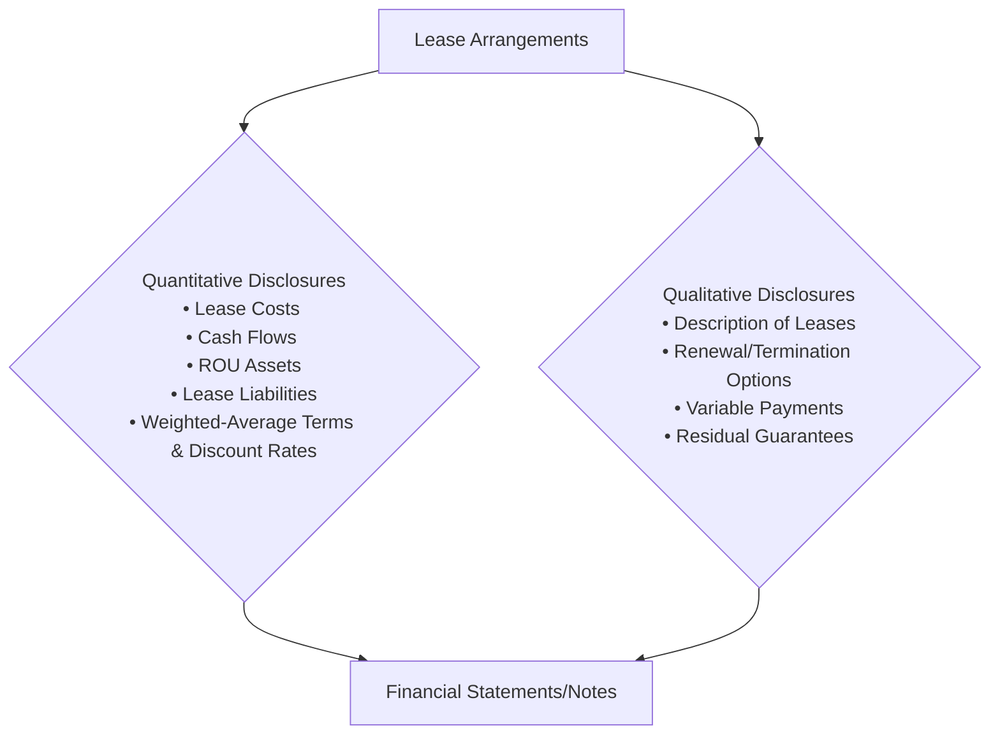
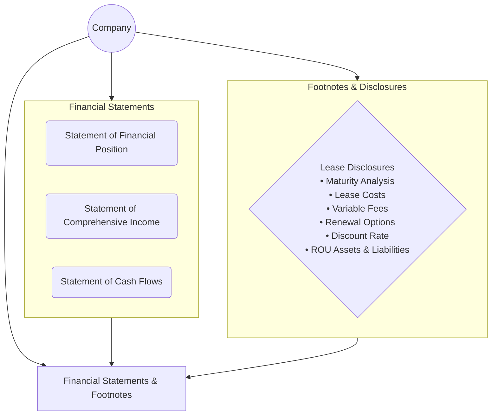

## 23.4 Lease Disclosures

Lease disclosures provide critical information that enables financial statement users—including investors, creditors, and regulators—to understand the nature, timing, and amount of a company’s lease-related obligations and rights. Proper enumeration and clarity of these disclosures reduce informational asymmetry and allow stakeholders to make well-informed decisions. This section offers a detailed overview of the required quantitative and qualitative disclosures for different types of leases under U.S. GAAP (ASC 842) and, in some cases, references IFRS 16 for comparative purposes. It emphasizes the importance of clarity in describing discount rates used, variable lease payments, maturity analyses, renewal or termination options, and the overall financial impact of leasing activities.

Effective lease disclosures address both the lessee’s and the lessor’s perspectives, ensuring that the material terms and conditions of the lease arrangements are appropriately documented. By delving into key requirements, examples, best practices, and common pitfalls, this chapter aims to equip exam candidates and practitioners with a thorough understanding of how to comply with the standards and provide high-quality, decision-useful disclosures.

---

Introduction to Lease Disclosures  
A robust set of lease disclosures helps elucidate:

• The nature of lease activities—key lease terms, significant lease provisions, and whether the arrangement is classified as an operating or finance (for lessees) or a sales-type, direct financing, or operating lease (for lessors).  
• The key assumptions—such as the discount rate and useful life of leased assets—that drive the measurement of right-of-use (ROU) assets and lease liabilities.  
• The nature of any variable lease payments or amounts tied to performance or usage.  
• The future cash flows and timing related to lease liabilities or lease receivables.  
• The qualitative context to interpret the quantitative data—for instance, the reasons behind renewal or termination options, residual value guarantees, and potential changes in lease terms.

The combination of qualitative and quantitative disclosures offers a complete picture that ensures transparency in financial reporting and helps financial statement users understand the potential risks associated with leasing arrangements.

---

Fundamental Disclosure Requirements under ASC 842  

Lessee Disclosures  
Lessees are required to present right-of-use assets and lease liabilities, typically separated on the statement of financial position or disclosed in the notes. However, disclosures go beyond mere balance sheet amounts. The following are typical categories of disclosure items for lessees:

• Nature of Leases and Objectives: This discussion covers what assets the entity leases and for what purpose. For instance, an airline may highlight that it leases aircraft under operating leases primarily to maintain fleet flexibility and reduce upfront capital expenditures.

• Quantitative Information:  
  – Lease Cost The total lease cost during the period is often broken down into:  
    1) Operating lease cost.  
    2) Finance lease cost, which includes amortization of the right-of-use assets and interest on the lease liabilities.  
    3) Short-term lease cost, if the lessee elects to expense leases with a term of 12 months or fewer.  
    4) Variable lease cost, separate from the fixed lease payments.  

  – Cash Flow Information The amount of cash paid for amounts included in lease liabilities, separated into operating and financing activities, is disclosed. For example, principal portions of finance lease payments appear in financing activities, whereas interest portions of finance lease payments and the entirety of operating lease payments typically appear in operating activities.

  – Right-of-Use Asset and Lease Liability Reconciliations Entities must reconcile the opening and closing balances of ROU assets and lease liabilities, providing insight into new leases, modifications, payments, interest accrual, or remeasurements.

  – Weighted-Average Lease Term and Discount Rate ASC 842 requires disclosing the weighted-average remaining lease term and the weighted-average discount rate for both finance and operating leases. This helps stakeholders assess how quickly lease liabilities will be resolved and the resulting interest expense.  

• Maturity Analysis of Lease Liabilities:  
  A breakdown of the undiscounted lease payments, aggregated by periods (e.g., maximum five years plus a total for the remaining periods) is presented, along with a reconciliation to the present value of lease payments. This maturity profile allows creditors and investors to understand when lease liabilities become due.

• Qualitative Information:  
  – Options and Contingencies Entities provide descriptions of renewal, termination, and purchase options, including the periods in which the options are exercisable and whether they are reasonably certain to be exercised.  
  – Residual Value Guarantees Disclosure of the nature of these guarantees, timing, and amounts is crucial because it affects the measurement of lease liabilities and potential obligations.  
  – Variable Lease Payments ASC 842 mandates that companies disclose information about variable lease payments that depend on a rate or index (e.g., CPI), usage-driven metrics (e.g., number of hours an aircraft is in use), or performance-based metrics.  

Below is a simplified mermaid diagram illustrating key elements of lease disclosures from a lessee perspective:

Lessee Example  
Imagine a technology company (“TechCo”) that leases office space under a 10-year noncancelable operating lease with an option to extend for an additional 5 years. The company concludes it is reasonably certain it will not exercise the option. TechCo determines that the discount rate for the lease is 5% and that it has variable lease payments tied to the Consumer Price Index (CPI) that adjust annually. In its disclosures, TechCo would:

• Describe the leased property (office space) and the noncancelable term (10 years).  
• Provide the lease liability maturity schedule, showing the undiscounted payments over the 10-year term, discounted at 5%.  
• Disclose the portion of its lease cost attributable to variable payments and how those payments were determined (i.e., linked to the changes in CPI).  
• Note that although a 5-year extension option exists, TechCo does not consider it reasonably certain to exercise, so it is excluded from the lease term.  

This level of detail gives financial statement users the ability to see how the payments are structured, the basis of factoring in or excluding the extension option, and its effect on the size of the ROU asset and lease liability.

---

Lessor Disclosures  
Lessors must also comply with specific disclosure requirements to ensure that financial statement users understand the nature and risks of a company’s leasing activities. Under ASC 842, lessors classify leases as operating, sales-type, or direct financing, each with unique disclosure requirements. A summary of these requirements:

• Nature of the Leasing Arrangements:  
  – Type of assets leased.  
  – Terms and significant provisions affecting the timing and amount of future cash flows (e.g., purchase options, renewal or termination provisions).  

• Income Statement Impacts:  
  – Revenue recognized from lease contracts, separated by lease type (operating lease revenue vs. interest income on direct financing or sales-type leases).  
  – Any profit or loss recognized at the commencement date of a sales-type lease.  

• Balances and Maturity Analysis:  
  – Lease Receivables Lessors in sales-type or direct financing leases measure net investment in the lease. They must disclose a maturity analysis of future lease payments and reconcile the total of those payments to the net investment in the lease.  
  – Residual Value Accrual Lessors typically disclose the carrying amount of residual assets, including significant assumptions used to determine expected residual values.  

• Risk Management:  
  – Collectibility Risk For example, if the lessor expects an increased default rate for certain lessees, it should be clearly disclosed.  
  – Variable Lease Payments Information about variable or contingent payments helps users understand potential changes in income.  

Lessor Example  
A car rental company (“Rent-a-Car”) classifies all vehicle rental arrangements as operating leases since it retains significant risks and rewards of ownership. The firm discloses:

• A general description of its rental fleet and typical lease durations (e.g., daily or weekly).  
• The total operating lease revenue recognized each period.  
• Risks associated with potential damages or mileage overages that may lead to additional or reduced revenue (variable components).  
• The nature of any renewal options, if relevant.

Alternatively, if Rent-a-Car provided vehicles under a longer-term direct financing arrangement where the major part of the risks and rewards of ownership are transferred, it would then disclose the net investment in the lease, the unearned income portion, and any residual value guaranteed or unguaranteed.

---

Discount Rate Disclosures  
The discount rate is crucial in measuring the present value of future lease payments. Under ASC 842, lessees generally use the rate implicit in the lease if readily determinable; otherwise, they use their incremental borrowing rate. IFRS 16 provides a similar stance but also allows the use of the lessee’s incremental borrowing rate if the rate implicit in the lease cannot be readily determined. In practice, the incremental borrowing rate is used frequently because the rate implicit in the lease can be challenging to ascertain.

Many entities choose to disclose:  
• The methodologies or assumptions used in determining the discount rate.  
• The weighted-average discount rate for both operating and finance leases (for lessees).  
• Sensitivity analyses if the discount rate fluctuates, especially for variable interest rate leases (these are not always mandated, but some entities choose to provide them voluntarily).

Having clarity around the discount rate fosters transparency and comparability, helping users interpret the magnitude of recorded lease assets and liabilities and assess whether the company’s approach is conservative or aggressive.

---

Variable Lease Payments  
Variable lease payments contribute to the complexity of lease accounting since they adjust based on performance, usage, or external benchmarks. From a disclosure standpoint, companies highlight:

• The nature of the variable lease payments, including how they are determined (e.g., usage or an index/rate such as the CPI).  
• The effect of variable lease payments on the financial statements, particularly how these amounts were recognized in profit or loss.  
• Any significant judgments made in estimating variable components, if such judgments significantly affect the measurement of the lease liability or ROU asset.

The goal is for users to see how sensitive lease expense or revenue might be to changes in performance metrics, external factors, or usage volumes over time.

---

Maturity Analyses  
A cornerstone of lease disclosures is the presentation of future commitments or receipts. Typically, companies show:

• Payments in relevant future periods (e.g., the first year, years two through five, and after five years).  
• Total undiscounted lease payments and a reconciliation to the lease liability or lease receivable.  

A sample maturity table for a lessee with operating leases might be presented as follows:

| Period                | Undiscounted Lease Payments | Present Value of Payments |
|-----------------------|-----------------------------|---------------------------|
| Year 1               | $50,000                     | $46,000                   |
| Year 2               | $50,000                     | $43,800                   |
| Year 3               | $60,000                     | $49,900                   |
| Year 4               | $60,000                     | $47,500                   |
| Year 5               | $60,000                     | $45,300                   |
| Thereafter (Year 6+) | $180,000                    | $120,000                  |
| TOTAL                | $460,000                    | $352,500                  |

> Note: This table is a simplified illustration. Actual disclosures may include subtotals for operating leases, finance leases, and a total lease liability line, as well as footnotes describing significant assumptions.

---

Practical Considerations and Best Practices  

1) Clarity in Presentation  
It is advisable to group lease payments and show reconciliations in a table or chart format, ensuring ease of interpretation. Clear subheadings—such as “Operating Lease Liabilities” and “Finance Lease Liabilities”—enable users to distinguish between different lease types.

2) Consistency in Terminology  
Using consistent language helps avoid confusion. Within the notes, the accountant might define “ROU asset,” “finance lease liability,” “variable lease expense,” and other key terms in a glossary or “Key Terms” subsection at the start of the note.  

3) Granularity and Materiality  
Entities should tailor the level of detail to match the company’s lease portfolio. A business with many small rental agreements for office equipment may aggregate them by class of underlying asset, while a manufacturing entity with a few large plant leases may provide more precise, lease-by-lease disclosures.  

4) Judgments and Estimates  
Because lease accounting relies on certain management estimates (e.g., discount rates, renewal assumptions, variable payment calculations), disclosing the basis and factors considered is invaluable. Any changes in these estimates can shift liabilities or assets significantly.  

5) Use of Technology for Data Gathering  
To streamline reporting, companies often employ lease management software that tracks key terms, variable payments, options, renewal periods, and other details. Usage of such software can significantly improve accuracy and help generate the tabular disclosures needed for compliance.

---

Common Pitfalls  

• Omission of Key Qualitative Aspects: Merely providing numbers without context on renewal options, variable leases, or residual value guarantees can mislead users about the true nature of leasing obligations.  

• Aggregating Disclosures Too Broadly: Over-aggregation may obscure significant differences between operating and finance leases or between long-term real estate leases and shorter equipment leases.  

• Inconsistent Discount Rates or Classifications: Inadequate justification for incremental borrowing rates, or switching discount rates mid-term without a thorough explanation, can lead to confusion and possible restatement.  

• Failure to Reflect Modifications Properly: Lease modifications that change lease term or payment structure require remeasurement of the lease liability and ROU asset (for lessees) or net investment in the lease (for lessors). Some entities miss remeasuring or disclosing the effect of modifications.  

• Not Distinguishing Variable Payments Properly: A lack of clarity on the distinction between variable lease payments included in the initial measurement and those recognized as period costs (e.g., usage-based amounts) can misrepresent total lease expense.

---

IFRS 16 vs. ASC 842: Disclosure Differences  

Both IFRS 16 and ASC 842 have converged significantly in principle, but certain nuances remain for disclosures:

• IFRS 16 focuses more on a single lease model for lessees, requiring a direct reference that all leases (except a limited scope of short-term and low-value exceptions) reflect ROU assets and corresponding lease liabilities.  
• Under IFRS 16, lessors continue to classify leases as operating or finance. Disclosure requirements largely mirror U.S. GAAP, though wording and format may vary.  
• IFRS typically requires more explicit disclosures around how the lease portfolio is managed and the potential exposure to future cash outflows not reflected in the measurement of lease liabilities (e.g., variable lease payments, extension options, residual value guarantees).  

Because of these small but notable differences, multinational companies often prepare a reconciliation in their disclosures or use consistent subheadings across IFRS and GAAP anchors for clarity.

---

Real-World Scenario  
Consider a global retail chain that leases hundreds of stores under varied terms, including fixed rent, variable rent based on sales volumes, and multi-year extension options. Under IFRS 16 or ASC 842, the matter becomes:

• The entity must track each store’s lease data, whether the extension options are “reasonably certain” to be exercised, and the appropriate discount rate to use.  
• The company will likely present in its annual report:  
  – A comprehensive schedule of maturity for lease liabilities, separated by major geographical area or major class of assets.  
  – Qualitative disclosure about how uncertain or volatile sales-based variable payments can be.  
  – Explanation of how they determined whether to include certain extension periods.  

This approach aids analysts in projecting cash flows from store operations, factoring in the risk of variable rent, and assessing leverage ratios with lease liabilities included.

---

Illustrative Mermaid Diagram:  
Below is a more comprehensive representation of how lease disclosures fit into the overall financial statements and footnotes:

This diagram underscores where lease disclosures appear (within the footnotes) and how they link to line items in the primary financial statements.

---

Conclusion  
Lease disclosures are essential in illustrating how lease transactions affect an entity’s financial position and performance. By providing both quantitative insights (like maturity schedules, cost breakdowns, and discount rates) and qualitative details (like the nature of lease terms, variable payments, renewal or termination options, and judgments made), organizations can give a materially faithful representation of their leasing activities.  

As you prepare for the CPA exam or refine your client-facing reporting practices, remember to present coherent, carefully structured disclosures that address all relevant accounting guidance. Keep an eye on emerging issues, as standard-setters continue to evaluate and refine lease accounting models. A well-documented approach ensures that stakeholders can confidently rely on the clarity and accuracy of your disclosures.

---

## Master Your Lease Disclosures: Ten Essential Questions



### Which of the following items is most commonly disclosed in lease footnotes for lessees under ASC 842?
- [ ] Taxes paid on leased property
- [x] Weighted-average remaining lease term
- [ ] Profit margin on sublease transactions
- [ ] Gross variable payments for each underlying asset
> **Explanation:** Lessees must disclose several quantitative metrics, including the weighted-average remaining lease term and weighted-average discount rate, to help users understand the timeframe over which lease liabilities will be paid.

### Variable lease payments are disclosed separately because:
- [x] They can significantly affect the total lease expense.
- [ ] They are often immaterial.
- [ ] They are always based on usage.
- [ ] They are always reliably estimable at inception.
> **Explanation:** Variable lease payments—tied to usage, performance, or external indices—can substantially change total lease costs, so they require distinct disclosure.

### Which of the following is part of the qualitative disclosures required under ASC 842?
- [x] Explanations of renewal and termination options included in lease arrangements
- [ ] Aggregated total cost of leased property
- [ ] Depreciation schedules by class of fixed assets
- [ ] Monthly breakdown of employee headcount in leased locations
> **Explanation:** Qualitative disclosures should cover renewal and termination options, among other things, providing a narrative that explains key judgments, assumptions, and potential changes in lease terms.

### What is the purpose of presenting a maturity analysis of lease liabilities?
- [ ] To separate ROU assets from intangible assets
- [x] To show the timing of future lease cash outflows
- [ ] To value an entity's total sales pipeline
- [ ] To comply with insurance regulations
> **Explanation:** A maturity analysis details the timing and amounts of expected future payments, giving users insight into the company’s future lease obligations and liquidity needs.

### IFRS 16 and ASC 842 both require:
- [x] Lessees to recognize ROU assets and lease liabilities for most leases
- [x] Disclosure of variable lease payments with usage-based contingencies
- [ ] All lease terms to be set at 10 years maximum
- [ ] Lessors to combine all lease income under “other revenue”
> **Explanation:** Both IFRS 16 and ASC 842 require recognition of ROU assets and lease liabilities for the majority of leases and emphasize the disclosure of variable payments.

### Which of the following disclosures is typically provided by a lessor with sales-type leases?
- [x] A maturity analysis of lease receivables
- [ ] The incremental borrowing rate of the lessee
- [ ] A listing of the top five lessees by sales volume
- [ ] Detailed overhead allocation for each lease
> **Explanation:** Lessors of sales-type or direct financing leases must disclose the present value of future lease payments to indicate the net investment in the lease, usually via a maturity analysis.

### A company has a 12-month lease with no renewal options and elects the short-term lease exemption. Under ASC 842, the company should:
- [x] Expense the payments in the income statement as incurred
- [ ] Classify the lease as a finance lease
- [x] Disclose total rent expense for the short-term lease
- [ ] Record a lease liability and ROU asset on the balance sheet
> **Explanation:** Short-term leases (12 months or less) can be exempt from balance sheet recognition. The lessee expenses the lease payments on a straight-line basis (or another systematic basis) and discloses the short-term lease policy and total expense.

### Which of the following best describes the discount rate used in measuring lease liabilities?
- [x] The rate implicit in the lease if readily determinable, otherwise the incremental borrowing rate
- [ ] 2% fixed rate, mandated by ASC 842
- [ ] A floating rate of LIBOR plus 1%
- [ ] The prevailing prime rate at the entity’s year-end
> **Explanation:** ASC 842 requires the lessee to use the discount rate implicit in the lease if known; if not, the entity’s incremental borrowing rate is used. This practice reflects the cost of borrowing for the lessee.

### A mermaid diagram in lease disclosure:
- [x] Can help illustrate the workflow and relationships among lease disclosures
- [ ] Is never used in financial reports
- [ ] Is required by the FASB and IFRS
- [ ] Must depict interest calculations and discount rates in the same chart
> **Explanation:** Mermaid diagrams are not required. However, visuals can enhance clarity and explain complex relationships in leasing disclosures, making them more user-friendly.

### True or False: A lessee must always include extension periods in the lease term calculation, even if it is not reasonably certain to exercise them. 
- [x] True
- [ ] False
> **Explanation:** This is a tricky area. ASC 842 stipulates that only those renewal options that are “reasonably certain” to be exercised should be included in determining the lease term. If it is not reasonably certain, extension periods are excluded from the lease term. The correct interpretation is that extension periods should only be included if they meet the “reasonably certain” threshold; otherwise, they are excluded. Hence, the usual principle is to exclude extension periods unless they are reasonably certain—but the statement as phrased says “must always include extension periods … even if not reasonably certain,” which is actually incorrect. Because of the statement's wording, the factual situation that “you do not necessarily include all extension periods, only those that are reasonably certain” clarifies that the statement is false.  

> Explanation Correction: The question statement might lead to confusion. If the statement is “A lessee must always include extension periods in the lease term calculation, even if it is not reasonably certain to exercise them,” that statement is actually false. The standard says only if it’s “reasonably certain.” Hence, the correct answer is false.



---

## For Additional Practice and Deeper Preparation

**[FAR CPA Hardest Mock Exams: In-Depth & Clear Explanations](https://www.udemy.com/course/far-cpa-mock-exams/?referralCode=F88050F8D5C76764F6BD)**  

**Financial Accounting and Reporting (FAR) CPA Mocks:** 6 Full (1,500 Qs), Harder Than Real! In-Depth & Clear. Crush With Confidence! 

- Tackle full-length mock exams designed to mirror real FAR questions.  
- Refine your exam-day strategies with detailed, step-by-step solutions for every scenario.  
- Explore in-depth rationales that reinforce higher-level concepts, giving you an edge on test day.  
- Boost confidence and minimize anxiety by mastering every corner of the FAR blueprint.  
- Perfect for those seeking exceptionally hard mocks and real-world readiness.  

_Disclaimer: This course is not endorsed by or affiliated with the AICPA, NASBA, or any official CPA Examination authority. All content is for educational and preparatory purposes only._
