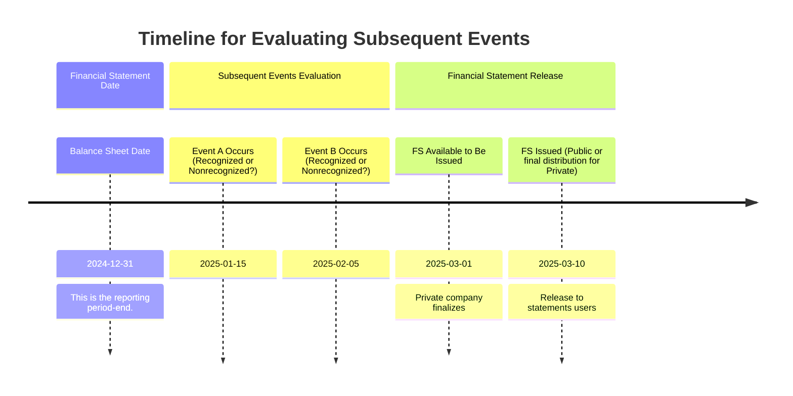

## 24.2 Disclosure Requirements and Periods Covered

A core aspect of subsequent events reporting lies in determining (1) the period during which an entity must evaluate events and transactions after the balance sheet date, (2) how those events are disclosed (or recognized) in the financial statements, and (3) the underlying timelines for both initial issuance and potential reissuance of financial statements. This topic is crucial because it helps ensure that financial statements reflect material events that occur between the date of the financial statements and the date on which those statements are issued (or available to be issued). It also ensures users have the latest relevant information at the time they make economic decisions.

This section explores the requirements under U.S. GAAP for public and private entities related to the subsequent event evaluation period, with an emphasis on reissuance considerations. It highlights best practices, pitfalls, and strategic insights that help preparers fulfill disclosure responsibilities in compliance with ASC 855, “Subsequent Events,” as well as other authoritative guidance.

_____________________________________________________________________________________

How This Section Relates to the FAR Exam:  
• Demonstrates mastery of subsequent event identification/analysis  
• Integrates core accounting concepts with regulatory requirements  
• Clarifies how to handle differences between public (SEC filer) and private (non-SEC) reporting entities  
• Prepares candidates for practical exam simulations dealing with reissuance nuances  

_____________________________________________________________________________________

Understanding the Periods Covered
---------------------------------
In the realm of subsequent events, the critical question is: “Up to what date must management evaluate and incorporate (or disclose) the effects of events that take place after the balance sheet date?” U.S. GAAP sets forth different reporting timelines and obligations for public vs. private companies:

• Public Entities: Generally evaluate subsequent events through the date the financial statements are “issued,” meaning the date the financial statements are widely distributed to financial statement users and reliance can be presumed (e.g., the date an entity files its annual report on Form 10-K with the SEC).

• Private Entities: Evaluate subsequent events through the date the financial statements are “available to be issued,” meaning all approvals necessary for issuance have been received but the statements have not been widely distributed. The date could be when the financial statements are delivered to a governing authority (e.g., a board of directors) or otherwise finalized for distribution.

Regardless of entity type, the objective is to ensure that material events within the evaluation window are properly accounted for and disclosed so that the financial statements reflect all known material matters up to that point.

Recognized vs. Nonrecognized Subsequent Events
----------------------------------------------
Although this topic is covered in detail in Section 24.1, it is helpful to reiterate the distinction in the context of disclosure periods:

• Recognized Subsequent Events (commonly called Type 1 events): These events provide additional evidence about conditions that existed at the date of the balance sheet. They typically result in adjustments to the financial statements.

• Nonrecognized Subsequent Events (commonly called Type 2 events): These events point to conditions that arose after the balance sheet date. Although not recognized in the financial statements (no direct adjustments), disclosure may be necessary if the event is material to the users’ understanding of the financial statements.

The evaluation period affects whether management deems an event recognized or nonrecognized, but both recognized and nonrecognized subsequent events must be evaluated up to the appropriate issuance or available-to-be-issued date.

Timeline Diagram for Subsequent Events
--------------------------------------
Below is a simple Mermaid diagram illustrating a sample year-end of December 31 and key milestone dates for a private entity. The same concept applies to public entities, with the key difference being the “issuance date” vs. the “available to be issued” date.

In the diagram scenario, the company’s balance sheet date is December 31, 2024, and its management finalizes the financial statements for issuance on March 1, 2025 (private entity scenario). Any event occurring between January 1, 2025, and March 1, 2025, that is material is evaluated for recognition (if the underlying condition existed on December 31) or disclosure (if new conditions arise after December 31).

Reissuance Considerations
-------------------------
An often-overlooked complication arises if an entity, after initially issuing its financial statements, reissues or revises them. ASC 855 addresses this by distinguishing between two key scenarios:

1. Reissued Financial Statements with No Changes:  
   A company may reissue its previously issued financial statements without any modifications. In such cases, the entity should not recognize events that occurred after the date it originally issued (or made available) the financial statements. The subsequent event evaluation period remains tied to the original issuance date, meaning any events discovered after that date typically are not considered in the reissued statements (unless the entity becomes aware of facts that existed at or before the issuance date that materially affect the financial statements).

2. Revised Financial Statements with Adjustments:  
   If adjustments are made to correct an error, for example, or to reflect a material misstatement, management must carefully assess whether any new subsequent events have come to light that would require additional disclosure. In other words, if the intent is to fix prior statements due to a material oversight, the entity typically includes disclosure of how subsequent events (from the original issuance date up to the reissuance date) might affect or complement the revision.  

For both scenarios, management typically provides updated disclosures of the original issuance date and clarifies that it is not updating the financial statements for events that occurred between the original issuance date and the reissuance date—except in the limited circumstances in which an adjustment was necessary due to the original deficiency.

Practical Example of Reissuance
-------------------------------
Imagine a private company that finalized its 2024 financial statements (for a December 31, 2024, year-end) on March 1, 2025. These were made available to be issued on March 2, 2025. Then, on April 15, 2025, an accounting error was discovered, prompting a restatement. The entity reissues revised financial statements on May 1, 2025. Under reissuance guidelines:

• The subsequent events evaluation period for the original financial statements ended on March 2, 2025.  
• When reissuing on May 1, 2025, the entity does not retroactively include or discuss events that happened after March 2, 2025, except to the extent that these events clarify or correct conditions that existed at March 2 or correct the newly identified error’s ramifications.  
• The reissued financial statements should disclose both dates: the “original issuance” date (or available-to-be-issued date) and the “reissuance” date. Moreover, it should clarify whether or not the financial statements have been updated for other events after the original date.

Differences Between Public and Private Entities
----------------------------------------------
Public (SEC Filer) Entities
• Typically evaluate subsequent events through the date the financial statements are actually filed with the SEC (e.g., Form 10-K).  
• Must disclose in the notes to the financial statements the date through which subsequent events have been evaluated.  
• The reissuance date may coincide with an amendment to a filing (such as an amended 10-K or 10-Q) which could prompt reissuance disclosures under ASC 855.  

Private (Non-SEC) Entities
• Evaluate subsequent events through the date the financial statements are available to be issued—i.e., all approvals are obtained and there are no impediments to distribution.  
• Similar to public companies, private entities must disclose in the notes the date through which subsequent events have been evaluated as well as the date the financial statements were available to be issued.  
• Reissuance triggers do not necessarily coincide with SEC filing but instead may arise from contractual obligations (e.g., financial statements are reissued to lenders or other private investors on a specific date).

Key Disclosure Requirements
---------------------------
ASC 855-10-50 outlines the following disclosure requirements for subsequent events:

• Date of Subsequent Event Evaluation:  
  – Public companies disclose the date the financial statements were issued.  
  – Private companies disclose the date the financial statements were available to be issued.

• Nature of Subsequent Events:  
  – For recognized events (Type 1), the financial statements should reflect the adjustments, and disclosures should clarify the nature of the event if not otherwise evident.  
  – For nonrecognized events (Type 2), the notes should include the nature of the event, an estimate of its financial impact (or a statement that such an estimate cannot be made), and any relevant qualitative information that helps users understand the significance of the event.

• Reissuance Considerations:  
  – Disclose that the financial statements are reissued and the reasons for reissuance (e.g., discovery of an error).  
  – Reference the original issuance or available-to-be-issued date and clarify whether the financial statements have been updated for any additional events since that date.  
  – If changes are included (e.g., correction of an error or addition of a new footnote), ensure the updated statements thoroughly discuss these modifications.

Illustrative Table: Subsequent Events Disclosure Requirements
-------------------------------------------------------------
The following table summarizes the core differences in disclosure requirements and periods for public vs. private entities:

| Category                                         | Public Entities                 | Private Entities                                   |
|--------------------------------------------------|--------------------------------|-----------------------------------------------------|
| Subsequent Event Evaluation Period               | Through the date the financial statements are actually issued (filed with the SEC). | Through the date the financial statements are available to be issued (i.e., all approvals obtained). |
| Disclosure of the Evaluation Date                | Yes: must specifically name the date. | Yes: must specifically name the date. |
| Typical Gap between Year-End and Issuance        | Often shorter for public filers to meet tight SEC deadlines. | May vary based on internal approvals and external user needs. |
| Reissuance Date                                  | Often triggered by an SEC amendment (e.g., 10-K/A). | Could be triggered by restatements following a discovery or internal/external user request. |
| Reissuance Disclosures                           | Must disclose original issuance date, reason for reissuance, and any changes made. | Same requirement; clarifies original available-to-be-issued date and reason for reissuance. |

Best Practices to Ensure Compliance
-----------------------------------
1. Maintain Clear Documentation:  
   – Keep internal records of meeting minutes, management sign-offs, and communication logs that document precisely when the financial statements were authorized for issuance or made available.  
   – This documentation is invaluable when reissuance needs arise, ensuring clarity around the original issuance and subsequent evaluation periods.

2. Conduct a Near-Issuance Review:  
   – Right before the statements are finalized for issuance (or reissuance), perform a final check of any significant events that might not be captured.  
   – In larger, more complex entities, this may involve an internal “subsequent events committee” or a designated manager who surveys department heads, legal counsel, and operations for critical developments.

3. Communicate with Legal Counsel and Auditors:  
   – Both internal and external counsel can help identify pending or potential litigation or regulatory actions.  
   – External auditors often provide an updated legal letters request to ensure all contingencies are properly addressed through the issuance date.

4. Monitor for Systematic Changes:  
   – Also watch for changes in law, environment, or broader market conditions that may trigger a recognized or nonrecognized subsequent event (e.g., abrupt changes in interest rates, commodity shortages, or natural disasters).

5. Align Disclosures Across Reports:  
   – If the entity issues a press release or other financial information prior to the official issuance date, confirm that these do not conflict with the eventual financial statement disclosures.  
   – Inconsistencies could raise questions regarding management’s diligence in evaluating subsequent events.

Common Pitfalls and Challenges
------------------------------
• Misidentifying the Cut-Off Date:  
  – Particularly for private companies that may have a long gap between the end of the fiscal year and the date the financial statements are available to be issued. Some fail to continue subsequent events evaluation until the actual issuance date, resulting in omission of relevant events.

• Inadvertent Reissuance:  
  – Entities sometimes make minor distribution of the original financial statements to certain users but then provide updated versions for broader use, not labeling them as “reissued.” The mismatch can create confusion for readers and auditors about what events were considered.

• Overlooking Conditions that Existed at the Balance Sheet Date:  
  – In certain complex transactions, an event that happens after year-end might be an extension or finalization of a pre-existing condition. Failing to categorize that as a recognized subsequent event can lead to misstatements or incomplete disclosures.

• Not Disclosing the Required Date:  
  – FASB standards explicitly require disclosure of the subsequent events evaluation date and whether it has changed for reissuance. Neglecting this disclosure can result in noncompliance.

Case Study: A Public Company Filing Extension
---------------------------------------------
Suppose an SEC-registered manufacturing company’s year-end is December 31, 2024. The company’s normal issuance date for its annual 10-K is March 1, 2025. However, the company obtains an extension and files on March 15, 2025. During this period (March 1 to March 15), a major product defect surfaces, leading to a massive recall. Because the financial statements are not filed until March 15:

• Management must evaluate whether the product recall arises from a condition that existed at December 31, 2024. If yes, it might be a recognized subsequent event (if evidence existed before year-end). If it arose entirely from new circumstances post-year-end, it becomes a nonrecognized subsequent event.  
• Disclosure of the recall must be included if it is material to the financial statements.  
• The date of the financial statements would reflect March 15, 2025, as the “issuance” date.

Connecting to IFRS Perspectives
-------------------------------
While U.S. GAAP deals with subsequent events under ASC 855, IFRS addresses them under IAS 10, “Events After the Reporting Period.” Although the principles are largely consistent, IFRS typically frames them as “adjusting” and “non-adjusting” events, and IFRS-based financial statements do not typically provide a separate disclosure regarding the date through which events were evaluated. An IFRS adopter simply states that the financial statements were authorized for issue on a specific date, and events that occur after that date are not reflected unless it is an adjusting event. For CPA candidates, the crucial point is to grasp that the IFRS approach is conceptually similar but differs in certain disclosure specifics.

Summary
-------
Determining the subsequent events evaluation period and understanding the disclosure requirements are key responsibilities that hinge on whether the entity is public or private. The timeline can be further complicated by reissuance scenarios, which demand careful analysis of what triggered the reissuance, whether changes to previously reported information are required, and how these changes are disclosed.

Professionals must remain vigilant up to the issuance (or available-to-be-issued) date and document their considerations thoroughly, so that the financial statements remain both complete and accurate. By adhering to these guidelines, entities safeguard the reliability of their reported results, providing stakeholders with transparent and relevant information regarding significant developments that arise after the balance sheet date.

_____________________________________________________________________________________

Quiz on Disclosure Requirements and Periods Covered
------------------------------------------------------------------

## Disclosure Requirements and Subsequent Events Evaluation Quiz



### Which of the following best describes the correct date through which a public (SEC-filer) entity must evaluate subsequent events?

- [ ] The date of the auditor’s report  
- [ ] The date the board of directors approves the financial statements  
- [x] The date the financial statements are filed with the SEC  
- [ ] The date the external auditors present their final management letter  

> **Explanation:** Under ASC 855, public companies (SEC filers) generally evaluate subsequent events through the date the financial statements are officially filed with the SEC (considered the “issuance date”).

### Private companies that are not SEC filers must evaluate subsequent events through:

- [x] The date the financial statements are available to be issued  
- [ ] The date the external audit is completed  
- [ ] The date of the CFO’s certification  
- [ ] Two weeks after the board approves the statements  

> **Explanation:** ASC 855 distinguishes between “issued” for public entities and “available to be issued” for private entities. Private entities evaluate subsequent events through the date the statements have all necessary approvals and can be distributed.

### When financial statements are reissued without any modifications, management should:

- [ ] Include disclosure of the new events that occurred after the original issuance date  
- [x] Not recognize events that occurred after the original issuance date  
- [ ] Treat any events after the original issuance date as recognized subsequent events  
- [ ] Avoid referencing the original issuance date  

> **Explanation:** If no changes are made to the previously issued financial statements, management does not reopen the evaluation period for new events. The original issuance date still applies, and typically no new subsequent events are incorporated unless they correct facts known at the original issuance date.

### Which of the following is considered a best practice to ensure compliance with subsequent events reporting?

- [ ] Stopping the evaluation of subsequent events as soon as the audit is substantially completed  
- [x] Conducting a near-issuance review to confirm no material events are missed  
- [ ] Relying solely on the CFO’s knowledge without documentation  
- [ ] Postponing any discussion of subsequent events until after the annual report is published  

> **Explanation:** A near-issuance review increases the likelihood that material events are identified and accounted for or disclosed before the financial statements are finalized and issued.

### What is the primary consequence of misidentifying the cut-off date for evaluating subsequent events?

- [x] Potential omission of material information from the financial statements  
- [ ] Inability to revise the financial statements later  
- [x] Risk of misstatement regarding conditions existing at the balance sheet date  
- [ ] No significant consequences if auditors catch the error  

> **Explanation:** If management incorrectly determines the cut-off date, important events that occur before the actual issuance (or availability date) may be missed or misclassified, leading to misstatements or incomplete disclosures.

### Under U.S. GAAP, to comply with subsequent events requirements, an entity must:

- [x] Disclose the date through which subsequent events have been evaluated  
- [ ] Omit the subsequent events evaluation date to simplify reporting  
- [ ] Evaluate only post-balance-sheet gains and ignore new liabilities  
- [ ] Automatically recognize all subsequent events that occur before the statements are issued  

> **Explanation:** U.S. GAAP mandates that financial statements clearly disclose the date through which events were evaluated, ensuring transparency about the temporal scope of management’s evaluation.

### For a nonrecognized subsequent event (Type 2 event):

- [x] Disclosure in the notes is generally required if material  
- [ ] The financial statements must always be adjusted retroactively  
- [x] It indicates a condition that did not exist at the balance sheet date  
- [ ] It is never disclosed because it does not affect the prior period  

> **Explanation:** Nonrecognized (Type 2) events are those arising from conditions that did not exist at the balance sheet date. While they are not reflected in the financial statements themselves, material Type 2 events must be disclosed.

### What is the key difference between recognized (Type 1) and nonrecognized (Type 2) subsequent events?

- [x] Type 1 events relate to existing conditions at the balance sheet date, while Type 2 events arise from new conditions  
- [ ] Type 1 events are only for public companies, while Type 2 events are only for private companies  
- [ ] Type 1 events never require financial statement adjustments, while Type 2 events always require them  
- [ ] There is no distinguishing difference; both are treated identically  

> **Explanation:** Recognized (Type 1) subsequent events provide additional evidence about conditions that existed at the date of the balance sheet, whereas nonrecognized (Type 2) events involve new developments after the balance sheet date.

### Which scenario represents a reissuance of financial statements?

- [x] Correcting a previously issued set of statements for a material error discovered two months later  
- [ ] Distributing draft financial statements for internal review  
- [ ] Providing management analysis of monthly internal financial data  
- [ ] Filing quarterly unaudited financials with the SEC  

> **Explanation:** Reissuance occurs if the previously issued statements are republished, particularly when material errors or omissions become known that necessitate restatement or correction.

### The date of original issuance of the financial statements for private entities is:

- [x] The date the financial statements were first available to be issued and all approvals were obtained  
- [ ] The date the CPA firm completed its internal review  
- [ ] The date the CFO authorized final draft statements  
- [ ] The last day of fieldwork for the audit  

> **Explanation:** For private entities, “available to be issued” means all necessary approvals for issuance are obtained, and management can finalize distribution to intended users.



_____________________________________________________________________________________

## For Additional Practice and Deeper Preparation

**[FAR CPA Hardest Mock Exams: In-Depth & Clear Explanations](https://www.udemy.com/course/far-cpa-mock-exams/?referralCode=F88050F8D5C76764F6BD)**  

**Financial Accounting and Reporting (FAR) CPA Mocks:** 6 Full (1,500 Qs), Harder Than Real! In-Depth & Clear. Crush With Confidence! 

- Tackle full-length mock exams designed to mirror real FAR questions.  
- Refine your exam-day strategies with detailed, step-by-step solutions for every scenario.  
- Explore in-depth rationales that reinforce higher-level concepts, giving you an edge on test day.  
- Boost confidence and minimize anxiety by mastering every corner of the FAR blueprint.  
- Perfect for those seeking exceptionally hard mocks and real-world readiness.  

_Disclaimer: This course is not endorsed by or affiliated with the AICPA, NASBA, or any official CPA Examination authority. All content is for educational and preparatory purposes only._
