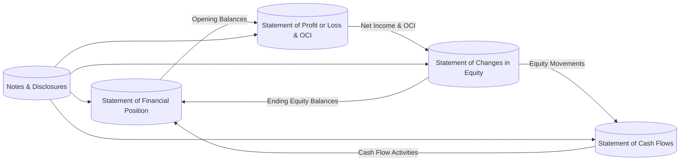

## 25.2 Financial Statement Presentation and Terminology Under IFRS

International Financial Reporting Standards (IFRS) play a critical role in harmonizing financial reporting across borders. By setting globally recognized principles, IFRS drives consistency, comparability, and transparency in financial statements, regardless of an entity’s location or industry. The International Accounting Standards Board (IASB) issues IFRS, and many regions worldwide have either adopted IFRS or converged their local standards with it.

This section explores key aspects of financial statement presentation and the related terminology under IFRS. It highlights differences from, and similarities to, U.S. Generally Accepted Accounting Principles (GAAP). Familiarity with IFRS naming conventions and minimum required statements prepares candidates for the global environment in which CPAs operate.

## Underlying Principles of IFRS Presentation

IFRS presentation and terminology are shaped by IAS 1, Presentation of Financial Statements. IAS 1 establishes the primary components of a complete set of financial statements and prescribes overall requirements:

• Fair presentation and compliance: Financial statements must present an entity’s financial position, financial performance, and cash flows fairly, and they should comply with applicable IFRS.  
• Going concern assumption: Entities generally prepare statements under the presumption they will remain in business for the foreseeable future.  
• Accrual basis of accounting: Transactions and events are recognized when they occur (rather than when cash is received or paid) and recorded in the appropriate period.  
• Consistency of presentation: The presentation and classification of items in the financial statements must be consistent from one period to the next unless a change is justified.  
• Materiality and aggregation: Material items must be presented separately; immaterial amounts can be aggregated.  
• Offsetting: Assets and liabilities, or income and expenses, should not be offset unless required or permitted by IFRS.  

## Differences in Naming Conventions

One of the most noticeable differences between IFRS and U.S. GAAP is the terminology used on the face of financial statements. Although content and meaning are typically similar, IFRS names certain statements differently, which can cause confusion if you are used to U.S. GAAP designations.

Under IFRS, the standard naming conventions include:

• Statement of Financial Position (similar to the Balance Sheet under U.S. GAAP)  
• Statement of Profit or Loss and Other Comprehensive Income (which may be combined or presented as two statements: an Income Statement and a Statement of Comprehensive Income)  
• Statement of Changes in Equity (sometimes compared to the Statement of Stockholders’ Equity under U.S. GAAP)  
• Statement of Cash Flows (the same name is used under both standards, though certain classification differences may exist)  

While IFRS permits flexibility, these names are commonly used in practice and are suggested by IAS 1. Entities may also re-label statements to reflect their particular activities (e.g., “Statement of Operations and Other Comprehensive Income”). However, the content requirements must conform to IFRS, regardless of the specific name used.

## Complete Set of Financial Statements Under IFRS

A complete set of IFRS financial statements, as outlined in IAS 1, generally comprises:

• A Statement of Financial Position at the end of the period  
• A Statement of Profit or Loss and Other Comprehensive Income for the period (either one statement or two separate statements)  
• A Statement of Changes in Equity for the period  
• A Statement of Cash Flows for the period  
• Notes, comprising significant accounting policies and other explanatory information  
• A Statement of Financial Position at the beginning of the earliest comparative period if an entity retrospectively applies an accounting policy or makes a retrospective restatement of items  

Below is a simplified diagram showing how these statements flow together:

Each financial statement interrelates with the others. For example, net profit or loss from the Statement of Profit or Loss and Other Comprehensive Income feeds into the Statement of Changes in Equity, and the Statement of Changes in Equity helps reconcile the equity section on the next Statement of Financial Position.

### 1. Statement of Financial Position

Under IAS 1, the Statement of Financial Position (SFP) is comparable to the U.S. GAAP Balance Sheet. However, IFRS provides slightly more flexibility in how line items may be presented. Entities typically classify assets and liabilities as current and noncurrent (with limited exceptions). Still, some industries or entities may use liquidity-based presentation if it is more relevant and reliable. Key line items required on the face of the SFP include:

• Property, plant, and equipment  
• Intangible assets  
• Financial assets  
• Inventories  
• Trade and other receivables  
• Cash and cash equivalents  
• Trade and other payables  
• Provisions  
• Financial liabilities  
• Retained earnings and other components of equity  

One notable difference is that IFRS does not prescribe a specific order for these line items—many companies follow a top-down liquidity approach or group them from most liquid to least liquid. The main objective is clarity and relevance to users.

### 2. Statement of Profit or Loss and Other Comprehensive Income

IFRS requires that an entity presents all income and expense items recognized during a period in either:

• A single Statement of Profit or Loss and Other Comprehensive Income, which includes both profit or loss items and items of other comprehensive income (OCI), or  
• Two statements:  
  – A separate income statement displaying the components of profit or loss  
  – A statement of comprehensive income beginning with profit or loss and containing components of other comprehensive income  

Components of other comprehensive income include gains and losses that are excluded from profit or loss under IFRS, such as:

• Certain foreign currency translation adjustments  
• Unrealized gains and losses on certain fair value measurements of financial instruments classified as fair value through OCI  
• Remeasurements of defined benefit pension plans  
• Changes in the revaluation surplus for property, plant, and equipment or intangible assets (when the revaluation model is used)

IFRS typically separates OCI components into those reclassifiable to profit or loss and those not reclassifiable (items permanently recorded in equity).

### 3. Statement of Changes in Equity

The Statement of Changes in Equity under IFRS details total comprehensive income for the period, transactions with owners in their capacity as owners (e.g., dividends, share issuances, share buybacks), and reconciles the opening and closing equity balances. This statement outlines changes in:

• Share capital (or share premium)  
• Retained earnings or accumulated deficit  
• Other reserves (e.g., revaluation surplus, currency translation reserve)  

U.S. GAAP has a similar statement called the Statement of Stockholders’ Equity. IFRS, however, places particular emphasis on disaggregating components of equity (e.g., share premium, revaluation surplus, cash flow hedge reserves) to enhance transparency and detail.

### 4. Statement of Cash Flows

Both IFRS (IAS 7) and U.S. GAAP require statements of cash flows, classifying cash flows as operating, investing, or financing activities. While many concepts are similar, IFRS offers more flexibility in certain classification areas. For instance, under IFRS:

• Interest paid may be classified as operating or financing.  
• Interest received may be classified as operating or investing.  
• Dividends paid may be classified as operating or financing.  
• Dividends received may be classified as operating or investing.  

By contrast, U.S. GAAP has stricter prescribed classifications for these items. IFRS also strongly encourages, but does not mandate, the direct method for reporting operating cash flows.

### 5. Notes and Disclosures

IFRS places strong emphasis on explanatory notes and disclosures, which serve to:

• Disclose the basis of preparation and accounting policies.  
• Present relevant information not included in the primary financial statements but necessary for understanding the entity’s financial performance and position.  
• Provide information about judgment areas, sources of estimation uncertainty, and management assumptions.  

IAS 1 requires presenting notes “in a systematic manner” and typically encourages an order that helps users understand the financial statements better. Commonly, entities begin with a summary of significant accounting policies, followed by more detailed notes correlating to each line item on the face of the financial statements.

## IFRS Layout Recommendations and Best Practices

IFRS is principle-based and allows management to choose formats that best reflect the entity’s operations, as long as they meet the core requirements of fair presentation, consistency, and meaningful classification. Consequently, IFRS-compliant statements may appear slightly different from one enterprise to another. Best practices often include:

• Clear labeling of current and noncurrent items on the Statement of Financial Position unless a liquidity presentation is more appropriate.  
• Grouping or subtotaling major items such as revenue, cost of sales, and gross profit to enhance clarity in the Statement of Profit or Loss.  
• Highlighting relevant subtotals, such as operating profit or EBITDA, so long as they are labeled clearly and reconciled with IFRS-defined measures.  
• Including comparative information for prior periods consistently and disclosing the basis for any changes.  
• Ensuring that significant areas of estimation and judgment are disclosed plainly in the notes (e.g., intangible asset impairments, provisions for litigation, revaluation approaches).  

### Example of IFRS Terminology Differences

The table below illustrates some high-level differences between IFRS and U.S. GAAP terminology:

| Concept/Statement                        | IFRS Name(s)                                     | U.S. GAAP Name(s)                    |
|-----------------------------------------|--------------------------------------------------|--------------------------------------|
| Balance Sheet                            | Statement of Financial Position (SFP)            | Balance Sheet                         |
| Income Statement                         | Statement of Profit or Loss (separate or combined with OCI) | Income Statement                     |
| Comprehensive Income Statement           | Statement of Profit or Loss and Other Comprehensive Income | Combined or presented on separate statements of net income and OCI |
| Stockholders’ Equity / Shareholders’ Equity | Statement of Changes in Equity                  | Statement of Stockholders’ Equity    |
| Inventory Measurement                    | Inventories (IAS 2), primarily lower of cost or NRV | Inventory: lower of cost or market   |
| Fixed Assets                             | Property, Plant and Equipment (IAS 16)           | Fixed Assets or Plant Assets         |
| Capital Stock                            | Share Capital                                    | Common Stock / Preferred Stock       |
| Additional Paid-in Capital               | Share Premium                                    | Additional Paid-in Capital           |
| Retained Earnings                        | Retained Earnings / Reserves                     | Retained Earnings                     |
| Statement of Compliance                  | Explicit statement of compliance with IFRS        | Not applicable (GAAP does not require the same statement) |

## Potential Pitfalls and Challenges

While IFRS brings global uniformity, certain pitfalls can arise during adoption or use:

• Transitioning from U.S. GAAP: Many entities find that reclassifications, such as capitalizing certain development costs or revaluing certain assets, can significantly alter their reported balances.  
• Revaluation Model: IFRS allows revaluation of intangible assets and property, plant, and equipment. This can create complexities in understanding and presenting revaluation surplus in equity.  
• Disclosure Overload: IFRS disclosure requirements can be extensive, especially regarding judgments and estimates. Management must ensure coherent, relevant, and concise notes rather than simple boilerplate disclosures.  
• Substance over Form: IFRS heavily emphasizes the economic substance of transactions rather than purely legal form. This can be challenging when structuring agreements in ways that appear to place liabilities off-balance sheet under less strict local standards.  

## Real-World Example and Case Study

Consider a hypothetical multinational manufacturing firm, GlobalMach Ltd., transitioning from U.S. GAAP to IFRS. The management team must restate its historical statements to comply with IFRS Presentation standards under IAS 1, while also adjusting certain accounting treatments:

• Reclassification of borrowing costs: Under IFRS, certain borrowing costs for qualifying assets must be capitalized (IAS 23). This shifted some expenses from profit or loss to the carrying value of assets on the Statement of Financial Position.  
• Revaluation of factory equipment: GlobalMach’s advanced machinery qualified for IFRS’s revaluation model. The increased fair value was recognized as an increase in the revaluation surplus component within equity.  
• Enhanced disclosures: Managers were required to disclose major judgments (e.g., deciding which components of machinery to separately value and depreciate) in the notes.  

Through these adjustments, GlobalMach produced a Statement of Financial Position under IFRS, a combined Statement of Profit or Loss and Other Comprehensive Income (highlighting both net income and the revaluation gain), and a Statement of Changes in Equity showing the movement in revaluation surplus. This case underscores how IFRS’s emphasis on fair value and expanded disclosures influences the layout and content of financial statements.

## Strategies for Overcoming Common IFRS Challenges

• Develop a robust IFRS transition plan: If shifting from U.S. GAAP to IFRS, enable cross-functional teams (including finance, IT, and internal auditing) to map U.S. GAAP line items to IFRS categories.  
• Train and educate staff: IFRS requires understanding beyond superficial naming changes. Teams must grasp the conceptual differences, especially for items like revaluation, impairment, or intangible assets.  
• Leverage technology for disclosures: Adopting IFRS often increases disclosure requirements. Streamline and automate the note-preparation process where possible to ensure accuracy and completeness.  
• Emphasize professional judgment: IFRS is principle-based, and consistent application of judgment fosters high-quality reporting. Document all estimates, assumptions, and potential sources of volatility in the notes.  

## Diagram of IFRS Presentation and Notes Flow

Below is another mermaid diagram illustrating how each financial statement ties into the entity’s storyline and how management judgments in the notes support stakeholder understanding:

This illustration demonstrates the interconnected nature of IFRS statements—profit or loss informs equity changes; equity changes reflect back into the Statement of Financial Position; and cash flows underpin liquidity, solvency, and operational strategy.

## Conclusion

Understanding the IFRS approach to financial statement presentation and terminology is paramount for accountants and auditors operating in a rapidly globalizing marketplace. IFRS is built on principles that emphasize transparency, comparability, and faithful representation, but it also grants flexibility in layout and line-item detail. The key statements—Statement of Financial Position, Statement of Profit or Loss and Other Comprehensive Income, Statement of Changes in Equity, Statement of Cash Flows, and explanatory notes—work in concert to provide a complete picture of an entity’s financial health and performance.

While the differences between IFRS and U.S. GAAP can be subtle in naming but significant in practice, using consistent and standardized terminology streamlines cross-border analysis, encourages global investment, and improves credibility among stakeholders. The next step in your CPA journey is to master these foundational differences and develop a keen sense of IFRS’s principle-based philosophy—an invaluable asset to your professional toolkit.

---

## Test Your Knowledge of IFRS Financial Statement Presentation



### Under IFRS, the Balance Sheet is most commonly referred to as:
- [ ] Statement of Equity
- [ ] Statement of Financial Performance
- [x] Statement of Financial Position
- [ ] Statement of Operations

> **Explanation:** Under IAS 1, the IFRS equivalent of a Balance Sheet is called the Statement of Financial Position.

### Which of the following statements is true regarding IFRS presentation of profit and loss and other comprehensive income?
- [x] IFRS allows a single statement or two separate statements to present profit or loss and other comprehensive income.
- [ ] IFRS forbids presenting profit or loss and other comprehensive income in a single statement.
- [x] Entities must distinguish between items that can be reclassified and those that cannot.
- [ ] IFRS does not permit profit or loss to be shown separately from total comprehensive income.

> **Explanation:** IAS 1 allows organizations to present profit or loss and other comprehensive income in either a single statement or separate statements. Additionally, OCI items must be split into reclassifiable and non-reclassifiable categories.

### Which of the following is a minimum required line item in the IFRS Statement of Financial Position?
- [ ] Reconciliation of net income to operating cash flows
- [x] Property, plant, and equipment
- [ ] Revenue
- [ ] Total comprehensive income

> **Explanation:** IAS 1 requires the presentation of certain line items on the face of the Statement of Financial Position, including property, plant, and equipment.

### Which statement best describes IFRS guidance regarding order of items in the Statement of Financial Position?
- [x] Entities can follow a liquidity-based presentation or classify assets and liabilities as current/noncurrent if that approach is more relevant and reliable.
- [ ] All entities must always classify assets and liabilities in a strictly current-to-noncurrent order.
- [ ] IFRS mandates that noncurrent items appear before current items.
- [ ] IFRS requires a strict top-down approach, from intangible assets to share capital.

> **Explanation:** IFRS allows a current vs. noncurrent classification or a liquidity-based presentation if it provides more relevant information.

### The Statement of Changes in Equity under IFRS details:
- [x] Total comprehensive income, owner transactions, and opening/closing balances of equity.
- [ ] Only share issuances and repurchases.
- [x] Movements in each component of equity, such as revaluation surplus.
- [ ] Reconciliation of net income with cash from operations.

> **Explanation:** IFRS requires disclosures of all movements in equity for the period, including total comprehensive income, share transactions, and adjustments to reserves.

### Under IFRS, which of these classification options is acceptable for interest paid on the Statement of Cash Flows?
- [x] Financing or operating
- [ ] Operating only
- [ ] Investing only
- [ ] Restricted cash flows

> **Explanation:** IFRS offers flexibility by allowing interest paid to be presented as either an operating or financing activity, depending on the entity’s policy and the nature of its operations.

### IFRS differs from U.S. GAAP in that:
- [x] IFRS may allow revaluation of property, plant, and equipment with gains recognized in equity.
- [ ] IFRS disallows the direct method for the Statement of Cash Flows.
- [x] IFRS uses a principle-based approach, focusing on the economic substance of transactions.
- [ ] IFRS generally prescribes more rigid classification rules for the Statement of Cash Flows.

> **Explanation:** IFRS allows revaluation of assets, is principle-based, and provides more classification flexibility than U.S. GAAP in certain areas.

### According to IFRS (IAS 1), which item typically will not be reclassifiable from other comprehensive income to profit or loss at a later date?
- [x] Remeasurements of defined benefit plans
- [ ] Gains and losses on debt instruments measured at fair value through OCI
- [ ] Foreign exchange translation gains and losses on certain subsidiaries
- [ ] Gains and losses on hedging instruments

> **Explanation:** Remeasurements of defined benefit plans remain in equity and are not reclassified into profit or loss. Other types of OCI often can be reclassified.

### In the notes to IFRS financial statements:
- [x] Entities must disclose significant judgments made in applying its accounting policies.
- [ ] Management can omit material estimates if they are too uncertain.
- [ ] Entities are required to only list the IFRS standards they have applied, without further detail.
- [ ] The notes cannot change the classification of line items in primary statements.

> **Explanation:** IFRS requires disclosures of significant judgments, assumptions, and material uncertainties. Boilerplate disclosures are discouraged; detail must be provided where it affects users’ understanding.

### True or False: Under IFRS, comparative information for prior periods may be presented but is not required.
- [x] True
- [ ] False

> **Explanation:** IAS 1 generally requires comparative information for the prior period unless specifically exempted, but there are circumstances (such as new IFRS adoption or changes in accounting policies) where additional comparative statements may be necessary.



---

## For Additional Practice and Deeper Preparation

**[FAR CPA Hardest Mock Exams: In-Depth & Clear Explanations](https://www.udemy.com/course/far-cpa-mock-exams/?referralCode=F88050F8D5C76764F6BD)**

Financial Accounting and Reporting (FAR) CPA Mocks: 6 Full (1,500 Qs), Harder Than Real! In-Depth & Clear. Crush With Confidence!  

- Tackle full-length mock exams designed to mirror real FAR questions.  
- Refine your exam-day strategies with detailed, step-by-step solutions for every scenario.  
- Explore in-depth rationales that reinforce higher-level concepts, giving you an edge on test day.  
- Boost confidence and minimize anxiety by mastering every corner of the FAR blueprint.  
- Perfect for those seeking exceptionally hard mocks and real-world readiness.  

_Disclaimer: This course is not endorsed by or affiliated with the AICPA, NASBA, or any official CPA Examination authority. All content is for educational and preparatory purposes only._
