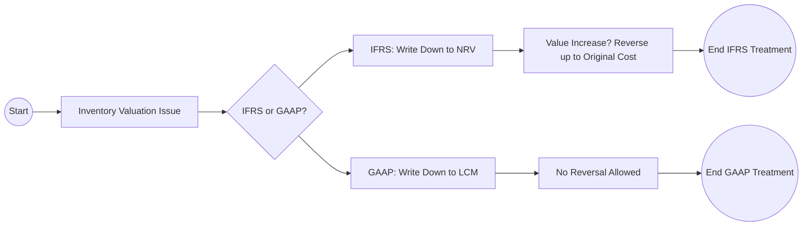
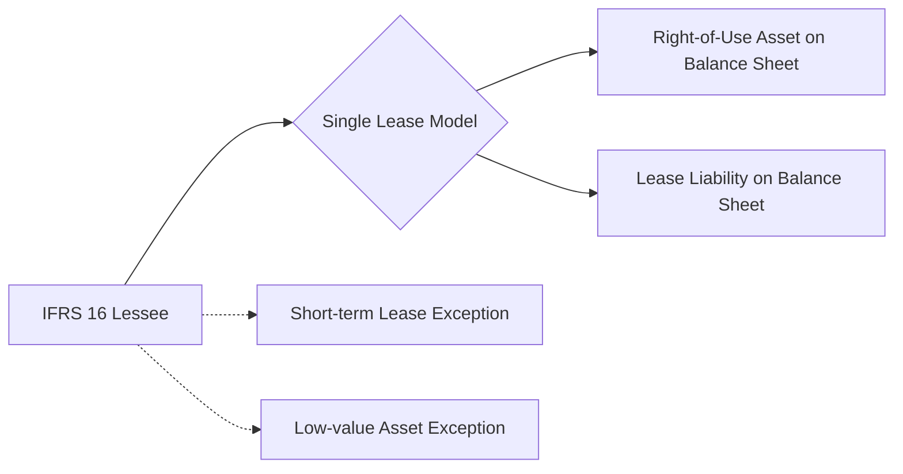

## 25.3 Major Recognition/Measurement Differences (Inventory, PP&E, Impairment, Leases, Going Concern, etc.)

This section explores critical distinctions between International Financial Reporting Standards (IFRS) and U.S. Generally Accepted Accounting Principles (GAAP) in the areas of Inventory, Property, Plant, and Equipment (PP&E), Impairment, Leases, and Going Concern. These differences can significantly affect the presentation of financial statements, the reporting of earnings, balance sheet values, and key financial ratios. Mastering these nuances is essential for aspiring CPAs, particularly those engaged with multinational corporations or globally integrated financial environments.

Use the following discussion to deepen your understanding of each topic and to prepare for questions you may encounter on the CPA Exam relating to IFRS comparisons.

---

## Introduction

While both U.S. GAAP and IFRS share numerous similarities, IFRS often employs more principle-based standards, whereas U.S. GAAP has a greater emphasis on detailed guidance. The result is that certain recognition and measurement approaches under IFRS may differ subtly or significantly from GAAP. For example, LIFO is prohibited under IFRS, impairment tests follow a one-step approach, and IFRS 16 for leases has consolidated most leases under a single lessee accounting model, whereas GAAP still differentiates between finance leases and operating leases for lessees with nuanced guidance.

In this chapter, we will focus on the following key areas:
• Inventory  
• Property, Plant, and Equipment (PP&E)  
• Impairment of Non-Financial Assets (including Goodwill)  
• Leases  
• Going Concern  

Each section includes real-world examples, illustrations, and best practices to showcase how the standards apply in practice.

---

## IFRS vs. GAAP: Inventory

Under both IFRS and U.S. GAAP, inventory valuation and cost-flow assumptions influence reported gross margins, total assets, and related ratios. However, the two frameworks diverge on certain key principles.

### LIFO Prohibition in IFRS
One of the most well-known differences is that IFRS does not allow the LIFO (Last In, First Out) cost-flow assumption. While many U.S. entities use LIFO to achieve certain tax and cost-flow benefits, the use of LIFO under IFRS is strictly prohibited. Entities under IFRS may use FIFO (First In, First Out), weighted-average cost, or specific identification (when practical and relevant).

### Measurement and Write-Downs
IFRS requires inventory to be measured at the lower of cost or net realizable value (NRV). U.S. GAAP also has a lower of cost or market rule for certain inventory measured under LIFO or retail inventory methods. However, in IFRS, any subsequent recoveries in the value of inventory (i.e., if the net realizable value rises after a write-down) must be recognized as a reversal of the prior write-down—up to the original cost. Under U.S. GAAP, reversals of inventory write-downs are generally not permitted.

### Example: IFRS Write-Down and Reversal
Suppose a company follows IFRS and holds perishable goods in its warehouse. The carrying amount of these goods is $100,000, but due to market changes, the net realizable value declines to $80,000. Therefore, the company recognizes a $20,000 write-down to reflect the new NRV. A month later, market conditions improve, bringing the net realizable value back up to $95,000. Under IFRS, the company would reverse a portion of the write-down (up to $15,000) to reflect the higher NRV, so long as the new carrying amount does not exceed the original cost of $100,000. Under U.S. GAAP, no reversal of the write-down would be permitted.

### Best Practices and Common Pitfalls
• Monitor global and local requirements for cost-flow assumptions, especially if your entity operates in a jurisdiction requiring IFRS.  
• Avoid mixing cost-flow assumptions inadvertently in consolidated financial statements that span multiple jurisdictions.  
• Ensure robust tracking of any impairments and potential recoveries for IFRS-based reporting.  

---

## IFRS vs. GAAP: Property, Plant, and Equipment (PP&E)

PP&E is central to industries ranging from manufacturing to service-based companies. While both IFRS and GAAP share fundamental elements (e.g., initial recognition at cost and subsequent depreciation), significant nuances exist in revaluation and component depreciation.

### Revaluation Model Option Under IFRS
One of the key differences is the IFRS revaluation model. Under IFRS (IAS 16), entities can choose either:  
• The cost model (similar to GAAP), or  
• The revaluation model, under which PP&E is reported at fair value on the date of revaluation, less subsequent accumulated depreciation and impairment losses.

Under U.S. GAAP, revaluation of PP&E to fair value is not permitted, barring certain industries under specialized rules (e.g., regulated utilities with specific rate-base treatments). Most U.S. GAAP-reporting entities use the historical cost minus accumulated depreciation and impairment.

### Component Depreciation
IFRS explicitly requires component depreciation if parts of an item of PP&E have costs that are significant in relation to the total cost of the item and differ in estimated useful lives or patterns of consumption. While U.S. GAAP allows for component depreciation, it is not explicitly required, so many U.S. entities use a single depreciation rate for an entire asset.

### Example: IFRS vs. GAAP on Revaluation
A company owns a building acquired at a cost of $1,000,000 five years ago. Under IFRS, if the building’s fair value is now $1,200,000 and the company has chosen the revaluation model, it can increase the carrying amount to $1,200,000 and recognize the upward revaluation in Other Comprehensive Income (OCI), net of certain adjustments. Under U.S. GAAP, the building would remain at its historical cost less accumulated depreciation, assuming no impairment.

### Best Practices and Common Pitfalls
• If adopting the revaluation model under IFRS, ensure consistent revaluations at sufficiently regular intervals to reflect fair values accurately.  
• Maintain clear documentation of significant components and their respective depreciation schedules.  
• Align the depreciation methods with actual usage patterns to reduce the risk of misstatements.  

---

## IFRS vs. GAAP: Impairment of Non-Financial Assets

Impairment testing safeguards financial statements from overstating asset values. Both frameworks share the fundamental objective of reflecting economic reality, but the methodologies differ notably.

### IFRS One-Step Model
IFRS requires a one-step impairment test under IAS 36. The carrying amount of the asset (or cash-generating unit, CGU) is compared to its recoverable amount. The recoverable amount is the higher of:  
• Fair value less costs of disposal, or  
• Value in use (present value of future cash flows)

If the carrying amount exceeds the recoverable amount, the asset is written down to the recoverable amount. A reversal of impairment is allowed under IFRS (except for goodwill) if circumstances change and the recoverable amount increases.

### U.S. GAAP Two-Step Model for Long-Lived Assets
For long-lived assets (other than goodwill), U.S. GAAP historically used a two-step approach:  
1. Compare the carrying amount to the undiscounted future cash flows.  
2. If carrying amount > undiscounted future cash flows, measure impairment as the excess of carrying value over fair value.

However, U.S. GAAP has evolved, and some frameworks have introduced simplified impairment tests similar to IFRS, but differences remain—especially for goodwill impairment, which still follows a mainly two-step model under certain guidelines (though ASU 2017-04 simplified this to a one-step for goodwill in many cases).

### Example: Impairment Reversal Under IFRS
A European subsidiary carries manufacturing equipment at $500,000. Due to market conditions, the equipment’s recoverable amount plummets to $350,000, resulting in a $150,000 write-down under IFRS. Two years later, conditions improve, pushing the recoverable amount to $420,000. Under IFRS, the company may partially reverse the prior impairment and increase the carrying value by $70,000 (up to $420,000), provided it does not exceed what the carrying amount would have been had no impairment occurred. Under U.S. GAAP, impairment reversals for a long-lived asset other than certain intangible assets or certain resources (like in the oil and gas industry) are typically prohibited.

### Best Practices and Common Pitfalls
• Monitor triggers for impairment frequently, including shifts in market conditions, regulatory changes, or operational issues.  
• Document assumptions for value in use calculations meticulously, as these can greatly affect impairment estimates.  
• Track subsequent market recoveries to properly recognize reversal benefits under IFRS (where applicable).  

---

## IFRS vs. GAAP: Leases

### Overview of IFRS 16
IFRS 16 introduced significant changes to lease accounting and replaced IAS 17. IFRS 16 requires lessees to recognize nearly all leases on the balance sheet via a “right-of-use” asset and a corresponding lease liability. The main exceptions include short-term leases (under 12 months) and leases of low-value assets.

### U.S. GAAP (ASC 842)
U.S. GAAP’s ASC 842 remains closer to the principle of dual classification for the lessee: finance leases (formerly capital leases) and operating leases. Although both types capitalize a right-of-use asset and a lease liability, the pattern of expense recognition differs between finance and operating leases.

### Key Differences
• Under IFRS 16, there is essentially one model for lessee accounting: all leases get capitalized (with minor exemptions).  
• Under U.S. GAAP, the right-of-use asset and lease liability are recognized for both finance and operating leases, but expense recognition patterns differ.  
• IFRS tends to be more principle-based, focusing on whether substantially all risks and rewards of ownership are transferred; U.S. GAAP has more detailed bright-line criteria for classification.

### Example: Short-Term Lease Contingencies
A retailer leases a small warehouse for an 8-month term with an option to extend another 6 months. Under IFRS 16, if the extension is not reasonably certain to be exercised, this lease could qualify as a short-term lease, allowing the lessee to expense lease payments as incurred, without recognizing a right-of-use asset and lease liability. Under U.S. GAAP, the accounting might hinge on detailed judgments about the probability of exercising renewal options and whether the extension is factored into the lease term.

### Best Practices and Common Pitfalls
• Carefully determine the lease term by analyzing renewal options, termination clauses, and other contractual mechanisms.  
• Verify if short-term or low-value asset exemptions apply (IFRS).  
• Maintain updated lease schedules, particularly for those with variable payments tied to indices or rates.  

---

## IFRS vs. GAAP: Going Concern

### IAS 1 and U.S. GAAP
Entities are required to prepare financial statements on a going concern basis unless management either intends to liquidate the entity or cease trading, or has no realistic alternative but to do so. IFRS addresses going concern primarily through IAS 1, Presentation of Financial Statements, which requires management to assess an entity’s ability to continue as a going concern but does not prescribe detailed guidance on how to make this assessment.

U.S. GAAP, on the other hand, offers specific guidance in ASC 205-40. Management must evaluate whether there is substantial doubt about the entity’s ability to continue as a going concern within one year after the date financial statements are issued (or available to be issued). If substantial doubt exists, there is the requirement to provide certain disclosures.

### Time Horizon Differences
• Under IFRS (IAS 1), the look-forward period is usually at least 12 months from the reporting date but may extend further if needed.  
• Under U.S. GAAP, the look-forward period is generally 12 months from the date financial statements are issued, which can differ from the balance sheet date.  

### Best Practices and Common Pitfalls
• Clearly document the assessments, assumptions, and mitigating factors used in determining GAAP vs. IFRS disclosures on going concern.  
• Provide robust disclosures if there is a material uncertainty affecting the entity’s ability to continue as a going concern.  
• Stay updated on jurisdictional requirements that may further refine going concern criteria.  

---

## Practical Illustrations and Case Analysis

Below is a concise case scenario illustrating some of the IFRS vs. GAAP differences side-by-side:

Company X is a multinational manufacturing corporation that reports under both U.S. GAAP (for parent reporting in the U.S.) and IFRS (for its foreign subsidiary in Europe).

• Inventory: The subsidiary is prohibited from using LIFO under IFRS, but the parent in the U.S. uses LIFO for some of its inventory items. Consolidation requires adjusting the subsidiary’s statements to reflect the parent’s cost-flow assumptions only for internal management or external GAAP reporting, but IFRS-based subsidiary standalone statements must remain on FIFO or weighted-average basis.  

• PP&E Revaluation: The subsidiary revalues land every two years, resulting in potential gains recognized in OCI. The parent keeps land at historical cost, so on consolidation for U.S. GAAP purposes, the revaluation is stripped out if it is purely IFRS-based.  

• Impairment: A piece of equipment is tested for impairment by comparing the carrying amount to the present value of expected cash flows under IFRS. Under U.S. GAAP, the undiscounted future cash flows test is applied first.  

• Leases: The subsidiary applies IFRS 16 and recognizes a single model for all leases, whereas the parent differentiates operating vs. finance leases. This difference can lead to timing differences in expense recognition.  

• Going Concern: For IFRS standalone statements, the subsidiary’s management reviews a 12-month horizon from the statement date. Under U.S. GAAP rules, the parent looks 12 months from the date financial statements are issued or available to be issued.  

---

## Common Pitfalls and Best Practices

• Not Reconciling IFRS and GAAP Timelines: Organizations often overlook differences in measurement dates or reconsideration periods (e.g., IFRS focusing on statement date vs. U.S. GAAP focusing on issuance date).  
• Misunderstanding Reversals: IFRS generally allows reversal of certain impairments and inventory write-downs; U.S. GAAP does not. This can result in material misstatements if not tracked properly.  
• Lease Classification Errors: Entities frequently misinterpret the short-term lease exemption under IFRS 16 vs. the operating lease classification rules under U.S. GAAP.  
• Inconsistent Component Depreciation: When applying IFRS internationally, some business units may fail to implement proper component depreciation.  

### Strategies to Overcome Issues
• Establish IFRS and GAAP Reconciliation Protocols: Use standardized workpapers and checklists for each area (inventory, PP&E, etc.) to ensure consistent treatment.  
• Frequent Training: Encourage regular workshops for finance teams to help them stay updated on evolving standards and encourage uniform interpretations.  
• Seek Expert Consultation: For complex transactions like lease modifications or global reorganizations, consulting IFRS and GAAP subject matter experts can mitigate errors.  

---

## Conclusion

The discrepancies between IFRS and U.S. GAAP in areas such as inventory, PP&E, impairment, leases, and going concern assessment can significantly impact an entity’s reported results and financial statements. Understanding these distinctions is essential for proper compliance, effective financial reporting, and success on the CPA Exam. By learning the principles, exploring practical examples, and staying vigilant about recent standard updates, you can confidently navigate the complexities of global accounting standards.

---

## Additional References

• IAS 1 Presentation of Financial Statements  
• IAS 16 Property, Plant and Equipment  
• IFRS 16 Leases  
• IAS 36 Impairment of Assets  
• ASC 842 Leases (U.S. GAAP)  
• ASC 205-40 Going Concern (U.S. GAAP)  
• AICPA IFRS Resources: https://us.aicpa.org/interestareas/internationalassurance  
• IFRS Foundation: https://www.ifrs.org/  

These references serve as a starting point for further learning. For a deeper exploration, consult official accounting standard codifications, professional publications, and authoritative guidance from standard-setting bodies.

---

## Master IFRS vs. GAAP Differences: Expert-Level Quiz



### Which inventory cost-flow assumption is prohibited under IFRS but allowed under U.S. GAAP?
- [ ] Weighted-average cost
- [x] LIFO (Last In, First Out)
- [ ] FIFO (First In, First Out)
- [ ] Specific identification

> **Explanation:** IFRS does not permit the use of LIFO, whereas U.S. GAAP allows LIFO under certain circumstances.

### Which statement best describes the revaluation model under IFRS for PP&E?
- [x] Entities can carry PP&E at fair value fewer accumulated depreciation and impairment losses.
- [ ] Entities must carry PP&E at historical cost.
- [ ] Entities are not allowed to revalue PP&E at all.
- [ ] Entities can only revalue intangible assets, not PP&E.

> **Explanation:** Under IAS 16, entities that adopt the revaluation model periodically update PP&E to fair value, then measure subsequent depreciation and impairment on the revalued amount.

### Under IFRS, how is impairment on a non-financial asset generally tested?
- [x] By comparing carrying value to the higher of fair value less costs of disposal or value in use.
- [ ] By comparing carrying value to undiscounted cash flows, then to market price.
- [ ] By checking the net realizable value derived from a third-party valuation only.
- [ ] By applying an up-front two-step test focusing solely on undiscounted cash flows.

> **Explanation:** Under IAS 36, IFRS uses a one-step test that compares the carrying amount to the recoverable amount (the higher of fair value less costs of disposal or value in use).

### Which of the following lease accounting practices is unique to IFRS 16 compared to U.S. GAAP (ASC 842)?
- [ ] It allows operating leases to remain entirely off the balance sheet.
- [ ] It offers two distinct models for lessee leases: finance and operating.
- [x] It uses a single lease model requiring most leases to be capitalized.
- [ ] It provides zero guidance for short-term or low-value assets.

> **Explanation:** IFRS 16 has essentially one model for lessees, requiring nearly all leases to be recognized on the balance sheet. U.S. GAAP differentiates operating and finance leases, even though both are capitalized.

### Which scenario would most likely result in an impairment reversal under IFRS but not under U.S. GAAP?
- [x] An asset written down in a prior period experiences a significant recovery in market value.
- [ ] An asset that has never been impaired receives a routine maintenance upgrade.
- [x] A previously recognized goodwill impairment recovers in value.
- [ ] A building is revalued under the revaluation model after many years.

> **Explanation:** IFRS permits the reversal of impairment losses (except for goodwill) if circumstances change. U.S. GAAP generally does not allow reversals of impairment (with limited exceptions).

### Which of the following is a significant distinction in how IFRS approaches going concern compared to U.S. GAAP?
- [x] IFRS guidance (IAS 1) provides a principles-based approach without a defined 12-month from issuance requirement.
- [ ] IFRS requires a bright-line test of 70% solvency ratio within 24 months.
- [ ] IFRS calls for going concern evaluations only once every three years.
- [ ] IFRS uses an “undiscounted future cash flow” threshold to determine going concern viability.

> **Explanation:** IFRS (IAS 1) is more principle-based and does not prescribe a 12-month look-forward from the issuance date, unlike ASC 205-40 in U.S. GAAP.

### In IFRS 16, which type of lease allows the lessee to fully expense payments without recognizing a right-of-use asset and lease liability?
- [x] Certain short-term leases (less than 12 months) with no purchase option.
- [ ] Finance leases with a purchase option.
- [x] All leases regulated by a government entity.
- [ ] Leases of production equipment exceeding three years.

> **Explanation:** IFRS 16 provides an exemption to recognize lease payments in profit or loss for short-term leases (12 months or less) that do not include a purchase option, and for low-value assets.

### Under IFRS, if a company opts for the revaluation model for an asset, how are upward revaluation increments generally recognized?
- [x] Credited to other comprehensive income (OCI), creating a revaluation surplus in equity.
- [ ] Credited to retained earnings, bypassing any separate reserves.
- [ ] Only recognized in profit or loss for the period.
- [ ] Treated as a reduction of other assets’ carrying amounts.

> **Explanation:** IFRS 16 (in conjunction with IAS 16 for PP&E) requires upward revaluations to be credited to OCI (revaluation surplus) unless it reverses a revaluation decrease of the same asset previously recognized in profit or loss.

### How does IFRS differ from U.S. GAAP regarding the reversal of inventory write-downs?
- [x] IFRS allows reversals up to the original cost if net realizable value recovers; U.S. GAAP disallows reversals.
- [ ] U.S. GAAP allows reversals up to the original cost; IFRS disallows reversals.
- [ ] Both require a new market value cost basis with no further adjustments.
- [ ] Neither standard permits inventory write-down reversals.

> **Explanation:** IFRS permits the reversal of previously recognized inventory write-downs if NRV recovers, while U.S. GAAP does not allow such reversals.

### True or False: Under IFRS, goodwill impairment losses are generally reversible if the goodwill subsequently recovers its value.
- [x] True
- [ ] False

> **Explanation:** While IFRS allows reversals of impairments for tangible and intangible assets (other than goodwill) when conditions improve, goodwill is an exception. Once impaired, goodwill cannot be reversed. If the question states “generally reversible,” it is a subtlety: IFRS 3 prohibits the reversal of goodwill impairment. So in principle, the correct statement for goodwill is that it is not reversible. However, if the quiz is testing conceptual knowledge about IFRS intangible assets in general, the nuance is that goodwill is not reversed. This question might be a trick question or require close reading. The universal IFRS principle forbids goodwill impairment reversals, so the statement “goodwill impairment losses are generally reversible under IFRS” is actually false.  



---

## For Additional Practice and Deeper Preparation

**[FAR CPA Hardest Mock Exams: In-Depth & Clear Explanations](https://www.udemy.com/course/far-cpa-mock-exams/?referralCode=F88050F8D5C76764F6BD)**  

**Financial Accounting and Reporting (FAR) CPA Mocks:** 6 Full (1,500 Qs), Harder Than Real! In-Depth & Clear. Crush With Confidence!  

- Tackle full-length mock exams designed to mirror real FAR questions.  
- Refine your exam-day strategies with detailed, step-by-step solutions for every scenario.  
- Explore in-depth rationales that reinforce higher-level concepts, giving you an edge on test day.  
- Boost confidence and minimize anxiety by mastering every corner of the FAR blueprint.  
- Perfect for those seeking exceptionally hard mocks and real-world readiness.  

_Disclaimer: This course is not endorsed by or affiliated with the AICPA, NASBA, or any official CPA Examination authority. All content is for educational and preparatory purposes only._
