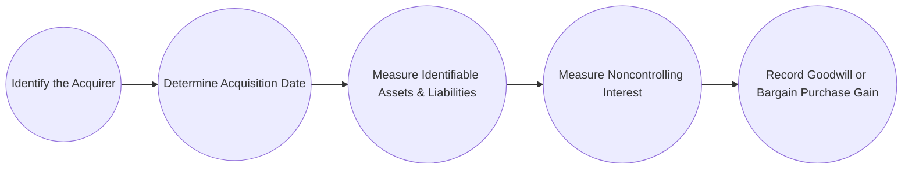

## 26.2 Business Combinations (Purchase Accounting, Goodwill, Noncontrolling Interests)

Business combinations are pivotal transactions that significantly impact financial statements, shaping how companies consolidate financial results, recognize goodwill, and measure any noncontrolling interest (NCI). Properly accounting for these transactions is a critical component of the Financial Accounting and Reporting (FAR) section of the Uniform CPA Examination. In this section, we delve into key aspects of purchase accounting under U.S. GAAP (ASC 805) and IFRS (IFRS 3), with particular attention to goodwill and NCI. In addition, we explore the practical application of these concepts using an illustrative case study and provide best practices to avoid common pitfalls.

---

### Overview of the Acquisition Method

Under both U.S. GAAP (ASC 805) and IFRS (IFRS 3), the acquisition method is the required approach for recognizing and measuring assets acquired and liabilities assumed in a business combination. This method replaces older methods such as the pooling of interests. The core principle is to reflect the acquisition at fair value, capturing the economic reality of the acquirer’s purchase.

Key steps in the acquisition method:
• Identify the acquirer.  
• Determine the acquisition date.  
• Recognize and measure the identifiable assets acquired, the liabilities assumed, and any noncontrolling interest.  
• Recognize and measure goodwill, or record a gain from a bargain purchase if consideration is less than the fair value of the net identifiable assets.

Below is a simple flowchart illustrating the acquisition method’s steps:

---

### Identifying the Acquirer

The first step in a business combination is to determine the “acquirer.” The acquirer is the entity that obtains control over the other. Factors that may indicate the acquirer include, but are not limited to, the relative voting rights in the combined entity, the composition of the board of directors, and any large minority holdings.

---

### Determining the Acquisition Date

The acquisition date is the date on which the acquirer obtains control. It corresponds to the date the acquirer effectively receives control over the acquired business’s assets and liabilities (which may be distinct from the closing date, but practically they often coincide). Accurate determination of this date is crucial, as fair values of the assets and liabilities are measured on this date.

---

### Measuring Identifiable Assets and Liabilities

On the acquisition date, the acquirer recognizes the acquiree’s identifiable assets and liabilities at their respective fair values. This includes tangible and intangible assets, contingent liabilities if certain criteria are met, and any previously unrecorded intangible assets that meet the recognition criteria (e.g., brand names, customer lists, technology, patents).

#### Recognizing Intangible Assets

Both U.S. GAAP and IFRS require separate recognition of intangible assets if they:
• Arise from contractual or legal rights; or  
• Are separable from the entity (capable of being sold, licensed, or otherwise transferred).

Whenever possible, intangible assets should be separately recognized to avoid inflating goodwill.

---

### Measuring the Noncontrolling Interest (NCI)

The noncontrolling interest represents the equity in a subsidiary not attributable to the parent (i.e., the portion owned by minority shareholders). Under U.S. GAAP, the NCI must be measured at fair value as of the acquisition date. IFRS permits two approaches:

1) Full Goodwill Method: Measure NCI at fair value (similar to U.S. GAAP).  
2) Partial Goodwill Method: Measure NCI based on the NCI’s proportionate share of the subsidiary’s net identifiable assets.

Depending on which method is used under IFRS, the recorded amount of goodwill can differ, as illustrated in the table below:

|                        | Full Goodwill Method                           | Partial Goodwill Method                            |
|------------------------|-----------------------------------------------|---------------------------------------------------|
| Measurement of NCI     | Fair value of the interest in the acquiree     | Proportionate share of the fair value of net assets |
| Goodwill Recognized    | Higher, includes goodwill attributable to the NCI | Lower, excludes goodwill attributable to the NCI     |
| Allowed By U.S. GAAP   | Yes (mandatory)                                | No                                                |
| Allowed By IFRS        | Yes                                            | Yes                                               |

---

### Recognizing and Measuring Goodwill (or Bargain Purchase)

Goodwill is measured as the residual amount of:
  
(Consideration transferred)  
+ (Fair value of any previously held equity interest in the acquiree)  
+ (Fair value of any noncontrolling interest in the acquiree)  
– (Fair value of the acquiree’s net identifiable assets).

Mathematically, under U.S. GAAP (full goodwill method), you could express it as:

Goodwill = C + FV(NCI) + FV(Previously Held Interest) – FV(Net Identifiable Assets)

Where:  
• C = Consideration transferred (cash, stock, or other assets).  
• FV(NCI) = Fair value of the noncontrolling interest.  
• FV(Previously Held Interest) = Fair value of any previously owned equity interest in the acquiree.  
• FV(Net Identifiable Assets) = Fair value of all recognized assets minus fair value of liabilities assumed.

If the fair value of the consideration transferred plus the fair value of NCI is less than the fair value of net identifiable assets, the acquirer recognizes a gain from a bargain purchase. Such occurrences are rare but do happen in distressed acquisitions.

---

### Step-by-Step Illustrative Example

Suppose Company A acquires an 80% controlling interest in Company B. Company A pays $400,000 in cash for the 80% stake. At the acquisition date, Company B’s net identifiable assets are fairly valued at $450,000. The fair value of the remaining 20% noncontrolling interest is $120,000 (based on actual market transactions or a valuation approach).

1) Identify the acquirer  
   • Company A is the acquirer because it gains control over Company B.

2) Determine the acquisition date  
   • The acquisition date is January 1, Year 1 (for this example).

3) Recognize and measure net identifiable assets  
   • Net identifiable assets = $450,000 (given).

4) Determine NCI  
   • Under U.S. GAAP, NCI must be recorded at fair value, which is $120,000.

5) Calculate Goodwill  
   Goodwill = (Consideration transferred + FV of NCI) – FV of net identifiable assets  
   = ($400,000 + $120,000) – $450,000  
   = $520,000 – $450,000  
   = $70,000  

Company A records on its consolidated balance sheet:
• Dr. Net identifiable assets: $450,000  
• Dr. Goodwill: $70,000  
• Cr. Cash: $400,000  
• Cr. Noncontrolling interest: $120,000  

#### IFRS Consideration Using Partial Goodwill

If IFRS partial goodwill were chosen, the measurement of NCI would be 20% of the $450,000 net identifiable assets = $90,000. Then goodwill under partial goodwill approach would be:

Goodwill = (Consideration transferred) – (80% × FV of net identifiable assets)  
          = $400,000 – (0.8 × $450,000)  
          = $400,000 – $360,000  
          = $40,000  

Under this scenario, consolidated goodwill is only $40,000, compared to $70,000 under the full goodwill method.

---

### Step Acquisitions

A “step acquisition” occurs when an acquirer previously held a noncontrolling (or controlling) interest in the acquiree and then acquires an additional ownership interest that either achieves or maintains control. The previously held interest must be remeasured to its fair value on the acquisition date, with any resulting gain or loss recognized in profit or loss.

Example: If Company A initially holds 30% of Company B and later acquires an additional 50% to achieve control, Company A must revalue its existing 30% stake to fair value before applying the acquisition method with the updated ownership percentage. The difference between the carrying amount and fair value of the preexisting stake is recorded as a gain or loss.

---

### Common Pitfalls, Challenges, and Best Practices

• Failure to Identify All Intangible Assets: Overlooking or misidentifying intangible assets artificially inflates goodwill and can lead to misstatements.  
• Mistiming the Acquisition Date: Fair values must be measured on the correct acquisition date. A difference of even a few days can significantly affect valuation.  
• Incorrect NCI Measurement: Under IFRS, using the partial goodwill method versus the full goodwill method can produce different goodwill amounts, so consistency and clarity in disclosures are crucial.  
• Contingent Consideration (Earnouts): Failing to properly record, measure, or update contingent consideration can lead to errors in subsequent measurements and financial statements.  
• Inadequate Disclosures: ASC 805 and IFRS 3 require extensive disclosures regarding the nature and financial impact of the combination. Vague or incomplete disclosures can undermine transparency.  
• Best Practice – Engage Valuation Experts Early: For intangible valuations, synergy analysis, or purchase price allocation, involve independent valuation specialists to reduce the risk of material misstatements.  

---

### IFRS vs. GAAP: Key Differences

• NCI Measurement: U.S. GAAP requires the full goodwill method, while IFRS allows both full and partial goodwill methods.  
• Gain on Bargain Purchase: Under both standards, a bargain purchase (where the fair value of net assets exceeds total purchase price) results in recognizing an immediate gain. Detailed disclosures are required due to the unusual nature of such transactions.  
• Contingent Consideration: While both standards follow a fair value approach at acquisition, IFRS handles subsequent measurement slightly differently if the contingency is a financial liability, potentially leading to variations over time.  
• Terminology and Presentation: IFRS refers to “Business Combinations (IFRS 3)” while U.S. GAAP addresses “Business Combinations (ASC 805)”. Subtle differences in guidance may affect the details of measurement and disclosure.

---

### Practical Tips for Exam Preparation

• Familiarize yourself with the precise definitions and recognition criteria for assets, liabilities, and intangible assets.  
• Understand the process for calculating goodwill under both the full and the partial goodwill approach.  
• Memorize the critical formula for goodwill, along with the definitions of each component (e.g., consideration, net assets, fair value of NCI, previously held interest).  
• Practice step acquisition scenarios, focusing on remeasuring the previously held interest.  
• Review relevant disclosures and practice short-scenarios to swiftly identify common pitfalls.  

---

### Additional References for Further Exploration

• FASB Accounting Standards Codification (ASC) 805: Business Combinations  
• IFRS 3: Business Combinations  
• AICPA Guides on Auditing Standard-Setters’ Pronouncements Related to Business Combinations  
• Chapter 26.1 of this text for an expanded overview of consolidated financial statements  
• Chapter 14 for more in-depth coverage on intangible assets and their recognition criteria  

---

## Comprehensive Business Combinations Mastery Quiz



### What is the first step in applying the acquisition method to a business combination?

- [ ] Measure the fair value of net identifiable assets.
- [ ] Determine the noncontrolling interest.
- [x] Identify the acquirer.
- [ ] Calculate goodwill.

> **Explanation:** The initial step is to identify which entity is the acquirer, as it determines how the subsequent steps (fair value measurement, determining NCI, and goodwill calculation) will be carried out.

### Which of the following is true when measuring a noncontrolling interest (NCI) under U.S. GAAP?

- [x] NCI must be measured at fair value on the acquisition date.
- [ ] NCI must be measured at the carrying value of net assets.
- [ ] NCI cannot be recognized until the next reporting period.
- [ ] NCI is measured only using the partial goodwill approach.

> **Explanation:** Under U.S. GAAP, ASC 805 requires that NCI be measured at fair value. IFRS allows an alternative (partial goodwill) but GAAP does not.

### In a business combination, which method involves measuring goodwill such that it includes the goodwill attributable to the noncontrolling interest?

- [ ] Partial goodwill method under IFRS.
- [x] Full goodwill method under both IFRS and U.S. GAAP.
- [ ] Pooling of interests method.
- [ ] None of the above.

> **Explanation:** The full goodwill method includes the portion of goodwill attributable to the noncontrolling interest. U.S. GAAP uses only the full goodwill method, whereas IFRS permits the choice of full or partial goodwill.

### If the total fair value of net identifiable assets exceeds the sum of consideration transferred plus the fair value of NCI, the acquirer:

- [ ] Does not record goodwill.
- [ ] Reduces the value of the acquired assets.
- [ ] Defers recognition of any difference.
- [x] Recognizes a gain on a bargain purchase.

> **Explanation:** Under ASC 805 and IFRS 3, if the purchase price (including NCI fair value) is below the fair value of net assets, the difference is recognized as a gain (commonly called a bargain purchase).

### What is a key advantage of engaging a valuation specialist early in a business combination?

- [x] More accurate fair value measurements.
- [ ] Reduced negotiation complexity between buyer and seller.
- [x] Lower risk of misstatements in intangible asset valuations.
- [ ] Elimination of the need for disclosures under ASC 805 or IFRS 3.

> **Explanation:** Valuation specialists help ensure correct valuations of intangible assets and fair values, thereby reducing misstatements and improving accuracy. They do not eliminate disclosure requirements.

### Which of the following describes a step acquisition?

- [x] When an investor obtains or increases control by acquiring an additional ownership interest after holding a prior investment.
- [ ] When the acquirer sells a portion of its shares in the acquiree, losing control.
- [ ] A transaction where two companies of similar size form a new entity.
- [ ] An acquisition completed in multiple asset-by-asset transactions without consolidated financial reporting.

> **Explanation:** A step acquisition involves the acquirer holding a prior stake in the target and acquiring additional interest to achieve or maintain control.

### Under IFRS, which approach can lead to lower reported goodwill in the consolidated balance sheet?

- [x] The partial goodwill approach.
- [ ] The full goodwill approach.
- [x] The proportionate share approach for NCI.
- [ ] The pooling-of-interests approach.

> **Explanation:** When IFRS partial goodwill is used, the NCI is measured at its proportionate share of net identifiable assets, leading to lower consolidated goodwill than under the full goodwill approach.

### In a business combination, which best describes intangible assets that should be recognized separately from goodwill?

- [x] Those that arise from contractual or legal rights, or can be separated and sold, licensed, or otherwise disposed of.
- [ ] Only trademarks and licenses.
- [ ] None; all intangible assets are subsumed into goodwill.
- [ ] Any intangibles that have uncertain fair values.

> **Explanation:** Both U.S. GAAP (ASC 805) and IFRS (IFRS 3) require that identifiable intangible assets be recognized separately from goodwill if they meet the criteria of arising from contractual or legal rights or being separately transferable.

### When the acquirer already owns 30% of a target’s shares and acquires another 40% to achieve control, how is the preexisting 30% interest treated?

- [x] It is remeasured to fair value on the acquisition date, with any gain or loss recognized in income.
- [ ] It is carried forward at its previous book value.
- [ ] It is recorded as additional paid-in capital.
- [ ] It is recognized as a distribution to shareholders.

> **Explanation:** Step acquisitions require the previously held interest to be remeasured at fair value, recognizing any resulting gain or loss in the income statement at the acquisition date.

### Under U.S. GAAP, the partial goodwill method is permitted.

- [x] False
- [ ] True

> **Explanation:** Under ASC 805, the only permissible method is the full goodwill approach. IFRS, however, allows both partial and full goodwill methods.



---

## For Additional Practice and Deeper Preparation

**[FAR CPA Hardest Mock Exams: In-Depth & Clear Explanations](https://www.udemy.com/course/far-cpa-mock-exams/?referralCode=F88050F8D5C76764F6BD)**  

**Financial Accounting and Reporting (FAR) CPA Mocks:** 6 Full (1,500 Qs), Harder Than Real! In-Depth & Clear. Crush With Confidence!

- Tackle full-length mock exams designed to mirror real FAR questions.  
- Refine your exam-day strategies with detailed, step-by-step solutions for every scenario.  
- Explore in-depth rationales that reinforce higher-level concepts, giving you an edge on test day.  
- Boost confidence and minimize anxiety by mastering every corner of the FAR blueprint.  
- Perfect for those seeking exceptionally hard mocks and real-world readiness.  

_Disclaimer: This course is not endorsed by or affiliated with the AICPA, NASBA, or any official CPA Examination authority. All content is for educational and preparatory purposes only._
