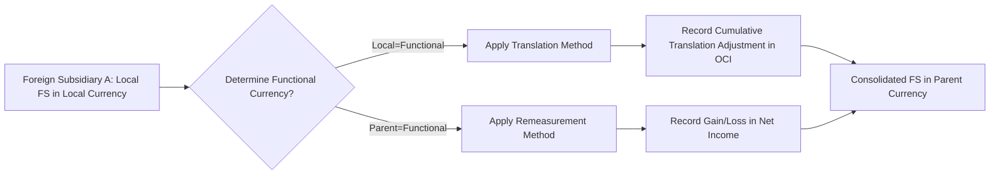

## 26.3 Foreign Currency Transactions, Translation, and Remeasurement (Overview)

In an increasingly globalized marketplace, entities often engage in transactions denominated in currencies other than their own. Such transactions introduce a layer of complexity into the accounting process, particularly when determining how amounts should be initially recorded, how they should be translated for consolidated financial statements, and how currency fluctuations should be reported on the income statement or other comprehensive income (OCI). This section offers an overview of foreign currency transactions, the distinction between translation and remeasurement, the classification of functional vs. reporting currencies, and how currency effects appear in the financial statements under U.S. GAAP and IFRS.

By the end of this overview, you should be able to:
• Differentiate between translation and remeasurement methods.  
• Identify an entity’s functional currency vs. its reporting (presentation) currency.  
• Understand how gains and losses from foreign currency activities impact net income vs. OCI.  
• Recognize IFRS-vs.-GAAP distinctions.  
• Apply best practices and avoid common pitfalls when dealing with exchange rate changes.

---

Definition of Foreign Currency Transactions

Foreign currency transactions arise whenever an entity conducts business in a currency other than its own functional currency. For example, a U.S.-based company that buys raw materials from a supplier in Japan and denominates the invoice in Japanese yen ([¥]) is engaged in a foreign currency transaction. Depending on the time horizon and the currency volatility, the amount recognized in the company’s functional currency could vary significantly from the original transaction date to the settlement date.

Common examples of foreign currency transactions include:
• Importing goods or services in a different currency.  
• Exporting goods or services, receiving payment in a foreign currency.  
• Borrowing or lending funds in a foreign currency.  
• Acquiring or disposing of assets (such as property, plant, or equipment) denominated in a foreign currency.

---

Functional vs. Reporting Currency

One of the most critical decisions in accounting for foreign currency transactions is identifying the entity’s functional currency. The functional currency is the primary currency in which an entity operates and/or generates cash flows. Under U.S. GAAP (ASC 830) and IFRS (IAS 21), the following factors typically help determine the functional currency:

• Currency that mainly influences sales prices for goods and services.  
• Currency that mainly influences the labor, material, and other cost components of providing goods or services.  
• Currency in which an entity’s financing activities are denominated.  
• Currency in which receipts from operating activities are retained.

In many cases, an entity’s local currency is the functional currency, but this is not always true. For instance, a subsidiary located in a high-inflation economy might use the U.S. dollar or another stable currency as its functional currency.

The reporting currency (or presentation currency) is the currency in which an entity presents its financial statements. A multinational corporation headquartered in the U.S. might consolidate statements in U.S. dollars, even if subsidiaries maintain different functional currencies at their own level.

---

Translation vs. Remeasurement: Key Distinctions

When a subsidiary’s functional currency differs from the parent’s reporting currency, the parent must restate the subsidiary’s financial statements into the parent’s reporting currency. Two distinct processes are generally used:

• Translation (also known as the Current Rate Method): This method is used when the subsidiary’s functional currency is its local currency. The subsidiary’s financial statements (originally prepared in the local functional currency) are translated into the parent’s reporting currency, typically using period-end (spot) exchange rates for assets and liabilities and average rates for revenues and expenses. Gains or losses arising from translation are reported in Other Comprehensive Income (OCI).

• Remeasurement (also known as the Temporal Method): This method is used when the subsidiary’s functional currency is not its local currency—for example, if the subsidiary is operating in an environment where the local currency is subject to hyperinflation, or if the day-to-day operations effectively use the reporting currency of the parent as the main economic driver. Under remeasurement, monetary assets and liabilities are restated using the current exchange rate, while nonmonetary items (e.g., inventory carried at cost, fixed assets) use historical rates. Gains or losses arising from remeasurement generally appear on the income statement.

---

Diagram: Determining Translation vs. Remeasurement

Below is a simple visual guide in Mermaid.js, illustrating how to decide whether to apply translation or remeasurement when converting a subsidiary’s financials into the reporting currency.

```mermaid
flowchart LR
    A[Start] --> B{Is Local Currency the Functional Currency of the Subsidiary?}
    B -- Yes --> C[Use Translation (Current Rate Method)]
    B -- No --> D[Use Remeasurement (Temporal Method)]
    C --> E[Translate Gains/Losses to OCI]
    D --> F[Remeasurement Gains/Losses to Net Income]
```

Explanation:  
1. Determine if the local currency is indeed the functional currency for the subsidiary's operations.  
2. If yes, use translation rules, resulting in a foreign currency translation adjustment reported in OCI.  
3. If no, use remeasurement rules, resulting in a foreign currency gain or loss recorded in the income statement.

---

Impact on the Financial Statements

Foreign currency transactions, translation, and remeasurement have significant implications for the balance sheet, income statement, and statement of comprehensive income (OCI). Below is a summary of how these impacts vary under translation vs. remeasurement.

Balance Sheet:  
• Translation Method: Assets and liabilities are translated at the current exchange rate on the reporting date. Equity items (except for retained earnings) are translated using historical rates, and retained earnings is computed through the translated net income (and dividends).  
• Remeasurement Method: Monetary assets and liabilities (e.g., cash, receivables, payables) are remeasured at the current exchange rate; nonmonetary assets and liabilities (e.g., inventory carried at cost, property, plant, & equipment) are remeasured at historical rates.

Income Statement:  
• Translation Method: All income statement line items are translated at the average exchange rate for the reporting period, producing a translated net income. The resulting translation adjustment goes to OCI.  
• Remeasurement Method: Income statement items related to nonmonetary elements (e.g., depreciation for PP&E measured at historical cost) are remeasured at historical rates. Other items are remeasured using average or current rates, resulting in foreign exchange gains or losses that flow directly to the income statement.

Comprehensive Income:  
• Under translation, the cumulative translation adjustment is reported in OCI. When the foreign entity is sold, the amount is “recycled” from accumulated OCI into net income.  
• Under remeasurement, gains or losses arising from currency fluctuations affect net income immediately.

---

Comprehensive Example

Consider a simplified scenario illustrating translation:

• Parent’s reporting currency: U.S. dollar (USD).  
• Subsidiary’s local currency: Euro (EUR).  
• Subsidiary’s functional currency: Euro.  
• Exchange rates:  
  – January 1 (start of year): 1 EUR = 1.10 USD  
  – December 31 (end of year): 1 EUR = 1.20 USD  
  – Average rate for the year: 1 EUR = 1.15 USD  

The subsidiary’s trial balance (in EUR) at year-end includes:  
• Cash (monetary asset): €100,000  
• Inventory (nonmonetary, carried at cost, all purchased mid-year): €50,000  
• Fixed assets (historical, purchased in prior years): €200,000  
• Liabilities (monetary): €75,000  
• Common stock (issued at entity formation): €150,000  
• Retained earnings (beginning, no dividends declared): €50,000  
• Sales revenue: €300,000  
• Operating expenses: €225,000  

Applying the Translation Method:  
1) Balance Sheet Items at December 31:  
   – Cash and Liabilities are translated at the December 31 exchange rate (1 EUR = 1.20 USD).  
   – Inventory is also translated at 1.20 USD/EUR because under the translation method, all assets and liabilities use the current rate.  
   – Fixed assets also use the December 31 exchange rate.  
   – Common stock uses the historical exchange rate at the date of issuance (assume 1.00 USD/EUR if that was the rate at issuance).  
2) Income Statement Items:  
   – Sales revenue (€300,000) and operating expenses (€225,000) are typically translated at the average rate of 1.15 USD/EUR.  

The net result is recognized as translated net income in USD, and the difference in equity resulting from the translation is recorded in an equity account called the “Cumulative Translation Adjustment,” which is part of OCI rather than net income.

By contrast, if the functional currency was determined to be the parent’s currency (USD), we would use the remeasurement (temporal) method. Monetary items would still be converted using the current rate, but nonmonetary assets (e.g., inventory, PP&E) would remain at their historical exchange rates. Any mismatch in remeasurement flows through net income as a foreign exchange gain or loss, rather than going to OCI.

---

Common Pitfalls and Best Practices

Pitfalls:
• Misidentifying the Functional Currency: If the entity incorrectly selects its local currency as the functional currency, the resulting financial statements might reflect inappropriate forex adjustments in OCI when they should be recognized in net income.  
• Inconsistent Application of Historical Rates: Nonmonetary items require consistent application of historical exchange rates under the remeasurement method. Failing to track these rates accurately can lead to measurement errors.  
• Overlooking Intercompany Transactions: Intercompany trading or loans can create foreign currency exposures not captured in consolidated statements if not properly eliminated or remeasured.  
• Ignoring Tax Implications: Certain countries’ tax laws may treat foreign exchange gains/losses differently. Failing to consider these can result in inaccurate tax provisions.

Best Practices:
• Establish Clear Policies: Develop internal documentation that defines functional currency determination criteria, exchange rate sources, and cut-off procedures.  
• Maintain Detailed Records of Historical Rates: For remeasurement purposes, ensure that the accounting system can store historical exchange rates for assets and liabilities.  
• Reconcile Translational Adjustments: Periodically reconcile the amount in the cumulative translation adjustment (CTA) account in OCI to ensure it aligns with changes in exchange rates and subsidiary net assets.  
• Monitor IFRS and GAAP Updates: Currency-related accounting standards may evolve, especially in economies subject to chronic inflation or government interventions. Stay updated with any guidance changes.

---

IFRS vs. GAAP: Key Differences

While IFRS (IAS 21) and U.S. GAAP (ASC 830) share many similarities in accounting for foreign currency, some nuanced differences persist:

• Economic Indicators: Both sets of standards require evaluating which currency primarily drives an entity’s operations, but IFRS provides slightly more guidance and emphasis on underlying economic factors, while U.S. GAAP focuses more directly on the concept of functional currency.  
• Hyperinflationary Economies: IFRS has a separate standard (IAS 29) for hyperinflationary economies. Under IAS 21, certain adjustments must be made before translating financial statements according to IAS 29. Although U.S. GAAP addresses hyperinflation in ASC 830, specific guidance is not as comprehensive as IFRS.  
• Disclosure Requirements: While similar overall, IFRS often requires slightly more narrative disclosures about the judgements made to determine the functional currency, and the effect of changes in exchange rates on the entity’s operations.

---

Practical Applications and Real-World Scenarios

• Hedging Foreign Currency Exposure: Many entities attempt to mitigate currency risk through forward contracts or other derivatives. These hedges can significantly affect the accounting treatment for foreign currency exchange differences. Hedging strategies may shift certain realized or unrealized gains and losses from net income to OCI or vice versa, depending on the type of hedge and the standards applied (ASC 815 or IFRS 9).  
• Multi-Layered Subsidiaries: A parent company in the U.S. might have a subsidiary in Europe, which then has a sub-subsidiary in Asia. Each level might have a different functional currency. A thorough understanding of how each sub-entity’s financials are consolidated up the chain is vital.  
• Foreign Currency Debt: When an entity borrows in a currency different from its functional currency, the exchange rate movements can cause swings in net income if remeasurement is required. By contrast, if the borrowed currency matches the functional currency, minimal exchange rate remeasurement is required.  

---

Mermaid Diagram: Overall Process Flow

Below is a simplified depiction of the integrated process of foreign currency accounting, translation/remeasurement, consolidation, and final presentation.



---

References for Further Exploration

• FASB Accounting Standards Codification (ASC) 830: Foreign Currency Matters  
• IFRS (IAS) 21: The Effects of Changes in Foreign Exchange Rates  
• IFRS (IAS) 29: Financial Reporting in Hyperinflationary Economies  
• AICPA Publications on Consolidation and Foreign Currency Accounting  
• Professional journals such as Journal of Accountancy for articles detailing best practices and case studies  

Foreign currency topics can be complex, and ongoing guidance changes may affect specific treatments. Always consult the most recent standards and accounting pronouncements to ensure compliance.

---

## Test Your Knowledge: Foreign Currency Translation & Remeasurement Quiz



### A U.S. parent company prepares consolidated financial statements in USD. One of its foreign subsidiaries operates in an environment where the local currency is the primary driver of economic activity. Which method is typically used to bring the subsidiary’s financial statements into USD?  
- [ ] Remeasurement (Temporal Method)  
- [x] Translation (Current Rate Method)  
- [ ] Both methods simultaneously  
- [ ] Translation for assets, remeasurement for liabilities  

> **Explanation:** When the local currency is the functional currency, the subsidiary’s financial statements are translated into the reporting currency using the current rate (translation) method.  

### Which of the following describes a key difference between foreign currency translation and remeasurement?  
- [x] Translation gains/losses are recognized in OCI, whereas remeasurement gains/losses are recognized in net income.  
- [ ] Translation gains/losses are recognized only on monetary assets.  
- [ ] Remeasurement gains/losses are always recognized in OCI.  
- [ ] Under translation, exchange differences are recorded in retained earnings.  

> **Explanation:** Using translation (current rate method), currency fluctuations hit the CTA, found in OCI. With remeasurement (temporal method), they flow directly to the income statement.  

### Which of the following items is typically measured at the historical exchange rate under the temporal (remeasurement) method?  
- [ ] Cash in the bank  
- [ ] Trade receivables  
- [x] Property, plant, and equipment  
- [ ] Accounts payable  

> **Explanation:** Nonmonetary assets like property, plant, and equipment are remeasured at the historical rate under the temporal method. Monetary items (cash, receivables, and payables) are remeasured at the current exchange rate.  

### An entity in Japan expresses its invoices in U.S. dollars rather than Japanese yen. If the entity’s operations are primarily conducted using U.S. dollars for pricing and financing, which currency is likely the functional currency of this Japanese entity?  
- [ ] Japanese yen  
- [x] The U.S. dollar  
- [ ] Euro  
- [ ] It depends on IFRS and not GAAP  

> **Explanation:** The functional currency is the currency that most influences the entity’s economic environment. In this scenario, the U.S. dollar plays that central role.  

### When a foreign entity’s functional currency is deemed to be its local currency, what line item typically captures the foreign currency translation adjustment in the consolidated financial statements?  
- [x] Other Comprehensive Income (OCI)  
- [ ] Net Income under Other Expenses/Income  
- [x] A separate line within Shareholders’ Equity  
- [ ] A contra-revenue account  

> **Explanation:** Translation adjustments accumulate in OCI (often within a “Cumulative Translation Adjustment” or CTA account in equity), separate from net income.  

### Under U.S. GAAP, which of the following would be used to translate income statement items if the local currency is the entity’s functional currency?  
- [ ] Historical exchange rate  
- [ ] Spot rate at year-end  
- [x] Weighted-average exchange rate over the period  
- [ ] Forward hedge rate  

> **Explanation:** Income statement items are generally translated using the average exchange rate for the reporting period when applying the translation (current rate) method.  

### Under the remeasurement method, which exchange rate is applied to nonmonetary revenue and expense items (e.g., depreciation expense on equipment carried at historical cost)?  
- [x] Historical exchange rate at the time of asset acquisition  
- [ ] Current rate at the time of expense recognition  
- [x] Average rate for the year  
- [ ] Fair value currency rate at the time of settlement  

> **Explanation:** Depreciation expense on equipment carried at historical cost is remeasured at the same historical rate used for the related nonmonetary asset. Often, if the acquisition or cost has a single historical date, that exchange rate is used.  

### If a U.S. parent decides to sell its foreign subsidiary whose financial statements were translated into USD using the current rate method, which of the following statements is correct regarding the cumulative translation adjustment (CTA)?  
- [x] It is reclassified from OCI to net income at the time of sale.  
- [ ] It remains in OCI permanently.  
- [ ] It is amortized over future periods.  
- [ ] It converts into dividends.  

> **Explanation:** Upon disposal of a foreign entity, any accumulated translation adjustment in OCI is reclassified (“recycled”) into net income in the period of disposal.  

### Under IFRS, which standard provides guidance on the effects of changes in foreign exchange rates?  
- [x] IAS 21  
- [ ] IFRS 2  
- [ ] IFRS 9  
- [ ] IAS 33  

> **Explanation:** IAS 21 outlines how to account for the effects of foreign exchange rate changes, including functional currency determination, translation, and remeasurement practices.  

### Under both U.S. GAAP and IFRS, translation adjustments related to foreign currency transactions that qualify as hedges can be initially reported in:  
- [x] True  
- [ ] False  

> **Explanation:** Under certain hedge accounting treatments (e.g., cash flow hedges), foreign exchange gains or losses may be deferred in OCI until the hedged transaction affects earnings.  



---

## For Additional Practice and Deeper Preparation

**[FAR CPA Hardest Mock Exams: In-Depth & Clear Explanations](https://www.udemy.com/course/far-cpa-mock-exams/?referralCode=F88050F8D5C76764F6BD)**  

**Financial Accounting and Reporting (FAR) CPA Mocks:** 6 Full (1,500 Qs), Harder Than Real! In-Depth & Clear. Crush With Confidence!

- Tackle full-length mock exams designed to mirror real FAR questions.  
- Refine your exam-day strategies with detailed, step-by-step solutions for every scenario.  
- Explore in-depth rationales that reinforce higher-level concepts, giving you an edge on test day.  
- Boost confidence and minimize anxiety by mastering every corner of the FAR blueprint.  
- Perfect for those seeking exceptionally hard mocks and real-world readiness.  

_Disclaimer: This course is not endorsed by or affiliated with the AICPA, NASBA, or any official CPA Examination authority. All content is for educational and preparatory purposes only._
