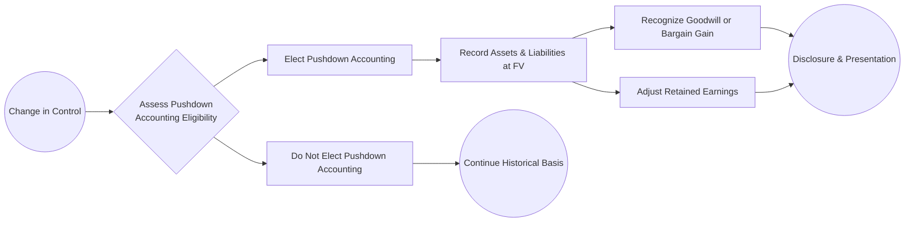
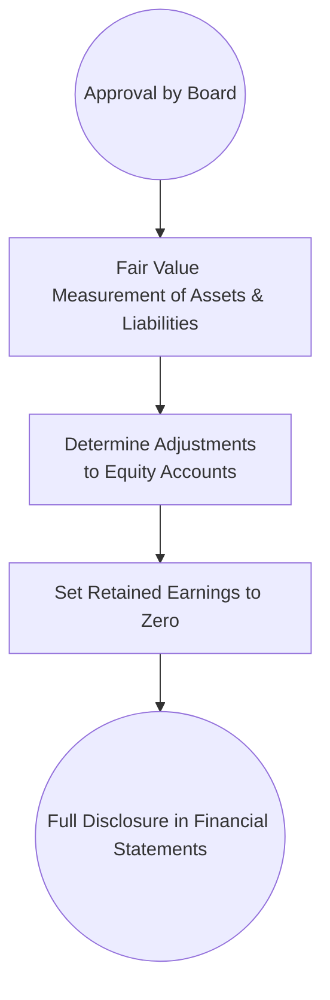

## 26.4 Additional Advanced Topics: Pushdown Accounting Revisited, Quasi Reorganizations

Pushdown accounting and quasi reorganizations represent advanced topics that typically arise under very specific circumstances. Understanding these specialized areas is essential for CPA candidates who need to be able to tackle complex business scenarios and apply the appropriate guidance in accordance with U.S. GAAP. Although both of these topics can seem obscure, they create noteworthy exceptions to many of the standard accounting principles explored in earlier chapters. This section serves as a practical guide, offering detailed insights, illustrative diagrams, and clear examples.

---

### Pushdown Accounting Revisited

#### Overview and Key Concepts

Pushdown accounting occurs when a new controlling entity (e.g., a parent company acquiring a significant ownership stake) “pushes down” the stepped-up or fair value basis of the assets and liabilities to the acquired entity’s separate financial statements. In simpler terms, the acquired entity adopts the acquirer’s new basis of accounting for some or all its assets and liabilities.

Key reasons pushdown accounting might be applied include:
• A significant change in ownership control (such as a business combination).  
• A desire by the acquirer for the acquiree’s standalone financial statements to reflect the transaction’s economics.  
• SEC considerations, especially if the acquired entity will file separate financial statements (e.g., for regulatory or investor reporting).

Historically, pushdown accounting was optional under certain circumstances. However, the Financial Accounting Standards Board (FASB), through the Codification (ASC 805-50 and related SEC guidance), clarified how pushdown accounting can be elected or declined under specific conditions.

#### When to Apply Pushdown Accounting

Pushdown accounting is available (and sometimes required by regulators) when an acquirer gains control of a target entity. Control is typically defined as:
• Greater than 50% ownership of voting equity (often 80% for tax consolidation purposes, but 50%+ is the baseline for financial reporting control).  
• Certain contractual or governance provisions granting control, even without majority ownership.  
• Legal reorganizations resulting in a step-up in basis.

Under GAAP, after a change-of-control event, the acquired entity can elect to adopt the acquirer’s basis of accounting in its own standalone financial statements. Once adopted, pushdown accounting generally cannot be reversed without compelling justification.

#### Accounting Steps Under Pushdown Accounting

1) Identify the Fair Values: The acquired entity, in consultation with the acquiring parent, determines the fair values of its assets and liabilities as of the acquisition date.  
2) Recognize Goodwill or Bargain Purchase Gains: If the fair value of net assets acquired is lower than the consideration paid, goodwill is recognized on the acquired entity’s books. If greater, a bargain purchase gain could be recognized in accordance with ASC 805.  
3) Record Transaction-Related Adjustments: Mark intangible assets (such as customer lists, patents, brand names) to fair value. Reflect any required asset impairments or intangible recognition.  
4) Adjust Equity Accounts: The acquired entity’s pre-acquisition retained earnings and other equity accounts are typically re-measured as part of the pushdown adjustments.  
5) Disclosures: Robust disclosure is critical. The acquired entity must state that it adopted pushdown accounting, disclose the fair value measurements used, and any remaining intangible assets or goodwill.

Below is a Mermaid diagram illustrating the pushdown accounting decision process:

Explanation of the Diagram:  
• A new controlling interest triggers an assessment of pushdown accounting.  
• Management decides whether to elect pushdown accounting.  
• If elected, the entity’s books reflect the new fair values, plus goodwill or bargain purchase gains.  
• If not elected, it continues to report under the historical basis.

#### Common Pitfalls and Considerations

• Determining Fair Values: Complex valuations (e.g., intangible assets, specialized equipment) can require third-party valuations and subject the financial statements to potential measurement error.  
• Goodwill Impairment Testing: Once goodwill is recorded at the acquiree level, the entity must perform annual or triggering-event-based impairment tests.  
• Reversal Restriction: After applying pushdown accounting, reverting to historical cost is generally disfavored.  
• Consolidation Implications: Parent financial statements also must reflect fair values from the combination date, but pushdown accounting specifically affects the separate (standalone) financial statements of the acquired entity.

#### IFRS Perspective

Unlike U.S. GAAP, IFRS does not explicitly recognize the concept of “pushdown accounting” in the same manner. Under IFRS 3 (Business Combinations), the acquirer determines fair values for consolidated financial statements; however, IFRS does not require or provide separate guidance for “pushing down” these values to the acquired entity’s standalone financials. This leads to potential differences between IFRS and U.S. GAAP in practice.

---

### Quasi Reorganizations

#### Definition and Key Concepts

A quasi reorganization is a voluntary, one-time accounting technique where a company reorganizes its equity accounts as if it were a fresh start, freeing itself from historical accumulated deficits (or other unfavorable aspects of equity). The rationale is typically to reflect an improved financial position more accurately by eliminating “old baggage” from the retained earnings or accumulated losses column.

Key points include:  
• Rarely used in modern times, but still permissible under U.S. GAAP.  
• The entity revalues its assets and liabilities to fair value, thereby ensuring that no hidden losses or gains remain in the accounts.  
• Retained earnings (or accumulated deficit) is set to zero, giving the appearance of a fresh start for the entity’s equity section.  
• Disclosure is essential, as quasi reorganizations can significantly change the appearance of goodwill, intangible assets, and capital accounts.

Unlike a legal reorganization (such as bankruptcy), a quasi reorganization does not necessarily require court approval. However, it must follow authoritative guidance from historical literature (e.g., SEC’s Staff Accounting Bulletin and ASC references) and must be clearly justified.

#### When to Use a Quasi Reorganization

Companies typically consider a quasi reorganization when:  
• Accumulated deficits skew the perception of the entity’s current financial health.  
• A fundamental event or strategic change has occurred, such that the old deficits no longer reflect the current entity’s prospects.  
• The company wishes to attract new investors or creditors by “cleaning up” the balance sheet from prior poor performance or large write-downs.

It is considered a drastic measure and not to be undertaken lightly. In many cases, external stakeholders (investors, lenders, regulators) may view a quasi reorganization skeptically if it simply masks ongoing financial problems.

#### Steps for Implementing a Quasi Reorganization

1) Board Approval: The company’s board formally approves a quasi reorganization and sets a “fresh start” date.  
2) Asset and Liability Revaluation: Similar to pushdown accounting, assets and liabilities are measured at their fair values. This update to book values ensures the equity section after reset is as accurate as possible.  
3) Elimination of Deficits: The accumulated deficits (if any) are adjusted against other equity accounts (e.g., additional paid-in capital) to bring retained earnings to zero.  
4) Disclosure in Financial Statements: The entity must fully disclose the rationale, date, and amounts of significant adjustments. Footnotes often include an explanation of how asset revaluations were determined.

Here is a Mermaid diagram illustrating the quasi reorganization process:

Explanation of the Diagram:  
• The process starts with formal approval.  
• Assets and liabilities are re-measured at fair value.  
• Equity is then adjusted so the new retained earnings balance is zero.  
• Full disclosure in the notes ensures transparency for users of the financial statements.

#### Key Accounting and Disclosure Requirements

• Marking Assets to Fair Value: Similar to pushdown accounting, a quasi reorganization may require complex valuation analyses for intangible assets, property, plant, and equipment, or any revaluation allowances.  
• Offsetting Deficits: Accumulated deficits are offset against other equity (often Additional Paid-In Capital). If APIC is not sufficient, the entity may have to reevaluate the feasibility of the quasi reorganization transaction.  
• Rationale for Quasi Reorganization: A thorough explanation is necessary in the footnotes, clarifying the board’s justification and the expected impact on future operations.  
• Internal Controls and Procedures: The reorganization often involves a series of adjusting journal entries. Companies must maintain robust documentation for auditing and external review.

#### Illustrative Example of a Quasi Reorganization

Suppose Company Z had $2 million of accumulated deficit. The board decides to undertake a quasi reorganization to attract new investors:

• Fair Value Adjustments:  
  – Buildings increased by $300,000 (from $1.7 million to $2.0 million).  
  – An obsolete line of equipment is written off at $100,000.  
• Net effect on Building and Equipment: +$200,000  
• Additional Paid-In Capital (APIC) is $3 million.  
• Retained Earnings stands at -$2 million.

Steps Taken:  
1) Adjust Buildings and Equipment for fair values:  
   Dr. Buildings $300,000  
   Cr. Equipment $100,000  
   Cr. Loss on Equipment Write-down $200,000 (net effect of $100,000 write-down is recognized; $300,000 building increase is recognized as a revaluation increment—exact classification may vary based on synergy of the net effect)  

   (Note: This partial entry reflects that some amounts may go to revaluation or other income statement accounts depending on the guidance followed. In some cases, the net effect is recognized in equity. Detailed handling can be complex and requires thorough review of the relevant ASC sections, especially if revaluation is done outside normal revaluation increments.)

2) Eliminate Accumulated Deficit with APIC:  
   Dr. APIC $2,000,000  
   Cr. Retained Earnings $2,000,000  

Retained Earnings post quasi reorganization = $0.00  

Final Step: Disclosure.  
Company Z discloses the quasi reorganization’s effective date, the rationale for the fair value adjustments, and the offsetting of deficits. All future earnings from that point will accumulate from zero.

#### IFRS Perspective

IFRS does not address quasi reorganizations to the same degree as U.S. GAAP. Although there may be certain “fresh start” accounting conditions, commonly seen in reorganization under bankruptcy, IFRS does not offer a general framework for voluntarily resetting retained earnings. Entities seeking IFRS-based solutions often must rely on principles in IAS 1 (Presentation of Financial Statements) and IFRIC interpretations pertaining to capital structure. The absence of explicit IFRS guidance explains why quasi reorganizations remain primarily a U.S. GAAP phenomenon.

---

### Real-World Considerations and Best Practices

1) Timing: Both pushdown accounting and quasi reorganizations require precise, well-documented “triggering events.” For pushdown accounting, it is the date control is obtained. For quasi reorganizations, it is the date formally authorized by the board or shareholders.  
2) Valuation Expertise: Engaging certified valuation professionals often becomes essential to measure fair values reliably, especially for intangible assets or specialized machinery.  
3) Transparency: Both pushdown accounting and quasi reorganizations can significantly alter an entity’s financial statements. Thorough disclosures build stakeholder trust and reduce potential misinterpretation by investors or regulators.  
4) Risk of Abuse: While pushdown accounting aligns the acquiree’s standalone statements with the acquirer’s cost basis, it can mask historical performance trends. Quasi reorganizations can eliminate historical deficits, but the underlying reasons for those deficits may still be relevant to users.  
5) Regulatory Scrutiny: The SEC has historically scrutinized pushdown accounting elections and quasi reorganizations. Publicly traded companies should ensure compliance with SEC guidance, including relevant Staff Accounting Bulletins.

---

### Comprehensive Case Study: Merging Both Concepts

Consider a scenario where a private equity firm (PEF) acquires a 90% stake in Company A. Immediately after the acquisition, Company A elects pushdown accounting to align its standalone statements with the new fair values recognized by PEF. Company A’s newly recognized intangible assets include a patent portfolio, brand intangibles, and goodwill.

Six months later, the new management team discovers that Company A has a deeply negative retained earnings balance, mostly stemming from large write-offs in prior years. They propose a quasi reorganization to reset retained earnings to zero, anticipating an initial public offering in the near term.

The combined effect of pushdown accounting followed by a quasi reorganization in a single fiscal year draws a high level of audit and regulatory scrutiny. Key steps include:

• Finalizing fair values for intangible assets at the acquisition date (pushdown accounting).  
• Disclosing pushdown election and intangible valuations in the footnotes.  
• Six months post-acquisition, performing a quasi reorganization: revaluing any additional changes, ensuring intangible assets remain accurately stated, eliminating historical deficits, and clarifying newly established retained earnings.  
• Providing robust footnotes detailing the rationale for both transactions, the sequence of events, and their net effect on the balance sheet and statement of operations.

This kind of scenario underscores the complexity and interconnectedness of advanced accounting topics. It highlights why professionals must carefully plan and coordinate across multiple teams—finance, legal, valuation experts, and auditors—to ensure compliance and clarity.

---

### Potential Challenges and Strategies to Overcome

• Challenge: Determining which intangible assets require recognition and whether they should be amortized or tested for impairment.  
  – Strategy: Conduct thorough intangible asset recognition analysis, referencing ASC 805 for business combinations and intangible asset guidelines in ASC 350.  

• Challenge: Differentiating between pushdown accounting and quasi reorganization steps.  
  – Strategy: Use detailed project plans and flowcharts (like the Mermaid diagrams provided above) to track and document each step.  

• Challenge: Ensuring no double-counting of fair value adjustments.  
  – Strategy: Keep a master schedule of fair value recognized at pushdown and any subsequent changes under the quasi reorganization.  

• Challenge: Obtaining stakeholder buy-in and understanding for these unique accounting treatments.  
  – Strategy: Provide clear, transparent disclosures and engage in early and frequent communication with investors, creditors, and regulatory bodies.

---

### References for Further Exploration

• ASC 805 (Business Combinations) – Guidance for measuring assets and liabilities in a business combination and pushdown accounting.  
• SEC Staff Accounting Bulletins – Historical clarifications and commentary regarding pushdown accounting.  
• Accounting Research Bulletins and SEC pronouncements on quasi reorganizations.  
• IAS 1 (IFRS) – For understanding IFRS-based capital structure changes. Although not directly addressing quasi reorganizations, it provides a framework for capital restructuring.  

Professionals seeking deeper insights should consult the FASB Codification and consider specialized webinars or continuing professional education (CPE) courses that focus on advanced M&A accounting and corporate reorganizations.

---

## Quiz: Pushdown Accounting and Quasi Reorganizations



### Pushdown accounting usually occurs when
- [ ] a subsidiary declares bankruptcy.  
- [x] a business is acquired and the acquirer obtains a controlling interest.  
- [ ] a company issues an initial public offering (IPO).  
- [ ] an entity adopts the cash-basis of accounting.  

> **Explanation:** Pushdown accounting is specifically triggered by a change in control. This approach is used to “push down” the new fair value basis from the acquirer to the acquiree’s standalone financials.

### Which of the following best describes the key objective of pushdown accounting?
- [ ] To mask the acquiree’s historical performance.  
- [ ] To comply with IFRS requirements for new assets.  
- [x] To align the acquiree’s financial statements with the acquirer’s basis of accounting.  
- [ ] To eliminate a backlog of unrecognized intangible assets.  

> **Explanation:** Pushdown accounting helps the acquiree reflect the fair values and basis of accounting used by the new controlling parent, ensuring consistency and transparency in financial reporting.

### In pushdown accounting, goodwill recognized on the date of control is typically recorded
- [x] on the acquired entity’s separate financial statements.  
- [ ] only on the parent’s consolidated financial statements.  
- [ ] nowhere, as goodwill is never recorded under pushdown.  
- [ ] on the balance sheet as a contra-asset.  

> **Explanation:** When pushdown accounting is elected, goodwill is recorded on the acquiree’s books in addition to the acquirer’s consolidated financial statements.

### Under U.S. GAAP, quasi reorganizations are used primarily to
- [ ] reorganize debt under creditor supervision.  
- [ ] horizontal consolidation of subsidiaries.  
- [x] eliminate accumulated deficits and revalue assets to fair value.  
- [ ] finalize a bankruptcy procedure.  

> **Explanation:** Quasi reorganizations aim to “reset” retained earnings to zero while ensuring assets and liabilities are fairly valued and old deficits are removed from the equity section.

### A key difference between pushdown accounting and quasi reorganizations is
- [x] pushdown accounting is triggered by a change in ownership control, whereas quasi reorganizations are initiated by the entity’s choice to reset equity.  
- [ ] both are recognized only under IFRS.  
- [ ] quasi reorganizations are mandatory, whereas pushdown accounting is always optional.  
- [ ] pushdown accounting does not involve fair value measurements.  

> **Explanation:** Pushdown accounting arises from an external ownership event, whereas quasi reorganizations result from an internal decision to restructure the balance sheet.

### When performing a quasi reorganization, one of the critical steps is
- [ ] recognizing gain contingencies immediately.  
- [x] revaluing assets and liabilities to fair value before eliminating deficits.  
- [ ] issuing new shares to shareholders.  
- [ ] removing goodwill from the balance sheet.  

> **Explanation:** As part of a quasi reorganization, the entity revalues its assets and liabilities to fair value, ensuring no hidden gains or losses remain before resetting retained earnings to zero.

### Quasi reorganizations must be disclosed in the notes, including
- [x] the rationale, effective date, and nature of adjustments.  
- [ ] only the future effect on dividend policy.  
- [x] the fair value measurement assumptions.  
- [ ] a waiver from the SEC’s standard listing requirements.  

> **Explanation:** Disclosure must fully explain the nature, purpose, and impacts of the quasi reorganization, including fair value assumptions and the effective date.

### Once an entity has elected pushdown accounting, it generally
- [x] cannot revert to the previous historical cost basis.  
- [ ] can switch back and forth annually if conditions change.  
- [ ] must receive a court order to adopt the new basis.  
- [ ] must also declare a quasi reorganization.  

> **Explanation:** After elected, pushdown accounting is ordinarily non-reversible. Reverting to historical cost would introduce significant confusion and inconsistencies in the entity’s financial statements.

### Under IFRS, the concept of pushdown accounting
- [x] does not exist as a formal requirement.  
- [ ] requires a separate IFRS 3 election at the acquiree level.  
- [ ] is incorporated into IAS 1.  
- [ ] is mandatory for all wholly owned subsidiaries.  

> **Explanation:** IFRS has no direct equivalent to pushdown accounting. The fair value step-up typically occurs at the consolidated level, without a specific pushdown approach for the acquiree’s standalone financial statements.

### A quasi reorganization generally aims to provide a fresh start primarily by
- [x] resetting retained earnings to zero while fairly stating assets and liabilities.  
- [ ] deferring recognition of all liabilities.  
- [ ] adopting the tax-basis of accounting.  
- [ ] eliminating intangible assets.  

> **Explanation:** By removing historical accumulated deficits and ensuring no hidden gains or losses remain, quasi reorganizations allow the entity to present a fresh equity structure going forward.



---

## For Additional Practice and Deeper Preparation

**[FAR CPA Hardest Mock Exams: In-Depth & Clear Explanations](https://www.udemy.com/course/far-cpa-mock-exams/?referralCode=F88050F8D5C76764F6BD)**  

**Financial Accounting and Reporting (FAR) CPA Mocks:** 6 Full (1,500 Qs), Harder Than Real! In-Depth & Clear. Crush With Confidence!

- Tackle full-length mock exams designed to mirror real FAR questions.  
- Refine your exam-day strategies with detailed, step-by-step solutions for every scenario.  
- Explore in-depth rationales that reinforce higher-level concepts, giving you an edge on test day.  
- Boost confidence and minimize anxiety by mastering every corner of the FAR blueprint.  
- Perfect for those seeking exceptionally hard mocks and real-world readiness.  

_Disclaimer: This course is not endorsed by or affiliated with the AICPA, NASBA, or any official CPA Examination authority. All content is for educational and preparatory purposes only._
