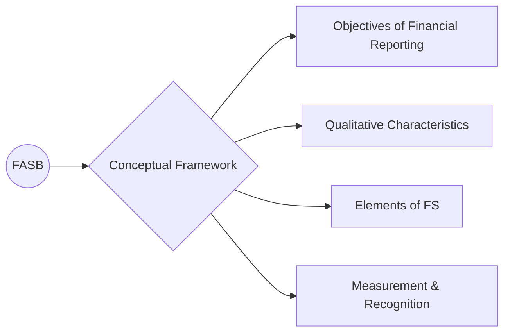
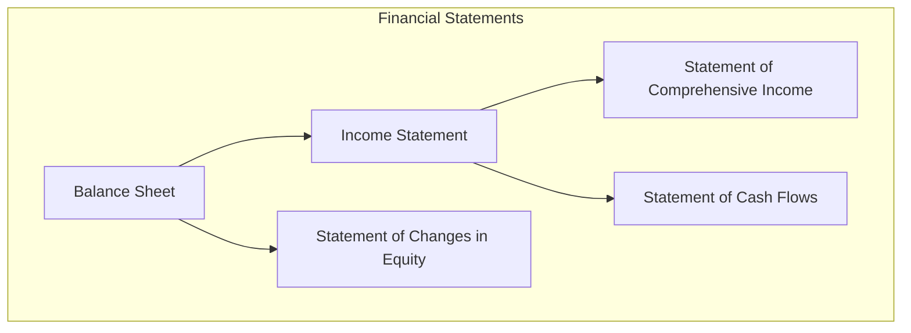

## 27.1 High-Level Summaries of FAR Concepts and Standards

This section provides the final summarized overview of critical Financial Accounting and Reporting (FAR) topics. Each bullet set offers concise recaps of main points, references the earlier chapters for deeper exploration, and highlights essential best practices. These summaries will serve as an excellent quick-reference tool as you consolidate your exam preparation.

---

### High-Level Summaries by Major FAR Area

#### Introduction to the CPA Exam Structure and FAR Overview  
- The CPA Exam includes four sections, and FAR is widely regarded as the most extensive.  
- FAR content addresses standards by the Financial Accounting Standards Board (FASB), select U.S. Securities and Exchange Commission (SEC) requirements, and key International Financial Reporting Standards (IFRS).  
- The exam comprises multiple-choice questions (MCQs) and task-based simulations; time management across these item types is critical.  
- Reference: Chapters 1 and 2 for more on exam format, methodology, and study strategies.

#### Conceptual Framework and Standard-Setting Environment  
- FASB serves as the primary private-sector standard-setter in the U.S., while the SEC enforces the securities laws and oversees public company reporting.  
- The FASB Conceptual Framework outlines objectives of financial reporting, qualitative characteristics of useful information (relevance, faithful representation, comparability, etc.), and definitions for elements of financial statements (assets, liabilities, equity, revenues, and expenses).  
- Recognizing and measuring assets and liabilities involves both historical cost and fair value principles, with disclosures enhancing transparency.  
- Reference: Chapter 2 for thorough discussions on roles of standard-setters and GAAP research.



#### General Purpose Financial Reporting for For-Profit Entities  
- The Balance Sheet (Statement of Financial Position) reports a company’s financial stance at a point in time, showcasing assets, liabilities, and equity.  
- The Income Statement measures operational performance, delineating revenues and expenses over a reporting period.  
- Other key statements include Comprehensive Income (capturing OCI items like unrealized gains/losses on investments), Changes in Equity, and the Statement of Cash Flows (showing cash movements in operating, investing, and financing activities).  
- Proper note disclosures provide context on accounting policies and related party transactions, driving clarity on the numbers presented.  
- Reference: Chapter 3 for advanced details and illustrative formats.



#### Financial Reporting for Nongovernmental Not-for-Profit Entities  
- Not-for-Profit (NFP) organizations follow unique reporting requirements focusing on net assets with and without donor restrictions.  
- The Statement of Activities (akin to the Income Statement) classifies revenues, gains, expenses, and changes in net assets based on the presence or lack of donor-imposed restrictions.  
- The Statement of Cash Flows still separates operational, investing, and financing activities, though certain inflows (e.g., contributions restricted for long-term purposes) require careful classification.  
- Reference: Chapter 4 for the intricacies of NFP financial statements and example disclosures.

#### State and Local Government Concepts  
- Governmental accounting uses different measurement focuses and bases of accounting (Current Financial Resources vs. Economic Resources, Modified Accrual vs. Full Accrual).  
- Three primary fund categories: Governmental (e.g., General Fund, Special Revenue), Proprietary (Enterprise, Internal Service), and Fiduciary (Custodial, Pension Funds).  
- Government-wide statements measure the broader economic resources approach, requiring consolidation and reconciliations to fund statements.  
- Budgetary accounting and encumbrance systems help track appropriations and pending obligations.  
- Reference: Chapter 5 for deep coverage of governmental fund types and reconciliations.

#### Public Company Reporting Topics  
- SEC registrants follow additional rules under the 1934 Act, including extensive disclosure in quarterly (Form 10-Q) and annual filings (Form 10-K).  
- Earnings per Share (EPS) can be basic or diluted; diluted EPS considers the impact of potential common shares (stock options, convertible securities).  
- Segment reporting requires disclosure of certain financial measures by operating segment, such as revenue, profit or loss, and assets.  
- Reference: Chapter 6 for specific calculation procedures and advanced SEC filing requirements.

```latex

\text{Basic EPS} = \frac{\text{Net Income} - \text{Preferred Dividends}}{\text{Weighted Average Common Shares Outstanding}}

```

#### Special Purpose Frameworks  
- Common non-GAAP bases include Cash Basis, Modified Cash Basis, and Tax Basis.  
- Internal-management or contractual basis reporting may focus on specific compliance (e.g., loan covenant calculations).  
- Practitioners must be mindful of disclosures attesting to the differences from GAAP and the rationale behind them.  
- Reference: Chapter 7 for typical presentations and potential compilation or review considerations.

#### Financial Statement Analysis, Ratios, and Performance Metrics  
- Horizontal analysis compares financial data across multiple periods; vertical analysis expresses financial statement items as percentages of a base amount (like total assets).  
- Key ratios include:  
  - Profitability Ratios (e.g., Net Profit Margin, Return on Equity).  
  - Liquidity Ratios (e.g., Current Ratio, Quick Ratio).  
  - Solvency Ratios (e.g., Debt to Equity, Times Interest Earned).  
- Non-GAAP measures (like EBITDA) can offer additional insights but require transparent reconciliation to GAAP figures.  
- Reference: Chapter 8 for deeper study of ratio interpretation.

```latex

\text{Current Ratio} = \frac{\text{Current Assets}}{\text{Current Liabilities}}

```

---

### Summaries of Select Balance Sheet Accounts

#### Cash and Cash Equivalents  
- Generally include currency on hand, demand deposits, and short-term highly liquid investments.  
- Bank reconciliations ensure proper matching of book versus bank balances.  
- Internal controls over cash handle safeguarding, segregation of duties, and restricted cash disclosures.  
- Reference: Chapter 9 for examples of safeguarding techniques.

#### Trade Receivables  
- Classification of receivables depends on collectibility or contractual arrangement; allowance for doubtful accounts addresses credit losses.  
- Factoring or pledging receivables requires special disclosures on the nature of risk transfer.  
- Reference: Chapter 10 for factoring vs. assignment nuances.  

#### Inventory  
- Entities may use periodic or perpetual inventory systems; cost flow assumptions (FIFO, LIFO, Weighted Average) impact cost of goods sold and value of inventory.  
- Valued at the lower of cost and either net realizable value or market (depending on GAAP requirements).  
- Mistakes in inventory can cascade to misstatements in net income and retained earnings across multiple periods.  
- Reference: Chapter 11 for advanced costing methods like retail inventory method.

#### Property, Plant, and Equipment (PP&E)  
- Costs incurred to acquire or construct tangible assets are capitalized; subsequent improvements may be capitalized if future economic benefits increase.  
- Depreciation methods range from straight-line to accelerated techniques like double-declining balance.  
- Impairment testing is triggered by changes in business environment or indicators of declining asset utility.  
- Reference: Chapter 12 for asset retirement obligations and disposal accounting.

#### Investments  
- Accounting depends on the classification: Trading (fair value, reported in earnings), Available-for-Sale (fair value, OCI adjustments), Held-to-Maturity (amortized cost if the intent is to hold to maturity).  
- Equity method investments require recognition of the investor’s proportionate share of the investee’s income or loss.  
- Reference: Chapter 13 for impairment triggers and disclosures.

#### Intangible Assets  
- Finite-lived intangibles (patents, licenses) are amortized; indefinite-lived intangibles (goodwill) are tested for impairment annually.  
- Goodwill arises in business combinations when the purchase consideration exceeds the fair value of identifiable assets and liabilities.  
- Reference: Chapter 14 for methods of impairment testing and internal-use software capitalization rules.

#### Payables and Accrued Liabilities  
- Accounts payable and accrued expenses reflect obligations for goods or services received but unpaid at period-end.  
- Asset retirement obligations (AROs) and exit/disposal liabilities involve present-value calculations of future costs.  
- Reference: Chapter 15 for classification nuances and best disclosure practices.

#### Debt (Financial Liabilities)  
- Bonds or notes payable may require discounts or premiums amortized over the life of the instrument.  
- Debt restructuring involves assessing concessions from creditors and the recognition of gains/losses for the debtor.  
- Reference: Chapter 16 for advanced coverage on covenant compliance and troubled debt restructurings.

#### Equity  
- Transactions involving stock issuance, treasury stock, dividends, and stock splits affect the equity section of the balance sheet.  
- Quasi-reorganizations and pushdown accounting require special revaluation of assets and liabilities to fair value.  
- Reference: Chapter 17 for advanced equity structures and disclosures.

---

### Summaries of Select Transactions

#### Accounting Changes and Error Corrections  
- Changes in accounting principle often require retrospective application (e.g., LIFO to FIFO), while estimates are handled prospectively.  
- Error corrections may need restatement of prior-period financial statements; transparency in footnotes is essential.  
- Reference: Chapter 18 for step-by-step guidance on retrospective restatements.

#### Contingencies and Commitments  
- Loss contingencies (e.g., lawsuits, warranty obligations) require accrual if probable and reasonably estimable, or disclosure if only reasonably possible.  
- Going concern disclosures highlight substantial doubts about an entity’s ability to continue operations for one year past financial statement issuance date.  
- Reference: Chapter 19 for strategies to evaluate commitments and contingencies effectively.

#### Revenue Recognition  
- FASB’s five-step revenue recognition model:  
  1) Identify the contract.  
  2) Identify performance obligations.  
  3) Determine transaction price.  
  4) Allocate price to obligations.  
  5) Recognize revenue upon satisfaction of each obligation.  
- Complexities arise with variable consideration, principal vs. agent classification, and timing of revenue recognition (point in time vs. over time).  
- Reference: Chapter 20 for real-world contract scenarios.

#### Accounting for Income Taxes  
- Current tax expense or benefit arises from the current-year taxable income; deferred tax items stem from temporary differences.  
- Net operating loss (NOL) carryforwards, uncertain tax positions (FIN 48 / ASC 740-10) require detailed disclosures.  
- Valuation allowances reduce deferred tax assets if future realization is uncertain.  
- Reference: Chapter 21 for advanced deferred tax calculation exercises.

#### Fair Value Measurement  
- Fair value is the price to sell an asset or transfer a liability in an orderly transaction.  
- The valuation approach can be market-based, cost-based, or income-based, with a hierarchy of inputs (Level 1, 2, 3).  
- Disclosures emphasize the valuation techniques and unobservable inputs used.  
- Reference: Chapter 22 for examples of fair value measurement in complex contexts.

#### Leases  
- Lessee accounting classifies leases as finance or operating based on transfer of control and ownership considerations, requiring right-of-use assets and lease liabilities.  
- Lessor accounting includes sales-type, direct financing, or operating leases.  
- Sale-leaseback transactions involve de-recognition of the asset and recognition of a lease liability if specific criteria are met.  
- Reference: Chapter 23 for the intricacies of capitalization thresholds and disclosures.

#### Subsequent Events  
- Recognized subsequent events provide additional evidence about conditions that existed at the balance sheet date, necessitating adjustments.  
- Nonrecognized subsequent events indicate new conditions and require disclosure but not adjustment.  
- Reference: Chapter 24 for deadlines and best practice disclosures.

---

### IFRS Comparisons and Advanced Applications

#### IFRS Overview and Key Differences from U.S. GAAP  
- IFRS interprets the conceptual framework differently, particularly in defining control, revenue recognition timing, and principles-based guidelines.  
- Notable areas of divergence include inventory costing (LIFO is not permitted under IFRS), treatment of development costs (capitalized under specific conditions), and revaluation models for PP&E.  
- Reference: Chapter 25 for a point-by-point comparison on recognition, measurement, and disclosure variations.

#### Complex Illustrations, Case Studies, and Practice Scenarios  
- Consolidations and business combinations often pose challenges with intercompany eliminations, noncontrolling interests, and goodwill recognition.  
- Foreign currency accounting differentiates between translation vs. remeasurement based on functional currency considerations.  
- Chapter 26 covers immersive case studies integrating multiple FAR concepts, pushing deeper critical thinking skills.

---

### Practical Examples and Common Pitfalls

- **Timing of Revenue**: Many entities struggle with determining when control passes to the customer. A typical pitfall is recording revenue too early before the performance obligation is satisfied (Chapter 20).  
- **Inventory Errors**: Mistakes in counting or valuing inventory easily roll forward, affecting net income in the subsequent period. Double-check inventory counts and cost flow assumptions (Chapter 11).  
- **Profitability Ratios**: Over-reliance on a single ratio (e.g., Gross Profit Margin) without examining solvency or liquidity can lead to incomplete analysis. Always pair ratio analysis with thorough footnote reading (Chapter 8).  
- **Governmental Fund Accounting**: Confusion between modified accrual (fund statements) and full accrual (government-wide statements) can lead to incorrect classification and missed reconciliation items (Chapter 5).  
- **IFRS vs. GAAP**: Neglecting IFRS differences in areas like intangible assets or revaluation of PP&E can cause global reporting inconsistencies (Chapter 25).

---

### Final Reminders and Best Practices

- Create a structured review schedule, revisiting each major area (conceptual framework, financial reporting, specific accounts, and transactions).  
- Include practice questions and simulations that replicate exam complexity.  
- Continuously test your knowledge of Journal Entries—underheading many FAR topics.  
- Leverage summary notes promptly before the exam to reinforce conceptual understanding.  
- Stay aware of ongoing updates to FASB standards and the SEC environment, as the profession is constantly evolving.

---

## Mastering FAR Concepts: Quick-Reference Quiz



### Which statement best describes the primary objective of financial reporting under FASB's Conceptual Framework?

- [ ] To minimize regulatory burdens for companies.
- [ ] To comply with SEC filing requirements.
- [x] To provide useful information to investors, creditors, and other users.
- [ ] To present information on nonfinancial data only.

> **Explanation:** The primary objective is to provide relevant and faithfully represented information for decision-making by investors, creditors, and users.

### Which of the following is a key characteristic of governmental accounting?

- [ ] Use of IFRS for government-wide reporting.
- [x] Modified accrual accounting for governmental funds.
- [ ] Elimination of fund structure for all reporting.
- [ ] Mandatory only for large municipalities.

> **Explanation:** Governmental funds follow modified accrual, focusing on current financial resources. This is different from the full accrual basis used in government-wide statements.

### Under the new revenue recognition model, "load testing" of IT services provided on an hourly basis is recognized as revenue:

- [x] Over time, consistent with hours worked or progress toward completion.
- [ ] Only at the contract’s conclusion.
- [ ] In full at contract inception.
- [ ] On a single date once all performance obligations have been identified.

> **Explanation:** Performance obligations are satisfied over time when the customer simultaneously receives and consumes the benefits as the service is performed.

### Which ratio is most useful to assess a company’s liquidity position?

- [x] Current Ratio.
- [ ] Return on Equity (ROE).
- [ ] Earnings Per Share (EPS).
- [ ] Times Interest Earned.

> **Explanation:** The Current Ratio (Current Assets / Current Liabilities) helps evaluate the company’s ability to cover short-term obligations.

### In lease accounting for a lessee, how is a finance lease distinguished from an operating lease under U.S. GAAP?

- [x] Based on transfer of control or ownership-like characteristics.
- [ ] Based solely on the economic life of the leased asset.
- [x] Based on present value exceeding substantially all of the asset’s fair value.
- [ ] Based on management intent to purchase the asset.

> **Explanation:** If any one of five criteria is met (e.g., transfer of ownership, bargain purchase option, major part of useful life, present value of payments ~ all of asset's fair value, or specialized asset), it’s generally a finance lease.

### When correcting a material error in previously issued financial statements:

- [x] A restatement of prior-period financial statements is required.
- [ ] It is treated as a change in accounting principle.
- [ ] Only disclosure is needed without any adjustments.
- [ ] The error is accounted for prospectively.

> **Explanation:** GAAP requires retrospective restatement for error corrections to ensure comparability and transparency for users.

### Which of the following is a leading difference between IFRS and U.S. GAAP regarding inventories?

- [x] IFRS prohibits the LIFO cost flow assumption.
- [ ] IFRS classifies all inventory as finished goods.
- [x] IFRS allows revaluation of inventories above original cost.
- [ ] U.S. GAAP does not allow standard costing methods.

> **Explanation:** IFRS does not allow LIFO. It also permits inventory write-down reversals if conditions that caused the impairment no longer exist, though not typically allowing revaluation above original cost for most items.

### If common stock is issued at a price above par, the excess over par:

- [x] Is credited to Additional Paid-in Capital.
- [ ] Reduces retained earnings.
- [ ] Is recorded as a revenue item.
- [ ] Is disclosed only in the footnotes.

> **Explanation:** Proceeds in excess of par value go to Additional Paid-in Capital (APIC) under equity.

### The main purpose of the Management’s Discussion & Analysis (MD&A) section in governmental reporting is to:

- [x] Provide an overview of the government’s financial activities and outlook.
- [ ] Report new GAAP pronouncements.
- [ ] Disclose legal matters separately from the Notes.
- [ ] Calculate the entity’s ratio analysis.

> **Explanation:** MD&A gives users an objective and easily readable analysis of the government's financial activities based on currently known facts and conditions.

### True or False: A fair value measurement under ASC 820 always relies solely on Level 1 inputs, such as quoted market prices in active markets.

- [x] True
- [ ] False

> **Explanation:** Level 1 inputs are the highest priority under the fair value hierarchy, but an entity may use Level 2 or Level 3 inputs if observable, identical Level 1 inputs are unavailable, or if the asset/liability is not actively traded.



---

## For Additional Practice and Deeper Preparation

**[FAR CPA Hardest Mock Exams: In-Depth & Clear Explanations](https://www.udemy.com/course/far-cpa-mock-exams/?referralCode=F88050F8D5C76764F6BD)**  

**Financial Accounting and Reporting (FAR) CPA Mocks:** 6 Full (1,500 Qs), Harder Than Real! In-Depth & Clear. Crush With Confidence! 

- Tackle full-length mock exams designed to mirror real FAR questions.  
- Refine your exam-day strategies with detailed, step-by-step solutions for every scenario.  
- Explore in-depth rationales that reinforce higher-level concepts, giving you an edge on test day.  
- Boost confidence and minimize anxiety by mastering every corner of the FAR blueprint.  
- Perfect for those seeking exceptionally hard mocks and real-world readiness.  

_Disclaimer: This course is not endorsed by or affiliated with the AICPA, NASBA, or any official CPA Examination authority. All content is for educational and preparatory purposes only._
